# 제 10장 유저의 수정, 표시, 삭제

이번 챕터에서는 User리소스용의 REST액션 중, 지금까지 구현하지 않았던 `edit`, `update`, `index`, `destroy` 액션을 구현해보고, REST 액션을 완성할 것 입니다. 이번 챕터에서는 우선 유저가 자신의 프로필을 자신이 수정할 수 있도록 해보겠습니다. 여기서 [제 8장](Chapter8.md) 에서 구현한 인증용 코드를 사용해볼텐데요, *인증 모델(Authorization Model)* 에 대해 설명할 수 있는 자연스러운 계기가 될 것 입니다. 그 다음으로, 모든 유저의 리스트를 볼 수 있게 할 것입니다. (물론 이것도 인증이 필요합니다.) 이것은 샘플 데이터로써 페이지네이션 (pagination) 을 도입해보는 계기가 될 것입니다. 유저의 삭제는 모든 유저에게 권한이 있는 것이 아니기 때문에, 관리유저라고 하는 특별한 클래스를 작성하고, 이 유저만이 삭제를 할 수 있도록 해볼 것입니다.

## 10.1 유저를 Update해보자

유저의 정보를 편집하는 패턴은, 신규 유저의 생성과 매우 닮아있습니다. ([제 7장](Chapter7.md)) 신규 유저용의 뷰를 출력하는 `new` 액션과 마찬가지로, 유저를 수정하기 위한 `edit` 액션을 생성하면 될 것입니다. POST 리퀘스트에 응답하는 `create` 액션 대신에, PATCH 리퀘스트에 응답하는 `update` 액션을 생성합니다. ([컬럼 3.2](Chapter3.md#컬럼32-GET이나-그-외-다른-HTTP-메소드에-대해)) 제일 큰 차이점은, 유저 등록은 누구나 할 수 있습니다만, 유저의 정보를 수정하는 것은 해당 유저 자신에게만 한정되어있다는 점입니다. [제 8장](Chapter8.md) 에서 구현한 인증기능을 사용하면, *before filter* 를 사용하여 이러한 액세스 제어를 구현할 수 있습니다.


그럼 일단 언제나처럼 `updating-users` 라고하는 토픽 브랜치를 생성해봅시다.

`$ git checkout -b updating-users`


### 10.1.1 유저 정보 수정 Form

일단 유저의 정보를 수정하는 Form부터 생성해봅시다. 목업은 아래의 그림과 같습니다. 아래 목업을 움직이는 페이지로 만들기 위해서는, User 컨트롤러에 `edit` 액션을 추가하고, 해당 액션에 대응하는 `edit` 뷰를 구현할 필요가 있습니다. `edit` 액션의 구현부터 시작해보겠습니다. 여기서는 데이터베이스로부터 적절한 유저 데이터를 읽어들일 필요가 있습니다. 여기서 주의해야할 점으로는, 이전 7장에서는, 유저 정보 수정 페이지의 올바른 URL이 /users/1/edit 라고 하는 점입니다. (유저의 id가 1일 경우.) 유저의 id는 `params[:id]` 변수로 읽어들일 수 있습니다. 즉, 아래의 코드를 사용하면 유저를 지정할 수 있습니다.

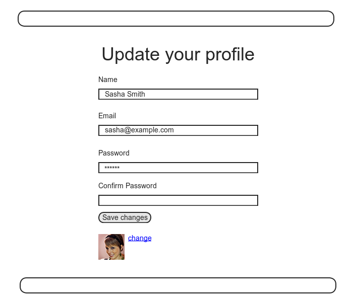

```ruby
# app/controllers/users_controller.rb
class UsersController < ApplicationController

  def show
    @user = User.find(params[:id])
  end

  def new
    @user = User.new
  end

  def create
    @user = User.new(user_params)
    if @user.save
      log_in @user
      flash[:success] = "Welcome to the Sample App!"
      redirect_to @user
    else
      render 'new'
    end
  end

  #추가
  def edit
    @user = User.find(params[:id])
  end
  #추가

  private

    def user_params
      params.require(:user).permit(:name, :email, :password,
                                   :password_confirmation)
    end
end
```

유저 정보 수정 페이지에 대응하는 뷰는 아래와 같습니다. (이 파일은 수동으로 생성할 필요가 있습니다.) 이 코드가 이전 7장에서 보았던 코드와 매우 닮아있는 것을 떠올려보세요. 중복된 곳이 많다는 것은, 이러한 코드의 반복을 파셜로 한꺼번에 묶을 수 있다는 점입니다. 이번에는 파셜에 정리하는 작업은 연습문제로 내보겠습니다.

```erb
<!--  app/views/users/edit.html.erb -->

<% provide(:title, "Edit user") %>
<h1>Update your profile</h1>

<div class="row">
  <div class="col-md-6 col-md-offset-3">
    <%= form_for(@user) do |f| %>
      <%= render 'shared/error_messages' %>

      <%= f.label :name %>
      <%= f.text_field :name, class: 'form-control' %>

      <%= f.label :email %>
      <%= f.email_field :email, class: 'form-control' %>

      <%= f.label :password %>
      <%= f.password_field :password, class: 'form-control' %>

      <%= f.label :password_confirmation, "Confirmation" %>
      <%= f.password_field :password_confirmation, class: 'form-control' %>

      <%= f.submit "Save changes", class: "btn btn-primary" %>
    <% end %>

    <div class="gravatar_edit">
      <%= gravatar_for @user %>
      <a href="http://gravatar.com/emails" target="_blank">change</a>
    </div>
  </div>
</div>
```

위 코드는, 이전 [7.3](Chapter7.md#73-유저-등록-실패) 에서 도입한 `error_messages` 파셜을 재이용합니다. 여기서 Gravatar로의 링크에서, `target="_blank"` 가 쓰이고 있는데, 이것을 사용하면 링크가 새로운 탭(혹은 윈도우) 로 열리기 때문에, 별도의 Web사이트로의 링크를 만들 때 유용합니다. (단, `target="_bank"` 에는 보안상의 작은 문제가 있습니다. 자세하게는 연습문제에서 다루어보겠습니다.)


`edit` 액션의 `@user` 인스턴스변수를 사용하면, 유저 정보 수정 페이지가 제대로 표시될 것입니다. "Name" 이나 "Email" 의 부분을 보면, Rails에 의하여 이름이나 메일주소의 필드에 값이 자동적으로 입력되어있는 것을 알 수 있습니다. 이것은 `@user` 변수의 속성정보로부터 읽어들인 값입니다.

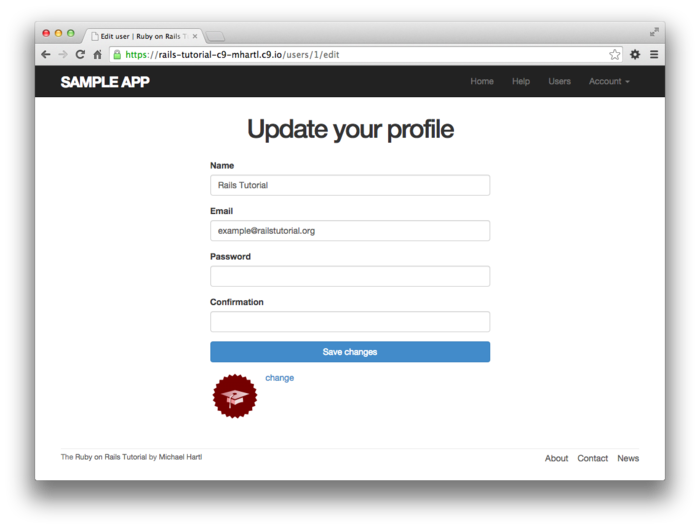

위 화면의 HTML 소스를 확인해보면, 조금은 다른 부분도 있습니다만 대부분의 코드는 보통의 form태그와 마찬가지로 표시됩니다.

```html

<form accept-charset="UTF-8" action="/users/1" class="edit_user"
      id="edit_user_1" method="post">
  <input name="_method" type="hidden" value="patch" />
  .
  .
  .
</form>
```

다음 입력 필드에 hidden 속성을 주목해주세요.

```html
<input name="_method" type="hidden" value="patch" />
```

Web 브라우저는 네이티브에서는 PATCH 리퀘스트 (REST 관습으로서 요구되는) 를 송신할 수 없기에, Rails에서는 POST 리퀘스트와 hidden input 필드를 이용하여 PATCH 리퀘스트를 "위조" 하고 있습니다.


여기서 한 가지 미묘한 점을 지적하고자 합니다. `form_for(@user)` 의 코드는, 이전 7장에서 보았던 코드와 *완전하게*  일치합니다. 그렇다고 한다면, Rails에서는 어떻게 신규 유저용의 POST 리퀘스트와 기존 유저의 정보 편집용의 PATCH 리퀘스트를 구별할 수 있는 것일까요? 그 답으로는, Rails에서는 유저가 신규 유저인지, 데이터베이스에 존재하는 기존 유저인지를 Active Record의 `new_record?` 논리값 메소드를 사용하여 구별하기 때문입니다.

```ruby
$ rails console
>> User.new.new_record?
=> true
>> User.first.new_record?
=> false
```

Rails에서는 `form_for(@user)` 를 사용하여 폼을 구성하면, `@user.new_record?` 가 `true` 가 되어 POST를, 그렇지 않으면 `false` 가 되어 PATCH를 사용하게 됩니다.


이 작업의 마지막으로, 네비게이션바에 있는 유저 정보 설정으로의 링크를 수정해봅시다. `edit_user_path` 라고 하는 named root와, 9장에서 정의한 `current_user` 라고하는 헬퍼 메소드를 사용하면, 간단하게 구현할 수 있습니다.

`<%= link_to "Settings", edit_user_path(current_user) %>`

완전한 어플리케이션 코드는 아래와 같습니다.

```erb
<!-- app/views/layouts/_header.html.erb -->

<header class="navbar navbar-fixed-top navbar-inverse">
  <div class="container">
    <%= link_to "sample app", root_path, id: "logo" %>
    <nav>
      <ul class="nav navbar-nav navbar-right">
        <li><%= link_to "Home", root_path %></li>
        <li><%= link_to "Help", help_path %></li>
        <% if logged_in? %>
          <li><%= link_to "Users", '#' %></li>
          <li class="dropdown">
            <a href="#" class="dropdown-toggle" data-toggle="dropdown">
              Account <b class="caret"></b>
            </a>
            <ul class="dropdown-menu">
              <li><%= link_to "Profile", current_user %></li>
 <!-- 추가하는 코드 -->
              <li><%= link_to "Settings", edit_user_path(current_user) %></li>
<!-- 추가하는 코드 -->             
              <li class="divider"></li>
              <li>
                <%= link_to "Log out", logout_path, method: :delete %>
              </li>
            </ul>
          </li>
        <% else %>
          <li><%= link_to "Log in", login_path %></li>
        <% end %>
      </ul>
    </nav>
  </div>
</header>
```

##### 연습

1. 앞서 언급했다시피, `target="_blank"` 는 새로운 페이지로 접속할 때에는 보안상의 작은 문제가 있습니다. 링크 사이트가 HTML 문서의 `window` 오브젝트를 핸들링한다는 점입니다. 구체적으로는 [*피싱 (Phising)*](https://ja.wikipedia.org/wiki/フィッシング_(詐欺)) 사이트와 같은, 악의적인 컨텐츠가 우리 컴퓨터에 들어올 가능성이 있습니다. Gravatar와 같은 유명한 사이트에서는 이러한 사태를 방지하고 있을 것이라 생각합니다만, 만에 하나를 대비하여 [이러한 보안상의 위험](http://lmgtfy.com/?q=target+_blank+security) 을 배제해봅시다. 대처방법으로는 링크용의 `a` 태그의 `rel`(relationship) 속성에 `"noopener"` 를 설정하면 됩니다. 그럼 바로 Gravatar의 편집용 페이지 링크에 설정해봅시다.

2. 파셜을 이용하여  `new.html.erb` 뷰와 `edit.html.erb` 뷰를 리팩토링해봅시다. (코드의 중복을 삭제해봅시다.) *힌트*: [3.4.3](Chapter3.md#343-레이아웃과-html에-직접-쓰는-Ruby-Refactor) 에서 사용한 `provide` 메소드를 사용하면, 중복을 제거할 수 있습니다. (관련된 7장의 연습 문제를 이미 풀었다면, 이 연습 문제를 제대로 풀지 못할 가능성이 있습니다. 제대로 풀지 못한다면, 기존의 코드의 어느 부분에 차이가 있는지 생각해가면서 코드를 확인해봅시다. 예를 들어 필자라면 아래의 코드에서 사용한 변수를 넘기는 테크닉을 사용하여 아래 두 번째 코드나 세 번째 코드에 필요한 URL을 아래 첫 번째 코드에서 입력해보도록 합시다.)

   ```erb
   <!-- app/view/users/_form.html.erb -->
   <%= form_for(@user) do |f| %>
     <%= render 'shared/error_messages', object: @user %>
   
     <%= f.label :name %>
     <%= f.text_field :name, class: 'form-control' %>
   
     <%= f.label :email %>
     <%= f.email_field :email, class: 'form-control' %>
   
     <%= f.label :password %>
     <%= f.password_field :password, class: 'form-control' %>
   
     <%= f.label :password_confirmation %>
     <%= f.password_field :password_confirmation, class: 'form-control' %>
   
     <%= f.submit yield(:button_text), class: "btn btn-primary" %>
   <% end %>
   ```

```erb
<!-- app/views/users/new.html.erb -->
<!-- signup페이지의 파셜 -->
<% provide(:title, 'Sign up') %>
<% provide(:button_text, 'Create my account') %>
<h1>Sign up</h1>
<div class="row">
  <div class="col-md-6 col-md-offset-3">
    <%= render 'form' %>
  </div>
</div>
```

```erb
<!-- app/views/users/edit.html.erb -->
<!-- edit페이지의 파셜 -->
<% provide(:title, 'Edit user') %>
<% provide(:button_text, 'Save changes') %>
<h1>Update your profile</h1>
<div class="row">
  <div class="col-md-6 col-md-offset-3">
    <%= render 'form' %>
    <div class="gravatar_edit">
      <%= gravatar_for @user %>
      <a href="http://gravatar.com/emails" target="_blank">Change</a>
    </div>
  </div>
</div>
```

### 10.1.2 유저 정보 수정의 실패

이번 섹션에서는 [7.3](Chapter7.md#73-유저-등록-실패) 의 유저 등록에 실패했을 때와 비슷한 방법으로, 정보 수정에 실패했을 경우에 대해서 다루어 보도록 하겠습니다. 우선은 `update` 액션을 작성해보겠습니다. 이것은 6장에서 살짝 다루어 보았습니다만, `update_attributes` 를 사용하여 송신되어진 `params` 해시값을 기반으로하여 유저 정보를 갱신합니다. 무효한 정보가 송신되어졌을 경우, 유저 정보 갱신의 결과로써 `false` 가 리턴되고, `else` 분기에 의해 정보 수정 페이지로 리다이렉트합니다. 이러한 패턴은 이전에도 다루어본 적이 있을 것입니다. 이 구조는 `create` 액션의 7장에서의 제일 첫 번째 버전과 매우 닮아 있습니다.

```ruby
# app/controllers/users_controller.rb
class UsersController < ApplicationController

  def show
    @user = User.find(params[:id])
  end

  def new
    @user = User.new
  end

  def create
    @user = User.new(user_params)
 # update 액션은 이 부분과 매우 닮아 있습니다.
    if @user.save
      log_in @user
      flash[:success] = "Welcome to the Sample App!"
      redirect_to @user
    else
      render 'new'
    end
  # update 액션은 이 부분과 매우 닮아 있습니다.   
  end

  def edit
    @user = User.find(params[:id])
  end
#추가
  def update
    @user = User.find(params[:id])
    if @user.update_attributes(user_params)
      # 정보 수정에 성공 했을 때의 처리를 기술한다.
    else
      render 'edit'
    end
  end
#추가
  private

    def user_params
      params.require(:user).permit(:name, :email, :password,
                                   :password_confirmation)
    end
end
```

`update_attributes` 을 호출할 때, `user_params` 를 사용하고 있는 것을 확인해주세요. [7.3.2](Chapter7.md#732-Strong-Parameters) 에서 설명드렸다시피, 여기서는 Strong Parameters를 사용하여 불필요한 정보의 침입을 방지하고 있습니다.


User 모델의 Validation과 에러 메세지의 Partial은 이미 존재하기 때문에, 무효한 정보를 송신하면 도움되는 에러 메세지가 표시되도록 되어 있습니다.

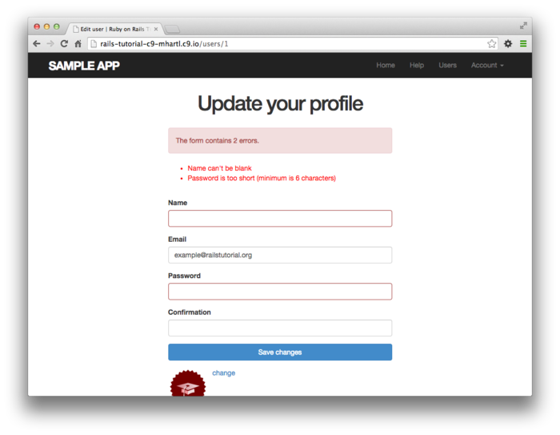

##### 연습

1. 정보 수정 Form으로부터 유효하지 않은 유저 이름이나 메일주소, 패스워드를 사용하여 송신한 경우, 수정에 실패하는 것을 확인해봅시다.


### 10.1.3 Update 실패시의 테스트

[10.1.2](#1012-유저-정보-수정의-실패) 에서는 정보 수정 Form의 실패 시 처리를 구현해보았습니다. 그 다음으로는 [컬럼 3.3](Chapter3.md#컬럼33-결국-테스트는-언제-하는-것이-좋은가) 에서 설명한 테스트의 가이드라인에 따라, 에러를 검출하기 위한 통합 테스트 코드를 작성해봅시다. 언제나처럼 통합 테스트를 생성하는 부분부터 시작해봅시다.

```
$ rails generate integration_test users_edit
      invoke  test_unit
      create    test/integration/users_edit_test.rb
```

제일 처음으로는 정보 수정 실패 시의 간단한 테스트를 추가해보겠습니다. 아래 테스트 코드에서는 우선 정보 수정 페이지로 접속하여, edit 뷰가 제대로 출력되는지를 체크하고 있습니다. 그 후, 무효한 정보를 송신하여 edit뷰로 다시 리다이렉트되는지를 체크합니다. 여기서 `PATCH` 리퀘스트를 보내기 위해 patch 메소드를 사용하고 있는 것을 확인해주세요. 이것은 get이나 post, delete 메소드와 마찬가지로, HTTP 리퀘스트를 송신하기 위한 메소드입니다.

```ruby
# test/integration/users_edit_test.rb
require 'test_helper'

class UsersEditTest < ActionDispatch::IntegrationTest

  def setup
    @user = users(:michael)
  end

  test "unsuccessful edit" do
    get edit_user_path(@user)
    assert_template 'users/edit'
    patch user_path(@user), params: { user: { name:  "",
                                              email: "foo@invalid",
                                              password:              "foo",
                                              password_confirmation: "bar" } }

    assert_template 'users/edit'
  end
end
```

위 코드로 테스트를 실행해보면 통과할 것입니다.

`$ rails test`

##### 연습

1. 위 테스트 코드에서 단 한 줄을 추가하여 올바른 *갯수* 의 에러 메세지가 표시되는지 테스트를 해봅시다. *힌트* : 이전 5장에서 소개해드린 `assert_select` 를 사용하여 `alert` 클래스의 `div` 태그를 찾아내어, "The form contains 4 errors." 라고 하는 텍스트를 확인해봅시다.


### 10.1.4 TDD로 정보 수정을 성공시켜보자.

이번에는 정보 수정 Form이 제대로 동작하게끔 해봅시다. 프로필 이미지의 수정은, 이미지 업로드를 Gravatar에 맡기고 있기에 이미 동작하고는 있습니다. 이미지 옆에 [change] 링크를 클릭하면, 아래와 같이 Gravatar를 수정할 수 있습니다. 그럼 이 외의 기능을 구현해봅시다.

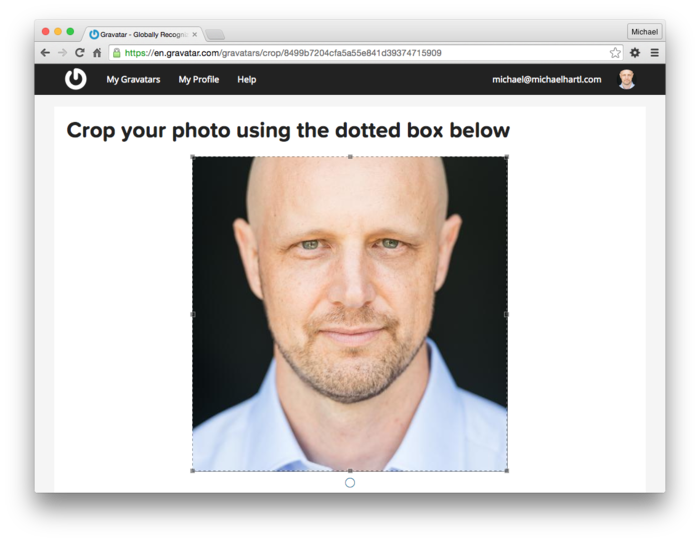

이즈음 되면, 보다 더 쾌적하게 테스트를 하기 위해서는 어플리케이션 용의 코드를 "구현 하기 전에" 통합 테스트 코드를 작성하는 것이 편리하다고 느낀 독자들이 있을 수도 있습니다. 실제로 그러한 테스트는 *Acceptance Test* 라고 불리기도 하며, 어떠한 기능의 구현을 완료하고 유저에게 납품가능한 상태인지 아닌지를 결정하는 테스트로써 알려져 있습니다. 이 것을 경험해보기 위해서 이번에는 테스트 주도 개발을 통해 유저의 편집 기능을 구현해보도록 하겠습니다.


우선 `users_edit_test.rb` 코드를 참고하여, 유저 정보를 수정하는 올바른 동작 및 순서를 테스트에서 정의합니다. (이번에는 유효한 정보를 송신하도록 수정해봅니다.) 다음으로는 flash 메세지가 비어있는지 아닌지와, 프로필 페이지에 리다이렉트되는지 아닌지를 체크합니다. 또한 데이터베이스 내의 유저 정보가 제대로 변경되는지를 검증해봅니다. 작성한 코드는 아래와 같습니다. 이 때 아래 코드의 패스워드와 패스워드확인이 비어있는 것을 확인해주세요. 유저 이름과 메일 주소를 편집할 때에 매번 패스워드를 입력하는 것은 불편한 일이기 때문에 (패스워드를 변경할 필요가 없는 때에는) 패스워드를 입력하지 않고 업데이트할 수 있으면 편리할 것입니다. 또한 [6.1.5](Chapter6.md#615-User-Object를-수정해보자) 에서 소개한 `@user.reload` 를 사용하여 데이터베이스로부터 최신의 유저 정보를 읽어 들이고, 제대로 갱신되었는지를 확인할 수 있는 점도 확인해주세요. (이러한 올바른 처리는 보통 까먹는게 보통이긴 하지만, UAT에는 먼저 테스트를 작성하기 때문에, 효과적인 UX에 대해 생각해볼 수 있는 기회가 됩니다.)

```ruby
# test/integration/users_edit_test.rb
require 'test_helper'

class UsersEditTest < ActionDispatch::IntegrationTest

  def setup
    @user = users(:michael)
  end
  .
  .
  .
  test "successful edit" do
    get edit_user_path(@user)
    assert_template 'users/edit'
    name  = "Foo Bar"
    email = "foo@bar.com"
    patch user_path(@user), params: { user: { name:  name,
                                              email: email,
                                              password:              "",
                                              password_confirmation: "" } }
    assert_not flash.empty?
    assert_redirected_to @user
    @user.reload
    assert_equal name,  @user.name
    assert_equal email, @user.email
  end
end
```

테스트를 통과할 필요가 있는 아래의 코드에서의 `update` 액션은, `create` 액션과 거의 비슷합니다.

```ruby
# app/controllers/users_controller.rb
class UsersController < ApplicationController
  .
  .
  .
  def update
    @user = User.find(params[:id])
    if @user.update_attributes(user_params)
      flash[:success] = "Profile updated"
      redirect_to @user
    else
      render 'edit'
    end
  end
  .
  .
  .
end
```

사실 위 코드는 아직 테스트를 통과하지 못하는 상태입니다. 패스워드의 길이에 대한 validation이 있기 때문에, 패스워드나 패스워드 확인란을 비워놓은 채로 테스팅을 하면, 이 validation에 걸립니다. 테스트를 성공시키기 위해서는 패스워드 validation에 대해서, 패스워드가 입력되지 않았을 때의 예외처리를 더할 필요가 있습니다. 이러한 때에 편리한 `allow_nil:true` 라는 옵션이 있습니다. 이것을 `validates` 에 추가해봅시다.

```ruby
# app/models/user.rb

class User < ApplicationRecord
  attr_accessor :remember_token
  before_save { self.email = email.downcase }
  validates :name, presence: true, length: { maximum: 50 }
  VALID_EMAIL_REGEX = /\A[\w+\-.]+@[a-z\d\-.]+\.[a-z]+\z/i
  validates :email, presence: true, length: { maximum: 255 },
                    format: { with: VALID_EMAIL_REGEX },
                    uniqueness: { case_sensitive: false }
  has_secure_password
  validates :password, presence: true, length: { minimum: 6 }, allow_nil: true #추가
  .
  .
  .
end
```

위 코드에 의해서 신규 유저 등록 시의 빈 패스워드가 유효하게 되어버리는 것은 아닌지 걱정하는 분도 있을 수도 있습니다만, 그럴 일은 없습니다. [6.3.3](Chapter6.md#633-비밀번호의-최소-문자수) 에서 설명했듯이, `has_secure_password` 에서는 (추가한 validation과 별도로) 오브젝트 생성 시의 존재여부를 검증하게끔 되어 있기 때문에, 빈 패스워드 (`nil`) 이 신규 유저 등록 시에 유효하게 될 일은 없습니다. (빈 패스워드를 입력하면 존재성의 validation과 `has_secure_password` 에 의한 validation이 서로 실행되어, 2개의 같은 에러 메세지가 표시되는 버그가 있습니다만,([7.3.3](Chapter7.md#733-에러-메세지)) 이 것으로 해결되었습니다.)


이 코드를 추가한 것으로 인하여, 유저 정보 수정 페이지가 정상적으로 동작하게 되었습니다. 모든 테스트를 실행시켜 통과하는 것을 확인해보세요.

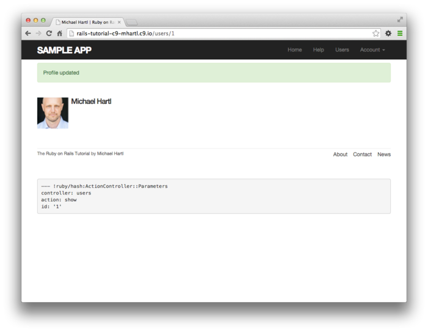

##### 연습

1. 실제로 유저 정보의 수정이 제대로 되는지 확인해봅시다.
2. 만약 Gravatar와 연결되지 않은, 적당한 메일주소(foobar@example.com 등) 으로 변경하는 경우, 프로필 영상은 어떻게 표시됩니까? 실제로 수정 Form에 메일 주소를 변경하여 확인해봅시다.


## 10.2 권한 부여 (Authorization)

웹 어플리케이션의 문맥에서는 *인증(Authentication)* 은 사이트의 유저를 식별하기 위함이고, *권한 부여(authorization)* 는 해당 유저가 실행가능한 조작을 관리하는 것입니다. [제 8장](Chapter8.md) 에서 인증시스템을 구축한 것으로, 권한 부여를 위한 시스템을 구현할 준비도 되었습니다.


[10.1](Chapter10.md#101-유저를-수정해보자) 의 edit액션과 update액션은 이미 완전하게 동작하고 있습니다만, 보안상의 큰 문제가 하나 있습니다. 어느 유저라도 모든 액션에 접근할 수 있기 때문에, 누구나 (로그인해있지 않은 유저도) 유저 정보를 편집할 수 있습니다. 이번 섹션에서는 유저에게 로그인을 요구하고, 자신 이외의 유저 정보를 변경할 수 없게 제어할 수 있게 해봅니다. (이러한 보안상의 제어기능을 *보안 모델* 이라고 부릅니다.) 


10.2.1에서는 로그인하지 않은 유저가 제한된 페이지로 액세스하려고 할 때에 대해 대응해봅니다. 이러한 케이스는 어플리케이션을 사용하면 보통 있을 수 있기 때문에, 로그인 페이지로 리다이렉트하고 알기 쉬운 메세지도 표시할 수 있게 해봅니다. 목업은 아래와 같습니다. 한 편으로는 허가되지 않은 페이지에 대해서 접근하려고 하는 로그인이 끝난 유저가 있다면, (예를 들어 타인의 유저 정보 편집 페이지에 접속하려고 한다면) 루트URL로 리다이렉트하게끔 해봅니다.(10.2.2)

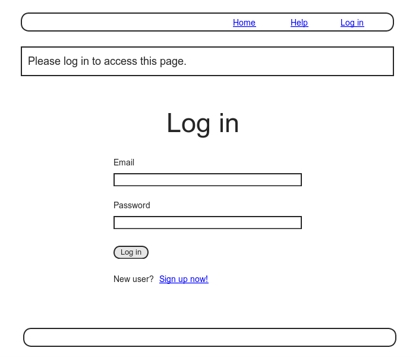


### 10.2.1 유저에게 로그인을 요청해보자

위 목업과 같이, 리다이렉트하는 구조를 구현하고 싶을 때에는 Users 컨트롤러 안에서 *before filter* 를 사용합니다. before 필터는 `before_action` 메소드를 사용하고 어떠한 처리가 실행되는 직전에 특정 메소드를 실행시키는 구조입니다. 이번에는 유저에게 로그인을 요청하기 위해, 아래 코드처럼  `logged_in_user` 메소드를 구현하고,  `before_action :logged_in_user` 이라고 하는 형식으로 사용합니다.

```ruby
# app/controllers/users_controller.rb
class UsersController < ApplicationController
  # 추가
  before_action :logged_in_user, only: [:edit, :update]
  .
  .
  .
  private

    def user_params
      params.require(:user).permit(:name, :email, :password,
                                   :password_confirmation)
    end

    # before 액션

    # 로그인한 유저인지를 확인
    def logged_in_user
      unless logged_in?
        flash[:danger] = "Please log in."
        redirect_to login_url
      end
    end
end
```

 디폴트로는 before 필터는 컨트롤러 내부의 모든 액션에 적용되기 때문에, 여기서는 적절하게 `:only` 옵션(해시) 를 사용하는 것으로, `:edit`과 `:update` 액션만 해당 필터가 적용될 수 있도록 제한을 걸어놓습니다.


before 필터를 사용하여 구현한 결과는, 한 번 로그아웃하고 유저 정보 수정 페이지(/users/1/edit) 으로 액세스하려고 하면 확인할 수 있습니다.

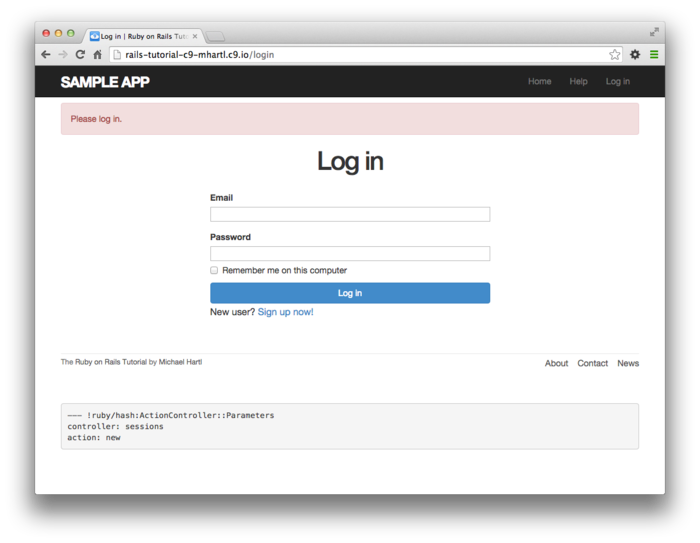

지금 단계에서 테스트는 실패합니다.

`$ rails test`

원인으로는, edit 액션이나 update 액션에서 로그인을 요청하도록 하고 있기 때문에, 로그인해있지 않은 유저라면, 해당 테스트가 실패할 수 밖에 없기 때문입니다.


때문에 edit액션이나 update액션을 테스트하기 전에 로그인해놓을 필요가 있습니다. 해결책은 간단합니다. [9.3](Chapter9.md#93-Remember-me-의-테스트) 에서 개발한  `log_in_as` 헬퍼를 사용하는 것입니다. 수정한 결과는 아래와 같습니다.

```ruby
# test/integration/users_edit_test.rb
require 'test_helper'

class UsersEditTest < ActionDispatch::IntegrationTest

  def setup
    @user = users(:michael)
  end

  test "unsuccessful edit" do
    log_in_as(@user) #추가
    get edit_user_path(@user)
    .
    .
    .
  end

  test "successful edit" do
    log_in_as(@user) #추가
    get edit_user_path(@user)
    .
    .
    .
  end
end
```

(`setup` 메소드 내부에서 로그인 처리를 한 번에 묶어서 하는 것도 가능합니다. 하지만 10.2.3 에서 테스트를 로그인하기 전에 정보 수정 페이지에 접속하려고 유도하고 싶기 때문에, 여기서 묶어서 처리해도 결국은 원래대로 되돌려야합니다.)


이번에는 테스트 케이스는 통과할 것입니다.

`$ rails test`

이 것으로 테스트 케이스가 통과하게끔 되었습니다만, 사실 before 필터의 구현은 아직 끝나지 않았습니다. 보안 모델에 관한 구현을 코멘트아웃 처리해도 테스트가 통과하는지 어떤지 실제로 코멘트아웃하여 확인해봅시다. 안타깝게도 모든 테스트케이스가 통과할 것입니다. before 필터를 코멘트아웃하여 거대한 보안 구멍이 생겨버렸습니다. 테스트 코드에서 해당 문제를 검출해낼 수 있어야합니다. 즉, 아래 코드는 테스트에서 통과하면 안됩니다. 테스트를 작성하여 이 문제를 대처해봅시다.

```ruby
# app/controllers/users_controller.rb
class UsersController < ApplicationController
  # before_action :logged_in_user, only: [:edit, :update]
  .
  .
  .
end
```

before 필터는 기본적으로 액션마다 적용하기 때문에,  Users 컨트롤러의 테스트도 액션별로 작성해나갑니다. 구체적으로는 올바른 종류의 HTTP 리퀘스트를 사용하여 `edit` 액션과 `update` 액션을 각각 실행시켜, flash에 메세지가 대입되어져 있는지, 로그인 화면으로 리다이렉트 되어져 있는지를 확인해봅시다. 7장에서 적절한 리퀘스트는 각각 `GET` 과 `PATCH` 라는 것을 알고 계실 것입니다. 따라서 테스트 내부에서는 `get` 메소드와  `patch` 메소드를 사용합니다. 변경 결과는 아래와 같습니다.

```ruby
# test/controllers/users_controllerb_test.rb
require 'test_helper'

class UsersControllerTest < ActionDispatch::IntegrationTest

  def setup
    @user = users(:michael)
  end
  .
  .
  .
  test "should redirect edit when not logged in" do
    get edit_user_path(@user)
    assert_not flash.empty?
    assert_redirected_to login_url
  end

  test "should redirect update when not logged in" do
    patch user_path(@user), params: { user: { name: @user.name,
                                              email: @user.email } }
    assert_not flash.empty?
    assert_redirected_to login_url
  end
end
```

2번째의 테스트에서는  `patch` 메소드를 사용하여 `user_path(@user)` 에 PATCH리퀘스트를 송신하고 있는 점을 주목해주세요. 7장에서도 확인했듯, 이 리퀘스트는 Users 컨트롤러의 `update` 액션으로 적절하게 연결해줍니다.


이 것으로 테스트 케이스는 통과하지 못할 것입니다. 준비가 다 되었으면 before 필터의 코멘트아웃 처리를 원래대로 돌리고, 테스트가 잘 통과하는지를 확인해봅시다.

```ruby
# app/controllers/users_controller.rb
class UsersController < ApplicationController
  before_action :logged_in_user, only: [:edit, :update]
  .
  .
  .
end
```

코멘트아웃하였던 부분을 원래대로 되돌리면, 테스트가 통과할 것입니다.

`$ rails test`

이러한 테스트를 구현해보는 것으로, 누구라도 유저의 정보를 수정해버리는 버그가 있어도 바로 찾아낼 수 있게 되었습니다.

##### 연습

1. 디폴트의 before필터는 모든 액션에 대해 제한을 겁니다. 이번 케이스라면 로그인 페이지나 유저 등록 페이지에도 제한이 걸릴 것 입니다.(결과적으로 테스트도 실패할 것입니다.) `:only` 옵션을 코멘트아웃하여보고 테스트 코드가 해당 에러를 캐치하는 지(테스트가 실패하는지) 를 확인해봅시다.

### 10.2.2 올바른 유저를 요청해보자

당연하게도, 로그인을 요구하는 것만으로는 충분하지 않습니다. 유저가 *자신의 정보만* 을 수정할 수 있도록 할 필요가 있습니다. [10.2.1](#1021-유저에게-로그인을-요청해보자) 에는 심각한 보안상의 결함을 찾아내는 테스트를 해보았습니다. 이번 섹션에서는 보안 모델이 제대로 구현되어있는지 확신을 가지기 위해서 테스트 주도 개발을 진행해봅시다. 따라서  Users 컨트롤러의 테스트를 보완하기 위해, 테스트를 추가해보는 것 부터 시작해봅시다.


우선은 유저의 정보를 서로 편집할 수 없는 것을 확인하기 위해, sample 유저를 한 명 더 추가합니다. 유저용의 fixture 필터에 2번째 유저를 추가해봅시다.

```
// test/fixture/users.yml
michael:
  name: Michael Example
  email: michael@example.com
  password_digest: <%= User.digest('password') %>

archer:
  name: Sterling Archer
  email: duchess@example.gov
  password_digest: <%= User.digest('password') %>
```

다음으로는 9장에서 정의한 `log_in_as` 메소드를 사용하여 `edit` 액션과 `update` 액션을 테스트해봅니다. 이 때, 이미 로그인 되어져 있는 유저를 대상으로 하기 때문에, 로그인페이지가 아닌 루트 URL로 리다이렉트하는 점을 주의해주세요.

```ruby
# test/controllers/users_controller_test.rb
require 'test_helper'

class UsersControllerTest < ActionDispatch::IntegrationTest

  def setup
    @user       = users(:michael)
    @other_user = users(:archer) #추가
  end
  .
  .
  .
  test "should redirect edit when logged in as wrong user" do
    log_in_as(@other_user)
    get edit_user_path(@user)
    assert flash.empty?
    assert_redirected_to root_url
  end

  test "should redirect update when logged in as wrong user" do
    log_in_as(@other_user) 
    patch user_path(@user), params: { user: { name: @user.name,
                                              email: @user.email } }
    assert flash.empty?
    assert_redirected_to root_url
  end
end
```

다른 유저의 프로필을 수정하려고 하면 리다이렉트되기 때문에, ` correct_user` 라고 하는 메소드를 작성하고,  before 필터로부터 해당 메소드를 호출하도록 해봅시다. before 필터의  `correct_user` 에서 `@user` 변수를 정의하고 있기 때문에, 아래 코드에서는 `edit` 와 `update` 의 각 액션으로부터 `@user` 로의 대입문을 삭제하고 있는 점을 주의해주세요.

```ruby
class UsersController < ApplicationController
  before_action :logged_in_user, only: [:edit, :update]
  before_action :correct_user,   only: [:edit, :update] #추가
  .
  .
  .
  def edit
  end

  def update
    if @user.update_attributes(user_params)
      flash[:success] = "Profile updated"
      redirect_to @user
    else
      render 'edit'
    end
  end
  .
  .
  .
  private

    def user_params
      params.require(:user).permit(:name, :email, :password,
                                   :password_confirmation)
    end

    # before 액션

    # 유저가 로그인했는지를 확인
    def logged_in_user
      unless logged_in?
        flash[:danger] = "Please log in."
        redirect_to login_url
      end
    end

    # 올바른 유저인지를 확인
    def correct_user
      @user = User.find(params[:id])
      redirect_to(root_url) unless @user == current_user
    end
end
```

이번 테스트는 통과할 것입니다.

`$ rails test`

마지막으로, 리팩토링이긴 합니다만, 일반적인 관습을 따라 `current_user?` 라고 하는 논리값을 리턴하는 메소드를 구현합니다.  `correct_user` 안에서 사용하기 위한 것으로, Sessions 헬퍼의 내부에 이 메소드를 추가해봅시다. 이 메소드를 사용하면 지금까지의

`unless @user == current_user`

라고 하는 부분이, 다음과 같이 알기 쉬운 코드로 바뀝니다.

`unless current_user?(@user)`

```ruby
# app/helpers/sessions_helper.rb
module SessionsHelper

  # 입력된 유저로 로그인
  def log_in(user)
    session[:user_id] = user.id
  end

  # 영속적 세션으로서 유저를 기억한다.
  def remember(user)
    user.remember
    cookies.permanent.signed[:user_id] = user.id
    cookies.permanent[:remember_token] = user.remember_token
  end

  # 입력받은 유저가 로그인해있다면 true를 리턴한다. 
  def current_user?(user)
    user == current_user
  end

  # Remember token(cookie) 에 대응하는 유저를 리턴한다.
  def current_user
    .
    .
    .
  end
  .
  .
  .
end
```

앞서 메소드를 사용하여 비교연산하고 있던 행을 수정하면 아래와 같이 됩니다.

```ruby
# app/controllers/users_controller.rb
class UsersController < ApplicationController
  before_action :logged_in_user, only: [:edit, :update]
  before_action :correct_user,   only: [:edit, :update]
  .
  .
  .
  def edit
  end

  def update
    if @user.update_attributes(user_params)
      flash[:success] = "Profile updated"
      redirect_to @user
    else
      render 'edit'
    end
  end
  .
  .
  .
  private

    def user_params
      params.require(:user).permit(:name, :email, :password,
                                   :password_confirmation)
    end

    # before 액션

    # 유저가 로그인했는지를 확인
    def logged_in_user
      unless logged_in?
        flash[:danger] = "Please log in."
        redirect_to login_url
      end
    end

    # 올바른 유저인지를 확인
    def correct_user
      @user = User.find(params[:id])
      #수정
      redirect_to(root_url) unless current_user?(@user)
    end
end
```

##### 연습

1. 어째서 `edit` 액션과 `update` 액션을 양쪽다 보호할 필요가 있는 것일까요?
2. 위 액션 중, 어느쪽이던 브라우저에서 간단하게 테스트할 수 있는 액션인가요?

### 10.2.3 Friendly Forwarding

여기까지가 Web사이트에서 권한 허가 기능을 구현해보는 단계라고 생각하실 수도 있습니다만, 앞으로 1가지 작은 흠이 남아있습니다. 보호되는 페이지로 접속하려고 하면 묻지도 따지지도 않고 자신의 프로필 페이지로 이동되어버립니다. 다르게 말하자면 로그인해있지 않은 유저가 유저 정보 수정 페이지로 접속하려고 한다면, 유저가 로그인한 후에는 해당 정보 수정 페이지로 리다이렉트 되는 것이 바람직합니다. 리다이렉트 페이지는, 유저가 접속하려고 했던 페이지로 해주는 것이 친절합니다.


실제로 코드는 조금 복잡하지만, friendly forwarding 의 테스트는 매우 심플하게 작성할 수 있습니다. 로그인 한 후에 정보 수정 페이지로 접속한다고 하는 순서를 역으로 따라 올라갈 뿐입니다. 아래 코드에서 나타내듯이, 실제 테스트는 일단 정보 수정 페이지에 접속하고, 로그인한 후 (디폴트의 프로필 페이지가 아닌) 정보 수정 페이지로 리다이렉트되는지를 체크하는 테스트입니다. (또한 리다이렉트에 의하여 edit용의 템플릿이 출력되는것 아니게 되었기 때문에, 아래 코드에서는 해당 테스트를 삭제하고 있습니다.)

```ruby
# test/integration/users_edit_test.rb
require 'test_helper'

class UsersEditTest < ActionDispatch::IntegrationTest

  def setup
    @user = users(:michael)
  end
  .
  .
  .
  test "successful edit with friendly forwarding" do #수정
    get edit_user_path(@user) #수정
    log_in_as(@user) #수정
    assert_redirected_to edit_user_url(@user) #수정
    name  = "Foo Bar"
    email = "foo@bar.com"
    patch user_path(@user), params: { user: { name:  name,
                                              email: email,
                                              password:              "",
                                              password_confirmation: "" } }
    assert_not flash.empty?
    assert_redirected_to @user
    @user.reload
    assert_equal name,  @user.name
    assert_equal email, @user.email
  end
end
```

성공하는 테스트를 작성하였기 때문에, 드디어 friendly forwarding을 구현할 준비가 되었습니다. 유저가 원하는 페이지로 접속하게 하기 위해서는 리퀘스트 시점의 페이지를 어딘가에 저장해놓고, 해당 페이지로 리다이렉트시킬 필요가 있습니다. 이 동작을 `store_location` 과 `redirect_back_or` 의 2가지 메소드를 사용하여 구현해보겠습니다. 또한 이러한 메소드는 Sessions 헬퍼에서 정의해보겠습니다.

```ruby
# app/helpers/sessions_helpers.rb
module SessionsHelper
  .
  .
  .
  #  기억한 URL(혹은 디폴트값)으로 리다이렉트
  def redirect_back_or(default)
    redirect_to(session[:forwarding_url] || default)
    session.delete(:forwarding_url)
  end

  # 접근하려고 하는 URL을 저장한다.
  def store_location
    session[:forwarding_url] = request.original_url if request.get?
  end
end
```

전송하려고 하는 URL을 저장하는 처리는, [8.2.1](Chapter8.md821-Log_in-Method) 에서 유저를 로그인시키려고 할 때와 마찬가지로, `session` 변수를 사용합니다. 위 코드에서 `request` 오브젝트도 사용하고 있습니다. (`request.original_url` 로 리퀘스트 URL를 얻을 수 있습니다.)


위 코드의 `store_location` 메소드에서는 리퀘스트가 보내진 URL을 `session` 변수의 `:forwarding_url` 키에 저장합니다. 단, `GET` 리퀘스트가 보내졌을 때 만 저장하도록 하고 있습니다. 이것으로 예를 들어 로그인해있지 않은 유저가 Form을 사용하여 리퀘스트를 보내었을 때, 이동하고자 하는 URL을 저장하지 않도록 할 수 있습니다. 이것은 매우 희귀한 케이스이긴 하지만, 충분히 가능성 있습니다. 예를 들어 유저가 세션용의 cookie를 수동으로 삭제하고 Form을 통해 송신하는 케이스입니다. 이러한 케이스에 대처하지 않으면 `POST` 나 `PATCH` , `DELETE` 리퀘스트를 기대하는 URL에 대해 `GET` 리퀘스트를 보내버리게 되고, 경우에 따라서는 에러가 발생합니다. 때문에 `if request.get?` 이라고 하는 조건문을 사용하여 이 케이스에 대응합니다. 


앞서 정의한 `store_location`메소드를 사용하여 before 필터 (`logged_in_user`) 를 수정해봅시다.

```ruby
# app/controllers/users_controller.rb
class UsersController < ApplicationController
  before_action :logged_in_user, only: [:edit, :update]
  before_action :correct_user,   only: [:edit, :update]
  .
  .
  .
  def edit
  end
  .
  .
  .
  private

    def user_params
      params.require(:user).permit(:name, :email, :password,
                                   :password_confirmation)
    end

    # before 액션

    # 로그인 되어진 유저인지 아닌지를 확인
    def logged_in_user
      unless logged_in?
        store_location #수정
        flash[:danger] = "Please log in."
        redirect_to login_url
      end
    end

    # 올바른 유저인지를 확인 
    def correct_user
      @user = User.find(params[:id])
      redirect_to(root_url) unless current_user?(@user)
    end
end
```

Forwarding 자체를 구현하기 위해, `redirect_back_or` 메소드를 사용합니다. 리퀘스트되어진 URL이 존재하는 경우에는, 그 주소로 리다이렉트하고, 없는 경우에는 어떠한 디폴트 URL로 리다이렉트 시킵니다. 디폴트URL은 Session 컨트롤러의 `create` 액션에 추가하여, signin에 성공하였을 때에 리다이렉트 시킵니다. `redirect_back_or` 메소드에서는 다음과 같이 or 연산자 `||` 를 사용합니다.

`session[:forwarding_url] || default`

이 코드는 값이 `nil` 이 아니라면 `session[:forwarding_url]` 을 확인하고, 그렇지 않다면 디폴트 URL을 사용합니다. 또한 아래 코드에서는 `session.delete(:forwarding_url)` 라고 하는 줄을 통해 전송용의 URL을 삭제하고 있는 점을 확인해주세요. 이 것을 하지 않으면, 다음 로그인 했을 때 보호받는 페이지로 리다이렉트 되어져버립니다. 브라우저를 닫기 전까지 이것이 계속 반복될 것입니다. (이 코드의 테스트는 10.2.3의 연습문제에서 해보겠습니다.) 여담으로, 제일 처음에 `redirect` 문을 실행하여도, 세션이 삭제되는 점을 기억하시는 것이 좋을 것 같습니다. 사실은 명시적으로  `return`문이나 메소드 내부의 마지막 행이 호출되지 않는 한, 리다이렉트는 발생하지 않습니다. 따라서 redirect 문의 뒤에 있는 코드라도, 해당 코드는 실행되어 버립니다.

```ruby
# app/controllers/sessions_controller.rb
class SessionsController < ApplicationController
  .
  .
  .
  def create
    user = User.find_by(email: params[:session][:email].downcase)
    if user && user.authenticate(params[:session][:password])
      log_in user
      params[:session][:remember_me] == '1' ? remember(user) : forget(user)
      redirect_back_or user #추가
    else
      flash.now[:danger] = 'Invalid email/password combination'
      render 'new'
    end
  end
  .
  .
  .
end
```

이 것으로 Friendly Forwarding 용 결합테스트는 통과할 것입니다. 성공한다면, 기본 유저 인증 기능과 페이지 보호 기능의 구현이 완료된 것입니다. 언제나 처럼 테스트를 실행하여 GREEN이 되는 것을 확인해봅시다.

`$ rails test`

##### 연습

1. Friendly Forwarding 에서 입력받은 URL에 제일 처음만 전송되어진 것을 테스트를 작성하여 확인해봅시다. 이 이후의 로그인을 할 떄에는 URL 이 디폴트(프로필 화면)으로 돌아갈 필요가 있습니다. *Hint*: `session[:forwarding_url]` 이 올바른 값인지를 확인하는 테스트를 추가해봅시다.
2. [7.1.3](Chapter7.md#713-Debugger-메소드) 에서 소개한 `debugger` 메소드를 Sessions 컨트롤러의 `new` 액션에 작성해놓아봅시다. 이후 로그아웃하여 /users/1/edit 에 접속하여 보세요. (디버거가 도중에 처리를 정지시킬 것입니다.) 여기서 콘솔에서 확인해봅시다. `session[:forwarding_url]` 의 값이 올바른지를 확인해봅시다. 또한 `new` 액션에 접속하였을 때 `request.get?`의 값도 확인해봅시다. (디버거를 사용하고 있다면, 가끔 예상하지 못한 곳에서 터미널이 멈춘다거나, 이상한 거동을 보이거나 합니다. 숙련된 개발자라는 마음가짐으로 대처해봅시다. ([컬럼 1.1](Chapter1.md#컬럼11-숙련-이라고-하는-것은)))


## 10.3 모든 유저를 표시해보자

이번 섹션에서는 드디어 앞으로 남은 2개 중 하나의 액션인 `index` 액션을 추가해보겠습니다. 이 액션은, *모든* 유저를 리스트로 표시합니다. 그 때, 데이터베이스에 샘플 데이터를 추가하는 방법이나, 이후 유저 수가 방대해져도 index 페이지를 문제없이 표시하기 위하여 유저 출력의 페이지네이션 *(pagination, 페이지 분할)* 방법도 구현해볼 것입니다. 유저 리스트, 페이지네이션용의 링크, 이동용의 [Users] 링크의 목업은 아래와 같습니다. 또한 10.4에서는 관리자권한을 새롭게 추가하고, 유저의 리스트 페이지로부터 유저를 삭제할 수 있도록하는 기능을 추가해볼 것입니다.

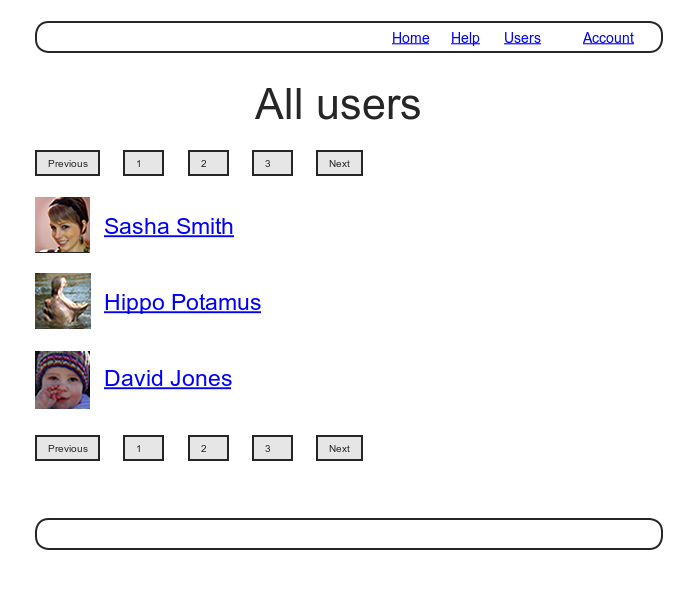

### 10.3.1 유저 리스트를 표시해보자

유저의 리스트 페이지를 구현하기 위해, 우선 보안 모델에 대해 생각해봅시다. 유저의 `show` 페이지에 대해서는 이후 (로그인 여부와 관계없이) 사이트를 방문한 모든 유저에게 노출되도록 할 것입니다만, 유저의 `index` 페이지는 로그인 한 유저만 볼 수 있도록 미등록의 유저가 디폴트로 볼 수 있는 페이지를 제한할 것입니다.


`index` 페이지에 부정 액세스를 막기 위해 우선 `index` 액션이 올바르게 리다이렉트하는지 검증하는 테스트 코드를 작성해봅시다.

```ruby
require 'test_helper'

class UsersControllerTest < ActionDispatch::IntegrationTest

  def setup
    @user       = users(:michael)
    @other_user = users(:archer)
  end

  test "should redirect index when not logged in" do
    get users_path
    assert_redirected_to login_url
  end
  .
  .
  .
end
```

다음으로 before 필터의 `logged_in_user` 에 `index` 액션을 추가하여 해당 액션을 보호하도록 해봅시다.

```ruby
# app/controllers/users_controller.rb
class UsersController < ApplicationController
  before_action :logged_in_user, only: [:index, :edit, :update] #수정
  before_action :correct_user,   only: [:edit, :update]

  #추가
  def index
  end
  #추가
  
  def show
    @user = User.find(params[:id])
  end
  .
  .
  .
end
```

이번에는 모든 유저를 표시하기 위해, 모든 유저가 저장되어 있는 변수를 생성하고, 순서대로 표시하는 index 뷰를 구현해봅시다. Toy 어플리케이션에도 같은 index 액션이 있었다는 것을 떠올려주세요. (제 2장) 그 때와 마찬가지로, `User.all` 을 사용하여 데이터베이스 상의 모든 유저를 조회하고, 뷰에서 사용하는 인스턴스 변수 `@users` 에 대입시켜 봅시다. (모든 유저를 한 번에 읽어들이면 데이터의 량이 많은 경우에는 문제가 생기지 않겠냐고 생각하시는 분이 있을 수도 있습니다만, 10.3.3에서 수정해볼 것입니다.)

```ruby
# app/controllers/users_controller.rb
class UsersController < ApplicationController
  before_action :logged_in_user, only: [:index, :edit, :update]
  .
  .
  .
  def index
    @users = User.all
  end
  .
  .
  .
end
```

실제의 index 페이지를 생성하기 위해서는 유저를 열거하고 유저마다 `li` 태그로 감싸서 출력할 필요가 있습니다. 여기서는 `each` 메소드를 사용하여 생성합니다. 각각의 행을 리스트 태그 `ul` 로 감싸며 각 유저의 Gravatar와 이름을 표시합니다.

```erb
<!-- app/views/users/index.html.erb -->
<% provide(:title, 'All users') %>
<h1>All users</h1>

<ul class="users">
  <% @users.each do |user| %>
    <li>
      <%= gravatar_for user, size: 50 %>
      <%= link_to user.name, user %>
    </li>
  <% end %>
</ul>
```

위 코드에서는 [7.1.4](Chapter7.md#714-Gravatar-이미지와-사이드-바) 의 연습문제에서 사용한 아래의 코드를 사용하여 Gravatar 헬퍼에 디폴트 이외의 사이즈를 지정하는 옵션을 사용하고 있습니다. 이 연습을 아직 하지 않으신 경우에는, 아래의 코드에 따라 Users 헬퍼를 갱신하고부터 진행해주세요. 물론 Ruby 2.0부터 도입된 키워드 파라미터를 사용해보는 것도 좋을 것입니다.

```ruby
# app/helpers/users_helper.rb
module UsersHelper

  # 입력된 유저의 Gravatar 영상을 리턴한다.
  def gravatar_for(user, options = { size: 80 })
    gravatar_id = Digest::MD5::hexdigest(user.email.downcase)
    size = options[:size]
    gravatar_url = "https://secure.gravatar.com/avatar/#{gravatar_id}?s=#{size}"
    image_tag(gravatar_url, alt: user.name, class: "gravatar")
  end
end
```

Gravatar의 준비가 끝났다면, CSS (정확하게는 SCSS) 도 살짝 수정해봅시다.

```scss
/* app/assets/stylesheets/custom.scss */
.
.
.
/* Users index */

.users {
  list-style: none;
  margin: 0;
  li {
    overflow: auto;
    padding: 10px 0;
    border-bottom: 1px solid $gray-lighter;
  }
}
```

 마지막으로 사이트 내 이동용 헤더에 유저 리스트 표시용 링크를 추가합니다. 여기에는 `users_path` 를 사용하여, 아직 사용하지 않았던 마지막남은 named path를 사용합니다.

```erb
<!-- app/views/layouts/_header.html.erb -->
<header class="navbar navbar-fixed-top navbar-inverse">
  <div class="container">
    <%= link_to "sample app", root_path, id: "logo" %>
    <nav>
      <ul class="nav navbar-nav navbar-right">
        <li><%= link_to "Home", root_path %></li>
        <li><%= link_to "Help", help_path %></li>
        <% if logged_in? %>
        <!-- 추가 -->
          <li><%= link_to "Users", users_path %></li>
        <!-- 추가 -->
          <li class="dropdown">
            <a href="#" class="dropdown-toggle" data-toggle="dropdown">
              Account <b class="caret"></b>
            </a>
            <ul class="dropdown-menu">
              <li><%= link_to "Profile", current_user %></li>
              <li><%= link_to "Settings", edit_user_path(current_user) %></li>
              <li class="divider"></li>
              <li>
                <%= link_to "Log out", logout_path, method: :delete %>
              </li>
            </ul>
          </li>
        <% else %>
          <li><%= link_to "Log in", login_path %></li>
        <% end %>
      </ul>
    </nav>
  </div>
</header>
```

이 것으로 유저의 index는 완전히 동작하게 되었으며 테스트도 통과하게 될 것입니다.

`$ rails test`

그러나 현재는 아래 캡쳐처럼 유저가 한 명 뿐이라 조금은 쓸쓸한 느낌이 있습니다.

다음으로는 이 문제를 해결해보겠습니다.

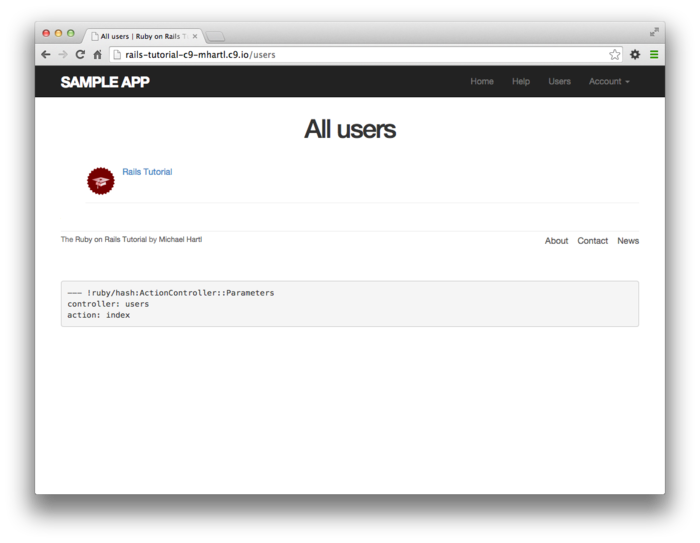

##### 연습

1. 레이아웃에 있는 모든 링크에 대해 결합테이스트를 작성해봅시다. 로그인이 끝난 유저와 그렇지 않은 유저 각각 이용하여 올바른 동작을 생각해주세요. *Hint* : `log_in_as` 헬퍼를 사용하여 아래 코드를 수정해보세요.

   ```ruby
   # test/integration/site_layout_test.rb
   require 'test_helper'
   
   class SiteLayoutTest < ActionDispatch::IntegrationTest
   
     test "layout links" do
       get root_path
       assert_template 'static_pages/home'
       assert_select "a[href=?]", root_path, count: 2
       assert_select "a[href=?]", help_path
       assert_select "a[href=?]", about_path
       assert_select "a[href=?]", contact_path
     end
   end
   ```

### 10.3.2 Sample User

이번 섹션에서는 한 명의 유저만 있는 현 상태에 다른 유저를 추가해볼 것 입니다. index 페이지에 여러명의 유저를 출력하기 위해서는, 브라우저에서 유저 등록 페이지로 접속하여 수작업으로 한 명씩 추가하는 방법도 있습니다만, 모처럼 Ruby를 사용하여 유저를 한 번에 작성해보도록 합시다.


우선 `Gemfile` 에 *Faker* gem을 추가해봅시다. 이 젬은 실제로 그럴싸한 유저 이름을 생성하는 gem입니다. 여담으로,  faker gem은 개발환경 이외에서는 보통 사용하지 않습니다만, 이번은 예외로 실제 배포환경에도 적용할 생각이기 때문에, 다음과 같이 모든 환경에 사용할 수 있도록 해봅시다.

```ruby
# Gemfile
source 'https://rubygems.org'

gem 'rails',          '5.1.6'
gem 'bcrypt',         '3.1.12'
gem 'faker',          '1.7.3' #추가
.
.
.
```

그 다음으로 `bundle install` 을 실행합니다.

`$ bundle install`

그렇다면, 샘플 유저를 생성하는 Ruby 스크립트 (Rails Task 라고도 불립니다.) 를 추가해봅시다. Rails에서는 `db/seeds.rb` 라고 하는 파일을 표준으로 사용합니다. 작성한 코드는 아래와 같습니다. (아래 코드는 조금 응용한 것입니다. 전부 이해하지 않으셔도 됩니다.)

```ruby
# db/seeds.rb
User.create!(name:  "Example User",
             email: "example@railstutorial.org",
             password:              "foobar",
             password_confirmation: "foobar")

99.times do |n|
  name  = Faker::Name.name
  email = "example-#{n+1}@railstutorial.org"
  password = "password"
  User.create!(name:  name,
               email: email,
               password:              password,
               password_confirmation: password)
end
```

위 코드에서는 Example User 라고 하는 이름과 메일주소를 가진 1명의 유저와, 그럴싸해보이는 이름과 메일 주소를 가진 99명의 유저를 작성합니다. `create!` 는 기본적으로  `create` 메소드와 비슷합니다만, 유저가 무효한 경우에  `false` 를 리턴하는 것이 아닌, exception을 발생시키는 점이 다릅니다. 이렇게 해놓으면 에러를 회피할 수 있기 때문에 디버그가 쉬워집니다.


그렇다면 데이터베이스를 리셋하고, 위의 Rails task를 실행해봅시다.

```
$ rails db:migrate:reset
$ rails db:seed
```

데이터 베이스 상의 데이터를 추가하는 것은 느려지기 쉽습니다. 시스템에 따라서는 몇분씩이나 걸릴 수도 있습니다. 또한 몇명의 독자로의 보고에 따르면, Rails 서버를 동작하고 있는 상태라면 `rails db:migrate:reset` 커맨드가 제대로 동작하지 않는 경우가 있는 듯 합니다. 혹시 비슷한 경우가 발생한다면, 한 번 Rails 서버를 재부팅해보세요.


`db:seed` 로 Rails task를 실행하면, sample 어플리케이션의 유저가 100명이 될 것입니다. 아래 캡쳐처럼 첫 몇 명의 메일주소에 대해서는 디폴트의 Gravatar 이미지 이외의 사진을 등록해놓았습니다.


##### 연습

1. 시험삼아 다른 유저의 편집 페이지에 액세스해봅시다. [10.2.2](#1022-올바른-유저를-요청해보자) 에서 구현한 것 처럼 리다이렉트되는지 확인해봅시다.

### 10.3.3 Pagination

이 것으로 다른 유저들도 등록되었습니다. 그러나 이번에는 거꾸로, 한 페이지에 대량의 유저가 표시되어지고 있습니다. 100명도 꽤나 많은 수라고 생각되기도 하며, 이 후로 수천명의 유저가 늘어날 가능성이 있습니다. 이것을 해결하기 위해 페이지네이션 *(pagination)* 이라는 것을 사용해보겠습니다. 예를 들어 한 페이지에 한 번에 30명정도씩 유저를 표시한다는 그런 것입니다.


Rails에는 풍부한 pagination 메소드가 있습니다. 이번에는 그 중에 제일 심플하고 사용하기 좋은 `will_paginate` 메소드를 사용해봅시다. 이것을 사용하기 위해서는 `Gemfile` 에 will_paginate gem과 bootstrap-will_paginate gem을 추가해봅시다. Bootstrap의 페이지네이션 스타일을 사용하여 will_paginate를 구성할 필요가 있습니다. 각 gem을 Gemfile에 추가해보도록 합시다.

```ruby
# Gemfile
source 'https://rubygems.org'

gem 'rails',                   '5.1.6'
gem 'bcrypt',                  '3.1.12'
gem 'faker',                   '1.7.3'
gem 'will_paginate',           '3.1.6'
gem 'bootstrap-will_paginate', '1.0.0'
.
.
.
```

다음으로 `bundle install` 실행합니다.

`$ bundle install`

실행하면, 새로운 gem이 올바르게 읽어들일 수 있도록, Web서버를 재부팅해주세요.


pagination이 동작하기 위해서는 유저의 pagination가 설정될 수 있도록, Rails에 지시하는 코드를 index 뷰에 추가할 필요가 있습니다. 또한 `index` 액션에 있는 `User.all` 을 pagination을 이해할 수 있도록 오브젝트로 바꾸어놓을 필요가 있습니다. 일단 뷰에 특수한 `will_paginate` 메소드를 추가해봅시다. 같은 코드가 리스트의 위와 아래 두개가 있습니다만, 그 이유는 다음에 설명해드리겠습니다.

```erb
<!-- app/views/users/index.html.erb -->
<% provide(:title, 'All users') %>
<h1>All users</h1>

<%= will_paginate %>

<ul class="users">
  <% @users.each do |user| %>
    <li>
      <%= gravatar_for user, size: 50 %>
      <%= link_to user.name, user %>
    </li>
  <% end %>
</ul>

<%= will_paginate %>
```

`will_paginate` 메소드는 조금 신기하게도, `users` 뷰의 코드에서 `@users`오브젝트를 자동적으로 찾아내어, 그것으로부터 다른 페이지로 액세스하기 위한 pagination 링크를 생성해줍니다. 단, 위 코드의 뷰만으로는 움직이지 않습니다. 애초에 현재 `@users` 변수에는 `Usesr.all` 의 결과가 포함되어있습니다만, `will_paginate` 에는 `paginate` 메소드를 사용한 결과가 필요하기 때문입니다. 필요한 데이터의 예시는 다음과 같습니다.

```ruby
$ rails console
>> User.paginate(page: 1)
  User Load (1.5ms)  SELECT "users".* FROM "users" LIMIT 30 OFFSET 0
   (1.7ms)  SELECT COUNT(*) FROM "users"
=> #<ActiveRecord::Relation [#<User id: 1,...
```

`paginate` 는 Key가 `:page` 이며, 값은 페이지번호의 해시를 파라미터로 취합니다. `User.paginate` 는 `:page` 파라미터를 기반으로 데이터베이스로부터 어떠한 한 덩어리의 데이터 (디폴트는 30개) 를 읽어들입니다. 따라서 1페이지에 1~30의 유저, 2페이지에는는 31~60개의 유저가 표시됩니다.  `page`가 `nil` 의 경우, `paginate` 는 간단하게 제일 첫 페이지를 리턴합니다.


`paginate` 를 사용하여 sample 어플리케이션의 유저의 pagination을 구현할 준비가 되었습니다. 구체적으로 `index` 액션 내부의 `all`을 `paginate` 메소드로 바꿉니다. 여기서 `:page` 파라미터는 `params[:page]` 를 사용하고 있습니다만, 이것은 `will_pagenate` 에 의해 자동적으로 생성될 것입니다.

```ruby
# app/controllers/users_controller.rb
class UsersController < ApplicationController
  before_action :logged_in_user, only: [:index, :edit, :update]
  .
  .
  .
  def index
    @users = User.paginate(page: params[:page])
  end
  .
  .
  .
end
```

이ㅇ으로 유저 리스트 페이지에서는 아래 캡쳐와 같이 표시될 것입니다. (시스템 환경에 따라서는 여기 Rails를 재부팅할 필요가 있을 수 있습니다.) `will_paginate` 를 유저 리스트의 위와 아래 양 쪽에 배치하는 것으로, pagination의 링크도 페이지의 위와 아래에 표시 되었습니다.

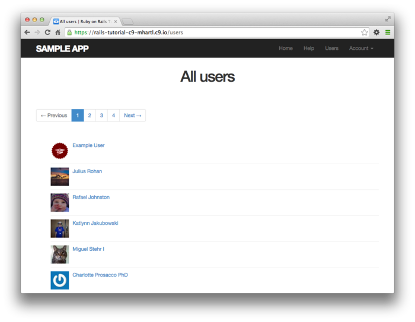

제로 된다면, 위 [2] 혹은 [Next] 의 링크를 클릭하여 아래와 같이 다음 페이지로 이동할 수 있게 된 것을 확인해봅시다.

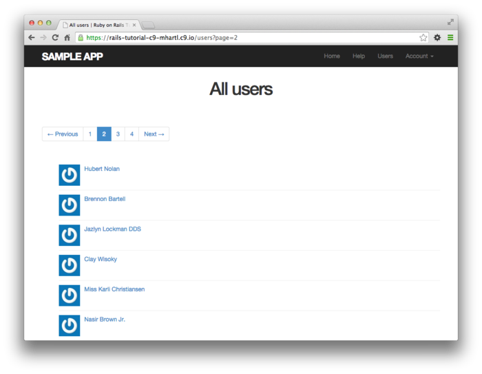

##### 연습

1. Rails 콘솔을 열고, page 옵션에 `nil` 을 설정하고 실행해보면, 1페이지에 유저가 조회될 수 있는 것을 확인해봅시다.
2. 아전 연습 문제에서 조회된 pagination 오브젝트는, 어떠한 클래스일까요? 또한 `User.all` 의 클래스와 어디가 다른 것일까요? 비교해봅시다.

### 10.3.4 유저 리스트의 테스트

이것으로 유저 리스트 페이지가 동작하도록 되었습니다. [10.3.3](#1033-Pagination) 의 Pagination에 대한 간단한 테스트 코드도 작성해봅시다. 이번의 테스트에서는 로그인, index 페이지에 접속하여 제일 첫 페이지에 유저가 있는 것을 확인하고, pagination의 링크가 있는 것을 확인하는 순으로 테스트를 해봅시다. 제일 처음의 2개의 스탭으로는, 테스트용의 데이터베이스에 31인 이상의 유저가 있어야할 필요가 있습니다.


이전 fixture에 2번째 유저를 추가해보았씁니다만, 이번에는 좀 더 많은 유저를 생성할 필요가 있습니다. 손으로 추가하는 것은 귀찮습니다. 매우 운좋게도 유저용 fixture파일의 password_digest 속성에서 사용했던 것 처럼, fixture에서는 Ruby 코드를 지원하고 있습니다. 이것을 이용하여 30명의 유저를 추가해봅시다. 또한 이후에도 필요해지기 때문에 2명의 이름이 있는 유저도 같이 추가해봅시다.

```
// test/fixtures/users.yml

michael:
  name: Michael Example
  email: michael@example.com
  password_digest: <%= User.digest('password') %>

archer:
  name: Sterling Archer
  email: duchess@example.gov
  password_digest: <%= User.digest('password') %>

lana:
  name: Lana Kane
  email: hands@example.gov
  password_digest: <%= User.digest('password') %>

malory:
  name: Malory Archer
  email: boss@example.gov
  password_digest: <%= User.digest('password') %>

<% 30.times do |n| %>
user_<%= n %>:
  name:  <%= "User #{n}" %>
  email: <%= "user-#{n}@example.com" %>
  password_digest: <%= User.digest('password') %>
<% end %>
```

fixture 파일이 준비되었습니다. index 페이지에 대한 테스트를 작성해봅시다. 일단 결합테스트용 파일을 생성해봅시다.

```ruby
$ rails generate integration_test users_index
      invoke  test_unit
      create    test/integration/users_index_test.rb
```

이번 테스트에서는  `pagination` 클래스를 가진 `div` 태그를 체크하고, 제일 첫 페이지에 유저가 있는 것을 확인하는 테스트입니다.

```ruby
# test/integration/users_index_test.rb
require 'test_helper'

class UsersIndexTest < ActionDispatch::IntegrationTest

  def setup
    @user = users(:michael)
  end

  test "index including pagination" do
    log_in_as(@user)
    get users_path
    assert_template 'users/index'
    assert_select 'div.pagination'
    User.paginate(page: 1).each do |user|
      assert_select 'a[href=?]', user_path(user), text: user.name
    end
  end
end
```

이 테스트는 통과할 것 입니다.

`$ rails test`

##### 연습

1. pagination의 링크 (`will_paginate`의 부분) 를 2개 모두 코멘트아웃하고, 테스트가 통과하지 못하는 것을 확인해봅시다.

2. 방금 전 2개 다 코멘트아웃했습니다만, 1개만 코멘트아웃 한 경우, 테스트가 통과하는 것을 확인해봅시다. will_paginate의 링크가 2개 다 존재하는 것을 테스트하고 싶은 경우는 어떠한 테스트를 추가하면 될까요? *Hint : 아래 코드를 참고하여 수를 카운트하는 테스트를 추가해봅시다.*

    

| **Code**                                      | **マッチするHTML** |
| --------------------------------------------- | ------------------ |
| `assert_select "div"`                         | `foobar`           |
| `assert_select "div", "foobar"`               | `foobar`           |
| `assert_select "div.nav"`                     | `foobar`           |
| `assert_select "div#profile"`                 | `foobar`           |
| `assert_select "div[name=yo]"`                | `hey`              |
| `assert_select "a[href=?]", '/', count: 1`    | `[foo]()`          |
| `assert_select "a[href=?]", '/', text: "foo"` | `[foo]()`          |

### 10.3.5 Partial Refactoring

유저 리스트 페이지에 pagination을 구현해보았습니다. 여기서 한 군대의 코드 개선을 해보고싶습니다. 사실은 Rails에는 컴팩트한 뷰를 생성하기 위한 멋진 툴이 몇가지가 있습니다. 이번 섹션에서는 해당 툴을 사용하여 리스트 페이지의 리팩토링을 해보겠습니다. sample 어플리케이션의 테스트는 이미 완료되어있기에,  Web 사이트의 기능이 에러없이 안심하고 리팩토링을 해봅시다.


리팩토링의 제일 첫 번째로는, 아래 코드의 유저의 `li` 를 `render` 로 바꾸어봅시다.

```erb
<!-- app/views/users/index.html.erb -->
<% provide(:title, 'All users') %>
<h1>All users</h1>

<%= will_paginate %>

<ul class="users">
  <% @users.each do |user| %>
    <%= render user %> <!-- update -->
  <% end %>
</ul>

<%= will_paginate %>
```

여기서는 `render` 를 partial로 만드는 것이 아닌, `User` 클래스의 `user` 변수에 대해 실행하는 점을 주목해주세요. 이 경우 Rails는 자동적으로 `_user.html.erb` 이라고 하는 이름의 partial 을 찾습니다. 이 partial을 생성할 필요가 있습니다.

```erb
<!-- app/views/users/_user.html.erb -->
<li>
  <%= gravatar_for user, size: 50 %>
  <%= link_to user.name, user %>
</li>
```

이것은 틀림없이 큰 한 걸음입니다. 그러나 여기서 끝내지않고, 좀 더 개선해보겠습니다. 이번에는 `render` 를 `@users` 변수에 대해 *직접* 실행해보겠습니다.

```erb
<!-- app/views/users/index.html.erb -->
<% provide(:title, 'All users') %>
<h1>All users</h1>

<%= will_paginate %>

<ul class="users">
  <%= render @users %> <!-- update -->
</ul>

<%= will_paginate %>
```

Rails는 `@users` 를 `User` 오브젝트의 리스트라고 추측합니다. 게다가 유저의 컬렉션을 부여하고 호출하면, Rails는 자동적으로 유저의 컬렉션을 열거하여 각각의 유저를 `_user.html.erb` partial 을 출력합니다. 이것으로 위 코드는 매우 극적으로 컴팩트해졌습니다.


리팩토링한 경우에는 어플리케이션의 코드를 변경하기 전과 후에 반드시 테스트를 실행하여 변경한 후에도 테스트가 통과하는 것을 확인해야합니다.

`$ rails test`

##### 연습

1. 위 코드에서 `render` 행을 코멘트아웃하고, 테스트 실행결과가 실패인 것을 확인해봅시다.


## 10.4 유저를 삭제해보자.

유저 리스트 페이지는 드디어 구현완료했습니다. 남은건 `destroy` 만 남았습니다. 이것을 구현하는 것으로 REST를 따르는 정통한 어플리케이션이 되는 것입니다. 이번 섹션에서는 유저를 삭제하기 위한 링크를 추가합니다. 목업은 아래와 같습니다. 또한 삭제를 실행할 때 필요한 `destroy` 액션도 구현해볼 것 입니다. 그러나 그 전에, 삭제를 실행할 수 있는 권한을 가진 관리자(admin) 유저의 클래스를 생성해봅시다.

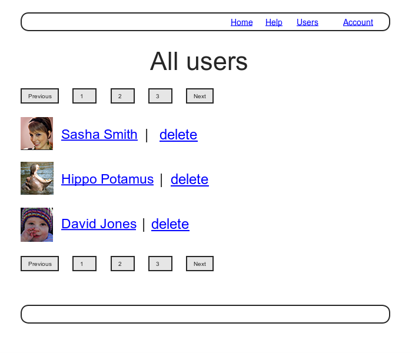

### 10.4.1 관리자

특권을 ㅏ진 관리 유저를 식별하기 위해, 논리값을 취하는 `admin` 속성을 User 모델에 추가합니다. 이 후에 설명하겠습니다만, 이렇게하면 자동적으로 `admin?` 메소드 (논리값을 리턴합니다.) 도 사용할 수 있게 되기에, 이것을 사용하여 관리유저의 상태를 테스트해볼 수 있습니다. 변경 후의 데이터 모델은 아래와 같이 갑니다.

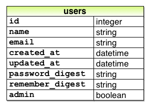

언제나 처럼 마이그레이션을 실행하여 `admin` 속성을 추가해봅시다. 터미널 상에서 이 속성의 타입을  `boolean` 으로 지정합니다.

`$ rails generate migration add_admin_to_users admin:boolean`

 마이그레이션을 실행하면, `admin` 컬럼이 `users` 테이블에 추가됩니다. 아래 코드에서는  `default: false` 라고 하는 파라미터를, `add_column` 에 추가합니다. 이것은 디폴트로는 관리자가 *될 수 없게* 하기 위해서 입니다. ( `default: false` 파라미터를 부여하지 않는 경우, `admin` 속성의 값은 디폴트로 `nil` 이 됩니다만, 이것은 `false` 와 같은 의미이기에 반드시 이 파라미터를 부여할 ㅍ리요는 없ㅅ브니다. 단, 이렇게 명시적으로 파라미터를 부여해놓는다면, 코드의 의도를 Rails와 개발자에게 명확하게 전달할 수 있습니다.)

```ruby
# db/migrate/[timestamp]_add_admin_to_users.rb
class AddAdminToUsers < ActiveRecord::Migration[5.0]
  def change
    add_column :users, :admin, :boolean, default: false
  end
end
```

이후 마이그레이션을 실행합니다.

`$ rails db:migrate`

Rails 의 콘솔을 작동시켜 확인해보면, 기대했던 대로 `admin` 속성이 추가되어 논리값을 취하고 있고, 물음표 부호가 달려있는 `admin?` 메소드도 이용할 수 있게 되었습니다.

```ruby
$ rails console --sandbox
>> user = User.first
>> user.admin?
=> false
>> user.toggle!(:admin)
=> true
>> user.admin?
=> true
```

여기서는 `toggle!` 메소드를 써서 `admin` 속성의 상태를 `false` 에서 `true` 로 바꾸고 있습니다.


마무리로 제일 첫 번째의 유저만 디폴트로 관리자로 바꾸어 놓읍시다. 샘플 데이터를 수정해봅시다.

```ruby
# db/seeds.rb
User.create!(name:  "Example User",
             email: "example@railstutorial.org",
             password:              "foobar",
             password_confirmation: "foobar",
             admin: true) #update

99.times do |n|
  name  = Faker::Name.name
  email = "example-#{n+1}@railstutorial.org"
  password = "password"
  User.create!(name:  name,
               email: email,
               password:              password,
               password_confirmation: password)
end
```

다음으로 데이터베이스를 리셋하여 샘플 데이터를 다시 생성해봅시다.

```
$ rails db:migrate:reset
$ rails db:seed
```

#### 다시 한 번, Strong Parameter

위 코드에서는 초기화해시에 `admin: true` 를 설정하는 것으로 유저를 관리자로 만드는 것을 알아채셨나요? 여기서는 Web세계에서 오브젝트를 조작하는 것의 위험성을 다시 한 번 강조해보겠습니다. 만일 임의의 Web 리퀘스트의 초기화 해시를 오브젝트로 넘긴다고 한다면, 공격자는 다음과 같은 PATCH 리퀘스트를 송신할지도 모릅니다.

`patch /users/17?admin=1`

이 리퀘스트는, 17번째의 유저를 관리자로 갱신하고 있습니다. 유저의 이러한 행위는 적어도 중대한 보안위반을 할 가능성이 있으며, 실제로는 그것만으로 끝나지는 않을 것입니다.


이러한 위험이 있기 때문에, 수정해도 좋은 안전한 속성만을 갱신하는 것이 중요합니다. 이전 [7.3.2](Chapter7.md#732-Strong-Parameters) 에서 설명했다시피 *Strong parameter* 를 사용하여 대처해봅니다. 구체적으로는 다음과 같이 `params` 해시에 대해 `require` 와 `permit` 를 호출합니다.

```ruby
    def user_params
      params.require(:user).permit(:name, :email, :password,
                                   :password_confirmation)
    end
```

위 코드에서는 허가된 속성 리스트에 `admin` 이 포함되어있지 않은 것을 주목해주세요. 이것으로 인하여 임의의 유저가 자기 자신이 어플리케이션의 관리자권한을 부여하는 것을 방지하고 있습니다. 이 문제는 매우 중요한 문제이기도 하며, 편집 가능하게 되지 않도록 속성에 대하여 테스트를 작성하는 것도 추천합니다. 또한 `admin` 속성의 테스트에 대해서는 연습문제로 돌리기로 해봅니다.

##### 연습

1. Web 경유로 `admin` 속성을 변경할 수 없는 것을 확인해봅시다. 구체적으로는 PATCH로 직접 유저의 URL(/users/:id) 로 송신하는 테스트를 작성해보세요. 테스트가 제대로 동작하는지 확신을 가지기 위해, 우선은 `admin` 에 `user_params` 메소드 내부의 허가된 파라미터 리스트를 *추가* 하는 것 부터 시작해봅시다. 제일 첫 테스트의 결과는 실패할 것입니다.

```ruby
# test/controllers/users_controller_test.rb
require 'test_helper'

class UsersControllerTest < ActionDispatch::IntegrationTest

  def setup
    @user       = users(:michael)
    @other_user = users(:archer)
  end
  .
  .
  .
  test "should redirect update when not logged in" do
    patch user_path(@user), params: { user: { name: @user.name,
                                              email: @user.email } }
    assert_not flash.empty?
    assert_redirected_to login_url
  end

  # 추가
  test "should not allow the admin attribute to be edited via the web" do
    log_in_as(@other_user)
    assert_not @other_user.admin?
    patch user_path(@other_user), params: {
                                    user: { password:              FILL_IN,
                                            password_confirmation: FILL_IN,
                                            admin: FILL_IN } }
    assert_not @other_user.FILL_IN.admin?
  end
  #추가
  .
  .
  .
end
```

### 10.4.2 destroy 액션

Users 리소스의 마지막 마무리로,  `destory` 액션으로의 링크를 추가해봅시다. 우선 유저 index 페이지의 각 유저에 삭제용 링크를 추가하고, 이어서 관리 유저로의 액세스 권한을 부여합니다. 이것으로 현재 유저가 관리자일 때만 `[delete]` 링크가 표시되도록 합니다.

```erb
<!-- app/views/users/_user.html.erb -->
<li>
  <%= gravatar_for user, size: 50 %>
  <%= link_to user.name, user %>
  <% if current_user.admin? && !current_user?(user) %>
    | <%= link_to "delete", user, method: :delete,
                                  data: { confirm: "You sure?" } %>
  <% end %>
</li>
```

필요한 `DELETE` 리퀘스트를 발생시키는 링크의 생성은, method: :delete 에 의해 이루어집니다. 또한 각 링크를 if문으로 감싸어 관리자만이 삭제 링크가 표시되도록 합니다. 제대로 동작한다면 관리자로부터 보이는 페이지는 아래와 같을 것 입니다.


브우저는 네이티브에서는 DELETE 리퀘스트를 송신할 수 없기 때문에 Rails에서는 JavaScript를 사용하여 위조합니다. 즉, JavaScript가 off가 되어있다면 유저 삭제의 링크도 무효하게 될 것입니다. JavaScript를 서포트하지 않는 브라우저에서 서포트할 필요가 있는 경우, Form과 POST 리퀘스트를 사용하여 DELETE 리퀘스트를 위조하는 것도 가능합니다. 이 것은 JavaScript가 없어도 동작합니다.

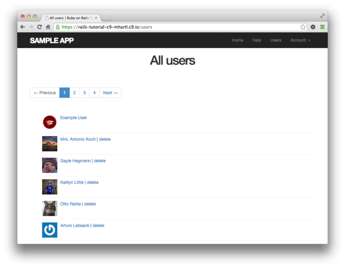

이 삭제링크가 동작하기 위해서는 `destroy` 액션을 추가할 필요가 있습니다. 이 액션에서는 해당 유저를 찾아 Active Record의 `destroy` 메소드를 사용하여 삭제하고, 마지막에 유저 index로 이동시킵니다. 유저를 삭제하기 위해서는 로그인하지 않으면 안되기 때문에, `:destroy` 액션도 `logged_in_user` 필터에 추가합니다.

```ruby
# app/controller/users_controller.rb
class UsersController < ApplicationController
  before_action :logged_in_user, only: [:index, :edit, :update, :destroy] # update
  before_action :correct_user,   only: [:edit, :update]
  .
  .
  .
  def destroy
    User.find(params[:id]).destroy
    flash[:success] = "User deleted"
    redirect_to users_url
  end

  private
  .
  .
  .
end
```

`destroy` 액션에서는 `find` 메소드와 `destroy` 메소드를 한 줄로 작성하기 위해 2개의 메소드를  메소드 체인하고 있습니다.

`User.find(params[:id]).destroy`

결과적으로, 관리자만이 유저를 삭제할 수 있도록 되었습니다. (보다 더 구체적으로는 삭제링크가 보이는 유저만이 삭제할 수 있습니다.) 그러나 사실은 아직 큰 보안상 문제가 있습니다. 어느정도의 실력을 가진 공격자라면, 커맨드라인에서 DELETE 리퀘스트를 직접 발행하는 방법으로 사이트의 전 유저를 삭제해버릴 수도 있습니다. 사이트를 제대로 방어하기 위해서는, `destroy` 액션에도 액세스 제어를 할 필요가 있습니다. 이것을 구현하는 것으로 드디어 관리자만이 유저를 삭제할 수 있게 됩니다.


[10.2.1](#1021-유저에게-로그인을-요청해보자) 과 [10.2.2](#1022-올바른-유저를-요청해보자) 과 같이, 이번에는 before 필터를 사용하여 `destroy` 액션으로의 액세스를 제어해봅니다. 구현하는 `admin_user` 필터는 아래와 같습니다.

```ruby
# app/controllers/users_controller.rb
class UsersController < ApplicationController
  before_action :logged_in_user, only: [:index, :edit, :update, :destroy]
  before_action :correct_user,   only: [:edit, :update]
  before_action :admin_user,     only: :destroy #추가
  .
  .
  .
  private
    .
    .
    .
    # 관리자인지 확인
    def admin_user
      redirect_to(root_url) unless current_user.admin?
    end
end
```

##### 연습

1. 관리자 유저로 로그인하여 시험삼아 샘플 유저를 2~3명을 삭제해봅시다. 유저를 삭제하면  Rails 서버의 로그에는 어떻게 정보가 표시됩니까?

### 10.4.3 유저 삭제의 테스트

유를 삭제하는 중요한 조작에 대해서는 기대대로 동작하는지 확인하는 테스트 코드를 작성해야합니다. 여기서 우선 유저용 fixture 파일을 수정하고, 지금 존재하는 샘플 유저 중 한 명을 관리자로 지정해봅시다.

```
// test/fixtures/users.yml
michael:
  name: Michael Example
  email: michael@example.com
  password_digest: <%= User.digest('password') %>
  admin: true //추가

archer:
  name: Sterling Archer
  email: duchess@example.gov
  password_digest: <%= User.digest('password') %>

lana:
  name: Lana Kane
  email: hands@example.gov
  password_digest: <%= User.digest('password') %>

malory:
  name: Malory Archer
  email: boss@example.gov
  password_digest: <%= User.digest('password') %>

<% 30.times do |n| %>
user_<%= n %>:
  name:  <%= "User #{n}" %>
  email: <%= "user-#{n}@example.com" %>
  password_digest: <%= User.digest('password') %>
<% end %>
```

[10.2.1](#1021-유저에게-로그인을-요청해보자) 에서 경험한대로, Users 컨트롤러를 테스트하기 위해 액션 단위로 액세스 제어를 테스트해봅시다. 이전 로그아웃의 테스트와 마찬가지로, **삭제** 를 테스트하기 위해, DELETE 리퀘스트를 발행하여 `destroy` 액션을 직접 동작시켜봅니다. 이 때 2개의 케이스를 체크해봅니다. 첫 번째로는 로그인하지 않은 유저라면 로그인 화면으로 리다이렉트 되는 것입니다. 다른 하나는 로그인 된 유저라도 관리자가 아니라면, 홈 화면으로 리다이렉트 되는 것입니다. 작성한 코드는 아래와 같습니다.

```ruby
# test/controllers/users_controller_test.rb
require 'test_helper'

class UsersControllerTest < ActionDispatch::IntegrationTest

  def setup
    @user       = users(:michael)
    @other_user = users(:archer)
  end
  .
  .
  .
  test "should redirect destroy when not logged in" do
    assert_no_difference 'User.count' do
      delete user_path(@user)
    end
    assert_redirected_to login_url
  end

  test "should redirect destroy when logged in as a non-admin" do
    log_in_as(@other_user)
    assert_no_difference 'User.count' do
      delete user_path(@user)
    end
    assert_redirected_to root_url
  end
end
```

이 때 위 코드에서는 `assert_no_difference` 메소드를 사용하여 유저 수가 변화하지 않은 것을 확인합니다.


위 테스트에서는 관리자가 아닌 유저의 동작에 대해 검증하고 있습니다만, 관리자 유저의 동작도 같이 확인할 수 있으면 좋을 것 같습니다. 여기서 관리자라면, 유저 표시화면에 삭제링크가 표시되는 스펙을 이용하여, 이전 테스트 코드에 이번 테스트를 추가해보도록 합시다. 이것으로 나중에 추가할 관리자의 동작에 대해서도 간단하게 테스트 코드를 작성할 수 있습니다. 이번 테스트에서 유일하게 확인하는 곳은, 관리자가 삭제 링크를 클릭하였을 때, 유저가 삭제되는 것을 확인하는 부분입니다. 테스트 코드로는 아래와 같습니다.

```ruby
assert_difference 'User.count', -1 do
  delete user_path(@other_user)
end
```

이전에는 `assert_difference` 메소드를 사용하여 유저가 생성된 것을 확인해보았습니다만, 이번에는 같은 메소드를 사용하여 유저가 삭제된 것을 확인해봅니다. 구체적으로는 DELETE 리퀘스트를 적절한 URL 로 송신하여, `User.count` 를 사용하여 유저 수가 1 줄어든 것을 확인합니다.


따라서 관리자나 일반 유저의 테스트, 그리고 pagination 이나 삭제 링크의 테스트를 정리하자면 아래와 같이 될 것 입니다.

```ruby
# test/integration/users_index_test.rb
require 'test_helper'

class UsersIndexTest < ActionDispatch::IntegrationTest

  def setup
    @admin     = users(:michael)
    @non_admin = users(:archer)
  end

  test "index as admin including pagination and delete links" do
    log_in_as(@admin)
    get users_path
    assert_template 'users/index'
    assert_select 'div.pagination'
    first_page_of_users = User.paginate(page: 1)
    first_page_of_users.each do |user|
      assert_select 'a[href=?]', user_path(user), text: user.name
      unless user == @admin
        assert_select 'a[href=?]', user_path(user), text: 'delete'
      end
    end
    assert_difference 'User.count', -1 do
      delete user_path(@non_admin)
    end
  end

  test "index as non-admin" do
    log_in_as(@non_admin)
    get users_path
    assert_select 'a', text: 'delete', count: 0
  end
end
```

위 코드에서는 각 유저의 삭제 링크를 테스트할 때 유저가 관리자라면 스킵하고 있는 점을 주목해주세요. (이것은 관리자라면 삭제링크가 표시되기 때문입니다.)


이 것으로 삭제에 관한 코드에 대해 테스트를 잘 짠 상태가 되었습니다. 테스트 코드를 실행하면 통과할 것입니다.

`$ rails test`

##### 연습

1. 시험삼아 관리자 유저의 before 필터를 코멘트아웃하고 테스트 결과가 실패하는 것을 확인해봅시다.

```ruby
class UsersController < ApplicationController
  before_action :logged_in_user, only: [:index, :edit, :update, :destroy]
  before_action :correct_user,   only: [:edit, :update]
  #before_action :admin_user,     only: :destroy
  .
  .
  .
  private
    .
    .
    .
    # 管理者かどうか確認
    def admin_user
      redirect_to(root_url) unless current_user.admin?
    end
end
```


## 10.5 마지막으로

[5.4](Chapter5.md#54-User의-등록-첫-테스트) 에 Users 컨트롤러의 첫 소개 이후, 먼 길을 돌아 왔습니다. 그 때는 유저 등록 기능조차 없었습니다만, 지금은 등록도 로그인도, 로그아웃도 할 수 있습니다. 프로필 표지나 프로필 정보 수정, 모든 유저의 리스트 화면도 있습니다. 게다가 일부 유저는 다른 유저를 삭제할 수 있는 기능도 있습니다.


이 시점에서 sample 어플리케이션은 Web 사이트로서 충분한 기반 (유저를 인증하거나 권한을 허가하거나)이 갖추어져 있다고 할 수 있습니다. 이어서 제11장과 제12장에서는 2가지의 개선을 더해보겠습니다. 하나는 메일 주소를 사용하여 account를 유효화하는 기능(즉, 진짜 유효한 메일주소인지를 검증하는 기능)과, 다른 하나는 유저가 패스워드를 잃어버렸을 때를 대비해 패스워드를 재설정하는 기능입니다.


다음 챕터로 넘어가기 전에 모든 변경을 master 브랜치에 merge해봅시다.

```
$ git add -A
$ git commit -m "Finish user edit, update, index, and destroy actions"
$ git checkout master
$ git merge updating-users
$ git push
```

어플리케이션을 실제 배포 환경에 전개하거나, 샘플 데이터를 실제 데이터로서 작성할수도 있습니다. (실제 데이터베이스를 리셋하기 위해서는 `pg:reset` 태스크를 사용합니다.)

```
$ rails test
$ git push heroku
$ heroku pg:reset DATABASE
$ heroku run rails db:migrate
$ heroku run rails db:seed
$ heroku restart
```

물론, 실제 Web 사이트에서는 샘플 데이터를 생성하고 싶지 않은 사람도 있을 것 같습니다만 여기에는 이유가 있습니다. 샘플 유저의 표시 순서가 바뀌어, 로컬환경에서의 표시순서와는 달라진 것을 알게 되실 겁니다. 이것은 현 시점에서는 아직 디폴트의 표시순서를 지정하고 있는 것이 원인입니다. 결과적으로 데이터베이스의 내용에 따라 표시순서가 달라집니다. 이것은 앞으로 마이크로포스트를 생성할 때에 문제가 될 수 있습니다. 이것은 제 13장에서 해결해보겠습니다.

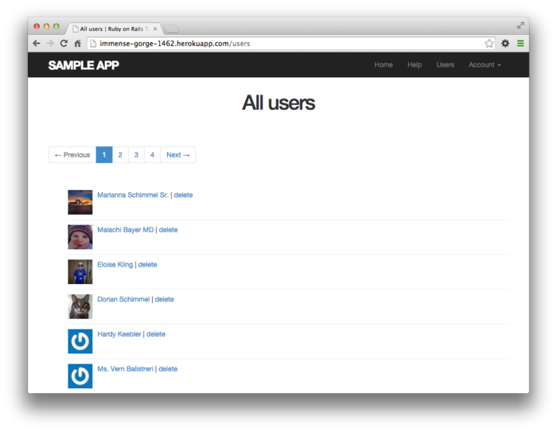

### 10.5.1 10장의 정리

- 유저는, 유저 정보 Form으로부터 PATCH 리퀘스트를 `update` 액션에 대해 송신하여 정보를 갱신한다.

- Strong Parameters를 사용하여 안전하게 Web상에서 변경할 수 있다.
- before 필터를 사용하면, 특정 액션이 실행되기 직전에 메소드를 호출할 수 있다.
- before 필터를 사용하여 권한 허가(액세스 제어) 를 실현한다.
- 권한 허가에 대한 테스트에서는 특정 HTTP 리퀘스트를 직접 송신하는 간단한 테스트와, 브라우저의 조작을 시뮬레이션하는 고급 테스트 (통합 테스트), 2개를 했다.
- Friendly Forwarding 은 로그인 성공 시의 원래 접속하고 싶었던 페이지로 전송시키는 기능이다.
- 유저 리스트 페이지에서는 모든 유저를 페이지 별로 분할하여 표시한다.
- `rails db:seed` 커맨드는 `db/seeds.rb` 에 있는 샘플 데이터를 데이터베이스에 초기값으로 넣는다.
- `render @users` 를 실행하면, 자동적으로 `_user.html.erb` partial을 참조하여 각 유저를 컬렉션으로써 다룬다.
- `boolean` 형의 `admin` 속성을 User 모델에 추가하면, `admin?` 이라는 논리오브젝트를 리턴하는 메소드가 자동적으로 추가된다.
- 관리자가 삭제링크를 클릭하면, DELETE 리퀘스트가 `destroy` 액션으로 송신되어 해당 유저가 삭제된다.
- fixture 파일 내부의 Ruby 코드를 사용하여, 대량의 테스트 데이터를 작성할 수 있다.