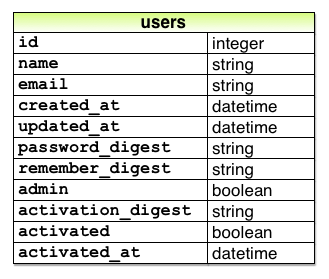
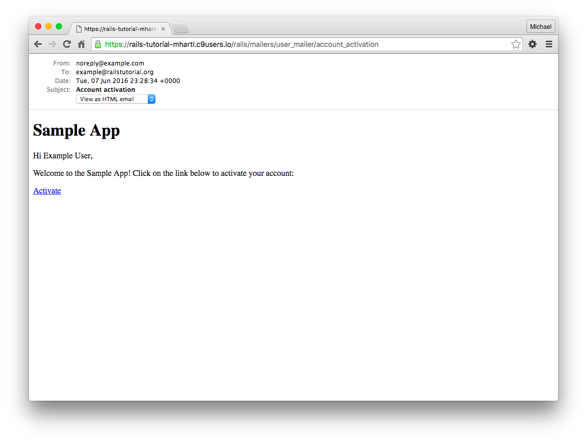
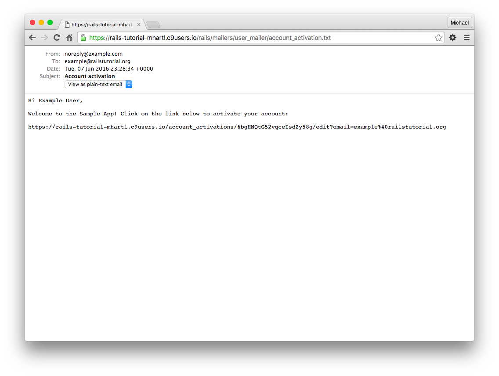
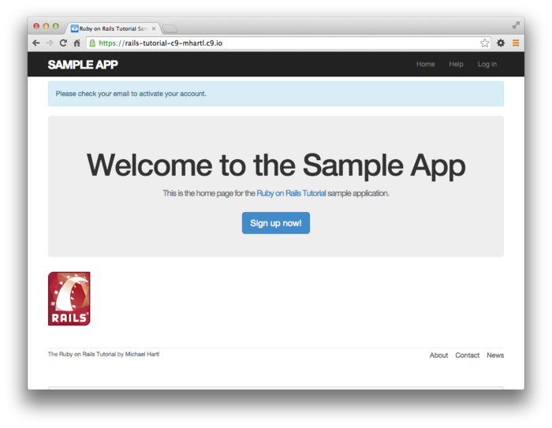
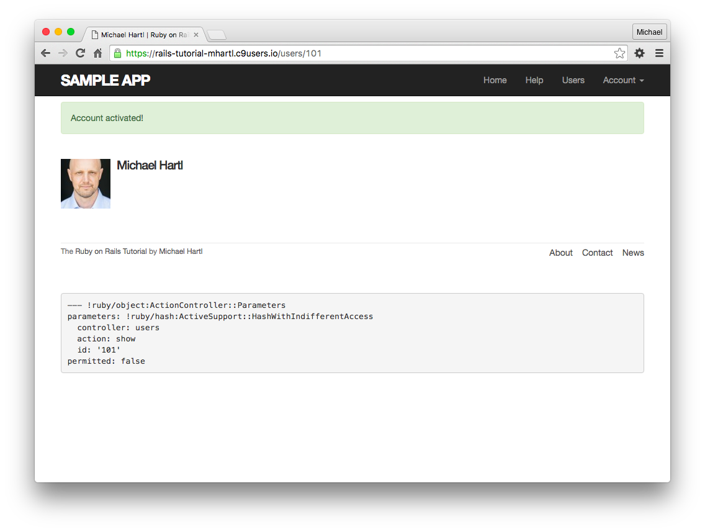
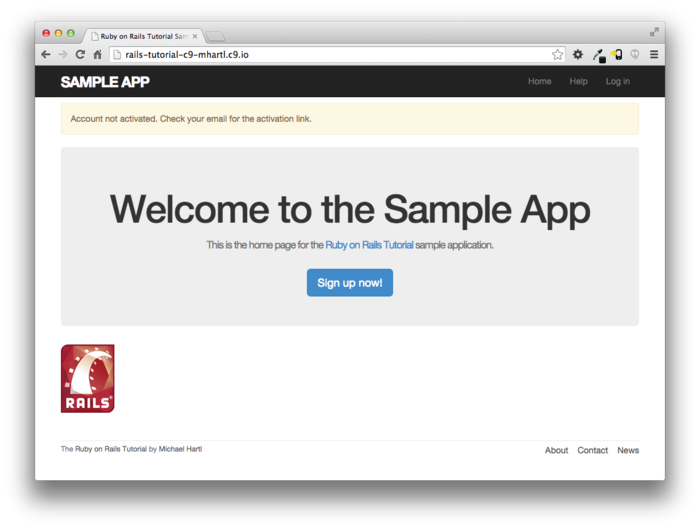
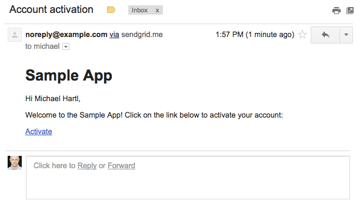
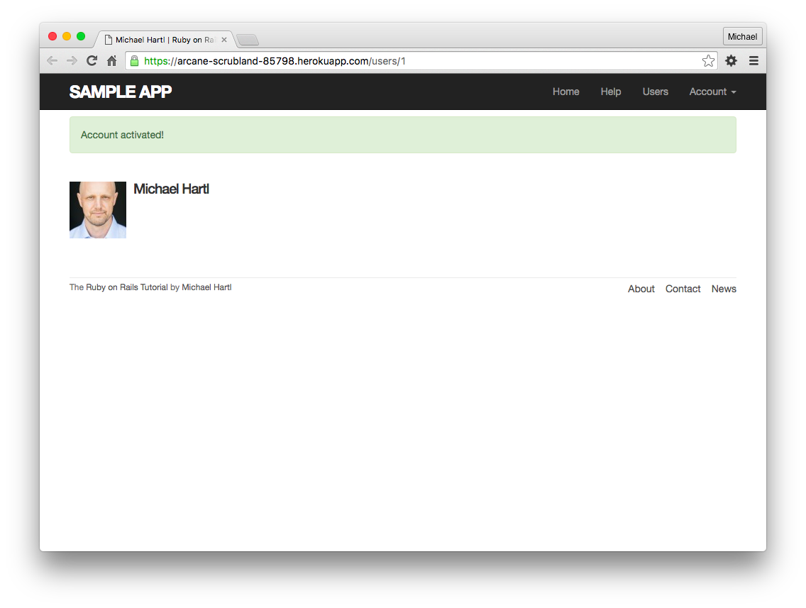

# 제 11장 Account의 유효화

현 시점에서 어플리케이션은, 신규 등록한 유저가 처음부터 모든 기능에 접근할 수 있게 되어 있습니다.([제 7장](Chapter7.md)) 이번 챕터에서는, account를 유효화시키는 스텝을 유저 신규 등록의 도중에 집어넣을 것 입니다. 정말로 해당 메일 주소의 주인인지 아닌지를 확인해볼 것이빈다. 이것을 실현시키기 위한 순서로는 

1. 유효화 토큰이나 digest를 관련지은 상태에서
2. 유효화 토큰을 포함한 링크를 유저의 메일로 송신하고
3. 유저가 해당 링크를 클릭하면 유효화되게끔 하는

순서가 될 것이빈다. 또한 제 12장에서도 비슷한 흐름으로 유저가 패스워드를 잊어버렸을 때, 패스워드를 재설정하는 기능을 구현해볼 것 입니다. 이러한 기능들은 새로운 리소스로 생성하고, 컨트롤러, 라우팅, 데이터베이스로의 이행에 대해 하나씩 배워볼 것 입니다. 마지막으로 Rails의 개발환경이나 실제 배포환경에서 실제로 메일을 송신해볼 것 입니다.


account를 유효화하는 방법은 유저 로그인([8.2](Chapter8.md#82-Login)), 유저를 기억하는 기능 ([9.1](Chapter9.md#91-Remember-me-기능)) 과 비슷합니다. 기본적인 순서는 다음과 같습니다.

1. 유저의 초기 상태로는 "유효화 되어있지 않은(*unactivated*)" 상태를 해놓는다.
2. 유저 등록 중에 유효화 토큰과, 그것에 대응하는 유효화 digest를 생성한다.
3. 유효화 digest는 데이터베이스에 저장하고, 유효화 토큰은 메일주소와 함께 유저에게 보내는 유효화용 메일의 링크에 같이 기재한다.
4. 유저가 메일의 링크를 클릭하면, 어플리케이션은 메일 주소를 키로하여 유저를 찾고, 데이터베이스 내부에 저장해놓은 유효화 digest와 비교하여 토큰을 인증한다.
5. 유저를 인증했다면 유저의 상태를 "유효화 되어있지 않은" 상태에서 "유효화 된 *(activated)*" 상태로 변경한다.

매우 감사하게도, 이번에 구현하는 account 유효화와 패스워드 재설정의 구조는, 이전에 구현해본 패스워드나 Remember 토큰의 구조와 매우 닮아 있기 때문에, 많은 아이디어를 재활용할 수 있습니다. (구체적으로는 `User.digest` 나 `User.new_token` , 개조한 `user.authenticated?` 메소드 등) 다음표에 각각의 구조의 닮은 점을 정리해보았습니다. (제 12장에서 소개할 메소드도 포함되어 있습니다.)

| 검색 Key | **string**         | **digest**          | **authentication**                   |
| -------- | ------------------ | ------------------- | ------------------------------------ |
| `email`  | `password`         | `password_digest`   | `authenticate(password)`             |
| `id`     | `remember_token`   | `remember_digest`   | `authenticated?(:remember, token)`   |
| `email`  | `activation_token` | `activation_digest` | `authenticated?(:activation, token)` |
| `email`  | `reset_token`      | `reset_digest`      | `authenticated?(:reset, token)`      |

 이번 11.1에서는 account 유효화에 필요한 리소스나 데이터 모델을 생성해볼 것입니다. 또한 11.2에서는 메일러(*mailer*) 를 사용하여 account 유효화 시의 메일 송신 부분을 작성해볼 것 입니다. 마지막으로 위 표에서 소개한 개량버전의 `authenticated?` 메소드를 사용하여 실제로 account를 유효화하는 부분을 구현해볼 것 입니다. (11.3)


## 11.1 Account Activations Resource

세션기능([8.1](Chapter8.md#81-Session)) 을 사용하여, account의 유효화라는 작업을 "리소스" 라는 단위로 모델화해보겠습니다.  account의 유효화 리소스는 Active Record의 모델과는 관계가 없기 때문에, 양쪽을 관련짓는 것은 하지 않겠습니다. 대신에 이 작업에 필요한 데이터 (유효화 토큰이나 유효화 스테이터스 등)을 User 모델에 추가해보겠습니다.


또한 Account 유효화도 리소스로 다루고 싶습니다만, 다른 때와는 조금 다르다는 점을 미리 알아두시길 바랍니다. 예를 들어 유효화용의 링크에 액세스하여 유효화 상태를 변경하는 부분에서는, REST의 규칙을 따른다면 PATCH 리퀘스트와 `update` 액션을 사용해야할 것 입니다. 그러나 유효화 링크는 메일로 유저에게 보내진다는 것을 떠올려주세요. 유저가 이 링크를 클릭하면, 그것은 브라우저에서 보통 클릭했을 때와 같은 것이며, 그때에는 브라우저에서 송신되어 지는 것은 (`update` 액션에서 사용하는 PATCH 리퀘스트가 아닌) GET 리퀘스트가 되어버립니다. 때문에 유저로부터 GET 리퀘스트를 받기 위해 (원래라면 `update` 이겠지만) `edit` 액션으로 변경하여 사용해볼 것입니다.


언제나처럼 Git에서 새로운 기능을 위한 토픽 브랜치를 생성해봅시다.

`$ git checkout -b account-activation`

### 11.1.1 Account Activations Controller

User 리소스나 Sessions 리소스때와 마찬가지로, AccountActivations 리소스를 만들기 위해, 우선 AccountActivations 컨트롤러를 생성해봅시다.

`$ rails generate controller AccountActivations`

11.2.1 에서 좀 더 상세히 설명하겠습니다만, 유효화 메일에는 다음의 URL을 포함할 것 입니다.

```
edit_account_activation_url(activation_token, ...)
```

 이것은 `edit` 액션으로의 named root가 필요하다는 것입니다. 우선은 named 루트를 다룰 수 있게 하기 위해, 아래 표처럼 라우팅에 account 유효화용 `resources` 행을 추가합니다.

```ruby
# config/routes.rb
Rails.application.routes.draw do
  root   'static_pages#home'
  get    '/help',    to: 'static_pages#help'
  get    '/about',   to: 'static_pages#about'
  get    '/contact', to: 'static_pages#contact'
  get    '/signup',  to: 'users#new'
  get    '/login',   to: 'sessions#new'
  post   '/login',   to: 'sessions#create'
  delete '/logout',  to: 'sessions#destroy'
  resources :users
  resources :account_activations, only: [:edit] #추가
end
```

일단 여기까지 해놓고, account 유효화용 데이터 모델과 메일러를 생성해볼 것 입니다만, 그게 끝나면 여기서 생성한 리소스를 기반으로하여 `edit` 액션을 정의해볼 것 이빈다. (11.3.2)

##### 연습

1. 현 시점에서 테스트 코드를 실행하면 통과하는 것을 확인해보세요.
2. 위 표에서 Named Root에서는 `_path` 가 아닌 `_url` 이 생성되어 있습니다. 왜일까요? *Hint* : 이것을 메일에서 사용할 것 입니다.

### 11.1.2 Account Activation DataModel

앞서 살짝 말씀드렸다시피, 유효화의 메일에는 유니크한 유효화토큰이 필요합니다. 바로 생각나는거정도는 송신메일과 데이터베이스 각각에 같은 문자열을 준비하는 방법입니다. 그러나 이 방법은 만에 하나 데이터베이스의 내용이 유출된다면 막대한 피해로 이어질 수 있습니다. 예를 들어 공격자가 데이터베이스로의 액세스에 성공했을 경우, 새롭게 등록하는 유저 계정의 유효화 토큰을 훔쳐내어, 유저가 사용하기 전에 해당 토큰을 사용해버리는  (그리고 해당 유저라고 속이고 로그인해버립니다) 케이스를 생각해볼 수 있습니다.


이러한 사태를 막기 위해, 패스워드의 구현 ([제 6장](Chapter6.md)) 이나 Remember 토큰 ([제 9장](Chapter9.md)) 과 같이 가상의 속성을 사용하여 해시화한 문자열을 데이터베이스에 저장해볼 것 입니다. 구체적으로는 다음과 같이 가상의 유효화 토큰에 액세스하여

`user.activation_token`

아래와 같은 코드로 유저를 인증할 수 있게 해볼 것 입니다.

`user.authenticated?(:activation, token)`

(위 코드를 하기 위해서는 이전 9장에서의 `authenticated?` 메소드를 리팩토링할 필요가 있습니다.)


이어서 `activated` 속성을 추가하여 논리값을 다루도록 해봅시다. 이것으로 [10.4.1](Chapter10.md#1041-관리자) 에서 설명했던 자동생성되는 논리값을 다루는 메소드와 비슷한 느낌으로 유저가 유효한 유저인지 아닌지를 테스트해볼 수 있을 것 입니다.

`if user.activated?`

마지막으로 본 튜토리얼에서 사용하는 것은 아니지만, 유저를 유효하게 했을 때의 시간도 기록해두도록 해봅시다. 변경후의 데이터 모델은 아래와 같습니다.



다음으로 마이그레이션을 커맨드라인에서 실행하여, 데이터 모델을 추가하면, 3개의 속성이 새롭게 추가될 것 입니다.

```
$ rails generate migration add_activation_to_users \
> activation_digest:string activated:boolean activated_at:datetime
```

([8.2.4](Chapter8.md#824-레이아웃의-변경을-테스트해보자) 에서도 말씀드렸습니다만, 위의 2번째 줄에 있는 `>` 는 개행을 나타내기 위해 쉘이 자동적으로 입력한 문자입니다. 수동으로 입력하지 않도록 주의해주세요.) 다음으로 `admin` 속성을 추가할 때와 마찬가지로, `activated` 속성의 디폴트 논리값도 `false` 으로 해놓습니다.

```ruby
class AddActivationToUsers < ActiveRecord::Migration[5.0]
  def change
    add_column :users, :activation_digest, :string
    add_column :users, :activated, :boolean, default: false
    add_column :users, :activated_at, :datetime
  end
end
```

언제나처럼 마이그레이션을 실행합니다.

`$ rails db:migrate`

#### Activation token의 Callback

유저가 새롭게 등록을 완료하기 위해서 반드시 account의 유효화를 할 필요가 있기 때문에, 유효화 토큰이나 유효화 digest는 유저 오브젝트가 생성되기 전에 만들어놓을 필요가 있습니다. 이것과 비슷한 상황을 [6.2.5](Chapter6.md#625-유니크성을-검증해보자) 에서도 설명한 적이 있습니다. 메일 주소를 데이터베이스에 저장하기 전에, 메일 주소를 전부 소문자로 변환할 필요가 있었습니다. 그 때에는 `before_save` 콜백에 `downcase` 메소드를 지정하였습니다. 오브젝트에 `before_save` 콜백을 준비해놓으면, 오브젝트가 저장되기 직전, 오브젝트의 생성시나 수정 시의 해당 콜백이 호출됩니다. 그러나 이번에는 오브젝트가 생성되었을 떄만 콜백을 호출하고 싶습니다. 그 외의 때에는 호출하고 싶지 않습니다. 여기서 `before_create` 콜백이 필요하게 됩니다. 이 콜백은 다음과 같이 정의할 수 있습니다.

```
before_create :create_activation_digest
```

위 코드는 *메소드 참조* 라고 불리는 것인데, 이렇게 해놓으면 Rails는 `create_activation_digest` 라고하는 메소드를 찾아 유저를 생성하기 전에 실행하게 됩니다. (6장에서는 `before_save` 에 명시적으로 블록을 전달하고 있습니다만, 사실 메소드를 참조하는 편을 추천합니다.)

`create_activation_digest` 메소드 자체는 User 모델 내부에서밖에 사용하지 않기 때문에, 외부에 공개할 필요는 없습니다. [7.3.2](Chapter7.md#732-Strong-Parameters) 와 마찬가지로 `private` 키워드를 지정하여 해당 메소드를 은폐합니다.

```ruby
private

  def create_activation_digest
    # 유효화 토큰과 Digest의 생성 및 대입을 한다.
  end
```

클래스 안에서의 `private` 키워드로 인해 아래 작성한 메소드는 자동적으로 비공개가 됩니다. 이것은 콘솔에서도 바로 확인할 수 있습니다.

```ruby
$ rails console
>> User.first.create_activation_digest
NoMethodError: private method `create_activation_digest' called for #<User>
```

이번 `before_create` 콜백을 사용하는 목적은, 토큰과 그것에 대응하는 Digest를 할당하기 위해서입니다. 실제로 할당은 아래와 같습니다.

```ruby
self.activation_token  = User.new_token
self.activation_digest = User.digest(activation_token)
```

이 코드에서는 Remeber 토큰과 Remember Digest를 위해 작성한 메소드를 재활용합니다. 9장에서의 `remember` 메소드와 비교해봅시다.

```ruby
# 영속적인 세션을 위해 유저를 데이터베이스에 저장한다.
def remember
  self.remember_token = User.new_token
  update_attribute(:remember_digest, User.digest(remember_token))
end
```

주된 차이점은, 후자의 `update_attribute`의 사용법에 있습니다. 이 차이는, Remember 토큰과 Digest는 이미 데이터베이스에 존재하는 유저를 위해 생성하는 것에 비해, `before_create`  콜백은 유저가 생성되기 *전* 에 호출되기 때문입니다. 이 콜백의 존재로 인하여 `User.new` 로 새로운 유저를 정의하면, `activation_token` 속성이나 `activation_digest` 속성을 확인할 수 있게 되는 것입니다. 또한 후자의 `activation_digest` 속성은 이미 데이터베이스의 컬럼과 관련지어져있기 때문에, 유저가 저장될 때 같이 저장됩니다.


위에 설명한 것을 User모델에 구현해보면 아래와 같이 됩니다. 유효화 토큰은 본질적으로 가상의 토큰이어야만합니다. 따라서 이 모델에서는 `attr_accessor` 에 하나 더 추가해봅니다. 이전에 구현한 메일 주소를 소문자로 바꾸는 메소드도 메소드 참조형으로 바꾸고 있다는 것을 참고해주세요.

```ruby
# app/models/user.rb
class User < ApplicationRecord
  attr_accessor :remember_token, :activation_token
  before_save   :downcase_email
  before_create :create_activation_digest
  validates :name,  presence: true, length: { maximum: 50 }
  .
  .
  .
  private

    # 메일 주소를 전부 소문자로 바꾼다.
    def downcase_email
      self.email = email.downcase
    end

    # 유효화 토큰과 digest 생성 및 대입을 한다.
    def create_activation_digest
      self.activation_token  = User.new_token
      self.activation_digest = User.digest(activation_token)
    end
end
```

#### Sample 유저의 작성 테스트

진행하기에 앞서, 샘플 데이터와 fixture를 수정하여 테스트시의 샘플과 유저를 사전에 유효화해놓습니다. 또한 `Time.zone.now` 는 Rails에서의 기본 제공 헬퍼이며, 서버의 타임존에 따라서 타임 스탬프를 리턴합니다.

```ruby
# db/seeds.rb
User.create!(name:  "Example User", 
						email: "example@railstutorial.org",
             password:              "foobar",
             password_confirmation: "foobar",
             admin:     true,
             activated: true,
             activated_at: Time.zone.now)

99.times do |n|
  name  = Faker::Name.name
  email = "example-#{n+1}@railstutorial.org"
  password = "password"
  User.create!(name:  name,
              email: email,
              password:              password,
              password_confirmation: password,
              activated: true,
              activated_at: Time.zone.now)
end
```

```
// test/fixtures/users.yml

michael:
  name: Michael Example
  email: michael@example.com
  password_digest: <%= User.digest('password') %>
  admin: true
  activated: true
  activated_at: <%= Time.zone.now %>

archer:
  name: Sterling Archer
  email: duchess@example.gov
  password_digest: <%= User.digest('password') %>
  activated: true
  activated_at: <%= Time.zone.now %>

lana:
  name: Lana Kane
  email: hands@example.gov
  password_digest: <%= User.digest('password') %>
  activated: true
  activated_at: <%= Time.zone.now %>

malory:
  name: Malory Archer
  email: boss@example.gov
  password_digest: <%= User.digest('password') %>
  activated: true
  activated_at: <%= Time.zone.now %>

<% 30.times do |n| %>
user_<%= n %>:
  name:  <%= "User #{n}" %>
  email: <%= "user-#{n}@example.com" %>
  password_digest: <%= User.digest('password') %>
  activated: true
  activated_at: <%= Time.zone.now %>
<% end %>
```

언제나럼 데이터베이스를 초기화하고, 샘플데이터를 다시 생성하여 위 변경사항을 적용해봅시다.

```
$ rails db:migrate:reset
$ rails db:seed
```

##### 연습

1. 이번 섹션에서 변경한 점을 적용하고, 테스트가 통과하는지 확인해봅시다.
2. 콘솔에서 User 클래스의 인스턴스를 생성하고, 해당 오브젝트로부터 `create_activation_digest` 메소드를 호출해보면 (private 메소드 이기 때문에) `NoMethodError` 가 발생하는 것을 확인해봅시다. 또한 해당 User 오브젝트로부터 Digest값도 확인해봅시다.
3. 이전 6장에서 메일주소의 소문자화는 `email.downcase!` 라고 하는 (대입하지 않고 끝나는) 메소드가 있는 것을 기억하고 있습니다. 이 메소드를 사용하여 `downcase_email` 메소드를 개선해봅시다. 또한 제대로 변경했다면, 테스트 코드를 실행하여 제대로 동작하는지를 확인해봅시다.


## 11.2 Account 유효화의 메일 발신

데이터의 모델화가 끝났습니다. 이번에는 account 유효화 메일의 발신함에 있어 필요한 코드를 추가해보겠습니다. 이 메소드에서는 Action Mailer 라이브러리를 사용하여 User의 *Mailer* 를 추가해봅니다. 이 메일러는 User 컨트롤러의  `create` 액션에서 유효화 링크를 메일 발신하기 위해 사용할 것입니다. 메일러의 구성은 컨트롤러의 액션과 매우 비슷하며, 메일의 템플레이트를 뷰와 비슷한 방법으로 정의할 것 입니다. 이 템플렛의 안에 유효화 토큰과 메일 주소 (=유효하게 하는 account의 주소) 링크를 포함하여 사용해볼 것 입니다.

### 11.2.1 발신 메일의 템플릿

메일러는 모델이나 컨트롤러과 마찬가지로 `rails generate` 로 생성할 수 있습니다.

`$ rails generate mailer UserMailer account_activation password_reset`

위 코드를 실행하는 것으로 이번에 필요한 `account_activation` 메소드와, 제 12장에서 사용할 `password_reset` 메소드가 생성됩니다.


또한, 위 코드에서는 생성한 메일러별로 뷰의 템플렛이 2개씩 생성됩니다. 하나는 텍스트 메일 용의 템플렛과, 하나는 HTML 메일용의 템플렛입니다. account 유효화에 사용하는 템플렛은 아래 2개의 코드입니다. 또한 패스워드 재설정에서 사용하는 템플렛은 제 12장에서 사용해볼 것 입니다.

```erb
<!-- app/views/user_mailer/account_activation.text.erb -->
UserMailer#account_activation

<%= @greeting %>, find me in app/views/user_mailer/account_activation.text.erb
```

```erb
<!-- app/views/user_mailer/account_activation.html.erb -->
<h1>UserMailer#account_activation</h1>

<p>
  <%= @greeting %>, find me in app/views/user_mailer/account_activation.html.erb
</p>
```

생성된 메일러의 동작을 간단하게 확인해봅시다. 아래 첫 번째 코드는 기본으로 `from` 주소 (어플리케이션 전체적으로 공통) 이 있습니다. 아래 두 번째 코드의 각 메소드에는 수신하는 메일주소도 있습니다. 첫 번째 코드에서는 메일의 포맷에 대응하는 메일러 레이아웃도 사용할 수 있습니다. 또한 본 튜토리얼의 설명에는 직접적인 관계는 없습니다만, 생성된 HTML 메일러의 레이아웃이나 텍스트 메일러의 레이아웃은 `app/views/layouts` 에서 확인할 수 있습니다. 생성된 코드에는 인스턴스 변수 `@greeting` 도 포함되어 있습니다. 이 인스턴스 변수는 보통 뷰의 컨트롤러의 인스턴스 변수를 이용할 수 있는 것과 마찬가지로, 메일러 뷰에서 사용할 수 있습니다.

```ruby
# app/mailers/application_mailer.rb
class ApplicationMailer < ActionMailer::Base
  default from: "from@example.com"
  layout 'mailer'
end
```

```ruby
# app/mailers/user_mailer.rb
class UserMailer < ApplicationMailer

  # Subject can be set in your I18n file at config/locales/en.yml
  # with the following lookup:
  #
  #   en.user_mailer.account_activation.subject
  #
  def account_activation
    @greeting = "Hi"

    mail to: "to@example.org"
  end

  # Subject can be set in your I18n file at config/locales/en.yml
  # with the following lookup:
  #
  #   en.user_mailer.password_reset.subject
  #
  def password_reset
    @greeting = "Hi"

    mail to: "to@example.org"
  end
end
```

제ㄹ 처음으로 생성된 템플렛을 커스터마이즈하여 실제로 유효화 메일에서 사용할 수 있도록 해봅시다. 그 다음으로 유저를 포함하는 인스턴스 변수를 생성하여 뷰에서 사용할 수 있도록하고, `user.email` 에 메일을 발신해봅시다. 아래 두번째 코드에서는 `mail` 에 `subject` 키를 파라미터로서 넘기고 있습니다. 이 값은 메일의 제목이 됩니다.

```ruby
# app/mailers/application_mailer.rb
class ApplicationMailer < ActionMailer::Base
  default from: "noreply@example.com"
  layout 'mailer'
end
```

``` ruby
# app/mailers/user_mailer.rb
class UserMailer < ApplicationMailer

  def account_activation(user)
    @user = user
    mail to: user.email, subject: "Account activation"
  end

  def password_reset
    @greeting = "Hi"

    mail to: "to@example.org"
  end
end
```

템플릿 뷰는 통상의 뷰와 마찬가지로 ERB로 자유롭게 커스터마이즈할 수 있습니다. 여기서는 인사문에 유저 이름을 포함한 커스텀에 유효화 링크를 추가해보겠습니다. 그 후, Rails 서버에서 유저를 메일주소로 검색하여 유효화 토큰을 인증할 수 있게 하고자, 링크에는 메일주소와 토큰을 같이 포함해놓을 필요가 있습니다. AccountActivation 리소스에서 유효화를 모델화하였습니다. 토큰 자체는 앞서 정의한 named root의 파라미터로 사용합니다.

```
edit_account_activation_url(@user.activation_token, ...)
```

여기서 예전 생각을 다시 해봅시다.

```
edit_user_url(user)
```

위 메소드는 다음 형식의 URL을 생성합니다.

`http://www.example.com/users/1/edit`

여기에 대응하는 account 유효화 링크의 베이스 URL은 다음과 같습니다.

```
http://www.example.com/account_activations/q5lt38hQDc_959PVoo6b7A/edit
```

위 URL의 「`q5lt38hQDc_959PVoo6b7A`」 라고 하는 부분은 `new_token` 메소드에서 생성된 것 입니다. URL 에서 사용할 수 있도록 Base64 에서 인코딩하고 있습니다. 이것은 마침 /users/1/edit 의 `1` 과 같이, 유저 ID와 같은 역할을 하고 있습니다. 이 토큰은 특히 AccountActivations 컨트롤러의 `edit`  액션에서 `params` 해시로 `params[:id]` 로써 참조합니다.


*Query parameter* 를 사용하여 해당 URL에 메일주소를 한 번 넣어봅시다. Query parameter란 URL의 마지막에 의문부호 `?` 를 넣고, 그 다음에 키와 값의 페어를 기술한 것 입니다.

```
account_activations/q5lt38hQDc_959PVoo6b7A/edit?email=foo%40example.com
```

이 때, 메일주소의 `@`기호가 URL에서는 `%40` 으로 변환되어 있는 점을 주목해주세요. 이것은 "Escape" 라고 불리는 수법으로, 통상 URL에서는 다루지 않는 문자를 다루기 위해 변환하고 있습니다. Rails에서 Query parameter 를 설정하기 위해서는, named root에 대하여 다음과 같이 해시를 추가합니다.

```
edit_account_activation_url(@user.activation_token, email: @user.email)
```

여까지 왔다면, `user_mailer.rb` 에서 정의한 `@user` 인스턴스 변수, edit로의 named root, ERB를 조합하여 필요한 링크를 생성할 수 있습니다. 아래 첫 번째 코드의 HTML 템플릿에서는 올바른 링크를 조합하기 위해 `link_to` 메소드를 사용하는 것을 확인해주세요.

```erb
<!-- app/views/user_mailer/account_activation.text.erb -->
Hi <%= @user.name %>,

Welcome to the Sample App! Click on the link below to activate your account:

<%= edit_account_activation_url(@user.activation_token, email: @user.email) %>
```

```erb
<!-- app/views/user_mailer/account_activation.html.erb -->
<h1>Sample App</h1>

<p>Hi <%= @user.name %>,</p>

<p>
Welcome to the Sample App! Click on the link below to activate your account:
</p>

<%= link_to "Activate", edit_account_activation_url(@user.activation_token,
                                                    email: @user.email) %>
```

##### 연습

1. 콘솔을 실행하고, `CGI` 모듈의 `escape` 메소드에서 메일주소의 문자열을 escape 할 수 있는 것을 확인해봅시다. 이 메소드에서 `"Don't panic!"` 를  escape하면 어떤 결과가 나오나요?

```
>> CGI.escape('foo@example.com')
=> "foo%40example.com"
```

### 11.2.2 발신 메일의 Preview

템플렛의 실제 표시를 간단하기 확인하기 위해, *Mail Preview* 라고 하는 테크닉을 사용해봅시다. Rails에서는 특수한 URL 에 액세스하면, 메일의 메세지를 그 자리에서 미리 볼 수 있습니다. 메일을 실제로 발신하지 않아도 되기에 매우 편리합니다. 이것을 이용하려면 application의 development환경의 설정을 손볼 필요가 있습니다.

```ruby
# config/environments/development.rb
Rails.application.configure do
  .
  .
  .
  config.action_mailer.raise_delivery_errors = true
  config.action_mailer.delivery_method = :test
  host = 'example.com' # 여기를 이대로 복사하여 붙여넣으면 실패합니다. 자신의 환경에 맞추어 수정해주세요.
  config.action_mailer.default_url_options = { host: host, protocol: 'https' }
  .
  .
  .
end
```

위 코드에 있는 호스트명 `example.com` 의 부분은, 각자의 development 환경에 맞추어서 변경해주세요. 예를 들어 필자는 클라우드 IDE를 사용하고 있기 때문에 아래처럼 바꾸었습니다.

```ruby
host = 'rails-tutorial-mhartl.c9users.io'     # cloud IDE
config.action_mailer.default_url_options = { host: host, protocol: 'https' }
```

혹시 자신이 로컬환경에서 개발하고 있는 경우에는 다음과 같습니다.

```ruby
host = 'localhost:3000'                     # local
config.action_mailer.default_url_options = { host: host, protocol: 'http' }
```

development 서버를 재부팅하여 위 설정을 읽어들이게 하면, 자동생성된 User 메일러의 Preview 파일의 수정이 필요합니다.

```ruby
# test/mailers/previews/user_mailer_preview.rb
# Preview all emails at http://localhost:3000/rails/mailers/user_mailer
class UserMailerPreview < ActionMailer::Preview

  # Preview this email at
  # http://localhost:3000/rails/mailers/user_mailer/account_activation
  def account_activation
    UserMailer.account_activation
  end

  # Preview this email at
  # http://localhost:3000/rails/mailers/user_mailer/password_reset
  def password_reset
    UserMailer.password_reset
  end
end
```

`user_mailer.rb` 에서 생성한 `account_activation` 의 파라미터에는 유효한 User 오브젝트를 입력할 필요가 있기 때문에, 위 코드는 동작하지 않습니다. 이것을 피하기 위해 `user` 변수가 개발용 데이터베이스의 제일 첫 번째 유저가 되도록 정의하고, 그 것을 `UserMailer.account_activation` 의 파라미터로써 넘깁니다. 이 때 아래 코드에서는 `user.activation_token` 의 값에도 대입하고 있는 점을 주목해주세요. 이전 템플릿에서는 account 유효화의 토큰이 필요하기 때문에, 대입은 생략할 수 없습니다. 또한 `activation_token` 에서는 가상의 속성이므로, 데이터베이스의 유저는 이 값을 실제로 가지고 있지 않습니다.

```ruby
# test/mailers/previews/user_mailer_preview.rb
# Preview all emails at http://localhost:3000/rails/mailers/user_mailer
class UserMailerPreview < ActionMailer::Preview

  # Preview this email at
  # http://localhost:3000/rails/mailers/user_mailer/account_activation
  def account_activation
    user = User.first
    user.activation_token = User.new_token
    UserMailer.account_activation(user)
  end

  # Preview this email at
  # http://localhost:3000/rails/mailers/user_mailer/password_reset
  def password_reset
    UserMailer.password_reset
  end
end
```

위 Preview 코드를 구현하면, 지정된 URL 로 account 유효화 메일을 미리볼 수 있게 됩니다.(클라우드 IDE의 경우에는 `localhost:3000` 부분을 베이스 URL로 바꾸어주세요.) HTML 메일과 텍스트 메일의 미리보기는 아래와 같습니다.





##### 연습

1. Rails의 Preview 기능을 사용하여, 브라우저로부터 앞서 메일을 표시해보세요. "Date" 란에는 어떠한 내용이 표시되나요?

### 11.2.3 발신 메일의 테스트

마지막으로, 이 메일 Preview의 테스트 코드도 작성하여, Preview를 더블체크할 수 있도록 해봅시다. 편리한 테스트 예시가 Rails에 의해서 자동생성되어지므로, 이것을 이용하면 테스트 생성은 의외로 간단합니다.

```ruby
# test/mailers/user_mailer_test.rb
require 'test_helper'

class UserMailerTest < ActionMailer::TestCase

  test "account_activation" do
    mail = UserMailer.account_activation
    assert_equal "Account activation", mail.subject
    assert_equal ["to@example.org"], mail.to
    assert_equal ["from@example.com"], mail.from
    assert_match "Hi", mail.body.encoded
  end

  test "password_reset" do
    mail = UserMailer.password_reset
    assert_equal "Password reset", mail.subject
    assert_equal ["to@example.org"], mail.to
    assert_equal ["from@example.com"], mail.from
    assert_match "Hi", mail.body.encoded
  end
end
```

위 테스트에서는 `assert_match` 라고 하는 매우 강력한 메소드가 사용되고 있습니다. 이것을 사용한다면, 정규표현으로 문자열을 테스트할 수도 있습니다.

```
assert_match 'foo', 'foobar'      # true
assert_match 'baz', 'foobar'      # false
assert_match /\w+/, 'foobar'      # true
assert_match /\w+/, '$#!*+@'      # false
```

아래의 테스트 코드에서는, `assert_match` 메소드를 사용하여 이름, 유효화 토큰, escape가 되어있는 메일주소가 메일 본문에 포함되어 있는지를 테스트합니다. 마지막으로 기술 한 가지 더 알려드리겠습니다.

`CGI.escape(user.email)`

[11.2.1](#1121- 발신-메일의-템플릿) 의 연습문제에서 소개한 위 메소드를 사용하면, 테스트용 유저의 메일주소를 escape할 수 있습니다.

```ruby
require 'test_helper'

class UserMailerTest < ActionMailer::TestCase

  test "account_activation" do
    user = users(:michael)
    user.activation_token = User.new_token
    mail = UserMailer.account_activation(user)
    assert_equal "Account activation", mail.subject
    assert_equal [user.email], mail.to
    assert_equal ["noreply@example.com"], mail.from
    assert_match user.name,               mail.body.encoded
    assert_match user.activation_token,   mail.body.encoded
    assert_match CGI.escape(user.email),  mail.body.encoded
  end
end
```

위 테스트 코드에서는 fixture 유저에게 유효화 토큰을 추가하고 있는 점을 주목해주세요. 추가하지 않는 경우에는 공백이 들어가게 됩니다. 또한 위에서 생성된 패스워드 설정 테스트 코드는 삭제했습니다만,  추후 12.2.2에서 원래대로 돌려서 테스트해볼 것 입니다.


이 테스트가 통과하기 위해선, 테스트파일 내의 도메인 이름을 올바르게 설정할 필요가 있습니다.

```ruby
# config/environments/test.rb
Rails.application.configure do
  .
  .
  .
  config.action_mailer.delivery_method = :test
  config.action_mailer.default_url_options = { host: 'example.com' } #추가
  .
  .
  .
end
```

위 코드를 사용하면 테스트는 통과할 것 입니다.

`$ rails test:mailers`

##### 연습

1. 이 시점에서 전 테스트 코드(Test Suite) 가 통과하는 것을 확인해봅시다.
2. 테스트 코드에서 사용한 `CGI.escape` 의 부분을 삭제하면, 테스트가 실패하는 것을 확인해봅시다.

### 11.2.4 유저의 Create 액션의 수정

이 다음은, 유저 등록을 실행하는 `create` 액션에 몇 줄 추가하는 것으로 메일러를 어플리케이션에서 실제로 사용해볼 수 있습니다. 아래 코드에서는 등록 시의 리다이렉트의 거통이 수정되어있는 점을 주목해주세요. 변경 전에는 유저의 프로필 페이지로 리다이렉트 하고 있었습니다만, Account 유효화를 구현하고 나서는 무의미한 동작이므로, 리다이렉트 URL 을 변경하고 있습니다.

```ruby
# app/controllers/users_controller.rb
class UsersController < ApplicationController
  .
  .
  .
  def create
    @user = User.new(user_params)
    if @user.save
      # 수정
      UserMailer.account_activation(@user).deliver_now
      flash[:info] = "Please check your email to activate your account."
      redirect_to root_url
      # 수정
    else
      render 'new'
    end
  end
  .
  .
  .
end
```

위 코드에서는 리다이렉트 URL을 프로필 페이지로부터 루트 URL로 변경하고, 또한 유저는 이전과 같이 로그인하지 않게 되어있습니다. 따라서 어플리케이션의 동작이 설령 올바르더라도 현재 테스트 코드는 실패할 것 입니다. 실패가 발생하는 테스트 코드를 일단 코멘트아웃 해놓습니다. 코멘트아웃 한 부분은 11.3.3 account 유효화의 테스트를 통과시키도록 할 때 원래대로 되돌려 놓습니다.

```ruby
# test/integration/users_signup_test.rb
require 'test_helper'

class UsersSignupTest < ActionDispatch::IntegrationTest

  test "invalid signup information" do
    get signup_path
    assert_no_difference 'User.count' do
      post users_path, params: { user: { name:  "",
                                         email: "user@invalid",
                                         password:              "foo",
                                         password_confirmation: "bar" } }
    end
    assert_template 'users/new'
    assert_select 'div#error_explanation'
    assert_select 'div.field_with_errors'
  end

  test "valid signup information" do
    get signup_path
    assert_difference 'User.count', 1 do
      post users_path, params: { user: { name:  "Example User",
                                         email: "user@example.com",
                                         password:              "password",
                                         password_confirmation: "password" } }
    end
    follow_redirect!
    # assert_template 'users/show'
    # assert is_logged_in?
  end
end
```

이 ㅇ사태에서 실제로 신규 유저를 등록해보면, 리다이렉트되어져 홈으로 돌아가고, 아래와 같은 메일이 생성됩니다. 단 실제로 메일이 생성되어지는 것은 아니기 때문에 주의해주세요. 여기서 인용한 것은 서버 로그에 출력된 메일입니다. (메일을 확인하려면 다소 스크롤을 해야합니다.) production 환경에서도 실제로 메일 전송이 되는 방법은 11.4 에서 설명합니다.

```
UserMailer#account_activation: processed outbound mail in 292.4ms
Sent mail to michael@michaelhartl.com (47.3ms)
Date: Mon, 06 Jun 2016 20:17:41 +0000
From: noreply@example.com
To: michael@michaelhartl.com
Message-ID: <f2c9222494c7178e@mhartl-rails-tutorial-3045526.mail>
Subject: Account activation
Mime-Version: 1.0
Content-Type: multipart/alternative;
 boundary="--==_mimepart_5755da6513e89_f2c9222494c71639";
 charset=UTF-8
Content-Transfer-Encoding: 7bit


----==_mimepart_5755da6513e89_f2c9222494c71639
Content-Type: text/plain;
 charset=UTF-8
Content-Transfer-Encoding: 7bit

Hi Michael Hartl,

Welcome to the Sample App! Click on the link below to activate your account:

https://rails-tutorial-mhartl.c9users.io/account_activations/
-L9kBsbIjmrqpJGB0TUKcA/edit?email=michael%40michaelhartl.com

----==_mimepart_5755da6513e89_f2c9222494c71639
Content-Type: text/html;
 charset=UTF-8
Content-Transfer-Encoding: 7bit

<!DOCTYPE html>
<html>
  <head>
    <meta http-equiv="Content-Type" content="text/html; charset=utf-8" />
    <style>
      /* Email styles need to be inline */
    </style>
  </head>

  <body>
    <h1>Sample App</h1>

<p>Hi Michael Hartl,</p>

<p>
Welcome to the Sample App! Click on the link below to activate your account:
</p>

<a href="https://rails-tutorial-mhartl.c9users.io/account_activations/
-L9kBsbIjmrqpJGB0TUKcA/edit?email=michael%40michaelhartl.com">Activate</a>
  </body>
</html>

----==_mimepart_5755da6513e89_f2c9222494c71639--
```



##### 연습

1. 새로운 유저를 등록했을 때, 리다이렉트 URL이 적절하게 바뀐 것을 확인해봅시다. 그 후 Rails서버의 로그로부터 발신 메일의 내용을 확인해봅시다. 유효화 토큰의 값은 어떻게 되어있습니까?
2. 콘솔을 실행하고, 데이터베이스 상의 유저가 작성되어진 것을 확인해봅시다. 또한 이 유저는 데이터베이스 상에 있습니다만, 유효화 스테이터스가  `false` 의 상태인 것을 확인해주세요.

## 11.3 Account 를 유효화 해보자

메일이 제대로 작성되었다면, 이번에는 AccountActivations 컨트롤러의 `edit` 액션을 작성해봅시다. 또한 액션의 테스트를 확인하고 제대로 테스트할 수 있는지 확인한다면, AccountActivations 컨트롤러부터 User 모델로 코드를 이동해가는 작업 (리팩토링)을 해볼 것 입니다.

### 11.3.1 authenticated? 메소드의 추상화

여기서, 유효화 토큰과 메일을 각각 `params[:id]` 과 `params[:email]` 를 참고하고 있는 것을 떠올려주세요. 패스워드의 모델과 Remember 토큰을 배운 것을 기반으로, 다음과 같은 코드에서 유저를 검색하여 인증해보고자 합니다.

```
user = User.find_by(email: params[:email])
if user && user.authenticated?(:activation, params[:id])
```

(이 다음으로 위 식의 논리값을 하나 더 추가할 것 입니다. 그것이 무엇인지는 생각해보세요.)


위 코드에서 사용하고 있는 `authenticated?` 메소드는 account 유효화의 Digest와 넘겨진 토큰이 일치하는지를 체크하고 있습니다. 단 이 메소드는 Remember 토큰용이기 때문에 지금은 제대로 움직이지 않습니다.

```ruby
#  토큰과 Digest가 일치하면 True를 리턴 한다.
def authenticated?(remember_token)
  return false if remember_digest.nil?
  BCrypt::Password.new(remember_digest).is_password?(remember_token)
end
```

`remember_digest` 는 User 모델의 속성이기 때문에, 모델 내부에서는 다음과 같이 작성할 수 있습니다.

`self.remember_digest`

이번에는 위 코드의 remember 부분을 어떻게든 수정을 해서 *변수* 로 다루고 싶습니다. 즉 다음의 코드처럼 상황에 따라 호출하는 메소드를 바꾸고 싶습니다.

`self.FOOBAR_digest`

지금부터 구현할 `authenticated?` 메소드에서는 입력받은 파라미터에 대해 호출하는 메소드를 바꾸는 방법을 사용해보겠습니다.


언뜻, 신기하게 보이는 이 방법은 "*Meta programming*" 이라고 불립니다. 메타프로그래밍이라는 말처럼, "프로그램에서 프로그램을 작성한다." 라는 뜻입니다. 메타 프로그래밍은 Ruby가 가진 매우 강력한 기능이며, Rails의 이러한 마법처럼 보이는 기능의 많은 부분은, Ruby의 메타프로그래밍에 의해 구현되어 있습니다. 여기서 중요한 것은, `send`  메소드의 강력한 기능입니다. 이 메소드는 넘겨받은 오브젝트에 "메세지를 보내는" 것에 의하여 호출하는 메소드를 동적으로 결정할 수 있습니다. 예를 들어 Rails 콘솔을 열고, Ruby의 오브젝트에 대해  `send` 메소드를 실행하여 배열의 길이를 알 수 있습니다.

```ruby
$ rails console
>> a = [1, 2, 3]
>> a.length
=> 3
>> a.send(:length)
=> 3
>> a.send("length")
=> 3
```

이 때  `send` 를 통해 넘겨받은 심볼 `:length` 나 문자열 `"length"` 은 양쪽 다 `length` 메소드와 같은 결과가 되었습니다. 즉, 어느쪽이던 오브젝트에 `length` 메소드를 넘기고 있기 때문에, 같은 값이 되는 것입니다. 한 가지 더 다른 예를 봅시다. 데이터베이스의 제일 첫 유저가 가지는 `activation_digest` 속성에 액세스하는 예 입니다.

```ruby
>> user = User.first
>> user.activation_digest
=> "$2a$10$4e6TFzEJAVNyjLv8Q5u22ensMt28qEkx0roaZvtRcp6UZKRM6N9Ae"
>> user.send(:activation_digest)
=> "$2a$10$4e6TFzEJAVNyjLv8Q5u22ensMt28qEkx0roaZvtRcp6UZKRM6N9Ae"
>> user.send("activation_digest")
=> "$2a$10$4e6TFzEJAVNyjLv8Q5u22ensMt28qEkx0roaZvtRcp6UZKRM6N9Ae"
>> attribute = :activation
>> user.send("#{attribute}_digest")
=> "$2a$10$4e6TFzEJAVNyjLv8Q5u22ensMt28qEkx0roaZvtRcp6UZKRM6N9Ae"
```

제일 첫 번째 예는,  심볼 `:activation` 과 같은 `attribute` 변수를 정의하고, 문자열의 식전개 (interpolation) 를 사용하여 파라미터를 조합한 후, `send` 로 넘기고 있습니다. 문자열 `'activation'` 처럼 사용할 수 있습니다만, Ruby에서는 심볼을 사용하는 것이 일반적입니다.

`"#{attribute}_digest"`

심볼과 문자열 어느쪽을 사용하던, 위 코드는 다음과 같이 문자열로 변환됩니다.

`"activation_digest"`

이것은, [7.4.2](Chapter7.md#742-flash) 에서 심볼이 식전개되어져서 문자열이 된 것과 같은 이치입니다.


`send` 메소드의 동작원리를 알게 되었습니다. 이 원래를 이용하여 `authenticated?` 메소드를 개선해봅시다.

```ruby
def authenticated?(remember_token)
  digest = self.send("remember_digest") #수정
  return false if digest.nil? #수정
  BCrypt::Password.new(digest).is_password?(remember_token) #수정
end
```

위 코드의 각 파라미터를 일반화하여 문자열의 식전개를 이용하면 다음과 같은 코드가 됩니다.

```ruby
def authenticated?(attribute, token)
  digest = self.send("#{attribute}_digest")
  return false if digest.nil?
  BCrypt::Password.new(digest).is_password?(token)
end
```

 다른 인증에서도 사용할 수 있도록, 위에서는 2번째 파라미터`token` 의 이름을 변경하여 일반화하고 있는 점을 주의해주세요. 또한 이 코드는 모델내부에 있기 때문에,  `self` 는 생략할 수도 있습니다. 최종적으로 Ruby답게 작성된 코드는 다음과 같습니다.

```ruby
def authenticated?(attribute, token)
  digest = send("#{attribute}_digest")
  return false if digest.nil?
  BCrypt::Password.new(digest).is_password?(token)
end
```

여기까지 했다면, 다음처럼 호출하는 것으로 `authenticated?` 의 이전 동작을 다시 구현할 수 있는 것입니다.

```ruby
user.authenticated?(:remember, remember_token)
```

여기까지의 설명을 실제로 User 모델에 적용하여, 추상화한 `authenticated?` 메소드는 아래와 같습니다.

```ruby
class User < ApplicationRecord
  .
  .
  .
  # 토큰이 digest와 일치하면 true를 리턴한다.
  def authenticated?(attribute, token)
    digest = send("#{attribute}_digest")
    return false if digest.nil?
    BCrypt::Password.new(digest).is_password?(token)
  end
  .
  .
  .
end
```

위 코드는 일단 현 시점에서는 테스트가 실패할 것입니다.

`$ rails test`

테스트가 실패하는 이유로는, `current_user` 메소드와 `nil` digest의 테스트 에서 `authenticated?` 가 예전 상태인 채로, 파라미터도 2개가 아닌 1개인채로 사용하고 있기 때문이빈다. 이것을 해결하기 위해, 양 쪽을 모두 수정하고 새로운 일반적인 메소드를 사용하도록 해봅시다.

```ruby
# app/helpers/sessions_helper.rb
module SessionsHelper
  .
  .
  .
  # 현재 로그인중의 유저를 리턴한다.
  def current_user
    if (user_id = session[:user_id])
      @current_user ||= User.find_by(id: user_id)
    elsif (user_id = cookies.signed[:user_id])
      user = User.find_by(id: user_id)
      if user && user.authenticated?(:remember, cookies[:remember_token]) #수정
        log_in user
        @current_user = user
      end
    end
  end
  .
  .
  .
end
```

```ruby
# test/models/user_test.rb
require 'test_helper'

class UserTest < ActiveSupport::TestCase

  def setup
    @user = User.new(name: "Example User", email: "user@example.com",
                     password: "foobar", password_confirmation: "foobar")
  end
  .
  .
  .
  test "authenticated? should return false for a user with nil digest" do
    assert_not @user.authenticated?(:remember, '')
  end
end
```

위와 같이 수정하면, 테스트는 통과할 것 입니다.

`$ rails test`

이러한 리팩토링을 실시하면, 에러가 발생하기 쉽습니다. 제대로된 테스트가 필요한 것 입니다. [9.1.2](Chapter9.md#912- 로그인-상태의-저장) 이나 [9.3](Chapter9.md#93-Remember-me의-테트) 에서 일부러 에러를 발생시켜본 것은, 좋은 테스트 코드를 작성하는 동기가 되었을거라 생각합니다.

##### 연습

1. 콘솔 내에서 새로운 유저를 생성하여보세요. 새로운 유저의 remember token과 유효화 token 은 어떠한 값을 가지고 있습니까? 또한 각 토큰에 대응하는 digest의 값은 어떻게 되어 있습니까?
2. 위에서 추상화된 `authenticated?` 를 사용하여 앞서 각 토큰/digest 을 조합하여 인증에 성공하도록 해봅시다.

### 11.3.2 edit 액션에서의 유효화

`authenticated?` 가 추상화되었습니다. 드디어 `edit` 액션을 작성할 준비가 되었습니다. 이 액션은, `params` 해시로 넘겨진 메일주소에 대응하는 유저를 인증합니다. 유저가 유효하게 된 것을 확인하는 핵심은, 다음의 부분 입니다.

`if user && !user.activated? && user.authenticated?(:activation, params[:id])`

`!user.activated?` 라고 하는 부분을 주목해주세요. 앞서 "하나의 논리값을 추가합니다." 라고 말한 부분은 여기서 이용합니다. 이 코드는 이미 유효하게 된 유저를 잘못하여 다시 한 번 유효화하게 하지 않기 위함이기 때문에 필요합니다. 올바르던 올바르지 않던, 유효화 처리를 하는 유저는 로그인 상태가 됩니다. 만약 이 코드가 없다면, 공격자는 유저의 유효화 링크를 나중에라도 훔쳐서, 클릭하는 것만으로도 진짜 유저로서 로그인해버리고 맙니다. 이러한 공격을 막기 위해 이 코드는 매우 중요합니다.


위 논리값에 기반하여 유저를 인증하기 위해서는, 유저를 인증하고 나서, `activated_at` 타임스탬프를 갱신할 필요가 있습니다.

```ruby
user.update_attribute(:activated,    true)
user.update_attribute(:activated_at, Time.zone.now)
```

위 코드를 `edit` 액션에서 사용해봅시다. 아래 코드에서는 유효화 토큰이 무효한 경우의 처리도 하고 있다는 점을 확인해주세요. 토큰이 무효하게 되는 경우에는 실제로는 그다지 흔한 일은 아닙니다만, 혹여나 그러한 경우에는 Root URL로 리다이렉트시키는 구조입니다.

```ruby
# app/controllers/account_activations_controller.rb
class AccountActivationsController < ApplicationController

  def edit
    user = User.find_by(email: params[:email])
    if user && !user.activated? && user.authenticated?(:activation, params[:id])
      user.update_attribute(:activated,    true)
      user.update_attribute(:activated_at, Time.zone.now)
      log_in user
      flash[:success] = "Account activated!"
      redirect_to user
    else
      flash[:danger] = "Invalid activation link"
      redirect_to root_url
    end
  end
end
```

위 코드를 사용하면, URL을 이용하여 유저를 유효화시킬 수 있습니다. 저자의 시스템상에서는 아래의 URL을 브라우저로 열면,

```
https://rails-tutorial-mhartl.c9users.io/account_activations/
fFb_F94mgQtmlSvRFGsITw/edit?email=michael%40michaelhartl.com
```

아래 캡쳐처럼 됩니다.



물론, 현 시점에서는 유저의 로그인 방법을 변경하고 있지 않기 때문에, 유저의 유효화에는 아직 아무런 의미도 없습니다. 유저의 유효화를 의미있게 하기 위해서는, 유저가 유효한 경우에만 로그인할 수 있도록 로그인 방법을 변경할 필요가 있습니다. 아래 코드처럼, 이것을 하기 위해서는  `user.activated?` 가 true의 경우에만 로그인을 허가하고, 그러지 않은 경우에는 Root URL로 리다이렉트하여 `warning` 을 출력해야 합니다.

```ruby
# app/controllers/sessions_controller.rb
class SessionsController < ApplicationController

  def new
  end

  def create
    user = User.find_by(email: params[:session][:email].downcase)
    if user && user.authenticate(params[:session][:password])
      if user.activated? #추가
        log_in user
        params[:session][:remember_me] == '1' ? remember(user) : forget(user)
        redirect_back_or user #추가
      else
        message  = "Account not activated. "
        message += "Check your email for the activation link."
        flash[:warning] = message
        redirect_to root_url
      en #추가 
    else
      flash.now[:danger] = 'Invalid email/password combination'
      render 'new'
    end
  end

  def destroy
    log_out if logged_in?
    redirect_to root_url
  end
end
```



이 것으로 유저 유효화기능의 대략적인 부분에 대해 구현해보았습니다. (개선해야할 점으로는 유효화되지 않은 유저가 표시되지 않게 할 필요가 있습니다만, 이것은 11.3.3의 연습문제로 돌리겠습니다.) 다음으로 11.3.3에서 테스트를 좀 더 추가하고 리팩토링을 하면 끝입니다.

##### 연습

1. 콘솔에서 [11.2.4](#1124-유저의-Create액션의-수정) 에서 생성한, 메일에 포함되어있는 URL 을 알아봅시다. URL의 어느 부분에 유효화 토큰이 포함되어 있습니까?
2. 앞서 발견한 URL을 브라우저에 붙여넣으면, 해당 유저의 인증이 성공하고 유효화되는 것을 확인해봅시다. 또한 유효화 스테이터스가 `true` 가 되어져 있는 것은 콘솔에서부터 확인해봅시다.

### 11.3.3 유효화와 테스트의 Refactoring

이번 섹션에서는 account의 유효화의 결합테스트를 추가해보겠습니다. 올바른 정보로 유저 등록을 한 경우의 테스트는 이미 있기 때문에, 7장에서 작성한 테스트를 약간 손보기로 합니다. 추가하는 코드는 조금 많습니다만, 대부분이 지금까지 배워온 코드와 같기 때문에, 그렇게까지 걱정할 필요는 없습니다.


일단 아래 테스트부터 작성해봅시다. 특히 아래 테스트의 강조한 부분은 중요한 코드입니다.

```ruby
# test/integration/users_signup_test.rb
require 'test_helper'

class UsersSignupTest < ActionDispatch::IntegrationTest

  def setup #중요
    ActionMailer::Base.deliveries.clear
  end

  test "invalid signup information" do
    get signup_path
    assert_no_difference 'User.count' do
      post users_path, params: { user: { name:  "",
                                         email: "user@invalid",
                                         password:              "foo",
                                         password_confirmation: "bar" } }
    end
    assert_template 'users/new'
    assert_select 'div#error_explanation'
    assert_select 'div.field_with_errors'
  end
    
  test "valid signup information with account activation" do #중요
    get signup_path
    assert_difference 'User.count', 1 do
      post users_path, params: { user: { name:  "Example User", #중요
                                         email: "user@example.com",
                                         password:              "password",
                                         password_confirmation: "password" } }
    end
    assert_equal 1, ActionMailer::Base.deliveries.size
    user = assigns(:user)
    assert_not user.activated?
    # 유효화되지 않은 상태에서 로그인한다.
    log_in_as(user)
    assert_not is_logged_in?
    # 유효화 토큰이 올바르지 않을 경우
    get edit_account_activation_path("invalid token", email: user.email)
    assert_not is_logged_in?
    # 토큰은 올바르지만, 메일 주소가 무효한 경우
    get edit_account_activation_path(user.activation_token, email: 'wrong')
    assert_not is_logged_in?
    # 유효화 토큰이 올바른 경우
    get edit_account_activation_path(user.activation_token, email: user.email)
    assert user.reload.activated?
    follow_redirect!
    assert_template 'users/show'
    assert is_logged_in?
  end
end
```

위 코드는 꽤나 많은 것 처럼 보입니다만, 정말 중요한 부분은 다음 한 줄 입니다.

`assert_equal 1, ActionMailer::Base.deliveries.size`

위 코드는, 발신된 메세지가 한 개 라는 것을 확인하고 있습니다. 배열 `deliveries` 는 변수이기에 setup 메소드로 이 변수를 초기화해놓지 않으면, 같이 진행되는 다른 테스트에서도 메일이 발신되었을 때, 에러가 일어날 수 있습니다. (제 12장에서 비슷한 케이스를 다뤄봅니다.) 여담으로 위 코드의 `assign` 메소드는 처음 본 분들도 있을 수 있습니다. [제 9장](Chapter9.md) 의 연습문제 ([9.3.1](Chapter9.md#931-remember-me-박스를-테스트해보자)) 설명드렸습니다만, 이 `assign` 메소드를 사용하면, 대응하는 액션 내부의 인스턴스 변수에 액세스할 수 있게 됩니다. 예를 들어 User 컨트롤러의 `create` 액션에서는 `@user` 라고 하는 인스턴스 변수가 정의되어 있습니다만, 테스트에서 `assign(:user)` 를 작성하면 이 인스턴스 변수에 접근할 수 있게되는 것입니다. 마지막으로 이전에 코멘트아웃한 부분을 원래대로 되돌리고 있는 점을 확인해주세요.


이 것으로 테스트코드는 통과할 것 입니다.

`$ rails test`

 테스트 코드 실행에 성공했습니다. 유저 조작의 일부를 컨트롤러부터 모델로 이동하는 작은 리팩토링을 해볼 준비가 되었습니다. 여기서는 특히 `activate` 메소드를 작성하여 유저의 유효화 속성을 수정하고, `send_activation_email` 메소드를 생성하여 유효화 메일을 송신해보겠습니다. 이러한 새로운 메소드는 아래 코드에 나타내고 있습니다. 또한 리팩토링된 어플리케이션 코드는 아래 두번째, 세번째 코드입니다.

```ruby
#app/models/user.rb
class User < ApplicationRecord
  .
  .
  .
  # account를 유효하게 한다. 
  def activate
    update_attribute(:activated,    true)
    update_attribute(:activated_at, Time.zone.now)
  end

  # 유효화용 메일을 발신한다. 
  def send_activation_email
    UserMailer.account_activation(self).deliver_now
  end

  private
    .
    .
    .
end
```

```ruby
# app/controllers/users_controller.rb
class UsersController < ApplicationController
  .
  .
  .
  def create
    @user = User.new(user_params)
    if @user.save
      @user.send_activation_email #수정
      flash[:info] = "Please check your email to activate your account."
      redirect_to root_url
    else
      render 'new'
    end
  end
  .
  .
  .
end
```

```ruby
# app/controllers/account_activations_controller.rb
class AccountActivationsController < ApplicationController

  def edit
    user = User.find_by(email: params[:email])
    if user && !user.activated? && user.authenticated?(:activation, params[:id])
      user.activate #수정
      log_in user
      flash[:success] = "Account activated!"
      redirect_to user
    else
      flash[:danger] = "Invalid activation link"
      redirect_to root_url
    end
  end
end
```

위 맨 첫번째 코드에서 `user.` 라는 코드를 사용하지 않는 점을 주목해주세요. User모델에는 이러한 변수가 없기 때문에, 변수를 사용하면 에러가 발생합니다.

```
-UserMailer.account_activation(@user).deliver_now
+UserMailer.account_activation(self).deliver_now
```

이렇게 간단한 리팩토링이라고 하여도, 이정도의 간단한 변경사항은 바로 잊어버리기 쉽습니다. 테스트 코드를 제대로 작성해놓는다면 이러한 종류의 실수는 찾아낼 수 있습니다. 테스트 코드는 제대로 실행될 것 입니다.

`$ rails test`

##### 연습

1. 위 첫번째 코드의 `activate` 메소드는 `update_attribute` 를 2번 호출하고 있습니다만, 이것은 각 줄에서 한 번 씩 데이터베이스로의 검색을 하고 있습니다. 아래 코드에서 기술한 템플릿을 사용하여 `update_attribute` 의 호출을 1번의 `update_columns` 호출로 정리하여 봅시다. (이것으로 데이터베이스로의 조회는 한 번으로 끝낼 수 있습니다.) 또한 변경 후 테스트를 실행하여 테스트가 통과하는 것을 확인해봅시다.
2. 현재는 /user의 유저 index 페이지를 열면 *모든* 유저가 표시되고, /user/:id 와 같이 id를 지정하면 각각의 유저를 표시할 수 있습니다. 그러나 생각해보면, 유효하지 않은 유저는 표시할 의미가 없습니다. 여기서 아래 2번재 코드를 사용하여 이 동작을 수정해봅시다. 또한 여기서 사용하고 있는 Active Record의 `where` 메소드에 대해서는 13.3.3 에서 조금 더 설명하겠습니다.
3. 여기까지의 연습과제에서 변경한 코드를 테스트하기 위해  /users 와 /users/:id 양 쪽에 대한 통합테스트 코드를 작성해봅시다.

```ruby
# app/models/user.rb
class User < ApplicationRecord
  attr_accessor :remember_token, :activation_token
  before_save   :downcase_email
  before_create :create_activation_digest
  .
  .
  .
  # account를 유효화한다.
  def activate
    update_columns(activated: FILL_IN, activated_at: FILL_IN)
  end

  # 유효화용 메일을 발신한다.
  def send_activation_email
    UserMailer.account_activation(self).deliver_now
  end

  private

    # 메일주소를 모두 소문자로 한다.
    def downcase_email
      self.email = email.downcase
    end

    # 유효화토큰과 digest를 생성하고 대입한다.
    def create_activation_digest
      self.activation_token  = User.new_token
      self.activation_digest = User.digest(activation_token)
    end
end
```

```ruby
# app/controllers/users_controller.rb
class UsersController < ApplicationController
  .
  .
  .
  def index
    @users = User.where(activated: FILL_IN).paginate(page: params[:page])
  end

  def show
    @user = User.find(params[:id])
    redirect_to root_url and return unless FILL_IN
  end
  .
  .
  .
end
```

## 11.4 실제 배포환경에서의 메일 발신

여기까지의 구현으로, development 환경에서의 account 유효화는 완성했습니다. 다음으로는 sample 어플리케이션의 설정을 변경하고, production 환경에서 실제로 메일을 발신하도록 해봅시다. 구체적으로는 일단 무료 서비스를 이용하여 메일 발신의 설정을 하고, 이어서 어플리케이션의 설정과 배포를 진행합니다.


실제 배포 환경에서 메일 발신하기 위해서, "SendGrid" 라고 하는 Heroku 애드온을 이용하여 account을 검증합니다. (이 애드온을 이용하기 위해서는 Heroku 계정의 신용카드를 설정할 필요가 있으나, 계정 검증할 때에는 요금은 발생하지 않습니다.) 본 튜토리얼에서는 "starter tier" 라는 서비스를 사용해보겠습니다. 이것은 1일 메일 수가 최대 400통까지라는 제한은 있습니다만, 무료로 이용할 수 있습니다. 애드온을 어플리케이션에 추가하기 위해서는 다음 커맨드를 실행합니다.

`$ heroku addons:create sendgrid:starter`

*주의* : heroku 커맨드의 버전이 오래된 버전이라면, 여기서 실패할 수도 있습니다. 그 경우에는 [Heroku Toolbelt](https://toolbelt.heroku.com/) 를 사용하여 최신판으로 업데이트하던지, 조금 옛날 커맨드를 사용해주세요.

`$ heroku addons:add sendgrid:starter`

어플리케이션에서 SendGrid 애드온을 사용하기 위해서는 production 환경의 [SMTP](https://ja.wikipedia.org/wiki/Simple_Mail_Transfer_Protocol) 에 정보를 기입할 필요가 있습니다. 아래와 같이, 실제 배포 Web 사이트의 주소를 `host` 변수에 정의할 필요도 있습니다.

```ruby
# config/environments/production.rb
Rails.application.configure do
  .
  .
  .
  config.action_mailer.raise_delivery_errors = true
  config.action_mailer.delivery_method = :smtp
  host = '<your heroku app>.herokuapp.com'
  config.action_mailer.default_url_options = { host: host }
  ActionMailer::Base.smtp_settings = {
    :address        => 'smtp.sendgrid.net',
    :port           => '587',
    :authentication => :plain,
    :user_name      => ENV['SENDGRID_USERNAME'],
    :password       => ENV['SENDGRID_PASSWORD'],
    :domain         => 'heroku.com',
    :enable_starttls_auto => true
  }
  .
  .
  .
end
```

위 코드의 메일설정에는 SendGrid 계정의 `user_name` 과 `password` 설정을 입력하는 코드가 있으나, 그 곳은 설정하지 않고 반드시 환경변수 `ENV` 를 설정하도록 주의해주세요. 실제 배포 운용하는 어플리케이션에서는 암호화되지 않은 ID나 비밀번호와 같은 중요한 정보는 "절대로" 소스코드에 직접 작성하지 않고, 환경변수로 기입하도록하고, 다시 어플리케이션에서 읽어들일 필요가 있습니다. 이번 경우에는 그러한 변수는 SendGrid 애드온이 자동적으로 설정해줍니다만, 13.4.4에서는 환경변수를 자신이 직접 설정해야만 할 것 입니다. 위에서 설정하는 Heroku의 환경변수를 직접 보고 싶은 경우에는 아래 커맨드를 사용합니다.

```
$ heroku config:get SENDGRID_USERNAME
$ heroku config:get SENDGRID_PASSWORD
```

이 시점에서, Git의 토픽브랜치를 master에 merge하도록 해봅시다.

```ruby
$ rails test
$ git add -A
$ git commit -m "Add account activation"
$ git checkout master
$ git merge account-activation
```

이어서 리모트 레포지토리에 Push하여 Heroku에 배포해봅시다.

```
$ rails test
$ git push
$ git push heroku
$ heroku run rails db:migrate
```

Heroku에 배포가 끝났다면, 자신이 관리하고 있는 메일 주소를 사용하여 production 환경에서 유저 등록을 해보도록 합시다. [11.2](#112-Account-유효화의-메일-발신) 에서 구현한 유효화 메일이 발신될 것 입니다. 발신한 메일에 기재되어있는 링크를 클릭하면, 예상대로 account를 유효화시킬 수 있을 것 입니다.





#####  연습

1. 실제로 실제 배포 환경에서 유저 등록을 해봅시다. 유저를 등록할 때 입력한 메일주소로 메일이 왔습니까?
2. 메일을 받았다면, 실제로 링크를 클릭하여 account를 유효화시켜봅시다. 또한 Heroku 상의 로그를 확인하고, 유효화에 관한 로그는 어떻게 되어있는지 알아봅시다. *Hint*: 터미널에서 `heroku logs` 커맨드를 입력하여 알아봅시다.


## 11.5 마지막으로

이번 챕터에서는 account의 유효화를 구현하는 것으로, sample 어플리케이션의 "유저 등록", "로그인", "로그아웃" 의 구조를 거의 완성시켰다고 할 수 있습니다. 완전하게 완성시키기 위해서는, 유저가 패스워드를 잊어버렸을 경우의 "패스워드 재설정" 기능을 구현할 필요가 있습니다. 제 12장에서도 설명하겠습니다만, 패스워드 재설정과 account 유효화는 매우 비슷합니다. 그렇기 때문에 이번 챕터에서 학습한 많은 지식들을 다음 챕터에서도 사용하도록 해봅시다.

### 11.5.1 11장의 마무리

- account 유효화는 Active Record 오브젝트는 아니지만, 세션의 경우와 비슷하게 리소스에서 모델화한다.
- Rails는 메일 발신에서 다루는 Action Mailer 의 액션과 뷰를 생성할 수 있다.
- Action Mailer에서는 텍스트 메일과 HTML 메일 둘 다 사용할 수 있다.
- 메일러 액션에서 정의한 인스턴스 변수는, 다른 액션이나 뷰와 마찬가지로 메일러의 뷰에서 참조할 수 있다.
- Account를 유효화시키기 위해서는 생성한 토큰을 사용하여 유니크한 URL 을 만든다.
- 보다 더 안전한 account 유효화를 위해, 해시화한 토큰(digest)를 사용한다.
- 메일러의 테스트와 결합테스트는, 어느쪽이던 User 메일러의 동작을 확인하는데에 유용하다.
- SendGrid를 사용하면, production 환경에서 메일을 발신할 수 있다.

