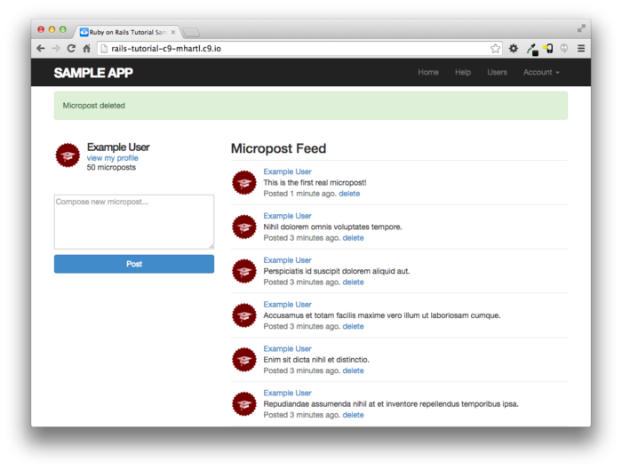

### 13.3.4 Micropost를 삭제해보자

마지막 기능으로는 micropost resource에 post를 삭제하는 기능을 추가해봅니다. 이것은 유저 삭제와 마찬가지로 ([10.4.2](Chapter10.md#1042-destroy액션)) "delete" 링크로 실현해봅시다. 유저의 삭제는 관리자 유저만 가능할 수 있도록 제한한 것에 비해, 이번에는 자신이 작성한 micropost에 대해서만 삭제링크를 동작하도록 해봅시다.


제일 처음으로는 micropost의 partial 에 삭제링크를 추가해봅니다. 생성한 코드는 아래와 같습니다.

```erb
<!-- app/views/microposts/_micropost.html.erb -->
<li id="micropost-<%= micropost.id %>">
  <%= link_to gravatar_for(micropost.user, size: 50), micropost.user %>
  <span class="user"><%= link_to micropost.user.name, micropost.user %></span>
  <span class="content"><%= micropost.content %></span>
  <span class="timestamp">
    Posted <%= time_ago_in_words(micropost.created_at) %> ago.
    <!-- add -->
    <% if current_user?(micropost.user) %>
      <%= link_to "delete", micropost, method: :delete,
                                       data: { confirm: "You sure?" } %>
    <% end %>
    <!-- add -->
  </span>
</li>
```

다음으로는, Microposts 컨트롤러의 `destrory` 액션을 정의해봅시다. 이것 또한 유저의 삭제와 대강 비슷합니다. 큰 차이로는 `admin_user` 필터에서 `@user` 변수를 사용하는 것이 아닌, 관계를 사용하여 micropost를 검색할 수 있다는 점입니다. 이것으로 어떤 유저가 다른 유저의 micropost를 삭제하려고 해도 자동적으로 실패해버릴 것입니다. 구체적으로는 `correct_user` 필터 내에서 `find` 메소드를 호출하는 것으로, 현재 유저가 삭제대상의 micropost를 보유하고 있는지를 확인합니다. 완성된 코드는 아래와 같습니다.

```ruby
# app/controllers/microposts_controller.rb
class MicropostsController < ApplicationController
  before_action :logged_in_user, only: [:create, :destroy]
  before_action :correct_user,   only: :destroy #new
  .
  .
  .
   #new
  def destroy
    @micropost.destroy
    flash[:success] = "Micropost deleted"
    redirect_to request.referrer || root_url
  end

  private

    def micropost_params
      params.require(:micropost).permit(:content)
    end
		#new
    def correct_user
      @micropost = current_user.microposts.find_by(id: params[:id])
      redirect_to root_url if @micropost.nil?
    end
end
```

이 때 위 코드의 `destory` 메소드에서 redirect를 사용하고 있는 점을 주목해주세요.

`request.referrer || root_url`

여기서는 `request.referrer` 라고 하는 메소드를 사용하고 있습니다. 이 메소드는 Friendly forwarding의 `request.url` 변수 ([10.2.3](Chapter10.md#1023-friendly-forwarding)) 와 비슷하게, 바로 이전 URL을 리턴합니다. (이 경우, Home페이지가 될 것 입니다.) 때문에 micropost가 Home페이지에서 삭제된 경우에도 프로필 페이지로부터 삭제된 경우에도, `request.referrer` 를 사용하는 것으로 DELETE Request가 실행된 페이지로 되돌아가기 때문에 매우 편리합니다. 여담으로, 이전으로 돌아가는 URL이 없다고 하더라도, (예를들어 테스트에서는 `nil` 이 리턴되는 경우도 있습니다.) 위 코드에서 `||` 연산자에 의하여 `root_url` 을 디폴트로 설정하고 있기 때문에 괜찮습니다. 


위 코드로 인하여 위에서부터 2번재 micropost 를 삭제하면 아래와 같이 동작할 것 입니다.



##### 연습

1. micropost를 작성하고, 그 다음 작성한 micropost를 삭제해봅시다. 다음으로 Rails 서버의 로그를 확인하여 `DELETE` 문의 내용을 확인해봅시다.
2. `redirect_to request.referrer || root_url`의 행을 `redirect_back(fallback_location: root_url)` 으로 바꾸어도 제대로 동작하는지, 브라우저를 통해 확인해봅시다. (이 메소드는 Rails 5부터 새롭게 추가되었습니다.)

### 13.3.5 Feed 화면의 Micropost 를 테스트해보자

[13.3.4](#1334-micropost를-삭제해보자) 의 코드에서, MIcropost 모델과 해당 인터페이스를 완성시켰습니다. 남은 내용으로는 Micropost 컨트롤러의 허가를 체크하는 짧은 테스트와 그것들을 정리하는 통합테스트 코드를 작성해볼 것 입니다.


우선은 micropost용의 fixture에 제각각의 유저와 연결되어진 micropost를 추가합니다. (지금은 이 중 1개만 사용합니다만 나중에는 다른 micropost도 사용하게 됩니다.)

```yml
# test/fixtures/microposts.yml
.
.
.
ants:
  content: "Oh, is that what you want? Because that's how you get ants!"
  created_at: <%= 2.years.ago %>
  user: archer

zone:
  content: "Danger zone!"
  created_at: <%= 3.days.ago %>
  user: archer

tone:
  content: "I'm sorry. Your words made sense, but your sarcastic tone did not."
  created_at: <%= 10.minutes.ago %>
  user: lana

van:
  content: "Dude, this van's, like, rolling probable cause."
  created_at: <%= 4.hours.ago %>
  user: lana
```

 다음으로 자신 이외의 유저의 micropost 는 삭제를 하려하면 적절하게 redirect하는 처리를 테스트에서 확인해봅시다.

```ruby
# test/controllers/microposts_controller_test.rb
require 'test_helper'

class MicropostsControllerTest < ActionDispatch::IntegrationTest

  def setup
    @micropost = microposts(:orange)
  end

  test "should redirect create when not logged in" do
    assert_no_difference 'Micropost.count' do
      post microposts_path, params: { micropost: { content: "Lorem ipsum" } }
    end
    assert_redirected_to login_url
  end

  test "should redirect destroy when not logged in" do
    assert_no_difference 'Micropost.count' do
      delete micropost_path(@micropost)
    end
    assert_redirected_to login_url
  end

  # new
  test "should redirect destroy for wrong micropost" do
    log_in_as(users(:michael))
    micropost = microposts(:ants)
    assert_no_difference 'Micropost.count' do
      delete micropost_path(micropost)
    end
    assert_redirected_to root_url
  end
end
```

 마지막으로 통합 테스트를 작성해봅니다. 이번 통합테스트에서는 로그인, micropost의 페이지 분할의 확인, 무효한 micropost의 작성, 유효한 micropost의 작성, micropost 삭제, 그리고 다른 유저의 micropost는 "Delete" 링크가 없는 것을 확인 하는 순서로 해봅시다. 언제나 처럼 통합 테스트를 생성해봅시다.

```
$ rails generate integration_test microposts_interface
      invoke  test_unit
      create    test/integration/microposts_interface_test.rb
```

앞의 순서대로 작성한 통합테스트는 아래와 같습니다. 이전에 작성한 코드가 살짝 섞여있는 점을 주의해주세요.

```ruby
# test/integration/microposts_interface_test.rb
require 'test_helper'

class MicropostsInterfaceTest < ActionDispatch::IntegrationTest

  def setup
    @user = users(:michael)
  end

  test "micropost interface" do
    log_in_as(@user)
    get root_path
    assert_select 'div.pagination'
    # 무효한 작성
    assert_no_difference 'Micropost.count' do
      post microposts_path, params: { micropost: { content: "" } }
    end
    assert_select 'div#error_explanation'
    # 유효한 작성
    content = "This micropost really ties the room together"
    assert_difference 'Micropost.count', 1 do
      post microposts_path, params: { micropost: { content: content } }
    end
    assert_redirected_to root_url
    follow_redirect!
    assert_match content, response.body
    # micropost를 삭제
    assert_select 'a', text: 'delete'
    first_micropost = @user.microposts.paginate(page: 1).first
    assert_difference 'Micropost.count', -1 do
      delete micropost_path(first_micropost)
    end
    # 다른 유저의 프로필로의 액세스 (삭제링크가 없는 것을 확인)
    get user_path(users(:archer))
    assert_select 'a', text: 'delete', count: 0
  end
end
```

이미 어플리케이션의 코드는 작성해놓았기 때문에, 이 테스트는 통과될 것 입니다.

`$ rails test`

##### 연습

1. 위 코드의 4개의 코멘트의 각각에 대해 테스트가 제대로 동작하는지를 확인해봅시다. 구체적으로는 대응하는 application 의 코드를 코멘트아웃하고 테스트가 실패하는 것을 확인하고, 원래대로 되돌린 후 테스트가 다시 통과되는지를 확인해봅시다.

2. 사이드 바에 있는 micropost의 합계 작성 개수를 테스트해봅시다. 이 때 단수형(micropost) 와 복수형 (microposts) 가 제대로 표시되는지도 테스트해봅시다. _Hint_ : 위 테스트 코드를 확인해봅시다

   ```ruby
   # test/integration/microposts_interface_test.rb
   require 'test_helper'
   
   class MicropostInterfaceTest < ActionDispatch::IntegrationTest
   
     def setup
       @user = users(:michael)
     end
     .
     .
     .
     # new
     test "micropost sidebar count" do
       log_in_as(@user)
       get root_path
       assert_match "#{FILL_IN} microposts", response.body
       # 아직 micropost를 작성하지 않은 유저
       other_user = users(:malory)
       log_in_as(other_user)
       get root_path
       assert_match "0 microposts", response.body
       other_user.microposts.create!(content: "A micropost")
       get root_path
       assert_match FILL_IN, response.body
     end
   end
   ```

## 13.4 Micropost의 image 첨부

