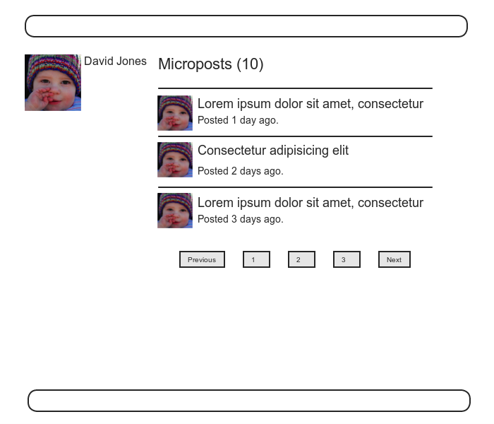
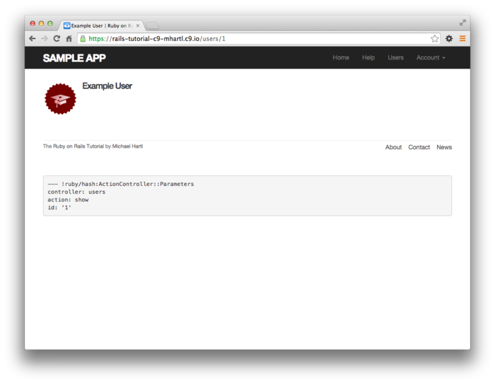
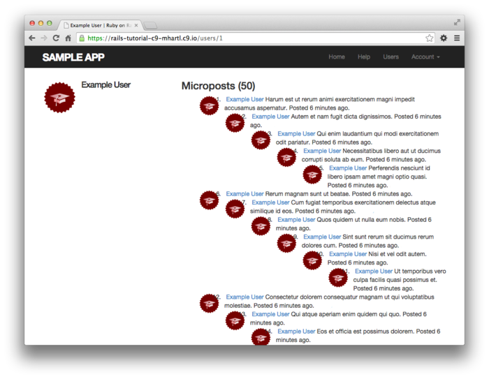
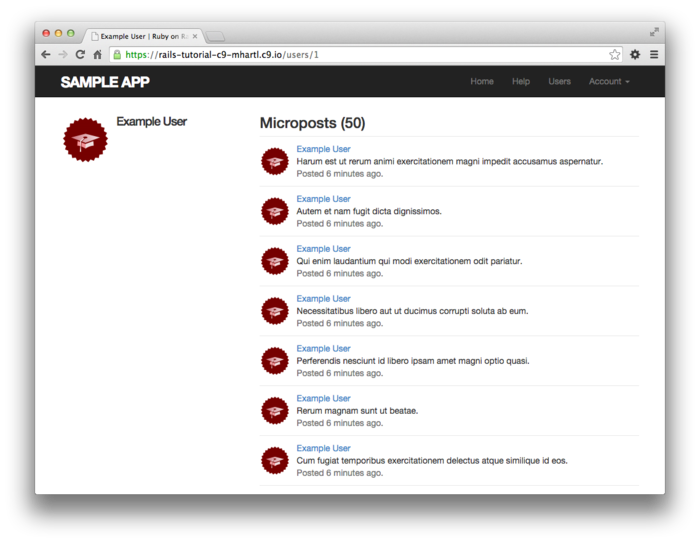
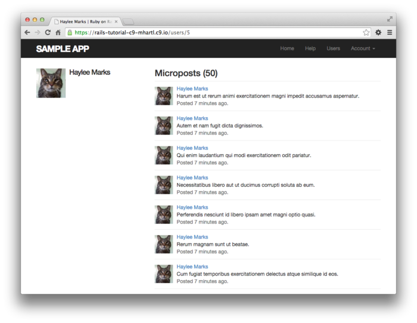
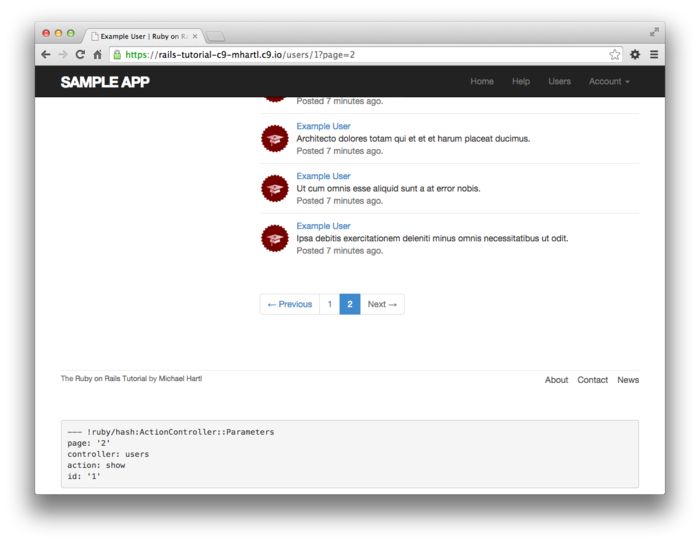

# 제 13장 유저의 Micropost

sample 어플리케이션의 코어 부분을 개발하기 위해, 지금까지 유저, 세션, Account 유효화, 패스워드 리셋 등 4개의 리소스에 대해 학습했습니다. 그리고 이것 들 중, "유저" 라고 하는 리소스만이 Active Record에 의해 데이터베이스 상의 테이블과 이어져있습니다. 모든 준비를 마친 지금, 유저가 짧은 메세지를 투고할 수 있도록 하기 위해 리소스 "*Micropost*" 를 추가해보겠습니다. [제 2장](Chapter2.md) 에서 간이적인 micropost 등록 form을 핸들링해보았습니다만, 이번 챕터에서는 [2.3](Chapter2.md#23-microposts-리소스) 에서 학습한 Micropost 데이터 모델을 생성하고, User 모델과 `has_many` , `belongs_to` 메소드를 사용하여 관련짓기를 해볼 것 입니다. 게다가 결과를 처리하고 표시하기 위해 필요한 Form과 해당 부품을 작성해보겠습니다. (13.4에서 이미지의 업로드도 구현해볼 것 입니다.) 제 14장에서는 micropost의 피드를 받기 위해 유저를 팔로우하는 개념을 도입하고, Twitter의 미니클론 버전을 완성시켜보겠습니다.


## 13.1 Micropost Model

우선 Micropost 리소스의 제일 본질적인 부분을 표현하는 Micropost 모델을 생성하는 부분부터 해보겠습니다. [2.3](Chapter2.md#23-microposts-리소스) 에서 생성한 모델과 마찬가지로, 이 새로운 Micropost 모델도 데이터 검증과 User 모델의 관련짓기를 포함하고 있습니다. 이전 모델과는 다르게 이번 micropost 모델은 완전히 테스트되어지고 디폴트의 순서를 가지며, 상위 데이터인 유저가 삭제되는 경우 자동적으로 파기되도록 합니다.


Git으로 버전관리에 사용하고 있는 경우는, 언제나처럼 토픽브랜치를 생성해봅시다.

`$ git checkout -b user-microposts `

### 13.1.1 기본적인 모델

Micropost 모델은 micropost의 내용을 저장할 `content` 속성과 특정 유저와 micropost를 관련짓는 `user_id` 속성의 2개 만을 가집니다. 실행한 결과의 Micropost의 구조는 아래와 같습니다.


위 모델에서는 micropost의 메세지 형태를 `String`이 아닌 `Text` 형태로 사용하고 있는 점을 주목해주세요. 이것은 어느정도의 양의 텍스트를 저장할 때 사용하는 형태입니다. `String` 형태로도 255문자까지는 저장할 수 있기 때문에, `String` 형으로도 13.1.2에서 구현하는 140문자 제한을 충족시킬 수는 있으나, `Text` 형이 좀 더 많은 내용의 micropost를 작성할 수 있습니다. 예를 들어 13.3.2 에서는 작성 form에서 String 용 텍스트 필드가 아닌, Text용 텍스트 에리어를 사용하고 있기 때문에, 보다 더 자연스러운 작성 Form을 표현할 수 있습니다. 또한 `Text` 형이 유연성을 가지고 있습니다. 예를들어 나중에 국제화로 인한 번역을 할 때, 언어별로 작성내용의 길이를 조절할 수도 있습니다. 게다가 `Text` 형을 사용하여도 실제 배포환경에서 [퍼포먼스의 차이는 없습니다.](http://www.postgresql.org/docs/9.1/static/datatype-character.html) 이러한 이유들로 단점보다는 장점이 많기 때문에, 이번에는 `Text` 형을 채용하겠습니다.


제 6장에서 User 모델을 생성했던 것과 마찬가지로, Rails의 `generate model` 커맨드를 사용하여 Micropost 모델을 생성해보겠습니다.

`$ rails generate model Micropost content:text user:references `

위 커맨드를 실행하면, 아래와 같은 모델 파일이 생성됩니다. 즉 [6.1.2](Chapter6.md#612-model-파일) 때와 마찬가지로 `ApplicationRecord` 를 계승한 모델이 생성됩니다. 단, 이번에 생성된 모델 내부에는 유저와 1대1의 관계를 나타내는 `belongs_to` 의 코드도 추가됩니다. 이것은 아까 전 커맨드를 실행했을 때의 `user:reference` 라고 하는 파라미터를 포함했기 때문입니다. 자세한 설명에 대해서는 13.1.3에서 하도록 하겠습니다.

```ruby
# app/models/micropost.rb

class Micropost < ApplicationRecord
   belongs_to :user
end
```

이전 6장에서 데이터베이스에 `users` 테이블을 작성할 때 마이그레이션을 생성한 것 과 마찬가지로, 이 `generate` 커맨드는 `microposts`  테이블을 생성하기 위해 마이그레이션 파일을 생성합니다.


User모델과의 제일 큰 차이점은 `references` 형을 이용하고 있다는 점 입니다. 이것을 이용하면, 자동적으로 인덱스와 외부 Key 참조를 하는 `user_id` 컬럼이 생성되어 User와 Microepost을 관련짓는 밑작업을 자동으로 해줍니다. User 모델과 마찬가지로, Micropost 모델의 마이그레이션 파일에도 `t.timestamp` 라고 하는 행 (매직컬럼)이 자동적으로 생성됩니다. 이것으로 [6.1.1](Chapter6.md#611-database) 에서 설명했듯이 `created_at` 과 `updated_at` 이라고하는 컬럼이 추가됩니다. 또한 `created_at` 컬럼은 13.1.4의 구현을 진행해나가면서 필요한 컬럼이기도 합니다.

```ruby
# db/migrate/[timestamp]_create_microposts.rb
class CreateMicroposts < ActiveRecord::Migration[5.0]
  def change
    create_table :microposts do |t|
      t.text :content
      t.references :user, foreign_key: true

      t.timestamps
    end
    add_index :microposts, [:user_id, :created_at]
  end
end
```

여기서 위 코드에서 `user_id` 와 `created_at`  컬럼에 인덱스를 추가하고 있는 것에 주목해주세요. 이렇게 함으로 인하여  `user_id` 와 관련된 모든 마이크로 포스트를 생성시간의 역순으로 얻기 쉬워지게 되었습니다.

`add_index :micropost, [:user_id, :created_at]`

또한 `user_id` 와 `created_id`  둘 다 하나의 배열로 묶고 있는 점을 주목해주세요. 이렇게 하는 것으로 Active Record는 양쪽의 key를 동시에 다루는 복합 key index를 생성합니다. [What is a multiple key index?](https://stackoverflow.com/questions/14844780/what-is-a-multiple-key-index)

그러면 위 마이그레이션 파일을 이용하여 데이터베이스를 갱신해봅시다. 

`$ rails db:migrate`

##### 연습

1. Rails 콘솔에서 `Micropost.new` 를 실행하여 인스턴스를 변수 `micropost` 에 대입해보세요. 그 다음, `user_id` 에 제일 첫 번째 유저 id를, `content` 에 "Lorem ipsum" 을 각각 대입해보세요. 이 시점에서 `micropost` 오브젝트의 매직컬럼 (`created_at` 과 `updated_at`) 에는 무엇이 들어있습니까?

2. 앞서 만든 오브젝트를 사용하여 `micropost.user` 실행시켜봅시다. 어떠한 결과가 출력되나요? 또한 `micropost.user.name` 을 실행했을 경우에는 어떠한 결과가 됩니까?

3. 앞서 만든 `micropost` 오브젝트를 데이터베이스에 저장해봅시다. 이 시점에서 한 번 더 매직컬럼의 내용을 확인해봅시다. 이번에는 어떠한 값이 들어있나요?


### 13.1.2 Micropost 의 Validation

기본적인 모델은 작성했ㅅ브니다. 다음으로는 요구되는 제한사항을 구현하기 위해서, Validation을 추가해봅시다. Micropost 모델을 생성했을 때, micropost는 작성한 유저의 id(`user_id`) 를 데이터로 가지고 있게끔 하였습니다. 이것을 사용하여 관슴적으로 올바른 Active Record와의 *관계맺기* 를 구현해볼 것 입니다. 우선 `Micropost` 모델 만을 (테스트 주도 개발로) 동작해보도록 합시다.


Micropost 의 초기 테스트는 User모델의 초기 테스트와 비슷합니다. 우선은 `setup` 단계에서, fixture의  sample 유저와 관련있는 새로운 micropost를 생성하고 있습니다. 다음으로 작성한 마이크로포스트가 유효한지 아닌지를 체크합니다. 마지막으로 모든 micropost는 유저의 id를 가지고 있어야만 하기 때문에 `user_id` 의 존재성의 validation에 대한 테스트를 추가합니다. 이것들을 하나로 묶으면 아래와 같은 코드가 될 것 입니다.

```ruby
# test/models/micropost_test.rb
require 'test_helper'

class MicropostTest < ActiveSupport::TestCase

  def setup
    @user = users(:michael)
    # 이 코드는 관습적으로 올바른 코드가 아닙니다.
    @micropost = Micropost.new(content: "Lorem ipsum", user_id: @user.id)
  end

  test "should be valid" do
    assert @micropost.valid?
  end

  test "user id should be present" do
    @micropost.user_id = nil
    assert_not @micropost.valid?
  end
end
```

`setup` 메소드의 내부의 코멘트처럼, micropost를 생성하는 코드는 동작합니다만 관습적으로는 올바르지 않은 코드입니다. (13.1.3에서 수정합니다.)


원래부터 존재하는 User 모델의 테스트와 마찬가지로, 위 첫 번째 테스트에서는 *정상적인 상태인지 아닌지를 테스트 (Sanity Test)* 를 하고 있습니다. 두 번째  테스트에서는 `user_id` 가 존재하는지를 (`nil` 은 아닌지) 를 테스트하고 있습니다. 이 테스트를 통과시키기 위해서는 아래와 같이, 존재성의 validation을 추가해봅시다.

```ruby
# app/models/micropost.rb
class Micropost < ActiveRecord::Base
  belongs_to :user
  validates :user_id, presence: true
end
```

여담으로, Rails 5에서는 위 validation을 추가하지 않아도 테스트는 통과할 것 입니다. 그러나 이것은 관습적인 의미에서 올바르지 않은 코드를 작성할 경우에만 발생합니다. 이 부분을 "관습적으로 올바른" 코드로 작성하면, `user_id` 에 대한 존재성의 validation이 기대했던 대로 동작할 것 입니다. 이 부분을 설명하고 싶었기 때문에 앞서 코드에 코멘트를 남겨놓은 것 입니다.


이상으로 위 테스트는 통과할 것 입니다. 확인해봅시다.

`$ rails test:models`

다음으로 micropost의 `content` 속성에 대한 validation을 추가해봅시다. ([2.3.2](Chapter2.md#232-micropost를-micro하게-해보자)에서 소개해드린 방법과 비슷합니다.) `user_id` 속성과 마찬가지로, `content` 속성도 존재할 필요가 있습니다. 게다가 micropost가 140문자보다 긴 문자가 되지 않도록 제한을 걸어보겠습니다. (이것이 micropost가 micro라고 이름이 붙은 이유입니다.)


[6.2](Chapter6.md#62-user를-검증해보자)  에서 User모델에 Validation을 추가했을 때와 마찬가지로, 테스트 주도 개발에서 micropost 모델의 validation을 추가해보겠습니다. 기본적으로는 User모델 때와 비슷한 validation을 추가해볼 것 입니다. 

```ruby
# test/models/micropost_test.rb
require 'test_helper'

class MicropostTest < ActiveSupport::TestCase

  def setup
    @user = users(:michael)
    @micropost = Micropost.new(content: "Lorem ipsum", user_id: @user.id)
  end

  test "should be valid" do
    assert @micropost.valid?
  end

  test "user id should be present" do
    @micropost.user_id = nil
    assert_not @micropost.valid?
  end
#추가
  test "content should be present" do
    @micropost.content = "   "
    assert_not @micropost.valid?
  end

  test "content should be at most 140 characters" do
    @micropost.content = "a" * 141
    assert_not @micropost.valid?
  end
#추가  
end
```

[6.2](Chapter6.md#62-user를-검증해보자) 와 마찬가지로, 위 코드는 micropost의 길이를 테스트하기 위해 문자열의 계산을 이용합니다.

```ruby
$ rails console
>> "a" * 10
=> "aaaaaaaaaa"
>> "a" * 141
=> "aaaaaaaaaaaaaaaaaaaaaaaaaaaaaaaaaaaaaaaaaaaaaaaa
aaaaaaaaaaaaaaaaaaaaaaaaaaaaaaaaaaaaaaaaaaaaaaaaaaaa
aaaaaaaaaaaaaaaaaaaaaaaaaaaaaaaaaaaaaaaaa"
```

이것에 대응하는 어플리케이션에서의 구현은, User의 `name` 용 validation때와 (6장) 똑같습니다. 아래는 결과와 같습니다.

```ruby
app/models/micropost.rb
class Micropost < ApplicationRecord
  belongs_to :user
  validates :user_id, presence: true
  validates :content, presence: true, length: { maximum: 140 }
end
```

이 시점에서, 모든 테스트는 GREEN이 될 것 입니다.

`$ rails test`

##### 연습 

1. Rails 콘솔을 실행시키고, `user_id` 와 `content` 가 비어있는 micropost 오브젝트를 만들어보세요. 이 오브젝트에 대해 `valid?` 를 실행시키면 실패하는 것을 확인해보세요. 또한 생성된 에러메세지에 어떠한 내용이 기재되어 있나요?
2. 콘솔을 실행시키고 이번에는 `user_id`가 비어있고, `content` 가 141문자 이상의 micropost 오브젝트를 생성해보세요. 이 오브젝트에 대해서 `valid?` 를 실행시키면 실패하는 것을 확인해보세요. 또한 생성된 에러메세지에는 어떠한 내용이 있는지 확인해보세요.

### 13.1.3 User/Micropost의 관계맺기

Web 어플리케이션용의 데이터모델을 구축할 때는, 각각의 모델 간의 관계에 대해서 충분히 생각할 필요가 있습니다. 이번 경우에는 [2.3.3](Chapter2.md#233-유저는-많은-마이크로포스트를-가지고-있다) 에서도 해본 적이 있듯, 각각의 micropost는 1명의 유저와 관계를 맺게되고, 각각의 유저는 (잠재적으로) 여러개의 micropost와 관계 맺게됩니다. 이 관계는 아래와 같습니다. 이러한 관계를 구현하기 위한 일환으로, micropost 모델에 대한 테스트코드를 작성하고, 게다가 User모델에 몇가지 테스트를 추가해볼 것 입니다.


이번 섹션에서 정의하는 `belongs_to` / `has_many` 관계를 사용합니다. 위 그림에서 사용하는 메소드를 Rails에서 사용할 수 있게 됩니다. 속성들은 아래의 메소드가 아닌

```ruby
Micropost.create
Micropost.create!
Micropost.new
```

아래 메소드를 사용하고 있는 점을 주의해주세요.

```ruby
user.microposts.create
user.microposts.create!
user.microposts.build
```

이 메소드를 사용하면, 관계를 맺고 있는 유저를 *통해* micropost를 작성할 수 있습니다. (관습적으로 올바른 방법입니다.) 신규 micropost가 이 방법으로 생성되는 경우, `user_id` 는 자동적으로 올바른 값으로 설정됩니다. 이 방법을 사용하면, 예를 들어 아래와 같은

```ruby
@user = users(:michael)  
# 아래 코드는 관습적으로 올바르지 않습니다.
@micropost = Micropost.new(content: "Lorem ipsum", user_id: @user.id)
```

위와 같은 작성방법이 아래와 같이 다시 쓸 수 있습니다.

```ruby
@user = users(:michael)
@micropost = @user.microposts.build(content: "Lorem ipsum")
```

(`new` 메소드와 마찬가지로, `build` 메소드는 오브젝트를 리턴하는데, 데이터베이스에는 반영하지 않습니다.) 한 번에 올바른 관계를 정의해 놓는다면, `@micropost` 변수의 `user_id` 는 관계를 맺고있는 유저의 id가 자동적으로 설정됩니다.

| 메소드                           | **용도**                                                    |
| -------------------------------- | ----------------------------------------------------------- |
| `micropost.user`                 | Micropost와 관계를 맺고 있는 User 오브젝트를 리턴한다.      |
| `user.microposts`                | User의 Micropost 집합을 리턴한다.                           |
| `user.microposts.create(arg)`    | `user` 관계맺은 micropost를 생성한다.                       |
| `user.microposts.create!(arg)`   | `user`와 관계맺은 micropost를 생성한다. (실패 시 예외 발생) |
| `user.microposts.build(arg)`     | `user` 와 관계맺은 새로운 Micropost 오브젝트를 리턴한다.    |
| `user.microposts.find_by(id: 1)` | `user`와 관계를 맺고 있고 id가 1인 micropost를 검색합니다.  |

`@user.micropost.build` 와 같은 코드를 사용하기 위해, User모델과 Micropost 모델을 각각 수정하고, 관계를 맺을 필요가 있습니다. Micropost 모델에서는 `belongs_to :user` 라고 하는 코드가 필요합니다만, 이것은 아래 코드의 migration에 의해 자동적으로 생성될 것 입니다. 한 편, User모델에서는  `has_many :microposts` 라고 추가할 필요가 있습니다. 여기는 자동적으로 생성되지 않기 때문에, 수동으로 추가해야할 필요가 있습니다.

```ruby
# app/models/micropost.rb
class Micropost < ApplicationRecord
  belongs_to :user # 수정
  validates :user_id, presence: true
  validates :content, presence: true, length: { maximum: 140 }
end
```

```ruby
# app/models/user.rb
class User < ApplicationRecord
  has_many :microposts
  .
  .
  .
end
```

올바르게 관계가 맺어졌다면, `setup` 메소드를 수정하고 관습적으로 올바른 micropost를 생성해봅시다.

```ruby
test/models/micropost_test.rb
require 'test_helper'

class MicropostTest < ActiveSupport::TestCase

  def setup
    @user = users(:michael)
    @micropost = @user.microposts.build(content: "Lorem ipsum") #Update
  end

  test "should be valid" do
    assert @micropost.valid?
  end

  test "user id should be present" do
    @micropost.user_id = nil
    assert_not @micropost.valid?
  end
  .
  .
  .
end
```

물론 섬세한 리팩토링이기 때문에, 테스트는 아직 통과할 것 입니다.

`$ rails test`

##### 연습 

1. 데이터베이스에 있는 제일 첫 번째 유저를 변수  `user` 에 대입해주세요. 해당 user 오브젝트를 사용하여 `micropost = user.microposts.create(content: "Lorem ipsum")` 을 실행하면 어떠한 결과를 얻을 수 있습니까?
2. 앞서 연습문제에서, 데이터베이스 상에 새로운 micropost가 추가되었을 것 입니다. `user.microposts.find(micropost.id)` 를 실행하여, 정말로 추가되었는지를 확인해봅시다. 또한 앞서 실행한 `micropost.id` 의 부분을 `micropost` 로 바꾸면 어떠한 결과가 생기나요?
3. `user == micro post.user` 를 실행한 결과는 어떻게 되나요? 또한 `user.microposts.first == micropost` 를 실행한 결과는 어떻게 되나요? 각각 확인해봅시다.

### 13.1.4 Micropost를 개선해보자.

이번 섹션에서는 User와 Micropost의 관계맺기를 개선해보겠습니다. 구체적으로는 유저의 micropost를 특정 순서로 조회할 수 있다거나, micropost를 유저에게 의존상태로 만들고 유저가 삭제되면 micropost도 자동적으로 삭제되도록 해보겠습니다.

#### Default Scope

`user.microposts`  메소드는 기본으로 조회순서에 대해서 아무것도 보증하지 않습니다만 블로그나 Twitter의 관습에 따라 작성시간의 역순, 즉 제일 최신의 micropost를 제일 처음으로 표시할 수 있게 해봅시다. 이것을 구현하기 위해서는  *default scope* 라고 하는 테크닉을 사용해보겠습니다.


이 기능의 테스트는 겉에서 보이기만하는 결과로 성공했다고 자만할 수 있습니다.  "어플리케이션에서의 구현은 사실 잘못되어있지만 테스트가 성공해버리는" 경우가 있습니다. 올바른 테스트를 작성하기 위해서, 여기서는 테스트 주도 개발로 진행해가겠습니다. 구체적으로는 우선 데이터베이스 상의 제일 첫 번째 micropost가 fixture 내의 micropost(`most_recent`) 와 같은 것을 검증하는 테스트를 작성해봅시다.

```ruby
# test/models/micropost_test.rb
require 'test_helper'

class MicropostTest < ActiveSupport::TestCase
  .
  .
  .
  test "order should be most recent first" do
    assert_equal microposts(:most_recent), Micropost.first
  end
end
```

위 코드는 micropost용의 fixture 파일로부터 sample 데이터를 읽어오고 있습니다. 다음으로 fixture 파일도 필요합니다.

```yml
# test/fixtures/microposts.yml
orange:
  content: "I just ate an orange!"
  created_at: <%= 10.minutes.ago %>

tau_manifesto:
  content: "Check out the @tauday site by @mhartl: http://tauday.com"
  created_at: <%= 3.years.ago %>

cat_video:
  content: "Sad cats are sad: http://youtu.be/PKffm2uI4dk"
  created_at: <%= 2.hours.ago %>

most_recent:
  content: "Writing a short test"
  created_at: <%= Time.zone.now %>
```

여기서 Embeded Ruby를 사용하여 `created_at`  컬럼의 값을 셋팅하고 있는 점을 주목해주세요. 이 컬럼은 Rails에 의해 자동적으로 갱신되기 때문에 기본적으로 수동으로 갱신할 필요는 없습니다만,  fixture 파일 안에서는 갱신이 가능합니다. 이 구조를 사용하여 의도적으로 순서를 변경하고 있습니다. 예를 들어 파일 내의 제일 아래 sample 데이터는 제일 나중에 생성되었기 때문에 최신의 post 가 되도록 수정하는 느낌입니다. 많은 시스템에서 fixture는 위에서부터 순서대로 실행되기 때문에, 파일 내의 제일 아래에 있는 sample 데이터가 제일 마지막에 생성되나, 이러한 동작에 의존한 테스트는 작성할 필요는 없을 것입니다.


여기서 실행순서를 테스트하는 위 두개의 코드를 추가합니다. 이 테스트를 실행하면 일단 실패하게 될 것 입니다.

`$ rails test test/models/micropost_test.rb`

다음으로 Rails 의 `default_scope` 메소드를 사용하여 이 테스트를 성공시켜보겠습니다. 이 메소드는 데이터베이스로부터 데이터를 얻었을 때, 기본 순서를 지정하는 메소드입니다. 특정 순서로 하고 싶은 경우에는 `default_scope` 의 파라미터에 `order` 를 부여합니다. 예를 들어,  `created_at` 컬럼의 순서로 하고 싶은 경우에는 다음과 같이 합니다.

`order(:created_at)`

 단, 아쉽게도 기본 순서가 오름차순 (ascending) 으로 되어있기 때문에, 이대로는 작은 수부터 큰 수의 순으로 정렬되어버립니다. (제일 오래된 내용이 제일 처음에 표시되어버립니다.) 순서를 바꾸기 위해서는, 조금 낮은 레벨의 기술이긴 합니다만 다음과 같이 SQL을 파라미터로 넘길 필요가 있습니다.

`order(created_at: :desc)`

이 코드를 사용하여 Micropost 모델을 수정한 결과는 아래와 같습니다.

```ruby
# app/models/micropost.rb
class Micropost < ApplicationRecord
  belongs_to :user
  default_scope -> { order(created_at: :desc) } #추가
  validates :user_id, presence: true
  validates :content, presence: true, length: { maximum: 140 }
end
```

위 코드에서는 새롭게 람다식 (Stabby lambda) 라고 하는 방식이 쓰이고 있습니다. 이것은 *Proc*  이나 *lambda* (혹은 무명함수) 라고 불리는 오브젝트를 작성하는 방법입니다. `->` 를 사용하는 람다식은, 블록([4.3.2](Chapter4.md#432-블록)) 을 파라미터로 하며 Proc 오브젝트를 리턴합니다. 이 오브젝트는 `call` 메소드가 호출되었을 때, 블록 내의 처리를 평가합니다. 이 문법은 콘솔에서도 확인할 수 있습니다.

```ruby
>> -> { puts "foo" }
=> #<Proc:0x007fab938d0108@(irb):1 (lambda)>
>> -> { puts "foo" }.call
foo
=> nil
```

(Proc은 Ruby에서도 조금 난이도가 높은 주제이기 때문에, 지금 당장 이해할 필요는 없습니다.)


위 모델의 코드를 추가한 것으로, 테스트코드는 성공할 것 입니다.

`$ rails test`

#### Dependent: destory

순서에 대해서는 일단 여기서 마치도록하겠습니다. 이번에는 micropost에 제 2의 요소를 추가해보겠습니다. [10.4](Chapter10.md#104-유저를-삭제해보자) 에서 작성했듯이, 사이트 관리자는 유저를 *파기 할*  권한을 가집니다. 유저가 파기되었을 경우, 유저의 micropost도 같이 파기되어야할 것 입니다.


이러한 동작은  `has_many` 메소드에 옵션을 입력하는 것으로 구현할 수 있습니다.

```ruby
app/models/user.rb
class User < ApplicationRecord
  has_many :microposts, dependent: :destroy #Update
  .
  .
  .
end
```

`dependent: :destory` 라고 하는 옵션을 사용하면, 유저가 삭제되었을 때 해당 유저와 관계를 맺은 (해당 유저가 작성한) micropost도 같이 삭제되게 될 것 입니다. 이것은 관리자가 시스템으로부터 유저를 삭제했을 때, 작성자가 존재하지 않은 micropost가 데이터베이스에 남겨지는 문제를 방지합니다.


다음으로 위 코드가 제대로 동작하는지를 테스트를 통해 User모델을 검증해봅시다. 이 테스트에서는 (id를 관계짓게 하기 위해) 유저를 생성하는 것과, 해당 유저와 관계를 맺고 있는 micropost를 생성할 필요가 있습니다. 그 후, 유저를 삭제하여 micropost의 갯수가 1개 줄어든 것을 확인합니다. 생성한 코드는 아래와 같습니다. 또한 이전에 작성한 [delete] 링크의 통합테스트와 비교해보는 것도 이해하기에 도움이 될 것 입니다.

```ruby
# test/models/user_test.rb
require 'test_helper'

class UserTest < ActiveSupport::TestCase

  def setup
    @user = User.new(name: "Example User", email: "user@example.com",
                     password: "foobar", password_confirmation: "foobar")
  end
  .
  .
  .
  test "associated microposts should be destroyed" do
    @user.save
    @user.microposts.create!(content: "Lorem ipsum")
    assert_difference 'Micropost.count', -1 do
      @user.destroy
    end
  end
end
```

위 코드가 제대로 동작한다면, 테스트는 통과할 것 입니다.

` $ rails test`

##### 연습

1. `Micropost.first.created_at` 의 실행결과와 `Micropost.last.created_at` 의 실행결과를 비교해봅시다.
2. `Micropost.first` 를 실행했을 때 새성되는 SQL은 어떠한 형태인가요? 마찬가지로 `Micropost.last` 의 경우는 어떤 형태인가요? *Hint* : 각각의 코드를 콘솔에서 실행해 보았을 때 표시되는 문자열이 SQL문이 될 것 입니다.
3. 데이터베이스 상의 제일 첫 번째 유저를 변수 `user` 에 대입하세요. 해당 user 오브젝트가 제일 처음으로 작성한 micropost의 id는 몇인가요? 다음으로 `destory` 메소드를 사용하여 해당 user 오브젝트를 삭제해보세요. 삭제하면, 해당 user 와 관계맺고 있던 micropost도 삭제되는 것을, `Micropost.find` 로 확인해보세요.


## 13.2 Micropost를 표시해보자

Web 경유로 Micropost를 작성하는 방법은 현 시점에서는 없습니다만, (13.3.2에서부터 작성해봅니다.) Micropost를 표시하는 것과, 테스트하는 것은 가능합니다. 여기서는 Twitter와 같은 독립적인 micropost의 `index` 페이지를 만들지 않고, 아래와 같이 유저의  `show` 페이지에 직접 micropost를 표시시켜보겠습니다. 유저의 프로필에 micropost를 표시시키기 위해, 매우 간단한 ERB 템플렛을 처음으로 작성합니다. 그 다음으로는 [10.3.2](Chapter10.md#1032-sample-user) 의 sample 데이터 생성 태스크에 micropost의 sample을 추가하여 화면에 sample 데이터가 표시되는지를 확인해보겠습니다.




### 13.2.1 Micropost의 표시

이번 섹션에서는 유저의 프로필 화면 (`show.html.erb`) 에서 해당 유저의 micropost를 표시하거나, 지금까지 작성한 micropost의 총 갯수를 표시하는 처리를 구현합니다. 그렇다고 해도, 이번에 필요한 아이디어의 대부분은 [10.3](Chapter10.md#103-모든-유저를-표시해보자) 에서 구현한, 유저를 표시하는 부분과 닮아 있습니다.


연습에서 이미 micropost를 몇 개 정도 작성한 경우에는, 한 번 데이터베이스를 리셋하고 sample 데이터를 재생성해놓으세요.

```ruby
$ rails db:migrate:reset
$ rails db:seed
```

우선, Micropost의 컨트롤러와 뷰를 작성하기 위해서 컨트롤러를 생성해봅시다. 또한 이번에 사용하는 것은 뷰 뿐만이며, Micropost 컨트롤러는 13.3부터 사용합니다.

`$ rails generate controller Microposts`

이번 목적은, 유저별로 모든 Micropost를 표시할 수 있도록 하는 것입니다. [10.3.5](Chapter10.md#1035-partial-refactoring) 에서 본 코드는,

```erb
<ul class="users">
  <%= render @users %>
</ul>
```

`_user.html.erb` 파셜을 사용하여 자동적으로 `@users` 변수 내의 각각의 유저를 출력했었습니다. 그것을 참고하여 `_micropost.html.erb` 파셜을 사용하여 micropost의 컬렉션을 표시해보면 다음과 같이 됩니다.

```erb
<ol class="microposts">
  <%= render @microposts %>
</ol>
```

우선은 순서가 없는 리스트인 `ul` 태그가 아닌, *순서가 있는* 리스트의 `ol` 태그를 사용하고 있는 점을 주목해주세요. 이것은 micropost 가 특정한 순서 (최신순 > 오래된 순) 으로 의존하고 있기 때문입니다. 다음으로 대응하는 파셜은 아래의 코드와 같습니다.

```erb
<!-- app/views/microposts/_micropost.html.erb -->
<li id="micropost-<%= micropost.id %>">
  <%= link_to gravatar_for(micropost.user, size: 50), micropost.user %>
  <span class="user"><%= link_to micropost.user.name, micropost.user %></span>
  <span class="content"><%= micropost.content %></span>
  <span class="timestamp">
    Posted <%= time_ago_in_words(micropost.created_at) %> ago.
  </span>
</li>
```

여기서는 `time_ago_in_words` 라고 하는 헬퍼 메소드를 사용하고 있습니다. 이것은 메소드 이름이 나타내는 대로입니다만, "3분 전에 작성" 이라는 문자열을 출력합니다. 구체적인 효과에 대해서는 13.2.2에서 설명합니다. 또한 위 코드에서는 각 Micropost에 대하여 CSS의 id를 할당하고 있습니다.

`<li id="micropost-<%= micropost.id %>">`

이 것은 일반적으로 좋다고 평가되는 관습으로, 예를 들어 앞으로 Javascript를 사용하여 각 micropost를 조작하려고 할 때 도움이 됩니다.


다음으로 한 번에 모든 micropost가 표시되어버리는 잠재적인 문제에 대해 대처해봅니다. [10.3.3](Chapter10.md#1033-pagination) 에서는 Pagination을 사용하였습니다만, 이번에도 같은 방법으로 이 문제를 해결해봅니다. 저번과 마찬가지로 `will_paginate` 메소드를 사용하면 다음과 같이 됩니다.

`<%= will_paginate @microposts %>`

이전 10장의 유저 리스트 화면의 코드와 비교해보면 조금은 다릅니다. 이전에는 다음과 같은 단순한 코드였습니다.

`<%= will_paginate %>`

사실은 위 코드는 파라미터가 없이도 동작하고 있었습니다. 이것은 `will_paginate` 가 Users 컨트롤러의 문맥에서, `@users` 인스턴스 변수가 존재하고 있는 것을 *전제* 로 하고 있기 때문입니다. 이 인스턴스 변수는 [10.3.3](Chapter10.md#1033-pagination) 에 서술했던 것 처럼, `ActiveRecord::Relation` 클래스의 인스턴스입니다. 이번 경우에는 Users 컨트롤러의 문맥으로부터, micropost를 pagination하고 싶기 때문에, (즉 문맥이 다르기 때문에), 명시적으로 `@microposts` 변수를 `will_paginate` 에 넘길 필요가 있습니다. 따라서 이와 같이 인스턴스 변수를 Users 컨트롤러의  `show` 액션에서 정의해주어야만 합니다.

```ruby
# app/controllers/users_controller.rb
class UsersController < ApplicationController
  .
  .
  .
  def show
    @user = User.find(params[:id])
    @microposts = @user.microposts.paginate(page: params[:page]) #추가
  end
  .
  .
  .
end

```

`paginate` 메소드의 대단함에 주목해주세요. *micropost* 의 관계를 경유하여 micropost 테이블에 도달하고, 필요한 micropost의 페이지를 끌어내고 있습니다. 


마지막 과제로는, micropost의 작성 수를 표시하는 것입니다만, 이것은 `count` 메소드를 사용하는 것올 해결할 수 있습니다.

`user.microposts.count`

`paginate` 와 마찬가지로, 관계를 통하여 `count` 메소드를 호출하는 것이 가능합니다. 중요한 점은, `count` 메소드에서는 데이터베이스 상의 micropost를 전부 읽어들인 후, 결과의 배열에 대해 `length` 를 호출, 하는 이러한 불필요한 처리는 *하지 않는다는* 점입니다. 그러한 행위를 한다면, micropost의 수가 증가하면 그에 따라 효율이 떨어지게 될 것입니다. 그렇지 않고, (데이터베이스 내의 계산은 고도로 최적화되어 있기 때문에) 데이터베이스에게 대신 계산을 하게 하고, 특정 `user_id` 에 관계맺어져 있는 micropost 의 수를 데이터베이스에 조회합니다. (그럼에도 count 메소드가 어플리케이션의 bottle neck이 되는 경우가 있다면, 좀 더 빠른 [*counter cache*](http://railscasts.com/episodes/23-counter-cache-column) 을 사용하는 것도 가능합니다.)


이것으로 모든 요소는 정리되었습니다. 프로필 화면에 micropost를 표시해봅시다. (이 때, 7장에서와 마찬가지로 `if @user.microposts.any?` 를 사용하여 유저의 micropost가 하나도 없는 경우에는 빈 리스트를 표시하지 않게하는 점도 주목해주세요.)

```erb
<!-- app/views/users/show.html.erb -->
<% provide(:title, @user.name) %>
<div class="row">
  <aside class="col-md-4">
    <section class="user_info">
      <h1>
        <%= gravatar_for @user %>
        <%= @user.name %>
      </h1>
    </section>
  </aside>
  <div class="col-md-8">
    <% if @user.microposts.any? %>
      <h3>Microposts (<%= @user.microposts.count %>)</h3>
      <ol class="microposts">
        <%= render @microposts %>
      </ol>
      <%= will_paginate @microposts %>
    <% end %>
  </div>
</div>
```

여기서 개선한 새로운 프로필 화면을 브라우저에서 확인해봅시다. ...아무것도 표시되지 않는 외로운 페이지네요. micropost가 하나도 없는 건 아닐까요? 그럼 micropost를 추가해봅시다.



##### 연습

1. [7.3.3](Chapter7.md#733-에러-메세지) 에 가볍게 설명드렸듯, 이번 헬퍼 메소드로 사용한 `time_ago_in_words` 메소드는 Rails 콘솔의 `helper` 오브젝트로부터 호출할 수 있습니다. 이 `helper` 오브젝트의 `time_ago_in_words` 메소드를 사용하여 `3.weeks.ago` 나  `6.months.ago` 를 실행해봅시다.
2. `helper.time_ago_in_words(1.year.ago)` 를 실행하면, 어떠한 결과가 보여지나요?
3. microposts 오브젝트의 클래스는 무엇인가요? *Hint* : 위 두 번째 코드에 있듯, 우선  `paginate` 메소드 (파라미터는 `page: nil`) 로 오브젝트를 얻고, 그 다음 `class` 메소드를 호출해봅시다.

### 13.2.2 Micropost의 Sample

[13.2.1](#1321-Micropost의-표시) 의 유저 micropost의 템플릿 생성작업의 결과는 조금은 단순한 결과입니다. [10.3.2](Chapter10.md#1032-sample-user) 의 Sample data 생성 Task에 micropost도 추가하여 이러한 조금 힘빠지는 상황을 수정해봅시다.


_모든_ 유저의 micropost를 추가하려고하면 시간이 걸리기 때문에, `take` 메소드를 사용하여 제일 처음의 6명만 추가해봅시다.

`User.order(:created_at).take(6)`

(이 때, `order` 메소드를 사용하는 것으로, 제일 초반에 생성된 6명의 유저를 명시적으로 호출해낼 수 있습니다.)


이 6명의 유저에 대해서는 1페이지의 표시한계수 (30) 를 넘기기 위해 각각 50여개의 micropost를 추가해보도록 합니다. 또한 각 투고 내용에 대해서는 Faker gem의 Lorem.sentence라고 하는 편리한 메소드가 있기 때문에, 이 메소드를 사용해보겠습니다.  변경한 결과는 아래와 같습니다. (아래 코드의 루프 순서는 위화감이 있을지도 모르겠습니다만, 이것은 14.3에서 스테이터스 피드(타임라인) 을 구현하기 위해 도움이 될 것 입니다. 유저별로 50개분의 micropost를 정리하여 생성해버리면, 스테이터스 피드에 표시되는 투고가 모두 같은 유저가 되어버리고 마니, 시각적으로도 좋지 않을 것 입니다.)

```ruby
# db/seeds.rb
.
.
.
users = User.order(:created_at).take(6)
50.times do
  content = Faker::Lorem.sentence(5)
  users.each { |user| user.microposts.create!(content: content) }
end
```

여기서 언제나처럼 개발환경용의 데이터베이스에 다시 한 번 sample data를 생성합니다.

```
$ rails db:migrate:reset
$ rails db:seed
```

작성이 끝났다면, Rails 서버를 재부팅해보세요.


각각의 micropost가 표시되는 것에 의해, [13.2.1](#1321-micropost의-표시) 의 김빠지는 작업이 드디어 끝났습니다. 실행 결과는 아래와 같습니다.



위 페이지에는 micropost 고유의 스타일이 적용되어있지 않기 때문에, 아래의 코드를 추가하여 결과 페이지를 새로고침해봅시다.

```scss
/* app/assets/stylesheets/custom.scss */
.
.
.
/* microposts */

.microposts {
  list-style: none;
  padding: 0;
  li {
    padding: 10px 0;
    border-top: 1px solid #e8e8e8;
  }
  .user {
    margin-top: 5em;
    padding-top: 0;
  }
  .content {
    display: block;
    margin-left: 60px;
    img {
      display: block;
      padding: 5px 0;
    }
  }
  .timestamp {
    color: $gray-light;
    display: block;
    margin-left: 60px;
  }
  .gravatar {
    float: left;
    margin-right: 10px;
    margin-top: 5px;
  }
}

aside {
  textarea {
    height: 100px;
    margin-bottom: 5px;
  }
}

span.picture {
  margin-top: 10px;
  input {
    border: 0;
  }
}
```

아래 첫 번째 유저의 프로필 화면을, 아래 두 번째 화면에서는, 2번째 유저의 프로필 화면을 표시하고 있습니다. 마지막 스크린샷에서는 제일 첫 번째 유저의 2번째 페이지와 제일 밑에 있는 pagination의 링크를 표시하고 있습니다. 각 micropost의 표시에는 3개의 어떠한 경우라도, 생성된 후로의 경과시간 ("1분전에 투고" 등)이 표시되는 것을 주목해주세요. 이것은 이전에 작성한 `time_ago_in_words` 메소드에 의한 것 입니다. 수 분을 기다리고 나서 패이지를 새고로침하면, 이 텍스트는 자동적으로 새로운 시간대로 갱신될 것 입니다.







##### 연습

1. `(1..10).to_a.take(6)` 라고 하는 코드의 실행결과를 추측해볼 수 있습니까? 추측한 결과값이 제대로 맞는지 실제로 콘솔에서 확인해봅시다.
2. 방금 전 연습에서 사용한 `to_a` 메소드의 부분은 정말로 필요한 부분인가요? 확인해봅시다.
3. Faker 는 _Lorem ipsum_ 이외에도 매우 다양한 사례에 대응하고 있습니다. [Faker의 문서](https://github.com/stympy/faker) 를 확인하면서 화면의 출력하는 방법을 배우고, 실제로 대학이름이나 전화번호 등을 화면에 출력해봅시다.

### 13.2.3 Profile 화면의 Micropost 를 테스트해보자.

이제 막 account를 유효화한 유저는 프로필화면에 리다이렉트되기에, 해당 프로필화면이 제대로 표시되는지는 유닛 테스트를 통해 확인해보았습니다. 이번 섹션에서는 프로필 화면에 표시되는 micropost에 대해 통합 테스트를 작성해보겠습니다. 우선 프로필 화면용의 통합 테스트를 생성해봅시다.

```ruby
$ rails generate integration_test users_profile
      invoke  test_unit
      create    test/integration/users_profile_test.rb
```

프로필화면에 있는 micropost를 테스트하기 위해서는 유저와 관계가 맺어져 있는 micropost의 테스트용 데이터가 필요합니다. Rails의 관습에 따라, 관련 테스트 데이터를 fixture 파일에 추가하면, 다음과 같이 될 것 입니다.

```
orange:
  content: "I just ate an orange!"
  created_at: <%= 10.minutes.ago %>
  user: michael
```

`user` 에 `michael` 이라고 하는 값을 입력하면,  Rails는 fixture 파일 내의 대응하는 유저를 찾아내어 (혹은 발견한다면,) micropost와 관계를 맺어줄 것 입니다.

```
  name: Michael Example
  email: michael@example.com
  .
  .
  .
```

또한 micropost의 pagination을 테스트하기 위해, micropost용의 fixture에 몇가지 테스트 데이터를 추가할 필요가 있습니다만, 이것은 이전 10장에서 유저를 추가했을 때와 마찬가지로, Embeded Ruby코드를 사용하면 간단할 것 입니다.

```
<% 30.times do |n| %>
micropost_<%= n %>:
  content: <%= Faker::Lorem.sentence(5) %>
  created_at: <%= 42.days.ago %>
  user: michael
<% end %>
```

위 코드를 1개로 정리하면, micropost 용의 fixture 파일은 아래와 같이 됩니다.

```yml
# test/fixtures/microposts.yml
orange:
  content: "I just ate an orange!"
  created_at: <%= 10.minutes.ago %>
  user: michael

tau_manifesto:
  content: "Check out the @tauday site by @mhartl: http://tauday.com"
  created_at: <%= 3.years.ago %>
  user: michael

cat_video:
  content: "Sad cats are sad: http://youtu.be/PKffm2uI4dk"
  created_at: <%= 2.hours.ago %>
  user: michael

most_recent:
  content: "Writing a short test"
  created_at: <%= Time.zone.now %>
  user: michael

<% 30.times do |n| %>
micropost_<%= n %>:
  content: <%= Faker::Lorem.sentence(5) %>
  created_at: <%= 42.days.ago %>
  user: michael
<% end %>
```

 테스트데이터는 준비가 되었습니다. 지금부터는 테스트 코드를 작성해보겠습니다만, 이번 테스트는 조금은 단순합니다. 이번 테스트에서는 프로필 화면에 액세스 한 다음, 페이지 타이틀과 유저 이름, Gravatar, micropost의 투고 개수, 그리고 페이지 분할된 micropost 등의 순으로 테스트해볼 것 입니다. 작성한 코드는 아래와 같습니다. (Application 헬퍼를 읽어들인 것으로, `full_title` 헬퍼를 이용할 수 있는 점을 주목해주세요.)

```ruby
# test/integration/users_profile_test.rb
require 'test_helper'

class UsersProfileTest < ActionDispatch::IntegrationTest
  include ApplicationHelper

  def setup
    @user = users(:michael)
  end

  test "profile display" do
    get user_path(@user)
    assert_template 'users/show'
    assert_select 'title', full_title(@user.name)
    assert_select 'h1', text: @user.name
    assert_select 'h1>img.gravatar'
    assert_match @user.microposts.count.to_s, response.body
    assert_select 'div.pagination'
    @user.microposts.paginate(page: 1).each do |micropost|
      assert_match micropost.content, response.body
    end
  end
end
```

위 코드에서는  micropost의 투고 개수를 체크하기 위해서, [제 12장](Chapter12.md) 의 연습 ([12.3.3](Chapter12.md#1233-패스워드-재설정을-테스트해보자) 의 연습문제) 에서 소개한  `response.body` 를 사용하고 있습니다. 이름을 보면 오해할 지도 모르겠습니다만,  `response.body` 에는 해당 페이지의 완전한 HTML이 포함되어 있습니다. (HTML의 body 태그 뿐만 있는 것이 아닙니다.) 따라서 해당 페이지의 _어딘가에는_ micropost의 투고 개수가 존재한다면, 다음과 같이 찾아내어 매치할 수 있을 것 입니다.

```
assert_match @user.microposts.count.to_s, response.body
```

이 것은 `assert_select` 보다도 좀 더 추상적인 메소드입니다. 특히 `assert_select` 에서는 어떠한 HTML 태그를 찾는지 알려주는 것이 필요합니다만,  `assert_match` 메소드에서는 그럴 필요가 없다는 점이 다릅니다.


또한 `assert_select` 의 파라미터에는 ㄴ스트한 문법을 사용하고 있다는 점을 주목해주세요.

`assert_select 'h1>img.gravatar'`

 이렇게 작성하는 것으로 `h1` 태그 (제일 큰 표제 글씨) 의 _안쪽_ 에 있는 `gravatar` 클래스를 가진 `img` 태그가 존재하는지를 체크합니다.


그리고 어플리케이션 측의 코드는 구현해놓았으므로, 이 테스트는 통과할 것 입니다.

`$ rails test`

##### 연습

1. 테스트 코드에 있는 2개의 `h1` 의 테스트가 올바른지 확인하기 위해, 해당 어플리케이션 측의 코드를 코멘트아웃해봅시다. 테스트가 통과하지 않는 것을 확인해봅시다.
2. 테스트 코드를 변경하여, `will_paginate` 가 _1번만_ 표시되는 것을 테스트해봅시다. _Hint_ : 이전 5장의 2번째 `표` 를 확인해주세요.


## 13.3 Micropost를 조작해보자.

데이터 모델링과 micropost 표시 템플릿의 양쪽을 완성시켰습니다. 다음은 Web 경유로 micropost를 생성하기 위한 Interface를 작성해봅시다. 이번 섹션에서는 _Status feed_ (제 14장에서 완성시킵니다.) 의 제일 첫 번째 힌트를 보여드리겠습니다. 마지막으로는 유저가 micropost를 Web 경유로 삭제할 수 있도록 해봅시다.


지금까지의  Rails개발의 연습과 다른 부분이 1군데 있습니다.  Micropost 리소스로의  Interface는 주로 프로필 페이지와 Home 페이지의 컨트롤러를 경유하여 실행되었기 때문에, Micropost 컨트롤러는 `new` 나 `edit` 과 같은 액션은 필요하진 않습니다. 즉, `create` 나 `destroy` 만 있으면 충분합니다. 따라서 Microposts의 리소스는 아래와 같이 됩니다. 그 결과, 아래 코드는 RESTful한 라우팅의 부분집합이 됩니다. 물론 심플하게 되었다는 것은 완성도가 더욱 높아졌다는 증거이며, 퇴화되진 않았습니다. [제 2장](Chapter2.md) 에서 scaffold에 맡기기만했던 시절부터 지금에 이르기까지 머나먼 길이었습니다만, 지금은 scaffold가 생성해주는 복잡한 코드는 거의 필요하지 않게 되었습니다.

```ruby
# config/routes.rb
Rails.application.routes.draw do
  root   'static_pages#home'
  get    '/help',    to: 'static_pages#help'
  get    '/about',   to: 'static_pages#about'
  get    '/contact', to: 'static_pages#contact'
  get    '/signup',  to: 'users#new'
  get    '/login',   to: 'sessions#new'
  post   '/login',   to: 'sessions#create'
  delete '/logout',  to: 'sessions#destroy'
  resources :users
  resources :account_activations, only: [:edit]
  resources :password_resets,     only: [:new, :create, :edit, :update]
  resources :microposts,          only: [:create, :destroy] #new
end
```

| **HTTP Request** | **URL**       | Action    | Named root                  |
| ---------------- | ------------- | --------- | --------------------------- |
| `POST`           | /microposts   | `create`  | `microposts_path`           |
| `DELETE`         | /microposts/1 | `destroy` | `micropost_path(micropost)` |

### 13.3.1 Micropost의 접근제어

