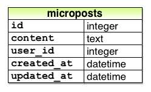
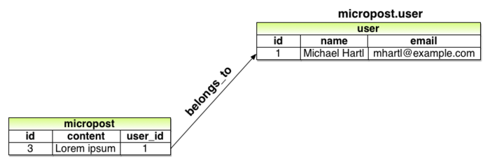
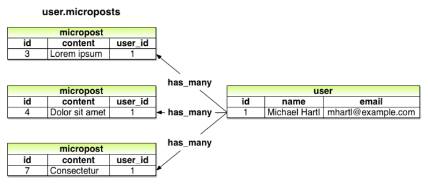

# 제 13장 유저의 Micropost

sample 어플리케이션의 코어 부분을 개발하기 위해, 지금까지 유저, 세션, Account 유효화, 패스워드 리셋 등 4개의 리소스에 대해 학습했습니다. 그리고 이것 들 중, "유저" 라고 하는 리소스만이 Active Record에 의해 데이터베이스 상의 테이블과 이어져있습니다. 모든 준비를 마친 지금, 유저가 짧은 메세지를 투고할 수 있도록 하기 위해 리소스 "*Micropost*" 를 추가해보겠습니다. [제 2장](Chapter2.md) 에서 간이적인 micropost 등록 form을 핸들링해보았습니다만, 이번 챕터에서는 [2.3](Chapter2.md#23-microposts-리소스) 에서 학습한 Micropost 데이터 모델을 생성하고, User 모델과 `has_many` , `belongs_to` 메소드를 사용하여 관련짓기를 해볼 것 입니다. 게다가 결과를 처리하고 표시하기 위해 필요한 Form과 해당 부품을 작성해보겠습니다. (13.4에서 이미지의 업로드도 구현해볼 것 입니다.) 제 14장에서는 micropost의 피드를 받기 위해 유저를 팔로우하는 개념을 도입하고, Twitter의 미니클론 버전을 완성시켜보겠습니다.


## 13.1 Micropost Model

우선 Micropost 리소스의 제일 본질적인 부분을 표현하는 Micropost 모델을 생성하는 부분부터 해보겠습니다. [2.3](Chapter2.md#23-microposts-리소스) 에서 생성한 모델과 마찬가지로, 이 새로운 Micropost 모델도 데이터 검증과 User 모델의 관련짓기를 포함하고 있습니다. 이전 모델과는 다르게 이번 micropost 모델은 완전히 테스트되어지고 디폴트의 순서를 가지며, 상위 데이터인 유저가 삭제되는 경우 자동적으로 파기되도록 합니다.


Git으로 버전관리에 사용하고 있는 경우는, 언제나처럼 토픽브랜치를 생성해봅시다.

`$ git checkout -b user-microposts `

### 13.1.1 기본적인 모델

Micropost 모델은 micropost의 내용을 저장할 `content` 속성과 특정 유저와 micropost를 관련짓는 `user_id` 속성의 2개 만을 가집니다. 실행한 결과의 Micropost의 구조는 아래와 같습니다.



위 모델에서는 micropost의 메세지 형태를 `String`이 아닌 `Text` 형태로 사용하고 있는 점을 주목해주세요. 이것은 어느정도의 양의 텍스트를 저장할 때 사용하는 형태입니다. `String` 형태로도 255문자까지는 저장할 수 있기 때문에, `String` 형으로도 13.1.2에서 구현하는 140문자 제한을 충족시킬 수는 있으나, `Text` 형이 좀 더 많은 내용의 micropost를 작성할 수 있습니다. 예를 들어 13.3.2 에서는 작성 form에서 String 용 텍스트 필드가 아닌, Text용 텍스트 에리어를 사용하고 있기 때문에, 보다 더 자연스러운 작성 Form을 표현할 수 있습니다. 또한 `Text` 형이 유연성을 가지고 있습니다. 예를들어 나중에 국제화로 인한 번역을 할 때, 언어별로 작성내용의 길이를 조절할 수도 있습니다. 게다가 `Text` 형을 사용하여도 실제 배포환경에서 [퍼포먼스의 차이는 없습니다.](http://www.postgresql.org/docs/9.1/static/datatype-character.html) 이러한 이유들로 단점보다는 장점이 많기 때문에, 이번에는 `Text` 형을 채용하겠습니다.


제 6장에서 User 모델을 생성했던 것과 마찬가지로, Rails의 `generate model` 커맨드를 사용하여 Micropost 모델을 생성해보겠습니다.

`$ rails generate model Micropost content:text user:references `

위 커맨드를 실행하면, 아래와 같은 모델 파일이 생성됩니다. 즉 [6.1.2](Chapter6.md#612-model-파일) 때와 마찬가지로 `ApplicationRecord` 를 계승한 모델이 생성됩니다. 단, 이번에 생성된 모델 내부에는 유저와 1대1의 관계를 나타내는 `belongs_to` 의 코드도 추가됩니다. 이것은 아까 전 커맨드를 실행했을 때의 `user:reference` 라고 하는 파라미터를 포함했기 때문입니다. 자세한 설명에 대해서는 13.1.3에서 하도록 하겠습니다.

```ruby
# app/models/micropost.rb

class Micropost < ApplicationRecord
   belongs_to :user
end
```

이전 6장에서 데이터베이스에 `users` 테이블을 작성할 때 마이그레이션을 생성한 것 과 마찬가지로, 이 `generate` 커맨드는 `microposts`  테이블을 생성하기 위해 마이그레이션 파일을 생성합니다.


User모델과의 제일 큰 차이점은 `references` 형을 이용하고 있다는 점 입니다. 이것을 이용하면, 자동적으로 인덱스와 외부 Key 참조를 하는 `user_id` 컬럼이 생성되어 User와 Microepost을 관련짓는 밑작업을 자동으로 해줍니다. User 모델과 마찬가지로, Micropost 모델의 마이그레이션 파일에도 `t.timestamp` 라고 하는 행 (매직컬럼)이 자동적으로 생성됩니다. 이것으로 [6.1.1](Chapter6.md#611-database) 에서 설명했듯이 `created_at` 과 `updated_at` 이라고하는 컬럼이 추가됩니다. 또한 `created_at` 컬럼은 13.1.4의 구현을 진행해나가면서 필요한 컬럼이기도 합니다.

```ruby
# db/migrate/[timestamp]_create_microposts.rb
class CreateMicroposts < ActiveRecord::Migration[5.0]
  def change
    create_table :microposts do |t|
      t.text :content
      t.references :user, foreign_key: true

      t.timestamps
    end
    add_index :microposts, [:user_id, :created_at]
  end
end
```

여기서 위 코드에서 `user_id` 와 `created_at`  컬럼에 인덱스를 추가하고 있는 것에 주목해주세요. 이렇게 함으로 인하여  `user_id` 와 관련된 모든 마이크로 포스트를 생성시간의 역순으로 얻기 쉬워지게 되었습니다.

`add_index :micropost, [:user_id, :created_at]`

또한 `user_id` 와 `created_id`  둘 다 하나의 배열로 묶고 있는 점을 주목해주세요. 이렇게 하는 것으로 Active Record는 양쪽의 key를 동시에 다루는 복합 key index를 생성합니다. [What is a multiple key index?](https://stackoverflow.com/questions/14844780/what-is-a-multiple-key-index)

그러면 위 마이그레이션 파일을 이용하여 데이터베이스를 갱신해봅시다. 

`$ rails db:migrate`

##### 연습

1. Rails 콘솔에서 `Micropost.new` 를 실행하여 인스턴스를 변수 `micropost` 에 대입해보세요. 그 다음, `user_id` 에 제일 첫 번째 유저 id를, `content` 에 "Lorem ipsum" 을 각각 대입해보세요. 이 시점에서 `micropost` 오브젝트의 매직컬럼 (`created_at` 과 `updated_at`) 에는 무엇이 들어있습니까?

2. 앞서 만든 오브젝트를 사용하여 `micropost.user` 실행시켜봅시다. 어떠한 결과가 출력되나요? 또한 `micropost.user.name` 을 실행했을 경우에는 어떠한 결과가 됩니까?

3. 앞서 만든 `micropost` 오브젝트를 데이터베이스에 저장해봅시다. 이 시점에서 한 번 더 매직컬럼의 내용을 확인해봅시다. 이번에는 어떠한 값이 들어있나요?


### 13.1.2 Micropost 의 Validation

기본적인 모델은 작성했ㅅ브니다. 다음으로는 요구되는 제한사항을 구현하기 위해서, Validation을 추가해봅시다. Micropost 모델을 생성했을 때, micropost는 작성한 유저의 id(`user_id`) 를 데이터로 가지고 있게끔 하였습니다. 이것을 사용하여 관슴적으로 올바른 Active Record와의 *관계맺기* 를 구현해볼 것 입니다. 우선 `Micropost` 모델 만을 (테스트 주도 개발로) 동작해보도록 합시다.


Micropost 의 초기 테스트는 User모델의 초기 테스트와 비슷합니다. 우선은 `setup` 단계에서, fixture의  sample 유저와 관련있는 새로운 micropost를 생성하고 있습니다. 다음으로 작성한 마이크로포스트가 유효한지 아닌지를 체크합니다. 마지막으로 모든 micropost는 유저의 id를 가지고 있어야만 하기 때문에 `user_id` 의 존재성의 validation에 대한 테스트를 추가합니다. 이것들을 하나로 묶으면 아래와 같은 코드가 될 것 입니다.

```ruby
# test/models/micropost_test.rb
require 'test_helper'

class MicropostTest < ActiveSupport::TestCase

  def setup
    @user = users(:michael)
    # 이 코드는 관습적으로 올바른 코드가 아닙니다.
    @micropost = Micropost.new(content: "Lorem ipsum", user_id: @user.id)
  end

  test "should be valid" do
    assert @micropost.valid?
  end

  test "user id should be present" do
    @micropost.user_id = nil
    assert_not @micropost.valid?
  end
end
```

`setup` 메소드의 내부의 코멘트처럼, micropost를 생성하는 코드는 동작합니다만 관습적으로는 올바르지 않은 코드입니다. (13.1.3에서 수정합니다.)


원래부터 존재하는 User 모델의 테스트와 마찬가지로, 위 첫 번째 테스트에서는 *정상적인 상태인지 아닌지를 테스트 (Sanity Test)* 를 하고 있습니다. 두 번째  테스트에서는 `user_id` 가 존재하는지를 (`nil` 은 아닌지) 를 테스트하고 있습니다. 이 테스트를 통과시키기 위해서는 아래와 같이, 존재성의 validation을 추가해봅시다.

```ruby
# app/models/micropost.rb
class Micropost < ActiveRecord::Base
  belongs_to :user
  validates :user_id, presence: true
end
```

여담으로, Rails 5에서는 위 validation을 추가하지 않아도 테스트는 통과할 것 입니다. 그러나 이것은 관습적인 의미에서 올바르지 않은 코드를 작성할 경우에만 발생합니다. 이 부분을 "관습적으로 올바른" 코드로 작성하면, `user_id` 에 대한 존재성의 validation이 기대했던 대로 동작할 것 입니다. 이 부분을 설명하고 싶었기 때문에 앞서 코드에 코멘트를 남겨놓은 것 입니다.


이상으로 위 테스트는 통과할 것 입니다. 확인해봅시다.

`$ rails test:models`

다음으로 micropost의 `content` 속성에 대한 validation을 추가해봅시다. ([2.3.2](Chapter2.md#232-micropost를-micro하게-해보자)에서 소개해드린 방법과 비슷합니다.) `user_id` 속성과 마찬가지로, `content` 속성도 존재할 필요가 있습니다. 게다가 micropost가 140문자보다 긴 문자가 되지 않도록 제한을 걸어보겠습니다. (이것이 micropost가 micro라고 이름이 붙은 이유입니다.)


[6.2](Chapter6.md#62-user를-검증해보자)  에서 User모델에 Validation을 추가했을 때와 마찬가지로, 테스트 주도 개발에서 micropost 모델의 validation을 추가해보겠습니다. 기본적으로는 User모델 때와 비슷한 validation을 추가해볼 것 입니다. 

```ruby
# test/models/micropost_test.rb
require 'test_helper'

class MicropostTest < ActiveSupport::TestCase

  def setup
    @user = users(:michael)
    @micropost = Micropost.new(content: "Lorem ipsum", user_id: @user.id)
  end

  test "should be valid" do
    assert @micropost.valid?
  end

  test "user id should be present" do
    @micropost.user_id = nil
    assert_not @micropost.valid?
  end
#추가
  test "content should be present" do
    @micropost.content = "   "
    assert_not @micropost.valid?
  end

  test "content should be at most 140 characters" do
    @micropost.content = "a" * 141
    assert_not @micropost.valid?
  end
#추가  
end
```

[6.2](Chapter6.md#62-user를-검증해보자) 와 마찬가지로, 위 코드는 micropost의 길이를 테스트하기 위해 문자열의 계산을 이용합니다.

```ruby
$ rails console
>> "a" * 10
=> "aaaaaaaaaa"
>> "a" * 141
=> "aaaaaaaaaaaaaaaaaaaaaaaaaaaaaaaaaaaaaaaaaaaaaaaa
aaaaaaaaaaaaaaaaaaaaaaaaaaaaaaaaaaaaaaaaaaaaaaaaaaaa
aaaaaaaaaaaaaaaaaaaaaaaaaaaaaaaaaaaaaaaaa"
```

이것에 대응하는 어플리케이션에서의 구현은, User의 `name` 용 validation때와 (6장) 똑같습니다. 아래는 결과와 같습니다.

```ruby
app/models/micropost.rb
class Micropost < ApplicationRecord
  belongs_to :user
  validates :user_id, presence: true
  validates :content, presence: true, length: { maximum: 140 }
end
```

이 시점에서, 모든 테스트는 GREEN이 될 것 입니다.

`$ rails test`

##### 연습 

1. Rails 콘솔을 실행시키고, `user_id` 와 `content` 가 비어있는 micropost 오브젝트를 만들어보세요. 이 오브젝트에 대해 `valid?` 를 실행시키면 실패하는 것을 확인해보세요. 또한 생성된 에러메세지에 어떠한 내용이 기재되어 있나요?
2. 콘솔을 실행시키고 이번에는 `user_id`가 비어있고, `content` 가 141문자 이상의 micropost 오브젝트를 생성해보세요. 이 오브젝트에 대해서 `valid?` 를 실행시키면 실패하는 것을 확인해보세요. 또한 생성된 에러메세지에는 어떠한 내용이 있는지 확인해보세요.

### 13.1.3 User/Micropost의 관계맺기

Web 어플리케이션용의 데이터모델을 구축할 때는, 각각의 모델 간의 관계에 대해서 충분히 생각할 필요가 있습니다. 이번 경우에는 [2.3.3](Chapter2.md#233-유저는-많은-마이크로포스트를-가지고-있다) 에서도 해본 적이 있듯, 각각의 micropost는 1명의 유저와 관계를 맺게되고, 각각의 유저는 (잠재적으로) 여러개의 micropost와 관계 맺게됩니다. 이 관계는 아래와 같습니다. 이러한 관계를 구현하기 위한 일환으로, micropost 모델에 대한 테스트코드를 작성하고, 게다가 User모델에 몇가지 테스트를 추가해볼 것 입니다.





이번 섹션에서 정의하는 `belongs_to` / `has_many` 관계를 사용합니다. 위 그림에서 사용하는 메소드를 Rails에서 사용할 수 있게 됩니다. 속성들은 아래의 메소드가 아닌

```ruby
Micropost.create
Micropost.create!
Micropost.new
```

아래 메소드를 사용하고 있는 점을 주의해주세요.

```ruby
user.microposts.create
user.microposts.create!
user.microposts.build
```

이 메소드를 사용하면, 관계를 맺고 있는 유저를 *통해* micropost를 작성할 수 있습니다. (관습적으로 올바른 방법입니다.) 신규 micropost가 이 방법으로 생성되는 경우, `user_id` 는 자동적으로 올바른 값으로 설정됩니다. 이 방법을 사용하면, 예를 들어 아래와 같은

```ruby
@user = users(:michael)  
# 아래 코드는 관습적으로 올바르지 않습니다.
@micropost = Micropost.new(content: "Lorem ipsum", user_id: @user.id)
```

위와 같은 작성방법이 아래와 같이 다시 쓸 수 있습니다.

```ruby
@user = users(:michael)
@micropost = @user.microposts.build(content: "Lorem ipsum")
```

(`new` 메소드와 마찬가지로, `build` 메소드는 오브젝트를 리턴하는데, 데이터베이스에는 반영하지 않습니다.) 한 번에 올바른 관계를 정의해 놓는다면, `@micropost` 변수의 `user_id` 는 관계를 맺고있는 유저의 id가 자동적으로 설정됩니다.

| 메소드                           | **용도**                                                    |
| -------------------------------- | ----------------------------------------------------------- |
| `micropost.user`                 | Micropost와 관계를 맺고 있는 User 오브젝트를 리턴한다.      |
| `user.microposts`                | User의 Micropost 집합을 리턴한다.                           |
| `user.microposts.create(arg)`    | `user` 관계맺은 micropost를 생성한다.                       |
| `user.microposts.create!(arg)`   | `user`와 관계맺은 micropost를 생성한다. (실패 시 예외 발생) |
| `user.microposts.build(arg)`     | `user` 와 관계맺은 새로운 Micropost 오브젝트를 리턴한다.    |
| `user.microposts.find_by(id: 1)` | `user`와 관계를 맺고 있고 id가 1인 micropost를 검색합니다.  |

`@user.micropost.build` 와 같은 코드를 사용하기 위해, User모델과 Micropost 모델을 각각 수정하고, 관계를 맺을 필요가 있습니다. Micropost 모델에서는 `belongs_to :user` 라고 하는 코드가 필요합니다만, 이것은 아래 코드의 migration에 의해 자동적으로 생성될 것 입니다. 한 편, User모델에서는  `has_many :microposts` 라고 추가할 필요가 있습니다. 여기는 자동적으로 생성되지 않기 때문에, 수동으로 추가해야할 필요가 있습니다.

```ruby
# app/models/micropost.rb
class Micropost < ApplicationRecord
  belongs_to :user # 수정
  validates :user_id, presence: true
  validates :content, presence: true, length: { maximum: 140 }
end
```

```ruby
# app/models/user.rb
class User < ApplicationRecord
  has_many :microposts
  .
  .
  .
end
```

올바르게 관계가 맺어졌다면, `setup` 메소드를 수정하고 관습적으로 올바른 micropost를 생성해봅시다.

```ruby
test/models/micropost_test.rb
require 'test_helper'

class MicropostTest < ActiveSupport::TestCase

  def setup
    @user = users(:michael)
    @micropost = @user.microposts.build(content: "Lorem ipsum") #Update
  end

  test "should be valid" do
    assert @micropost.valid?
  end

  test "user id should be present" do
    @micropost.user_id = nil
    assert_not @micropost.valid?
  end
  .
  .
  .
end
```

물론 섬세한 리팩토링이기 때문에, 테스트는 아직 통과할 것 입니다.

`$ rails test`

##### 연습 

1. 데이터베이스에 있는 제일 첫 번째 유저를 변수  `user` 에 대입해주세요. 해당 user 오브젝트를 사용하여 `micropost = user.microposts.create(content: "Lorem ipsum")` 을 실행하면 어떠한 결과를 얻을 수 있습니까?
2. 앞서 연습문제에서, 데이터베이스 상에 새로운 micropost가 추가되었을 것 입니다. `user.microposts.find(micropost.id)` 를 실행하여, 정말로 추가되었는지를 확인해봅시다. 또한 앞서 실행한 `micropost.id` 의 부분을 `micropost` 로 바꾸면 어떠한 결과가 생기나요?
3. `user == micro post.user` 를 실행한 결과는 어떻게 되나요? 또한 `user.microposts.first == micropost` 를 실행한 결과는 어떻게 되나요? 각각 확인해봅시다.

### 13.1.4 Micropost를 개선해보자.

