# 제 14장 유저를 Follow해보자

이번 챕터에서는 Sample application의 핵심이되는 부분을 완성시켜봅니다. 구체적으로는 다른 유저를 follow(및 follow 해제)할 수 있는 Social 기능의 추가와, Follow하고 있는 유저의 투고를 Status feed에 표시하는 기능을 추가해봅니다. 우선은 유저간의 관계를 어떻게 모델링할 것인지에 대해 배워봅니다. 그 후 모델링결과에 대응하는 Web Interface를 구현합니다. 그 때, Web Interface의 한 예로서 Ajax라고 하는 것을 소개해보겠습니다. 마지막으로 Status feed의 완성판을 구현해볼 것 입니다.


본 마지막 챕터에서는, 본 튜토리얼에서 가장 난이도가 높은 방법을 몇가지 사용해볼 것입니다. 그 중에서는 Status Feed의 작성을 위해 Ruby/SQL을 "속이는" 테크닉도 포함됩니다. 이번 챕터의 예시 전체에 걸쳐, 지금까지보다도 복잡한 데이터 모델을 사용하빈다. 여기서 배운 데이터 모델은, 이후 개별적으로 Web Application을 개발할 때 반드시 도움이 될 것 입니다. 또한 본 튜토리얼을 다 끝내고나서 실제로 개발에 투입될 때 도움이될만한 리소스 집에 대해서도 소개해드리겠습니다.


이번 챕터에서 다루는 기법은 본 튜토리얼 전체에서도 제일 난이도가 높기 때문에, 이해를 돕기위하여 코드를 작성하기 전에 일단 멈추고 Interface를 이해해보도록 합시다. 지금까지의 챕터와 마찬가지로, 제일 처음에 목업을 확인해주세요. 페이지 조작의 전체적인 flow는 다음과 같습니다. 어떠한 유저 (John Calvin) 은 자신의 프로필 페이지를 제일 처음 표지하고, Follow하는 유저를 선택하기 위해 User페이지로 이동합니다. Calvin은 2번째 유저 Thomas Hobbles를 표시하고, [Follow] 버튼을 눌러 Follow를 합니다. 이것으로 [Follow]버튼이 [Unfollow] 버튼으로 바뀌고, Hobbes의 [followers] 카운트가 1 증가합니다. Cavin이 Home페이지로 돌아가면, [Following] 카운트가 1명 증가해있고, Hobbes의 마이크로 포스트가 Status Feed에 표시되고 있는 것을 알게 될 것 입니다. 이번 섹션에서는 이후의 Follow의 구현의 전념해봅니다.

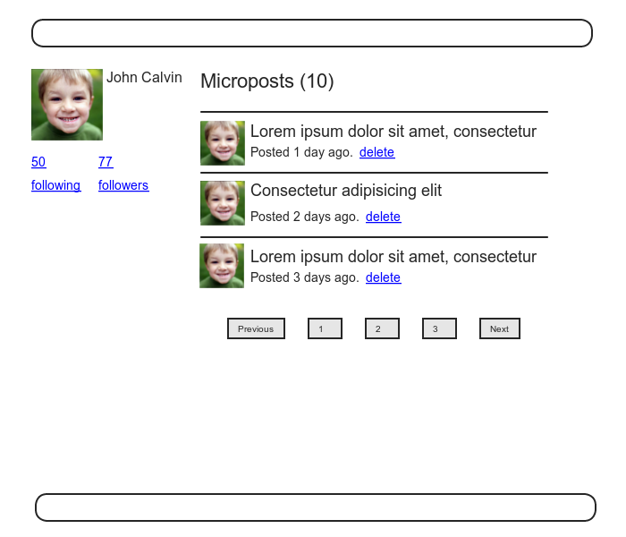

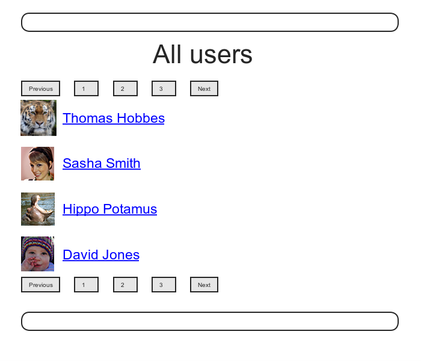


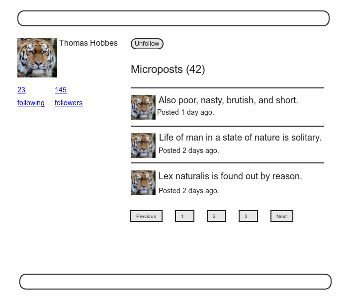

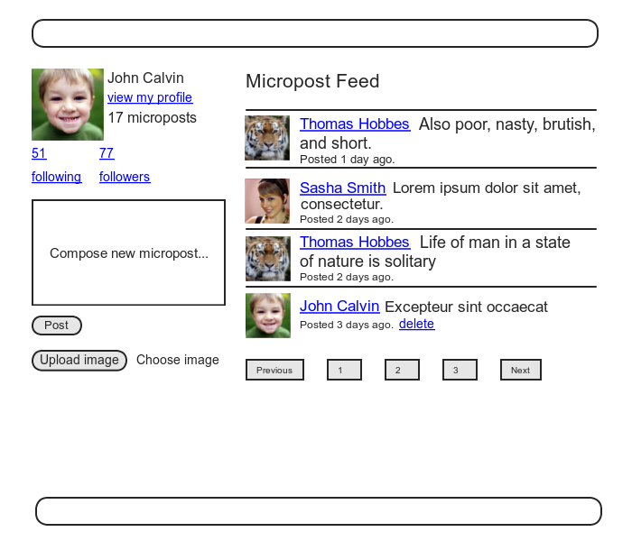


## 14.1 Relationship Model

유저를 follow하는 기능을 구현하는 제일 첫 번째로는, Data modeling 을 구성하는 것 입니다. 단, 이것은 보기와는 달리 단순하진 않습니다. 간단하게 생각한다면 `has_many` (1대다) 의 관계를 이용하여 "1명의 유저가 여러명의 유저를 `has_many` 로 follow를 하고, 1명의 유저에게 여러명의 follower가 있는 것을 `has_many`  로 나타낸다" 라고 하는 방법도 구현가능할 것 같습니다. 그러나 방금 전 설명한 것과 같이 이 방법으로는 당장 뛰어넘기 어려운 벽과 마주하게 될 것 입니다. 이것을 해결하기 위해서 `has_many through` 에 대해서 나중에 설명해보겠습니다.


Git유저는 지금까지와 마찬가지로 새로운 Topic branch를 생성해주세요.

`$ git checkout -b following-users`

### 14.1.1 DataModel의 문제 (및 해결책)

유저를 follow하는 DataModel의 구성을 위한 첫 걸음으로써, 전형적인 경우를 검토해봅시다. 어떤 유저가 다른 유저를 follow하고 있다는 것을 가정해봅시다. 구체적인 예를 든다면, Calvin은 Hobbes를 follow하고 있습니다. 이것을 역으로 생각해본다면, Hobbes는 Calvin으로부터 Follow를 당하고 있습니다. Calvin은 Hobbes으로부터 보면 follower이며, Calvin이 Hobbes를 followed한 것이 됩니다. Rails에서의 Default적인 복수형의 관습을 따르면, 어떤 유저를 follow하고 있는 모든 유저의 집합은 `followers` 가 되며, `user.followers` 는 이것들의 유저의 배열을 지칭하는 것이 됩니다. 그러나 안타깝게도, 이러한 이름은 역으로 생각할때는 잘 동작하지 않습니다. (Rails보단 영어의 문제입니다만,) 어떤 유저가 follow하고 있는 모든 유저의 집합은, 이대로는 `followeds` 가 되어버리며, 영어의 문법으로부터 제외되는 매우 볼썽사나운 형태가 되어버립니다. 여기서 Twitter의 관습을 보고 배워, 본 튜토리얼에서는 `following` 이라는 호칭을 채용해봅시다. (예: "50 following, 75 followers") 따라서 어떤 유저가 follow하고 있는 모든 유저의 집합은 `calvin.following` 이 됩니다.


이것으로, 아래와 같이 `following` 테이블과 `has_many` 관계를 이용하여 follow하고있는 유저의 모델을 작성해보았습니다. `user.following` 은 유저의 집합이지 않으면 안되기 때문에, `following` 테이블의 각각의 데이터는, `followed_id` 로 식별가능한 유저이지 않으면 안됩니다. (이것은 `follower_id` 의 관계에 대해서도 마찬가지 입니다.) 게다가 각각의 데이터는 유저이기 때문에, 이 유저에게 이름이나 패스워드 등의 속성도 추가할 필요가 있습니다.

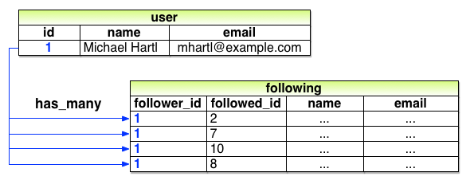

위 데이터모델에서의 문제점은, 매우 불필요한 점이 많다는 것 입니다. 각 데이터에는 follow하고 있는 유저의 id뿐만 아니라, 이름이나 메일주소까지 있습니다. 이것은 어디까지나 `users` 테이블에 이미 존재하고 있는 정보입니다. 게다가 안좋게도 `followers` 의 모델링을 할 때에도 비슷하게, 불필요한 점이 많은 `followers` 테이블을 별도로 생성하지 않으면 안될 것 입니다. 결론적으로는 이 데이터모델은 유지보수의 관점으로부터 볼때는 매우 좋지 않습니다. 유저 이름을 변경할 때마다 `users` 테이블의 해당 레코드 뿐만 아니라, `following` 과 `followers` 테이블 양쪽에 대해서도 _해당 유저를 포함한 모든 레코드_ 를 갱신하지 않으면 안됩니다.

이 문제의 근본적인 원인은, 필요한 추상화를 진행하지 않았다는 점 입니다. 올바른 모델을 찾아내는 방법 중 하나로는, Web Application에서의 `following` 동작을 어떻게 구현할 것인지를 가만히 생각해보는 것 입니다. [7.1.2](Chapter7.md#712-user-resource) 에 있어서, REST Architecture 는 생성하거나 삭제하는 리소스에 관련되어있다는 것을 떠올려주세요. 여기서부터 2가지의 의문점이 생길 것 입니다. 

1. 어떤 유저가 다른 유저를 follow할 때, 어떠한 것이 생성되는가.
2. 어떤 유저가 다른 유저를 follow_해제_ 할 때, 어떠한 것이 삭제되는가.

이 점을 생각해보면, 이 경우 application에 의해서 생성 혹은 삭제되는 것은 2명의 유저 간의 "_관계(Relationship)_" 이라는 것을 알 수 있을 것 입니다. 즉, 1명의 유저는 1대다의 관계를 가질 수 있으며, 게다가 유저는 Relationship을 경유하여 많은 `following` (혹은 `followers`) 와 관계를 맺을 수 있는 것입니다.

이 DataModel에는 다른 부분에도 해결해야만하는 문제가 있습니다. Facebook과 같은 우호관계 (Friendships) 에서는 본질적으로 좌우대칭의 DataModel이 성립합니다만, Twitter와 같은 Follow관계에서는 _좌우비대칭_ 의 성질이 있습니다. 즉, Calvin은 Hobbes를 follow하여도, Hobbes는 Calvin을 follow하고있지 않은 관계가 성립하는 것 입니다. 이러한 좌우비대칭적인 관계를 구분하기 위해, 각각을 _능동적 관계(Active Relationship)_ 와 _수동적 관계(Passive Relationship)_ 이라 부르고자 합니다. 예를들어 앞서의 사례와 같은, Calvin이 Hobbes를 follow하지만, Hobbes는 Calvin을 follow하고 있지 않은 경우에는, Calvin은 Hobbes에 대해 "능동적 관계" 인 것이 됩니다. 반대로 Hobbes는 Calvin에 대해 "수동적 관계"가 됩니다. 

우선은, follow하고 있는 유저를 생성하기 위해, 능동적 관계에 초점을 맞춰 진행해보겠습니다. (수동적 관계에 대해서는 [14.1.5](#1415-follower) 에서 다뤄보겠습니다.) 앞서 모델링은 구현에 대한 힌트가 되었습니다. follow하고 있는 유저는 `followed_id` 가 있으면 식별할 수 있기 때문에, 앞서 `following` 테이블을 `active_relationship` 테이블이라고 칭해보겠습니다. 단, 유저정보는 필요 없기 때문에, 유저 id이외의 정보는 삭제합니다. 그리고 `followed_id` 를 통해 `users` 테이블에서 follow되어진 유저를 찾아내봅시다. 이 데이터모델링을 도식화하면 아래와 같이 됩니다.

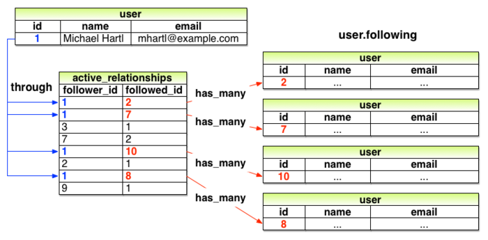

능동적 관계도, 수동적 관계도, 최종적으로는 데이터베이스의 같은 테이블을 쓰게 될 것 입니다. 따라서 테이블이름으로는 "관계" 를 뜻하는 "**Relationship**" 을 사용하겠습니다. 모델이름은 Rails의 관습에 따라, Relationship으로 합니다. 생성한 Relationship DataModel은 아래와 같습니다. 1개의 relationship 테이블을 사용하여 2개의 모델 (능동적 관계, 수동적 관계)를 시뮬레이션하는 방법은, [14.1.4](#1414-follow하고-있는-유저)에서 설명하겠습니다.

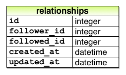

이 DataModel을 구현하기 위해, 우선 위 모델링에 대응한 migration을 생성합니다.

```
$ rails generate model Relationship follower_id:integer followed_id:integer
```

이 Relationship은 이후에 `follower_id` 와 `followed_id` 에서 빈번하게 검색하게 될 것입니다. 아래와 같이 각가의 컬럼에 인덱스를 추가합시다.

```ruby
# db/migrate/[timestamp]_create_relationships.rb
class CreateRelationships < ActiveRecord::Migration[5.0]
  def change
    create_table :relationships do |t|
      t.integer :follower_id
      t.integer :followed_id

      t.timestamps
    end
    add_index :relationships, :follower_id
    add_index :relationships, :followed_id
    add_index :relationships, [:follower_id, :followed_id], unique: true
  end
end
```

위 코드에서 복합 key index가 있는 것을 주목해주세요. 이것은 `follower_id` 와 `followed_id` 의 조합이 반드시 Unique한 것을 보증하기 위한 형태입니다. 이것으로 어떠한 유저가 같은 유저를 2회이상 follow하는 것을 막을 수 있을 것 입니다. (이전 6장에서 메일주소의 unique성을 보증하거나, 13장에서 사용한 복합 key index와 비교해보세요.) 물론, 이러한 중복 (2회이상 follow하는 것) 이 일어나지 않도록, interface 측의 구현도 주의하지않으면 안됩니다. ([14.1.4](#1414-follow하고-있는-유저)) 그러나, 유저가 어떠한 방법으로 (예를 들면, `curl` 등의 command line tool을 이용하여) Relationship의 데이터를 조작하는 일도 충분히 일어날 수 있습니다. 이러한 경우에도 Unique한 index를 추가해놓는다면, 에러를 발생시켜 중복되는 일을 막을 수 있습니다.

`relationship` 테이블을 생성하기 위해, 언제나처럼 database의 migration을 진행합니다.

`$ rails db:migrate`

##### 연습

1. 위 두 번째 그림(능동적 관계 모델 Diagram)에서 id=`1` 의 유저에 대해 `user.following.map(&:id)` 를 실행하면, 결과는 어떻게 될 것 같습니까? 상상해보세요. _Hint_: [4.3.2](Chapter4.md#432-블록) 에서 소개해드린 `map(&:method_name)` 의 패턴을 떠올려주세요. 예를들어 `user.following.map(&:id)` 의 경우, id를 배열로 리턴합니다.
2. 위 두 번쨰 그림(능동적 관계 모델 Diagram)을 참고하여 id=`2` 의 유저에 대해 `user.following` 을 실행하면 결과는 어떻게 될까요? 또한 같은 유저에 대해 `user.following.map(&id)` 을 실행하면 결과는 어떻게 될까요? 상상해보세요.

### 14.1.2 User/Relationship의 관계

Follow하고 있는 유저와 Follower를 구현하기 전에, User와 Relationship의 관계맺기를 진행합니다. 1명의 유저에게는 `has_many` (1대다)의 Relationship이 있으며, 이 Relationship은 2명의 유저 사이의 관계를 나타내기 때문에, follow하고 있는 유저와 follower 양쪽에 속합니다. (`belongs_to`)

[13.1.3](Chapter13.md#1313-user-micriopost의-관계맺기) 의 micropost 때와 마찬가지로, 다음과 같이 유저의 관계를 이용한 코드를 사용하여 새로운 Relationship을 생성해봅시다.

`user.active_relationships.build(followed_id: ...)`

이 시점에서 Application에서는 [13.1.3](Chapter13.md#1313-user-micriopost의-관계맺기) 처럼 되는것이 아니냐고 예측하는 사람이 있을지도 모릅니다. 실제로도 비슷합니다만 2가지의 매우 큰 차이점이 있습니다.

우선 첫 번째에 대해서입니다. 이전 유저와 micropost가 관계를 맺었을 때에는 아래와 같이 작성하였습니다.

```ruby
class User < ApplicationRecord
  has_many :microposts
  .
  .
  .
end
```

파라미터의 `:micropost` 심볼으로부터, Rails는 이것에 대응하는 Micropost 모델을 찾아낼 수 있습니다. 그러나 이번 케이스에서 똑같이 작성하게 된다면

`has_many :active_relationships`

로 되어버립니다. (ActiveRelationship모델을 검색하게 되어버립니다.) Relationship 모델을 찾을 수가 없게될 것 입니다. 그렇기 때문에 이번 케이스에서는 Rails에게 찾아내주었으면 하는 모델의 클래스이름을 명시적으로 선언해줄 필요가 있습니다.

두 번째 차이점은, 방금 전 말한 것의 반대 케이스입니다. 이전에는 Micropost 모델에

```ruby
class Micropost < ApplicationRecord
  belongs_to :user
  .
  .
  .
end
```

 이렇게 작성하였습니다. `micropost` 테이블에는 `user_id` 속성이 있기 때문에, 이것을 거꾸로 쫓아가면 대응하는 소유자(유저)를 특정할 수 있었습니다. ([13.1.1](Chapter13.md#1311-기본적인-모델)) 데이터베이스의 2개의 테이블을 연결할 때, 이러한 id는 외부키 (_Foreign Key_) 라고 부릅니다. 즉, User모델로 연결하는 외부키가 Micropost의 `user_id` 속성이라는 것입니다.. 이 외부키의 이름을 사용하여 Rails는 관계를 추측하는 것 입니다. 구체적으로는 Rails에서 default는 외부키의 이름을 `<class>_id` 라는 패턴으로 이해하며, `<class>` 에 해당하는 부분에서 클래스 이름 (정확하게는 소문자로 변환된 클래스이름) 을 추측합니다. 단, 방금전에는 유저를 예로 들었습니다만 이번 경우에는 나를 follow하고 있는 유저를 `follower_id` 라고 하는 외부키를 사용하여 특정하지 않으면 안됩니다. 또한 follower 라고 하는 클래스 이름은 존재하지 않기 때문에, 여기서도 Rails에게 올바른 클래스이름을 명시적으로 알려줘야할 필요가 생깁니다.

위에서의 설명을 코드로 정리해보자면, User와 Relationship의 관계는 아래 두 코드와 같이 됩니다.


```ruby
# 능동적 관계에 대하여 1대다(has_many) 의 관계로 구현
# app/models/user.rb
class User < ApplicationRecord
  has_many :microposts, dependent: :destroy
  # new
  has_many :active_relationships, class_name:  "Relationship",
                                  foreign_key: "follower_id",
                                  dependent:   :destroy
  .
  .
  .
end
```

(유저를 삭제하면, 유저의 Relationship도 동시에 삭제되어야할 필요가 있습니다. 때문에 관계구성에 `dependent: :destroy` 를 추가합니다.)


```ruby
# Relationship / Follower에 대해 belongs_to 관계를 추가.
# app/models/relationship.rb
class Relationship < ApplicationRecord
  belongs_to :follower, class_name: "User"
  belongs_to :followed, class_name: "User"
end
```

또한 `follower`의 관계에 대해서는 [14.1.4](#1414-follow하고-있는-유저)를 시작하기 전까지는 다루지 않습니다. 그러나 follower와 followed를 대칭적으로 구현해놓는 것으로써 구조에 대해서는 이해하기 쉬워질 것 입니다.

위 두 개의 코드에서 정의한 관계대로, 아래 표에서 이전 소개한 것과 같은 많은 메소드를 사용할 수 있게 되었습니다. 이번에 사용할 수 있게 된 메소드는 아래와 같습니다.

| **메소드**                                                   | **용도**                                                     |
| ------------------------------------------------------------ | ------------------------------------------------------------ |
| `active_relationship.follower`                               | Follower를 리턴합니다.                                       |
| `active_relationship.followed`                               | Follow하고있는 유저를 리턴합니다.                            |
| `user.active_relationships.create(followed_id: other_user.id)` | `user`와 관계를 맺는 능동적 관계를 생성/등록합니다.          |
| `user.active_relationships.create!(followed_id: other_user.id)` | `user`와 관계를 맺는 능동적 관계를 생성/등록합니다.(실패시 에러를 출력) |
| `user.active_relationships.build(followed_id: other_user.id)` | `user`관계를 맺은 새로운 Relationship object를 리턴합니다.   |

##### 연습

1. 콘솔을 실행하여 위 표의 `create` 메소드를 사용하여 ActiveRelationship을 작성해보세요. 데이터베이스 상의 2명 이상의 유저를 준비하고, 제일 첫 유저가 2번째의 유저를 follow하도록 상태를 만들어보세요.
2. 방금 전 연습을 끝냈다면, `active_relationship.followed` 의 값과 `active_relationship.follower` 의 값을 확인하고, 각각의 값이 올바른지를 확인해보세요.

### 14.1.3 Relationship의 Validation

진행하기에 앞서, Relationship 모델의 검증을 추가하여 완전한 모델로 만들어놓겠습니다. 테스트 코드와 Application 코드는 생각보다 소박합니다. 단, User용의 Fixture 파일과 마찬가지로, 생성된 Relationship용의 fixture는 migration으로 제약이 걸려있는 unique 성질을 충족할 수 없습니다. 때문에 유저의 경우와 마찬가지로, 지금 시점에서는 생성된 Relationship용의 fixture 파일도 일단 비워놓읍시다.


```ruby
# Relationship 모델의 Validation을 테스트한다.
# test/models/relationship_test.rb
require 'test_helper'

class RelationshipTest < ActiveSupport::TestCase

  def setup
    @relationship = Relationship.new(follower_id: users(:michael).id,
                                     followed_id: users(:archer).id)
  end

  test "should be valid" do
    assert @relationship.valid?
  end

  test "should require a follower_id" do
    @relationship.follower_id = nil
    assert_not @relationship.valid?
  end

  test "should require a followed_id" do
    @relationship.followed_id = nil
    assert_not @relationship.valid?
  end
end
```

```ruby
# Relationship Model에 대해서 validation을 추가한다.
# app/models/relationship.rb
class Relationship < ApplicationRecord
  belongs_to :follower, class_name: "User"
  belongs_to :followed, class_name: "User"
  validates :follower_id, presence: true
  validates :followed_id, presence: true
end
```

```
# test/fixtures/relationships.yml

# 빈 상태로 작성해놓습니다.
```

이 시점에서, 테스트는 통과할 것 입니다.

`$ rails test`

##### 연습

1. 위 `relationship.rb` 의 코드의 validation을 코멘트아웃하여도 테스트가 성공하는지를 확인해봅시다. (이전의 Rails 버전에서는 이 validation이 필수였습니다만, Rails 5부터 필수가 아니게 되었습니다. 이번에는 follow기능의 구현을 우선적으로 합니다만, validation의 구현을 빼먹으실 수도 있으니, 유의하시고 꼭 구현해보세요.)

### 14.1.4 Follow하고 있는 유저

드디어 Relationship의 관계의 핵심인, `following` 과 `followers` 를 구현해보겠습니다. 이번에는 `has_many through` 를 사용합니다. 이전 모델링 Diagram과 마찬가지로, 1명의 유저에게는 여러가지의 "follow하는" 혹은 "following하는" 관계가 생깁니다. (이러한 관계성을 "다대다" 관계라고 부릅니다.) default의 `has_many through` 라고하는 관계에서는, Rails의 모델이름(단수명)에 대응하는 외부 키를 찾습니다. 즉 다음 코드에서는

`has_many :followeds, through: :active_relationship`

Rails은 "followeds" 라고 하는 심볼을 확인하고, 이것을 "followed" 라고하는 단수형으로 바꾸고 `relationship` 테이블의 `followed_id` 를 사용하여 대상 유저를 조회합니다. 그러나 [14.1.1](#1411-datamodel의-문제-및-해결책) 에서 지적한 바와 같이, `user.followeds` 라고 하는 이름은, 영어로서는 부적절합니다. 대신에 `user.following` 이라고 하는 이름을 사용합시다. 그러기 위해서는, Rails의 default기능을 덮어쓰기해야할 필요가 있습니다. 여기서는 `:source` 파라미터를 사용하여 "`following` 배열의 소스는 `followed_id` 의 집합이다" 라는 것을 명시적으로 Rails에서 선언합시다.

(내가 Follow하고 있는 유저)

``` ruby
# app/models/user.rb
class User < ApplicationRecord
  has_many :microposts, dependent: :destroy
  has_many :active_relationships, class_name:  "Relationship",
                                  foreign_key: "follower_id",
                                  dependent:   :destroy
  has_many :following, through: :active_relationships, source: :followed
  #new
  .
  .
  .
end
```

위에서 정의한 관계에 의하여, follow하고있는 유저를 배열처럼 다룰 수 있게 되었습니다. 예를 들어 `include?` 메소드([4.3.1](Chapter4.md#431-배열과-범위연산자)) 를 사용하여 follow하고있는 유저의 집합을 알아본다거나, 관계를 통하여 오브젝트를 찾아낼 수도 있습니다.

```
user.following.include?(other_user)
user.following.find(other_user)
```

`following`에서 얻은 오브젝트는 배열처럼 요소를 추가하거나 삭제할 수도 있습니다.

```
user.following << other_user
user.following.delete(other_user)
```

([4.3.1](Chapter4.md#431-배열과-범위연산자) 를 떠올려주세요. `<<` 연산자 (Shovel Operator) 에서 배열의 제일 마지막에 추가를 할 수 있습니다.)

`following` 메소드에서 배열처럼 다룰 수 있는 것만해도 편리합니다만, Rails는 단순한 배열이 아닌, 좀 더 똑똑하게 이 집합을 다룹니다. 예를들어 다음과 같은 코드에는

```
following.include?(other_user)
```

follow하고 있는 모든 유저를 데이터베이스로부터 얻을 수 있고, 이 집합에 대해 `include?` 메소드를 실행하고 있는 것 처럼 보입니다. 그러나 실제로는 데이터베이스의 안에서 직접 비교를 하게끔 처리되어있습니다. 또한 [13.2.1](Chapter13.md#1321-micropost의-표시) 에서 설명했듯이, 다음과 같은 코드는

`user.microposts.count`

 데이터베이스의 안에서 합계를 계산하는 것이 빠르게 처리된다는 점을 주의해주세요.

다음으로, following에서 얻은 집합을 보다 더 간단하게 다루기 위해, `follow` 나 `unfollow` 등과 같은 편리한 메소드를 추가해봅시다. 이러한 메소드는 예를 들어 `user.follow(other_user)` 등과 같은 경우에 사용합니다. 게다가 이것과 관련된 `following?` 논리값 메소드도 추가하여, 어느 유저가 누구를 follow하고 있는지를 확인할 수 있게 해봅니다.

이번에는 이러한 메소드는 테스트할 때 작성해봅니다. Web Interface등에서 편리메소드를 사용하는 것은 조금은 나중 일이기 때문에 바로 사용하는 경우는 없으며, 구현한 보람을 얻기도 어렵기 때문입니다. 한편, User모델에 대하여 테스트를 작성하는 것은 간단하며 지금 당장 작성해볼 수 있습니다. 그 테스트 안에서 다음의 메소드를 사용해 볼 것 입니다. 구체적으로는 `following?` 메소드로 어느 유저를 아직 follow하고있지 않은 것을 확인, `follow` 메소드를 사용하여 해당 유저를 follow, `following?` 메소드를 사용하여 follow중이 된 것을 확인. 마지막으로 `unfollow` 메소드로 follow해제가 된 것을 확인, 하는 테스트들을 작성해볼 것 입니다. 작성한 코드는 아래와 같습니다.

```ruby
# test/models/user_test.rb
require 'test_helper'

class UserTest < ActiveSupport::TestCase
  .
  .
  .
  test "should follow and unfollow a user" do
    michael = users(:michael)
    archer  = users(:archer)
    assert_not michael.following?(archer) #when return false, then true
    michael.follow(archer)
    assert michael.following?(archer)
    michael.unfollow(archer)
    assert_not michael.following?(archer)
  end
end
```

이전 메소드 표를 참고해가면서 `following` 에 의한 관계맺기를 사용하여 `follow`, `unfollow`, `following?` 메소드를 구현해봅시다. 이 때, 가능한 `self` (user 자신을 나타내는 오브젝트) 를 생략하고 있는 점을 주의해주세요.

```ruby
app/models/user.rb
class User < ApplicationRecord
  .
  .
  .
  def feed
    .
    .
    .
  end

  #  유저를 follow한다.
  def follow(other_user)
    following << other_user
  end

  # 유저 follow를 해제한다.
  def unfollow(other_user)
    active_relationships.find_by(followed_id: other_user.id).destroy
  end

  # 현재 유저가 follow하고 있다면 true를 리턴한다.
  def following?(other_user)
    following.include?(other_user)
  end

  private
  .
  .
  .
end
```

위 코드를 추가하는 것으로, 테스트코드는 통과할 것 입니다.

`$ rails test`

##### 연습

1. 콘솔을 열고 위에서 구현한 코드를 순차적으로 실행해봅시다.
2. 연습문제 1번의 각 커맨드 실행시의 결과를 확인하고, 실제로 어떠한 SQL이 실행되는지 확인해봅시다.

### 14.1.5 Follower

Relationship이라는 퍼즐의 마지막 한 조각은, `user.followers` 메소드를 추가하는 것 입니다. 이것은 위의 `user.following` 메소드와는 반대되는 개념입니다. 이전 능동적관계를 이용하여 팔로우하고 있는 유저들을 조회할 때의 관계도를 보고 알아채신 분들도 있을 수 있습니다만, follower의 배열을 전개하기 위해 필요한 정보는, `relationships` 테이블에 이미 존재합니다. 즉, `active_relationships` 테이블을 재이용하는 것이 가능하다는 것입니다. 실제로 `follower_id` 와 `followed_id` 를 바꾸는 것만으로도 follower에 대해서도 follow하는 경우와 완전히 똑같은 방법으로 활용할 수 있습니다. 따라서 dataModel은 아래와 같이 됩니다.

(나를 follow하고 있는 User)

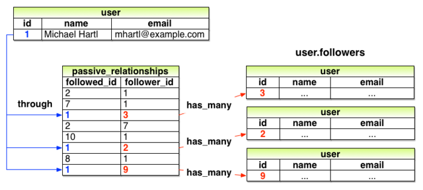

위 모델링을 참고한 데이터 모델을 구현한 것은 아래와 같습니다. 이 구현은 이전, 능동적관계를 구현할 때의 코드와 매우 비슷합니다.

```ruby
# 수동적관계를 사용하여 user.followers 을 구현한다.
# app/models/user.rb

class User < ApplicationRecord
  has_many :microposts, dependent: :destroy
  has_many :active_relationships,  class_name:  "Relationship",
                                   foreign_key: "follower_id",
                                   dependent:   :destroy
  #new
  has_many :passive_relationships, class_name:  "Relationship",
                                   foreign_key: "followed_id",
                                   dependent:   :destroy
  #new
  has_many :following, through: :active_relationships,  source: :followed
  has_many :followers, through: :passive_relationships, source: :follower   #new
  .
  .
  .
end
```

한 가지 위 코드에서 주의해야할 점으로는 다음과 같은 참조처 (`followers`) 를 지정하기 위해 `:source` key를 생략해도 된다는 점 입니다.

`has_many :followers, through: :passive_relationships`

이 것은 `:followers` 속성의 경우, Rails가 "followers" 를 단수형으로서 자동적으로 Foreign Key `follower_id` 를 찾아주기 때문입니다. 그럼에도 불구하고 `:source` key를 남겨놓은 이유는 `has_many :following` 과 비슷하다는 것을 강조하기 위해서입니다.

다음으로 `followers.include?` 메소드를 사용하여 방금전 데이터모델을 테스트해봅시다. 테스트 코드는 아래와 같습니다. 여담으로, 아래 테스트 코드에서는 `following?` 과는 대조적인 `followed_by?` 메소드를 정의하여도 좋았습니다만, sample application에서 실제로 사용하는 경우는 없기 때문에 이 메소드는 생략하겠습니다.

```ruby
# followers에 대한 테스트.
# test/models/user_test.rb
require 'test_helper'

class UserTest < ActiveSupport::TestCase
  .
  .
  .
  test "should follow and unfollow a user" do
    michael  = users(:michael)
    archer   = users(:archer)
    assert_not michael.following?(archer)
    michael.follow(archer)
    assert michael.following?(archer)
    assert archer.followers.include?(michael) #new
    michael.unfollow(archer)
    assert_not michael.following?(archer)
  end
end
```

위 코드에서는 이전 테스트코드에서 단 한줄을 추가해놓았습니다. 실제로는 많은 처리가 제대로 동작하지 않으면 통과할 수 없습니다. 즉, 위 `user.followers` 에 대한 테스트는, 구현내용에 영향을 받기 쉬운 테스트 코드라고 할 수 있겠습니다.

이 시점에서 모든 테스트는 통과할 것 입니다.

`$ rails test`

##### 연습

1. 콘솔을 실행시키고, 몇명정도의 유저가 제일 첫 번째 유저를 follow하는 상태를 만들어보세요. 제일 첫 유저를 `user` 라고 한다면, `user.followers.map(&:id)` 의 값은 어떻게 될까요?
2. 위 1번 문제를 풀었다면, `user.followers.count` 의 실행결과가 방금전 follow한 유저의 수와 일치하는 것을 확인해봅시다.
3. `user.followers.count` 를 실행한 결과, 출력되는 SQL문은 어떠한 내용인가요? 또한 `user.followers.to_a.count` 의 실행결과와 다른 부분은 있나요? _Hint_ : 만약, `user` 에 100만명의 follower가 있는 경우, 어떠한 차이가 있나요? 생각해봅시다.


## 14.2 [Follow] 의 Web Interface

[14.1](#141-relationship-model) 에서는, 조금 복잡한 DataModeling의 기술을 설명하였습니다. 이해하는데에 시간이 걸려도 괜찮습니다. 또한 지금까지 사용해왔던 여러 관계들을 이해하는데에 가장 좋은 방법으로는 실제로 Web Interface 에서 사용해보는 것 입니다.

이번 챕터의 제일 처음에서는 Follow하고 있는 유저의 페이지표시의 flow에 대해 설명했었습니다. 이번 섹션에서는 목업으로 표현했던 것과 같이 Follow / Follow해제의 기본적인 Interface에 대해 구현합니다. 또한 follow하고 있는 유저와 follower에 대해 각각 표시용의 페이지를 생성합 니다. 14.3에서는 유저의 Status Feed를 추가하여 sample application을 완성시켜봅니다.


### 14.2.1 Follow의 Sample data

13장과 마찬가지로, sample data를 자동생성하는 `rails db:seed` 를 사용하여 데이터베이스에 sample data를 등록할 수 있는 것은 역시나 편리합니다. 미리 sample data를 자동생성하도록 해놓는다면 Web페이지의 디자인에서부터 확인하는 것이 가능하여 backend기능의 구현은 나중으로 미룰 수도 있습니다.


아래 코드에서는 Relationship의 sample data를 생성하기 위한 코드입니다. 여기서는 제일 첫 유저에게 유저 `3` 부터 유저 `51` 까지를 follow하도록 하고, 거기서 다시 유저 `4`부터 유저 `41` 까지 제일 첫 번째 유저를 follow하게 합니다. 코드를 보면 알 수 있듯, 이러한 설정을 자유롭게 할 수 있습니다. 이렇게 Relationship을 생성해놓는다면 application의 Interface를 개발하기에 충분합니다.

```ruby
# sample data에 following/follower 의 관계성을 추가한다. 
# db/seeds.rb
# User
User.create!(name:  "Example User",
             email: "example@railstutorial.org",
             password:              "foobar",
             password_confirmation: "foobar",
             admin:     true,
             activated: true,
             activated_at: Time.zone.now)

99.times do |n|
  name  = Faker::Name.name
  email = "example-#{n+1}@railstutorial.org"
  password = "password"
  User.create!(name:  name,
               email: email,
               password:              password,
               password_confirmation: password,
               activated: true,
               activated_at: Time.zone.now)
end

# micropost
users = User.order(:created_at).take(6)
50.times do
  content = Faker::Lorem.sentence(5)
  users.each { |user| user.microposts.create!(content: content) }
end

# Relationship
users = User.all
user  = users.first
following = users[2..50]
followers = users[3..40]
following.each { |followed| user.follow(followed) }
followers.each { |follower| follower.follow(user) }
```

위 코드를 실행하여 데이터베이스 상의 sample data를 작성하기 위해, 언제나의 커맨드를 실행해봅시다.

```
$ rails db:migrate:reset
$ rails db:seed
```

##### 연습

1. 콘솔을 실행시키고 `user.first.followers.count` 의 결과가, `seed.rb` 에서의 기대하는 결과와 일치하는 지를 확인해봅시다.
2. 위 연습문제와 마찬가지로, `user.first.follwing.count` 의 결과도 마찬가지인지 확인해봅시다.

### 14.2.2 통계와 [Follow] Form

이것으로  sample user에게 follow하고 있는 유저와, follower를 만들어주었습니다. 프로필 페이지와 home페이지를 갱신하여 이것을 반영해봅시다. 제일 처음으로는 프로필 페이지와 home 페이지에 follow하고있는 유저와 follower의 통계정보를 표시하기위한 partial을 생성해봅니다. 다음으로 follow용과 unFollow용의 form을 작성합니다. 그리고 follow하고 있는 유저의 리스트 ("following") 과 follower의 리스트("followers") 를 표시하는 전용 페이지를 만들어 볼 것 입니다.

[14.1.1](#1411-datamodel의-문제-및-해결책) 에서 지적한 것 처럼, Twitter의 관습에 따라 follow수의 단위에는 "following" 을 사용합니다. 예를 들어 "50 following" 과 같은 경우에 사용합니다. 이 단위는 목업 캡쳐의 일부에도 이미 사용되어있었습니다. 해당 부분을 확대하면 아래와 같이 표시됩니다.

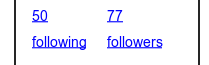

위 통계정보에는 현재 유저가 follow하고 있는 사람수와 현재 follower의 사람수가 표시되고 있습니다. 각각의 표시는 link로 되어져 있으며 전용 표시페이지로 이동할 수 있습니다. [5장](Chapter5.md) 에서는 이러한 link는 더미 텍스트 `'#'` 를 사용하여 무효한 상태로 해놓았었습니다. 그러나 라우팅에 대해서 어느정도 지식이 늘었기 때문에 이번에는 구현해봅시다. 실제의 페이지 생성은 14.2.3까지 하진 않습니다만 라우팅은 지금 구현해볼 것 입니다. 이 코드에서는 `resources` _블록_ 의 안쪽에서 `:member` 메소드를 사용하고 있습니다. 이것은 처음 등장하는 메소드입니다만, 일단은 어떠한 동작을 하는 지 추측해보세요.


```ruby
# User컨트롤러에 following액션과 followers액션을 추가합니다.
# config/routes.rb
Rails.application.routes.draw do
  root   'static_pages#home'
  get    '/help',    to: 'static_pages#help'
  get    '/about',   to: 'static_pages#about'
  get    '/contact', to: 'static_pages#contact'
  get    '/signup',  to: 'users#new'
  get    '/login',   to: 'sessions#new'
  post   '/login',   to: 'sessions#create'
  delete '/logout',  to: 'sessions#destroy'
  resources :users do #new
    member do
      get :following, :followers
    end
  end #new
  resources :account_activations, only: [:edit]
  resources :password_resets,     only: [:new, :create, :edit, :update]
  resources :microposts,          only: [:create, :destroy]
end
```

이 경우의 URL은 /user/1/following 이나 /users/1/followers 와 같이 되지 않을까하고 추측하고 계신분들도 있을것이라 생각합니다. 그리고 위 코드는 그야말로 그 추측대로 실행됩니다. 또한 어느쪽도 데이터를 _표시_ 하는 페이지이기 때문에, 적절한 HTTP 메소드는 GET 리퀘스트가 됩니다. 따라서 `get` 메소드를 사용하여 적절한 response를 리턴하도록 합니다. 여담으로, `member` 메소드를 사용하면 유저 id가 포함된 URL을 다룰 수 있도록 됩니다만, id를 지정하지 않고 모든 멤버를 표시하기 위해서는 다음과 같이 `collection ` 메소드를 사용합니다.

```
resources :users do
  collection do
    get :tigers
  end
end
```

이 코드에서는 /users/tigers 라고하는 URL에 반응합니다. (application에 있는 모든 tiger의 리스트를 표시합니다.)


`routes.rb` 의 새로운 코드에 의해 생성되는 라우팅 테이블은 아래와 같습니다. 아래 표에서 나타내는 follow용과 follower용의 named root를 이후에 구현할 때 써보도록 합시다.

| **HTTP Request** | **URL**            | **Action**  | **Named root**           |
| ---------------- | ------------------ | ----------- | ------------------------ |
| `GET`            | /users/1/following | `following` | `following_user_path(1)` |
| `GET`            | /users/1/followers | `followers` | `followers_user_path(1)` |

라우팅을 정의하였습니다. 통계정보의 partial을 구현할 준비가 되었습니다. 이 partial은 div태그 안에 2개의 링크를 포함하도록 합니다.

```erb
<!-- app/views/shared/_stats.html.erb -->
<% @user ||= current_user %>
<div class="stats">
  <a href="<%= following_user_path(@user) %>">
    <strong id="following" class="stat">
      <%= @user.following.count %>
    </strong>
    following
  </a>
  <a href="<%= followers_user_path(@user) %>">
    <strong id="followers" class="stat">
      <%= @user.followers.count %>
    </strong>
    followers
  </a>
</div>
```

이 partial은 프로필페이지와 home 페이지의 양 쪽 다 표시되기 때문에 코드의 제일 첫 줄에서 현재의 유저를 조회합니다.

```
<% @user ||= current_user %>
```

이것은 [컬럼8.1](Chapter8.md#칼럼81-||=-은-무엇인가)에서도 설명했듯, `@user` 가 `nil` 이 아닌 경우 (즉 프로필 페이지의 경우)에는 아무것도 하지 않고, `nil` 의 경우 (즉, home페이지의 경우)에는 `@user` 에 `current_user` 를 대입하는 코드입니다. 이 후 follow하고 있는 유저의 숫자를 다음과 같이 관계를 이용하여 계산합니다.

`@user.following.count`

이것은 follower에 대해서도 마찬가지입니다.

`@user.followers.count`

위 코드에서는, 13장에서 micropost의 게시글 수를 표시한 방법과 같습니다. 그때는 다음과 같이 작성하였습니다.

`@user.microposts.count`

또한 이번에도 이전과 마찬가지로 Rails는 고속화를 위해 데이터베이스 내부에서 합계를 계산하여 리턴합니다.

그럼 일부 요소에 대해 다음과 같이 CSS id를 지정하고 있는 것을 확인해주세요.

```html
<strong id="following" class="stat">
...
</strong>
```

이렇게 해놓는다면 [14.2.5](#1425-follow-버튼-ajax)에서 배울 Ajax를 구현할 때에 편리합니다. 거기서는 unique한 id를 지정하여 페이지 요소에 접근합니다.

이것으로 통계정보 partial이 완성되었습니다. Home페이지에 이 통계정보를 표시하기 위해서는 아래처럼 해주면 간단합니다.

```erb
<!-- app/views/static_pages/home.html.erb -->
<% if logged_in? %>
  <div class="row">
    <aside class="col-md-4">
      <section class="user_info">
        <%= render 'shared/user_info' %>
      </section> <!-- new -->
      <section class="stats">
        <%= render 'shared/stats' %>
      </section><!-- new -->
      <section class="micropost_form">
        <%= render 'shared/micropost_form' %>
      </section>
    </aside>
    <div class="col-md-8">
      <h3>Micropost Feed</h3>
      <%= render 'shared/feed' %>
    </div>
  </div>
<% else %>
  .
  .
  .
<% end %>
```

위 통계정보에 스타일을 부여하기 위해서는 아래와 같은 SCSS를 추가해봅시다. (또한, 이 SCSS에는 이번 챕터에서 사용하는 모든 스타일이 포함되어 있습니다.) 변경한 결과, Home페이지는 아래 캡쳐와 같이 됩니다.

```scss
/* app/assets/stylesheets/custom.scss */
.
.
.
/* sidebar */
.
.
.
.gravatar {
  float: left;
  margin-right: 10px;
}

.gravatar_edit {
  margin-top: 15px;
}

// new
.stats {
  overflow: auto;
  margin-top: 0;
  padding: 0;
  a {
    float: left;
    padding: 0 10px;
    border-left: 1px solid $gray-lighter;
    color: gray;
    &:first-child {
      padding-left: 0;
      border: 0;
    }
    &:hover {
      text-decoration: none;
      color: blue;
    }
  }
  strong {
    display: block;
  }
}
// new
.user_avatars {
  overflow: auto;
  margin-top: 10px;
  .gravatar {
    margin: 1px 1px;
  }
  a {
    padding: 0;
  }
}

.users.follow {
  padding: 0;
}

/* forms */
.
.
.
```

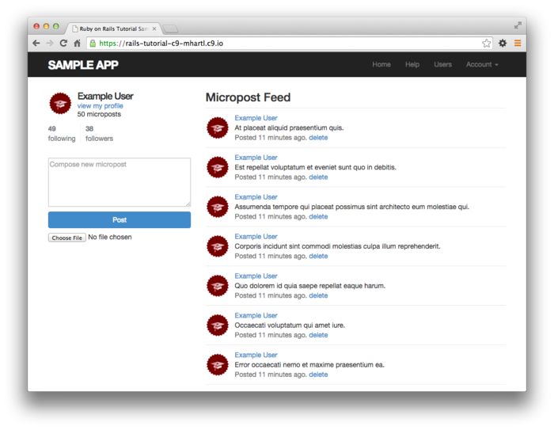

이 다음 바로 프로필 페이지에도 통계정보 partial을 출력해볼 것 입니다. 지금 당장 아래 코드와 같이 [Follow] / [Unfollow] 버튼용의 partial도 만들어 놓읍시다.

```erb
<!-- app/views/users/_follow_form.html.erb -->
<% unless current_user?(@user) %>
  <div id="follow_form">
  <% if current_user.following?(@user) %>
    <%= render 'unfollow' %>
  <% else %>
    <%= render 'follow' %>
  <% end %>
  </div>
<% end %>
```

이 코드는 `follow` 와 `unfollow` 의 partial 입니다. partial에서는 Relationship 리소스용의 새로운 라우팅이 필요합니다. 이전 13장에서의 Microposts 리소스를 참고하여서 작성해봅시다.

```ruby
# config/routes.rb
Rails.application.routes.draw do
  root                'static_pages#home'
  get    'help'    => 'static_pages#help'
  get    'about'   => 'static_pages#about'
  get    'contact' => 'static_pages#contact'
  get    'signup'  => 'users#new'
  get    'login'   => 'sessions#new'
  post   'login'   => 'sessions#create'
  delete 'logout'  => 'sessions#destroy'
  resources :users do
    member do
      get :following, :followers
    end
  end
  resources :account_activations, only: [:edit]
  resources :password_resets,     only: [:new, :create, :edit, :update]
  resources :microposts,          only: [:create, :destroy]
  resources :relationships,       only: [:create, :destroy] #new
end
```

Follow와 Unfollow용의 partial 자체는 아래 코드와 같습니다.

```erb
<!-- 유저를 follow하는 form
app/views/users/_follow.html.erb -->
<%= form_for(current_user.active_relationships.build) do |f| %>
  <div><%= hidden_field_tag :followed_id, @user.id %></div>
  <%= f.submit "Follow", class: "btn btn-primary" %>
<% end %>
```

```erb
<!-- 유저를 Unfollow하는 form
app/views/users/_unfollow.html.erb -->
<%= form_for(current_user.active_relationships.find_by(followed_id: @user.id),
             html: { method: :delete }) do |f| %>
  <%= f.submit "Unfollow", class: "btn" %>
<% end %>
```

이 두 개의 form에서는 양쪽 다 `form_for` 를 사용하여 Relationship 모델 오브젝트를 조작하고 있습니다. 이 2개의 form의 큰 차이점으로는, 위 첫 번째 코드에서는 _새로운_ Relationship을 생성하는 것에 반해, 위 두 번째 코드에서는 기존의 Relationship을 찾아내는 점입니다. 즉, 전자는 POST 리퀘스트를 Relationship 컨트롤러에 보내어 Relationship을 `create`(작성) 하고, 후자는 DELETE 리퀘스트를 송신하여 Relationship을 `destory` (삭제) 하는 점 입니다. (이 액션들은 [14.2.4](#1424-follow-버튼-기본편)에서 구현해봅니다.) 마지막으로는 이 follow / unfollow form에는 버튼밖에 없는 것을 이해하셨으리라 생각합니다. 그러나 그렇다고하여도 이 form은 `followed_id` 를 컨트롤러에 송신할 필요가 있습니다. 이것에 대응하기 위해 위 첫 번째 코드에서의  `hidden_field_tag` 메소드를 사용합니다. 이 메소드는 다음의 form html을 생성합니다.

```html
<input id="followed_id" name="followed_id" type="hidden" value="3" />
```

[12.3](Chapter12.md#123-패스워드를-재설정해보자)에서 확인했듯이, 숨겨진 field의 input태그를 사용하는 것으로, 브라우저 상에서는 표시하지않고 적절한 정보를 포함시킬 수 있습니다.

이 기술을 사용하여 follow용의 form을 partial로써 프로필 화면에 표시한 결과는 아래와 같습니다. 프로필 화면에 [Follow] 버튼와 [Unfollow] 버튼이 각각 표시되는 것을 확인해봅시다.

```erb
<!-- app/views/users/show.html.erb -->
<% provide(:title, @user.name) %>
<div class="row">
  <aside class="col-md-4">
    <section class="user_info">
      <h1>
        <%= gravatar_for @user %>
        <%= @user.name %>
      </h1>
    </section> <!-- new -->
    <section class="stats">
      <%= render 'shared/stats' %>
    </section> <!-- new -->
  </aside>
  <div class="col-md-8">
    <%= render 'follow_form' if logged_in? %> <!-- new -->
    <% if @user.microposts.any? %>
      <h3>Microposts (<%= @user.microposts.count %>)</h3>
      <ol class="microposts">
        <%= render @microposts %>
      </ol>
      <%= will_paginate @microposts %>
    <% end %>
  </div>
</div>
```

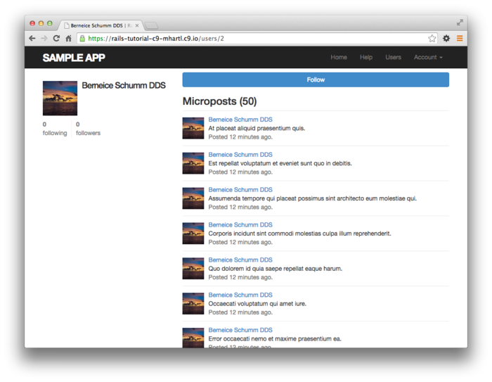

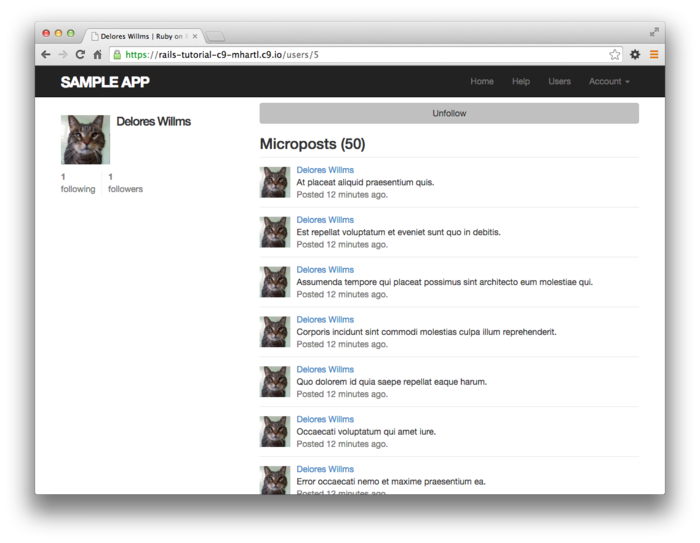

이 버튼은 바로 동작할 수 있도록 할 것 입니다. 사실은 이 버튼의 구현은 2가지 방법이 있습니다. 하나는 표준적인 방법 (14.2.4), 다른 하나는 Ajax를 이용한 방법(14.2.5) 입니다. 일단 그 전에 follow하고 있는 유저와 follower를 표시하는 페이지를 각각 작성하여 HTML Interface를 완성시켜봅시다.

##### 연습

1. 브라우저에서 /user/2에 접속하여, follow 버튼이 표시되고 있는 것을 확인해봅시다. 마찬가지로  /users/5 에서는 [Unfollow] 버튼이 표시되고 있을 것 입니다. 그럼 /users/1 에 접속해보면 어떠한 결과가 표시되나요?
2. 브라우저에서 home페이지와 프로필 페이지를 표시하여보고 통계정보가 올바르게 표시되는지를 확인해봅시다.
3. Home 페이지에 표시되는 통계정보에 대해 테스트를 작성해봅시다. *Hint* : 이전 13장에서 작성한 테스트 코드를 추가해보세요. 마찬가지로  프로필페이지에도 테스트를 추가해보세요.

```ruby
# test/integration/users_profile_test.rb
require 'test_helper'

class UsersProfileTest < ActionDispatch::IntegrationTest
  include ApplicationHelper

  def setup
    @user = users(:michael)
  end

  test "profile display" do
    get user_path(@user)
    assert_template 'users/show'
    assert_select 'title', full_title(@user.name)
    assert_select 'h1', text: @user.name
    assert_select 'h1>img.gravatar'
    assert_match @user.microposts.count.to_s, response.body
    assert_select 'div.pagination'
    @user.microposts.paginate(page: 1).each do |micropost|
      assert_match micropost.content, response.body
    end
    
    
    
  end
end
```

### 14.2.3 [Following] 과 [Unfollowing] 페이지

Follow하고 있는 유저를 푯하는 페이지와, Follwer를 표시하는 페이지는, 어느쪽이던 프로필 페이지와 유저 리스트 페이지 [10.3.1](Chapter10.md#1031-유저-리스트를-표시해보자) 를 합쳐놓은 것 같은 페이지라는 점에서, 해당 페이지들과 꽤나 닮아 있습니다. 어느쪽이던 follow의 통계정보 등의 유저 정보를 표시하는 사이드바와, 유저의 리스트가 있습니다. 게다가 사이드바에는 작은 유저 프로필 이미지의 링크를 추가할 예정입니다. 이 요구사항과 맞는 목업은 아래 그림과 같습니다. (Follow하고 있는 유저용, Follower 유저용)

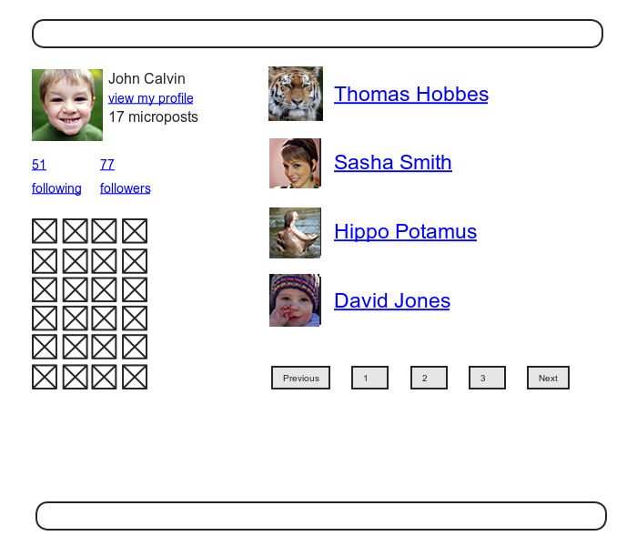

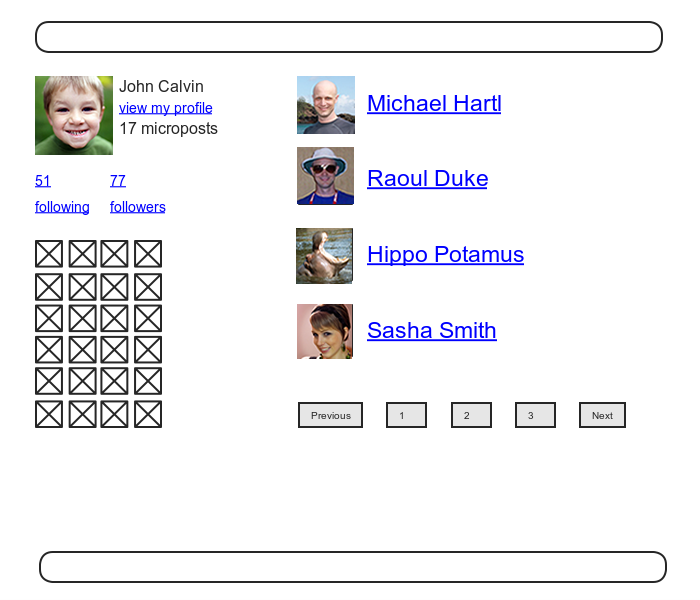

여기서의 제일 첫 작업으로는, Follow하고있는 유저의 링크와 Follower 의 링크를 동작하도록 하는 것 입니다. Twitter를 흉내내어 어느쪽의 페이지에서라도 유저의 로그인을 요구하게끔 합니다. 거기서 이전 액세스 제어와 마찬가지로 우선은 테스트 코드부터 작성해봅시다. 이번에 사용하는 테스트 코드는 아래와 같습니다. 또한 아래 코드에서는 이전에 표로 보여드린 named root를 사용하고 있는 것을 주의해주세요.

```ruby
# test/controllers/users_controller_test.rb
require 'test_helper'

class UsersControllerTest < ActionDispatch::IntegrationTest

  def setup
    @user = users(:michael)
    @other_user = users(:archer)
  end
  .
  .
  .
  test "should redirect following when not logged in" do
    get following_user_path(@user)
    assert_redirected_to login_url
  end

  test "should redirect followers when not logged in" do
    get followers_user_path(@user)
    assert_redirected_to login_url
  end
end
```

이 구현에는 하나의 Tricky한 부분이 있습니다. User 컨트롤러에 2개의 새로운 액션을 추가할 필요가 있는 것 입니다. 이것은 이전에 `routes.rb` 에서 정의한 2개의 새로운 라우팅에 기반한 것이며 이것들은 각각 `following` 및 `followers` 라고 부를 필요가 있습니다. 각각의 액션에서는 title를 정의하고 유저를 검색하여 `@user.following` 혹은 `@user.followers` 로부터 데이터를 꺼내어 pagination을 구현하여 페이지를 출력할 필요가 있습니다. 생성한 코드는 아래와 같습니다.

```ruby
# app/controllers/users_controller.rb
class UsersController < ApplicationController
  before_action :logged_in_user, only: [:index, :edit, :update, :destroy,
                                        :following, :followers]
  .
  .
  .
  def following
    @title = "Following"
    @user  = User.find(params[:id])
    @users = @user.following.paginate(page: params[:page])
    render 'show_follow'
  end

  def followers
    @title = "Followers"
    @user  = User.find(params[:id])
    @users = @user.followers.paginate(page: params[:page])
    render 'show_follow'
  end

  private
  .
  .
  .
end
```

본 튜토리얼에서 많은 부분에서 보셨겠지만 Rails는 관습에 따라 액션에 대응하는 view를 암묵적으로 호출합니다. 예를 들어 `show` 액션의 마지막에 `show.html.erb` 를 호출하는, 그러한 구현입니다. 한 편, 위 코드에서의 어떠한 액션도 `render` 를 명시적으로 호출하여 `show_follow` 라고하는 같은 view를 호출하고 있습니다. 따라서 생성이 필요한 view는 이 것 하나 뿐입니다. render에서 호출하고 있는 view가 같은 이유는, 이 ERB는 어느쪽의 경우도 거의 같으며 아래 코드에서 양쪽의 경우를 모두 대응하고 있기 때문입니다.

```erb
<!-- app/views/users/show_follow.html.erb -->
<!-- follow하고 있는 유저와 follower 유저 양쪽 다 표시하는 show_follow view file -->
<% provide(:title, @title) %>
<div class="row">
  <aside class="col-md-4">
    <section class="user_info">
      <%= gravatar_for @user %>
      <h1><%= @user.name %></h1>
      <span><%= link_to "view my profile", @user %></span>
      <span><b>Microposts:</b> <%= @user.microposts.count %></span>
    </section>
    <section class="stats">
      <%= render 'shared/stats' %>
      <% if @users.any? %>
        <div class="user_avatars">
          <% @users.each do |user| %>
            <%= link_to gravatar_for(user, size: 30), user %>
          <% end %>
        </div>
      <% end %>
    </section>
  </aside>
  <div class="col-md-8">
    <h3><%= @title %></h3>
    <% if @users.any? %>
      <ul class="users follow">
        <%= render @users %>
      </ul>
      <%= will_paginate %>
    <% end %>
  </div>
</div>
```

`users_controller.rb` 에서의 액션은 2개의 방법으로 위 view파일을 호출하고 있습니다. "following" 를 통하여 묘시한 view는 아래 첫 번째 캡쳐에, "followers" 를 통하여 묘사한 view는 아래 2번째 캡쳐입니다. 이 때 위 코드에서는 현재의 유저(currentUser)를 한 번도 사용하지 않는 점에 주목해주세요. 따라서 다른 유저의 follower 리스트 페이지도 제대로 동작합니다.

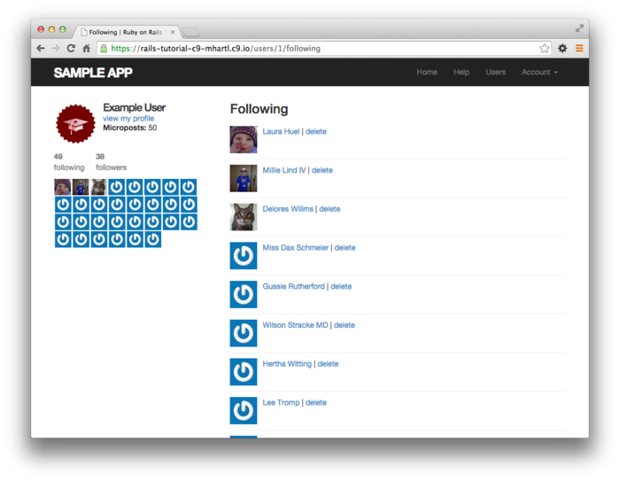


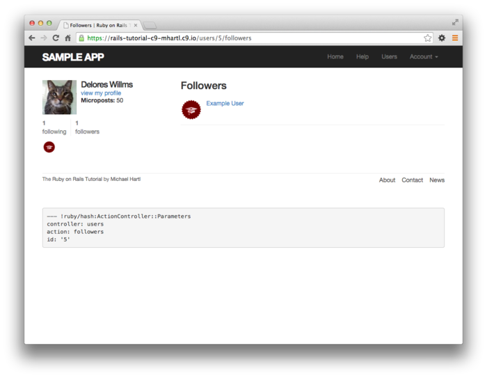

`user_controller.rb` 에서 이미 before필터를 구현했기 때문에, 지금 시점에서 테스트는 통과할 것 입니다.

`$ rails test`

다음으로 `show_follow` 의 묘사결과를 확인하기 위해 통합테스트를 작성해보겠습니다. 단, 이번의 통합테스트는 기본적으로 테스트를 하는 것에만 의의를 두고, 망라적인 테스트는 하고있지 않습니다. 이것은 [5.3.4](Chapter5.md#534-링크의-테스트) 에서도 언급했던 것 처럼, HTML구조를 망라적으로 체크하는 테스트는 제대로 동작하지 않을 가능성이 높으며, 생산성이 거꾸로 떨어질 수도 있기 때문입니다. 따라서 이번에는 올바른 숫자가 표시되는지와, 올바른 URL 이 표시되는지 2가지의 테스트만 작성해보겠습니다.

언제나 처럼 통합테스트를 생성해봅시다.

```
$ rails generate integration_test following
      invoke  test_unit
      create    test/integration/following_test.rb
```

이번에는 테스트 데이터를 몇가지 준비해봅시다. Relation용의 fixture에 데이터를 추가해봅시다. [13.2.3](Chapter13.md#1323-profile-화면이-micropost를-테스트해보자) 에서는 아래와 같이 작성하는 것으로

```
orange:
  content: "I just ate an orange!"
  created_at: <%= 10.minutes.ago %>
  user: michael
```

유저와 micropost를 관계를 맺게할 수 있었던 것을 떠올려주세요. 위 코드에서는 유저 이름을 다음과 같이 작성하였습니다만,

`user: michael`

이것은 내부에서는 아래와 같은 코드로 자동적으로 변환이 됩니다.

`user_id: 1`

이 예를 참고하여 Relationship용의 fixture의 테스트데이터를 추가하면 아래와 같이 됩니다.

```yml
# test/fixtures/relationships.yml
one:
  follower: michael
  followed: lana

two:
  follower: michael
  followed: malory

three:
  follower: lana
  followed: michael

four:
  follower: archer
  followed: michael
```

위 fixture에서는 앞서 2개의 데이터에서는 Michael이 Lana와 Malory를 follow하고 있고, 뒤 2개의 데이터에서는 Lana와 Archer가 Michael을 follow하고 있습니다. 이제는 올바른 갯수인지를 확인하기 위해 `assert_match` 메소드를 사용하여 프로필 화면의 micropost 수를 테스트합니다. 게다가 올바른 URL인지 아닌지를 테스트하는 코드를 추가하면 아래와 같이 됩니다.

```ruby
# test/integration/following_test.rb
require 'test_helper'

class FollowingTest < ActionDispatch::IntegrationTest

  def setup
    @user = users(:michael)
    log_in_as(@user)
  end

  test "following page" do
    get following_user_path(@user)
    assert_not @user.following.empty?
    assert_match @user.following.count.to_s, response.body
    @user.following.each do |user|
      assert_select "a[href=?]", user_path(user)
    end
  end

  test "followers page" do
    get followers_user_path(@user)
    assert_not @user.followers.empty?
    assert_match @user.followers.count.to_s, response.body
    @user.followers.each do |user|
      assert_select "a[href=?]", user_path(user)
    end
  end
end
```

또한, 위 코드에서는 아래와 같은 코드를 추가해있습니다.

```
assert_not @user.following.empty?
```

이 코드는 다음의 코드를 확인해보기 위한 코드로서,

```
@user.following.each do |user|
  assert_select "a[href=?]", user_path(user)
end
```

[무의미한 테스트](https://en.wikipedia.org/wiki/Vacuous_truth) 가 아니라는 점을 주의해주세요. (`followers` 에 대해서도 마찬가지입니다.) 즉, 만약 `@user.following.empty?` 의 결과가 true라면, `assert_select` 내부의 코드가 실행되지 않기 때문에, 그 경우에 있어서 테스트가 적절한 Security model을 확인할 수 없는 것을 방지하기 위함입니다.(존재여부를 확인하지 않고, 바로 링크를 확인하면 제대로 된 테스트라고 할 수 없기 때문.)

위 변경을 추가한 테스트는 통과할 것 입니다.

`$ rails test`

##### 연습

1. 브라우저에서 /users/1/followers 와 /users/1/following 으로 접속하여 각각 적절한 표시를 하는 지를 확인해봅시다. 사이드바에 있는 이미지는 링크로 제대로 기능하고 있습니까?
2. 위 코드에서 `assesrt_select` 에 관련한 코드를 코멘트아웃하고 테스트가 제대로 실패하는지 확ㅇ니해봅시다.

### 14.2.4 [Follow] 버튼 (기본편)

view가 어느정도 준비되었습니다. 드디어 [Follow] / [Unfollow] 버튼을 동작시켜봅시다. follow와 unfollow는 각각 Relationship의 생성과 삭제에 대응하고 있기 때문에 우선 Relationships 컨트롤러가 필요합니다. 늘 그랬듯, 컨트롤러를 생성해봅시다.

```
$ rails generate controller Relationships
```

추후 설명할 예정입니다만 Relationship 컨트롤러의 액션에서 액세스 제어를 하도록 하는 것은 어렵지는 않습니다. 그러나 이전에 액세스 제어때와의 마찬가지로 일단 테스트 코트를 작성하고, 그것을 통과할만한 구현을 하는 것으로 Security model의 확립을 한다고 할 수 있습니다. 이번에는 우선 컨트롤러의 액션에 액세스할 때, 로그인한 상태의 유저인지를 체크합니다. 만일 로그인해있지 않다면 로그인 페이지로 redirect하는 것으로 Relationship의 카운트가 변하지 않은 것을 확인해봅시다.

```ruby
# test/controllers/relationships_controller_test.rb
require 'test_helper'

class RelationshipsControllerTest < ActionDispatch::IntegrationTest

  test "create should require logged-in user" do
    assert_no_difference 'Relationship.count' do
      post relationships_path
    end
    assert_redirected_to login_url
  end

  test "destroy should require logged-in user" do
    assert_no_difference 'Relationship.count' do
      delete relationship_path(relationships(:one))
    end
    assert_redirected_to login_url
  end
end
```

다음으로, 위 테스트 코드를 통과시키기 위해 `logged_in_user` 필터를 Relationship 컨트롤러의 액션에 대해 추가해봅시다.

```ruby
# app/controllers/relationships_controller.rb
class RelationshipsController < ApplicationController
  before_action :logged_in_user

  def create
  end

  def destroy
  end
end
```

[Follow] / [Unfollow] 버튼을 동작시키기 위해서는 Form에서 송신되는 파라미터를 사용하여 `followed_id` 에 대응하는 유저를 찾을 필요가 있습니다. 그 후에 찾은 유저에 대하여 적절히 `follow` / `unfollow` 메소드를 사용합니다. 모든 구현결과는 아래와 같습니다.

```ruby
# app/controllers/relationships_controller.rb
class RelationshipsController < ApplicationController
  before_action :logged_in_user

  def create
    user = User.find(params[:followed_id])
    current_user.follow(user)
    redirect_to user
  end

  def destroy
    user = Relationship.find(params[:id]).followed
    current_user.unfollow(user)
    redirect_to user
  end
end
```

위 코드를 보면, 앞서 Security 문제가 사실은 그리 큰 문제는 아니란 것을 이해할 수 있을 것이라 생각합니다. 만일 로그인하고 있지 않은 유저가 (`curl` 등의 CommandLine tool등을 사용하여) 위 액션에 직접 액세스하려고 한다면, `current_user` 는 `nil` 이 되고, 어느 쪽의 메소드라도 2번째 행에서 Exception을 발생시킬 것 입니다. 에러이긴 하지만 Application이나 데이터에는 영향이 생기지 않습니다. 이대로도 큰 문제는 없습니다만, 역시 이러한 Exception에 기대지 않는 것이 좋기에 위에서는 조금 번거롭지만 Security의 확인을 위한 Layer를 추가해놓은 것 입니다.

이것으로 Follow / Unfollow의 기능이 완성되었습니다. 어느 유저라도 다른 유저를 Follow하거나, Unfollow할 수 있습니다. 브라우저 상에서 버튼을 클릭하여 확인해보세요. 동작을 검증하는 통합테스트는 14.2.6에서 구현해볼 것 입니다. 일단 2번째의 유저를 Follow하기 전의 상태는 아래 첫 번째 캡쳐, Follow한 결과는 아래 두 번째 캡쳐입니다.


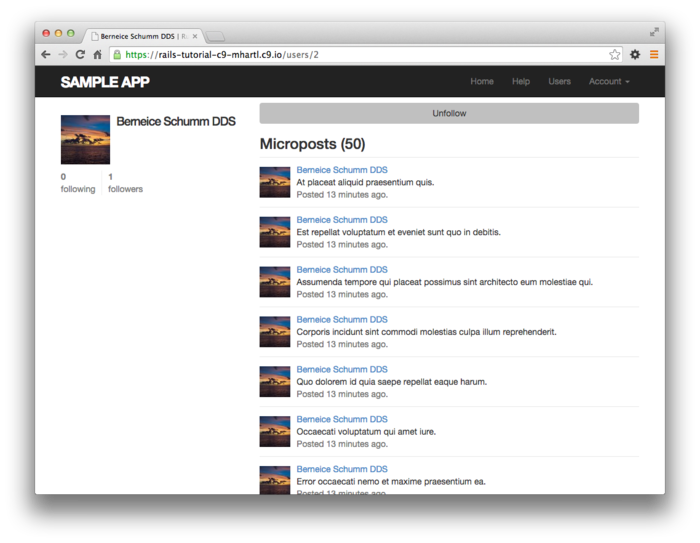

##### 연습

1. 브라우저 상에서 /users/2 를 열고, [Follow] 와 [Unfollow] 를 실행시켜보세요. 제대로 동작하나요?
2. 1번 문제를 끝냈다면, Rails Server log를 확인해봅시다. Follow / Unfollow 를 실행하였을 때, 각각 어떠한 Query가 동작하나요?

### 14.2.5 [Follow] 버튼 (Ajax)

Follow 관련의 기능의 구현은 위와 같이 완료하였습니다만, Status feed를 구현하기 전에 한 가지 더 기능을 구현해보고자합니다. [14.2.4](#1424-follow-버튼-기본편) 에서는 Relationships 컨트롤러의 `create` 액션과 `destory` 액션을 단순히 원래의 프로필 페이지로 redirect시키기만 했습니다. 즉 유저는 프로필 페이지를 제일 처음에 표시하고, 거기서부터 유저를 follow하고, 그 다음 바로 원래의 페이지로 되돌아가는 흐름입니다. 유저를 follow한 다음, 정말로 해당 페이지로부터 이동하여 원래 페이지로 돌아가지 않으면 안되는 것일까요? 이 점에 대해 다시 한 번 생각하고자 합니다.

이것은 _Ajax_ 라는 것을 사용하여 해결해봅니다. Ajax를 사용하면 Web페이지로부터 서버로 "비동기" 로, 페이지를 이동하지 않아도 Request를 송신할 수 있게 됩니다. Web form에 Ajax를 채용하는 것은 지금은 당연한 것이 되어가고 있기 때문에, Rails에서도 Ajax를 간단하게 구현할 수 있도록 되어있습니다. Follow용과 Unfollow용의 partial에 ajax를 적용해보는 것은 간단합니다. 다음과 같이 코드가 있다고 하면,

`form_for`

위 코드를 다음과 같이 작성해주면 됩니다.

`form_for ..., remote: true`

겨우 이것으로만으로도 Rails는 자동적으로 Ajax를 사용하게됩니다. 구체적인 수정결과는 아래 두 코드와 같습니다.

```erb
<!-- app/views/users/_follow.html.erb -->
<%= form_for(current_user.active_relationships.build, remote: true) do |f| %>
  <div><%= hidden_field_tag :followed_id, @user.id %></div>
  <%= f.submit "Follow", class: "btn btn-primary" %>
<% end %>
```

```erb
<!-- app/views/users/_unfollow.html.erb -->
<%= form_for(current_user.active_relationships.find_by(followed_id: @user.id),
             html: { method: :delete },
             remote: true) do |f| %>
  <%= f.submit "Unfollow", class: "btn" %>
<% end %>
```

ERB에 의해 실제로 생성되는 HTML은 그렇게 중요하진 않습니다만, 흥미가 있는 분들을 위해 다음과 같이 해당 핵심 부분을 보여드리겠습니다.

```html
<form action="/relationships/117" class="edit_relationship" data-remote="true"
      id="edit_relationship_117" method="post">
  .
  .
  .
</form>
```

여기서는 form태그의 내부에 `data-remote="true"` 를 설정하고 있습니다. 이것은 JavaScript에 의한 Form조작을 허가하는 것을 Rails에게 알려주기 위한 것 입니다. Rails 2 이전에는 완전한 JavaScript코드를 삽입할 필요가 있었습니다. 그러나 앞서 보신 예시와 같이, 현재의 Rails에서는 HTML property를 이용하여 간단하게 Ajax를 다룰 수 있게 되었습니다. 이것은 [JavaScript를 전면에 표시하지 않는다](http://railscasts.com/episodes/205-unobtrusive-javascript) 는 철학에도 맞닿아있습니다.

Form의 갱신이 끝났기 때문에, 이번에는 이것에 대응하는 Relationships 컨트롤러를 개조하여 Ajax Request에 응답할 수 있도록 해봅시다. 이러한 Request의 종류에 의해 응답을 나누는 경우에는  `respond_to` 메소드를 사용합니다.

```
respond_to do |format|
  format.html { redirect_to user }
  format.js
end
```

이 문법은 조금 특출나있어 혼란을 야기할 가능성이 있습니다만, 위 코드에서 _어떠한 1행이라도 실행된다_ 라는 점이 중요합니다. (이 때문에 `respond_to` 메소드는 위에서부터 순서대로 실행되는 순차처리라고 하기보단, if문을 사용한 분기처리에 가까운 이미지입니다.)

Relationships 컨트롤러에서 Ajax에 대응하기위해서는 `respond_to` 메소드를 `create` 액션과 `destroy` 액션에 각각 추가해봅시다. 변경 결과는 아래와 같습니다. 이 때, 유저의 로컬변수 (`user`) 를 인스턴스 변수 (`@user`) 로 변경하고 있는 점을 주목해주세요. 이전에는 인스턴스 변수가 필요없었습니다만 partial의 변경으로 인하여 인스턴스 변수가 필요하게 되었습니다.

```ruby
# app/controllers/relationships_controller.rb
class RelationshipsController < ApplicationController
  before_action :logged_in_user

  def create
    @user = User.find(params[:followed_id])
    current_user.follow(@user)
    respond_to do |format|
      format.html { redirect_to @user }
      format.js
    end
  end

  def destroy
    @user = Relationship.find(params[:id]).followed
    current_user.unfollow(@user)
    respond_to do |format|
      format.html { redirect_to @user }
      format.js
    end
  end
end
```

위 코드에서 Ajax Request에 대응할 수 있게 되었습니다. 이번에는 브라우저 측에서 JavaScript가 무효하게 되어있는 경우 (AjaxRequest를 송신할 수 없는 경우) 라도 제대로 동작하도록 해봅시다.

```ruby
# config/application.rb
require File.expand_path('../boot', __FILE__)
.
.
.
module SampleApp
  class Application < Rails::Application
    .
    .
    .
    # 인증 토큰을 remote form에 적용한다.
    config.action_view.embed_authenticity_token_in_remote_forms = true
  end
end
```

한 편, JavaScript가 유효하게 되어있어도, 아직 충분히 대응되어있지 않은 부분이 있습니다. Ajax Request를 수신한 경우에는 Rails가 자동적으로 액션과 같은 이름을 가진 JavaScript용의 Embed Ruby(`.js.erb`) 파일 (`create.js.erb`, `destroy.js.erb` 등) 을 호출하기 때문입니다. 상상하시는대로, 이러한 파일에는 JavaScript와 ERB를 믹스하여 현재의 페이지에 대한 액션을 실행할 수 있게 됩니다. 유저를 Follow했을때나 Unfollow했을 때의 프로필 페이지를 갱신하기 위해, 여러분들이 지금부터 작성 및 편집하지 않으면 안되는 파일들은, 이러한 파일들 입니다.

JS-ERB 파일의 내부에는 [DOM (Document Object Model)](http://www.w3.org/DOM/) 을 사용하여 페이지를 조작하기 때문에, Rails가 [jQuery](http://jquery.com/)  JavaScript Helper를 자동적으로 제공하고 있습니다. 이것으로 jQuery 라이브러리의 방대한 DOM조작용 메소드를 사용할 수 있게 됩니다만, [13.4.2](Chapter13.md#1342-image의-검증) 에서 본 것과 같이 이번에 사용하는 것은 겨우 2개뿐입니다. 하나씩 확인해봅시다. 우선 달러기호 ($) 와 CSS id를 사용하여 DOM 요소에 액세스하는 문법에 대해 알 필요가 있습니다. 예를 들어 `follow_form` 의 요소를 jQuery로 조작하여 다음과 같이 액세스합니다.

```javascript
$("#follow_form")
```

`app/views/users/_follow_form.html.erb` 에서는 이것이 Form을 감싸는 `div` 태그였으며, form 그 자체는 아니었다는 것을 확인해주세요. jQuery의 문법은 CSS의 기법으로부터 영향을 받았으며 `#` 심볼을 사용하여 CSS의 id를 지정하빈다. 상상하시는 대로 jQuery는 CSS와 마찬가지로 `.` 을 사용하여 CSS 클래스를 조작합니다.

다음으로 필요한 메소드는 `html` 입니다. 이것은 파라미터의 안에 지정된 요소의 내부 HTML을 수정할 수 있습니다. 예를 들어 follow용 form전체를 `"foobar"` 라고하는 문자열로 바꾸고 싶은 경우에는 다음과 같은 코드가 됩니다.

```
$("#follow_form").html("foobar")
```

순수한 JavaScript와는 다르게, JS-ERB 파일에서는 Embed Ruby를 사용할 수 있습니다. `create.js.erb` 파일에서는 follow용의 form을 `unfollow` partial에서 갱신하고, follow의 카운트를 갱신하는데에 ERB를 사용하고 있습니다. (물론 이것은 follow에 성공한 경우의 조작입니다.) 변경의 결과는 아래와 같습니다. 이 코드에서는 `escape_javascript` 메소드를 사용하고 있는 점을 주목해주세요. 이 메소드는, JavaScript 파일 내의 HTML을 삽입할 때의 실행결과를 escape하기 위해 필요합니다.

```js
// app/views/relationships/create.js.erb
$("#follow_form").html("<%= escape_javascript(render('users/unfollow')) %>");
$("#followers").html('<%= @user.followers.count %>');
```

각 행의 말미에 세미콜론이 있는 것을 주목해주세요. 이것은 프로그래밍언어에서 자주 보이는 문법으로, 1950년대부터 개발된 ALGOL까지 거슬러 올라갑니다.

`destroy.js.erb` 파일도 마찬가지로 구현해줍니다.

```js
// app/views/relationships/destroy.js.erb
$("#follow_form").html("<%= escape_javascript(render('users/follow')) %>");
$("#followers").html('<%= @user.followers.count %>');
```

이 것으로 프로필 페이지를 갱신하지 않아도 follow와 unfollow가 할 수 있게 되었습니다.

##### 연습

1. 브라우저로부터 /users/2에 접속하여 제대로 동작하는지 확인해봅시다.
2. 1번 문제의 확인이 끝났다면 Rails 서버에서 로그를 확인하고 follow / unfollow를 실행했을 직후의 템플릿이 어떻게 되어있는지 확인해봅시다.

### 14.2.6 Follow를 테스트해보자.

Follow 버튼이 동작하게끔 되었기 떄문에, 버그를 찾아내기 위한 간단한 테스트 코드를 작성해봅시다. 유저의 follow에 대한 테스트는 /relationships 에 대해 POST Request를 보내어 Follow돈 유저가 1명 늘어난 것을 체크해봅니다. 구체적인 코드는 다음과 같습니다.

```ruby
assert_difference '@user.following.count', 1 do
  post relationships_path, params: { followed_id: @other.id }
end
```

이 것은 표준적인 follow에 대한 테스트이긴 하지만, Ajax버전도 거의 비슷합니다. Ajax의 테스트는 `xhr :true` 옵션을 사용하는 것 뿐입니다.

```ruby
assert_difference '@user.following.count', 1 do
  post relationships_path, params: { followed_id: @other.id }, xhr: true
end
```

여기서 사용하고 있는 `xhr` (XmlHttpRequest) 라고하는 옵션을 `true` 로 설정하면, Ajax에서 Request를 발행하는 것으로 변합니다. 따라서 `app/controllers/relationships_controller.rb` 의 `respond_to` 에서는 JavaScript 에 대응한 코드가 실행되게 됩니다.

또한 유저를 Unfollow할 때에도 구조는 거의 비슷하고, `post` 메소드를 `delete` 메소드로 바꿔놓고 테스트합니다. 즉 해당 유저의 id와 Relationship의 id를 사용하여 DELETE Request를 송신하고, Follow하고 있는 수가 1개 줄어드는 것을 확인합니다. 따라서 실제로 더해지는 테스트는,

```ruby
assert_difference '@user.following.count', -1 do
  delete relationship_path(relationship)
end
```

위의 평범한 테스트와 아래 Ajax용의 테스트 2개가 있습니다.

```ruby
assert_difference '@user.following.count', -1 do
  delete relationship_path(relationship), xhr: true
end
```

위 테스트를 정리한 결과는 아래와 같습니다.

```ruby
# test/integration/following_test.rb
require 'test_helper'

class FollowingTest < ActionDispatch::IntegrationTest

  def setup
    @user  = users(:michael)
    @other = users(:archer)
    log_in_as(@user)
  end
  .
  .
  .
  test "should follow a user the standard way" do
    assert_difference '@user.following.count', 1 do
      post relationships_path, params: { followed_id: @other.id }
    end
  end

  test "should follow a user with Ajax" do
    assert_difference '@user.following.count', 1 do
      post relationships_path, xhr: true, params: { followed_id: @other.id }
    end
  end

  test "should unfollow a user the standard way" do
    @user.follow(@other)
    relationship = @user.active_relationships.find_by(followed_id: @other.id)
    assert_difference '@user.following.count', -1 do
      delete relationship_path(relationship)
    end
  end

  test "should unfollow a user with Ajax" do
    @user.follow(@other)
    relationship = @user.active_relationships.find_by(followed_id: @other.id)
    assert_difference '@user.following.count', -1 do
      delete relationship_path(relationship), xhr: true
    end
  end
end
```

테스트는 통과할 것 입니다.

`$ rails test`

##### 연습

1. `app/controllers/relationships_controller.rb` 의 `respond_to` 의 블록내의 각 행을 순서대로 코멘트아웃해가며 테스트가 제대로 에러를 출력해내는지 확인해봅시다. 실제로 어느 테스트케이스가 실패하나요?
2. `test/integration/following_test.rb` 코드의 `xhr: true` 가 있는 코드들 중, 한 쪽만 삭제하면 어떠한 결과가 되나요? 이 때 발생하는 문제의 원인과 어째서 앞서 연습문제에서 확인한 테스트에서 이 문제를 확인할 수 없었는지 생각해보세요.


## 14.3 Status Feed

드디어 Sample Application의 목표지점에 눈 앞에 있습니다! 마지막으로 어려운, Status feed의 구현을 해봅시다. 이번 섹션에서 다루는 내용은, 본 튜토리얼에서 제일 어려운 내용입니다. 완전한 status feed는 [13.3.3](Chapter13.md#1333-feed의-원형) 에서 다룬 프로토타입의 feed를 원형으로 하고 있습니다. 현재 유저에게 following 당하고 있는 유저의 micropost의 배열을 생성하고, 현재 유저 자신의 micropost와 포함시켜 표시해봅시다. 이 섹션을 통하여 난이도가 올라가는 Feed를 구현해봅니다. 이것을 구현하기 위해서는 Rails와 Ruby의 고도의 기능과 함게, SQL 프로그래밍의 기술도 필요합니다.

어려운 문제의 도전하는 것이므로, 여기서 구현해야하는 내용은 신중하게 확인해야할 필요가 있습니다. 이전에 보여드린 status feed의 최종형태는 아래와 같습니다.

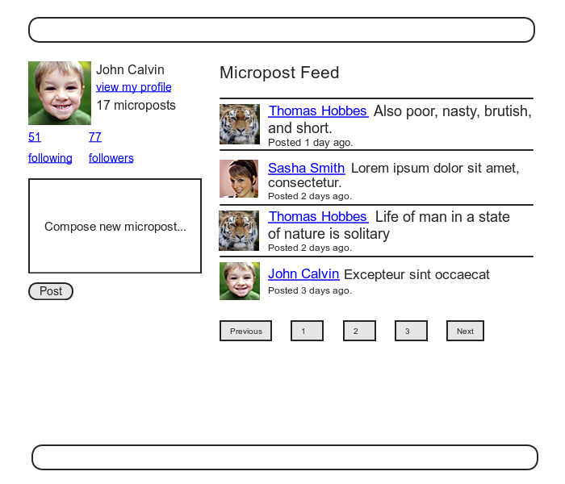

### 14.3.1 동기와 계획

status feed의 기본적인 아이디어는 간단합니다. 아래 그림에 `microposts` 의 샘플데이터가 있는 데이터 모델과 그 결과를 표시하고 있습니다. 그림의 화살표로 나타내고 있듯이 이 목적인 현재 유저가 follow하고 있는 유저에 대응하는, 유저id를 가진 micropost를 찾아내고 동시에 현재 유저 자신의 micropost도 같이 검색해냅니다.


어떻게 feed를 구현할지는 아직 명확하지는 않습니다만, 테스트에 대해서는 거의 명확한 것 같으니 ([컬럼3.3](Chapter3.md#컬럼33-결국-테스트는-언제-하는-것이-좋은가) 의 가이드라인에 따라) 우선 테스트 코드부터 작성해보도록 합시다. 이 테스트 코드에서 중요한 것은 feed에 필요한 3가지 조건을 만족하는 것입니다. 구체적으로는, 

1. follow하고 있는 유저의 micropost가 feed에 포함되어있을 것.
2. 자기 자신의 micropost도 feed에 포함되어 있을 것.
3. _follow하고 있지 않은_ 유저의 micropost가 feed에 포함되어 있지 않을 것.

이상의 3가지 입니다.

구체적으로는 `test/fixtures/relationships.yml` 에서 확인하였습니다만, 우선 Michael이 Lana를 follow하고 있고, Archer를 follow하고 있지 않은 상황을 만들어봅시다. 이 상황의 Michael의 feed에는 Lana와 자기 자신의 투고만이 보이고, Archer의 투고는 보이지 않아야 합니다.(`test/fixtures/microposts.yml` 과 `test/fixtures/relationships.yml` 의 fixture 파일이 참고가 될 것 입니다.) 앞서 3개의 조건을 Assertion으로 변환하여 User 모델에  `feed` 메소드가 있는 것을 주의해나가면서, 수정한 User모델에 대한 테스트 코드를 생성해봅시다. 결과는 아래와 같습니다.

```ruby
# test/models/user_test.rb
require 'test_helper'

class UserTest < ActiveSupport::TestCase
  .
  .
  .
  test "feed should have the right posts" do
    michael = users(:michael)
    archer  = users(:archer)
    lana    = users(:lana)
    # follow하고 있는 유저의 포스트를 확인
    lana.microposts.each do |post_following|
      assert michael.feed.include?(post_following)
    end
    # 자기 자신의 포스트를 확인 
    michael.microposts.each do |post_self|
      assert michael.feed.include?(post_self)
    end
    # follow하고 있지 않은 유저의 포스트를 확인
    archer.microposts.each do |post_unfollowed|
      assert_not michael.feed.include?(post_unfollowed)
    end
  end
end
```

물론, 아직 feed는 프로토타입이기 때문에 이 테스트는 통과하지 않을 것 입니다.

`$ rails test`

##### 연습

1. micropost id가 제대로 나열되어있다고 가정하고 (즉, 순서가 빠른 id 포스트일 경우 오래되었다는 전제)로, `user.feed.map(&id)` 을 실행하면 어떠한 결과가 표시되나요? 생각해보세요. _Hint_ : [13.1.4](Chapter13.md#1314-micropost를-개선해보자) 에서 구현한 `default_scope` 를 떠올려보세요.

### 14.3.2 Feed를 처음으로 구현해보자.

Status Feed에 대한 요건정의는 `test/models/user_test.rb` 에서 명확하게 되었기 때문에 (즉, 이 테스트를 통과하면 OK) 바로 Feed의 구현에 착수해봅시다. 최종적인 Feed의 구현이 조금 포함되어있기 때문에, 세세한 부품들을 하나하나 확인해가며 구현해나가겠습니다. 제일 첫 번째로는 이 Feed에서 필요한 Query에 대해 생각해봅시다. 여기서 필요한 것은 `micropost` 테이블로부터 어느 유저 (즉 자기 자신)이 Follow하고 있는 유저에 대한 id를 가진 micropost를 모두 _선택(Select)_ 하는 것입니다. 이 Query를 대강 작성해본다면 아래와 같이 됩니다.

```sql
SELECT * FROM microposts
WHERE user_id IN (<list of ids>) OR user_id = <user id>
```

위 코드를 작성할 때, SQL에 `IN` 이라고 하는 Keyword를 서포트하고 있다는 것을 전제로 합니다. (실제로 작성할 수 있으며, 대부분의 SQL데이터베이스에서 지원합니다.) 이 키워드를 사용하는 것으로 id의 집합의 내포 (_set inclusion_) 에 대해 테스트를 진행합니다.

[13.3.3](Chapter13.md#1333-feed의-원형) 의 프로토 feed에서는 위와 같은 선택을 하기 위해 Active Record의 `where` 메소드를 사용하고 있는 것을 떠올려주세요.(`app/models/user.rb` 의 `feed` 메소드) 이 때, 선택해야할 대상은 간단하게 현재 유저에 대응하는 유저 id를 가진 micropost를 선택하기만 하면 되었습니다.

`Micropost.where("user_id = ?", id)`

이번에 필요한 선택은, 위 보다는 조금더 복잡합니다. 예를들면 다음과 같은 형태가 됩니다.

`Micropost.where("user_id IN (?) OR user_id = ?". following_ids, id)`

이러한 조건으로부터, Following하고 있는 유저에 대응하는 id의 배열이 필요한 것을 알게 되었습니다. 이것을 실행하는 방법 중 한 가지로는 Ruby의  `map` 메소드를 실행하는 것 입니다. 이 메소드는 모든 "_열거 가능(enumerable)_" 한 오브젝트 (배열이나 해시등, 요소의 집합으로 구성된 모든 오브젝트) 에서 사용할 수 있습니다. 또한 이 메소드는 [4.3.2](Chapter4.md#432-블록) 에서도 나왔었습니다. 다른 예제로 `map` 메소드를 사용하여 배열을 문자열로 변환하면 다음과 같이 됩니다.

```ruby
$ rails console
>> [1, 2, 3, 4].map { |i| i.to_s }
=> ["1", "2", "3", "4"]
```

위 상황에서는 각 요소들에 대해 같은 메소드가 실행되고 있습니다. 이것은 매우 자주 사용되는 방법이며, 다음과 같이 앰퍼샌드 (`&`) 와 메소드에 대응하는 심볼을 사용한 단축표기 ([4.3.2](Chapter4.md#432-블록)) 를 사용할 수 있습니다. 이 단축표기가 있다면 변수 `i` 를 선언하지 않아도 됩니다.

```ruby
>> [1, 2, 3, 4].map(&:to_s)
=> ["1", "2", "3", "4"]
```

이 결과에 대해 `join` 메소드 ([4.3.1](Chapter4.md#431-배열과-범위연산자)) 를 사용하면, id의 집합을 컴마로 구분한 문자열로 이을 수 있습니다.

```ruby
>> [1, 2, 3, 4].map(&:to_s).join(', ')
=> "1, 2, 3, 4"
```

위 코드를 사용하면 `user.following` 에 있는 각 요소의 `id` 를 읽어들여, Follow하고 있는 유저의 id를 배열로 다룰 수 있습니다. 예를 들어 데이터베이스의 제일 첫 번째 유저에 대해 실행하면 다음과 같은 결과가 됩니다.

```ruby
>> User.first.following.map(&:id)
=> [3, 4, 5, 6, 7, 8, 9, 10, 11, 12, 13, 14, 15, 16, 17, 18, 19, 20, 21, 22,
23, 24, 25, 26, 27, 28, 29, 30, 31, 32, 33, 34, 35, 36, 37, 38, 39, 40, 41,
42, 43, 44, 45, 46, 47, 48, 49, 50, 51]
```

실제로 이 수법은 매우 편리하기 때문에, Active Record에서는 다음과 같은 메소드도 준비되어 있습니다.

```ruby
>> User.first.following_ids
=> [3, 4, 5, 6, 7, 8, 9, 10, 11, 12, 13, 14, 15, 16, 17, 18, 19, 20, 21, 22,
23, 24, 25, 26, 27, 28, 29, 30, 31, 32, 33, 34, 35, 36, 37, 38, 39, 40, 41,
42, 43, 44, 45, 46, 47, 48, 49, 50, 51]
```

이 `following_ids` 메소드는 `has_many :following` 를 선언했을 때 Active Record가 자동생성해준 것 입니다. 이것으로 인하여, `user.following` 컬렉션에 대응하는 id를 얻기 위해서는 관계명칭의 말미에 `_ids` 를 이어주는 것만으로도 끝납니다. 결과적으로 follow하고 있는 유저의 id의 문자열은 다음과 같이 얻을 수 있습니다.

```ruby
>> User.first.following_ids.join(', ')
=> "3, 4, 5, 6, 7, 8, 9, 10, 11, 12, 13, 14, 15, 16, 17, 18, 19, 20, 21, 22,
23, 24, 25, 26, 27, 28, 29, 30, 31, 32, 33, 34, 35, 36, 37, 38, 39, 40, 41,
42, 43, 44, 45, 46, 47, 48, 49, 50, 51"
```

또한 지금까지는 설명을 하기 위한 코드이며, 실제로 SQL문자열을 삽입할 때는 이렇게 기술할 필요는 없습니다. 실제로  `?` 를 안에 기술하면 자동적으로 이것에 관해 핸들링이 됩니다. 게다가 데이터베이스에 의존하는 일부 비호환성까지 해결해줍니다. 즉 여기서는 `following_ids` 메소드를 그대로 사용하면 되는 것 입니다. 결과적으로 제일 처음에 상상했던 대로

```ruby
Micropost.where("user_id IN (?) OR user_id = ?", following_ids, id)
```

의 코드가 무사히 동작하였습니다. 생성한 코드는 아래와 같습니다.

```ruby
# userapp/models/user.rb
class User < ApplicationRecord
  .
  .
  .
  # 패스워드 재설정의 기한이 끝나있다면 True를 리턴한다. 
  def password_reset_expired?
    reset_sent_at < 2.hours.ago
  end

  # 유저의 status feed를 리턴한다. 
  def feed
    Micropost.where("user_id IN (?) OR user_id = ?", following_ids, id)
  end

  # 유저를 follow 한다.
  def follow(other_user)
    following << other_user
  end
  .
  .
  .
end
```

이 것으로 테스트는 통과할 것 입니다.

`$ rails test`

몇몇 어플리케이션에 있어서는 이 초기 구만으로도 목적이 달성되었다고 충분히 생각할 수도 있습니다. 그러나 위 코드에는 아직 부족한 것들이 있습니다. 그것이 무엇인지 다음으로 진행하기 전에 생각해봅시다. (_Hint_ : follow하고 있는 유저가 5000명이나 된다면 어떻게 되나요?)

##### 연습

1. 위 코드에서 현재 유저 자신의 투고를 포함하지 않게하려면 어떻게 하면 좋을까요? 또한 그러한 변경사항을 추가한다면 테스트는 실패할까요?
2. 위 코드에서 Follow하고 있는 유저의 포스트를 포함하지 않게 하려면 어떻게 하면 좋을까요? 또한 그러한 변경사항을 추가한다면 테스트는 실패할까요?
3. 위 코드에서 Follow하고 있지 않은 유저의 포스트를 포함시키게 하기 위해선 어떻게하면 좋을까요? 그러한 변경사항을 추가한다면 테스트는 실패할까요? _Hint_ : 자기자신과 Follow하고 있는 유저, 그리고 그것 이외의 집합은 어떠한 집합으로 표현해야할지 생각해보세요.

### 14.3.3 Sub Select

앞서 Hint에서 알아채린 분들도 있을거라고 생각합니다만, [14.3.2](#1432-feed를-처음으로-구현해보자) 의 Feed의 구현은, 포스팅된 micropost의 수가 방대하게 된 경우, 제대로 핸들링되지 않습니다. 즉 follow하고 있는 유저가 5천명정도가 된다면, Web서비스 전체가 느려질 가능성이 있습니다. 이번 섹션에서는 Follow하고 있는 유저의 수에 따라 핸들링될 수 있도록 Status Feed를 개선해봅시다.

[14.3.2](#1432-feed를-처음으로-구현해보자) 에서 보여드린 코드의 문제점은, `following_ids` 에서 follow하고 있는 _모든_ 유저를 데이터베이스로부터 조회하고, 게다가 follow하고 있는 유저의 완전한 배열을 만들기 위해 다시 데이터베이스에 조회한다는 점 입니다. `user.rb` 의 `feed` 메소드의 조건에서는 집합에 포함되어져 있는지 없는지만 체크되고 있기 때문에, 이 부분에서 좀 더 효율적인 코드를 작성하지 않으면 안됩니다. 또한 SQL은 본래 이러한 집합의 조작에 최적화되어있습니다. 실제로 이러한 문제는 SQL의 Subselect를 사용하면 해결할 수 있습니다.

우선은 아래의 코드를 약간 수정하여 feed를 Refactoring을 하는 것 부터 시작해봅시다.

```ruby
# app/models/user.rb
class User < ApplicationRecord
  .
  .
  .
  # 유저의 status feed를 리턴한다.
  def feed
    Micropost.where("user_id IN (:following_ids) OR user_id = :user_id",
     following_ids: following_ids, user_id: id)
  end
  .
  .
  .
end
```

위 코드에서는 지금까지의 코드

```ruby
Micropost.where("user_id IN (?) OR user_id = ?", following_ids, id)
```

를 다음과 같이 바꾸었습니다.

```ruby
Micropost.where("user_id IN (:following_ids) OR user_id = :user_id",
    following_ids: following_ids, user_id: id)
```

전자의 물음표를 사용한 문법도 편리합니다만, 같은 변수를 여러 곳에 지정하고 싶을 경우에는 후자의 방법을 사용하는 것이 좀 더 편리합니다.

위 설명에서 암묵적으로 알 수 있듯, 지금부터 SQL Query에 한 가지 더 `user_id` 를 추가합니다. 특히 다음 Ruby 코드는

`following_ids`

아래와 같은 SQL로 바꿀 수 있습니다.

`following_ids = "SELECT followed_id FROM relationships WHERE follower_id = :user_id"`

이 코드를 SQL의 SubQuery로서 사용합니다. 즉 "유저 `1` 이 follow하고 있는 유저 전부를 선택한다." 라는 SQL을 기존의 SQL안에 포함시키는 형태가 되어, 결과적으로 SQL은 아래와 같은 형태가 됩니다.

```sql
SELECT * FROM microposts
WHERE user_id IN (SELECT followed_id FROM relationships
                  WHERE  follower_id = 1)
      OR user_id = 1
```

이 SubSelect는 집합의 로직을 (Rails가 아닌) 데이터베이스 내부에 저장하기 때문에 보다 더 효율적으로 데이터를 조회할 수 있습니다.

이것으로 기초를 다질 수 있었습니다. 아래 코드와 같이 좀 더 효율적인 Feed를 구현해볼 준비가 되었습니다. (여기서 기술되어진 코드는 SQL을 나타내는 문자열이며, `following_ids` 라고 하는 문자열은 Escape되어져있는 것이 아닌, 보기 쉽게 하기 위해 _식전개_ 되어져 있는 점을 유의해주세요.)

```ruby
# app/models/user.rb
class User < ApplicationRecord
  .
  .
  .
  # 유저의 Status feed를 리턴한다.
  def feed
    following_ids = "SELECT followed_id FROM relationships
                     WHERE follower_id = :user_id"
    Micropost.where("user_id IN (#{following_ids})
                     OR user_id = :user_id", user_id: id)
  end
  .
  .
  .
```

이 코드는 Rails와 Ruby와 SQL 코드가 복잡하게 섞여있는 조합이라 조금 조악해보일 수 있으나 제대로 동작합니다.

`$ rails test`

물론 SubSelect를 사용하면 얼마든지 핸들링할 수 있다는 것은 아닙니다. 대규모 Web 서비스에서는 Background 처리를 사용하여 feed를 비동기로 생성한다던지 등의 개선이 필요할 것 입니다. 그러나 Web서비스를 핸들링하는 기술은 매우 고도의 기술이며 섬세한 작업이기 때문에 본 튜토리얼에서는 여기까지만 개선작업을 진행해보겠습니다.

위 코드를 끝으로 Status feed의 구현은 완료하였습니다. [13.3.3](Chapter13.md#1333-feed의-원형) 에서 Home페이지에는 이미 Feed가 추가되어있던 것을 떠올려주세요. [13장](Chapter13.md) 에서는 그저 프로토타입이었습니다만 위 코드의 구현으로 인하여 Home 페이지에서 완전한 Feed를 표시할 수 있는 것을 알게 되었습니다.

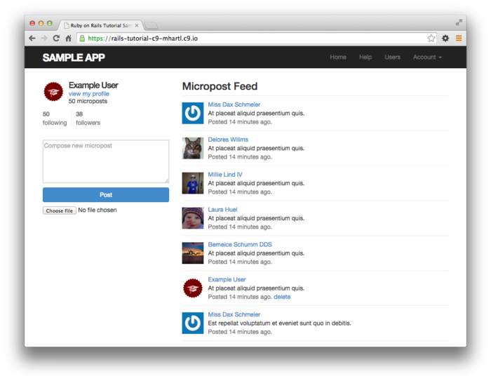

이 시점에서 master 브랜치로의 변경사항을 merge하여 봅시다.

```
$ rails test
$ git add -A
$ git commit -m "Add user following"
$ git checkout master
$ git merge following-users
```

코드를 Repository로 push하여 실제 배포환경에 deploy해봅시다.

```
$ git push
$ git push heroku
$ heroku pg:reset DATABASE
$ heroku run rails db:migrate
$ heroku run rails db:seed
```

실제 배포환경에서 동작하는 status feed는 아래와 같습니다.

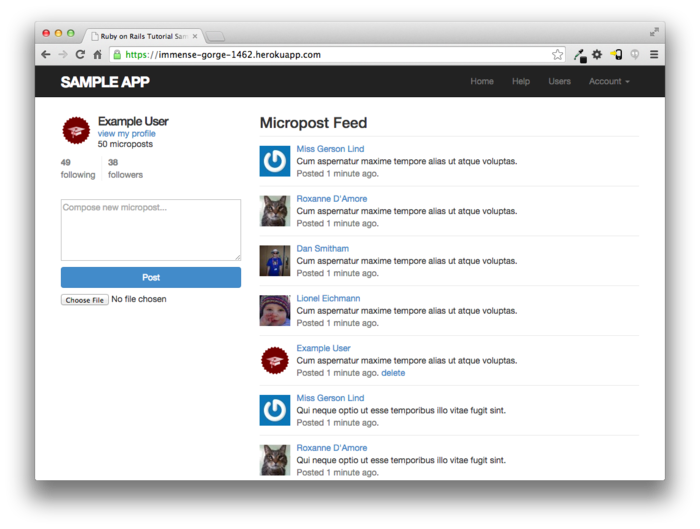

##### 연습

1. Home페이지에 표시되는 1페이지째의 Feed에 대하여 통합테스트를 작성하여봅시다. 아래 코드는 Template입니다.
2. 아래 코드에서는 기대되어지는 HTML를 `CGI.escapeHTML` 메소드를 사용하여 escape하고 있습니다. (이 메소드는 [11.2.3](Chapter11.md#1123-발신-메일의-테스트) 에서 사용한 `CGI.escape` 와 같은 용도입니다.) 이 코드에서는 어째서 HTML을 Escape할 필요가 있을까요? 생각해봅시다. _Hint_ : 시험삼아 Escape처리를 적용하지않고 얻을 수 있는 HTML의 내용을 주의깊게 확인해주세요. micropost의 내용이 어딘가 이상할 것 입니다. 또한 터미널의 검색기능을 사용하여 "sorry" 를 검색하면 원인규명에 도움이 될 것 입니다.

```ruby
test/integration/following_test.rb
require 'test_helper'

class FollowingTest < ActionDispatch::IntegrationTest

  def setup
    @user = users(:michael)
    log_in_as(@user)
  end
  .
  .
  .
  test "feed on Home page" do
    get root_path
    @user.feed.paginate(page: 1).each do |micropost|
      assert_match CGI.escapeHTML(FILL_IN), FILL_IN
    end
  end
end
```


## 14.4 마지막으로

Status Feed가 추가되어 _Ruby on Rails Tutorial_ 의 Sample application이 드디어 완성되었습니다. 이 Sample application에서는 Rails의 주요기능 (Model, View, Controller, Template, Partial, Before filter, Validation, Callback, `has_many` / `belongs_to` / `has_many` / `has_many through` 관계맺기, Security, Status Feed, Deploy) 등 다수 포함되어있습니다.

이 것만으로도 상당한 양입니다만, Web 개발에 대해 배워야할 것들은 아직 매우 많습니다. 이후 학습의 시발점이 되기 위하여 이번 섹션에서는 좀 더 심화적인 학습방법을 소개하겠습니다.

### 14.4.1 읽을거리

읽으면 좋은 Rails 관련 서적이나 Document는 서점이나 Web에서 얼마든지 찾아볼 수 있습니다. 솔직히 너무나도 많아 입이 다물어지지 않을 정도입니다. 본 튜토리얼을 완주한 여러분들께는 대부분의 서적을 읽을 수 있을 것 입니다. 본 튜토리얼 한 번 더 진행하는 경우를 포함하여, 보다 더 심도있는 학습방법(혹은 학습 사이트)에 대해 몇가지 소개하겠습니다.

원문 : https://www.learnenough.com/ruby-on-rails-4th-edition-tutorial/following_users#sec-following_conclusion

- [The Learn Enough Society](https://www.learnenough.com/story)
- [Launch School](http://launchschool.com/railstutorial)
- [Turing School of Software & Design](http://turing.io/)
- [Bloc](http://bloc.io/)
- [Firehose Project](http://www.thefirehoseproject.com/?tid=HARTL-RAILS-TUT-EB2&pid=HARTL-RAILS-TUT-EB2)
- [Thinkful](http://www.thinkful.com/a/railstutorial)
- [Pragmatic Studio](https://pragmaticstudio.com/refs/railstutorial)


### 14.4.2 14장의 마무리

- `has_many :through` 를 사용하면 복잡한 데이터관계를 모델링할 수 있다.
- `has_many` 메소드에는 클래스이름이나 Foreign key등 몇가지 Option을 전달할 수 있다.
- 적절한 클래스이름과 FK를 같이 `has_many` / `has_many :through` 를 사용하는 것으로 능동적관계 (Following) 나 수동적 관계 (being Followed) 의 모델링을 할 수 있다.
- routing은 nest하여 사용할 수 있다.
- `where` 메소드를 사용하면 유연하게 강력한 Database로의 조회가 가능하다.
- Rails는 (필요에 따라) low level의 SQL Query를 호출할 수 있다.
- 본 튜토리얼에서 배운 모든것을 구사하는 것으로 Follow하고 있는 유저의 Micropost 리스트를 Status Feed에 표시할 수 있다.


