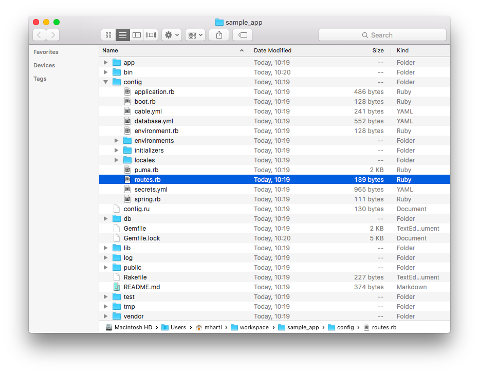
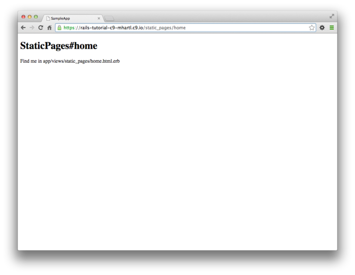
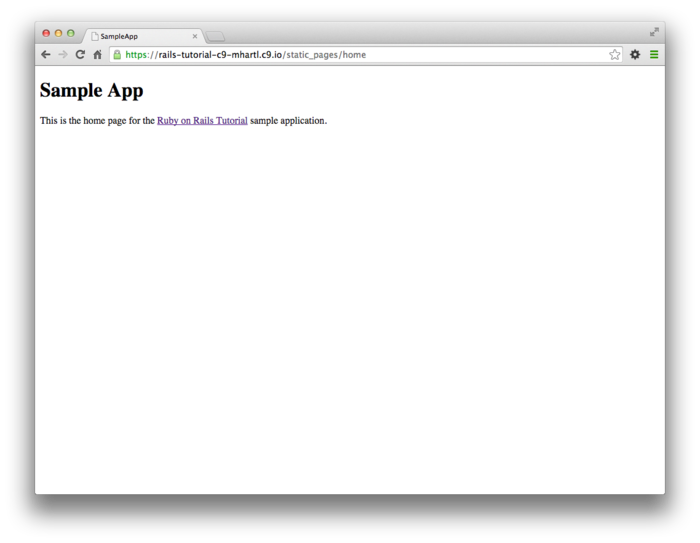
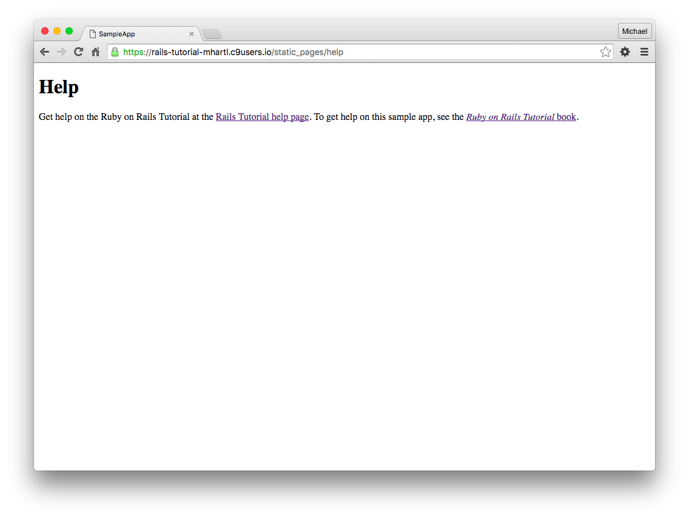
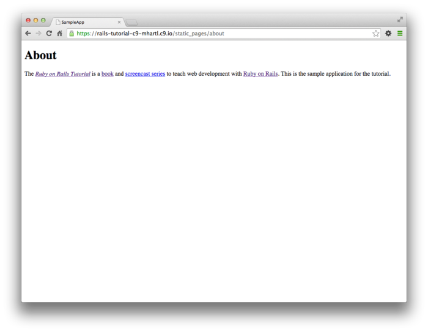
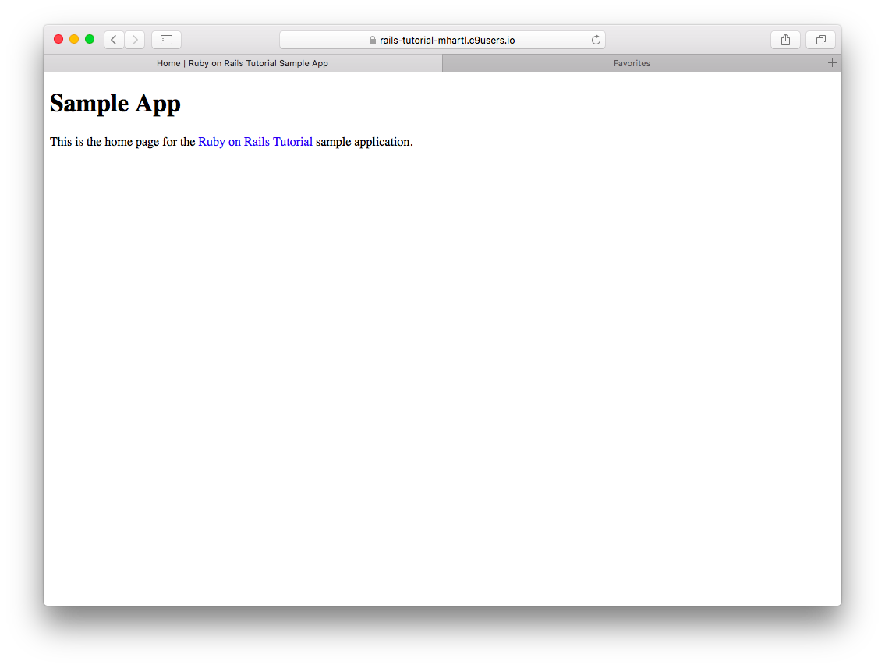
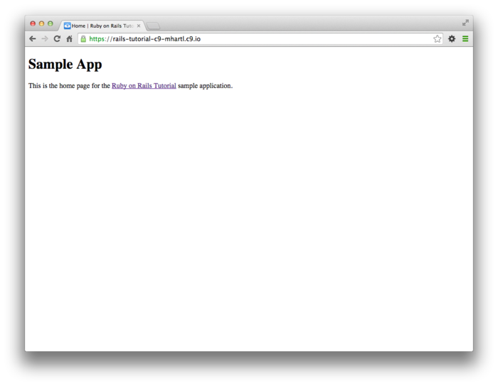
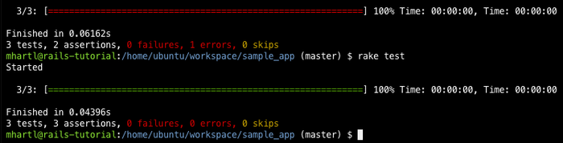
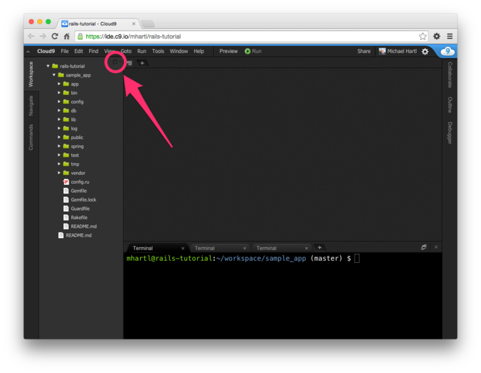
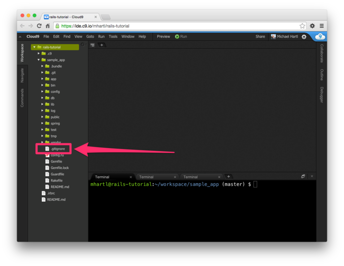

# 제 3장 정적인(Static) 페이지의 작성

이번 장 부터는, 본격적인 *Sample* 어플리케이션의 개발을 진행해보겠습니다. 남은 튜토리얼에서는 *Sample* 어플리케이션을 예로 들어 학습을 진행할 것 입니다. 본 튜토리얼을 통해 개발하는 어플리케이션은 최종적으로 유저나 마이크로포스트, 로그인/로그아웃등의 인증 기능을 구현합니다만, 일단은 간단한 주제인 「정적인 페이지 작성」 부터 시작해보겠습니다. 매우 단순한 페이지이긴 하지만, 정적인 페이지를 자신이 직접 만들어 보는 것은 좋은 경험이기도 하면서, 여러가지 많은 팁도 얻을 수 있습니다. 지금부터 개발할 어플리케이션에서는 매우 좋은 스타팅포인트이기도 합니다.


Rails는 데이터베이스와 연계하여 동적인 Web사이트를 개발할 수 있게 설계되어있습니다만, HTML 파일만으로 구성되어 있는 정적인 페이지도 만들 수 있습니다. 실제로 Rails에서 일부러 정적인 페이지를 사용하게하고 백엔드에서 매우 간단한 동적 컨텐츠를 추가하는 것도 가능합니다. 이번 장에서는 이러한 정적인 페이지에 대해 배워볼 것 입니다. 또한 최근의 프로그래밍에서는 빼놓을 수 없는 *자동화 테스트* 에 대해서도 알아볼 것입니다. 자동화 테스트를 준비하는 것으로 코드가 제대로 동작하고 있다는 것을 보장할 수 있습니다. 게다가 좋은 테스트 코드를 작성하는 것은 좀 더 자신감을 가지고 코드의 리팩토링을 가능하게 해줍니다. 예를 들어 Form의 동작을 변경하지 않고, Form 내부에서 쓰이는 메소드를 바꾸거나 할 때 유용합니다.


## 3.1 프로젝트 생성

[제 2장](Chapter2.md) 과 마찬가지로, 새로운 Rails프로젝트를 작성하는 것 부터 시작합니다. 이번에는 *sample_app* 이라는 이름으로 만들어 봅시다.

```
$ cd ~/environment
$ rails _5.1.6_ new sample_app
$ cd sample_app/
```

(2.1에서도 설명드렸다시피, 클라우드IDE를 사용하는 학습자들은 이 프로젝트를 지금까지 두 개의 챕터에서 작성한 프로젝트와 같은 워크스페이스에 작성할 수 있습니다. 이 프로젝트를 위해 특별히 새로운 워크스페이스를 작성할 필요는 없습니다.)

다음으로 2.1과 같이, 텍스트에디터를 이용하여 `Gemfile` 에 필요한 gem을 작성해봅니다. 아래 리스트는 이전 장들에서 본 리스트들과 기본적으로는 같지만, `test`그룹 내부의 gem이 조금 다릅니다. 테스트용 옵션을 설정해놓은 것이지만, 좀 어려운 수준이기 때문에 자세한 설명은 3.6에서 설명하겠습니다. 지금은 그다지 신경쓰지 않아도 됩니다. 

```ruby
source 'https://rubygems.org'

gem 'rails',        '5.1.6'
gem 'puma',         '3.9.1'
gem 'sass-rails',   '5.0.6'
gem 'uglifier',     '3.2.0'
gem 'coffee-rails', '4.2.2'
gem 'jquery-rails', '4.3.1'
gem 'turbolinks',   '5.0.1'
gem 'jbuilder',     '2.7.0'

group :development, :test do
  gem 'sqlite3', '1.3.13'
  gem 'byebug',  '9.0.6', platform: :mri
end

group :development do
  gem 'web-console',           '3.5.1'
  gem 'listen',                '3.1.5'
  gem 'spring',                '2.0.2'
  gem 'spring-watcher-listen', '2.0.1'
end

group :test do
  gem 'rails-controller-testing', '1.0.2'
  gem 'minitest',                 '5.10.3'
  gem 'minitest-reporters',       '1.1.14'
  gem 'guard',                    '2.13.0'
  gem 'guard-minitest',           '2.4.4'
end

group :production do
  gem 'pg', '0.20.0'
end

# Windows環境ではtzinfo-dataというgemを含める必要があります
gem 'tzinfo-data', platforms: [:mingw, :mswin, :x64_mingw, :jruby]
```

앞서 2개의 챕터와 마찬가지로 `bundle install` 을 실행하여 `Gemfile` 에서 지정한 gem을 인스톨합니다. 단 `--without production` 옵션을 사용하여 production 환경에서만 쓰이는 gem은 설치하지 않도록 해줍니다.

`bundle install --without production`

위 옵션을 지정하여 설치를 진행하게 된다면 PostgreSQL용 pg gem을 development환경에 설치하는 대신에, SQLite가 development 환경과 test 환경에서 쓰일 수 있게 됩니다. Heroku에서는 development환경과 production환경에서 다른 데이터베이스를 사용하기 때문에, 데이터베이스를 다르게 쓰는 것은 그다지 추천드리진 않습니다. 불행중 다행으로 이 *Sample* 어플리케이션에서는 두 개의 데이터베이스간의 차이는 나타나지 않습니다. 또한 SQLite이PostgreSQL보다 로컬에서의 설치나 설정이 매우 편하기 때문에 이번에는 개발환경과 실제 배포환경에서의 데이터베이스를 각각 다른 것을 사용해보도록 해보겠습니다. 만약 `Gemfile` 에서 지정한 버전과 다른 버전의 gem을 설치한 경우에는, `bundle update` 를 실행하여 gem을 업데이트해주세요.

`bundle update`

여기까지 잘 따라오셨다면, Git레포지토리를 초기화해봅시다.

```
$ git init
$ git add -A
$ git commit -m "Initialize repository"
```

제일 첫 어플리케이션과 마찬가지로, 일단 어플리케이션의 루트 디렉토리에 있는 `README.md` 파일을 수정해서, 구체적인 작업내용을 알기 쉽게 작성하는 것을 추천합니다. 예를 들면, 다음과 같이 README에는 이 어플리케이션을 사용하는 방법을 작성해봅시다. (제 6장까지는 `rails db:migrate` 를 실행할 필요는 없지만, 언젠가는 실행할 필요가 있기 떄문에, 지금 작성하기로 합니다.)

```
# Ruby on Rails Tutorial Sample Application

이 프로젝트는, 아래의 링크의 내용을 바탕으로 만들어진 프로젝트입니다.
[*Ruby on Rails チュートリアル*](https://railstutorial.jp/)
[Michael Hartl](http://www.michaelhartl.com/) 著

## 라이센스

[Ruby on Rails チュートリアル](https://railstutorial.jp/)에 기재되어 있는
소스코드는 MIT라이센스와 Beerware라이센스를 기반으로 공개되어있습니다.
상세한 내용은 [LICENSE.md](LICENSE.md)를 참고해주세요. 

## 사용방법

이 어플리케이션을 구동시키는 방법은, 일단 레포지토리를 로컬로 clone해주세요.
그 다음, 아래의 커맨드를 사용하여 필요한 RubyGem을 설치해주세요.
​```
$ bundle install --without production
​```
그 다음, 데이터베이스를 마이그레이션해주세요.

​```
$ rails db:migrate
​```
마지막으로, 테스트를 실행하여 제대로 동작하는지 확인해주세요.

​```
$ rails test
​```
테스트가 무사히 종료되었다면, Rails서버를 실행시켜주세요.

​```
$ rails server
​```
자세한 것은 [Ruby on Rails Tutorial](https://www.railstutorial.org/)을 참고해주세요.

```

작성이 끝났으면, 커밋을 진행해주세요.

`$ git commit -am "Improve the README"`

1.4.4에서 `git commit -a -m "Message"` Git 커맨드를 실행했을 때를 떠올려주세요. 그 때에는 "모든 변경(`-a`)" 옵션과 커밋메세지를 추가하는 옵션(`-m`) 를 사용하였습니다. 위에서 실행한 커맨드에서 알 수 있듯이 두개의 옵션은 하나의 옵션으로 묶어서 `git commit -am "Message"`로 실행할 수 있습니다. 


본 튜로리얼에서는 앞으로도 *Sample* 어플리케이션을 사용하여 진행하기 때문에, [Bitbuck상의 레포지토리를 만들고 Push해봅시다]([https://id.atlassian.com/login?continue=https%3A%2F%2Fid.atlassian.com%2Fopenid%2Fv2%2Fop%3Fopenid.return_to%3Dhttps%3A%2F%2Fbitbucket.org%2Fsocialauth%2Fcomplete%2Fatlassianid%2F%3Fjanrain_nonce%253D2019-08-02T15%25253A24%25253A08ZopAHnd%26openid.sreg.optional%3Dfullname%2Cnickname%2Cemail%26openid.ns%3Dhttp%3A%2F%2Fspecs.openid.net%2Fauth%2F2.0%26openid.ns.sreg%3Dhttp%3A%2F%2Fopenid.net%2Fextensions%2Fsreg%2F1.1%26openid.crowdid.application%3Dbitbucket%26openid.assoc_handle%3D21506185%26openid.ns.crowdid%3Dhttps%3A%2F%2Fdeveloper.atlassian.com%2Fdisplay%2FCROWDDEV%2FCrowdID%252BOpenID%252Bextensions%2523CrowdIDOpenIDextensions-login-page-parameters%26openid.identity%3Dhttp%3A%2F%2Fspecs.openid.net%2Fauth%2F2.0%2Fidentifier_select%26openid.realm%3Dhttps%3A%2F%2Fbitbucket.org%26openid.claimed_id%3Dhttp%3A%2F%2Fspecs.openid.net%2Fauth%2F2.0%2Fidentifier_select%26openid.mode%3Dcheckid_setup&prompt=&application=bitbucket&tenant=&email=&errorCode=](https://id.atlassian.com/login?continue=https%3A%2F%2Fid.atlassian.com%2Fopenid%2Fv2%2Fop%3Fopenid.return_to%3Dhttps%3A%2F%2Fbitbucket.org%2Fsocialauth%2Fcomplete%2Fatlassianid%2F%3Fjanrain_nonce%3D2019-08-02T15%253A24%253A08ZopAHnd%26openid.sreg.optional%3Dfullname%2Cnickname%2Cemail%26openid.ns%3Dhttp%3A%2F%2Fspecs.openid.net%2Fauth%2F2.0%26openid.ns.sreg%3Dhttp%3A%2F%2Fopenid.net%2Fextensions%2Fsreg%2F1.1%26openid.crowdid.application%3Dbitbucket%26openid.assoc_handle%3D21506185%26openid.ns.crowdid%3Dhttps%3A%2F%2Fdeveloper.atlassian.com%2Fdisplay%2FCROWDDEV%2FCrowdID%2BOpenID%2Bextensions%23CrowdIDOpenIDextensions-login-page-parameters%26openid.identity%3Dhttp%3A%2F%2Fspecs.openid.net%2Fauth%2F2.0%2Fidentifier_select%26openid.realm%3Dhttps%3A%2F%2Fbitbucket.org%26openid.claimed_id%3Dhttp%3A%2F%2Fspecs.openid.net%2Fauth%2F2.0%2Fidentifier_select%26openid.mode%3Dcheckid_setup&prompt=&application=bitbucket&tenant=&email=&errorCode=)). 

```
$ git remote add origin git@bitbucket.org:ユーザー名/sample_app.git
$ git push -u origin --all     # リポジトリやその参照先もすべてプッシュする
```


나중에 production환경에 푸시할 때에도 금방 끝낼 수 있도록, 어플리케이션을 되도록 빠른 단계에서 Heroku에 배포하는게 좋을 것 같습니다. [1장](Chapter1.md) 이나 [2장](Chapter2.md) 과 마찬가지로, 아래의 리스트에 있는 "Hello world" 의 순서대로 진행해봅시다.


(Rails의 디폴트 페이지는 Heroku에서 제대로 표시되지 않습니다. 때문에 다음과 같이 변경해주지 않으면 디플로이가 제대로 되었는지 안되었는지 알 수 없습니다.)

```ruby
#app/controllers/application_controller.rb

class ApplicationController < ActionController::Base
  protect_from_forgery with: :exception

  def hello
    render html: "hello, world!"
  end
end
```

```ruby
#config/routes.rb

Rails.application.routes.draw do
  root 'application#hello'
end

```


위 작업이 끝났으면, 커밋해봅시다.

```
$ git commit -am "Add hello"
$ git push
$ heroku create
$ git push heroku master
```

[1.5](Chapter1.md#15-배포해보자)  과 마찬가지로, 경고메세지가 표시될 수도 있습니다만, 무시해도 괜찮습니다. 이 경고는 7.5에서 해결할 예정입니다. 이것으로 Heroku 어플리케이션의 URL이외에는, 아래의 이미지처럼 되어 있을 것입니다.


 


이 이후로도 본 튜토리얼을 진행해가면서 어플리케이션을 틈틈히 푸시/디플로이하는 것을 추천합니다. 이렇게 하는 것으로 리모트 백업을 할 수 있으며, production환경에서의 에러를 빠르게 확인할 수도 있습니다. 또한 Heroku에 디플로이할때 에러가 발생한다면, 다음 커맨드를 실행하여 실제 배포환경에서의 로그를 확인해주세요. 로그는 문제를 해결할 때 매우 큰 도움이 됩니다.

`heroku logs`

※ *이후 Heroku에서 어떠한 실제 어플리케이션을 운용할 것이라면, 7.5에서의 production용 Web서버의 설정을 할 필요가 있습니다.*


##### 연습

1. Bitbucket이 Markdown기법의 README 파일을 HTML로써 제대로 읽어드리고 있는지 확인해보세요.
2. 실제 배포환경(Heroku)의 루트 URL에 접속하여 디플로이가 제대로 성공했는지 확인해보세요.


## 3.2 정적인 페이지

[3.1](#31-프로젝트-생성) 의 준비가 모두 끝났으면, 드디어 *Sample* 어플리케이션을 개발해봅시다. 이번 섹션에서는 일단 Rails의 액션이나 뷰를 이용하여 정적인 HTML만 있는 페이지를 만들어보고, 그 후 정적인 페이지를 동적인 페이지로 바꾸어보겠습니다. Rails의 액션은 컨트롤러(1.3.3에서 설명한 MVC의 "C") 에서 선언합니다. 또한 컨트롤러 내부의 각 액션은 목적에 따라 서로 관련된 처리(작성이나 삭제 등)를 가지고 있습니다. 컨트롤러에 대해서는 [제 2장](Chapter2.md) 에서도 간단히 말씀드렸습니다만, [제 6장](Chapter6.md) 에서 설명할 [REST 아키텍쳐](https://ja.wikipedia.org/wiki/Representational_State_Transfer) 를 확인하신다면, 이해가 좀 더 빠르실 겁니다. 한마디로 컨트롤러라는 것은 (기본적으로 동적인) Web페이지의 집합을 다루는 컨테이너와 같은 것입니다. 현재 어떠한 디렉토리에서 작업을 진행하고 있는지 모를 때에는 [1.3](Chapter1.md#1.3-첫-어플리케이션) 를 다시 한 번 확인하여 Rails의 디렉토리 구조에 대해 확인해주세요. 이번 섹션에서는 주로 `app/controller` 디렉토리나 `app/views` 디렉토리 내에서 작업을 진행하겠습니다.


[1.4.4](Chapter1.md#144-Branch,-Edit,-Commit,-Merge) 에서 배운 것을 떠올려보도록 해봅시다. Git을 사용할 때에는 master브랜치에서 계속 작업하는 것이 아닌, 작업 당시의 토픽 브랜치를 작성하여 작업하는 것이 좋습니다. Git에서 버전관리를 하고 있다면 다음 커맨드를 이용하여 정적인 페이지용의 토픽브랜치를 체크아웃해봅시다.

`git checkout -b static-pages`


### 3.2.1 Static Page를 생성해보자

정적인 페이지를 생성하는 것은 [제 2장](Chapter2.md) 에서 Scaffold를 생성할 때 사용한 `generate` 스크립트를 이용하여 컨트롤러를 생성하는 것부터 시작해보겠습니다. 이 컨트롤러는 정적인 페이지만 다루는 컨트롤러이기 때문에, 컨트롤러의 이름을 *Static Pages* 로 정하고 표기를 [카멜 케이스](https://en.wikipedia.org/wiki/CamelCase) 를 사용한 `StaticPages` 로 입력해봅시다. 이어서 Home페이지, Help페이지, About페이지에 사용할 액션도 각각 생성해주도록 합시다. 액션의 이름은 모두 소문자의 `home`, `help`, `about` 으로 해봅시다. `generate` 스크립트에서는 액션이름을 한꺼번에 지정할 수 있습니다. 커맨드라인에서 Home페이지와 Help페이지용의 액션을 한 번에 만들어봅시다. 또한 About페이지는 학습을 위해 커맨드라인을 사용하지 않고, 3.3에서 수동으로 만들어보도록 합시다. 위 액션들이 포함된 StaticPages컨트롤러 생성 커맨드와 실행결과는 아래와 같습니다.

```
$ rails generate controller StaticPages home help
      create  app/controllers/static_pages_controller.rb
       route  get 'static_pages/help'
       route  get 'static_pages/home'
      invoke  erb
      create    app/views/static_pages
      create    app/views/static_pages/home.html.erb
      create    app/views/static_pages/help.html.erb
      invoke  test_unit
      create    test/controllers/static_pages_controller_test.rb
      invoke  helper
      create    app/helpers/static_pages_helper.rb
      invoke    test_unit
      invoke  assets
      invoke    coffee
      create      app/assets/javascripts/static_pages.coffee
      invoke    scss
      create      app/assets/stylesheets/static_pages.scss

```


※ `rails g` 는 `rails generate` 의 커맨드의 축약형이며, Rails에 지원하는 다수의 단축형 중 하나입니다. 본 튜토리얼에서는 알기 쉽게 설명하고 있기 때문에, 커맨드는 단축형으로 기술하지는 않고 있습니다. 실제 Rails개발자는 대부분 단축형을 사용하고 있습니다.

| 완전한 커맨드  | 단축형  |
| -------------- | ------- |
| rails server   | rails s |
| rails console  | rails c |
| rails generate | rails g |
| rails test     | rails t |
| bundle install | bundle  |

다음으로 진행하기 앞서, `static-page` 토픽 브랜치를 Bitbucket에 푸시해봅시다. 이후는 단순하게 다음의 커맨드를 실행하기만해도 같은 푸시 작업이 이루어집니다.

`git push`

위의 커밋~푸시의 작업흐름은 저자가 실제 개발할 때의 작업흐름(워크 플로우)입니다만, 지금부터는 도중에 이러한 지시는 하나하나 설명하지 않겠습니다. 각자 틈틈히 푸시를 해주세요.


`rails generate controller StaticPages home help`  의 실행결과는 컨트롤러이름을 [카멜케이스](https://ja.wikipedia.org/wiki/キャメルケース) (단어의 앞문자를 대문자로하여 이어나가는 형태) 로 입력하고 있는 것에 주목해주세요. 이렇게 하면 StaticPages 컨트롤러이름이 [스네이크 케이스](https://en.wikipedia.org/wiki/Snake_case)(단어와 단어를 언더바로 이어나가는 형태) 를 사용한 파일명 `static_pages_controller.rb` 가 자동적으로 생성됩니다. 단, 위와 같은 명명방법은 단순한 관습에 불과합니다. 실제로 커맨드라인에서 다음과 같은 스네이크 케이스의 컨트롤러이름을 입력하여도

`rails generate controller static_pages ...`

아까와 같은 `static_pages_controller.rb` 와 같은 컨트롤러가 생성됩니다. 이것은 Ruby가 클래스명을 카멜케이스로 생성하기 때문이기도 하고, (상세한 것은 4.4에서 설명합니다.) 카멜케이스의 이름을 사용하는 것을 권장하기도 때문입니다. 이러한 것은 반드시 따라야한다는 것은 아닙니다. (어차피 Ruby에서는 파일명을 스네이크케이스로 기술하기 때문입니다. Rails의 generate 스크립트에서는 <u>underscore</u> 메소드를 사용하여 카멜케이스를 스네이크 케이스로 변환합니다. )


만일 자동생성에 실패한다면, 원래대로 되돌리는 처리를 배우는 좋은 기회이기도 합니다. 컬럼3.1에서는 원래대로 돌리는 방법을 소개하겠습니다. 만약 기회가된다면 한 번 해보세요.


###### 컬럼 3.1 원래대로 돌리는 방법

> 어느정도 알고있다고해도, Rails 어플리케이션 개발중에는  어떤것이든 실패하는 경우는 있다. 매우 감사하게도 Rails에는 이러한 실패를 커버할 수 있는 기능이 몇가지가 있습니다.

>

> 첫 번째 시나리오는, 생성한 코드를 원래대로 돌리는 경우입니다. 예를들면 컨트롤러를 생성한 다음에, 좀 더 좋은 컨트롤러 이름이 떠올라서 생성한 코드를 삭제하고 싶을 때 등입니다. `genenrate` 커맨드를 사용하면 Rails는 컨트롤러 이외에도 관련 파일을 대량 생성하기 때문에 생성된 컨트롤러 파일만을 삭제하는 것으로는 원래대로 되돌릴 수 없습니다. 자동생성된 코드를 원래대로 되돌리기 위해서는 신규작성된 파일을 삭제하는 것 뿐만아니라, 기존의 파일들에 삽입된 코드들도 삭제할 필요가 있습니다. (실제로 [2.2](Chapter2.md#2.2 Users 리소스) 나 [2.3](Chapter2.md#2.3 Microposts 리소스) 에서도 설명했듯, `rails generate`를 실행하면 라우팅의 routes.rb 파일도 자동적으로 갱신되어집니다. 이것도 되돌릴 필요가 있습니다.) 이럴 때에는 generate 커맨드 대신에 rails destroy 라는 커맨드를 실행하는 것으로 원래대로 되돌릴 수 있습니다. 예를 들어 다음 2개의 커맨드는 자동생성과 그것에 대응하는 삭제하는 처리의 예입니다.

> ```
>  $ rails generate controller StaticPages home help
>  $ rails destroy  controller StaticPages home help
> ```
>
> 또한 제6장에서도 다음과 같은 모델을 자동생성하는 방법을 소개합니다.
>
> `  $ rails generate model User name:string email:string`
>
> 모델의 자동생성에 대해서도, 같은 방법으로 원래대로 되돌릴 수 있습니다.
>
> ` $ rails destroy model User`
>
> (위 커맨드에서도 알 수 있듯, 모델이름 이외의 파라미터는 필요없습니다. 그 이유에 대해서는 [제6장](Chapter6.md)에서 설명합니다.)

> 또한 [제 2장](Chapter2.md) 에서도 간단하게 소개해드렸습니다만, 마이그레이션의 변경을 원래대로 되돌릴 수도 있습니다. 자세하게는 [제 6장](Chapter6.md) 에서 설명드리겠습니다만, 간단하게 말씀드리자면 일단 `db:migrate` 로 데이터베이스의 마이그레이션을 변경합니다.
>
> ` $ rails db:migrate`
>
> 원래대로 되돌리고 싶을 때는  `db:rollback` 으로 한 단계 전의 상태로 되돌립니다.
>
> `  $ rails db:rollback` 
>
> 맨 처음 상태로 되돌리고 싶을 때에는 `VERSION=0` 옵션을 사용할 수도 있습니다.
>
> `  $ rails db:migrate VERSION=0`
>
> 이미 알고계신 분들도 있을 수 있습니다만, 마이그레이션은 순차적으로 실행되어, 각각의 마이그레이션에 대해 번호가 생성됩니다. 따라서 위의 `0` 의 숫자를 다른 숫자로 바꾼다면 지정한 버전의 상태로 되돌릴 수도 있습니다.

> 개발중에는 제대로 개발이 되지 않을 때에는 이러한 기능을 사용한다면 원래의 상태로 복구할 수도 있습니다.


StaticPages컨트롤러를 생성하면 (`config/routes.rb` ) 파일이 자동적으로 업데이트됩니다. ([1.3.4](Chapter1.md#134-Hello-world-!) 과 마찬가지입니다.) 이 라우팅파일은 URL과 Web페이지의 대응관계를 정의하고 있습니다. 이 라우팅파일은 Rails의 `config` 디렉토리 아래에 있습니다. 이 디렉토리에는 Rails의 설정파일이 모여있습니다.





앞서 `home` 액션과 `help` 액션을 생성하였기 때문에, routes파일에는 각각의 액션에서 쓰이는 룰이 정의되어져 있을 것입니다.

```ruby
Rails.application.routes.draw do
  get  'static_pages/home'
  get  'static_pages/help'
  root 'application#hello'
end

```

여기서 다음 코드에 주목해봅시다.

`get 'static_pages/home'`

위 코드는 /static_pages/home 이라고 하는 URL에 대응하는 리퀘스트를, StaticPages 컨트롤러의 `home` 액션과 연결짓습니다. 코드에는 `get` 이라고 쓰여져 있기 때문에, GET리퀘스트를 받았을 때, 발동하는 액션을 연결합니다. 또한 여기서 GET리퀘스트란, *HTTP (HyperText Transfer Protocol)* 에서 지원하는 메소드 중 하나입니다. ([컬럼3.2](#컬럼-32-GET이나-그-외-다른-HTTP-메소드에-대해))


StaticPages컨트롤러 내부에 `home` 액션을 추가했기 때문에, /static_pages/home 에 접근하는 것으로 페이지에 접근(GET) 할 수 있게 됩니다. 결과를 확인하기 위해서는 [1.3.2](Chapter1.md#132-rails-server) 의 순서에 따라 다음과 같이 Rails의 development 서버를 동작시킵니다.

`rails server`

Rails 서버가 작동하기 시작하면, /static_pages/home 에 접속하여 결과를 확인해보도록 합시다.





######  컬럼 3.2 GET이나 그 외 다른 HTTP 메소드에 대해

> [HTTP](http://ja.wikipedia.org/wiki/Hypertext_Transfer_Protocol%23.E3.83.A1.E3.82.BD.E3.83.83.E3.83.89#Request_methods) (HyperTExt Transfer Protocol) 에는 4가지의 기본적인 구동방식이 있으며 각각 GET, POST, PATCH, DELETE 라고 하는 4가지 동사로 접근할 수 있습니다. *Client* (예를 들면 Firefox, Safari, Chrome 등의 Web브라우저) 와 *Server* (Apache, Nginx, NodeJS 등의 Web서버) 는 위에서 말한 4가지의 기본 구동방식에 대해 서로 인식할 수 있게끔 되어있습니다. ( 로컬환경에서 Rails 어플리케이션을 개발할 때에는 클라이언트와 서버가 같은 컴퓨터 상에서 작동하고 있지만, 일반적으로는 각각의 별개의 컴퓨터에서 작동하는 점을 알아두어야합니다. ) Rails를 포함한 많은 Web프레임워크에서는 HTTP의 각 각의 구동방식을 발전시킨 *REST 아키텍쳐* 로부터 영향을 받았습니다. [제 2장](Chapter2.md) 에서도 간단히 말씀드렸지만,  [제 7장]() 에서는 보다 심도있는 내용에 대해 배우게됩니다.

>

> GET은 제일 빈번하게 사용되는 HTTP리퀘스트로써, 주로 Web상의 데이터 읽어들일때 (Get)할 때 사용됩니다. "페이지를 획득하다(get a page)" 라고 하는 의미대로, 브라우저는 http://www.google.com 이나 http://www.wikipedia.org 등의 Web사이트를 열 때마다 Get리퀘스트를 사이트에 보냅니다. POST는 GET의 다음으로 많이 사용되는 리퀘스트로써 페이지 상의 폼을 입력할 때의 값을 브라우저로부터 송신할 때 사용됩니다. 예를 들어 Rails 어플리케이션에서는 POST리퀘스트는 무엇인가를 *만들 때* 자주 사용됩니다. (또한 원래의 HTTP에서는 POST를 어떠한 값을 업데이트할때도 써도 된다고 하고 있습니다.) 예를 들면, 회원가입 폼에서 새로운 유저를 등록할 때에는, POST 리퀘스트를 보냅니다. 이 외에도 PATCH나 DELETE라고 하는 2가지 구동방식이 있으며 각각 서버 상에서의 무엇인가를 업데이트하거나, 삭제할 때에 사용됩니다. 이 두가지 방식은 GET이나 POST만큼은 쓰이지는 않습니다. 브라우저가 PATCH나 DELETE를 제대로 송신하지 않기 때문입니다. 그러나 Ruby on Rails 등의 많은 Web프레임워크 에서는 브라우저가 이러한 리퀘스트를 보내고 있는 것 처럼 착각하게 하는 기술을 사용하여, PATCH나 DELETE라고 하는 방식을 실현시키고 있습니다. 결과적으로 Rails에서는 4개의 HTTP 리퀘스트 (GET, POST, PATCH, DELETE)를 모두 지원하고 있습니다.


위 페이지가 어떠한 방식으로 출력되고 있는지 이해하기 위해서는 일단 텍스트에디터로 StaticPages컨트롤러를 열어 확인해야합니다. 아래와 같은 내용으로 되어져 있을 것입니다. 여기서 [제 2장](Chapter2.md) 의 Users 컨트롤러나 Microposts 컨트롤러와는 달리, StaticPages 컨트롤러는 일반적인 REST액션에 대응하지 않고 있는 것에 대해 주의해주세요. 이것은 정적 페이지들에 대해서는 적절한 액션이라고 할 수는 있습니다. 바꿔 말하면, REST아키텍쳐는 어떠한 문제에 대해 최적의 해결 방법이라고는 할 수 없다는 것입니다.

```ruby
# app/controllers/static_pages_controller.rb

class StaticPagesController < ApplicationController
  def home
  end

  def help
  end
end
```

위의 코드에서 `class` 라고 하는 키워드로부터 `static_pages_controller.rb` 는 `StaticPagesController` 라고 하는 클래스를 정의하고 있다는 것을 알 수 있습니다. 이러한 클래스는 *메소드* (*함수* 라고 불리기도 합니다.) 를 한 번에 모아 정의할 때 편리합니다. 이번 예에서는 `def` 라고 하는 키워드를 이용하여 `home`, `help` 액션을 정의하고 있습니다. [2.3.4](Chapter2.md#234-상속의-계층) 에서 설명드렸다시피, `<` 은 `StaticPagesController` 가 `ApplicationController` 라고 하는 Rails의 클래스를 상속받고 있는 것을 의미합니다. 이 후에도 설명하겠습니다만, 이번에 만든 페이지에는 Rails 특유의 기능을 많이 사용하고 있습니다. (클래스나 계승에 대해서는 4.4에서 자세히 설명하겠습니다.)


StaticPages컨트롤러에 있는 메소드는, 다음과 같이 어느쪽도 처음에는 내용이 없는 상태입니다.

```ruby
def home
end

def help
end
```

순수한 Ruby언어라면, 이러한 메소드는 어떤 것도 실행하지 않습니다. 그러나 Rails에서는 조금 다릅니다. `StaticPagesController`는 Ruby의 클래스입니다만, `ApplicationController` 클래스를 상속받고 있기 때문에, StaticPagesController의 메소드는 (설령 아무것도 적혀져 있지 않더라도) Rails 특유의 동작을 구현합니다. 구체적으로는 /static_pages/home 이라고 하는 URL에 접속해보면 Rails는 StaticPages컨트롤러를 참조하여 `home` 액션에 작성되어져있는 코드를 실행합니다. 그 후, 액션에 대응하는 뷰([1.3.3](133-Model---View---Controller-(MVC)) 에서 설명한 MVC의 V) 를 출력합니다. 이번 예시의 경우에는 `home` 액션에 아무것도 쓰여져있지 않기 때문에, /static_pages/home에 접속해도 단순한 뷰가 출력됩니다. 그렇다면, 뷰는 어떻게 출력되는 것일까요? 또한 어떠한 뷰가 출력되는 것일까요?


controller를 generate할때의 로그를 다시 한 번 주의깊게 확인해보자면, 액션과 뷰의 관계에 대해 추측해볼 수 있습니다. `home` 액션은 `home.html.erb` 라고 하는 뷰파일과 대응합니다. `.erb` 에 대해서는 [3.4](#34-조금은-Dynamic한-페이지) 에서 설명합니다만, 파일이름에 `.html` 가 포함되어있는 것으로부터 알 수 있듯, 기본적으로는 HTML과 같은 구조로 되어있습니다.

```ruby
# app/views/static_pages/home.html.erb

<h1>StaticPages#home</h1>
<p>Find me in app/views/static_pages/home.html.erb</p>
```

`help` 액션에 대응하는 뷰도, 위 코드와 비슷합니다.

```ruby
# app/views/static_pages/help.html.erb

<h1>StaticPages#help</h1>
<p>Find me in app/views/static_pages/help.html.erb</p>
```

양쪽 뷰도 단순한 placeholder로 되어있습니다. 제일 상단의 제목이 `h1` 태그의 안에 있으며 관련 파일에 절대 경로가 `p` 태그 안에 쓰여져 있습니다.


##### 연습

1. `Foo` 라고 하는 컨트롤러를 생성하고, 그 안에 `baz`, `bar` 액션을 추가해보세요.
2. [컬럼3.1](#컬럼3.1-원래대로-돌리는-방법) 소개해드린 기술을 사용하여 `Foo` 컨트롤러와 그것에 관련한 액션을 삭제해보세요.


### 3.2.2 Static Page를 편집해보자

[3.4](#34-조금은-Dynamic한-페지) 부터는 (아주 조금) 동적인 컨텐츠를 추가해보겠습니다. 그러나 위의 내용들에서 보셨다시피, 중요한 것은 "Rails 의 뷰 안에는 정적인 HTML이 있다" 라는 점입니다.  이 것은 Rails의 지식이 없어도 Home페지나 Help페이지를 수정할 수 있다는 의미이기도 합니다. 다음 코드가 그 예입니다.

```html
<!-- app/views/static_pages/home.html.erb -->
<h1>Sample App</h1>
<p>
  This is the home page for the
  <a href="https://railstutorial.jp/">Ruby on Rails Tutorial</a>
  sample application.
</p>
```

```html
<!-- app/views/static_pages/help.html.erb -->
<h1>Help</h1>
<p>
  Get help on the Ruby on Rails Tutorial at the
  <a href="https://railstutorial.jp/help">Rails Tutorial help page</a>.
  To get help on this sample app, see the
  <a href="https://railstutorial.jp/#ebook"><em>Ruby on Rails Tutorial</em>
  book</a>.
</p>
```

위 코드의 결과는 각각 아래와 같습니다.






## 3.3  테스트를 해보자

[3.2.2](#3.2.2-Static-Page를-편집해보자) 에서 *Sample* 어플리케이션의 Home페이지와 Help페이지를 만들고, 내용을 추가해보았습니다. 이번에는 About페이지를 같은 방법으로 작성해봅시다. 어떠한 변경을 했을 때는 항상 "*자동화 테스트*" 를 만들고, 기능이 제대로 만들어졌는지 확인하는 습관을 기릅시다. 어플리케이션을 개발하면서 *Test Suite*(테스트 케이스를 모아놓은 단위) 를 제대로 만들어놓는다면, 문제가 생겼을 때 상당히 도움이 되기도 하며 그것 자체로도 어플리케이션의 소스코드의 "실행 가능한 문서" 가 되기도 합니다. 테스트 케이스를 만든다는 것은, 그 만큼 코드를 필요 이상 작성한다는 것이기도 합니다만, 바꾸어 말하자면 오히려 테스트케이스가 없을 때 보다 확실하게 개발이 빨라집니다. 테스트 케이스가 제대로 갖추어져 있다면, 버그를 찾아내기 위해 불필요한 시간을 소비하지 않을 수 있습니다. 제대로 될 리가 없다며 믿지 않는 사람들도 있을 수 있습니다만, 한 번이라도 테스트 케이스에 능숙해진다면 틀림없이 효율적인 개발을 할 수 있을 것입니다. 그렇기 때문에 빠른 시일 내에 테스트 케이스를 작성하는 습관을 들이는 것이 중요합니다.

테스트 케이스가 중요하다는 점은 Rails개발자들 사이에서 공통적인 인식입니다만, 세부적으로 들어가면 조금은 의견이 다를 수 있습니다. 특히 테스트 주도 개발 (*TDD*, Test Driven Development) (테스트 방법 중 하나 : 처음에는 "올바른 코드가 아니면 실패하는 테스트" 를 작성하고, 그 다음으로 제대로된 코드를 작성하여 통과하도록 하는 것) 에 대해서는 당분간 여러가지 토론이 계속해서 이어질 것 같습니다. 필자도 고민한 끝에, *Ruby on Rails Tutorial* 에서는 이 점에 대해 "일단은 해볼 것" 이라는 논리는 주장하지 않기로 했습니다. 테스트에 관해서는 원칙적으로 간편하면서도 직감적인 접근방법을 통해, 필요한 만큼 TDD를 하도록 해보겠습니다.


###### 컬럼 3.3 결국 테스트는 언제 하는 것이 좋은가?

> 그렇다면 언제, 어떠한 방법으로 테스트를 하면 좋을까요? 이점을 이해하기 위해서 테스트를 진행하는 *목적* 을 다시 한 번 더 확인해보도록 합시다. 필자는 테스트에 대해 다음의 3개의 메리트가 있다고 생각합니다.

> 1. 테스트 케이스가 제대로 되어있다면, 기능이 정지될만큼의 회귀버그 (Regression Bug: 이전의 버그가 다시 나타난다거나, 기능의 추가/변경에 의한 부작용이 생기는 것) 의 발생을 막을 수 있습니다.

> 2. 테스트 케이스가 제대로 되어있다면, 코드를 안전하게 *Refactoring* (기능을 변경하지 않고 코드를 개선하는 것) 이 가능합니다.

> 3. 테스트 코드는 어플리케이션 코드로 본다면 *클라이언트* 로써 동작하기 때문에, 어플리케이션의 설계나 시스템의 다른 부분과의 인터페이스를 결정할 때에 도움됩니다.

> 위 세 개의 메리트는 어플리케이션 코드보다 먼저 작성하지 않아도 얻을 수 있는 메리트이긴 합니다만, 테스트 주도 개발(TDD) 라는 방법을 언제든지 사용할 수 있도록 해놓는다면, 틀림없이 많은 부분에서 도움될 것 입니다. 테스트 방식이나 타이밍은 테스트 코드를 얼마만큼 물흐르듯이 작성할 수 있느냐에 달려있습니다. 대부분의 개발자는 테스트 코드를 작성하는 것에 익숙해진다면, 테스트를 맨 처음부터 작성하게 됩니다. 그 외에도 어플리케이션의 코드와 비교하여 테스트가 얼마만큼 작성하기 어려운지, 필요한 기능을 얼마만큼 정확하게 파악하고 있는지, 해당 기능이 미래에 없어지게 될 가능성은 없는지에 따라 테스트 코드의 작성여부는 많이 달라지게 될 것입니다.

>

> 어떠한 때에 "자주 테스트"를 하는가, "일괄적 테스트" 를 진행하는 가를 결정하는 판단기준이 되는 가이드라인이 있다면 매우 좋습니다. 필자의 경험을 바탕으로 다음과 같이 정리해보았습니다.

> - 어플리케이션의 코드보다도 명확하게 테스트 코드가 짧고 심플하게 작성할 수 있다면, **미리 작성해놓는다.**

> - 기능 동작의 요구사항이 아직 정해져 있지 않을 때는, 어플리케이션의 코드를 먼저 작성하고 예상되는 테스트 코드를 **나중에 작성해놓는다.**

> - 보안이 중요한 코드 혹은 보안과 관련된 에러가 발생했을 때는, 테스트 코드를 **미리 작성한다.**

> - 버그를 발견하게 된다면, 버그를 다시 발현시키는 테스트 코드를 **먼저 작성하고**, 회귀버그를 방지하는 시스템이 갖추어진 다음 수정을 해놓는다.

> - 금방 수정될 것 같은 코드 (HTML구조의 세부사항 등) 에 대한 코드는 **나중에 작성한다.**

> - 리팩토링할 때에는 **먼저 테스트 코드를 작성한다.** 특히 에러가 날 것 같은 코드나 프로그램이 멈출 것 같은 코드를 집중적으로 테스트한다.

>

> 위의 가이드라인을 따른다면, 컨트롤러나 모델의 테스트를 제일 먼저 작성하고, 그 다음 Intergration Test(모델/뷰/컨트롤러를 합친 결합테스트) 코드를 작성하는 흐름이 됩니다. 또한 불안정한 요소가 딱히 없는 것 같은 어플리케이션이나 (주로 뷰)빈번하게 수정될 가능성이 있는 어플리케이션 코드를 작성할 때에는, 큰 마음 먹고 테스트 코드를 생략해버리는 경우도 있습니다.


본 튜토리얼에서의 주된 테스트는 컨트롤러 테스트 (이번 섹션부터), 모델 테스트([제 6장]() 부터), 결합테스트 ([제 7장]() 부터) 총 3개 입니다. 결합테스트는 유저가 Web브라우저에서 어플리케이션과 커뮤니케이션을 할 때의 움직임을 시뮬레이션할 수 있는 매우 강력한 테스트입니다.  결합테스트는 테스트 중 매우 중요한 테스트 중 하나 입니다만, 일단 테스트하기 쉬운 컨트롤러 테스트부터 시작해봅시다.


### 3.3.1 첫 번째 테스트

이제 *Sample* 어플리케이션의 About페이지를 작성해봅시다. 해보면 아시겠지만 이번 페이지에서 특별한 무언가를 하지는 않기 때문에, 테스트는 매우 짧고 단순합니다. [컬럼3.3](#컬럼-33-결국-테스트는-언제-하는-것이-좋은가) 에서 말씀드린 가이드라인을 기반하여, 테스트 코드를 먼저 작성해봅시다. 이어서 해당 테스트 코드를 실행해서 "**실패**" 하는 것을 확인하고, 실제 어플리케이션의 코드를 작성합시다.

첫 테스트 코드가 갑자기 "테스트 선 실시" 라는 점은, Ruby on Rails의 지식이 어느정도 필요하기 때문에, 조금 문턱이 높은 감도 있습니다. 지금 단계에서 테스트코드를 작성하는 것은 조금 무섭거나 하기 싫은 분도 있을 수 있습니다만, 걱정하지 마세요. 구찮거나 번거로운 부분은 Rails 가 알아서 처리해줍니다. `rails generate controller`를 실행한 시점에 테스트파일이 생성되어 있으니, 그 파일을 이용해보도록 합시다.

```
$ ls test/controllers/
static_pages_controller_test.rb
```

자동 생성된 테스트 코드를 확인해봅시다.

```ruby
# test/controllers/static_pages_controller_test.rb
require 'test_helper'

class StaticPagesControllerTest < ActionDispatch::IntegrationTest

  test "should get home" do
    get static_pages_home_url
    assert_response :success
  end

  test "should get help" do
    get static_pages_help_url
    assert_response :success
  end
end
```

지금 상황에서 위 코드를 이해할 필요는 없습니다. 지금 당장은 "이 파일에는 테스트 케이스가 2개 작성되어 있다." 라는 것 정도만 알아놓으시면 될 것 같습니다. 이 2개의 테스트 케이스는 Controller의 2개의 액션인 Home과 Help 액션을 테스트하는 테스트 케이스입니다. 각각의 테스트케이스는 액션을 get하여 정상적으로 동작하는 것을 확인합니다. 이 확인은 *assertion* 이라고 하는 방법으로 진행합니다. `get` 은 Home페이지나  Help페이지가 "GET리퀘스트를 받아 동작하는" 평범한 Web페이지라는 것을 나타냅니다. ([컬럼3.2](#컬럼-3.2-GET이나-그-외-다른-HTTP-메소드에-대해)) 그 다음 `response :success` 는 실제로는 HTTP의 [상태코드](http://ja.wikipedia.org/wiki/HTTPステータスコード) (여기서는 [200 OK](http://ja.wikipedia.org/wiki/HTTPステータスコード#2xx_Success)) 를 나타냅니다. 즉 다음 테스트는

```ruby
test "should get home" do
  get static_pages_home_url
  assert_response :success
end
```

"Home페이지의 테스트. GET 리퀘스트를 `Home` 액션에 으로 보내라. 그러면 리퀘스트에 대한 리스폰스(Response, 응답)이 `OK` 가 될 것" 이라는 것을 표현합니다.

테스트 코드를 작성하는 단계로 들어가기 전에, 우선 지금 Test Suite를 그대로 실행하여 문제없이 통과하는 것을 확인합시다. 테스트 실행은 다음과 같이 `rails` 커맨드를 사용합니다.

```
$ rails test
2 tests, 2 assertions, 0 failures, 0 errors, 0 skips
```

Test Suite 는 예상대로 성공 합니다. (성공 시에 색을 표시하기 위해서는 [3.6.1](#361-minitest-reporters) 에서 설명하는 minitest reporters를 추가할 필요가 있습니다만, 보기 편하기 하기 위함이기 때문에 필수 사항은 아닙니다.) 테스트를 실행하기에는 어느정도 시간이 걸립니다. 여기에는 2가지 이유가 있습니다. 

1. Spring 서버를 이용하여 Rails환경을 사전에 읽어드리는 데에 시간이 걸린다. (다만 이것은 맨 첫 번째 테스트에서만 그렇습니다.)
2. Ruby 그 자체 기동에 시간이 걸립니다. ([3.6.2](#362-Guard를-이용한-테스트-자동화) 에서 소개하는 Guard를 설치하면 조금은 개선됩니다.)


### 3.3.2 Red

[컬럼 3.3](#컬럼-33-결국-테스트는-언제-하는-것이-좋은가?) 에서 설명드린 것 처럼, 테스트 단계에서는 "실패하는 테스트를 맨 처음 작성하는 것" "다음에는 어플리케이션의 코드를 작성해서 성공시키는 것" "필요하다면 리팩토링할 것" 과 같은 단계로 진행해갑니다. 많은 테스트 툴에서는 테스트의 실패를 RED, 성공했을 때는 GREEN 으로 표시합니다. 여기서부터는 "RED(실패)/GREEN(성공)" 의 단계로 설명하겠습니다. 이 순서에 따라 한 번 테스트 코드를 작성해봅시다. 일단 실패하는 테스트 코드를 작성하고 RED 상태가 되도록 해봅시다. 테스트를 GREEN으로 하는 것은 [3.3.3](#333-Green) , 리팩토링하는 것은 [3.4.3](#343-레이아웃과-html에-직접-쓰는-Ruby-(Refactor)) 에서 진행합니다.

첫 번째로는 About 페이지용의 실패하는 테스트 코드를 작성해보겠습니다.  위에서의 예시 코드들을 봤다면, 올바른 코드를 조금은 상상해볼 수 있을 것입니다. 올바른 테스트 코드는 아래와 같습니다.
```ruby
require ‘test_helper’

class StaticPagesControllerTest < ActionDispatch::IntegrationTest

  test “should get home” do
    get static_pages_home_url
    assert_response :success
  end

  test “should get help” do
    get static_pages_help_url
    assert_response :success
  end

  test “should get about” do
    get static_pages_about_url
    assert_response :success
  end
end
```

위 코드를 보면, 다른 Home페이지용 테스트 코드나 Help 페이지용 코드와 큰 차이가 없는 것을 알 수 있습니다. 차이라고 한다면 “Home” 이나 “Help” 의 부분이 “About” 으로 바뀌어져 있는 것 뿐입니다.

테스트를 실행해보면 예상대로 실패합니다.
```
$ rails test
3 tests, 2 assertions, 0 failures, 1 errors, 0 skips
```

### 3.3.3 Green

테스트가 성공적으로 실패했기 때문에, 이번에는 테스트가 통과하도록 코드를 작성해보도록 합시다. About페이지를 만들어 봅시다.

실패한 테스트의 에러메세지를 좀 더 자세히 봅시다.

```
$ rails test
NameError: undefined local variable or method `static_pages_about_url'
```
이 에러 메세지에는, “About 페이지용의 URL을 찾을 수 없다” 라는 내용이 출력되어있습니다. 이 메세지를 힌트로 삼아 라우팅파일을 수정해봅시다. 수정한 결과는 아래와 같습니다.
```ruby
# config/routes.rb
Rails.application.routes.draw do
  get  'static_pages/home'
  get  'static_pages/help'
  get  'static_pages/about' #추가한 코드
  root 'application#hello'
end
```
위 코드처럼, /static_pages/about 라는 URL에 대해 GET리퀘스트가 오면 StaticPages컨트롤러의 `about` 액션이 실행되게끔 Rails에 알려주고 있습니다. 그 결과 자동적으로 다음과 같은 헬퍼를 사용할 수 있게 됩니다.
`static_pages_about_url`
routes.rb의 편집이 끝났으면, 테스트 코드를 다시 한 번 실행해봅시다. 아마도 아직 RED인 상태일 것입니다. 그러나 이번에는 메세지가 조금 다릅니다.
```
$ rails test
AbstractController::ActionNotFound:
The action ‘about’ could not be found for StaticPagesController
```
이 메세지로부터 “StaticPages 컨트롤러에 `about` 액션이 없다” 라는 것을 알 수 있습니다. `home`이나 `help` 처럼 about 액션을 추가해줍시다.
``` ruby
# app/controllers/static_pages_controller.rb
class StaticPagesController < ApplicationController
  def home
  end

  def help
  end

  def about
  end
end
```
이번에는 어떨까요? 아직 RED인 상태입니다만, 에러메세지가 또 달라졌습니다.
```
$ rails test
ActionController::UnknownFormat: StaticPagesController#about
is missing a template for this request format and variant.
```
이번에는 템플릿이 없는 것 같습니다. Rails에서는 템플릿이란 즉 “뷰” 를 의미합니다.  [3.2.1](#321-Static-Page를-생성해보자) 에서 설명드렸던 것 처럼 `home` 이라는 액션은 `home.html.erb` 이라고 하는 뷰와 관련되어 있습니다. 이 뷰는 `app/views/static_pages` 디렉토리에 있으니 여기에 `about.html.erb` 이라는 파일을 만들면 될 것 같습니다.

파일을 만드는 방법은 시스템의 설정마다 제각각입니다만, 대부분 텍스트에디터에서는 디렉토리를 Ctrl+클릭하면 컨텍스트 메뉴에 [New File] 이나 [파일을 생성] 등의 메뉴가 표시됩니다. 혹은 에디터의 [File]메뉴에서 파일을 만들어 해당 디렉토리에 저장하는 방법도 상관없습니다. 개인적으로는 [Unix의touch커맨드](https://ja.wikipedia.org/wiki/Touch_(UNIX)) 로 작성하는 것이 멋지다고 생각합니다.
`$ touch app/views/static_pages/about.html.erb`
 [Learn Enough Command Line to Be Dangerous](http://learnenough.com/command-line-tutorial) 의  [Listing](https://www.learnenough.com/command-line-tutorial#sec-listing) 에 자세히 설명하고 있습니다만, `touch` 커맨드는 원래 파일이나 디렉토리의 타임스탬프 만을 변경하기 위한 커맨드였습니다. 그러나 파일이 존재하지 않는 경우에는 빈 파일을 만드는 일종의 부작용도 있습니다. (클라우드 IDE를 이용하는 경우에는 touch 커맨드로 파일을 만든 후, [1.3.1](#131-Bundler]) 처럼 파일트리를 새로고침할 필요가 있습니다.) 이러한 테크닉을 조금씩 경험하는것이 경험치를 쌓는 길입니다. ([컬럼 1.1](Chapter1.md#컬럼-11-「숙련」이라고-하는-것은) )

자 그러면, 적절한 디렉토리에 `about.html.erb` 파일을 만들었으면 아래의 코드를 작성해봅시다.
```ruby
# app/views/static_pages/about.html.erb
<h1>About</h1>
<p>
  <a href=“https://railstutorial.jp/“>Ruby on Rails Tutorial</a>
  is a <a href=“https://railstutorial.jp/#ebook”>book</a> and
  <a href=“https://railstutorial.jp/#screencast”>screencast</a>
  to teach web development with
  <a href=“http://rubyonrails.org/“>Ruby on Rails</a>.
  This is the sample application for the tutorial.
</p>
```

이번 `rails test` 의 결과는 통과할 것 입니다.
```
$ rails test
3 tests, 3 assertions, 0 failures, 0 errors, 0 skips
```

물론 실제로 브라우저를 이용하여 테스트가 제대로 되었는지도 확인해볼 수 있습니다.


### 3.3.4 Refactor

테스트가 GREEN이 되었기 떄문에, 안심하고 코드를 리팩토링할 수 있게 되었습니다. 어플리케이션을 개발하다보면, 코드의 어디선가 일종의 “구린내” 가 느껴지기 시작합니다. 코드나 표현이 통일되어있지 않고 읽기 어려워지며, 클래스나 메소드가 몇 백줄씩 늘어나다보면 읽기 싫어지기도 합니다. 이 코드는 어째서 여기에 있는지 그 누구도 기억해내지 못하며, 똑같은 코드가 여러군데 산재해있어서 하나씩 바꾸어가면 끝이 없어지는 등의 느낌이 “구린내” 인 것입니다. 컴퓨터에게는 아무리 더럽고 구린 코드라고 할지언정, 그냥 실행하기만 하면 될 뿐이지만, 사람이란 그럴 수는 없습니다. 이번 *Sample* 어플리케이션은 이제 막 만들기 시작한 어플리케이션이기 때문에, 현재는 리팩터링이 필요한 곳은 없습니다. 그러나 [코드 스멜](https://ko.wikipedia.org/wiki/%EC%BD%94%EB%93%9C_%EC%8A%A4%EB%A9%9C) 이라는 것은 어떠한 곳에서라도 나타날 수 있습니다. 되도록 빨리 리팩토링 습관을 들이기 위해서라도 조금은 무리일 수도 있지만 [3.4.3](#343-레이아웃과-html에-직접-쓰는-Ruby-(Refactor)) 부터 해보도록 해봅시다.


## 3.4 조금은 Dynamic한 페이지

정적인 페이지의 액션이나 뷰를 조금 만들어보았습니다. 이번에는 그 정적인 페이지에 매우 조금이지만 동적인 움직임을 추가해봅시다. 페이지의 내용에 따라서 페이지의 제목이 바뀌는 처리를 추가해봅시다. 타이틀이 자동으로 바뀌는 정도가 진짜 동적인 컨텐츠라고 부를수 있는지는 의문의 여지가 있습니다만, 어찌되었던 이번 페이지에서는 [제7장]() 에서 소개할 본격적인 동적 컨텐츠의 기초가 될 것입니다.

여기서의 목적은, Home페이지, Help페이지, About페이지를 제각각 수정해보고, 최종적으로는 페이지별로 다른 타이틀을 표시해보는 것입니다. 뷰의 `<title>` 태그의 내용을 수정해봅니다. 많은 브라우저에서는 title태그의 내용을 브라우저 윈도우의 상단 윈도우 타이틀로써 표시합니다. title태그는 이른바 SEO(Search Engine Optimization: 검색엔진 최적화)  에 있어서도 매우 중요한 역할을 합니다. 이번에는 “RED/GREEN/REFACTOR” 의 단계를 모두 체험해보도록 합시다. 페이지 타이틀의 간단한 테스트 코드를 작성(RED) 하고, 이 세 개의 페이지 타이틀을 추가하여 (GREEN) *레이아웃 파일* 을 활용하여 코드의 중복을 해결해봅니다. (REFACTOR) 이번 섹션의 마지막부분에서는 3개의 정적인 페이지의 타이틀을 “<페이지 이름> | Ruby on Rails Tutorial Sample App” 이라고 하는 형식으로 바꾸어 봅시다. “<페이지 이름>” 부분을 표시하는 페이지에 따라 다르게 표시될 수 있도록 해봅시다.

앞서 말한 `rails new` 커맨드를 실행하면 레이아웃도 디폴트로 작성됩니다. 여기서는 학습을 위해 일시적으로 다음과 같이 파일명을 바꾸어 봅시다.

`$ mv app/views/layouts/application.html.erb layout_file`

보통은 실제 어플리케이션을 개발 할대 위와같은 조작은 하지 않습니다. 여기서는 레이아웃 파일의 역할을 알기 쉽게 설명하기 위해 원래 생성되어있던 레이아웃 파일을 작동하지 않게끔 해봅시다.

| 페이지 | URL                 | 기본 타이틀                         | 추가 제목 |
| ------ | ------------------- | ----------------------------------- | --------- |
| Home   | /static_pages/home  | “Ruby on Rails Tutorial Sample App” | “Home”    |
| Help   | /static_pages/help  | “Ruby on Rails Tutorial Sample App” | “Help”    |
| About  | /static_pages/about | “Ruby on Rails Tutorial Sample App” | “About”   |


### 3.4.1 타이틀을 테스트해보자 (Red, 실패)

페이지 타이틀을 추가하기 전에, HTML에 대해 다시 한 번 알고 가야할 것이 있습니다. 전형적인 Web페이지에서는 아래와 같이 HTML의 구조를 가지고 있습니다. (HTML의 상세한 설명은  [Learn Enough HTML to Be Dangerous](http://learnenough.com/html-tutorial) 를 참고해주세요.)
```html
<!DOCTYPE html>
<html>
  <head>
    <title>Greeting</title>
  </head>
  <body>
    <p>Hello, world!</p>
  </body>
</html>
```
위 코드에는 다음의 세 개가 포함되어 있습니다. 

1. document type(doctype) 을 사용하는 HTML의 버전(여기서는 HTML5)을 브라우저한테 선언합니다.

2. `head` 섹션. 여기서는 `title` 태그로 감싸진 “Greeting” 이라고 하는 문자입니다.
3. `body` 섹션. 여기서는 “Hello world!” 라고 하는 문자입니다. “Hello world”는 `p`(paragraph) 태그 안에 있습니다. (HTML에서는 스페이스나 탭이 무시되기 때문에, 들여쓰기를 해도 상관없습니다. 오히려 들여쓰기를 하면 HTML의 구조를 좀 더 이해하기 쉬워집니다.)

위에서 본 예들을 참조하여 각 타이틀에 대해 간단한 테스트 코드를 작성합니다. 이번 테스트 코드에서 사용하고 있는 `assert_select` 메소드에서는 특정 HTML태그가 존재하는지의 여부를 테스트할 수 있습니다. (이런 종류의 assert 테스트 메소드는 “셀렉터” 라고 불리는 경우도 있습니다.)
`assert_select "title", "Home | Ruby on Rails Tutorial Sample App`
위 셀렉터 코드에서는 `<title>` 태그 안에 “Home | Ruby on Rails Tutorial Sample App” 이라고 하는 문자열이 있는지 체크합니다. 같은 방법으로 3개의 정적인 페이지를 수정해봅시다.
```ruby
# test/controllers/static_pages_controller_test.rb
require ‘test_helper’

class StaticPagesControllerTest < ActionDispatch::IntegrationTest
  test “should get home” do
    get static_pages_home_url
    assert_response :success
    assert_select “title”, “Home | Ruby on Rails Tutorial Sample App”
  end

  test “should get help” do
    get static_pages_help_url
    assert_response :success
    assert_select “title”, “Help | Ruby on Rails Tutorial Sample App”
  end

  test “should get about” do
    get static_pages_about_url
    assert_response :success
    assert_select “title”, “About | Ruby on Rails Tutorial Sample App”
  end
end
```

위의 테스트 코드를 실행해보면, 테스트 결과는 RED가 될 것입니다.
```
$ rails test
3 tests, 6 assertions, 3 failures, 0 errors, 0 skips
```

### 3.4.2 타이틀을 추가해보자 (Green, 성공)

이번에는 각 페이지에 타이틀을 추가하여 테스트가 정상적으로 통과할 수 있도록 해봅시다. 기본적인 HTML 구조를 우리의 Home페이지에 추가 적용해본다면 아래와 같이 될 것 입니다.
```html
<!-- app/views/staitc_pages/home.html.erb -->
<!DOCTYPE html>
<html>
  <head>
    <title>Home | Ruby on Rails Tutorial Sample App</title>
  </head>
  <body>
    <h1>Sample App</h1>
    <p>
      This is the home page for the
      <a href=“https://railstutorial.jp/“>Ruby on Rails Tutorial</a>
      sample application.
    </p>
  </body>
</html>
```

이 페이지에 접속해본다면 아래와 같이 표시될 것입니다.



Help페이지나 About페이지에 대해서도 같은 방식으로 코드를 변경해봅시다.

```html
<!-- app/views/static_pages/help.html.erb -->
<!DOCTYPE html>
<html>
  <head>
    <title>Help | Ruby on Rails Tutorial Sample App</title>
  </head>
  <body>
    <h1>Help</h1>
    <p>  Get help on the Ruby on Rails Tutorial at the
      <a href=“https://railstutorial.jp/help”>Rails Tutorial help
      page</a>.
      To get help on this sample app, see the
      <a href=“https://railstutorial.jp/#ebook”>
      <em>Ruby on Rails Tutorial</em> book</a>.
    </p>
  </body>
</html>
```

```html
<!-- app/views/static_pages/about.html.erb -->
<!DOCTYPE html>
<html>
  <head>
    <title>About | Ruby on Rails Tutorial Sample App</title>
  </head>
  <body>
    <h1>About</h1>
    <p>
      <a href=“https://railstutorial.jp/“>Ruby on Rails Tutorial</a>
      is a <a href=“https://railstutorial.jp/#ebook”>book</a> and
      <a href=“https://railstutorial.jp/#screencast”>screencast</a>
      to teach web development with
      <a href=“http://rubyonrails.org/“>Ruby on Rails</a>.
      This is the sample application for the tutorial.
    </p>
  </body>
</html>
```

테스트 코드를 다시 실행해보면 GREEN으로 될 것입니다.

```
$ rails test
3 tests, 6 assertions, 0 failures, 0 errors, 0 skips
```


##### 연습
이번 연습부터 *Sample* 어플리케이션을 수정하는 과제를 내고 있습니다만, 기본적으로는 연습에서 수정한 결과가, 이 다음 개발에 영향을 미치지 않도록 하고 있습니다. 어째서 이런 설명을 하고 있냐면, 이후 섹션에서의 연습문제를 풀 때에도 본 튜토리얼의 소스코드와 독자들의 소스코드가 조금씩 달라질 수도 있기 때문입니다. 그러나 이러한 차이로부터 나타나는 문제를 해결해나가는 것은, “숙련” 의 의미를 생각해보면 절때 빼먹을 수 없는 그러한 것입니다. [컬럼1.1](Chapter1.md#컬럼-11-「숙련」이라고-하는-것은) 다음 연습부터 과감하게 문제를 풀어나가주시길 바랍니다.

1. StaticPages 컨트롤러의 테스트에서는 몇 가지를 반복적으로 한 것을 눈치채셨나요? 특히 “Ruby on Rails Tutorial Sample App” 이라고 하는 기본 타이틀은, 각 테스트에서 매번 같은 내용으로 입력하고 있습니다. 여기서 `setup` 이라고 하는 특별한 메소드 (각 메소드가 실행되기 직전에 실행되는 메소드) 를 사용하여 이 문제를 해결해보고자 합니다. 일단 아래의 테스트 코드가 GREEN이 되는 것을 확인해주세요. (아래의 코드는 [2.2.2](Chapter2.md#2.2.2-MVC의-처리) 에서 살짝 맛본 *인스턴스 변수* 나 *문자열의 식 전개* 라고 하는 테크닉을 사용하고 있습니다. 각각 4.4.5와 4.2.2 에서 자세히 설명드리겠으니, 지금은 몰라도 괜찮습니다.)

```ruby
# test/controllers/static_pages_controller_test.rb
require ‘test_helper’

class StaticPagesControllerTest < ActionDispatch::IntegrationTest

  def setup
    @base_title = “Ruby on Rails Tutorial Sample App”
  end

  test “should get home” do
    get static_pages_home_url
    assert_response :success
    assert_select “title", "Home | #{@base_title}"
  end

  test “should get help” do
    get static_pages_help_url
    assert_response :success
    assert_select “title", "Help | #{@base_title}"
  end

  test “should get about” do
    get static_pages_about_url
    assert_response :success
    assert_select “title", "About | #{@base_title}"
  end
end
```

### 3.4.3 레이아웃과 html에 직접 쓰는 Ruby (Refactor)
이전 섹션까지, Rails 컨트롤러와 액션을 사용하여 3가지의 유효한 페이지를 생성하여 여러가지의 것들을 해보았습니다. 그러나 지금까지 해온 것들은 단순한 정적인 페이지이면서, Rails의 기능을 충분히 쓰지 않았습니다. 게다가 코드도 중복된 코드들이 많습니다.

- 페이지의 타이틀이 전부 똑같음
- “Ruby on Rails Tutorial Sample App” 이라고 하는 문자가 세 개의 타이틀에서 반복적으로 사용되고 있다.
- HTML의 구조 전체가 각 페이지에 중복되어 있다.

같은 코드를 반복적으로 쓰는 것은 Ruby 의 “DRY”(*Don’t Repeat Yourserlf* 반복하지 말 것) 원칙을 지키지 않는 것입니다. 이번 절에서는 반복적인 것을 지워버리고 코드를 DRY하게 해봅시다. 마지막으로 [3.4.2](#342-타이틀을-추가해보자-(Green))  의 테스트를 실행하여 타이틀이 제대로 표시되는 지를 확인해볼 것입니다.

위에서 말씀드린 것은, 언뜻 모순처럼 느껴질지도 모르겠습니다만, 거의 똑같은 내용의 페이지 타이틀을 완전하게 똑같은 코드로 수정할 것입니다. 그 편이 코드의 중복을 한 번에 없앨 수 있기 때문입니다.

중복을 없에기 위한 테크닉으로써, 뷰에서 “직접 쓰는 Ruby”(Embedded Ruby) 를 사용할 수 있습니다. Home, Help, About 페이지에서는 제각각 타이틀을 다르게 할 필요가 있습니다. Rails의 `provide` 메소드를 사용하여 타이틀을 페이지별로 다르게 변경해봅시다. 그러면 `home.html.erb` 뷰의 코드의 타이틀에 포함되어 있는 “Home” 이라는 문자를 바꾸어 어떻게 동작하는지 확인해봅시다.

```html
<!-- app/views/static_pages/home.html.erb -->
<% provide(:title, "Home") %>
<!DOCTYPE html>
<html>
  <head>
    <title><%= yield(:title) %> | Ruby on Rails Tutorial Sample App</title>
  </head>
  <body>
    <h1>Sample App</h1>
    <p>
      This is the home page for the
      <a href="https://railstutorial.jp/">Ruby on Rails Tutorial</a>
      sample application.
    </p>
  </body>
</html>
```

위 코드는 *ERB* 라고 불리는, Ruby의 임베디드 코드의 첫 예제입니다. (이 예제로 인하여 HTML 뷰 파일의 확장자가 `.html.erb` 로 되어있는 이유를 알게 되었으리라 생각합니다.) ERB는 Web페이지에서 동적인 요소를 더하여 사용할 때 사용하는 템플릿 시스템입니다.

` <% provide(:title, "Home") %> `

위 코드에서는 “<% … %>” 라고 하는 표기법이 쓰여지고 있는데, 그 안에 Rails의 `provide` 메소드가 사용되고 있습니다. 메소드의 파라미터로는 `Home` 라는 문자열과 `:title` 이라고 하는 라벨이 설정되고 있습니다. 이 메소드를 사용하여 템플릿의 해당 부분을 실제 타이틀로 대체할 수 있습니다.

`<title><%= yield(:title) %> | Ruby on Rails Tutorial Sample App</title>`

이 두개의 ERB의 차이점은 다음과 같습니다. <% … %> 라고 쓰면, 안에 쓰여진 코드를 단순하게 실행하는 것이기 때문에 아무것도 출력되진 않습니다. <%= … %> 라고 이퀄기호가 추가되면, 내부의 코드의 실행결과가 템플릿의 해당 부분에 삽입됩니다. ERB로 뷰를 수정해도 페이지의 출력결과는 이전과 동일합니다. 타이틀의 변수부분이 ERB에 의해 동적으로 생성되는 점만이 다릅니다.

[3.4.2](#342-타이틀을-추가해보자-(Green))  의 테스트를 실행하여 차이점을 확인해보아도 이번에도 GREEN으로 될 것입니다.

```
$ rails test
3 tests, 6 assertions, 0 failures, 0 errors, 0 skips
```

이어서 Help페이지와 About페이지도 똑같이 수정해줍시다.
```html
<!-- app/views/static_pages/help.html.erb -->
<% provide(:title, “Help”) %>
<!DOCTYPE html>
<html>
  <head>
    <title><%= yield(:title) %> | Ruby on Rails Tutorial Sample App</title>
  </head>
  <body>
    <h1>Help</h1>
    <p>  Get help on the Ruby on Rails Tutorial at the
      <a href=“https://railstutorial.jp/help”>Rails Tutorial help
      section</a>.
      To get help on this sample app, see the
      <a href=“https://railstutorial.jp/#ebook”>
      <em>Ruby on Rails Tutorial</em> book</a>.
    </p>
  </body>
</html>
```

```html
<!-- app/views/static_pages/about.html.erb -->
<% provide(:title, “About”) %>
<!DOCTYPE html>
<html>
  <head>
    <title><%= yield(:title) %> | Ruby on Rails Tutorial Sample App</title>
  </head>
  <body>
    <h1>About</h1>
    <p>
      <a href=“https://railstutorial.jp/“>Ruby on Rails Tutorial</a>
      is a <a href=“https://railstutorial.jp/#ebook”>book</a> and
      <a href=“https://railstutorial.jp/#screencast”>screencast</a>
      to teach web development with
      <a href=“http://rubyonrails.org/“>Ruby on Rails</a>.
      This is the sample application for the tutorial.
    </p>
  </body>
</html>
```

타이틀을 ERB의 변수로 바꾸었으니, 현재 각각의 페이지는 다음과 같은 구조로 되어있을 것입니다.
```html
<% provide(:title, "The Title") %>
<!DOCTYPE html>
<html>
  <head>
    <title><%= yield(:title) %> | Ruby on Rails Tutorial Sample App</title>
  </head>
  <body>
    Contents
  </body>
</html>
```

HTML의 구조는 title태그의 내용을 포함하여 어떤 페이지에서도 완전하게 동일하다는 것을 알 수 있습니다. 다른 점이 있다면, `body` 태그 내부의 내용뿐입니다.

리팩토링하여도 HTML의 중복된 구조를 DRY하게 할 수 밖에 없을 것입니다. Rails는 그러한 작업을 위해 `application.html.erb` 이라고 하는 이름의 레이아웃 파일이 있습니다. [3.4](#34-조금은-Dynamic한-페이지)의 첫 부분에서 레이아웃 파일의 이름을 일부러 바꾸었습니다만, 다음의 커맨드로 파일이름을 원래대로 되돌릴 필요가 있습니다.

`$ mv layout_file app/views/layouts/application.html.erb`

이 레이아웃파일을 유효하게 하기 위해서는, 앞서 말씀드린 디폴트 타이틀 부분을 ERB 코드로 바꾸어 봅시다.

`<title><%= yield(:title) %> | Ruby on Rails Tutorial Sample App</title>`

변경 결과, 레이아웃 파일 내부의 코드는 아래와 같이 수정되어 있을 것입니다.
```erb
<!-- app/views/layouts/application.html.erb -->
<!DOCTYPE html>
<html>
  <head>
    <title><%= yield(:title) %> | Ruby on Rails Tutorial Sample App</title>
    <%= csrf_meta_tags %>
    <%= stylesheet_link_tag    ‘application’, media: ‘all’,
                               ‘data-turbolinks-track’: ‘reload’ %>
    <%= javascript_include_tag ‘application’,
                               ‘data-turbolinks-track’: ‘reload’ %>
  </head>
  <body>
    <%= yield %>
  </body>
</html>
```

위 코드에서 특수한 코드에 주목해주세요.

`<%= yield %>`

이 코드는, 각 페이지의 내용을 레이아웃에 삽입하기 위해 존재합니다. 여기서 이 코드의 상세한 동작을 정확히 이해하는 것은 중요하지 않습니다. 레이아웃을 사용할 때에는 /static_pages/home에 접속하면 `home.html.erb` 의 내용이 HTML로 변환되어 <%= yield %> 의 위치에 삽입되는 처리만 기억하면 될 것 같습니다.

또한 Rails의 디폴트 레이아웃에서는 다음의 코드가 추가되어있는 것 을 확인해주세요.
```
<%= csrf_meta_tags %>
<%= stylesheet_link_tag ... %>
<%= javascript_include_tag "application", ... %>
```

위 3줄의 ERB 코드는 각각 스타일시트, Javascript, `csrf_meta_tags` 메소드를 페이지 내부에서 전개하고 있습니다. 스타일시트와 자바스크립트는 Asset Pipline(5.2.1) 의 일부입니다. `csrf_meta_tags` 는 Web공격방법 중 하나인  [Cross-Site Request Forgery: CSRF](https://ja.wikipedia.org/wiki/%E3%82%AF%E3%83%AD%E3%82%B9%E3%82%B5%E3%82%A4%E3%83%88%E3%83%AA%E3%82%AF%E3%82%A8%E3%82%B9%E3%83%88%E3%83%95%E3%82%A9%E3%83%BC%E3%82%B8%E3%82%A7%E3%83%AA) 를 막기 위해 사용되는 Rails의 메소드입니다.

물론 Home, Help, About 페이지의 뷰에는 레이아웃과 중복되는 HTML이 남아있기 때문에, 해당 중복파일을 삭제하고 내부의 컨텐츠만 남기도록 합니다. 이러한 작업이 끝나면 해당 파일들은 아래처럼 간결하고 아름다운 코드가 될 것입니다.
```erb
<!-- app/views/static_pages/home.html.erb -->
<% provide(:title, "Home") %>
<h1>Sample App</h1>
<p>
  This is the home page for the
  <a href="https://railstutorial.jp/">Ruby on Rails Tutorial</a>
  sample application.
</p>
```

```erb
<!-- app/views/staic_pages/help.html.erb -->
<% provide(:title, "Help") %>
<h1>Help</h1>
<p>  Get help on the Ruby on Rails Tutorial at the
  <a href="https://railstutorial.jp/help">Rails Tutorial help section</a>.
  To get help on this sample app, see the
  <a href="https://railstutorial.jp/#ebook"><em>Ruby on Rails Tutorial</em>
  book</a>.
</p>
```

```erb
<!-- app/views/static_pages/about.html.erb -->
<% provide(:title, "About") %>
<h1>About</h1>
<p>
  <a href="https://railstutorial.jp/">Ruby on Rails Tutorial</a>
  is a <a href="https://railstutorial.jp/#ebook">book</a> and
  <a href="https://railstutorial.jp/#screencast">screencast</a>
  to teach web development with
  <a href="http://rubyonrails.org/">Ruby on Rails</a>.
  This is the sample application for the tutorial.
</p>
```

위와 같이 정의된 Home, Help, About 페이지의 출력은 수정하기 전과 달라지는 것은 없습니다만, 중복된 코드를 줄일 수 있게 되었습니다.

이번 섹션에서 다룬 작고 사소한 리팩토링도 실제로 해보면 여러가지 에러를 야기할 수 있습니다. 베테랑 개발자가 아닌 이상 이러한 리팩토링을 깊게 이해하기는 어려우며 사소한 리팩토링도 구멍이 날 수도 있습니다. 테스트 케이스를 제대로 계획해놓는 것이 얼마나 중요한 것인지 여러분들도 이해해주었으면 좋겠습니다. 개발 초기 단계라면 모든 페이지를 눈으로 한 줄 한 줄 확인할 수도 있습니다만, 그러한 방법은 얼마가지 않아 쓸 수 없게 될 것입니다. 우리가 개발하고 있는 *Sample* 어플리케이션에서는 현재의 테스트 케이스도 충분하기 때문에 테스트를 실행하여 성공하는 것을 확인하는 것만으로도 충분하다고 생각합니다.

```
$ rails test
3 tests, 6 assertions, 0 failures, 0 errors, 0 skips
```

물론 엄밀히 말하자면, 테스트가 통과한 것만으로는 이 코드가 정말 올바른 코드인지 아닌지는 증명할 수 없습니다. 그러나 어떻게 하면 올바른 코드로 수정할 수 있는지 힌트는 얻게 되었습니다. 무엇봐도 테스트를 수행한다면 이후 발생할 버그를 막을 수 있는 안전장치가 될 것 입니다.

##### 연습

1. *Sample* 어플리케이션에 Contact(문의사항) 페이지를 작성해보도록 합시다. (일단은 이전 예제들을 참고하여 /static_pages/contact 라고하는 URL페이지에 “Contact | Ruby on Rails Tutorial Sample App” 이라고 하는 타이틀이 존재하는지 확인하는 테스트 코드를 맨 처음 작성하놓습니다. 그 다음 About 페이지를 만들었을 때와 동일하게 Contact페이지에도 아래와 같은 컨텐츠를 출력하도록 해봅시다.

```html
<!-- app/views/static_pages/contact.html.erb -->
<% provide(:title, "Contact") %>
<h1>Contact</h1>
<p>
  Contact the Ruby on Rails Tutorial about the sample app at the
  <a href="https://railstutorial.jp/contact">contact page</a>.
</p>
```


### 3.4.4 Route의 설정

사이트 페이지의 커스터마이즈가 끝났습니다. 테스트 케이스도 충분하다고 생각합니다. 이번에는 어플리케이션의 루트페이지를 설정해봅시다.
[1.3.4](Chapter1.md#134-Hello-world-! ) 이나 [2.2.2](Chapter2.md#222-MVC의-처리) 에서 한 것 처럼, 라우팅을 설정하기 위해서는 `routes.rb` 파일을 수정하여 루트 URL “/“ 와 Web페이지를 연결하도록 합니다.  루트 페이지가 될 페이지는 Home 페이지입니다. ([3.1](#31-프로젝트-생성) 에서 Application컨트롤러에 `hello` 액션을 추가한 경우에는 지금 액션을 삭제해주세요.) 변경 결과는 아래 소스처럼 되어 있을 것입니다. 여기서는 `root`를
`root 'application#hello`

다음 코드로 바꾸어줍니다.
`root 'static_pages#home'`

위 코드로 바꾸었다면, 컨트롤러/액션에 대응하는 주소가 바뀌어 루트 “/“ 에 GET리퀘스트로 접속하면 StaticPages컨트롤러의 `home` 액션에 연결됩니다. 무사히 변경하였으면 아래 그림처럼 될 것입니다.

```ruby
# config/routes.rb
Rails.application.routes.draw do
  root ‘static_pages#home’
  get  ‘static_pages/home’
  get  ‘static_pages/help’
  get  ‘static_pages/about’
end
```



#####  연습

1. 위에서 root 라우팅처리를 추가한 덕분에 `root_url` 이라고 하는 Rails 헬퍼를 사용할 수 있게 되었습니다. (전에 `static_pages_home_url` 을 쓸수 있게 된 것과 똑같은 것입니다.) 아래의 소스에서 `FILL_IN` 이라고 기재되어있는 부분을 수정하여 root 라우팅처리의 테스트코드를 작성해주세요.
2. 위에서 작성한 코드덕분에, 1번문제의 테스트 결과는 GREEN이 될 것입니다. 이러한 경우에 테스트 케이스를 변경하기 전부터 테스트가 성공했는지, 변경한 후에 성공으로 된건지 판단하기 어렵습니다. 위 코드가 테스트 결과에 영향을 미치고 있는지 확인하기 위해 아래 2번째 소스코드처럼 root라우팅을 코멘트아웃하고 테스트 결과가 RED가 되는지 확인해봅시다. (Ruby의 코멘트 기능에 대해서는 4.2.1에서 설명드립니다.) 마지막으로 코멘트아웃한 부분을 원래대로 되돌리고, 테스트 결과가 GREEN이 되는지 확인해봅시다.

```ruby
# test/controllers/static_pages_controller_test.rb
require 'test_helper'

class StaticPagesControllerTest < ActionDispatch::IntegrationTest
  test "should get root" do
    get FILL_IN
    assert_response FILL_IN
  end

  test "should get home" do
    get static_pages_home_url
    assert_response :success
  end

  test "should get help" do
    get static_pages_help_url
    assert_response :success
  end

  test "should get about" do
    get static_pages_about_url
    assert_response :success
  end
end
```

```ruby
# config/routes.rb
Rails.application.routes.draw do
#   root ‘static_pages#home’
  get  ‘static_pages/home’
  get  ‘static_pages/help’
  get  ‘static_pages/about’
end
```


## 3.5 마지막으로

어떻게보면 여러분들이 이번 챕터에서 결국 어떠한 것을 달성하였는지 잘 모를 수도 있다고 생각합니다. 정적인 페이지를 이것저것 만져보기도 하고.. 마지막으로는 *거의* 정적인 페이지를 만든 것 밖에 없기 때문입니다. 물론 꼭 그렇지만은 않습니다. 여러분은 이번 챕터에서 Rails의 컨트롤러, 액션, 뷰의 개발을 차례대로 경험하였으며,이러한 것들에 동적인 컨텐츠를 추가하기 위에 토대를 다진 것입니다. 남은 과제는 여러분이 본 튜토리얼을 과연 마지막까지 따라올 수 있는지의 여부만 남았다고 해도 과언은 아닐 것입니다.

다음 챕터로 넘어가기전에, 커밋을 진행하고 master브랜치에 merge를 하도록 합시다. [3.2](#3.2-정적인-페이지) 에서는 정적인 페이지의 개발을 위해 Git브랜치를 만들었습니다. 여태까지의 작업내역을 커밋하지 않았다면, 작업을 끊고 커밋하도록 합시다.
```
$ git add -A
$ git commit -m “Finish static pages”
```

다음 master브랜치로 변경하여 아래처럼 변경점을 합쳐보도록 합시다.
```
$ git add -A
$ git commit -m “Finish static pages”
```

이렇게 작업내역을 합쳤다면, 코드를 리모트 레포지토리에 업로드하도록 해봅시다. (이전의 설정대로면 리모트 레포지토리는 Bitbucket일 것입니다.)
`$ git push`

또한 현재 시점의 Heroku에 디플로이합시다.
```
$ rails test
$ git push heroku
```

이번 챕터에서는 디플로이하기 전에 테스트를 해보았습니다. 이러한 습관이 익숙해진다면 개발할 때 도움이 될 것 입니다.


### 3.5.1 3장의 정리

- 새로운 Rails 어플리케이션을 제로부터 작성한 것은 이번이 3번째이며 이번에는 필요한 gem의 설치, 리모트 레포지토리로의 푸시, production환경(실제 배포환경) 을 확인해보았습니다.
- 컨트롤러를 새롭게 만들 때에는 `rails` 커맨드는 `rails generate controller ControllerName 액션이름(생략가능)`
- 새로운 라우팅은 `config/routes.rb` 파일에서 정의
- Rails의 뷰는 정적HTML 이외에도 ERB(Embedded Ruby) 를 사용할 수 있습니다.
- 항상 자동화 테스트 기능을 구현하여 새로운 기능개발을 할 때에는 자신을 가지고 리팩토링할 수 있도록 하며 Regression bug 를 빠른 단계에서 찾아낼 수 있도록 한다.
- 테스트 주도 개발에서는 “RED / GREEN / REFACTOR “ 단계를 반복한다.
- Rails 의 레이아웃 에서는 어플리케이션의 페이지의 공통부분을 템플릿에 기술하는 것으로 코드의 중복을 해결할 수 있다.


## 3.6 조금 난이도가 있는 환경설정

추가 섹션에서는 테스트용 설정에 대해 설명하겠습니다. 크게 나누자면 성공/실패의 표시설정을 하는 “minitest reporter([3.6.1](#361-minitest-reporters) ) “ 과 파일의 변경을 검출하여 필요한 테스트만을 자동으로 실행해주는 “Guard([3.6.2](#362-Guard) )”  2가지에 대한 것입니다. 이 섹션은 어디까지나 참고용 섹션이며, 조금 어려운 코드들이 있기 때문에 지금 당장 이해할 필요는 없습니다.

또한 이번 섹션에서 소개해드리는 셋업 방법은 master브랜치에서 해야할 필요가 있기때문에, 지금 브랜치를 변경해주세요.

`$ git checkout master `

### 3.6.1 minitest reporters

Rails 의 디폴트 테스트에서 RED나 GREEN 을 표시하기 위해서는 아래의 코드를 테스트용 헬퍼 파일에 추가해주면 됩니다. 이 코드에서는 `minitest-repoters` 라는 gem을 이용합니다.

```ruby
# test/test_helper.rb
ENV[‘RAILS_ENV’] ||= ‘test’
require File.expand_path(‘../../config/environment’, __FILE__)
require ‘rails/test_help’
require “minitest/reporters”  #추가
Minitest::Reporters.use!		 #추가

class ActiveSupport::TestCase
  # Setup all fixtures in test/fixtures/*.yml for all tests
  # in alphabetical order.
  fixtures :all

  # Add more helper methods to be used by all tests here…
end
```

위 코드의 추가로 클라우드IDE의 표시가 바뀌게 됩니다.




### 3.6.2 Guard에 의한 테스트 자동화

`rails test` 커맨드를 사용할 때, 테스트를 하려고 할 때마다 에디터에에서 커맨드라인을 활성화시켜 손으로 직접 커맨드를 입력할 필요가 있었습니다. 이 불편함을 줄이기 위해  [Guard](https://github.com/guard/guard) 를 사용하여 테스트를 자동화해봅시다. Guard는 파일 시스템의 변경을 감시합니다. 예를 들어 `static_pages_test.rb` 파일에 어떠한 변경이 생기면 자동으로 테스트를 실행해주는 것입니다. 구체적으로는 `home.html.erb` 파일이 변경되면, `static_pages_controller_test.rb` 를 자동으로 실행하는 것이 Guard에서 설정할 수 있습니다.

이미 *Sample* 어플리케이션에서는 `Gemfile` 에 guard gem이 선언되어 있어서 설치가 되어있습니다. 그렇기 때문에 초기화만 해주면 사용할 수 있을 것 입니다.
```
$ bundle exec guard init
Writing new Guardfile to /home/ec2-user/environment/sample_app/Guardfile
00:51:32 - INFO - minitest guard added to Guardfile, feel free to edit it
```

결합 테스트 코드와 뷰가 갱신되면 자동적으로 적절한 테스트 케이스가 실행되게끔 하기 위해서 생성된 Guardfile을 수정해보도록 합시다.

C9을 사용하고 있는 경우라면 Guard의 알람을 유효하게 하기 위해  [tmux](https://github.com/tmux/tmux/wiki) 를 설치할 필요가 있습니다. Cloud9을 사용하는 경우에 다음 커맨드를 이용하여 설치해주세요.
`$ sudo yum install -y tmux    # Cloud9을 사용하는 경우에는 필요`

```ruby
# Guard의 매치 패턴 선언
guard :minitest, spring: "bin/rails test", all_on_start: false do
  watch(%r{^test/(.*)/?(.*)_test\.rb$})
  watch('test/test_helper.rb') { 'test' }
  watch('config/routes.rb')    { integration_tests }
  watch(%r{^app/models/(.*?)\.rb$}) do |matches|
    "test/models/#{matches[1]}_test.rb"
  end
  watch(%r{^app/controllers/(.*?)_controller\.rb$}) do |matches|
    resource_tests(matches[1])
  end
  watch(%r{^app/views/([^/]*?)/.*\.html\.erb$}) do |matches|
    ["test/controllers/#{matches[1]}_controller_test.rb"] +
    integration_tests(matches[1])
  end
  watch(%r{^app/helpers/(.*?)_helper\.rb$}) do |matches|
    integration_tests(matches[1])
  end
  watch('app/views/layouts/application.html.erb') do
    'test/integration/site_layout_test.rb'
  end
  watch('app/helpers/sessions_helper.rb') do
    integration_tests << 'test/helpers/sessions_helper_test.rb'
  end
  watch('app/controllers/sessions_controller.rb') do
    ['test/controllers/sessions_controller_test.rb',
     'test/integration/users_login_test.rb']
  end
  watch('app/controllers/account_activations_controller.rb') do
    'test/integration/users_signup_test.rb'
  end
  watch(%r{app/views/users/*}) do
    resource_tests('users') +
    ['test/integration/microposts_interface_test.rb']
  end
end

# 주어진 리소스에 대응하는 테스트 코드를 리턴
def integration_tests(resource = :all)
  if resource == :all
    Dir["test/integration/*"]  else
    Dir["test/integration/#{resource}_*.rb"]
  end
end

# 주어진 리소스에 대응하는 컨트롤러 테스트를 리턴
def controller_test(resource)
  "test/controllers/#{resource}_controller_test.rb"
end

# 주어진 리소스에 대응하는 모든 테스트를 리턴
def resource_tests(resource)
  integration_tests(resource) << controller_test(resource)
end
```

위 코드에서 다음 코드를 주목해주세요.
`guard :minitest, spring: "bin/rails test", all_on_start: false do`

이 코드에서는 Guard에서 Spring서버를 이용하여 소스를 읽어들이는 시간을 단축하고 있습니다. (Spring은 Rails의 기능 중 하나 입니다.) 또한 Guard작동 전에 테스트 케이스를 전부 실행하지 않도록 선언하고 있습니다.

Guard를 사용할 때에는 Spring과 Git의 conflict를 막기 위해, `.gitignore` 파일에  `spring` /디렉토리를 추가해야합니다. .gitignore는 Git의 설정 파일인데, 여기에 쓰여진 파일은 Git레포지토리에 커밋되지 않습니다. 클라우드 IDE에서는 다음과 같은 순으로 진행합니다.
	1. 네비게이션 패널의 오른쪽 상단에서 톱니바퀴 모양을 클릭
	2. “Show hidden files” 을 선택하여 어플리케이션의 루트 디렉토리에 있는 `.gitignore` 파일을 표시
	3. `.gitignore` 파일을 더블클릭하여 수정해줍니다.







```
# See https://help.github.com/articles/ignoring-files for more about
# ignoring files.
#
# If you find yourself ignoring temporary files generated by your
# text editor or operating system, you probably want to add
# a global ignore instead:
#   git config —global core.excludesfile ‘~/.gitignore_global’

# Ignore bundler config.
/.bundle

# Ignore the default SQLite database.
/db/*.sqlite3
/db/*.sqlite3-journal

# Ignore all logfiles and tempfiles.
/log/*
/tmp/*
!/log/.keep
!/tmp/.keep

# Ignore Byebug command history file.
.byebug_history

# Ignore Spring files. // 추가
/spring/*.pid
```

Spring 서버는 이번 섹션을 쓰는 시점에서는 약간 불안정한 요소가 있습니다. Spring 프로세스가 기동된 상태로 오랜 시간 있으면 테스트의 퍼포먼스가 떨어지는 일이 있습니다. 테스트의 실행속도가 생각보다 느리다고 생각된다면, 프로세스를 체크하여  Spring을 kill 할 수 있도록 합시다.


###### 컬럼 3.4 Unix의 프로세스

> Linux나 macOS 등의 Unix계 시스템은 유저나 시스템이 실행시키고 있는 작업을 *프로세스 process* 라고 부릅니다. 일종의 컨테이너의 내부에서 실행되고 있는데, 시스템 위에서 동작하는 모든 프로세스는 ps커맨드에 aux옵션을 넣어 실행하는 것으로 확인할 수 있습니다. 
>
> $ ps aux
>
> 프로세스의 종류를 지정하여 필터링하기 위해서는 ps의 결과를 unix의 파이프 “|” 로 연결하여 grep으로 전달합니다.  
>
> $ ps aux | grep spring  
> ec2-user 12241 0.3 0.5 589960 178416 ? Ssl Sep20 1:46  
> spring app | sample_app | started 7 hours ago  
>
> 실행 결과에서 중요한 것은 맨 첫번째 열의 수치들입니다. 이것은 프로세스id, 줄여서 pid 라고 하는 것입니다. 불필요한 프로세스를 삭제하기 위해선 kill커맨드로 pid를 지정하여 kill코드를 발행합니다. ([Cloud9의 경우, 시그널 코드는 15](https://ja.wikipedia.org/wiki/%E3%82%B7%E3%82%B0%E3%83%8A%E3%83%AB_(%E3%82%BD%E3%83%95%E3%83%88%E3%82%A6%E3%82%A7%E3%82%A2) )   
>
> $ kill -15 12241  
>
> 퍼포먼스가 좋지 않은 Rails 서버등의 프로세스를 kill할 때에는, 위와 같은 방법으로 하나씩 kill 하는 것을 추천합니다. Rails서버의 pid를 알기 위해서는 `ps aux | grep server` 등으로 검색해봅시다. 그러나 때로는 특정 이름을 가진 프로세스를 한꺼번에 kill하고 싶을 때도 있을 것입니다. 끈질긴 spring 프로세스들을 하나씩 kill하는 것은 꽤나 번거로운 작업이기도 합니다. 한 번에 kill 하는 것은 맨 처음 spring 커맨드 그 자체를 지정하여 프로세스를 정지시킬 필요가 있습니다.  
>
> $ spring stop  
>
> 이 커맨드가 먹히지 않을 때도 많습니다. 그럴 때는 pkill 커맨드를 사용하여 spring 이름을 지정하여 kill합니다.  
>
> $ pkill -15 -f spring  
>
> 개발 중에 움직임이 이상하다거나, 프로세스가 응답없음 상태인 것 같다고 생각이 들때에는 바로 ps aux로 상태를 확인하여 kill -15 <pid> 나 pkill -15 -f <프로세스이름> 으로 정리합시다.  


Guard의 설정이 끝났으면, 새로운 터미널을 실행하여 다음의 커맨드를 입력합니다.
`bundle exec guard`

위에서 이미 설정한 패턴 매치룰은 본 튜토리얼에 최적화된 패턴이기 때문에, 컨트롤러 파일을 수정한다면 Guard가 바로 검출하여 컨트롤러의 테스트 코드를 자동으로 실행할 것입니다. 테스트를 변경파일 뿐만 아니라 모든 파일에 대해 실행하고 싶다면, `guard>` 프롬프트에서 Return키(엔터키)를 입력합니다. (이 때 Spring서버에 접속할 수 없다는 등의 에러가 출력될 수도 있습니다. 문제를 해결하기 위해선 한 번 더 엔터키를 입력해주세요)

Guard를 종료하기 위해선 Ctrl+D 를 눌러 종료합니다. Guard에 다른 매칭패턴을 추가하는 방법에서는 위의 코드 예시나  [Guard README](https://github.com/guard/guard) ,  [Guard wiki](https://github.com/guard/guard/wiki) 를 참조해주세요.

이것으로 조금은 어려운 설치방법을 마치겠습니다. 다음 챕터로 넘어가기 전에 변경사항을 잊지말고 커밋해주세요.
```
$ git add -A
$ git commit -m “Complete advanced setup”
```


