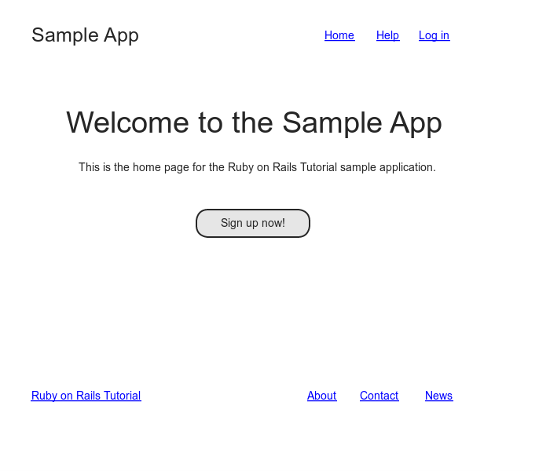
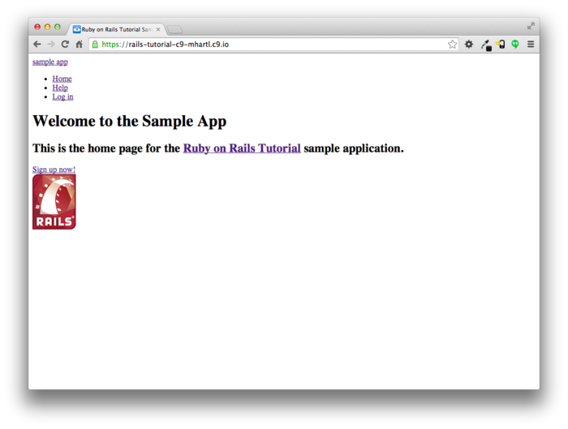
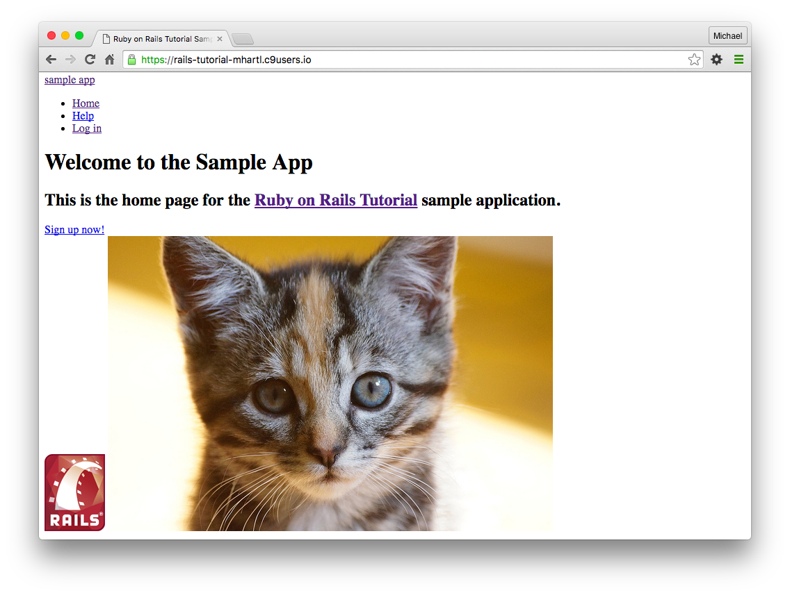
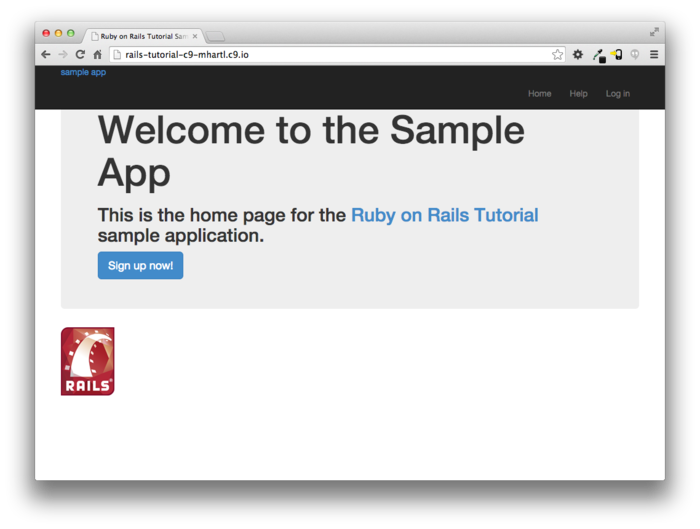
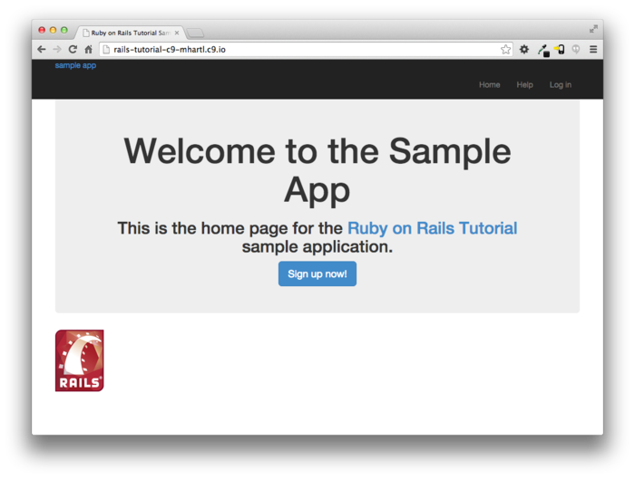
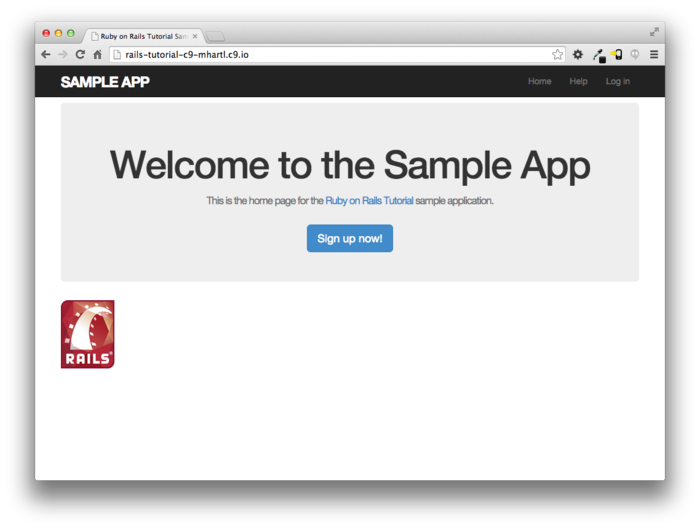
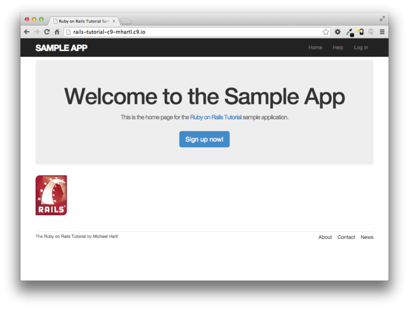
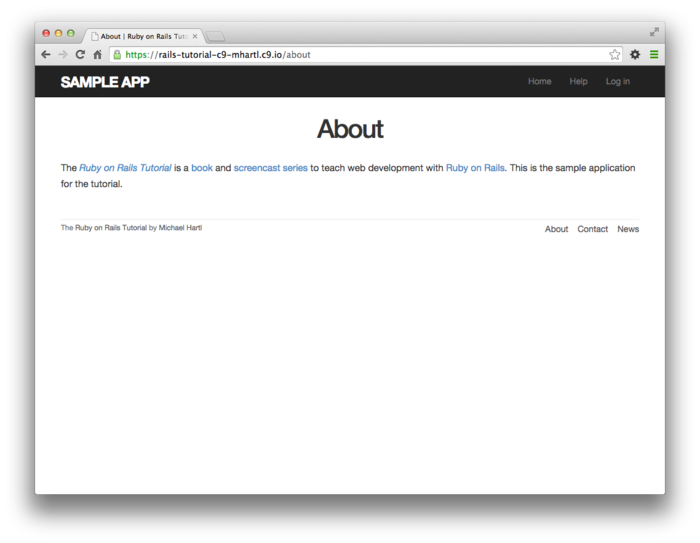
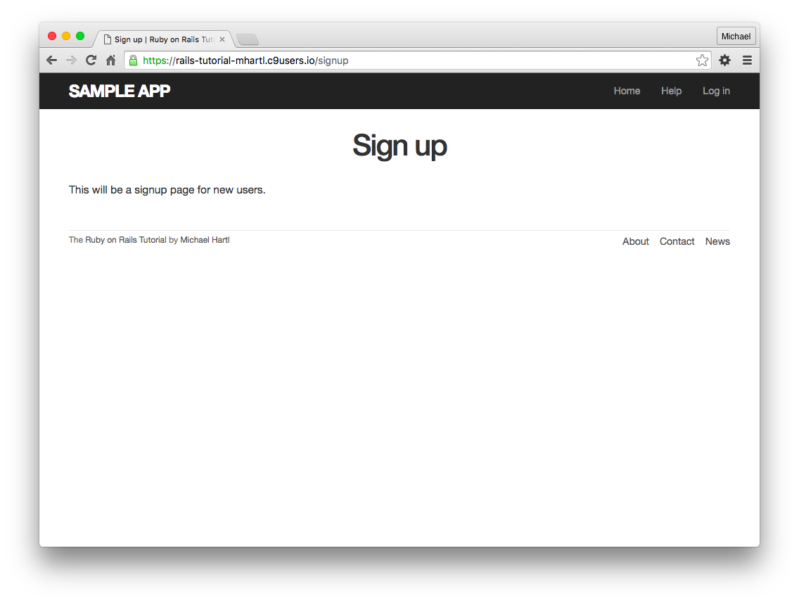

# 제 5장 레이아웃의 작성

[제 4장](Chapter4.md) 에서의 간단한 Ruby투어에서는, *Sample* 어플리케이션에 어플리케이션 스타일 시트를 적용하는 방법을 배워보았습니다.([4.1](Chapter4.md#41-작성동기)) 그러나 [4.3.4](Chapter4.md#434-다시-한-번-CSS) 에서 지적한 바와 같이, 해당 스타일시트는 아직 아무것도 작성되어있지 않은 상태입니다. 이번 챕터에서는 어플리케이션에 Bootstrap 프레임워크를 적용하고, 커스텀 스타일을 추가해볼 것입니다. 또한 지금까지 작성한 페이지(Home이나 About)등에 링크를 레이아웃에 추가해보겠습니다([5.1](#51-구조를-추가해보자)) 도중에 파셜(*Partial*) , Rails의 라우팅, Asset Pipeline에 대해 배워 볼 것이며, Sass에 대해서도 소개하는 시간을 가지겠습니다.([5.2](#52-Sass와-Asset-Pipeline)) 이번 장의 마지막 부분에는 유저를 사이트에 로그인시키기 위한 중요한 작업을 진행해볼 것입니다.([5.4](#54-User의-등록-첫-테스트))


이번 장에서는, Sample 어플리케이션에 레이아웃을 추가하거나, 수정하는 등의 부분을 중점적으로 소개하겠습니다. 또한 레이아웃에 대해서는 테스트주도개발을 한다거나, 모든 테스트 케이스를 작성하지 않는 부분도 있습니다.(테스트를 작성하는 것과 작성하지 않는 것에 대한 가이드라인에 대해서는 [컬럼3.3](Chapter3.md#컬럼-33-결국-테스트는-언제-하는-것이-좋은가) 에서 말씀드리고 있습니다.) 때문에 이번 장에서는 텍스트에디터에 의한 수정과 브라우저에 의한 확인이 대부분의 작업이 될 것입니다. 테스트 주도 개발을 하는 유일한 부분은, [5.3.1](#531-Contact-페이지)의 Contact페이지를 추가하는 부분정도입니다. 마지막으로 새로운 테스트방법인 "통합 테스트(혹은 결합테스트, *Integration Test*)" 에 대해 소개하고자 합니다.([5.3.4](#534-링크의-테스트)) 통합 테스트를 통하여 최종적으로 레이아웃이나 링크가 제대로 움직이는지를 체크해볼 것입니다.


## 5.1 구조를 추가해보자

*Rails Tutorial* 은, Web 개발을 위한 책이며, Web디자인을 위한 책은 아닙니다. 그러나 그렇다고해서 *아무런 스타일도 없는* 쓸쓸한 디자인의 어플리케이션으로 언제까지나 작업하고 있을 수도 없는 노릇이빈다. 이번 장에서는 레이아웃에 몇가지 구조와 CSS를 추가하여 최소한의 스타일을 추가해볼 것입니다. 커스텀 CSS룰 이외에도, Twitter에 의한 오픈소스 Web 디자인 프레임워크로 공개되어있는 [*Bootstrap*](http://getbootstrap.com/) 을 이용해볼 것입니다. 또한 코드 그 자체에도 스타일을 적용해볼 것입니다. 즉, 여기저기 붙여넣은 레이아웃 코드를, 파셜(*Partial*) 기능을 사용하여 정리해나가는 그러한 과정을 진행해볼 것입니다.


Web 어플리케이션을 작성할 때, 유저인터페이스의 개념을 되도록 빠른 단계에서 파악해놓는 것이 좋습니다. 본 튜토리얼에서는 목업(Web의 문맥에서는 와이어프레임 이라고도 불립니다.) 이라고 하는, 개발 후의 어플리케이션의 디자인을 스케치해볼 것입니다. 또한 본 챕터에서는 주로 [3.2](Chapter3.md#32-정적인-페이지) 소개한 사이트로고, 네이게이션 헤더, 사이트 푸터를 포함한 정적페이지를 개발해볼 것입니다.  제일 중요한 Home페이지의 목업은 아래와 같습니다. 목업을 기반으로 작성한 최종 결과는 본 장의 마지막 부분에서 확인해볼 수 있을 것입니다. 목업과 최종결과물을 확인해본다면, 세부적인 부분이 조금 다른 것을 알 수 있습니다. (예를 들어, 실제로는 마지막에 Rails 로고를 페이지에 추가합니다.) 그러나 목업은 어디까지나 목업이기 때문에 정확하게 만들 필요는 없습니다.

​                


Git의로 버전관리를 하고 있는 경우라면, 지금까지와 마찬가지로 지금 시점에서 새로운 브랜치를 작성하는 것이 좋을 것 같습니다.

`$ git checkout -b filling-in-layout`


### 5.1.1 Navigation

제일 첫 번째로,  Sample 어플리케이션에 링크와 스타일을 추가하기 위해, 사이트의 레이아웃 파일 `application.html.erb` 에 HTML 구조를 추가하고, 레이아웃파일을 수정해봅시다. 이번 수정은 영역(div태그)의 추가, CSS클래스의 추가, 사이트 네비게이션의 기점이 되는 영역의 추가도 포함됩니다. 완전한 파일은 아래의 코드와 같습니다. 이어서 해당 파일을 구성하고 있는 많은 코드들에 대해 해설하겠습니다. 

```erb
<!-- app/views/layouts/application.html.erb -->
<!DOCTYPE html>
<html>
  <head>
    <title><%= full_title(yield(:title)) %></title>
    <%= csrf_meta_tags %>
    <%= stylesheet_link_tag    'application', media: 'all',
                               'data-turbolinks-track': 'reload' %>
    <%= javascript_include_tag 'application',
                               'data-turbolinks-track': 'reload' %>
    <!--[if lt IE 9]>
      <script src="//cdnjs.cloudflare.com/ajax/libs/html5shiv/r29/html5.min.js">
      </script>
    <![endif]-->
  </head>
  <body>
    <header class="navbar navbar-fixed-top navbar-inverse">
      <div class="container">
        <%= link_to "sample app", '#', id: "logo" %>
        <nav>
          <ul class="nav navbar-nav navbar-right">
            <li><%= link_to "Home",   '#' %></li>
            <li><%= link_to "Help",   '#' %></li>
            <li><%= link_to "Log in", '#' %></li>
          </ul>
        </nav>
      </div>
    </header>
    <div class="container">
      <%= yield %>
    </div>
  </body>
</html>
```

위 코드에서 새로운 코드를 확인해봅시다. [3.4.1](Chapter3.md#341-타이틀을-테스트해보자-Red) 에서도 간단히 설명했습니다만, Rails은 기본으로 HTML5를 지원하고 있습니다. (`<!DOCTYPE html>` 이라고 쓰여져 있는 것이 HTML5라는 것을 선언하고 있는 것입니다.) 그렇지만, HTML5은 비교적 새로운 기술이며, 일부 브라우저 (특히 Internet Explorer) 에서는 HTML5의 지원이 제대로 되지 않을 수가 있습니다. 그 때문에 다음과 같은 JavaScript 코드(일명 [HTML5 shim (or shiv)](https://github.com/aFarkas/html5shiv) )를 사용하여 문제를 해결하고 있습니다.

```html
<!--[if lt IE 9]>
  <script src="//cdnjs.cloudflare.com/ajax/libs/html5shiv/r29/html5.min.js">
  </script>
<![endif]-->
```

위 코드는 조금은 신기해보이는 코드가 있습니다.

`<!--[if lt IE 9]>`

위 코드는 Microsoft Internet Explorer (IE) 의 버전이 9보다 낮을 경우, (`if It IE 9`) 실행되는 코드입니다. 조금 신기해보이는 이 `if It IE 9` 는, Rails의 일부는 *아닙니다.* 위 코드는 [조건 코멘트](https://ja.wikipedia.org/wiki/条件付きコメント) 라는 것으로, 이번과 같은 상황을 위해 Internet Explorer 에서 특별하게 지원해주고 있습니다. 이것으로 Firefox, Chrome, Safari등의 다른 브라우저에 영향을 주지 않으면서도 IE의 버전이 9미만일 경우만, HTML5 shim 을 읽어들이는, 매우 편리한 녀석입니다.


그 다음 이어지는 부분에서는, 사이트의 로그를 표시하는 `header`(`div` 태그에 의한) 몇몇개의 영역태그, 네비게이션 링크의 리스트가 있습니다. 

```erb
<header class="navbar navbar-fixed-top navbar-inverse">
  <div class="container">
    <%= link_to "sample app", '#', id: "logo" %>
    <nav>
      <ul class="nav navbar-nav navbar-right">
        <li><%= link_to "Home",   '#' %></li>
        <li><%= link_to "Help",   '#' %></li>
        <li><%= link_to "Log in", '#' %></li>
      </ul>
    </nav>
  </div>
</header>
```

`header` 태그는 페이지 윗부분에 와야할 요소들을 포함하고 있습니다. `header` 태그에는, `navbar`, `navbar-fixed-top`, `navbar-inverse` 라고 하는 세 가지 CSS 클래스가 스페이스로 구분지어져 적용되고 있습니다.

```html
<header class="navbar navbar-fixed-top navbar-inverse">
```

모든 HTML태그는, 클래스와 *id* 둘 다 지정할 수 있습니다. 단순한 라벨로써, CSS에서 스타일을 지정하기 위할 때 편리하게 사용할 수 있습니다. 클래스와 id의 차이점으로는, 클래스는 페이지 내부에서 몇번이고 중복해서 사용할 수 있는 것에 반해,  id는 단 한 번만 사용할 수 있습니다. 위 예제와 같은 경우, 모든 navbar 클래스에는, [5.1.2](#512-Bootstrap과-커스텀-CSS) 에서 인스톨하는 Bootstrap 프레임워크에 의해 특별한 의미가 부여됩니다.


`header` 태그 안쪽에는 `div` 태그가 있습니다.

`<div class="container">` 

`div` 태그는 일반적으로 표시영역(범위) 를 나타내며, 세부 요소(태그)를 각각의 개별부품으로 나눌때에도 사용합니다. 특히 조금 오래된 스타일의 HTML에서는, `div` 태그는 사이트 내부에서 거의 모든 범위에서 사용해왔습니다. 그러나 HTML5부터는 자주 쓰이는 범위마다 세분화할 수 있게 되었습니다. 구체적으로는 `header`태그, `nav` 태그, `section`태그 가 새롭게 사용할 수 있게 되었습니다. 또한 `header` 태그의 클래스와 마찬가지로, `div` 태그 에도 CSS클래스(`container`) 가 적용되고 있습니다만, 이 클래스도 Bootstrap에 있어서 특별한 의미를 가지고 있습니다.


div 태그 다음에는 erb Ruby코드가 등장합니다.

``` erb
<%= link_to "sample app", '#', id: "logo" %>
<nav>
  <ul class="nav navbar-nav navbar-right">
    <li><%= link_to "Home",   '#' %></li>
    <li><%= link_to "Help",   '#' %></li>
    <li><%= link_to "Log in", '#' %></li>
  </ul>
</nav>
```

여기서는 링크를 생성하기 위해서, Rails 헬퍼의 `link_to` 를 사용합니다. ([3.2.2](Chapter3.md#322-Static-Page를-편집해보자) 에서 본 앵커태그 `a` 가 생성됩니다.) `link_to` 의 첫 번째 파라미터로는 링크 텍스트, 두 번째 파라미터로는 URL 이 입력됩니다. 이 URL은 [5.3.3](#533-이름이-붙은-Path)에서 *Named Routes* (이름을 부여하여 사용하는 path) 로 변환됩니다만, 지금은 Web디자인에서 일반적으로 사용되는 스터브용(더미 링크) URL인 `#` 을 입력합니다. 세 번째 파라미터로는 옵션해시로써, Sample 어플리케이션의 링크에서 CSS id `logo` 를 지정하고 있습니다. ( 다른 세 개의 링크에는 옵션해시가 지정되어있지 않습니다만, 필수가 아니기때문에 상관없습니다.)  Rails 헬퍼는, 이러한 옵션해시를 자주 사용하고 있으며, Rails 코드를 사용하면서, 임의의 HTML 옵션을 유연하게 추가할 수 있습니다.


div의 안쪽 태그 2번째 요소는 리스트아이템 태그 `li` 와 순번이 없는 리스트 태그 `ul` 에 의해 생성된 네비게이션 링크 리스트가 있습니다.

```erb
<nav>
  <ul class="nav navbar-nav navbar-right">
    <li><%= link_to "Home",   '#' %></li>
    <li><%= link_to "Help",   '#' %></li>
    <li><%= link_to "Log in", '#' %></li>
  </ul>
</nav>
```

정확하게는 여기서는 불필요합니다만, `nav` 태그 에는 "`nav` 태그 안쪽이 네비게이션 링크이다" 라고 하는 의미를 명시적으로 나타내기 위한 기능이 있습니다. 게다가 `ul` 태그에 적용되어 있는 `nav` 나 `navbar-nav`, `navbar-right` 클래스도 Bootstrap에 있어서 특별한 의미를 가지고 있습니다. 따라서 [5.1.2](#512-Bootstrap과-커스텀-CSS)에서 Bootstrap의 CSS를 추가했을 때, 위 태그에 스타일이 자동적으로 적용될 것입니다. 브라우저에서 소스코드를 확인하면 알 수 있을 것입니다만, Rails가 erb코드를 확인하고, 레이아웃을 출력한다면, 위 코드는 아래와 같이 바뀔 것입니다.

```html
<nav>
  <ul class="nav navbar-nav navbar-right">
    <li><a href="#">Home</a></li>
    <li><a href="#">Help</a></li>
    <li><a href="#">Log in</a></li>
  </ul>
</nav>
```

이 것이 Rails에서 브라우저에게 전달되는 HTML입니다.

레이아웃의 마지막 부분에는 메인컨텐츠용의 `div` 가 있습니다.

```erb
<div class="container">
  <%= yield %>
</div>
```

마찬가지로, `container` 클래스도 Bootstrap 에 있어서 특별한 의미를 가지고 있습니다. [3.4.3](Chapter3.md#343-레이아웃과-html에-직접-쓰는-Ruby-Refactor-연습) 에서 확인한 것과 마찬가지로, `yield` 메소드는  Web사이트의 레이아웃에 각각의 페이지의 내용을 출력합니다.


[5.1.3](#513-파셜(Partial)) 에서 추가하는 사이트푸터를 제외하고는, 이것으로 레이아웃이 완성되었습니다. Home페이지에 접속하여 표시결과를 확인할 수 있습니다. 이후 스타일 요소를 이용하기 위해서는 `home.html.erb` 뷰 파일에 특별한 요소를 몇가지 추가합니다.

```erb
<!-- app/views/static_pages/home.html.erb -->
<div class="center jumbotron">
  <h1>Welcome to the Sample App</h1>

  <h2>
    This is the home page for the
    <a href="https://railstutorial.jp/">Ruby on Rails Tutorial</a>
    sample application.
  </h2>

  <%= link_to "Sign up now!", '#', class: "btn btn-lg btn-primary" %>
</div>

<%= link_to image_tag("rails.png", alt: "Rails logo"),
            'http://rubyonrails.org/' %>
```

제 7장에서 사이트에 유저를 추가할 때를 대비하여, 첫 번째 `link_to` 를 이용하여 다음과 같은 임시 링크를 작성합니다.

` <a href="#" class="btn btn-lg btn-primary">Sign up now!</a>` 

위 코드 중에서 `div` 태그의 CSS클래스 `jumbotron` 이나 signup버튼의 `btn`, `btn-lg`, `btn-primary` 클래스는 전부 Bootstrap에서의 제공하는 특별한 클래스들입니다.


2번째의 `link_to` 에서는 파라미터로 이미지파일의 경로와 임의의 옵션해시를 사용하는 `image_tag` 헬퍼를 사용하고 있습니다.이 헬퍼는, 심볼을 사용하여 `alt` 속성등을 설정할 수 있습니다. 이미지 파일을 표시하기 위해서는 `rails.png` 라고 하는  Rails의 로고 이미지파일을 추가할 필요가 있습니다. Ruby on Rails의 공식 페이지 https://www.railstutorial.org/rails.png 에서 파일을 다운로드하고, `app/assets/images` 디렉토리에 저장해주세요. 클라우드IDE나 Unix계열의 OS(Linux, maxOS 등) 를 사용하는 경우에는, 다음과 같이 `curl` 커맨드를 사용하여 간단히 다운로드받는 것이 가능합니다. (`curl` 커맨드에 대해서는 [Command Line Tutorial](https://www.learnenough.com/command-line-tutorial#sec-downloading_a_file) 를 참고해주세요)

`$ curl -o app/assets/images/rails.png -OL railstutorial.jp/rails.png`

`image_tag` 헬퍼를 사용하고 있기 때문에, Rails는 해당 이미지 파일을 에셋파이프라인을 이용하여 `app/assets/images/` 디렉토리 안에서 찾아 표시합니다. (에셋 파이프라인에 대해서는 [5.2](#52-Sass와-Asset-Pipeline) 에서 설명합니다.)


이제 준비는 끝났습니다. 환경에 따라서는 여기서 Rails 서버를 한 번 재부팅 할 필요가 있으니, 필요한 경우에는 ([컬럼 1.1](Chapter1.md#컬럼-11-숙련이라고-하는-것은)) 재부팅하시길 바랍니다. 지금까지의 과정이 제대로 적용되었다면, 아래와 같은 화면이 되어있을 것입니다.



`image_tag` 의 효과를 확인하기 위해, 브라우저에서 HTML을 확인해보도록 합시다. (개발자 도구를 사용하세요!)

``

파일명이 겹치지 않도록 하기 위해, `9308b8f92fea4c19a3a0d8385b494526` 이라고 하는 문자열 (실제 문자열은 시스템마다 다릅니다.)을  Rails가 추가한 것을 알 수가 있습니다. 이것은 이미지파일을 새로운 이미지로 수정했을 때, 브라우저내부에 보존되어있는 캐시에 의도적으로 중첩되지 않기 위한 장치입니다. 또한 `src` 속성에는 `"image"` 라고 하는 디렉토리이름이 *포함되어 있지 않은 것* 에 대해 주목해주세요. 이것은 `assets` 디렉토리 내부의 다른 디렉토리 (image나 javascript, stylesheets등) 도 똑같습니다. 이 기능은 파일 고속화를 하기 위한 기능으로, Rails에서는 `assets` 디렉토리 바로 아래의 이미지파일을 `app/assets/images` 디렉토리에 있는 파일과 연결짓습니다. 이것으로 인하여 브라우저의 입장에서 본다면 모든 파일이 같은 디렉토리에 있는 것 처럼 보이게됩니다. 그리고 이러한 평범하고 단순한 디렉토리 구성으로 인하여 파일을 보다 더 빠르게 브라우저에게 전달할 수 있게 되는 것입니다. 마지막으로 `alt` 속성은, 이미지가 없는 경우를 대신하여 표시되는 문자열입니다. 예를들면 시각장애가 있는 유저가 사용하는 스크린리더 등은, 여기서의 `alt` 속성을 읽어들이는 것으로 해당 장소에 이미지 파일이 있다는 것을 표현합니다.


드디어 여기가지의 성과를 확인해보았습니다. 디자인이 생각한 것 보다는 심심하지 않으신가요? 그러나 이번 HTML 요소에 클래스를 적용한 덕분에, CSS를 사용하여 스타일을 추가할 수 있게 되었습니다.

##### 연습

1. Web페이지에는 고양이 영상이 매우 많습니다. 아래의 커맨드를 사용하여 고양이 사진을 다운로드해보세요.
2. `mv` 커맨드를 사용하여 다운로드한 `kitten.jpg` 파일을 적절한 에셋디렉토리에 이동시켜보세요.
3. `image_tag` 를 사용하여, `kitten.jpg` 영상을 출력해보세요.


curl -OL cdn.learnenough.com/kitten.jpg`





### 5.1.2 Bootstrap 과 커스텀 CSS

[5.1.1](#511-네비게이션) 에서는 많은 HTML요소(태그) 에 CSS클래스를 적용해보았습니다. 이렇게 해놓음으로써 CSS베이스의 레이아웃을 구성할 때 유연하게 대처할 수 있습니다.  [5.1.1](#511-네비게이션) 에서 말씀드렸다시피, 이러한 클래스들은 Twitter 에서 만든 프레임워크 [Bootstrap](http://getbootstrap.com/) 가 제공하는 특별한 클래스입니다. Bootstrap을 사용하여 깔끔한 Web 디자인과 유저인터페이스 요소를 간단하게 HTML5 어플리케이션에 추가할 수 있습니다. 이번 섹션에서는 Sample 어플리케이션에 스타일을 추가하기 위해 커스텀CSS 규칙과 Bootstrap을 조합하여 사용해볼 것입니다. 주목해야할 부분은, Bootstrap을 사용하는 것으로 인해 어플리케이션을 [*반응형 디자인 (Responsive Design)*](https://ja.wikipedia.org/wiki/レスポンシブウェブデザイン) 으로 만들 수 있다는 것입니다. 이렇게하면 어떤 장치에서라도 적절한 디자인으로 어플리케이션을 사용할 수 있게 됩니다.


제일 처음으로는, 아래의 코드에서 나타낸 것과 같이 Bootstrap을 추가해봅시다. `bootstrap-sass` gem을 이용하여 Rails 어플리케이션에 적용해봅시다. Bootstrap 프레임 워크는, 동적인 스타일 시트를 생성하기 위해 [LESS CSS](http://lesscss.org/) 라는 언어를 사용하고 있습니다만, Rails의 Asset Pipeline 에서는 기본적으로 (LESS와 매우 닮아있는) Sass를 지원합니다.([5.2](#52-Sass와-Asset-Pipeline)) 그렇기 때문에, `bootstrap-sass` 는 LESS를 Sass로 변환하여, 필요한 Bootstrap 파일을 현재 어플리케이션에서 제대로 사용할 수 있게 해줍니다.

```ruby
# Gemfile #
source 'https://rubygems.org'

gem 'rails',          '5.1.6'
gem 'bootstrap-sass', '3.3.7' #(번역자 : 튜토리얼에서 소개되는 내용은 약간 오래전의 내용입니다.)
.
.
.
```

언제나처럼 `bundle install` 을 실행하여  Bootstrap을 인스톨합니다.

`$ bundle install`

여담으로, `rails generate` 커맨드를 실행하는 것으로, 컨트롤러별로 나뉘어져 있는 CSS파일을 자동적으로 만들 수 있습니다만, 이러한 파일을 올바른 순서로 읽어들이는 것은 매우 어려운 것입니다. 본 튜토리얼에서는 (간결하게 하기 위해) 모든 CSS를 하나의 파일에 작성하도록 하겠습니다. 커스텀 CSS를 적용하기 위해, 커스텀 CSS파일을 생성해봅시다.

`touch app/assets/stylesheets/custom.scss`

(여기서는 [3.3.3](Chapter3.md#333-Green) 의 중간에서 소개한 `touch` 커맨드를 사용하고 있습니다만, 파일을 작성할수만 있다면 [새로운 파일 생성] 이라던지, 다른 커맨드를 사용하여도 문제없습니다.) 해당 디렉토리의 이름과 파일이름은, 매우 중요합니다. 다음 디렉토리

`app/assets/stylesheets`

는 Asset Pipeline([5.2](#52-Sass와-Asset-Pipeline)) 의 일부이기도 하며, 위 디렉토리에 저장되어있는 스타일시트는 `application.css` 의 일부로써 Web사이트의 레이아웃에 적용됩니다. 게다가 파일명 `custom.scss` 에는 `.scss` 라고 하는 확장자가 포함되어 있습니다. 이 확장자는 "Sass (Sassy CSS)" 이라고 불리는, CSS를 확장한 언어로, 에셋파이프라인은 이 파일의 확장자를 확인하고, SCSS를 처리할 수 있게 해줍니다. (Sass는 5.2.2까지 등장하지 않습니다만, `bootstrap-sass` gem )이 동작하기 위한 마술같은 것입니다.)


커스텀 CSS용의 파일을 작성했다면, 다음의 코드처럼, `@import` 를 사용하여 Bootstrap(과 그것과 관련된 Sprockets) 를 읽어들일 수 있게 합시다.

```ruby
# app/assets/stysheets/custom.scss #
@import "bootstrap-sprockets";
@import "bootstrap";
```


위 파일의 3번째 행에는, Bootstrap CSS의 프레임워크를 읽어들이고 있습니다. import한 후, Web서버를 재부팅하면, 어플리케이션에 적용할 수 있습니다. ([1.3.2](Chapter1.md#132-rails-server) 에서 말씀드린대로, Ctrl+C를 눌러서 Web서버를 정지시킨 후, `rails server` 커맨드를 입력하여 Web 서버를 부팅시켜주세요.) 제대로 적용되었다면, 아래와 같은 결과가 될 것입니다. 텍스트의 배치는 지금은 그저 그렇고, 로고에는 스타일도 없습니다만 색의 적용과 signup 버튼은 그나마 좀 괜찮은 디자인이 되었습니다.




다음으로는, 아래의 코드처럼, Web사이트 전체에 걸쳐 레이아웃과 각각의 페이지에 스타일을 적용하기 위한 CSS를 추가해봅니다. 테스트의 결과는 아래의 캡쳐와 같습니다. 아래 코드에는 많은 코딩규약이 있습니다. CSS의 규약을 파악하기 위해서는 확인해보고 싶은 부분을 코멘트처리하여 출력되는 결과를 확인해보는 방법을 추천합니다. CSS에서는 `/* ... */` 으로 코멘트처리를 할 수 있습니다. 알아보고 싶은 코드를 이것으로 감싸주고 Web 어플리케이션의 출력이 어떻게 바뀌는지 확인해보세요.

```css
/* app/assets/stylesheets/custom.scss */
@import "bootstrap-sprockets";
@import "bootstrap";

/* universal */

body {
  padding-top: 60px;
}

section {
  overflow: auto;
}

textarea {
  resize: vertical;
}

.center {
  text-align: center;
}

.center h1 {
  margin-bottom: 10px;
}
```



우리가 적용한 CSS의 형식은 일정합니다. CSS 규약에서는 보통 클래스, id, HTML태그 혹은 이 것들의 조합으로 HTML요소들을 지정할 수 있습니다. 그리고 그 다음 스타일링을 지정할 수 있습니다. 예를 들어 다음의 코드는 

```css
body {
  padding-top: 60px;
}
```

페이지 위쪽에 60픽셀만큼의 여백을 추가합니다. `header` 태그의 `navbar-fixed-top` 클래스가 적용되어 있기 때문에, Bootstrap에서 네비게이션바를 페이지 위쪽에 고정하고, 네비게이션바의 아래에 여백을 주어 주요부분으로부터 분리시킵니다. (기본적으로 navbar의 색은 Bootstrap 2.0에서 변경되었기 때문에, 현재 예제의 잿빛 대신, 검은색으로 하고 싶은 경우에는 `navbar-inverse` 클래스를 적용할 필요가 있습니다.) 또한 이 다음 CSS는

```css
.center {
  text-align: center;
}
```

`center` 클래스에 `text-align: center` 값을 적용하고 있습니다. `.center` 에서의 `.` 은 클래스에 스타일을 적용한다는 의미입니다. 또한 조금 나중에 나오겠습니다만, 기호 `#` 으로 시작하는 경우에는 id값에 대해 스타일을 적용한다는 의미입니다. 이번 경우에는 `center` 클래스가 적용되어있는 (`div` 등) 요소의 내부 요소를 모두 가운데 정렬한다는 의미입니다.


Bootstrap에서 깔끔한 타이포그래피를 이용하는 CSS가 있습니다만, 여기서는 거기에 덧붙여 아래와 같은 커스텀 CSS를 추가하여 텍스트의 모양을 조금 바꾸어봅시다.  이번에 추가하는 스타일은, Home페이지의 모든 요소에 적용된다고는 말씀드릴 수 없습니다만, Sample 어플리케이션의 다른 페이지에서도 사용될 것입니다. 아래의 코드의 결과는 아래 그림과 같습니다.

```scss
/* app/assets/stylesheets/custom.scss */
@import "bootstrap-sprockets";
@import "bootstrap";
.
.
.
/* typography */

h1, h2, h3, h4, h5, h6 {
  line-height: 1;
}

h1 {
  font-size: 3em;
  letter-spacing: -2px;
  margin-bottom: 30px;
  text-align: center;
}

h2 {
  font-size: 1.2em;
  letter-spacing: -1px;
  margin-bottom: 30px;
  text-align: center;
  font-weight: normal;
  color: #777;
}

p {
  font-size: 1.1em;
  line-height: 1.7em;
}
```


마지막으로, 몇가지 스타일을 로고에 추가해보겠습니다. 이 사이트 로고는 "sample app" 만 표시하는 심플한 로고입니다. 아래의 CSS는, 텍스트를 대문자로 바꾸고 사이즈, 색, 배치를 바꿉니다. (사이트로고가 페이지 내부 다른 곳에 쓰이지 않는 것을 전제로하여 CSS id를 사용하고 있습니다만, 이 대신에 클래스에 적용하여도 괜찮습니다.)

```scss
/* app/assets/stylesheets/custom.scss */
@import "bootstrap-sprockets";
@import "bootstrap";
.
.
.
/* header */

#logo {
  float: left;
  margin-right: 10px;
  font-size: 1.7em;
  color: #fff;
  text-transform: uppercase;
  letter-spacing: -1px;
  padding-top: 9px;
  font-weight: bold;
}

#logo:hover {
  color: #fff;
  text-decoration: none;
}
```

위 코드에서 `color: #fff` 는, 로고 색을 하얀색으로 바꿉니다. HTML의 색은 16진수 의 3개의 숫자의 조합으로 표현되며 빨강, 파랑, 녹색의 3원색을 코드로 바꾸어 표현할 수 있습니다. 원래는 `#ffffff` 이라고 작성하고 세 가지 색 모두 최대로 할 필요가 있습니다만, 위 코드에서 `#fff` 라고하는 `#ffffff` 라는 축약형을 사용하고 있습니다. CSS표준에서는 [HTML색에는 별칭](https://www.w3schools.com/colors/colors_names.asp) 을 많이 사용합니다. 예를들어 방금전 `#fff` 은 `white` 라고 바꾸어 쓸 수 있습니다. 아무튼 위 코드를 적용하면 아래와 같이 바뀔 것입니다.




##### 연습

1. 아래의 코드를 참고하여 [5.1.1](#511-네비게이션) 에서의 고양이 이미지 파일을 코멘트처리해보세요. 브라우저의 개발자도구를 사용하여 코멘트처리한 HTML소스코드가 제대로 출력되지 않는 것을 확인해보세요.
2. 아래 두번째 코드를 `custom.scss` 에 추가하여 모든 이미지 파일을 출력하지 않도록 해보세요. 제대로 적용된다면 Rails의 로고 이미지가 Home페이지에서 표시되지 않을 것입니다. 아까와 마찬가지로 개발자도구를 사용하여 HTML 소스코드는 남아있지만, 이미지가 표시되지 않는 것을 확인해보세요.

```erb
<!-- erb코드를 코멘트처리 해봅니다. -->
<%#= image_tag("kitten.jpg", alt: "Kitten") %>
```

```css
/*  모든 이미지를 표시하지 않는 CSS 스타일 */
img {
  display: none;
}
```


### 5.1.3 파셜 (Partial)

레이아웃의 코드는 해당 목적을 달성하였습니다. 하지만 아직해야 할 일이 남아있습니다. 예를 들어, IE 고유의 설정을 위한 HTML shim 코드가 3줄이나 차지하고 있습니다. 이 코드를 어떻게든 잘 해서 숨길 수가 있다면 얼마나 좋을까요? 또한 HTML헤더는 논리적 단위로 나뉘어져있기 때문에, 한 곳으로 모아서 처리하는 것이 더욱 좋습니다. Rails에서는 *파셜 (partial)*이라고 하는 기능으로 이러한 문제를 해결할 수 있습니다. 일단 파셜을 정의하면 레이아웃이 어떻게 변하는지 확인해봅시다.

```erb
<!-- app/views/layouts/application.html.erb -->
<!-- 레이아웃 파일에 shim과 header 파셜 파일을 추가한다 -->
<!DOCTYPE html>
<html>
  <head>
    <title><%= full_title(yield(:title)) %></title>
    <%= csrf_meta_tags %>
    <%= stylesheet_link_tag    'application', media: 'all',
                               'data-turbolinks-track': 'reload' %>
    <%= javascript_include_tag 'application',
                               'data-turbolinks-track': 'reload' %>
    <%= render 'layouts/shim' %>
  </head>
  <body>
    <%= render 'layouts/header' %>
    <div class="container">
      <%= yield %>
    </div>
  </body>
</html>
```

위 코드에서는 다음과 같이 `render` 라는 Rails 헬퍼를 사용하여 HTML shim 코드를 대체하고 있습니다.

`<%= render 'layouts/shim' %>`

위 코드는 `app/views/layouts/_shim.html.erb` 라고하는 파일을 찾아, 그 안의 내용을 확인하고, 뷰에 삽입합니다. ( <%= ... %> 는 템플릿 내부에서 Ruby의 문법을 확인하기 위한 erb문법인 것을 기억하고 계시나요? 읽어들인 erb코드를 변환하여 템플릿에 삽입합니다.) 파일이름 `_shim.html.erb` 의 앞에 오는 언더바는, 파셜에서 사용하는 보편적인 명명규칙이며, Rails에서 이 것이 파셜파일이라는 것을 알 수 있게해줍니다.


물론 파셜이 동작하기 위해서는 그것에 대응하는 파일과 컨텐츠를 작성하지 않으면 안됩니다. shim 파셜의 경우, 3줄의 shim코드만 존재합니다. 작성한 코드는 아래와 같습니다.

```html
<!-- app/views/layouts/_shim.html.erb -->
<!--[if lt IE 9]>
  <script src="//cdnjs.cloudflare.com/ajax/libs/html5shiv/r29/html5.min.js">
  </script>
<![endif]-->
```

마찬가지로 헤더의 정보도 아래와 같이 파셜파일로 분리하여 `render` 를 이용하여 레이아웃 파일에 삽입할 수 있습니다. (파셜은 자동생성하지말고 텍스트에디터를 사용하여 수동으로 작성하는 것이 일반적입니다.)

```erb
<!-- app/views/layouts/_header.html.erb -->
<!-- header용의 파셜 -->
<header class="navbar navbar-fixed-top navbar-inverse">
  <div class="container">
    <%= link_to "sample app", '#', id: "logo" %>
    <nav>
      <ul class="nav navbar-nav navbar-right">
        <li><%= link_to "Home",   '#' %></li>
        <li><%= link_to "Help",   '#' %></li>
        <li><%= link_to "Log in", '#' %></li>
      </ul>
    </nav>
  </div>
</header>
```

이것으로 파셜의 작성방법을 알게되었습니다. 다음으로는 헤더에 대응하는 푸터를 같은 방법으로 작성해봅시다. 여기까지 오셨다면, 파일이름은 `_footer.html.erb` 라는 것과, layouts디렉토리 안에 저장하면 되는 것 정도는 아실 겁니다.

```erb
<!-- app/views/layouts/_footer.html.erb -->
<!-- footer용의 파셜 -->
<footer class="footer">
  <small>
    The <a href="https://railstutorial.jp/">Ruby on Rails Tutorial</a>
    by <a href="http://www.michaelhartl.com/">Michael Hartl</a>
  </small>
  <nav>
    <ul>
      <li><%= link_to "About",   '#' %></li>
      <li><%= link_to "Contact", '#' %></li>
      <li><a href="http://news.railstutorial.org/">News</a></li>
    </ul>
  </nav>
</footer>
```

헤더의 경우와 마찬가지로, 푸터 안에도 `link_to` 메소드를 사용하여 About페이지와 Contact 페이지로의 내부 링크를 추가하고 있습니다. 일단 URL 은 `'#'`  로 해둡시다. (`header` 태그와 마찬가지로, `footer` 태그도 HTML5 에서 새롭게 추가된 요소입니다. )


footer파셜은, 스타일시트나 header파셜과 마찬가지로 레이아웃 파일 내부에 추가합니다.

```erb
<!-- app/views/layouts/application.html.erb -->
<!DOCTYPE html>
<html>
  <head>
    <title><%= full_title(yield(:title)) %></title>
    <%= csrf_meta_tags %>
    <%= stylesheet_link_tag    'application', media: 'all',
                               'data-turbolinks-track': 'reload' %>
    <%= javascript_include_tag 'application',
                               'data-turbolinks-track': 'reload' %>
    <%= render 'layouts/shim' %>
  </head>
  <body>
    <%= render 'layouts/header' %>
    <div class="container">
      <%= yield %>
      <%= render 'layouts/footer' %> <!-- 추가한 footer partial -->
    </div>
  </body>
</html>
```

이대로 footer를 표시하게 된다면 디자인이 썩 좋지 않기 때문에, 스타일을 약간 추가해보도록 하겠습니다. 스타일을 추가한 결과는 아래와 같습니다.

```css
/* app/assets/stylesheets/custom.css */
.
.
.
/* footer */

footer {
  margin-top: 45px;
  padding-top: 5px;
  border-top: 1px solid #eaeaea;
  color: #777;
}

footer a {
  color: #555;
}

footer a:hover {
  color: #222;
}

footer small {
  float: left;
}

footer ul {
  float: right;
  list-style: none;
}

footer ul li {
  float: left;
  margin-left: 15px;
}
```




##### 연습

1. Rails가 기본적으로 생성하는 `head` 태그의 부분을 아래의 코드와 같이 `render`로 바꾸어봅시다. *Hint*: 단순히 삭제해버리면 파셜을 작성할 때 전부 새로 작성해야할 수도 있기 때문에, 삭제하기 전에 어딘가 옮겨적어놓습니다. (메모장 등)
2. 아래 코드처럼 파셜을 아직 만들지 않았기 때문에, 테스트는 RED (테스트 실패) 인 상태일 것입니다. 실제로 테스트를 실행해서 확인해봅시다.
3. `layouts` 디렉토리에 `head` 태그용 파셜을 작성하고, 아까전 메모장에 옮겼던 코드를 다시 붙여넣은 후, 테스트가 제대로 통과되는지 (GREEN) 확인해봅시다.

```erb
<!-- app/views/layouts/application.html.erb -->
<!DOCTYPE html>
<html>
  <head>
    <title><%= full_title(yield(:title)) %></title>
    <%= render 'layouts/rails_default' %>
    <%= render 'layouts/shim' %>
  </head>
  <body>
    <%= render 'layouts/header' %>
    <div class="container">
      <%= yield %>
      <%= render 'layouts/footer' %>
    </div>
  </body>
</html>
```


## 5.2 Sass와 Asset Pipeline

최근에 Rails에 추가된 기능 중 하나로, 대서특필할만한 기능 중 하나는, CSS, Javascript, 이미지파일 등의 정적 컨텐츠의 생산성과 관리를 큰 폭으로 향상시킬 수 있는 *에셋 파이프라인 (Asset Pipeline)* 입니다. 이번 섹션에서는, 에셋파이프라인의 개요와 멋진 CSS생성 도구인 "Sass" 에 대해 설명하겠습니다.


### 5.2.1 Asset Pipeline

Rails 개발자의 관점에서는, 에셋 디렉토리, 매니페스트 파일, 프리프로세서 엔진이라고 하는 세 가지의 주요한 기능을 이해할 필요가 있습니다. 하나씩 살펴 보겠습니다.

#### 에셋 디렉토리

Rails의 에셋파이프라인에는 정적파일을 사용하는 용도별로 분류하는 세 개의 표준적인 디렉토리가 있습니다.

- `app/assests` : 현재의 어플리케이션의 고유한 에셋
- `lib/assets` : 다른 개발팀에서 작성된 라이브러리용 에셋
- `vender/assets`: 서드파티용의 에셋

위 디렉토리에는 각각의 에셋클래스용의 서브디렉토리가 존재합니다. 예를 들어 app/assets의 경우, 다음과 같이 그림파일용, JavaScript용, CSS용의 서브 디렉토리가 있습니다.

```
$ ls app/assets/
images/  javascripts/  stylesheets/
```

위 설명을 다시 본다면, [5.1.2](#512-Bootstrap-과-커스텀-CSS) 에서 언급한 커스텀 CSS가 저장되어있는 곳과 그 이유에 대해 이해할 수 있을 것입니다. 즉, `custom.css` 는 sample 어플리케이션 고유의 에셋이기 때문에, `app/assets/stylesheets` 에 저장한 것입니다.

#### 매니페스트 파일

정적 파일(에셋)을 위 디렉토리에 각각 배치해놓는다면, *매니페스트 파일* 을 사용하여 정적파일들을 하나의 파일로 어떻게 정리할지를 Rails에 알려주는 것이 가능합니다. 여기서, 실제로 에셋을 정리하는 처리를 하는 것이 [Sprockets](https://github.com/rails/sprockets) 라고 하는 gem입니다. 또한 매니페스트 파일은 CSS와 JavaScript에는 적용됩니다만, 이미지 파일에는 적용되지 않습니다. 하나의 구체적인 예로, 어플리케이션의 CSS용 매니페스트 파일을 확인해봅시다.

```css
/* app/assets/stylesheets/application.css */

/*
 * This is a manifest file that'll be compiled into application.css, which
 * will include all the files listed below.
 *
 * Any CSS and SCSS file within this directory, lib/assets/stylesheets,
 * vendor/assets/stylesheets, or vendor/assets/stylesheets of plugins, if any,
 * can be referenced here using a relative path.
 *
 * You're free to add application-wide styles to this file and they'll appear
 * at the bottom of the compiled file so the styles you add here take
 * precedence over styles defined in any styles defined in the other CSS/SCSS
 * files in this directory. It is generally better to create a new file per
 * style scope.
 *
 *= require_tree .
 *= require_self
 */
```

위에서 중요한 부분은, 실제로 CSS 코멘트 안에 있습니다. 코멘트내부의 다음 부분은 Sprockets가 적절한 파일을 읽어들이기 위해 사용합니다.

```
/*
 .
 .
 .
 *= require_tree .
 *= require_self
*/
```

예를 들어 다음 코드는

```
 *= require_tree .
```

`app/assets/stylesheets` 디렉토리 (서브 디렉토리를 포함한) 안의 모든 CSS 파일이 어플리케이션 CSS에 포함되도록 처리하고 있습니다. 또한 다음 코드는

```
 *= require_self
```

CSS를 읽어들이는 대상에 `application.css` 자기 자신도 포함시키고 있습니다.


Rails에는 실용적인 기본 매니페니스트 파일이 포함되어 있기 때문에, *Rails Tutorial* 에서는 수정할 필요가 없습니다만, 혹시나 수정할 경우에는 Rails 가이드 [에셋 파이프라인](http://railsguides.jp/asset_pipeline.html) 를 참고해주세요.

#### 프리 프로세서 엔진

필요한 에셋을 디렉토리에 저장하고 정리한 다음, Rails는 여러가지 프리 프로세서 엔진을 이용하여 에셋들을 실행하고, 브라우저에게 송신할 수 있도록 매니페스트 파일을 사용하여 하나로 묶은 다음, 사이트 템플릿용으로 준비합니다. Rails는 어떠한 프리 프로세서를 사용할지를 파일 이름의 확장자를 확인한 후 처리합니다. 제일 일반적인  확장자는 Sass용의 `.scss ` , CoffeeScript용의 `.coffee` , Erb용의 `.erb` 입니다. [3.4.3](Chapter3.md#343-레이아웃과-html에-직접-쓰는-Ruby-Refactor-연습) 에서는 제일 처음에 Erb를, [5.2.2](#522-멋진-문법과-준비된-스타일시트) 에서는 Sass를 사용했습니다. (또한 본 튜토리얼에서는 상세히 설명하진 않습니다만, CoffeeScript는 고급지고 간결한 언어로써, JavaScript로 컴파일해주는 JavaScript의 확장 언어입니다.)

프리 프로세서 엔진은, 연결하여 실행하는 것이 가능합니다.

`footer.js.coffee`

위의 확장자의 경우, CoffeeScript 프로세서를 경유하여 실행됩니다.

`footer.js.erb.coffee`

위 확장자의 경우는, CoffeeScript와 Erb 양쪽의 프로세서를 경유합니다. (코드의 오른쪽에서 왼쪽으로 실행되기 때문에, 이 코드에서는 CoffeeScript가 제일 처음 실행됩니다.)

#### 실제 배포환경에서의 효율성

Asset Pipeline 의 제일 큰 메리트 중 하나는, 실제 배포환경에서의 어플리케이션에서 효율적인 퍼포먼스를 위해 최적화된 에셋을 자동적으로 생성해주는 것입니다. 이전에는 CSS와 JavaScript를 하나로 합치기 위해, 기능을 각각의 파일로 분할한 후, 읽기 쉬운 포맷으로 정리하였습니다. 프로그래머에게 있어서는 편리한 방법이었습니다만, 실제 배포 환경에서는 비효율적입니다. 게다가 최소단위로 나뉘어져있지 않은 CSS나 JavaScript파일을 여러개로 쪼개면, 페이지를 읽어들이는 시간이 눈에띄게 늦어집니다. (읽어들이는 시간은, UX에 매우 안좋은 영향을 끼칩니다.) Asset Pipeline를 사용하면 이러한 "개발효율과 읽어들이는 시간 중 어느 쪽을 택해야할까" 라는 문제에서 벗어나게 해줍니다. 개발환경에서는 프로그래머에 있어서 읽기쉽게 정리해놓고, 실제 배포환경에서는 Asset Pipeline을 사용하여 파일을 최소화하면 되는 것입니다. 구체적으로는 Asset Pipeline이 모든 스타일시트를 하나의 CSS파일 (`application.css`) 으로 정리하고, 모든 JavaScript파일을 하나의 JS파일 (`javascripts.js`) 로 정리해줍니다. 게다가 해당 파일 전부에 대해 불필요한 공백이나 들여쓰기를 정리해주는 처리도 해주기 때문에, 파일사이즈를 최소화시켜줍니다. 결과적으로 개발환경과 실제 배포환경이라고 하는, 상반된 상황에 대해 최적의 환경을 제공해줍니다.


### 5.2.2 멋진 문법과 준비된 스타일시트

*Sass* 는 스타일시트를 표현하기 위한 언어이며, CSS와 비교하여 많은 점에서 향상된 기능을 제공합니다. 이번 섹션에서는 Sass가 지원하는 2가지 중요한 기능, *네스트* 와 *변수* 에 대해 소개하고자 합니다. (세 번째의 중요한 기능인 *Mix-in* 에 대해서는 7.1.1 에서 소개합니다.)


[5.1.2](#512-Bootstrap과-커스텀-CSS) 에서도 간단히 설명드렸습니다만, Sass는 SCSS라고하는 포맷에 대응하는 언어입니다. (`.scss` 라고 하는 확장자는 SCSS라고 하는 것을 나타냅니다.) SCSS는 엄밀히 말하면 CSS본체를 추상화한 포맷입니다. 즉 SCSS는 CSS에 *새로운 기능을 추가* 한 것으로, 완전히 새로운 언어를 정의한 것은 아닙니다. 때문에 사용할 수 있는 CSS파일은 전부 SCSS파일로도 사용할 수 있습니다. Rails의 에셋파이프라인은, `.scss` 라고하는 확장자를 가진 파일을 Sass를 사용하여 자동적으로 처리해줍니다. 때문에 `custom.scss` 파일은 Sass 프리 프로세서에 의해 처리 후, 브라우저로 보내질때 패키지화되어 보내집니다.

#### 네스트(*Nest*)

스타일시트 안에서의 공통의 패턴을 가진 경우, 요소를 네스트시킬 수 있습니다. 아래의 코드를 확인해주세요. `.center` 와 `.center h1` 양쪽에 대해 어떠한 스타일이 정의되어져 있습니다.

```scss
.center {
  text-align: center;
}

.center h1 {
  margin-bottom: 10px;
}
```

위 코드를 Sass를 사용하여 다음과 같이 바꿀 수 있습니다.

``` scss
.center {
  text-align: center;
  h1 {
    margin-bottom: 10px;
  }
}
```

위 코드에서는 네스트의 안쪽에 있는 `h1` 요소는, `.center` 의 스타일을 상속받고 있습니다.


이번에는 조금 다른 스타일에 대해 네스트기능을 사용하는 예를 봅시다. 아래의 코드를 확인해주세요.

```css
#logo {
  float: left;
  margin-right: 10px;
  font-size: 1.7em;
  color: #fff;
  text-transform: uppercase;
  letter-spacing: -1px;
  padding-top: 9px;
  font-weight: bold;
}

#logo:hover {
  color: #fff;
  text-decoration: none;
}
```

 위 코드에서는 `#logo` 라고 하는 id가 2번 사용되고 있습니다. 첫 번째는 로고 자신을 정의하기 위한 것이고, 두 번째는 `hover` 속성에 대해 정의하기 위해 사용되고 있습니다. (`hover` 속성은 해당하는 어떠한 요소 위에 마우스를 올려놓고 있을 때의 표시되는 속성입니다.) 2개의 스타일을 네스트하기 위해선, 부모 속성인 `#logo` 를 참조할 필요가 있습니다. 이 경우, SCSS에서는 다음과 같이 `&` 기호를 이용하여 표현할 수 있습니다.

```scss
#logo {
  float: left;
  margin-right: 10px;
  font-size: 1.7em;
  color: #fff;
  text-transform: uppercase;
  letter-spacing: -1px;
  padding-top: 9px;
  font-weight: bold;
  &:hover {
    color: #fff;
    text-decoration: none;
  }
}
```

Sass는, SCSS를 CSS로 변환할 때, `&:hover` 를 `#logo:hover` 로 변환합니다.


이러한 네스트 기능을, 푸터 CSS에도 적용할 수 있습니다. 푸터에서 사용된 CSS코드는, SCSS를 사용하여 다음과 같이 수정해볼 수도 있습니다.

```scss
footer {
  margin-top: 45px;
  padding-top: 5px;
  border-top: 1px solid #eaeaea;
  color: #777;
  a {
    color: #555;
    &:hover {
      color: #222;
    }
  }
  small {
    float: left;
  }
  ul {
    float: right;
    list-style: none;
    li {
      float: left;
      margin-left: 15px;
    }
  }
}
```

푸터의 CSS코드를 직접 변환하는 작업은 좋은 SCSS의 좋은 공부방법이 될 것입니다. (실제로 이번 챕터의 조금 뒤에가서 적용하게 됩니다.) 변환 후에도 CSS가 적절히 동작하고 있는 것을 확인할 수 있을 것입니다.

#### 변수

Sass에서는 길고 전형적인 코드는 버리고, 보다 더 자유로운 표현을 위해 *변수* 를 정의할 수 있습니다. 위에서 보았던 CSS코드들을 본다면, 같은 색을 몇번이고 반복하는 경우가 있습니다. 

```css
h2 {
  .
  .
  .
  color: #777;
}
.
.
.
footer {
  .
  .
  .
  color: #777;
}
```

위 코드에서 `#777` 은 옅은 잿빛을 띄는 색입니다. Sass에서는 이러한 값을 변수로서 정의하고, 다음과 같이 변수명을 부여할 수도 있습니다. 

```SCss
$light-gray: #777;
```

이러한 기능을 사용하여, SCSS는 다음과 같이 수정할 수도 있습니다.

```scss
$light-gray: #777;
.
.
.
h2 {
  .
  .
  .
  color: $light-gray;
}
.
.
.
footer {
  .
  .
  .
  color: $light-gray;
}
```

`$light-gray` 와 같은 변수이름은, `#777` 와 같은 값을 보다 더 알기 쉽게 해주기 때문에, 변수가 반복되어 사용된다 하더라도 변수이름을 정의한 것은 매우 유용할 것입니다. 실제로 Bootstrap 프레임워크에서는 많은 색에 대해 변수이름을 정의하고 있습니다. 정의되어진 변수는 Bootstrap 홈페이지 [LESS 변수 리스트](http://getbootstrap.com/customize/#less-variables) 에서 확인할 수 있습니다. 해당 사이트에서는 Sass가 아닌 LESS를 사용하여 변수를 정의하고 있습니다만, `bootstrap-sass` 라고 하는 gem을 사용하면, Sass에도 마찬가지로 변수를 사용할 수 있게됩니다. 예를 들어 LESS에서는 앳 마크 `@` 를 사용하는 것에 반해, Sass는 달러마크 `$` 사용하는 것을 알 수 있을 겁니다. 아무튼 Bootstrap의 변수 리스트를 확인하면, 옅은 잿빛에 대해 다음 변수이름을 정의하고 있는 것을 알 수 있을 것입니다.

`@gray-light:#777`

이 것은 즉, `bootstrap-sass` 이라고 하는 gem을 사용하면, SCSS라도 마찬가지로 `$gray-light` 라고 하는 변수를 사용할 수 있게 되는 것입니다. 앞서 정의한 `$light-gray` 라고 하는 커스텀 변수 대신에 준비되어있는 변수를 사용해봅시다.

```scss
h2 {
  .
  .
  .
  color: $gray-light;
}
.
.
.
footer {
  .
  .
  .
  color: $gray-light;
}
```

Sass의 네스트기능이나 변수기능을 사용하여 SCSS파일을 새롭게 작성해본다면, 아래와 같은 코드가 됩니다. 이 코드에는 Sass의 변수 (엄밀히 말하면 Bootstrap LESS의 변수 리스트를 참조한 것)이나 색 변수(`#fff` 경우에는 `white` 라는 변수) 를 사용하고 있습니다. `footer` 태그의 디자인이 극적으로 변하는 것을 알 수 있을 것입니다.

```scss
/* app/assets/stylesheets/custom.scss */

@import "bootstrap-sprockets";
@import "bootstrap";

/* mixins, variables, etc. */

$gray-medium-light: #eaeaea;

/* universal */

body {
  padding-top: 60px;
}

section {
  overflow: auto;
}

textarea {
  resize: vertical;
}

.center {
  text-align: center;
  h1 {
    margin-bottom: 10px;
  }
}

/* typography */

h1, h2, h3, h4, h5, h6 {
  line-height: 1;
}

h1 {
  font-size: 3em;
  letter-spacing: -2px;
  margin-bottom: 30px;
  text-align: center;
}

h2 {
  font-size: 1.2em;
  letter-spacing: -1px;
  margin-bottom: 30px;
  text-align: center;
  font-weight: normal;
  color: $gray-light;
}

p {
  font-size: 1.1em;
  line-height: 1.7em;
}


/* header */

#logo {
  float: left;
  margin-right: 10px;
  font-size: 1.7em;
  color: white;
  text-transform: uppercase;
  letter-spacing: -1px;
  padding-top: 9px;
  font-weight: bold;
  &:hover {
    color: white;
    text-decoration: none;
  }
}

/* footer */

footer {
  margin-top: 45px;
  padding-top: 5px;
  border-top: 1px solid $gray-medium-light;
  color: $gray-light;
  a {
    color: $gray;
    &:hover {
      color: $gray-darker;
    }
  }
  small {
    float: left;
  }
  ul {
    float: right;
    list-style: none;
    li {
      float: left;
      margin-left: 15px;
    }
  }
}
```

Sass를 사용하여 스타일시트를 보다 더 간단하고 심플하게 작성하는 방법은 여러가지가 있습니다만, 이번에는 그 중에서도 가장 중요한 기능을 사용하여 `custom.scss` 를 새롭게 작성해보았습니다. Sass를 사용함으로써 멋진 시작을 할 수 있게 되었습니다. Sass에 대해서는 [Sass 공식사이트](http://sass-lang.com/)를 확인해주세요.

##### 연습

1. [5.2.2](#522-멋진-문법과-준비된-스타일시트) 에서 제안한 것 처럼, `footer` 의 CSS도 수작업으로 변환시켜봅시다. 구체적으로는 한 줄 한 줄 코드를 변환시켜봅시다.


## 5.3 레이아웃의 링크

사이트의 레이아웃이 근사하게 바뀌었습니다. 이번에는 `#` 로 대체하고 있던 링크를 수정해봅시다. 물론 다음과 같이 링크를 직접 기술하는 것도 가능합니다.

```html
<a href="/static_pages/about">About</a>
```

그러나 위 표현은 Rails 방식이 아닙니다. 일단 about 페이지로의 URL은, `/static_pages/about` 보다도 `/about` 인 것이 더 좋을 것 같습니다. 게다가 Rails에서는 다음과 같은 코드에는 이름이 붙어있는 루트를 사용할 수가 있습니다.

```erb
<%= link_to "About", about_path %>
```

위처럼 하는것으로, 코드가 무슨 뜻을 가지고 있는지 알기 쉽게됩니다. `about_path` 의 정의를 바꾸면, `about_path` 가 사용되어지는 모든 URL이 변경되기 때문에, 코드의 수정 및 관리가 유연하게 됩니다.


이 후부터 사용할 URL과 라우팅의 매핑은 아래와 같습니다. [3.4.4](Chapter3.md#344-Route의-설정) 에서 설정을 완료했습니다만, 그 외의 라우팅에 대해서도 설정합니다. 또한 login에 대해서는 이번 챕터의 마지막에서 살짝 구현해보겠습니다. (제 8장에서 본격적으로 구현해보겠습니다.)

| 페이지 이름 | **URL**  | **패스 이름**  |
| :---------- | -------- | -------------- |
| Home        | /        | `root_path`    |
| About       | /about   | `about_path`   |
| Help        | /help    | `help_path`    |
| Contact     | /contact | `contact_path` |
| Sign up     | /signup  | `signup_path`  |
| Log in      | /login   | `login_path`   |


### 5.3.1 Contact 페이지

일단 [제 3장](Chapter3.md) 에서의 연습에서 다루어 보았던 Contact 페이지를 추가해봅시다. Contact페이의 테스트 코드는 아래와 같습니다. 이것은 예전 3장에서 다루었던 테스트 케이스를 똑같이 작성한 것입니다.

```ruby
# test/controllers/static_pages_controller_test.rb
require 'test_helper'

class StaticPagesControllerTest < ActionDispatch::IntegrationTest

  test "should get home" do
    get static_pages_home_url
    assert_response :success
    assert_select "title", "Ruby on Rails Tutorial Sample App"
  end

  test "should get help" do
    get static_pages_help_url
    assert_response :success
    assert_select "title", "Help | Ruby on Rails Tutorial Sample App"
  end

  test "should get about" do
    get static_pages_about_url
    assert_response :success
    assert_select "title", "About | Ruby on Rails Tutorial Sample App"
  end
# New test code for Contact page
  test "should get contact" do
    get static_pages_contact_url
    assert_response :success
    assert_select "title", "Contact | Ruby on Rails Tutorial Sample App"
  end
end
```

지금 테스트를 진행하면, 결과는 실패(RED) 가 될 것입니다.

`$ rails test`

어플리케이션 코드는, [3.3](Chapter3.md/#33-테스트를-해보자) 에서의 About페이지의 추가와 비슷합니다. 제일 처음으로는 라우트를 변경해줍니다. 그 다음으로 `contact` 액션을 StaticPages컨트롤러에 추가합니다. 마지막으로 Contact 뷰를 작성합니다.

```ruby
#config/routes.rb
Rails.application.routes.draw do
  root 'static_pages#home'
  get  'static_pages/home'
  get  'static_pages/help'
  get  'static_pages/about'
  get  'static_pages/contact' #추가한 코드
end
```

```ruby
# app/controllers/static_pages_controller.rb
class StaticPagesController < ApplicationController
  .
  .
  .
  def contact
  end
end
```

```erb
<!-- app/views/static_pages/contact.html.erb -->
<% provide(:title, 'Contact') %>
<h1>Contact</h1>
<p>
  Contact the Ruby on Rails Tutorial about the sample app at the
  <a href="https://railstutorial.jp/contact">contact page</a>.
</p>
```

이렇게 설정한다면, 모든 테스트케이스가 통과(GREEN)이 될 것입니다.

```
$ rails test
```


### 5.3.2 Rails의 Route URL

본 섹션에서는, 이름이 달린 패스를 sample 어플리케이션의 정적페이지에 사용하기 위해, 라우팅용 파일 (`config/routes.rb`) 를 수정해봅시다. 일단 [3.4.4](Chapter3.md#344-Route의-설정) 에서 정의한 Home페이지의 라우팅에 대해 수정해보도록 합시다. 전에는 특별하게 Home페이지만 설정했습니다만, 남은 정적 페이지에 대해서도 마찬가지로 라우팅 설정을 해봅시다.


우리들은 지금까지, 루트 URL을 정의하는 코드를 세 번 보았습니다. 첫 번째는

```ruby
root 'application#hello'
```

라고 하는 Hello 어플리케이션의 코드였습니다. 2번째는

```ruby
root 'users#index'
```

라고 하는 Toy 어플리케이션의 코드였습니다. 마지막으로는

```ruby
root 'static_pages#home'
```

라 하는 Sample 어플리케이션의 코드입니다. 위 세 코드 모두 `root` 메소드를 사용하여 루트 URL "/" 을 컨트롤러의 액션과 연결지었습니다. 루트 URL과 같은 라우팅을 정의하는 것의 효과로는 브라우저에서 접근하기 쉽게 하는 것 뿐만 아니라, 파일 그대로의 URL이 아닌, 이름이 달린 루트를 사용하여 URL을 참조하는 것이 가능합니다. 예를들어, 루트 URL을 정의하면, `root_path` 나 `root_url` 이라고 하는 메소드를 통하여 URL을 참조하는 것이 가능합니다. 덧붙여서, 전자는 루트URL 아래의 문자열을, 후자는 완전한 URL의 문자열을 사용합니다.

```
root_path -> '/'
root_url  -> 'http://www.example.com/'
```

또한 *Rails Tutorial* 에서 일반적인 규칙에 따라, 기본적으로는 `_path` 을 사용하고, 리다이렉트할 경우에 `_url` 을 사용하겠습니다. 리다이렉트할 때는  HTTP 표준에서 완전한 URL이 필요하기 때문입니다. 그러나 대부분의 브라우저에서는 어느쪽의 방법이던 정상적으로 움직입니다.


여ㅓㄴ 다른 코드에서 보았던 기본 라우팅은 그다지 좋지 않기 때문에, Help페이지나 About페이지, Contact 페이지 등의 이름 달린 패스로 바꾸어봅시다. 구체적으로는 `get` 을 사용하여 정의해봅시다. 예를 들어 아래와 같은 라우팅은

```ruby
get 'static_pages/help'
```

아래와 같이 변환합니다.

```ruby
get  '/help', to: 'static_pages#help'
```

이렇게 get 을 사용하여 변경하면 get리퀘스트가 /help 로 보내졌을 때, StaticPages 컨트롤러의 `help` 액션을 호출하게 됩니다. 또한 루트URL 과 마찬가지로, `help_path` 나 `help_url` 등과 같은 이름이 달린 패스도 사용할 수 있게 됩니다.

```
help_path -> '/help'
help_url  -> 'http://www.example.com/help'
```

다른 정적 페이지에 대해서도 마찬가지로 라우팅을 변경하면, `routes.rb` 는 아래와 같이 됩니다.

```ruby
# config/routes.rb
Rails.application.routes.draw do
  root 'static_pages#home'
  get  '/help',    to: 'static_pages#help'
  get  '/about',   to: 'static_pages#about'
  get  '/contact', to: 'static_pages#contact'
end
```

또한, 위 코드에서는 `static_pages/home` 이라고 하는 이전의 코드를 삭제하고 있는 것을 확인해주세요. 이후에는 항상 `root_path` 혹은 `root_url` 을 사용하겠습니다.


테스트 코드도 살짝 오래되었습니다. 수정할 필요가 있을 것 같습니다. 실제로 현 시점에서 테스트는 RED로 될 것입니다. 다시 GREEN의 상태로 돌리기 위해서는 아래의 코드처럼 수정해줄 필요가 있습니다. 이 대, 아까전 라우팅에서 변경한 이름이 달린 패스(`*_path`) 를 사용하기로 했으니, 테스트 코드에서도 사용하도록 합시다.

```ruby
# test/controllers/static_pages_controllers_test.rb
require 'test_helper'

class StaticPagesControllerTest < ActionDispatch::IntegrationTest

  test "should get home" do
    get root_path #NEW
    assert_response :success
    assert_select "title", "Ruby on Rails Tutorial Sample App"
  end

  test "should get help" do
    get help_path #NEW
    assert_response :success
    assert_select "title", "Help | Ruby on Rails Tutorial Sample App"
  end

  test "should get about" do
    get about_path #NEW
    assert_response :success
    assert_select "title", "About | Ruby on Rails Tutorial Sample App"
  end

  test "should get contact" do
    get contact_path #NEW
    assert_response :success
    assert_select "title", "Contact | Ruby on Rails Tutorial Sample App"
  end
end
```

##### 연습

1. 이름달린 패스는, `as:` 옵션을 사용하여 변경할 수 있습니다. Help 페이지의 패스를  `helf` 로 변경해봅시다.
2. 방금 전 변경으로 인하여 테스트가 RED로 되어있는 것을 확인해주세요. 위의 코드를 참고하여 GREEN 으로 수정해보세요.
3. 에디터의 Undo 기능을 사용하여 이번의 연습에서 수정한 변경사항을 원래대로 되돌려주세요.

```ruby
# help 를 helf로 변경해봅시다.
Rails.application.routes.draw do
  root 'static_pages#home'
  get  '/help',    to: 'static_pages#help', as: 'helf'
  get  '/about',   to: 'static_pages#about'
  get  '/contact', to: 'static_pages#contact'
end
```


### 5.3.3 이름이 붙은 Path

루트를 정의함으로 인해 레이아웃 안에서 이름이 붙은 패스를 사용할 수 있게 되었습니다. `link_to` 메소드의 두 번째 파라미터에 적절한 이름을 가진 패스를 사용해봅시다. 예를 들어 다음 코드의 경우

```erb
<%= link_to "About", '#' %>
```

아래와 같이 수정해봅니다.

```erb
<%= link_to "About", about_path %>
```

다른 링크도 마찬가지로 수정해줍니다.


일단 맨 처음으로, Home페이지와 Help페이지로의 링크를 가진 header 파셜 `_header.html.erb` 부터 수정해봅시다. header파셜에서는 Web 페이지의 관습대로 로고에도 Home페이지로의 링크를 추가합니다.

```erb
<!-- app/views/layouts/_header.html.erb -->
<header class="navbar navbar-fixed-top navbar-inverse">
  <div class="container">
    <%= link_to "sample app", root_path, id: "logo" %>
    <nav>
      <ul class="nav navbar-nav navbar-right">
        <li><%= link_to "Home",    root_path %></li>
        <li><%= link_to "Help",    help_path %></li>
        <li><%= link_to "Log in", '#' %></li>
      </ul>
    </nav>
  </div>
</header>
```

[Log in] 링크의 패스는, 제 8장에서 작성하기 때문에 지금은 `'#'` 상태로 해놓습니다.


footer 파셜 `_footer.html.erb` 에도 링크가 있습니다. 여기는 About페이지와 Contact 페이지로의 링크입니다.

```erb
<!-- app/views/layouts/_footer.html.erb -->
<footer class="footer">
  <small>
    The <a href="https://railstutorial.jp/">Ruby on Rails Tutorial</a>
    by <a href="http://www.michaelhartl.com/">Michael Hartl</a>
  </small>
  <nav>
    <ul>
      <li><%= link_to "About",   about_path %></li>
      <li><%= link_to "Contact", contact_path %></li>
      <li><a href="http://news.railstutorial.org/">News</a></li>
    </ul>
  </nav>
</footer>
```

이 것으로 레이아웃에 [제 3장](Chapter3.md) 에 작성한 모든 정적 페이지로의 링크를 수정하였습니다. 예를들어 /about의 경우 About페이지로 이동합니다.



##### 연습

1. `helf` 라우팅을 작성하고, 레이아웃의 링크를 수정해봅시다.
2. [5.3.2의 연습](#532-Rails의-루트URL) 에서와 마찬가지로, 에디터의 Undo기능을 사용하여 이번 연습에서 수정한 변경사항을 되돌려봅시다.


### 5.3.4 링크의 테스트

레이아웃 내부에 몇 군데정도의 링크를 수정했습니다. 수정한 링크가 제대로 움직이는지를 체크하는 테스트 코드를 작성해봅시다. 브라우저를 실행하여 루트 URL에 접속하고, 각각의 링크를 클릭하여 확인하는 것도 가능합니다만, 변경했을 때 마다의 이 작업을 매번 반복하는 것은 꽤나 큰 부담입니다. 여기서 통합(결합)테스트 *(Intergration Test)* 를 사용하여 일련의 작업을 자동화해봅시다. 통합테스트를 사용하면, 어플리케이션의 동작을 처음부터 끝까지 (*end-to-end*) 시뮬레이션하는 것이 가능합니다. 일단 `site_layout` 이라고 하는 테스트의 템플렛을 생성해봅시다.

```
$ rails generate integration_test site_layout
      invoke  test_unit
      create    test/integration/site_layout_test.rb
```

이 때 Rails는 파일이름 마지막에 `_test` 라고 하는 문자열 추가하고 있습니다.


이번 테스트의 목적은, 어플리케이션의 HTML 구조를 알아보고, 레이아웃의 각 링크가 제대로 동작하는지를 체크하는 것입니다. 즉,

1. 루트URL (Home페이지) 에 GET리퀘스트를 송신한다.
2. 올바른 페이지 템플릿이 출력되는지 확인한다.
3. Home, Help, About, Contact의 각 페이지로의 링크가 제대로 동작하는지 확인한다.

Rails의 통합테스트에서는 위 스텝을 코드로 작성할 수 있습니다. 구체적으로는 일단 `assert_template` 메소드를 사용하여 Home페이지가 제대로 뷰를 출력하는지 확인합니다.

```ruby
# test/integration/site_layout_test.rb
require 'test_helper'

class SiteLayoutTest < ActionDispatch::IntegrationTest

  test "layout links" do
    get root_path
    assert_template 'static_pages/home'
    assert_select "a[href=?]", root_path, count: 2
    assert_select "a[href=?]", help_path
    assert_select "a[href=?]", about_path
    assert_select "a[href=?]", contact_path
  end
end
```

위 코드에서 `assert_select` 메소드의 옵션을 사용하고 있습니다. ( 이 메소드 자체는 이전에도 등장한 적이 있습니다.) 이번 테스트 케이스에서는 특정 링크가 존재하는지를 `a` 태그와 `herf` 속성이 있는지 옵션으로 지정하여 알아보고 있습니다. 예를 들어

```
assert_select "a[href=?]", about_path
```

위 코드에서는 Rails가 자동적으로 물음표 마크를 `about_path` 로 변환하여 줍니다. (이 때 "about_path" 내부의 특수 기호가 있다면 에스케이프 처리를 해줍니다.) 이 것으로 다음과 같은 HTML이 있는지 없는지 체크할 수 있습니다.

```html
<a href="/about">...</a>
```

 한 편, 루트URL로의 링크는 2개가 있다는 것을 떠올려보세요. (하나는 로고, 다른 하나는 네비게이션바에 있습니다.) 이럴 때는

```ruby
assert_select "a[href=?]", root_path, count: 2
```

위와 같은 형태로, Home페이지에서의 링크의 개수도 확인할 수 있습니다.


`assert_select` 에는 많은 옵션을 지정할 수 있습니다. 대표적인 지정방법을 소개해드리겠습니다. `assert_select` 유연하고 강력한 기능으로, 여기서는 전부 소개할 수 없을 정도로 많은 온셥을 가지고 있습니다. 그러나 경험상 이 메소드를 이용하여 복잡한 테스트를 하는 것은 추천하지 않습니다. 이번 경우처럼 레이아웃 내부에서 빈번하게 변경되는 HTML 요소(링크 등) 테스트하는 정도가 좋습니다.

| **Code**                                      | **マッチするHTML**               |
| --------------------------------------------- | -------------------------------- |
| `assert_select "div"`                         | `<div>foobar</div>`              |
| `assert_select "div", "foobar"`               | `<div>foobar</div>`              |
| `assert_select "div.nav"`                     | `<div class="nav">foobar</div>`  |
| `assert_select "div#profile"`                 | `<div id="profile">foobar</div>` |
| `assert_select "div[name=yo]"`                | `<div name="yo">hey</div>`       |
| `assert_select "a[href=?]", ’/’, count: 1`    | `<a href="/">foo</a>`            |
| `assert_select "a[href=?]", ’/’, text: "foo"` | `<a href="/">foo</a>`            |


통합테스트의 진행방법은 아래와 같이 Rake를 실행하는 것으로 확인해볼 수 있습니다.

`rails test:integration`

통합테스트가 성공한다면, 이번에는 모든 테스트를 진행하여 GREEN 으로 되는지를 확인해봅니다.

`$ rails test`

레이아웃의 링크를 테스트하는 통합테스트를 추가한 것으로, 링크의 수정이 잘못되었을 때는 바로 알아채릴 수 있게 되었습니다.

##### 연습

1. footer파셜의  `about_path` 를 `contact_path` 로 변경하고 테스트가 제대로 에러를 캐치하는 지 확인해주세요.
2. 아래의 코드와 같이,  Application 헬퍼를 사용하고 있는 `full_title` 헬퍼를 test환경에서도 사용할 수 있게 된다면 편리할 것입니다. 이렇게 해놓으면 아래 두 번째 코드처럼 올바른 타이틀을 테스트해볼 수 있습ㄴ디ㅏ. 단 이것은 완전한 테스트 케이스가 아닙니다. 예를 들어, 기본 타이틀인 "Ruby on Rails Tutoial" 라는 오탈자가 있다고 해도, 이 테스트 케이스트에서는 캐치할 수가 없습니다. 이 문제를 해결하기 위해서는 `full_title ` 헬퍼에 대한 테스트를 작성해야할 필요가 있습니다. 여기서  Application헬퍼를 테스트하는 파일을 작성하고, 아래 세 번째 코드의  `FILL_IN` 부분을 적절하게 수정해보세요. *Hint*: 세 번째 코드에서는 `assert_equal <기대되는 값>, <실제 값>` 과 비슷한 형태를 사용하고 있습니다만, 내부에서는 `==` 연산자에서 예상되는 값과 실제 값을 비교하여 테스트가 올바른지를 테스트하고 있습니다.

```ruby
# test/test_helper.rb

ENV['RAILS_ENV'] ||= 'test'
.
.
.
class ActiveSupport::TestCase
  fixtures :all
  include ApplicationHelper
  .
  .
  .
end
```

```ruby
# test/integration/site_layout_test.rb
# 테스트 환경에서 full_title헬퍼를 사용한다.

require 'test_helper'

class SiteLayoutTest < ActionDispatch::IntegrationTest

  test "layout links" do
    get root_path
    assert_template 'static_pages/home'
    assert_select "a[href=?]", root_path, count: 2
    assert_select "a[href=?]", help_path
    assert_select "a[href=?]", about_path
    assert_select "a[href=?]", contact_path
    get contact_path #new
    assert_select "title", full_title("Contact") #new
  end
end
```

```ruby
# test/helpers/application_helper_test.rb
# full_time 헬퍼의 유닛테스트

require 'test_helper'

class ApplicationHelperTest < ActionView::TestCase
  test "full title helper" do
    assert_equal full_title,         FILL_IN
    assert_equal full_title("Help"), FILL_IN
  end
end
```


## 5.4 User의 등록: 첫 테스트

이번 섹션에서는, 레이아웃과 라우팅의 조합을 중점으로 하여, 유저의 등록페이지로의 라우팅을 작성해봅니다. 2번째 컨트롤러를 작성할 필요가 있습니다. 이것은 Web사이트에서 유저등록을 할 수 있게 하기 위한 중요한 첫 작업입니다. 유저의 모델링은 제 6장에서 다루며, 제 7장에서 유저 등록 기능을 완성해보겠습니다.


### 5.4.1 User Controller

[3.2](Chapter3.md#32-정적인-페이지) 에서, 첫 컨트롤러였던 StaticPages컨트롤러를 작성했습니다. 이번에는 2번째 컨트롤러인 User 컨트롤러를 작성해보도록 하겠습니다. 전에 했을 때와 마찬가지로 `generate` 커맨드를 실행하여 신규 유저 등록 페이지를 가지는 제일 간단한 컨트롤러를 작성합니다. Rails 에서 권장되는 [REST아키텍쳐](http://ja.wikipedia.org/wiki/Representational_State_Transfer) 에 따라서 신규 유저 등록용의 액션 `new` 를 작성해봅니다. 따라서 `generate controller` 의 파라미터로 `new` 를 입력하여 자동적으로 액션을 생성할 수 있게 해봅니다. 실행 결과는 아래와 같습니다.

```
$ rails generate controller Users new
      create  app/controllers/users_controller.rb
       route  get 'users/new'
      invoke  erb
      create    app/views/users
      create    app/views/users/new.html.erb
      invoke  test_unit
      create    test/controllers/users_controller_test.rb
      invoke  helper
      create    app/helpers/users_helper.rb
      invoke    test_unit
      invoke  assets
      invoke    coffee
      create      app/assets/javascripts/users.coffee
      invoke    scss
      create      app/assets/stylesheets/users.scss
```

위 실행결과를 보면 아시다시피, `new` 액션을 가지는 User 컨트롤러와 더미용 유저 뷰를 작성해줍니다. 이 때 새로운 User 페이지용의 간단한 테스트도 생성됩니다. 지금 이 시기에 테스트를 실행해본다면 통과할 것입니다.

```ruby
# app/controllers/user_controller.rb
class UsersController < ApplicationController

  def new
  end
end
```

```erb
<!-- app/views/users/new.html.erb -->
<h1>Users#new</h1>
<p>Find me in app/views/users/new.html.erb</p>
```

```ruby
# test/controllers/users_controller_test.rb 
require 'test_helper'

class UsersControllerTest < ActionDispatch::IntegrationTest

  test "should get new" do
    get users_new_url
    assert_response :success
  end
end
```

지금 테스트를 실행해본다면, 테스트는 GREEN 이 될 것입니다.

`$ rails test`

##### 연습

1. 이전, 위에서 보여드렸던 이름있는 패스들을 참고하여 위 테스트 코드를 수정해봅시다. `users_new_url` 이 아닌, `signup_path` 로 수정해봅시다.
2. 방금 전 변경을 하기 전에, 테스트가 통과하지 않던 것을 확인해보세요. 또한 이번 연습은 테스트 주도 개발 ([컬럼 3.3](Chapter3.md#컬럼-33-결국-테스트는-언제-하는-것이-좋은가)) 에서 설명한 실패(RED)/통과(GREEN) 의 리듬으로 만드는 것을 목적으로 하고 있씁니다. 이번 테스트는 다음 5.4.2에서 통과할 수 있도록 수정해 볼 것입니다.


### 5.4.2 User 등록용 URL

[5.4.1](#541-User-Controller) 의 코드에서, 신규 유저 등록용의 페이지인 /user/new가 생성되었습니다. 여기서 이전 URL리스트를 떠올려주셨으면 좋겠습니다만, URL은 /user/new가 아닌 URL리스트처럼 /signup 으로 수정하면 좋을 것 같습니다. 유저 등록URL인 `get '/signup' ` 의 라우트를 추가해보겠습니다.

```ruby
# config/routes.rb
Rails.application.routes.draw do
  root 'static_pages#home'
  get  '/help',    to: 'static_pages#help'
  get  '/about',   to: 'static_pages#about'
  get  '/contact', to: 'static_pages#contact'
  get  '/signup',  to: 'users#new' #new
end
```

 위 변경에 맞추어, 테스트코드도 수정해봅니다. 수정한 결과는 아래와 같습니다.

```ruby
# test/controllers/users_controller_test.rb
require 'test_helper'

class UsersControllerTest < ActionDispatch::IntegrationTest

  test "should get new" do
    get signup_path #update
    assert_response :success
  end
end
```

다음으로는, 새롭게 정의한 이름달린 패스를 사용하여 Home페이지의 버튼에 적절한 링크를 추가해보겠습니다. 다른 루트와 마찬가지로 `get '/signup'` 으로 선언하여 `signup_path` 라는 패스를 사용할 수 있습니다. 이것을 아래와 같이 사용합니다. 또한 signup페이지의 테스트는 연습단계에서 실행해보겠습니다.

```erb
<!-- app/views/static_pages/home.html.erb -->
<div class="center jumbotron">
  <h1>Welcome to the Sample App</h1>

  <h2>
    This is the home page for the
    <a href="https://railstutorial.jp/">Ruby on Rails Tutorial</a>
    sample application.
  </h2>

  <%= link_to "Sign up now!", signup_path, class: "btn btn-lg btn-primary" %> <!-- new -->
</div>

<%= link_to image_tag("rails.png", alt: "Rails logo"),
            'http://rubyonrails.org/' %>
```

마지막으로, signup 페이지용의 커스텀 더미 뷰를 수정합니다.

```erb
<!-- app/views/users/new.html.erb -->
<% provide(:title, 'Sign up') %>
<h1>Sign up</h1>
<p>This will be a signup page for new users.</p>
```

이 것으로, 적어도 유저등록용의 루트를 추가할때까지의 링크와 이름이 있는 패스가 완성되었습니다. (제 8장) 결과는 아래와 같이 표시됩니다.



##### 연습

1. 아직 [5.4.1](#541-User-Controller) 의 연습을 끝내지 않았다면, 일단 `routes.rb` 를 수정하여 이름이 달린 루트 `signup_path` 를 사용할 수 있도록 해주세요. 이 후 테스트를 실행하여 통과하는지 확인해주세요.
2. 테스트가 제대로 통과하는지 확인하기 위해 `signup` 루트의 부분을 코멘트처리하고 테스트가 실패하는 것을 확인해주세요. 확인했다면 코멘트한 것을 다시 정상적으로 돌려놓고, 테스트가 통과하는지 확인해주세요.
3. 통합테스트 케이스에 signup 페이지에 액세스하는 코드를 추가해보세요. (`get` 메소드를 사용합니다.) 코드를 추가했으면 실제로 테스트를 실행하여 결과가 올바르게 출력되는지 확인해보세요. *Hint*: `full_title` 헬퍼를 사용해보세요.


## 5.5 마지막으로

이번 챕터에서는, 어플리케이션의 레이아웃을 만들고, 라우팅작업을 해보았습니다. 본 튜토리얼에서 이후 Sample 어플리케이션을 구현하는데에 집중하도록 하겠습니다. 일단은 유저의 등록, 로그인, 로그아웃할 수 있는 유저를 추가해볼 것입니다. 그 다음으로 마이크로포스트를 추가합니다. 마지막으로는 다른 유저를 팔로우할 수 있게 해볼 것입니다.


Git을 사용하고 있는 분은, 이 시점에서 master 브랜치에 merge작업을 진행해주세요.

```
$ git add -A
$ git commit -m "Finish layout and routes"
$ git checkout master
$ git merge filling-in-layout
```

이어서 테스트 코드를 실행하여 올바르게 테스트를 통과하는지 확인 후, 문제가 없다면 Bitbucket(혹은 Github) 에 푸시해보도록 합시다.

```
$ rails test
$ git push
```

마지막으로 Heroku에 푸시를 해봅시다.

`git push heroku`

배포가 끝났으면, 실제 배포환경에서 Sample 어플리케이션이 제대로 움직이는지 확인해봅시다.


### 5.5.1 5장의 정리

- HTML5를 사용하여 header나 footer, logo나 body 등의 컨텐츠의 레이아웃을 정의해보았습니다.
- Rails의 파셜은 효율적인 작업을 위해 다른 파일에 어떠한 코드의 부분을 분리할 수 있습니다.
- CSS는, CSS 클래스와 id를 사용하여 레이아웃이나 디자인을 조정할 수 있습니다.
- Bootstrap 프레임워크를 사용하면, 좋은 디자인을 빠르게 만들 수 있습니다.
- Sass와 Asset Pipeline은 (개발 효율을 위해 분리한) CSS를 압축하여 실제 배포환경에 최적화한 결과를 출력해줍니다.
- Rails의 라우팅은 자유롭게 정의할 수 있으며, 그 때 이름이 달린 패스를 설정할 수도 있습니다.
- 통합 테스트는, 브라우저에 의한 페이지 간의 이동을 효율적으로 시뮬레이션 해볼 수 있습니다.


