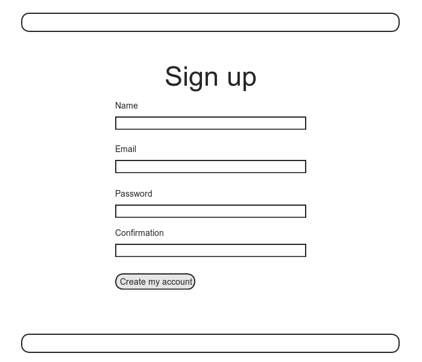
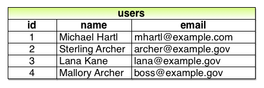
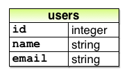
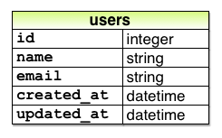
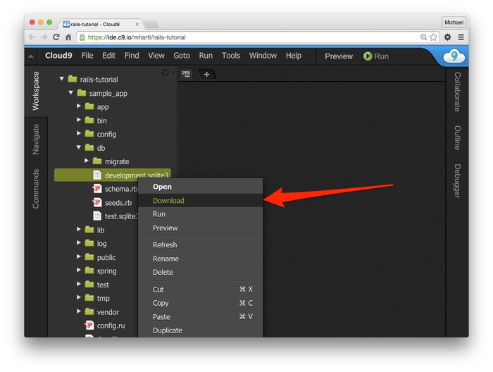

# 제 6장 유저의 모델을 작성해보자 

[제 5장](Chapter5.md) 에서는 새로운 유저를 작성하기 위한 더미용 웹페이지를 작성한 후 끝내었습니다. ([5.4](Chapter5.md#54-User의-등록-첫-테스트)) 이제부터 6개의 챕터에 걸쳐서 유저 등록용 페이지를 작성해볼 것 입니다. 이번 챕터에서는 제일 중요한 부분인 유저의 *데이터 모델* 의 작성과, 데이터를 저장하기 위한 수단을 확보하는 것에 대해 배워볼 것입니다. 제 7장에서는 유저가 사이트에 등록할 수 있도록 하고 유저의 프로필 작성을 위한 페이지를 만들 것입니다. 유저 등록이 가능하게 되면, 로그인이나 로그아웃을 할 수 있는 처리를 구현해보고, (제 8장과 제 9장) 제 10장부터는 해킹 등의 악질적인 접근 등을 막기 위한 방법에 대해 배워볼 것입니다. (10.2.1) 마지막에 제 11장과 제 12장에서는 메일주소를 활용한 ID의 유효화 방법과 패스워드를 재설정하는 방법에 대해 배웁니다. 정리하자면 제 6장부터 제 12장에 걸쳐 Rails의 로그인과 인증시스템을 개발해볼 것입니다. 이미 알고 계신 분들도 계시겠지만, Rails에서는 이미 여러가지 인증 방법이 구현되어 있어서 쉽게 사용해볼 수 있습니다. 컬럼 6.1에서는 적어도 한 번은 자신이 직접 인증 시스템을 만들어 보는 이유에 대해서 설명하고 있습니다.

###### 컬럼 6.1 직접 만들어보는 인증 시스템

> 사실상, 모든 Web 어플리케이션은 어떠한 로그인/인증 시스템을 필요로 하고 있습니다. 때문에, 많은 Web 프레임워크에서는 이러한 로그인/인증 시스템을 구현하기 위한 많은 선택지를 제공하고 있습니다. Rails도 예외는 아닙니다. 인증(*authentication*) 과 허가(*authorization*) 시스템을 예로 들어보자면, [Clearance](https://github.com/thoughtbot/clearance), [Authlogic](https://github.com/binarylogic/authlogic), [Devise](https://github.com/plataformatec/devise), [CanCan](http://railscasts.com/episodes/192-authorization-with-cancan) 등이 있습니다. (Rails만의 aplication이라면, [OpenID](https://ja.wikipedia.org/wiki/OpenID) 이나 [OAuth](https://ja.wikipedia.org/wiki/OAuth) 를 이용하여 구축해보는 방법도 있습니다.) 어째서 이미 구현되어있는 시스템을 처음부터 다시 만드는 가. 라는 질문을 할 수도 있습니다. 자신이 일부러 만들지 않아도, 언제든지 편하게 쓸 수 있는 방법을 그냥 이용하면 안되는 걸까요?

> 어떤 실제적인 실험에 의하면, 많은 사이트의 인증시스템은 방대한 커스터마이즈를 필요로하기 때문에, 서드파티 제품을 변경해서 도입하는 경우에는 시스템을 제로부터 만드는 것보다 더 많은 양의 작업을 요한다는 결과가 있습니다. 게다가 기존의 시스템은 내부 구조를 파악하기 힘든 경우가 많습니다. 자신이 직접 구현한 시스템이라면, 내부 구조를 매우 잘 파악하고 있을 것입니다. 게다가 최근의 Rails의 변경으로 인해 커스텀 인증 시스템을 쉽고 편하게 개발할 수 있게 되었습니다. 그리고 혹여나 서드파티의 인증시스템을 도입한다고 해도, 자기 자신이 인증시스템을 구축한 경험이 있다면, 서드파티 제품을 이해하고 변경하는 것이 꽤나 손쉬운 작업이 될 수도 있습니다.

## 6.1 User 모델

여기부터 3개의 챕터에 걸친  최종 목표로는 유저 등록용 페이지를 작성하는 것입니다만, 지금 상태로는 새로운 유저의 정보가 입력되어도 그것을 저장할 곳이 없기 때문에, 당장 페이지를 작성할 수도 없습니다. 유저 등록 기능을 구현할 때에는 일단 유저의 정보를 저장할 수 있기 위해, 데이터 구조를 만들 필요가 있습니다.



Rails에서는, 데이터모델로 사용하기 위한 기본 데이터구조를 모델 (*Model*) 이라고 합니다. ([1.3.3](Chapter1.md#133-Model---View--Controller-MVC) 에서의 MVC의 M입니다.) Rails에서는 데이터를 저장하기 위한 기본 해결책으로써 데이터베이스를 사용하여 데이터를 장기저장 할 수 있습니다. 또한 데이터베이스와 통신을 하는 Rails 기본 라이브러리는 *Active Record* 라고 부릅니다. Active Record는, 데이터 오브젝트의 생성/저장/검색을 위한 메소드를 가지고 있습니다. 메소드를 사용할 때에는 [관계형 데이터베이스](https://ja.wikipedia.org/wiki/関係データベース) 에서 다루는 SQL (*Structured Query Language*) 를 의식할 필요가 없습니다. 게다가 Rails에는 마이그레이션(*Migration*) 이라고 하는 기능이 있습니다. 데이터의 정의를 Ruby로 작성할 수가 있으며, SQL의 DDL (*Data Definition Language*)를 새롭게 배울 필요도 없습니다. 즉, Rails는 데이터베이스의 세부적인 부분을 거의 완전하게 숨기고 있습니다. 실제로 본 튜토리얼에서는 SQLite를 개발환경에서 사용할 것이며, PostgreSQL를 (Heroku를 이용한) 실제 배포환경에서 사용할 것입니다([1.5](Chapter1.md#15-배포해보자)) 만, 실제 배포환경의 데이터 저장방법에 대해서는 고민할 필요가 거의 없습니다.


Git으로 버전관리를 하고 있다면, 이 대목에서 유저를 모델링하기 위해, 토픽브랜치를 생성합시다.

`$git checkou -b modeling-users`

### 6.1.1 Database

[4.4.5](Chapter4.md#445-User-Class) 에서 다루었던 커스텀 클래스 `User` 를 떠올려보세요. 이 클래스는 `name` 과 `email` 을 속성으로 가지는 유저 오브젝트였습니다. 이 클래스는, 해당 섹션을 이해하기 위한 목적을 가지고 제공되었습니다만, Rails에서 매우 중요한 부분인, 영속성(*Persistence*) 에 대한 요소가 빠져있었습니다. Rails콘솔에서 User클래스의 오브젝트를 생성하여도, 콘솔에서 exit하ㄴ 해당 오브젝트는 바로 삭제되었습니다. 이번 섹션에서의 목적은, 간단하게 삭제되지 않는 유저의 모델을 구축해볼 것입니다.


[4.4.5](Chapter4.md#445-User-Class) 의 유저클래스와 마찬가지로, `name`과 `email` 의 2개의 속성을 가진 유저를 모델링하는 부분부터 시작해봅시다. email를 유니크한( 단 하나밖에 없는) 유저이름으로써 사용해보겠습니다. (패스워드를 위한 속성은 6.3에서 다룹니다.) 이전 4장에서의 코드는 아래처럼 Ruby의 `attr_accessor` 메소드를 사용하였습니다.

```ruby
class User
  attr_accessor :name, :email
  .
  .
  .
end
```

그 때와는 대조적으로, Rails에서 유저를 모델링할 떄는, 속성을 명시적으로 식별할 필요가 없습니다. 위에서 간결하게 말씀드렸다시피, Rails는 데이터를 저장할 때 기본적으로 관계형 데이터베이스를 사용합니다. 관계형 데이터베이스는, 데이터행 으로 구성되는 테이블로 이루어져 있으며, 각 행은 데이터 속성의 컬럼(열) 을 가지고 있습니다. 예를 들어, name과 email을 가진 유저를 저장하는 것이라면, `name`과 `email` 의 컬럼을 가진 `users` 라는 테이블을 작성합니다. (각 행은 1명의 유저를 나타냅니다.) 테이블에 저장되는 데이터의 예시와 그것에 대응하는 데이터 모델을 아래의 그림으로 나타내고 있습니다.(초안) `name`과 `email` 등의 컬럼이름은, 지금 생각해놓는 것이 나중에 User 오브젝트의 각 속성읠 Active Record에 전달할 때에 편해집니다.






또한, 5장에서 생성한 유저 컨트롤러(와 `new`액션)에 사용한 다음 커맨드를 떠올려주세요.

`$ rails generate controller Users new`

모델을 생성할 때는, 위 커맨드와 닮은 패턴으로 `generate model` 이라고 하는 커맨드를 사용합니다. 게다가 이번에는 `name` 이나 `email`이라고 하는 속성을 더한 User모델을 사용할 것이기 때문에, 실제로 사용할 커맨드는 아래와 같습니다.

```
$ rails generate model User name:string email:string
      invoke  active_record
      create    db/migrate/20160523010738_create_users.rb
      create    app/models/user.rb
      invoke    test_unit
      create      test/models/user_test.rb
      create      test/fixtures/users.yml
```

(컨트롤러이름에는 복수형을 사용하고, 모델형에는 단수형을 사용하는 관습을 꼭 익혀두도록 하세요. 컨트롤러는 Users, 모델은 User 입니다.) `name:string`나 `email:string` 옵션의 파라미터를 넘김으로써 데이터베이스에서 사용하려고 하는 2개의 속성을 Rails에 입력합니다. 이 때, 이러한 속성의 타입정보도 같이 전달됩니다. (이 경우에는 `string` ) 예전에 컨트롤러를 작성할때, 액션이름을 사용하여 생성했던 것을 떠올려주세요.


위 커맨드에 있는 `generate` 커맨드의 결과를 보면 알 수 있듯, *마이그레이션* 이라고 불리는 새로운 파일이 생성됩니다. 마이그레이션은, 데이터베이스의 구조를 변경하는 수단을 제공합니다. 데이터베이스의 구조가 변경되었을 때에, 데이터 모델을 손쉽게 변경할 수 있습니다. 이 User모델의 경우, 마이그레이션은 모델 생성 스크립트에 의해 자동적으로 작성됩니다. 아래의 코드에서 나타내는 것 처럼, `name`과 `email` 2개의 컬럼을 가지는 `users` 테이블을 작성합니다. (6.2.5 에서, 마이그레이션을 수동으로 작성하는 방법에 대해 설명해봅니다.)

```ruby
# db/migrate/[timestamp]_create_users.rb
class CreateUsers < ActiveRecord::Migration[5.0]
  def change
    create_table :users do |t|
      t.string :name
      t.string :email

      t.timestamps
    end
  end
end
```

마이그레이션 파일이름의 앞에는, 해당 파일이 생성된 시간의 타임스탬프가 추가되어 있습니다. 이전에는 어떠한 파일이 변경될때는, 숫자를 추가해서 버전관리처럼 하는 것이 있었습니다만, 여러명의 개발자로 구성된 팀에서는, 같은 숫자를 가진 마이그레이션 파일을 생성해버리는 경우가 있어서, 충돌을 일으키곤 했습니다. 현재의 타임스탬프를 가지는 방법을 이용한다면, 정말 동시에 마이그레이션 파일을 생성하는 경우가 아닌 이상, 그러한 충돌을 막을 수 있습니다.


마이그레이션 파일 자체는, 데이터베이스에 변경사항을 정의하는 `change` 메소드의 모임입니다. 위 코드의 경우, `change` 메소드는 `create_table` 라고하는 Rails의 메소드를 호출해서 유저를 저장하기 위한 테이블을 데이터베이스에 작성합니다. `create_table` 메소드는 블록변수를 1개 가지는 블록 ([4.3.2](Chapter4.md#432-블록)) 을 사용합니다. 여기서 ("table"의 앞문자를 따서) 블록변수는 `t`를 사용합니다. 해당 블록 안에서 `create_table` 메소드는 `t` 오브젝트를 사용하여 `name`과 `email` 컬럼을 데이터베이스에 작성합니다. 타입은 양쪽 다 `string` 입니다. 모델이름은 단수형(User) 입니다만, 테이블 이름은 복수형(`users`) 입니다. 이것은 Rails에서의 "이름" 의 관습을 그대로 적용하고 있습니다. 모델은 하나의 유저를 나타내는 것에 반해, 데이터베이스의 테이블은 여러 유저들로인해 구성됩니다. 블록의 마지막 행의 `t.timestamp` 는 특별한 커맨드로, `created_at` 과 `update_at` 이라고 하는 2개의 "*매직 컬럼(Magic Columns)*" 을 생성합니다. 어떠한 유저가 생성 혹은 갱신되었을 때 해당 시각을 자동적으로 기록하는 타임스탬프입니다. (이 매직컬럼의 사용 예시는 6.1.3 에서 구체적으로 설명합니다.) 위 코드의 마이그레이션에 의해 생성된 완전한 데이터모델은 아래와 같습니다.



마이그레이션은 다음 `db:migrate` 커맨드를 사용하여 실행할 수 있습니다. 이것을 *마이그레이션의 적용(migrating up)* 이라고 합니다.

`$ rails db:migrate`

([2.2](Chapter2.md#22-User-리소스) 에서 해당 커맨드를 비슷한 상황에서 실행한 적이 있을 꺼라 생각합니다.) 처음 `db:migrate` 를 실행하면, `db/development.sqlite3` 이라고 하는 이름의 파일이 생성됩니다. 이것은 [SQLite](http://sqlite.org/) 데이터베이스의 실체입니다. `development.sqlite3` 파일을 열어보기 위해, [DB Browser for SQLite](http://sqlitebrowser.org/) 라고 하는 멋진 프로그램을 사용하면, 데이터베이스의 구조를 확인할 수 있습니다. (클라우드IDE를 사용하는 경우에는, 아래 첫 번째 그림처럼 일단 파일을 로컬환경으로 다운로드할 필요가 있습니다.) 결과는 아래 두 번째처럼 됩니다. 위 마이그레이션에 의해 생성된 데이터모델과 비교해보세요. 아래 두 번째 그림 안에, `id` 이라고 하는 마이그레이션을 설명할 때, 설명하지 않은 컬럼이 있습니다. [2.2](Chapter2.md#22-User-리소스) 에서 간단하게 설명드린 것 처럼, 해당 컬럼은 자동적으로 생성되며 Rails가 각 데이터를 유니크하게 인식하기 위하 사용합니다.




##### 연습

1. Rails는 `db/` 디렉토리 안에 있는 `schema.rb` 라고 하는 파일을 사용합니다. 이 파일은 데이터베이스의 구조 (*스키마 (Schema)* 라고 부릅니다.) 를 확인하기 위해 사용됩니다. 여러분의 환경에 있는 `db/schema.rb` 의 내용을 확인하고, 해당 내용과 마이그레이션 파일의 내용을 비교해보세요.

2. 거의 모든 마이그레이션은, *원래의 상태로 되돌리는 것이 가능* 합니다. (적어도 본 튜토리얼에서는 모든 마이그레이션 파일을 원래대로 되돌릴 수 있습니다.) 원래대로   되돌리는 것을 "*롤백(Rollback)*" 이라고 하며, Rails에서는 `db:rollback` 이라고 하는 커맨드로 실행해볼 수 있습니다.

   `$ rails db:rollback`

   위 커맨드를 실행 후, `db/schema.rb` 의 내용을 확인하고, 롤백에 성공했는지 아닌지 확인해보세요. ([컬럼 3.1](Chapter3.md#컬럼-33-결국-테스트는-언제-하는-것이-좋은가) 에서는 마이그레이션에 관한 다른 테크닉도 설명하고 있으니 참고해주세요.) 위 커맨드에서는 데이터베이스로부터 users테이블을 삭제하기 위해 `drop_table` 커맨드를 내부에서 호출하고 있습니다. 해당 커맨드가 제대로 실행되는 것은, `drop_table` 과 `create_table` 가 각각 대응하고 있는 것을 `change` 메소드가 이미 알고 있기 때문입니다. 이 대응관계를 알고 있기 때문에, 롤백를 하기 위한 역 마이그레이션을 간단히 실현할 수 있습니다. 또한 어떠한 컬럼을 삭제하려고 하는 마이그레이션의 경우, `change` 메소드 대신에 `up` 과 `down` 메소드를 각각 정의할 필요가 있습니다. 자세한 것은 Rails 가이드 [Active Record 마이그레이션](http://railsguides.jp/active_record_migrations.html) 을 참고해주세요.

3. 다시 한 번 더 `rails db:migrate` 커맨드를 실행하여 `db/schema.rb` 의 내용이 제대로 돌아와있는지 확인해보세요.

### 6.1.2 Model 파일

지금까지 User 모델을 생성하는 것으로 인해, 어떠한 과정으로  마이그레이션 파일이 생성되는지 확인해보았습니다. 또한 마이그레이션을 실행하여 데이터 베이스의 테이블이 어떠한 구조로 생성되는 지도 확인해보았습니다. `users` 테이블을 생성하였기 때문에, `development.sqlite3` 라고 하는 파일이 수정되어 `id`, `name`, `email`, `created_at`, `updated_at` 이 작성되었을 것입니다. 또한 `generate model` 를 실행한 것으로, 모델용의 `user.rb` 도 생성되었습니다. 이번 섹션에서는 이 후의 모델용 파일에 대해 설명해보겠습니다.


우선, `app/models/` 디렉토리에 있는, `user.rb` 에 작성되어있는 User모델의 코드를 확인해봅시다. 이것은 매우 간결하게 정리되어 있는 코드입니다.

```ruby
# app/models/user.rb
class User < ApplicationRecord
end	
```

  [4.4.2](Chapter4.md#442-Class의-상속) 에서 배운 것을 떠올려봅시다. `class User < ApplicationRecord` 라고 하는 코드에서, `User` 클래스는 `ApplicationRecord` 를 상속하고 있기 때문에, User 모델은 자동적으로 `ActiveRecord::Base` 클래스의 모든 기능을 가지게 됩니다. 그렇다고는 해도, 상속받는 것을 알고 있다고 해도 `ActiveRecord::Base` 에 포함되어 있는 메소드에 대해 알고 있지 않으면 아무런 쓸모도 없습니다. 앞으로 해당 클래스로 무엇을 할 수 있는지 같이 알아가봅시다.

##### 연습

1. Rails 콘솔을 실행하고, `User.new` 로 `User`  클래스의 오브젝트를 생성할 수 있는 것을 확인해봅시다. 그리고 해당 오브젝트가 `ApplicationRecord` 을 상속하고 있는 것을 확인해봅시다. (*Hint*: [4.4.4](Chapter4.md#444-Controller-Class) 에 말씀드린 기술을 사용해보세요.)
2. 마찬가지로, `ApplicationRecord` 가 `ActiveRecord::Base` 를 상속받고 있는 것을 확인해보세요.

### 6.1.3 User Object를 생성해보자

[제 4장](Chapter4.md) 과 마찬가지로, Rails 콘솔을 사용하여 데이터 모델에 대해 알아봅시다. (이 시점에서는) 데이터베이스를 변경하고 싶진 않으니, 콘솔의 샌드박스 모드를 사용해봅시다.

```
$ rails console --sandbox
Loading development environment in sandbox
Any modifications you make will be rolled back on exit
>>
```

"Any modifications you make will be rolled back on exit" 라고 하는 메세지가 알기 쉽게 출력되고 있습니다. 즉, 콘솔을 샌드박스 모드로 실행하게 되면, 콘솔을 종료할 때는 데이터베이스 등에 적용된 변경사항은 모두 적용취소 (롤백)됩니다.


[4.4.5](Chapter4.md#445-User-Class) 의 콘솔세션에서는 `User.new` 로 새로운 유저 오브젝트를 생성했습니다만, 그 이후 example_user 파일을 명시적으로 require하기 전까지는, 해당 오브젝트에는 접근할 수 없었습니다. 그러나 모델을 사용하면 상황이 달라집니다. [4.4.4](Chapter4.md#444-Controller-Class) 에서 본 것 처럼, Rails 콘솔은 기동할 때 Rails의 환경을 자동적으로 읽어들이며, 모델도 포함됩니다. 즉, 새로운 유저 오브젝트를 생성할 때는 추가 작업을 하지 않아도 된다는 것입니다.

```
>> User.new
=> #<User id: nil, name: nil, email: nil, created_at: nil, updated_at: nil>
```

위 출력은, 유저오브젝트를 콘솔용으로 출력한 것입니다.


`User.new` 를 파라미터 없이 호출한 경우에는, 모든 속성이 `nil` 의 오브젝트를 리턴합니다. [4.4.5](Chapter4.md#445-User-Class) 에서는 오브젝트의 속성을 설정하기 위해 초기화 해시(hash) 를 파라미터로 사용하는 User 클래스(user_example.rb) 를 설계해보았습니다. 마찬가지 방법으로 오브젝트를 초기화하는 Active Record를 기초로 하고 있습니다. 

```ruby
>> user = User.new(name: "Michael Hartl", email: "mhartl@example.com")
=> #<User id: nil, name: "Michael Hartl", email: "mhartl@example.com",created_at: nil, updated_at: nil>
```

위와 마찬가지로 name과 email 속성이 예상한대로 설정된 것을 알 수 있습니다.


Active Record를 이해하고 있으면서, "*유효성 (Validity)*" 이라고 하는 개념도 또한 중요합니다. 6.2 에서 자세하게 설명하겠습니다만, 지금은 일단 `user`오브젝트가 유효한지 확인해봅시다. 확인하기 위해서는 `valid?` 메소드를 사용해봅시다.

```ruby
>> user.valid?
true
```

현 시점에서는 아직 데이터베이스에 데이터를 저장하지 않았습니다. 즉, `User.new` 는 메모리 상에서의 오브젝트를 생성한 것 뿐이며, `user.valid?` 라고 하는 코드는 오브젝트 자체가 유효한지 확인한 결과인 것입니다. (데이터베이스에 데이터가 존재하는지는 유효성과는 관계없습니다.) 데이터베이스에 User오브젝트를 저장하기 위해선, `user` 오브젝트에서 `save` 메소드를 호출할 필요가 있습니다.

```ruby
>> user.save
   (0.1ms)  SAVEPOINT active_record_1
  SQL (0.8ms)  INSERT INTO "users" ("name", "email", "created_at",
  "updated_at") VALUES (?, ?, ?, ?)  [["name", "Michael Hartl"],
  ["email", "mhartl@example.com"], ["created_at", 2016-05-23 19:05:58 UTC],
  ["updated_at", 2016-05-23 19:05:58 UTC]]
   (0.1ms)  RELEASE SAVEPOINT active_record_1
=> true
```

`save` 메소드는, 성공하면 `true` , 실패하면 `false` 를 리턴합니다. (지금은 저장하면 무조건 성공할 것입니다. 실패하는 경우는 6.2에서 설명합니다.) 또한 Rails 콘솔에서는 `user.save` 에 대응하는 SQL 커맨드나 그 결과 (`INSER INTO "users"....`) 를 표시하도록 되어 있습니다. 또한 본 튜토리얼에서는 SQL구문 그 자체가 필요한 경우는 거의 없기 때문에, SQL커맨드에 대한 해설은 하지 않겠습니다. 그렇다고는 해도 Active Record에 대응하는 SQL커맨드를 그냥 훑어보기만 해도 큰 공부가 되긴 할 것입니다.


생성한 시점에서의 유저 오브젝트는, id속성, 매직컬럼인 `created_at` 속성과 `updated_at` 속성의 값이 모두 `nil` 이 되어 있었을 것입니다. `save` 메소드를 실행 한 후에는 어떠한 것이 변경되었는지 확인해봅시다.

```ruby
>> user
=> #<User id: 1, name: "Michael Hartl", email: "mhartl@example.com",created_at: "2016-05-23 19:05:58", updated_at: "2016-05-23 19:05:58">
```

위 결과로부터 `id` 에는 `1` 이라는 값이 들어가 있습니다. 한 편, 매직컬럼에는 현재 시간이 입력되어있는 것을 확인할 수 있을 것입니다. 생성과 갱신의 타임스탬프는 똑같은 값입니다만, 데이터를 갱신하면 (6.1.5) 해당 값도 변할 것입니다.


[4.4.5](Chapter4.md#445-User-Class) 의 User클래스와 마찬가지로, User 모델의 인스턴스에는 닷기법을 사용하여 해당 속성에 접근할 수 있습니다.

```ruby
>> user.name
=> "Michael Hartl"
>> user.email
=> "mhartl@example.com"
>> user.updated_at
=> Mon, 23 May 2016 19:05:58 UTC +00:00
```

자세한 것은 제 7장에서 설명하겠습니다만, 위의 결과처럼 모델의 생성과 저장을 2가지 단계로 나눈다면 조금은 편해집니다. 그러나 Active Record에는 `User.create` 로 모델의 생성과 저장을 동시에 하는 방법도 제공합니다.

```ruby
>> User.create(name: "A Nother", email: "another@example.org")
#<User id: 2, name: "A Nother", email: "another@example.org", created_at:"2016-05-23 19:18:46", updated_at: "2016-05-23 19:18:46">
>> foo = User.create(name: "Foo", email: "foo@bar.com")
#<User id: 3, name: "Foo", email: "foo@bar.com", created_at: "2016-05-2319:19:06", updated_at: "2016-05-23 19:19:06">
```

`User.create`는 `true`, `false`를 리턴하는 대신에, 유저 오브젝트 자신을 리턴합니다. 리턴된 유저 오브젝트는 (위 2번쨰의 커맨드에 있는 `foo` 처럼) 변수에 대입할 수도 있습니다.


`destroy`는 `create` 의 반대입니다.

```ruby
>> foo.destroy
   (0.1ms)  SAVEPOINT active_record_1
  SQL (0.2ms)  DELETE FROM "users" WHERE "users"."id" = ?  [["id", 3]]
   (0.1ms)  RELEASE SAVEPOINT active_record_1
=> #<User id: 3, name: "Foo", email: "foo@bar.com", created_at: "2016-05-23 19:19:06", updated_at: "2016-05-23 19:19:06">
```

  `create` 와 마찬가지로, `destroy` 는 해당 오브젝트 자신을 리턴합니다만, 해당 리턴값을 사용하여 다시 한 번 더 `destroy` 를 실행할 수는 없습ㄴ디ㅏ. 게다가 삭제된 오브젝트는 다음과 같이 아직 메모리에 남아있습니다.

```ruby
>> foo
=> #<User id: 3, name: "Foo", email: "foo@bar.com", created_at: "2016-05-23 19:19:06", updated_at: "2016-05-23 19:19:06">
```

그렇다면, 오브젝트가 정말로 삭제되었는지 어떻게 확인하면 좋을까요? 그리고 저장하고 삭제하지 않은 오브젝트의 경우, 어떻게 데이터베이스로부터 유저를 조회해볼 수 있을까요. 위 질문들에 대한 답으로는, Active Record를 사용하여 User 오브젝트를 검색하는 방법에 대해 배울 필요가 있습니다.

##### 연습

1. `user.name` 과 `user.email` 가 어느쪽이든 `String` 클래스의 인스턴스라는 것을 확인해보세요.
2. `created_at`, `updated_at` 는 어떠한 클래스의 인스턴스입니까?

### 6.1.4 User Object를 검색해보자

Active Record는 오브젝트를 검색하기 위한 방법을 몇가지 제공하고 있습니다. 이 기능들을 사용하여 과거에 작성한 제일 첫 번째 유저를 검색해봅시다. 또, 세 번째의 유저 (`foo`) 가 삭제되는 것을 확인해봅시다. 일단 존재하는 유저부터 검색해봅시다.

```ruby
>> User.find(1)
=> #<User id: 1, name: "Michael Hartl", email: "mhartl@example.com",created_at: "2016-05-23 19:05:58", updated_at: "2016-05-23 19:05:58">
```

여기는 `User.find` 의 유저의  id를 넘기고 있습니다. 그 결과 Active Record는 해당 id의 유저를 리턴하고 있습니다.


다ㅁ으로, `id=3` 의 유저가 데이터베이스에 존재하는지 확인해봅시다.

```ruby
>> User.find(3)
ActiveRecord::RecordNotFound: Couldn't find User with ID=3
```

[6.1.3](#613-User-Object를-생성해보자) 에서 3번째 유저를 삭제했기 떄문에, Active Record는 해당 유저를 데이터베이스 안에서 찾아낼 수 없습니다. 대신에 `find` 메소드의 예외(*Exception*) 을 확인할 수 있습니다. 예외는, 프로그램이 실행될 때 어떠한 예외적인 이벤트가 발생한 것을 나타냅니다. 위 경우, 존재하지 않는 Active Record의 id에 의하여 `find` 에서 `Active Record::RecordNotFound` 라 하는 예외가 발생하고 있습니다.


일반적인 `find` 메소드 이외에, Active Record에는 특정한 속성으로 유저를 검색할 수 있는 방법도 있습니다.

```ruby
>> User.find_by(email: "mhartl@example.com")
=> #<User id: 1, name: "Michael Hartl", email: "mhartl@example.com",created_at: "2016-05-23 19:05:58", updated_at: "2016-05-23 19:05:58">
```

지금까지 메일주소를 유저이름으로 사용했기 때문에, 이러한 `find` 관련 메소드는 유저를 사이트에 로그인시키는 방법을 배울 때에 도움될 것입니다. (제 7장) 유저 수가 엄청나게 증가한다면, `find_by` 으로는 검색효율이 떨어질 수도 있다고 걱정하시는 분이 있을 수 있으나, 걱정하지 않으셔도 됩니다. 해당 문제 및 데이터베이스의 인덱스를 사용한 해결책에 대해, 6.2.5에서 학습합니다.


유저를 검색하는 일반적인 방법을 조금 더 소개해보겠습다. 일단은 `first` 메소드입니다.

```ruby
>> User.first
=> #<User id: 1, name: "Michael Hartl", email: "mhartl@example.com",created_at: "2016-05-23 19:05:58", updated_at: "2016-05-23 19:05:58">
```

단어 그대로, `first` 는 단순하게 데이터베이스의 제일 첫 번째 데이터를 찾아냅니다. 다음으로는 `all` 입니다. 

```ruby
>> User.all
=> #<ActiveRecord::Relation [#<User id: 1, name: "Michael Hartl",email: "mhartl@example.com", created_at: "2016-05-23 19:05:58",updated_at: "2016-05-23 19:05:58">, #<User id: 2, name: "A Nother",email: "another@example.org", created_at: "2016-05-23 19:18:46",updated_at: "2016-05-23 19:18:46">]>
```

콘솔의 출력결과를 본다면, `User.all` 에서 데이터베이스의 모든 User오브젝트를 습득하고 있는 것을 알 수 있습니다. 또한 습득한 오브젝트의 클래스가 `ActiveRecord::Relation` ㅇㅡ로 되어있습니다. 이것은 해당 오브젝트를 배열로써 효율적으로 다루기 위한 클래스입니다. ([4.3.1](Chapter4.md#431-배열과-범위연산자))

##### 연습

1. `name` 을 사용하여 유저 오브젝트를 검색해보세요. 또한 `find_by_name` 메소드를 사용할 수 있는 것도 확인해보세요. (예전 버전의 Rails 어플리케이션에서는, 예전버전의 `find_by` 메소드를 자주 접할 수 있을 것입니다.)
2. 실용적 목적을 위해, `User.all` 은 마치 배열을 다루듯 다루는 것이 가능합니다만 실제로는 배열은 아닙니다. `User.all` 이 생성되는 오브젝트를 알아보고, `Array` 클래스가 아닌, `User::ActiveRecord_Relation` 클래스인 것을 확인해보세요.
3. `User.all` 에서 `length` 를 호출하면, 해당 길이를 구할 수 있는 것을 확인해보세요.([4.2.3](Chapter4.md#423-오브젝트-메세지의-송수신)) Ruby의 기능으로, 해당 클래스를 자세히 몰라도 오브젝트를 어떻게 다루면 될지 알 수 있는 기능이 있습니다. 이것을 덕 타이핑(*duck typing*) 이고 부르며, 다음과 같은 격언으로 표현되기도 합니다. "오리와 같은 모습으로, 오리처럼 운다면 그것은 오리일 것이다."

### 6.1.5 User Object를 수정해보자

일단 오브젝트를 생성했다면, 그 다음은 몇번이고 수정해보고 싶어질 것입니다. 기본적인 수정방법은 2가지입니다. 하나는 [4.4.5](Chapter4.md#445-User-Class) 에 한 것 처럼, 속성을 개별적으로 대입하는 것입니다.

```ruby
>> user           # userオブジェクトが持つ情報のおさらい
=> #<User id: 1, name: "Michael Hartl", email: "mhartl@example.com",created_at: "2016-05-23 19:05:58", updated_at: "2016-05-23 19:05:58">
>> user.email = "mhartl@example.net"
=> "mhartl@example.net"
>> user.save
=> true
```

변경사항을 데이터베이스에 저장하기 위해 마지막에 save를 실행할 필요가 있다는 것을 잊어선 안됩니다. 저장을 하지 않고 `reload` 를 실행해버리면, 데이터베이스의 정보는 수정 전의 오브젝트를 다시 읽어들이기 때문에, 다음과 같은 결과가 됩니다.

```ruby
>> user.email
=> "mhartl@example.net"
>> user.email = "foo@bar.com"
=> "foo@bar.com"
>> user.reload.email
=> "mhartl@example.net"
```

`user.save` 를 실행하여 유저 데이터를 수정해보았습니다. 이 때, [6.1.3](#613-User-Object를-생성해보자) 에서 처럼, 매직컬럼의 수정날짜도 갱신되는 것을 확인해주세요.

```ruby
>> user.created_at
=> "2016-05-23 19:05:58"
>> user.updated_at
=> "2016-05-23 19:08:23"
```

속성을 수정하는 방법으로 다른 방법으로는, `update_attributes` 를 사용하는 것입니다.

```ruby
>> user.update_attributes(name: "The Dude", email: "dude@abides.org")
=> true
>> user.name
=> "The Dude"
>> user.email
=> "dude@abides.org"
```

`update_attributes` 메소드는 속성의 해시값을 받아, 수정을 성공한다면, 수정과 동시에 데이터베이스로의 저장을 진행합니다. (저장을 성공하면 `true` 를 리턴합니다.) 단, 수정을 실패하면 `update_attributes` 메소드의 실행은 실패하게 됩니다. 예를 들어 6.3에서의 소스코드라면, 패스워드가 필요하게되어 데이터 수정할 떄의 검증을 실패하게 됩니다. 특정 속성만 수정하고 싶을 때에는 다음과 같이 `update_attributes` 를 사용합니다. 이 `update_attributes` 는 데이터의 검증을 회피하는 효과도 있습니다.

```ruby
>> user.update_attribute(:name, "El Duderino")
=> true
>> user.name
=> "El Duderino"
```

##### 연습

1. user 오브젝트의 name속성을 수정하고, `save` 로 데이터베이스로의 저장을 해봅시다.
2. 이번에는 `update_attributes` 를 사용하여, email 속성을 수정 및 저장해봅시다.
3. 마찬가지로, 매직컬럼인 `created_at` 도 직접 수정할 수 있는지 확인해봅시다. *Hint*: 수정할 떄에는 "`1.year.ago`"라고 작성하면 편리합니다. 이 것은 Rails의 시간 지정방식 중 하나로써, 현재의 시간으로부터 1년 전의 시간을 계산해줍니다.


## 6.2 User를 검증해보자

드디어 [6.1](#61-User-모델) 에서 만든 User모델에, 접근할 수 있는 `name` 과 `email` 속성을 추가해보았습니다. 그러나 해당 속성들은 어떠한 형태의 값도 저장할 수 있습니다. 지금은 (공백문자도 포함) 모든 문자열을 유효하게 저장할 수 있습니다. 이름과 메일주소에 대해서는 조금 더 어떠한 제한을 걸어두는 것도 좋을 것 같습니다. 예를 들어, `name` 은 빈 문자열이면 안되며, `email` 은 메일 주소의 포맷에 따라 입력할 필요가 있습니다. 게다가 메일 주소를 유저가 로그인할 때 유일무이한 유저이름으로써 사용하게 하기위해, 메일 주소가 데이터베이스 내부에서 중복되지 않도록 하는 것이 필요합니다.


즉, `name` 과 `email` 에 모든 문자열을 저장할 수 있는 것은 바람직하지 않은 것입니다. 해당 속성 값에는 어떠한 제약을 걸어둘 필요가 있는 것입니다. Active Record에는 *검증 (Validation)* 이라고 하는 기능을 통해, 이러한 제약들을 걸 수 있습니다. (실은 [2.3.2](Chapter2.md#232-Micropost를-micro하게-해보자) 에서 살짝 사용해보았습니다.) 이번 섹션에서는 자주 사용되는 케이스들 중 몇가지에 대해 설명하고자 합니다. *존재성(presence)* 의 검증, *길이(length)* 의 검증, *포맷(format)* 의 검증, *유니크성(uniqueness)* 의 검증 입니다. 6.3.2에서는 자주 사용되는 최종적인 검증방법으로써 *확인(confirmation)* 을 추가해볼 것입니다. 7.3에서는 유저가 제약을 위반했을 때, 검증 기능에 의해 자동적으로 표시되는 유용한 에러메세지를 출력해볼 것입니다.

### 6.2.1 유효성을 검증해보자

[컬럼 3.3](Chapter3.md#컬럼-33-결국-테스트는-언제-하는-것이-좋은가) 에서 언급한 것 처럼, 테스트 주도 개발은, 업무에서 항상 정답이라고는 할 수 없지만, 모델의 검증 기능은, 테스트 주도 개발론과 찰떡궁합이라고 말할 수 있습니다. 검증 기능은 매우 훌륭합니다만, 제대로 동작하고 있는지 확신하는 것은 매우 어렵습니다. 그러나 (테스트 주도 개발과 마찬가지로) 일단 실패하는 테스트를 작성하고, 그 다음으로 테스트를 성공시키는 방법으로 코드를 구현하면, 기대한 대로 움직인다는 확신을 가질 수 있습니다.


구체적인 테스트 방법에 대해서는, 일단 *유효* 한 모델의 오브젝트를 작성하고, 해당 속성 중 하나를 유효하지 않은 속성으로 의도적으로 변경해봅니다. 그리고 검증 단계에서 실패하는지 어떤지를 테스트해보는 식으로 진행해봅니다. 만약을 위해 맨 처음 작성한 상태에 대해서도 테스트 케이스를 작성하고, 모델이 유효한지를 확인해봅시다. 이렇게 테스트함으로써 검증 기능의 테스트가 실패했을 때, 검증 기능에 문제가 있었는지, 오브젝트 그 자체가 문제가 있는지 확인할 수 있습니다.


[6.1](#61-User-모델) 에서 커맨드를 실행하여, User용의 테스트 코드의 기반이 작성되어있을 것입니다. 일단 해당 내부를 확인해봅시다.

```ruby
# test/models/user_test.rb	
require 'test_helper'

class UserTest < ActiveSupport::TestCase
  # test "the truth" do
  #   assert true
  # end
end
```

유효한 오브젝트를 테스트 하는 테스트 코드를 작성하기 위해, `setup` 이라는 특수한 메소드를 사용하여 유효한 User오브젝트 (`@User`) 를 작성합니다. (해당 메소드는 [제 3장](Chapter3.md) 에서의 연습에서도 잠깐 다루었습니다. ) setup 메소드의 처리는, 각 테스트 코드가 실행되는 직전에 실행됩니다. `@user` 는 인스턴스 변수입니다만, setup메소드 내부에 선언해놓으면, 모든 테스트 케이스 내부에서 이 인스턴스 변수를 사용할 수 있게 됩니다. 따라서 `valid?` 메소드를 사용하여 User오브젝트의 유효성을 테스트해볼 수 있습니다. ([6.1.3](#613-User-Object를-생성해보자)) 작성한 코드는 아래와 같습니다.

```ruby
# test/models/user_test.rb
require 'test_helper'

class UserTest < ActiveSupport::TestCase

  def setup
    @user = User.new(name: "Example User", email: "user@example.com")
  end

  test "should be valid" do
    assert @user.valid?
  end
end
```

위 코드는, 심플한 `assert ` 메소드를 사용하여 테스트를 진행합니다.  `@user.valid?` 가 `true` 를 리턴하면 성공, `false` 를 리턴하면 실패하는 것입니다.


그렇다고는 해도, User 모델은 아직 검증할 수가 없기 때문에, 해당 테스트는 성공할 것 입니다.

```
$ rails test:models
```

위에서 `rails test:models` 라고 하는 커맨드를 실행하고 있습니다만, 이것은 모델에 관한 테스트만 실행하는 커맨드 입니다. ([5.3.4](Chapter5.md#534-링크의-테스트) 에서 사용한 `rails test:integration` 과 비슷합니다.)

##### 연습

1. 콘솔에서, 새롭게 만든 user 오브젝트가 유효 (valid) 한 것을 확인해봅시다.
2. [6.1.3](Chapter6.md#613-User-Object를-생성해보자) 에서 생성한 user 오브젝트도 유효한지 확인해봅시다.

### 6.2.2 존재성을 검증해보자

아마도 제일 기본적인 검증은 *존재성 (Presence)* 일 것 입니다. 단순히 파라미터로 넘겨진 속성이 존재하는지를 검증합니다. 예를 들어, 이번 챕터에서 유저가 데이터베이스에 저장되기 전에 name과 email 필드 둘 다 값이 존재하는 지를 보증합니다. 7.3.3 에서는 해당 인증을, 새롭게 유저를 작성 할 때의 유저 등록 폼에 적용해보는 방법을 배워보겠습니다.


일단 `name` 속성의 존재성에 관한 테스트를 추가해봅니다. 구체적으로는 아래의 코드와 같이, `@user` 변수의 `name` 속성에 대해 공백의 문자열을 세트합니다. 그 후 `assert_not` 메소드를 사용하여  User 오브젝트가 유효하지 않은 것을 확인해봅시다.

```ruby
# test/models/user_test.rb
require 'test_helper'

class UserTest < ActiveSupport::TestCase

  def setup
    @user = User.new(name: "Example User", email: "user@example.com")
  end

  test "should be valid" do
    assert @user.valid?
  end

  # name 속성을 검증해보는 테스트
  test "name should be present" do
    @user.name = "     "
    assert_not @user.valid?
  end
end
```

이 시점에서 모델 테스트는 RED 로 될 것 입니다.

`$ rails test:models`

[제 2장](Chapter2.md) 의 연습에서 살짝 다루어보았습니다만, name  속성의 존재를 검증하는 방법은, 아래의 코드처럼 `validates` 메소드에  `presence: true` 라는 파라미터를 적용하여 사용할 수 있습니다. `presence: true` 라고 하는 파라미터는, 요소가 하나의 옵션해시입니다. [4.3.4](Chapter4.md#434-다시-한-번-CSS) 와 같이, 메소드의 마지막 파라미터로 해시를 넘기는 경우, 중괄호를 하지 않아도 문제없이 사용할 수 있습니다. ([5.1.1](Chapter5.md#511-Navigation) 에서도 설명한 것 처럼, Rails의 옵션해시는 계속해서 등장하는 주제입니다.)

```ruby
# app/models/user.rb
class User < ApplicationRecord
  validates :name, presence: true
end
```

위 코드는 마법처럼 보일지도 모르겠습니다만 ,`validates`는 단순한 메소드입니다. 괄호를 사용하여 위 코드를 아래와 같이 바꿀 수도 있습니다.

```ruby
class User < ApplicationRecord
  validates(:name, presence: true)
end
```

콘솔을 이용하여  User모델에 검증기능을 추가하여 작동되는 것을 확인해봅시다.

```ruby
$ rails console --sandbox
>> user = User.new(name: "", email: "mhartl@example.com")
>> user.valid?
=> false
```

이렇게 `user` 변수가 유효한지를 `valid?` 메소드로 체크할 수 있습니다. 만약 오브젝트가 1개 이상 검증에 실패했을 때, `false` 를 리턴합니다. 또한 모든 검증을 통과했을 때는 `true` 를 리턴합니다. 이번 같은 경우에는 검증 케이스가 1개밖에 없기 때문에, 어떠한 경우에 실패했는 지를 알 수 있습니다. 그러나 실패했을 때 발생하는 `error` 오브젝트를 사용해서 확인해보는 게 더욱 편리합니다.

```ruby
>> user.errors.full_messages
=> ["Name can't be blank"]
```

(Rails 가 속성의 존재성을 검사할 때에는, 에러메세지가 힌트가 될 수 있습니다. 이것은 `blank?` 를 사용하고 있습니다. [4.4.3](Chapter4.md#443-기본-Class의-변경) 의 마지막 즈음에서 확인했습니다. )


User 오브젝트가 유효하지 않기 때문에, 데이터베이스에 저장할 때에는 자동적으로 실패하게 됩니다.

```ruby
>> user.save
=> false
```

위 변경에 의해 원래의 `assert_not` 을 사용하여  `false` 를 검사하던 test는 통과할 것입니다.

`$ rails test:models`

위에서 수정한 모델을 따라, `email` 속성의 존재성에 대해서도 테스트를 작성해봅시다. 처음은 실패할 것이지만, 아래 두 번째 코드를 추가하면 성공할 것입니다.

```ruby
# test/models/user_test.rb
require 'test_helper'

class UserTest < ActiveSupport::TestCase

  def setup
    @user = User.new(name: "Example User", email: "user@example.com")
  end

  test "should be valid" do
    assert @user.valid?
  end

  test "name should be present" do
    @user.name = ""
    assert_not @user.valid?
  end

  # Add email test case
  test "email should be present" do
    @user.email = "     "
    assert_not @user.valid?
  end
end
```

```ruby
# app/models/user.rb
class User < ApplicationRecord
  validates :name,  presence: true
  validates :email, presence: true
end
```

이 것으로 모든 존재성을 체크할 수 있게 되었습니다. 테스트 결과는 GREEN이 될 것 입니다.

`$ rails test`

##### 연습

1. 새로운 유저 `u` 를 작성하고, 작성한 시점에서는 유효하지 않은 (invalid) 인 것을 확인해보세요. 왜 유효하지 않은 걸까요? 에러메세지를 확인해보세요.
2. `u.errors.message` 를 실행하면, 해시형식의 에러를 확인할 수 있을 것입니다.  email에 관한 에러 정보만 얻고자 할 때, 어떻게하면 될까요?

### 6.2.3 길이를 검증해보자

각각의 유저는 반드시 User모델에서의 이름을 가지고 있어야만합니다. 그러나 이것만으로는 충분하지 않습니다. 유저의 이름은 Sample Web사이트에 표시되기 때문에, 이름의 길이에도 제한을 걸을 필요가 있습니다.[6.2.2](#622-존재성을-검증해보자) 에서 이미 같은 작업을 해보았기 때문에, 이번은 꽤나 간단할 것입니다.


제일 긴 유저 이름의 길이에는 과학적으로 근거가는 없기 때문에, 단순하게 `50` 글자 정도를 상한으로 두어도 될 것 같습니다. 즉, 여기서는 `51` 문자의 이름은 최대 길이를 초과한 것을 검증하는 것입니다. 또한, 실제로 문제될 것은 거의 없습니다만, 문제가 될만한 가능성이 있기 때문에, 너무 긴 메일 주소에 대해서도 검증해봅시다. 대부분의 데이터베이스는 문자열 제한을 `255` 문자로 하고 있기 때문에, 거기에 맞추어 `255`문자로 맞추어 봅시다. 6.2.4 에서 설명드릴 메일 주소의 포맷에 관한 검증 기능은, 이러한 길이의 검증이 되지 않기 때문에, 이번 챕터에서 길이에 관한 검증만 추가해놓습니다. 코드는 아래와 같습니다.

```ruby
# test/models/user_test.rb
require 'test_helper'

class UserTest < ActiveSupport::TestCase

  def setup
    @user = User.new(name: "Example User", email: "user@example.com")
  end
  .
  .
  .
  test "name should not be too long" do
    @user.name = "a" * 51
    assert_not @user.valid?
  end

  test "email should not be too long" do
    @user.email = "a" * 244 + "@example.com"
    assert_not @user.valid?
  end
end
```

위 코드에서는 51문자의 문자열을 간단하게 작성하기 위해 문자열에 곱셈하는 방법을 사용했습니다. 결과는 아래와 같습니다.

```ruby
>> "a" * 51
=> "aaaaaaaaaaaaaaaaaaaaaaaaaaaaaaaaaaaaaaaaaaaaaaaaaaa"
>> ("a" * 51).length
=> 51
```

메일주소의 길이에 대한 검증도 다음과 같이 긴 문자열을 작성해서 검증해봅시다.

```ruby
>> "a" * 244 + "@example.com"
=> "aaaaaaaaaaaaaaaaaaaaaaaaaaaaaaaaaaaaaaaaaaaaaaaa
aaaaaaaaaaaaaaaaaaaaaaaaaaaaaaaaaaaaaaaaaaaaaaaaaaaaaaaa
aaaaaaaaaaaaaaaaaaaaaaaaaaaaaaaaaaaaaaaaaaaaaaaaaaaaaaaa
aaaaaaaaaaaaaaaaaaaaaaaaaaaaaaaaaaaaaaaaaaaaaaaaaaaaaaaa
aaaaaaaaaaaaaaaaaaaaaaaaaaaaaaaaaaaaaaaaaaaaaaaaaaaaaaaa
a@example.com"
>> ("a" * 244 + "@example.com").length
=> 256
```

지금 시점에서, 위에서 작성한 테스트 케이스는, 통과하지 못할 것 입니다.

```
$ rails test
```

위 테스트를 통과시키기 위해서는 길이를 강제하기 위한 검증을 파라미터로 넘길 필요가 있습니다. `:maximum` 파라미터와 같이 사용할 수 있는 `:length` 는 길이의 상한을 제한할 수 있습니다.

```ruby
# app/models/user.rb
class User < ApplicationRecord
  validates :name,  presence: true, length: { maximum: 50 }
  validates :email, presence: true, length: { maximum: 255 }
end
```

이렇게 한다면 테스트는 통과할 것 입니다.

`$ rails test `

성공한 테스트 케이스를 재이용하여 이번에는 조금은 어려운, 메일 주소의 포맷 검증 작업을 해봅시다.

##### 연습

1. 매우 긴 name 과 email 속성을 가진  user 오브젝트를 생성하여, 유효하지 않은 것을 확인해 봅시다.
2. 길이에 관한 검증이 실패했을 때, 어떠한 에러 메세지가 생성되나요? 확인해봅시다.

### 6.2.4 포맷을 검증해보자

`name` 속성의 검증에는 공백문자가 아닌, 이름이 51문자 미만이라는 최소한의 제약만 걸어놓았습니다.  `email`속성은 유효한 메일 주소인지 아닌지 판정하기 위해 조금더 까다로운 요구사항을 충족시켜야만 합니다. 지금까지는 빈 공백의 메일주소만 금지했습니다만, 여기서는 메일주소에서 어떠한 정해진 포맷 `user@example.com` 을 충족하고 있는지를 확인해보도록 합니다. (게다가 이번에 사용하는 테스트 케이스나 검증 코드같은 경우에는 포맷이 맞지 않는 정도만 거부하는 정도고, 유효한 경우의 메일주소를 모두 허가하는 것은 아니라는 점을 주의해주세요.)


제일 처음으로는 유효한 메일주소와 무효한 메일주소의 컬렉션에 대한 테스트를 진행해봅시다. 이 컬렉션을 만드는 방법으로는 다음과 같이, 문자열의 배열을 간단하게 만들 수 있는 `%w[]` 라고 하는 편리한 테크닉을 알아놓을 필요가 있습니다.

```ruby
>> %w[foo bar baz]
=> ["foo", "bar", "baz"]
>> addresses = %w[USER@foo.COM THE_US-ER@foo.bar.org first.last@foo.jp]
=> ["USER@foo.COM", "THE_US-ER@foo.bar.org", "first.last@foo.jp"]
>> addresses.each do |address|
?>   puts address
>> end
USER@foo.COM
THE_US-ER@foo.bar.org
first.last@foo.jp
```

`each` 메소드를 사용하여 `addresses` 배열의 각 요소를 반복하여 출력할 수 있습니다.( [4.3.2](Chapter4.md#432-블록) ) 이 기술을 알고 있으면, 메일주소 포맷의 검증 테스트 코드를 작성할 준비가 된 것입니다.


메일주소 는 검증테스트를 하기가 어려우며, 에러가 발생하기 쉬운 부분입니다. 유효한 메일주소와 유효하지 않은 메일 주소를 몇가지 준비를 하고, 검증범위 내에서의 에러를 찾아내도록 합니다.  구체적으로는 user@example,com과 같은 유효하지 않은 메일 주소가 테스트에서 통과하지 않는 것과 user@example.com과 같은 유효한 메일 주소가 테스트에서 통과하는 것을 화긴해가며, 검증 작업을 진행해갑니다. (덧붙여, 지금 상태에서는 빈 공백문자가 아닌 메일주소라면 전부 테스트 통과해버립니다.) 일단 유효한 메일주소 테스트는 아래와 같습니다.

```ruby
# test/models/user_test.rb
require 'test_helper'

class UserTest < ActiveSupport::TestCase

  def setup
    @user = User.new(name: "Example User", email: "user@example.com")
  end
  .
  .
  .
  test "email validation should accept valid addresses" do
    valid_addresses = %w[user@example.com USER@foo.COM A_US-ER@foo.bar.org
                         first.last@foo.jp alice+bob@baz.cn]
    valid_addresses.each do |valid_address|
      @user.email = valid_address
      assert @user.valid?, "#{valid_address.inspect} should be valid"
    end
  end
end
```

여기서 assert메소드의 두 번째 파라미터에 에러 메세지를 추가하고 있는 것을 주목해주세요. 이 파라미터로 인하여 어떤 메일주소가 테스트에서 실패하는지를 확인해볼 수 있습니다.

`assert @user.valid?, "#{valid_address.inspect} should be valid"`

(자세한 문자열을 알아보기 위해서 [4.3.3](Chapter4.md#433-Hash와-Symbol) 에 소개해드린 `inspect`메소드를 사용하고 있습니다.) 어떤 메일 주소에서 실패하는지 알아볼때 매우 유용합니다. 위 코드에서 `each` 메소드를 사용하여 각 메일주소를 순차적으로 테스트해갑니다. 루프를 돌리지않고 테스트하면, 실패한 데이터 번호와 메일주소의 번호를 대조해가며 실패한 메일주소를 특정해나가야하는 작업을 해야만할 것 입니다.


그 다음으로 *user@example,com* (점이 아닌 컴마로 되어 있습니다.)이나 *user_at_foo.org*(앳마크 `@`가 없습니다.)등과 같은 유효하지 않은 메일주소를 사용하여 *무효성(Invalidity)* 에 대해 테스트해봅니다. 위 코드와 마찬가지로 아래의 코드에서도 에러메세지를 커스터마이즈하여 어떠한 메일 주소에서 테스트에 실패하는지 바로 알 수 있도록 해놓습니다.

```ruby
# test/models/user_test.rb
require 'test_helper'

class UserTest < ActiveSupport::TestCase

  def setup
    @user = User.new(name: "Example User", email: "user@example.com")
  end
  .
  .
  .
  test "email validation should reject invalid addresses" do
    invalid_addresses = %w[user@example,com user_at_foo.org user.name@example.
                           foo@bar_baz.com foo@bar+baz.com]
    invalid_addresses.each do |invalid_address|
      @user.email = invalid_address
      assert_not @user.valid?, "#{invalid_address.inspect} should be invalid"
    end
  end
end
```

지금 이 시점에서는 테스트는 실패할 것입니다.

`$ rails test`

메일주소의 포맷을 검증하기 위해선, 다음과 같이 `format` 옵션을 사용해야 합니다.

`validates :email, format: { with: /<regular expression>/ }`

이 옵션은 파라미터에 *정규표현(Regular Expression*(regex라고도 합니다.)) 을 입력합니다. 정규표현은 언뜻 봐선 굉장히 복잡하고 어려워보입니다만, 문자열의 패턴매칭에 있어서는 매우 강력한 언어입니다. 즉, 유효한 메일주소만 찾아내고, 무효한 메일주소는 무시하는 정규표현을 작성할 필요가 있습니다.


메일주소의 표준을 정하는 공식사이트에는 완전한 정규표현이 있습니다만, 매우 크고 알 수 없는 정규표현이어서, 경우에 다라서는 역효과를 낼 수 있습니다. 본 튜토리얼에서는 조금더 실용적이고 간결하며, 실전에서 보증된 정규표현을 사용해보겠습니다.

`VALID_EMAIL_REGEX = /\A[\w+\-.]+@[a-z\d\-.]+\.[a-z]+\z/i`

이 정규표현을 이해하기 위해서는, 좀 더 세분화한 표를 보고 이해할 필요가 있습니다.

| **정규표현**                         | **뜻**                                                       |
| ------------------------------------ | ------------------------------------------------------------ |
| /\A[\w+\-.]+@[a-z\d\-.]+\.[a-z]+\z/i | (完全な正規表現)                                             |
| /                                    | 正規表現の開始を示す                                         |
| \A                                   | 文字列の先頭                                                 |
| [\w+\-.]+                            | 영숫자, 언더바 (_), 플러스 (+), 마이너스 (-), 점 (.) 중 적어도 한가지를 1문자 이상 반복합니다. |
| @                                    | アットマーク                                                 |
| [a-z\d\-.]+                          | 영소문자, 숫자, 마이너스, 점 중 최소한 적어도 한 문자 이상 반복합니다. |
| \.                                   | ドット                                                       |
| [a-z]+                               | 英小文字を少なくとも1文字以上繰り返す                        |
| \z                                   | 文字列の末尾                                                 |
| /                                    | 正規表現の終わりを示す                                       |
| i                                    | 大文字小文字を無視するオプション                             |

위 표에서 많은 것을 배울 수 있을 것이라 생각합니다만, 정규표현을 제대로 이해하기 위해선 실제로 사용해보는 것이 제일 빠릅니다. 예를들어 [Rubular](http://www.rubular.com/) 와 같은 대화형태의 정규표현을 시험해볼 수 있는 사이트가 있습니다. 이 웹사이트는 인터랙티브한 인터페이스를 가지고 있으며, 정규표현의 퀵 레퍼런스 기능을 가지고 있습니다. Rubular를 브라우저로 열고, 위 표의 완전한 정규식을 실제로 시험해보는 것을 추천합니다. 정규표현은 읽어보기만 하는 것 보다 직접 사용해보는 것이 더 좋습니다.(*주의*: 위 정규표현을 Rubular 를 사용할 경우, 정규표현의 앞뒤의 \A와 \z 를 작성하지 말고 시험해보세요. 이렇게 함으로써 여러개의 메일주소를 한 번에 검사할 수 있어서 편리합니다. 또한 Rubular에 슬래시 `/../` 의 내부 부분을 작성하는 것만으로도 동작하기 때문에, 양 끝에 있는 슬래시는 제외해주세요.)


정규표현을 적용하여 `email` 의 포맷을 검증한 결과는, 아래와 같습니다.

```ruby
# app/models/user.rb
class User < ApplicationRecord  
validates :name,  presence: true, length: { maximum: 50 }
  VALID_EMAIL_REGEX = /\A[\w+\-.]+@[a-z\d\-.]+\.[a-z]+\z/i
  validates :email, presence: true, length: { maximum: 255 },
                    format: { with: VALID_EMAIL_REGEX }
end
```

정규표현 `VALID_EMAIL_REGEX` 는 *상수* 입니다. 대문자로 시작하는 이름은 Ruby에서는 상수를 의미합니다. 다음 코드는

```ruby
  VALID_EMAIL_REGEX = /\A[\w+\-.]+@[a-z\d\-.]+\.[a-z]+\z/i
  validates :email, presence: true, length: { maximum: 255 },
                    format: { with: VALID_EMAIL_REGEX }
```

위 패턴에 일치하는 메일주소만 유효하다는 판정을 할 수 있게 되었습니다. 그러나 위 정규표현은 조금 주의해야할 점이 있습니다. `foo@bar..com` 과 같은 점이 연속으로 있는 메일주소는 검출해낼 수 없습니다. 물론 정규표현을 조금 수정하면 됩니다만, 이 문제는 연습문제로 넘기기로 해봅시다. 아무튼 위와 같이 수정해놓으면 테스트 코드는 통과할 것입니다.

`$ rails test:models`

수정이 필요한 제약은, 메일주소가 유니크한 것을 확인하는 것 뿐만 남았습니다.

##### 연습

1. 유효한 메일주소를 체크하는 테스트코드와 유효하지 않은 메일주소를 체크하는 테스트코드를 작성해보았습니다. 위 테스트 코드에서의 유효하거나 무효한 메일 주소들을 Rubular의 *Your test String:* 에 옮겨적어봅시다. 그 후에, 정규표현을 *Your regular expression:* 에 입력하여 유효한 메일주소만 전부 캐치하고, 유효하지 않은 메일 주소는 무시하는 것을 확인해봅시다.
2. 앞서 말씀드렸듯, 메일주소를 체크하는 정규표현은 *foo@bar..com* 과 같은 점이 연속된 유효하지 않은 메일주소를 캐치해버리고 맙니다. 이 메일주소를 유효하지 않은 메일주소를 체크하는 테스트코드의 메일주소리스트에 추가하고, 테스트가 실패하는지 어떤지를 확인해봅시다. 그리고 조금은 복잡해보이는 아래의 정규표현을 사용하여 해당 테스트를 통과하는지 확인해봅시다.
3. *foo@bar..com* 을 Rebular의 메일주소의 리스트에 추가하고, 위 정규표현을 Rubular 를 통해 사용해봅시다. 유효한 메일주소만 전부 캐치하고, 유효하지 않은 메일주소는 무시하는 것을 확인해봅시다.

```ruby
# app/models/user.rb
class User < ApplicationRecord
  validates :name, presence: true, length: { maximum: 50 }
  VALID_EMAIL_REGEX = /\A[\w+\-.]+@[a-z\d\-]+(\.[a-z\d\-]+)*\.[a-z]+\z/i
  validates :email, presence:   true, length: { maximum: 255 },
                    format:     { with: VALID_EMAIL_REGEX }
end
```

### 6.2.5 유니크성을 검증해보자

메일 주소의 유니크성을 강제하기 위해(유저 이름으로써 사용하기 위해) `validates` 메소드의 `:unique` 옵션을 사용해봅니다. 단, 여기서 중요한 사항을 말씀드리겠습니다. 다음 내용을 흘려듣지 마시고 주의깊게 확인해주세요.


일단 규모가 작은 테스트 케이스부터 작성해봅니다. 모델의 테스트는 지금까지 주로 `User.new` 를 사용해왔습니다. 이 메소드는 단순히 메모리상에서 Ruby의 오브젝트를 작성할 뿐입니다. 그러나 유니크성의 테스트를 위해서는 메모리가 아닌, 실제로 레코드를 데이터베이스에 등록해야할 필요가 있습니다. 일단 메일주소부터 테스트해봅시다.

```ruby
# test/models/user_test.rb
require 'test_helper'

class UserTest < ActiveSupport::TestCase

  def setup
    @user = User.new(name: "Example User", email: "user@example.com")
  end
  .
  .
  .
  test "email addresses should be unique" do
    duplicate_user = @user.dup
    @user.save
    assert_not duplicate_user.valid?
  end
end
```

위 코드에서는 `@user` 와 같은 메일주소의 유저를 작성하지 않는 것을 `@user.dup` 을 사용하여 테스트하고 있습니다. `dup` 은 같은 속성을 가진 데이터를 복제할 때 사용합니다. `@user` 를 저장한 다음에는 복제한 유저의 메일주소가 이미 데이터베이스에 존재하기 때문에, 유저의 작성 테스트는 실패할 것입니다.


위 테스트 케이스를 통과시키기 위해서는, `email` 의 검증을 위해  `uniqueness: true` 라고 하는 옵션을 추가합니다.

```ruby
# app/models/user.rb
class User < ApplicationRecord
  validates :name,  presence: true, length: { maximum: 50 }
  VALID_EMAIL_REGEX = /\A[\w+\-.]+@[a-z\d\-.]+\.[a-z]+\z/i
  validates :email, presence: true, length: { maximum: 255 },
                    format: { with: VALID_EMAIL_REGEX },
                    uniqueness: true
end
```

