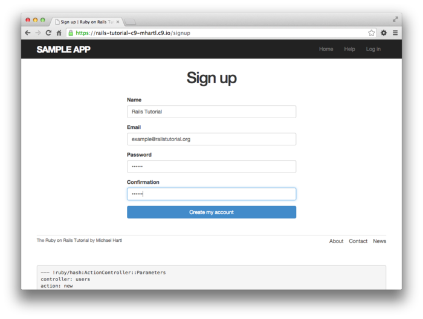
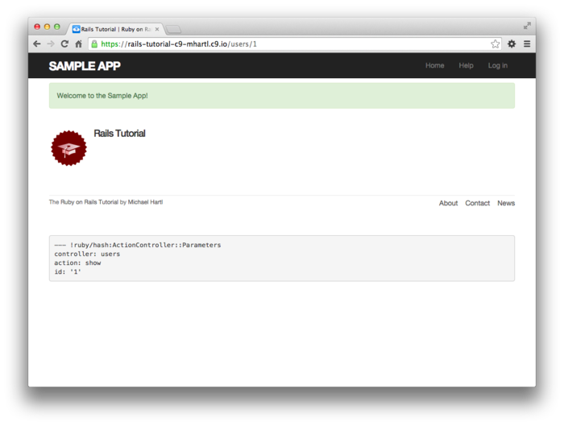
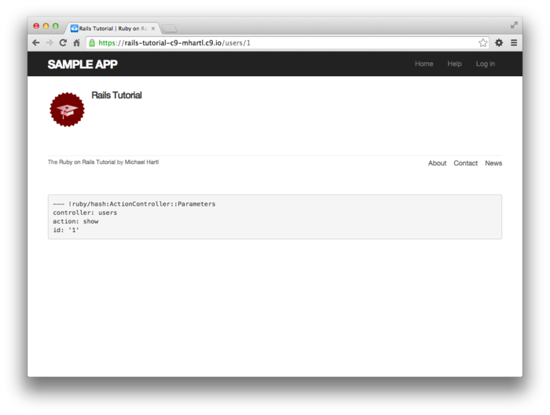
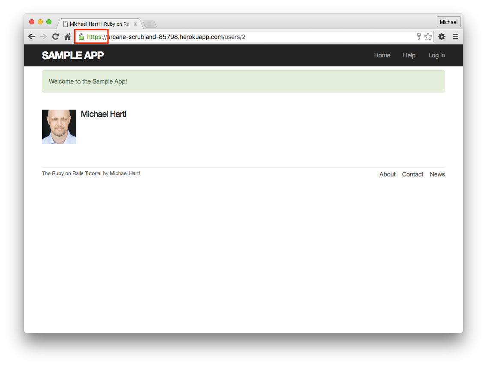

### 7.4.3 실제 유저 등록

여기까지의 코드의 수정이 제대로 되었는지를 확인하기 위해, 실제로 sample 어플리케이션에서 유저 등록을 해봅시다. 단, 지금까지 몇번인가 Form을 이용하여 실험을 했기 때문에 Users 컨트롤러의 `user.save` 의 코드 한 줄이 실행되어, 유저의 수가 본 튜토리얼의 독자마다 조금씩 다를 가능성이 있습니다. 그렇기 때문에 유저 등록을 시험해보기 전에 다음 커맨드를 실행하여 데이터베이스의 내용을 리셋해봅시다.

`$ rails db:migrate:reset`

환경에 따라서는, 여기서 Web서버를 재부팅할 필요가 있습니다. 필요에 따라서 Ctrl+C등을 사용하여 재부팅해주세요.([컬럼 1.1](Chapter1.md#컬럼-11-숙련-이라고-하는-것은))


준비 되었으면, 제일 첫 유저를 등록해봅시다. 이번에는 이름을 "Rails Tutorial", 메일주소를 "example@railstutorial.org" 로 하여 등록해봅시다. Form으로부터 등록하면 유저등록의 성공을 나타내는 웰컴페이지가, `success` 클래스가 있는 녹색의 배경으로 표시될 것입니다. 이 클래스는 [5.1.2](Chapter5.md#512-Bootstrap-과-커스텀-CSS) 에서 추가한 Bootstrap CSS 프레임워크에 의해 준비된 것입니다. 그리고 유저 표시 페이지를 새로고침한다면, 이번에는 flash 메세지는 표시되지 않게 될 것입니다.



(첫 화면)



(유저 등록에 성공하여 flash 메세지가 표시된다.)



(페이지를 새로고침하면 flash메세지가 사라진다.)

##### 연습

1. Rails 콘솔을 사용하여 새로운 유저가 정말로 생성되었는지 한 번 더 체크해봅시다. 결과는 아래와 같이 될 것입니다.
2. 자신의 메일 주소를 등록해봅시다. 이미 Gravatar에 등록해있는 경우, 적절한 영상이 표시되는지 확인해봅시다.

```ruby
$ rails console
>> User.find_by(email: "example@railstutorial.org")
=> #<User id: 1, name: "Rails Tutorial", email: "example@railstutorial.org", created_at: "2016-05-31 17:17:33", updated_at: "2016-05-31 17:17:33",password_digest: "$2a$10$8MaeHdnOhZvMk3GmFdmpPOeG6a7u7...">
```

### 7.4.4 성공 시의 테스트

다음 단계로 진행하기 전에, 여기서 일단 유효한 데이터를 송신할 때의 테스트 코드를 작성해봅시다. 이것으로 어플리케이션의 동작을 검증하고 만일 추후 버그가 생긴다면 그것을 파악할 수 있을 것입니다. [7.3.4](#734-실패-시의-테스트) 에서 작성한 무효한 데이터 송신에 대한 테스트와 마찬가지로, 이번의 목적은 데이터베이스의 내용이 올바른지 검증하는 것입니다. 즉, 유효한 정보를 송신하여 유저가 *작성되었다*라는 것을 확인하는 것입니다. 이전 테스트 코드는 다음과 같이 작성했습니다만,

```ruby
assert_no_difference 'User.count' do
  post users_path, ...
end
```

이번에는 `assert_difference` 라는 메소드를 사용하여 테스트 코드를 작성합니다.

```ruby
assert_difference 'User.count', 1 do
  post users_path, ...
end
```

`assert_no_difference` 와 마찬가지로, 이 메소드는 첫 번째 파라미터로 문자열 (`'User.count'`) 를 받고, `assert_difference` 블록 내의 처리를 실행하는 직전과, 실행한 직후의 `User.count` 의 값을 비교합니다. 두 번째 파라미터는 옵션입니다만, 여기서는 비교한 결과의 차이(이번 경우에는 1) 를 넘깁니다.


이전 위에서 작성한 테스트 코드 파일에 `assert_difference` 를 사용한 테스트 코드를 추가하면, 아래와 같이 됩니다. 여기서 `user_path` 에 POST 리퀘스트를 송신한 다음, `follow_redirect!` 라는 메소드를 사용하고 있는 것을 확인해주세요. 이 메소드는, POST 리퀘스트를 송신한 결과를 확인한 후, 지정된 리다이렉트 URL로 이동하는 메소드입니다. 따라서 이 코드의 직후에는 `'users/show'` 템플릿이 표시될 것입니다. 덧붙여서 여기서 flash 테스트도 추가해봅시다. 이 것은 연습문제로 남겨두겠습니다.

```ruby
# test/integration/users_signup_test.rb
# 유효한 유저 등록을 테스트하는 코드
require 'test_helper'

class UsersSignupTest < ActionDispatch::IntegrationTest
  .
  .
  .
  test "valid signup information" do
    get signup_path
    assert_difference 'User.count', 1 do
      post users_path, params: { user: { name:  "Example User",
                                         email: "user@example.com",
                                         password:              "password",
                                         password_confirmation: "password" } }
    end
    follow_redirect!
    assert_template 'users/show'
  end
end
```

위 코드에서는 유저 등록에 성공한 후, 어떤 템플릿이 표시되는지 검증하고 있는 것을 확인해주세요. 이 테스트를 성공시키기 위해선 User의 라우팅과 User의 `show` 액션, 그리고  `show.html.erb` 뷰가 각각 정상적으로 동작하고 있어야할 필요가 있습니다. 마지막으로,

```ruby
assert_template 'users/show'
```

위 코드에서는 유저 프로필에 관한 거의 모든 (예를 들어 페이지에 접속하면 어떠한 이유로 에러가 발생하지 않는다던가 등)을 테스트할 수 있는 것을 주목해주세요. 이런 종류의 end-to-end 테스트는, 어플리케이션의 중요한 기능을 커버해줍니다. 이러한 이유가 통합테스트가 편리하다고 불리는 이유인 것입니다.

##### 연습

1. [7.4.2](#742-flash) 에서 구현한 flash 에 대한 테스트 코드를 작성해보세요. 얼마나 세세히 작성할 지의 여부는 맡기겠습니다. 아래 첫 번째 코드에 최소한의 템플릿을 준비했으니 참고해주세요. (`FILL_IN` 의 부분을 채워주세요) 텍스트에 대한 테스트는 잘 통과하지 않을 수 있습니다. 짧은 flash키라고 해도 마찬가지입니다. 필자의 경우, flash가 비어있는지 아닌지의 여부만 체크하는 경우가 많습니다.
2. 본문중에서도 지적했습니다만, flash용의 HTML은 읽기 어렵습니다. 읽기 쉽게 아래 두 번재 코드로 수정해봅시다. 수정이 끝나면 테스트 코드를 실행하여 정상적으로 동작하는지를 확인해주세요. 이 코드에서는 Rails의 `content_tag` 라는 헬퍼를 사용하였습니다.
3. `users_controller.rb` 에서, 유저 데이터가 저장에 성공했을 시의 `redirect_to` 문을 코멘트아웃했을 때, 테스트가 실패한 것을 확인해주세요.
4. `users_controller.rb` 에서 `@user.save` 부분을 `false` 로 바꾸어 보세요. (버그가 발생하였다고 가정해봅시다.) 이 때, `assert_difference` 의 테스트에서는 어떻게 이 버그를 확인할 수 있습니까? 테스트 코드를 확인하고 생각해보세요.

```ruby
require 'test_helper'
  .
  .
  .
  test "valid signup information" do
    get signup_path
    assert_difference 'User.count', 1 do
      post users_path, params: { user: { name:  "Example User",
                                         email: "user@example.com",
                                         password:              "password",
                                         password_confirmation: "password" } }
    end
    follow_redirect!
    assert_template 'users/show'
    assert_not flash.FILL_IN #테스트 케이스
  end
end
```

```erb
<!-- app/views/layouts/application.html.erb -->
<!-- content_tag 를 사용하여 레이아웃 안에 flash를 작성합니다. -->
<!DOCTYPE html>
<html>
      .
      .
      .
      <% flash.each do |message_type, message| %>
        <%= content_tag(:div, message, class: "alert alert-#{message_type}") %>
      <% end %>
      .
      .
      .
</html>
```


## 7.5 프로의 배포

유저 등록 페이지가 제대로 동작되었기 때문에, 이 어플리케이션을 배포하여 실제 배포환경에서도 제대로 동작하는지 확인해봅시다. [제 3장](Chapter3.md) 에서 배포를 하고 있습니다만, 실제로 데이터를 *조작* 할 수 있는 배포는 처음입니다. 그렇기 때문에 이번 기회에 프로 레벨의 배포방법에 대해 설명하겠습니다. 구체적으로는 유저 등록을 안전하게 하기 위해 실제 배포 환경용의 어플리케이션에 중요한 기능을 추가해보겠습니다. 그 다음, 기본 Web 서버를 실제 세계에서 사용하는 Web 서버로 바꾸어보겠습니다.


배포 준비를 하기 위해, 우선 이 시점까지의 수정사항을 `master` 브랜치에 머지해주세요.

```
$ git add -A
$ git commit -m "Finish user signup"
$ git checkout master
$ git merge sign-up
```

### 7.5.1 실제 배포 환경에서의 SSL

이번 챕터에서 개발한 유저 등록 Form에 데이터를 송신하면, 이름과 메일주소, 패스워드와 같은 데이터가 네트워크를 통해 서버로 전송됩니다. 사실은 이러한 네트워크에 실리는 데이터는 도중에 변할 수 있기 때문에, 매우 조심스럽게 다루어야합니다. 이것은  sample 어플리케이션의 본질적인 보안상의 결함입니다. 그리고 이러한 결함을 수정하기 위해 [Secure Sockets Layer (SSL)](https://ja.wikipedia.org/wiki/Transport_Layer_Security) 를 사용합니다. 이것은 로컬 서버로부터 네트워크에 데이터를 보내기 전에, 정보를 암호화하는 기술입니다. 이번에는 유저 등록 페이지만을 위해 SSL를 도입합니다만, 이것은 Web사이트 전체에 적용할 것입니다. 제 8장에서 구현하는 로그인 기능을 좀 더 안전하게 만들거나, 9.1에서 설명할 세션 하이잭킹(Session Hijacking) 의 위험성에 대해서도 많은 이점을 가지고 있습니다.


SSL을 유효하게 하는 것은 간단합니다. `production.rb` 라고 하는 실제 배포환경용 설정파일에 코드 한 줄 수정하는 것만으로도 끝납니다. 구체적으로는 `config` 에 "실제 배포 환경에서 SSL을 사용한다." 라는 설정을 하는 것 뿐입니다.


Heroku에서는 기본 설정에서도 SSL를 사용할 수 있습니다만, SSL의 사용을 브라우저에서 강제하는 것은 아닙니다. 그렇기 때문에 유저가 https가 아닌 http로 접속해버리면, Web사이트와 유저간의 커뮤니케이션이 안전하게 이루어지지 않게됩니다. (신경쓰이시는 분은 브라우저의 주소창의 URL을 https에서 http로 변경해봅시다.) Rails는 매우 감사하게도, 실제 배포환경용의 설정파일인 `production.rb` 의 코드를 겨우 한 줄만 변경하는 것만으로 SSL을 강제하여 https에 의한 안전한 통신을 할 수 있게 해줍니다. 구체적으로는 아래 코드처럼 `config.force_ssl` 을 `true` 을 설정하는 것으로 설정이 끝납니다.

```ruby
# config/environments/production.rb
Rails.application.configure do
  .
  .
  .
  # Force all access to the app over SSL, use Strict-Transport-Security,
  # and use secure cookies.
  config.force_ssl = true
  .
  .
  .
end
```

다음으로, 원격 서버의 SSL을 준비해봅시다. 실제 배포환경용의 Web사이트에서 SSL을 사용할 수 있게 하기 위해서는, 도메인별로 *SSL 증명서* 를 구입하여 설정할 필요가 있습니다. 이것은 매우 많은 작업이 필요합니다만 매우 운이 좋게도 그러한 번거로운 작업을 하지 않아도 됩니다. Heroku상에서 sample 어플리케이션을 동작하여 Heroku의 SSL 증명서를 사용하는 방법이 있기 때문입니다. (독자적인 도메인을 사용하는 경우에는 SSL증명서를 구입할 필요가 있습니다.) [7.5.2](#752-실제-배포환경용의-Web서버) 에서 어플리케이션의 배포가 끝나면, 자동적으로 SSL이 유효화될 것입니다. 만일, www.example.com등의 독자 도메인으로 SSL을 사용하고 싶은 경우에는, [Heroku의 SSL에 관한 도큐멘트](http://devcenter.heroku.com/articles/ssl)를 참고해주세요.

### 7.5.2 실제 배포환경용의 Web서버

SSL를 도입하였습니다. 다음은 어플리케이션의 설정을 변경하여 실제 배포환경에 맞는 Web 서버를 사용해봅시다. Heroku의 기본 설정은, Ruby만으로 구현된 WEBrick 이라는 Web서버를 사용하고 있습니다. WEBrick은 간단하게 설치할 수 있으며 동작시킬 수 있는 것이 특징입니다만, 많은 트래픽을 핸들링하기에는 무리가 있습니다. 즉 WEBrick은 [실제 배포환경에 적합한 Web서버가 아닙니다.](https://devcenter.heroku.com/articles/ruby-default-web-server) 따라서 이번에는 [WEBrick을 Puma라는 Web서버로 바꾸어봅시다.](https://devcenter.heroku.com/articles/deploying-rails-applications-with-the-puma-web-server) Puma는 다수의 리퀘스트를 핸들링하는데에 적합한 Web서버입니다.


새로운 Web서버를 추가하기 위해, [Heroku의 Puma문서](https://devcenter.heroku.com/articles/deploying-rails-applications-with-the-puma-web-server)에 따라 설치해봅시다.


제일 첫 단계로는, *puma gem* 을 `Gemfile` 에 추가하는 것입니다만, Rails 5에서 Puma는 기본설정으로 사용할 수 있게 되어있습니다. 따라서 제일 첫 단계는 스킵해도 무방합니다. (즉, Rails 4.2 이전에는 `config/puma.rb` 파일을 작성하고, 아래와 같은 설정을 하였습니다.) 다음 단계로는 [Heroku의 Puma문서](https://devcenter.heroku.com/articles/deploying-rails-applications-with-the-puma-web-server) 에 따라 설정을 변경해봅시다. 설정을 변경한다고는 해도 이번에는 문서의 코드를 그 대로 인용한 것뿐이기 때문에 내용은 이해하지 않아도 괜찮습니다. ([컬럼 1.1](Chapter1.md#컬럼-11-숙련-이라고-하는-것은))

```ruby
# config/puma.rb

workers Integer(ENV['WEB_CONCURRENCY'] || 2)
threads_count = Integer(ENV['RAILS_MAX_THREADS'] || 5)
threads threads_count, threads_count

preload_app!

rackup      DefaultRackup
port        ENV['PORT']     || 3000
environment ENV['RACK_ENV'] || 'development'

on_worker_boot do
  # Worker specific setup for Rails 4.1+
  # See: https://devcenter.heroku.com/articles/
  # deploying-rails-applications-with-the-puma-web-server#on-worker-boot
  ActiveRecord::Base.establish_connection
end
```

 마지막으로, `Procfile` 이라고 불리는, Heroku에서의 Puma의 프로세스를 동작시키는 설정파일을 작성합니다. 또한 이 `Procfile` 은 루트 디렉토리 (`Gemfile` 과 같은 디렉토리)에 놓을 필요가 있으니, 파일의 저장장소를 확인해주세요.

```
# ./Procfile

web: bundle exec puma -C config/puma.rb
```

### 7.5.3 실제 배포환경으로의 배포

이상으로 실제 배포환경용의 Web서버의 설정을 끝냈습니다. 위 수정내용을 커밋하고, 배포해봅시다.

```
$ rails test
$ git add -A
$ git commit -m "Use SSL and the Puma webserver in production"
$ git push
$ git push heroku
$ heroku run rails db:migrate
```

유저 등록 Form이 무사히 동작하면 성공입니다. 성공하면 아래 캡쳐처럼 될 것입니다. 이 때, URL이 https:// 로 변경되어 있고, 주소창에 자물쇠 아이콘이 표시되는 것을 확인해주세요. 이것은 방금 전 설정한 SSL이 제대로 동작하고 있는 것을 나타냅니다.



#### Ruby의 버전 번호

여기서 잠깐, Heroku에 배포할 때, 다음과 같은 경고메세지를 보았을 지도 모르겠습니다.

```
###### WARNING:
       You have not declared a Ruby version in your Gemfile.
       To set your Ruby version add this line to your Gemfile:
       ruby '2.1.5'
```

(이것은 "Ruby의 버전을 명시적으로 지정해주세요" 라는 메시지 입니다만,) 경험적으로 본 튜토리얼과 같은 연습레벨에서는 명시적으로 지정하지 않는 편이 오히려 별 문제없이 진행되는 경우가 많기 때문에, 이 경고는 지금 시점에서는 무시해도 상관없을 것입니다. 애당초 sample 어플리케이션에서 Ruby의 버전을 항상 최신으로 유지한다면, 큰 문제없이 진행할 수 있을 것입니다. 또한 본 튜토리얼의 sample 어플리케이션에 있어서, 로컬에서 사용하는 버전과 실제 배포환경에서의 버전이 다르다고 하여도 차이가 생기는 일은 거의 없을 것입니다. 이렇게 말은 해도, 다음 내용은 머리 한 구석에 넣어두시는 것도 좋을 것 같습니다. 업무 상 Heroku를 사용한 어플리케이션을 동작시키는 경우에는, `Gemfile` 에서 Ruby의 버전을 명시적으로 지정하는 것이 현명할 것입니다. 이것은 개발환경과 실제 배포환경의 상호관계성을 최대한 높이는 것이 가능하기 때문입니다. (버전 차이에 의한 오작동이나 에러를 방지하기 위해)

##### 연습

1. 브라우저에서 실제 배포환경(Heroku) 에 접속하여, SSL의 자물쇠 마크가 제대로 표시되는지, URL이 `https` 로 되어있는지 확인해봅시다.
2. 실제 배포환경에서 유저를 등록해봅시다. Gravatar 의 이미지는 제대로 표시됩니까?


## 7.6 마지막으로

유저 등록(생성) 기능의 구현은 sample 어플리케이션에 있어서 꽤나 큰 목표 중 하나 였습니다. 이 시점에서 sample 어플리케이션은 꽤나 실용적으로 변했습니다만, 아직 중요한 기능이 몇가지 남아있습니다. 제 8장과 제 9장에서는 인증(authentication) 시스템을 도입하여 유저가 로그인과 로그아웃할 수 있게 할 것입니다. ([remember me] 라는 발전적인 기능도 구현해볼 것입니다.) 이어서 제 10장에서는 어떠한 유저라도 자신의 아이디 정보를 수정할 수 있도록하고, Web 사이트의 관리자가 유저를 삭제할 수 있도록 해봅니다. 그리하여 Users 리소스의 RESTful한 기능은 전부 구현할 수 있게 될 것입니다.

### 7.6.1 7장의 정리

- `debug` 메소드를 사용하여 디버그 정보를 표시할 수 있습니다.
- Sass의 mixin 기능을 사용하면, CSS의 내용을 한 꺼번에 정리하여 다른 부분에서 재이용할 수 이씃ㅂ니다.
- Rails에는 표준적인 3개의 환경을 지원하며, 각각 `개발환경 (development), 테스트환경 (test), 실제 배포환경 (production)` 이라 부릅니다.
- 표적인 RESTful 한 URL을 통해, 유저 정보를 리소스로써 다룰 수 있습니다.
- Gravatar를 사용하면, 유저의 프로필 영상을 간단하게 표시할 수 있습니다.
- `form_for` 헬퍼는, Active Record 오브젝트에 대응한 Form을 생성합니다.
- 유저 등록에 실패한 경우에는 new뷰를 다시 표시하게 하였습니다. 그 때 Active Record가 자동적으로 확인하고 에러메세지를 출력합니다.
- `flash` 변수를 사용하면, 일시적인 메세지를 표시할 수 있습니다.
- 유저 등록에 성공한 경우에는, 데이터베이스 상에 유저가 추가되고, 프로필페이지로 리다이렉트 후, 웰컴 메세지 표시하는 순으로 처리가 진행됩니다.
- 통합 테스트 기능을 사용함으로써 데이터 송신 Form의 동작을 검증하고, 버그가 있는지 확인할 수 있습니다.
- 안전한 통신과 높은 퍼포먼스를 확보하기 위해, 실제 배포환경에서는 SSL과 Puma를 도입했습니다.

