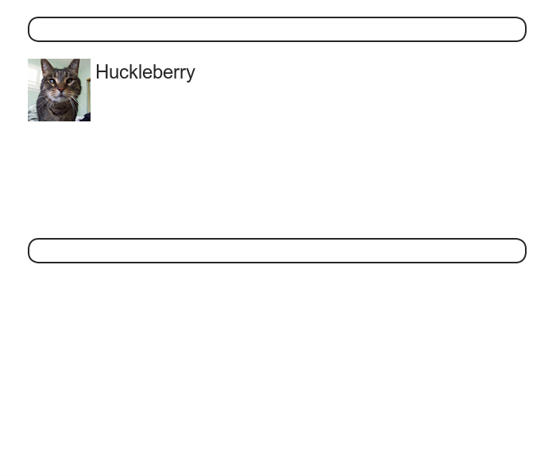
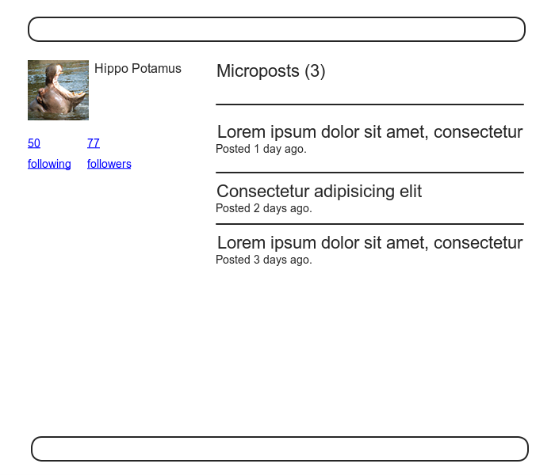
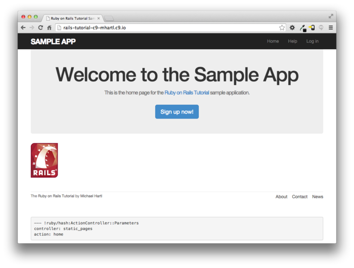
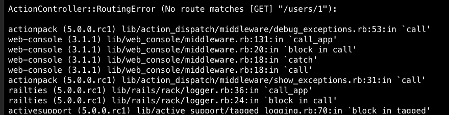

# 제 7장 유저를 생성해보자

User모델이 완성되었습니다. 드디어 유저 생성(등록) 기능을 추가해봅시다. 7.2에서는 HTML입력폼을 사용하여 Web어플리케이션에 등록정보를 송신해봅니다. 이어서 7.4에서는 유저를 신규작성하고, 그 정보를 데이터베이스에 저장합니다. 유저 생성의 마지막은 생성된 유저의 신규 프로필을 표시할 수 있게 하기 위해, 유저를 표시하기위한 페이지를 작성하고, 유저용의 REST 아키텍처를 구현해볼 것입니다. ([2.2.2](Chapter2.md#222-MVC의-처리)) 더불어서 [5.3.4](Chapter5.md#534-링크의-테스트) 에서 구현한, 간단하면서도 매우 뛰어난 통합 테스트 코드에 대해 몇가지 케이스를 추가해볼 것입니다.


이번 챕터에서는 [제 6장](Chapter6.md) 에서 작성한 User모델의 검증 테스트를 믿고, 유효한 메일주소를 가지고 있는 (가능성이 있는) 신규 유저를 추가해볼 것입니다. 제 11장에서는 메일주소가 *정말로* 유효한 것인지 확인해보기 위해, *고객 ID를 유효화하는* 기능을 신규 유저 등록 시에 동작할 수 있도록 추가해보겠습니다.


본 튜토리얼은 프로레벨의 내용을 다루면서도, 되도록이면 간단하게 설명할 수 있도록 노력하고 있습니다만, 그럼에도 불구하고 Web개발이라고 하는 것은 복잡하면서 어려운 주제임에는 틀림없습니다. 실제로 이번 [7장](Chapter7.md) 부터는 난이도가 조금씩 올라갑니다. 그렇기 때문에 이번 챕터부터는 지금까지 공부해왔던 것 그 이상으로 시간을 더욱 투자해서 천천히 읽어보세요. 필요하다면 복습도 하시길 바랍니다. (일부 독자들은 각 챕터를 최소 2번이상 읽고 있을텐데, 그것도 좋은 방법이라고 생각합니다.) 혹은, 만일 Rails 튜토리얼을 진행해나가는 중에 기초지식이 모자라다고 느낄 때에는 다음의 자료들을 읽어보시는 것도 도움이 되실 겁니다.

- [Learn Enough Society](http://learnenough.com/story) 구독
- [*Learn Enough Ruby to Be Dangerous*](http://learnenough.com/ruby-tutorial)
- [*Learn Enough Sinatra to Be Dangerous*](http://learnenough.com/sinatra-tutorial)
- [*Learn Enough Rails to Be Dangerous*](http://learnenough.com/ruby-on-rails-tutorial)


## 7.1 유저를 표시해보자

이번 섹션에서는, 일단 유저의 이름과 프로필 사진을 표시하기 위한 페이지를 작성해볼 것입니다. 목업의 이미지는 아래 첫 번째 이미지와 같습니다. 유저 프로필 페이지의 최종적인 목표는 아래 두 번째 페이지와 같은 유저의 프로필 사진과 기본 유저 데이터, 마이크로포스트의 리스트를 표시하는 것입니다. (두 번쨰 이미지에서는, 유명한 lorem ipsum 더미 텍스트를 사용하고 있습니다. 이 텍스트의 탄생과정에는 [재미있는 에피소드](http://www.straightdope.com/columns/read/2290/what-does-the-filler-text-lorem-ipsum-mean) 가 있으니 시간이 괜찮으시면 읽어보세요.) 이 페이지를 작성한 후, 제 14장의 샘플 어플리케이션에서 본격적으로 사용해볼 것입니다.


버전관리를 하고 있으니, 언제나처럼 토픽 브랜치를 생성해봅시다.

`$ git checkout -b sign-up`







### 7.1.1 Debug와 Rails 환경

이번 섹션에서 생성하는 프로필은, 우리의 어플리케이션에서의 첫 동적인 페이지가 될 것입니다. 뷰 그 자체는 한 페이지의 코드입니다만, 어플리케이션의 데이터베이스로부터 얻은 정보를 사용하여 각 프로필의 표시를 커스터마이즈할 것입니다. Sample 어플리케이션에 동적인 페이지를 추가하는 준비작업으로써, 여기서는 Web사이트의 레이아웃에 디버그 정보를 추가해보도록 하겠습니다. 이것으로, Rails에서 기본으로 제공하는 `debug` 메소드와 `params` 변수를 사용하여, 각 프로필 페이지의 디버그용의 정보를 표시할 수 있게 되었습니다. (자세한 설명은 7.1.2에서 설명하겠습니다.)

```erb
<!-- app/views/layouts/application.html.erb -->

<!DOCTYPE html>
<html>
  .
  .
  .
  <body>
    <%= render 'layouts/header' %>
    <div class="container">
      <%= yield %>
      <%= render 'layouts/footer' %>
      <%= debug(params) if Rails.env.development? %> <!-- 추가한 코드 -->
    </div>
  </body>
</html>
```

실제 배포 환경에서 전개한 어플리케이션은 디버그 정보를 표시하게 하고싶진 않습니다. 그렇기 때문에 위 코드에서는 아래와 같은 표현을 하고 있습니다.

`if Rails.env.development?`

이렇게 해놓으면, 디버그정보는 Rails의 세 가지의 디폴트 환경 중, *개발환경(Development)* 에서만 표시될 것입니다.(컬럼 7.1) 특히 `Rails.env.development?` 가 `true` 일 경우는 개발 환경일 때만 이기때문에 다음의 Ruby 코드는

`<%= debug(params) if Rails.env.development? %>`

실제 배포환경 어플리케이션이나 테스트에서 사용할 수는 없습니다. ( 테스트 환경에서 디버그 정보가 표시되어도 문제될 것은 없습니다만, 그렇다고 좋을 것도 없습니다. 디버그 정보는 개발환경 이외에서는 표시해선 안되는 것입니다.)

###### 컬럼 7.1 Rails의 3가지 환경

> Rails에서는 테스트환경(test), 개발환경(development), 실제 배포환경(production) 의 세 가지 환경이 기본으로 준비되어있습니다. Rails console의 기본 환경은 development입니다.

>

> $ rails console
>   Loading development environment

> ​	Rails.env
> ​	  => "development"
> ​	Rails.env.development?
> ​	  => true
> ​	Rails.env.test?
> ​	  => false

>

> 위와 같이, Rails에서는 `Rails` 라고 하는 오브젝트가 존재하며, 해당 오브젝트의 환경의 논리값을 다루는 `env` 라는 속성이 있습니다. 예를 들어 `Rails.env.test?` 라고 하면 테스트 환경에서는 `true` 를 리턴하고, 그 외의 환경에서는 `false` 를 리턴합니다.

>

> 테스트 환경에서의 디버그 등, 다른 환경에서 console을 실행하는 필요가 생겼을 때는 환경을 파라미터로써 console 스크립트에 직접 입력할 수 있습니다.

>

> $ rails console test
>   Loading test environment

> ​	Rails.env
> ​	  => "test"
> ​	Rails.env.test?
> ​	  => true

>

> 마찬가지로, Rails 서버도 기본 옵션으로는 `development` 가 사용되고 있습니다만, 다음과 같은 다른 환경을 명시적으로 실행하는 것도 가능합니다.

>

> `$ rails server --environment production`

>

> 어플리케이션을 실제 배포환경에서 실행하는 경우, 배포환경의 데이터베이스를 이용하지 않으면 어플리케이션을 실행할 수 없습니다. 때문에 `rails db:migrate` 를 배포환경에서 실행하여 배포환경 데이터베이스를 생성합니다.

>

> `$ rails db:migrate RAILS_ENV=production`

>

> (console, server, migrate의 세 가지 커맨드는, 기본이외의 환경을 지정하는 방법이 제각각 다르기 때문에 혼동스러울 수 있습니다. 때문에 세 가지의 경우의 모든 방법을 칼럼에서 설명했습니다. 또한 `RAILS_ENV=<env>` 를 커맨드의 앞 부분에 놓아도 상관 없습니다. 예를 들면, `RAILS_ENV=production rails server` 등의 문장을 입력해도 됩니다.)

>

> Sample 어플리케이션을 기존에 Heroku 상에 배포(디플로이) 한 경우에는, `heroku run rails console` 이라고 하는 커맨드를 입력하여 실제 배포환경을 확인해볼 수 있습니다.

>  $ heroku run rails console

> ​	Rails.env
> ​	  => "production"
> ​	Rails.env.production?
> ​	  => true

>

> 당연한 이야기지만, Heroku는 실제 배포용 플랫폼이기 때문에, 실행되는 어플리케이션은 모두 실제 배포환경입니다.

디버그출력을 예쁘게하기 위해, [제 5장](Chapter5.md) 에서 생성한 커스텀 스타일 시트를 아래와 같이 추가합니다.

```scss
/* app/assets/stylesheets/custom.scss */

@import "bootstrap-sprockets";
@import "bootstrap";

/* mixins, variables, etc. */

$gray-medium-light: #eaeaea;

@mixin box_sizing {
  -moz-box-sizing:    border-box;
  -webkit-box-sizing: border-box;
  box-sizing:         border-box;
}
.
.
.
/* miscellaneous */
.debug_dump {
  clear: both;
  float: left;
  width: 100%;
  margin-top: 45px;
  @include box_sizing;
}
```

여기서 Sass의 Mix_in 기능 (여기서는 `box_sizing` )을 사용하고 있습니다. mix_in기능을 사용함으로써 CSS의 그룹을 패키지화하여 여러개의 요소에 적용할 수 있습니다. 다음의 코드는

```scss
.debug_dump {
  .
  .
  .
  @include box_sizing;
}
```

아래와 같이 변환됩니다.

```scss
.debug_dump {
  .
  .
  .
  -moz-box-sizing:    border-box;
  -webkit-box-sizing: border-box;
  box-sizing:         border-box;
}
```

mix_in은 7.2.1에서도 사용합니다. 이번 경우에는 아래의 그림과 같이 될 것 입니다.



위 그림에서 디버그 출력은, 화면에 표시되는 페이지의 상태를 파악하기 위해 도움이 될 정보를 가지고 있습니다.

```
controller: static_pages
action: home
```

이것은  `params` 가 가지고 있는 내용으로써, `YAML` 이라고 하는 형식으로 작성되어져 있습니다. YAML은 기본적으로 해시의 형태이며 컨트롤러와 페이지의 액션을 유니크하게 지정합니다. 7.1.2에서는 다른 형식의 예시도 소개하겠습니다.

##### 연습

1. 브라우저로부터 /about에 접속하여 디버그정보가 표시되는 것을 확인해주세요. 해당 페이지를 표시할 때, 어떠한 컨트롤러와 액션이 사용되었습니까? `params` 의 내용으로부터 확인해보세요.
2. Rails의 콘솔을 동작시키고, 데이터베이스로부터 제일 처음의 유저정보를 조회하여 변수 `user`에 저장해보세요. 그 후, `puts user.attributes.to_yaml`을 실행하면 어떠한 내용이 표시됩니다. 여기서 표시된 결과와, `y` 메소드를 사용한 `y user.attributes`의 실행결과를 비교해봅시다.


### 7.1.2 User Resource

유저 프로필 페이지를 생성하기 위해서는 그 전에, 데이터베이스에 유저를 등록해놓을 필요가 있습니다. 이것은 이른바 "달걀이 먼저냐 닭이 먼저냐" 의 문제입니다. 이 Web사이트에서는 등록페이지가 없는 상태에서 어떻게하면 유저를 생성할 수 있을까요? 다행히도 이 문제는 이미 해결한 적이 있습니다. [6.3.4](Chapter6.md#유저의-생성과-인증) 에서 Rails 콘솔을 사용하여 유저 레코드를 등록해놓았습니다. 따라서 데이터베이스 안에는 한 명의 유저가 존재할 것 입니다.

```ruby
$ rails console
>> User.count
=> 1
>> User.first
=> #<User id: 1, name: "Michael Hartl", email: "mhartl@example.com",created_at: "2016-05-23 20:36:46", updated_at: "2016-05-23 20:36:46",password_digest: "$2a$10$xxucoRlMp06RLJSfWpZ8hO8Dt9AZX...">
```

(만약, 아직 데이터베이스에 유저가 한 명이라도 없는 경우에는, [6.3.4](Chapter6.md#유저의-생성과-인증) 으로 돌아가 작성해주세요.) 방금전 콘솔의 출력결과롸부터, 유저의 ID가 `1` 이라는 것을 확인하였습니다. 그 다음 목표로는 이러한 유저 정보를 Web 어플리케이션 상에서 표시하는 것입니다. 여기서는 Rails 어플리케이션에서 권장되고 있는 REST 아키텍쳐 ([컬럼 2.2](Chapter2.md#컬럼-22-REpresentational-State-Transfer-REST) )의 습관을 따르도록 합니다. 즉, 데이터의 생성, 표시, 수정, 삭제를 *리소스 (Resource)* 로써 다룬다는 것입니다. [HTTP표준](https://ja.wikipedia.org/wiki/Hypertext_Transfer_Protocol) 에서는 위 리소스에 대응하기 위한 4가지의 기본 조작 (POST, GET, PATCH, DELETE) 가 정의되어 있습니다. 이러한 기본 조작들을 각 액션에 할당하여 사용해봅니다.([컬럼 3.2](Chapter3.md#컬럼-32-GET이나-그-외-다른-HTTP-메소드에-대해)) 


REST의 원칙을 따르는 경우, 리소스로의 참조는 리소스의 이름과 유니크한 ID를 사용하는 것이 일반적입니다. 유저를 리소스라고 가정할 경우, id=`1` 의 유저를 참조한다는 것은 /users/1 이라고 하는 URL에 대해 GET 리퀘스트를 발행한다는 의미입니다. 여기서 `show` 라고 하는 액션은, *암묵* 의 리퀘스트입니다. Rails의 REST 기능이 유효한 경우라면, GET 리퀘스트는 자동적으로 `show` 액션으로써 다뤄질 것입니다


[2.2.1](Chapter2.md#221-Users-화면을-움직여보자) 에서 설명한 것 처럼, id=`1` 의 dㅠ저에 접근하기 위한 페이지의 URL은 /users/1 입니다. 단 현 시점에서는 이 URL을 사용해도 에러가 출력될 것입니다. 



