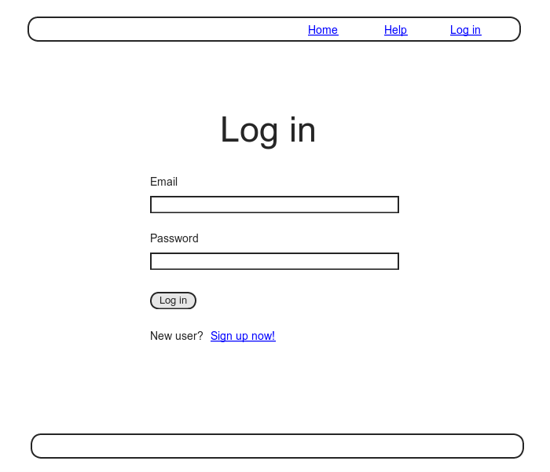
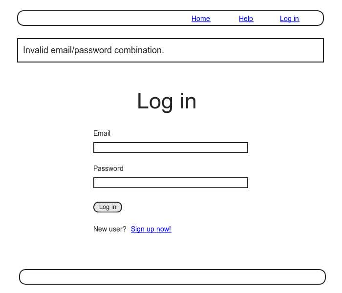
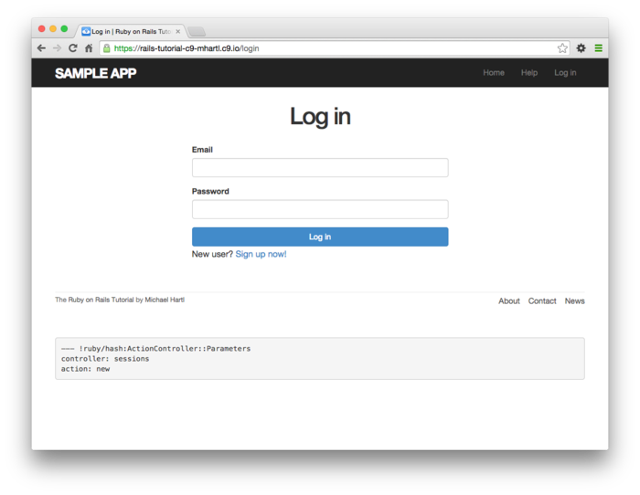

# 제 8장 기본적인 로그인 기능

[제 7장](Chapter7.md) 에서 Web사이트에서의 신규 유저 등록이 가능하게 되었습니다. 이번에는 유저가 로그인하거나 로그아웃할 수 있게 해봅시다. 이번 챕터에서는 로그인의 기본적인 구조를 구현해보겠습니다. 여기서 말하는 로그인의 기본적인 구조란, 브라우저가 로그인하고 있는 상태를 유지하고, 유저에 의해 브라우저가 닫혀지면 그 상태를 없애버리는 구조 (*인증 시스템(Authentification System*)) 입니다. 이 인증시스템의 기반을 구현한다면, 로그인되어져있는 유저 (current user) 만이 접근할 수 있는 페이지나, 무언가를 조작할 수 있는 기능 등을 제어할 수 있습니다. 또한 이러한 제한이나 제어의 구조를 *인가 모델(Authorization Model)* 이라 부릅니다. 예를 들어 이번 챕터에서 구현하는 로그인상태인지 아닌지를 헤더부분에서 확인할 수 있는 구조도 이것에 해당하빈다.


이 인증시스템과 인가모델은, 나중에 구현할 Sample 어플리케이션의 여러가지 기능의 기반이 될 구조입니다. 예를 들어 제 10장에서는 로그인한 유저만이 유저의 리스트페이지로 이동할 수 있게 한다던지, 문제가 없는 유저만이 자신의 프로필 정보를 편집할 수 있게 한다던지, 관리자만이 다른 유저를 데이터베이스로부터 삭제할 수 있게 됩니다. 제 13장에서는 이번 챕터에서 사용할 수 있게되는 로그인 상태의 유저 (current user) 를 이용하여 유저의 아이디와 마이크로포스트를 연관시키게 하는 구조를 구현합니다. 마지막 제 14장에서는 다른 유저를 팔로우하는 기능이나 자신의 피드 리스트를 구현할 때, "누가 로그인해있는가" 라는 정보가 필요하게 됩니다.


또한 제 9장에서는 이번 챕터에서 구축한 기본적인 로그인 기능을 개선하여 보다 더 발전적인 로그인 기능을 구현할 것입니다. 예를 들어 이번 챕터에서 구축하는 기능으로는 브라우저를 닫으면 로그인한 유저 정보를 강제적으로 삭제하도록 합니다만, 제 9장에서 개선한 인증 기능에서는 유저가 *임의* 의 브라우저에 로그인정보를 기억시키는 (remember me) 기능을 구현할 것입니다. (구체적으로는 [remember me] 라고 하는 체크박스를 로그인 폼에 준비할 것입니다.) 이번  8장과 9장을 통해 

1. 브라우저를 닫으면 로그인 정보를 파기한다 (Session)
2. 유저의 로그인 정보를 자동으로 보존한다 (Cookie)
3. 유저가 체크박스를 On 한 경우에만 로그인 정보를 저장한다 (Remember me)

라고 하는 3개의 일반적인 로그인 구조를 구현할 것입니다.


## 8.1 Session

[HTTP](https://ja.wikipedia.org/wiki/Hypertext_Transfer_Protocol) 는 [*Stateless 한 프로토콜*](https://ja.wikipedia.org/wiki/ステートレス・プロトコル) 입니다. 문자대로 "상태(State)" 가 "없기(less)" 떄문에 HTTP의 리퀘스트 하나하나는 그 이전의 리퀘스트 정보를 전혀 이용할 수 없는, 독립적인 트랜잭션으로써 다루게됩니다. HTTP는 말하자면, 리퀘스트가 끝나면 무엇이든 잃어버리고, 다음부터는 다시 제일 처음부터 다시 시작해야하는 건망증적인 프로토콜이며, 과거를 기억해내지 못하는 여행자와 같은 느낌입니다. (그러나, 그렇기 때문에 이 프로토콜은 매우 좋은 것입니다.) 이 본질적인 특성으로 인하여, 브라우저의 어느 페이지에서 다른 페이지로 이동할 때에 유저의 ID를 저장할 수단이 [HTTP 프로토콜 "내부"](https://ja.wikipedia.org/wiki/Hypertext_Transfer_Protocol#.E5.8B.95.E4.BD.9C) 에는 전혀 없습니다. 유저 로그인이 필요한 Web 어플리케이션에는 [*세션 (Session)*](https://ja.wikipedia.org/wiki/セッション#.E3.82.B3.E3.83.B3.E3.83.94.E3.83.A5.E3.83.BC.E3.82.BF) 이라고 불리는 반영속적인 접속을 컴퓨터 사이에(유저의 개인 컴퓨터의 Web 브라우저와 Rails의 서버 등) 별도로 설정합니다. 

세션은 HTTP 프로토콜의 계층과는 다르기 (좀 더 상위 계층) 때문에, HTTP의 특성과는 별도로 (약간 영향은 있지만) 접속을 확보할 수 있습니다. 


Rails의 세션을 구현하기 위한 방법으로 제일 일반적인 것은, [*cookies*](https://ja.wikipedia.org/wiki/HTTP_cookie) 를 사용하는 방법입니다. cookie는 유저의 브라우저에 저장되는 어떠한 작은 텍스트 데이터입니다. cookie는 어떤 페이지에서 다른 페이지로 이동할 때에도 없어지지 않기 때문에 여기에 유저 ID 등의 정보를 저장할 수 있습니다. 어플리케이션은 cookie내의 데이터를 사용하여, 예를 들어 로그인 중인 유저가 가지고 있는 정보를 데이터베이스에서 조회할 수 있습니다. 이번 섹션 및 8.2에서는, 그 이름을 또한 `session` 이라고 하는 Rails의 메소드를 사용하여 일시적인 세션을 작성해볼 거싱빈다. 이 일시적인 세션은, 브라우저를 닫으면 자동적으로 종료합니다. 이어서 제 9장에서는 Rails의 `cookies` 메소드를 사용하여 좀 더 오래가는 세션의 작성방법에 대해 배워볼 것입니다.


세션을 RESTful한 리소스로서 모델링할 수 있다면, 다른 RESTful 리소스와돠 한 번에 이해할 수 있어서 매우 편리합니다. 로그인 페이지에서는 `new` 로 세로운 세션을 출력하여, 해당 페이지에 로그인하면 `create` 로 세션을 실제로 작성하고 저장한 후, 로그아웃하면  `destroy`  로 이용하여 파기하는 이러한 처리를 해볼 것이빈다. 단, Users 리소스와 다른 점은, Users 리소스에서는 백엔드에 User모델을 거쳐 데이터베이스 상의 영속적인 데이터에 접속할 수 있는 것에 반해, Session 리소스에서는 대신에 cookies를 저장장소로써 사용하는 점입니다. 로그인의 구조의 대부분은, cookies를 사용한 인증메커니즘에 의해 구축됩니다. 이번 섹션과 다음 센셩에서는, 세녕기능을 작성할 준비로써 Session 컨트롤러, 로그인 전용 폼, 양쪽을 이어줄 컨트롤러 상의 액션을 작성해볼 것입니다. 8.2에서는 세션을 조작하기 위해 필요한 코드를 몇 가지 추가해보고, 유저 로그인 기능을 완성시킬 예정입니다.


전 챕터와 마찬가지로 토픽브랜치로 작업을 하고 마지막에 수정사항을 머지할 것입니다.

`$ git checkout -b basic-login`

### 8.1.1 Sessions Controller

로그인과 로그아웃의 요소를, Sessions 컨트롤러의 특정한 REST 액션에 각각 대응하게끔 해봅시다. 로그인 폼은 이번 섹션에서 다루는 `new` 액션에서 처리합니다. `create` 액션에 POST 리퀘스트를 송신하면, 실제로 로그인하게 됩니다.(8.2) `destroy` 액션에 DELETE 리퀘스트를 송신하면, 로그아웃 하게 됩니다. (8.3) (이전 7장에서 HTTP 메소드와 REST 액션에 대해 관련지은 것을 떠올려보세요.)


일단, Sessions 컨트롤러와 `new` 액션을 생성하고나서 시작해봅시다.

`$ rails generate controller Sessions new`

(또한, `rails generate`로 `new` 액션을 생성하면, 그것에 대응하는 뷰도 생성됩니다. `create`나 `destroy` 에는 대응할 뷰가 필요없기 때문에, 필요 없는 뷰를 작성하지 않기 위해 여기서는 `new` 만 지정합니다. ) [7.2](Chapter7.md#72-유저-등록-Form) 의 유저 등록 페이지와 마찬가지로, 아래의 목업을 바탕으로 세션을 시작하기 위한 로그인 폼을 작성해봅시다.



Users 리소스의 떄에는 전용의 `resource` 메소드를 사용하여 RESTful한 라우팅을 자동적으로 처리해주도록 하였습니다만, Session 리소스에는 그러한 처리는 필요없습니다. 따라서 "Named Route" 만 사용합니다. 이 named route 에는 GET 리퀘스트나 POST 리퀘스트를 `login` 라우팅으로, DELETE 리퀘스트를 `logout` 라우팅으로 다룹니다. 이 라우팅을 반영한 것이 아래의 코드입니다. 또한 `rails generate controller` 에서 생성한 불필요한 라우팅은 아래 코드에서 삭제하였습니다.

```ruby
# config/routes.rb
Rails.application.routes.draw do
  root   'static_pages#home'
  get    '/help',    to: 'static_pages#help'
  get    '/about',   to: 'static_pages#about'
  get    '/contact', to: 'static_pages#contact'
  get    '/signup',  to: 'users#new'
  get    '/login',   to: 'sessions#new' #추가
  post   '/login',   to: 'sessions#create' #추가
  delete '/logout',  to: 'sessions#destroy' #추가
  resources :users
end
```

위 라우팅으로 인하여 로그인용 named route를 사용할 수 있게 할 필요가 있습니다. controller를 작성할 때 생성된 테스트파일을 이용하여 테스트를 진행해봅니다.

```ruby
# test/controllers/sessions_controller_test.rb
require 'test_helper'

class SessionsControllerTest < ActionDispatch::IntegrationTest

  test "should get new" do
    get login_path
    assert_response :success
  end
end
```

`routes.rb` 에서 정의한 라우팅의 URL이나 액션은 유저용의 URL이나 액션과 대강 비슷합니다.

| **HTTP 리퀘스트** | **URL** | **Named Routes** | **Action** | **용도**                      |
| ----------------- | ------- | ---------------- | ---------- | ----------------------------- |
| `GET`             | /login  | `login_path`     | `new`      | 새로운 세션의 페이지 (로그인) |
| `POST`            | /login  | `login_path`     | `create`   | 새로운 세션의 생성 (로그인)   |
| `DELETE`          | /logout | `logout_path`    | `destroy`  | 세션의 삭제 (로그아웃)        |


Named route도 꽤나 늘어났습니다. 여기까지 추가한 모든 라우팅을 표시할 수 있으면 편리할 것 같습니다. 이러한 때 `rails routes` 커맨드를 실행해봅시다. 언제든지 현재의 라우팅을 확인할 수 있습니다.

```ruby
$ rails routes
   Prefix Verb   URI Pattern               Controller#Action
     root GET    /                         static_pages#home
     help GET    /help(.:format)           static_pages#help
    about GET    /about(.:format)          static_pages#about
  contact GET    /contact(.:format)        static_pages#contact
   signup GET    /signup(.:format)         users#new
    login GET    /login(.:format)          sessions#new
          POST   /login(.:format)          sessions#create
   logout DELETE /logout(.:format)         sessions#destroy
    users GET    /users(.:format)          users#index
          POST   /users(.:format)          users#create
 new_user GET    /users/new(.:format)      users#new
edit_user GET    /users/:id/edit(.:format) users#edit
     user GET    /users/:id(.:format)      users#show
          PATCH  /users/:id(.:format)      users#update
          PUT    /users/:id(.:format)      users#update
          DELETE /users/:id(.:format)      users#destroy
```

지금은 위 라우팅을 완전히 이해할 필요는 없습니다. 그렇지만 이 리스트를 대강 보고만 있어도 어플리케이션에서 서포트하고 있는 모든 액션이 이 리스트에 있음을 알아챌 수 있을겁니다.

##### 연습

1. `GET login_path` 와 `POST login_path` 와의 차이점을 설명할 수 있겠습니까?
2. 터미널의 파이프기능을 사용하여 `rails routes` 의 실행결과와 `grep` 커맨드를 이어서, Users 리소스에 관한 라우팅만을 표시할 수 있습니다. 마찬가지로 Session 리소스의 관한 결과만을 표시해 봅시다. 현재 몇가지의 Sessions 리소스가 있나요? *Hint* : 파이프나 `grep` 의 사용방법을 잘 모를 때에는 [*Learn Enough Command Line to Be Dangerous*](http://learnenough.com/command-line-tutorial) 의 [Section on Grep](https://www.learnenough.com/command-line-tutorial#sec-grepping) 을 참고해보세요.

### 8.1.2 로그인 Form

컨트롤러와 라우팅을 정의했기 때문에, 이번에는 새로운 세션에서 사용할 뷰, 즉 로그인 폼을 정의해봅시다. 이전 목업들이 기억나신다면 아시겠지만, 로그인폼과 유저 등록 폼은 거의 차이가 없다는 것을 아실 것입니다. 차이라고 한다면, 4개 있던 필드가  "Email" 과 "Password" 2가지로 줄었다는 점입니다.


로그인 폼에서 입력한 정보가 잘못되었을 때에는 로그인 페이지를 한 번 더 표시하여 에러메세지를 출력시킵니다. [7.3.3](Chapter7.md#733-에러-메세지) 에서 에러메세지의 표시를 위해 전용 파셜을 사용하였습니다만, 이 파셜에는 Active Record에 의해 자동생성되는 메세지를 사용하고 있다는 것을 떠올려주세요. 이번에 다루는 세션은 Active Record 오브젝트가 아니기 때문에, 이전처럼 Active Record가 알아서 에러 메세지를 표시해준다고는 기대할 수 없습니다. 그렇기 때문에, 이번에는 플래시 메세지로 에러를 표시해보겠습니다.



이전 7장에서의 유저 등록 폼에서는 다음과 같이 `form_for` 헬퍼를 사용하여 유저의 인스턴스 변수 `@user` 를 파라미터로 사용하였습니다.

```erb
<%= form_for(@user) do |f| %>
  .
  .
  .
<% end %>
```

세션 폼과 유저 등록 폼의 제일 큰 차이는, 세션에는 Session 모델이라고 하는 것이 없으며, 그렇기 때문에 `@user` 와 같은 인스턴스 변수에 상응하는 것이 없다는 것입니다. 따라서 새로운 세션 폼을 작성할 때에는 `form_for` 헬퍼에 추가 정보를 알아서 적당히 입력하지 않으면 안됩니다.

`form_for(@user)`

Rails에서는 위와 같이 작성하는 것 만으로도 "Form의 `action` 은 /user 이라고 하는 URL로의 POST형태이다." 라는 것을 자동적으로 인식합니다만, 세션의 경우에는 리소스의 *이름* 과 그것에 대응하는 URL을 구체적으로 지정해줄 필요가 있습니다.

`form_for (:session, url:login_path)`

적절한 `form_for` 를 사용하는 것으로, 유저 등록용 폼을 참고하여 목업과 비슷한 로그인 폼을 간단히 작성해볼 수 있습니다.

```erb
<!-- app/views/sessions/new.html.erb -->
<% provide(:title, "Log in") %>
<h1>Log in</h1>

<div class="row">
  <div class="col-md-6 col-md-offset-3">
    <%= form_for(:session, url: login_path) do |f| %>

      <%= f.label :email %>
      <%= f.email_field :email, class: 'form-control' %>

      <%= f.label :password %>
      <%= f.password_field :password, class: 'form-control' %>

      <%= f.submit "Log in", class: "btn btn-primary" %>
    <% end %>

    <p>New user? <%= link_to "Sign up now!", signup_path %></p>
  </div>
</div>
```

  유저가 바로 클릭할 수 있게, 유저 등록 페이지의 링크를 추가해놓은 것을 주목해주세요. 위 코드를 사용하면 아래와 같은 로그인 폼이 표시됩니다. ([Log in] 링크가 아직 유효하지 않기 때문에, 자신이 브라우저의 주소창에 "/login" 과 URL을 직접 입력해보세요. 로그인 링크는 8.2.3에서 동작하게 될 것입니다.)



생성된 HTML 폼은 아래와 같습니다.

```html
<form accept-charset="UTF-8" action="/login" method="post">
  <input name="utf8" type="hidden" value="&#x2713;" />
  <input name="authenticity_token" type="hidden"
         value="NNb6+J/j46LcrgYUC60wQ2titMuJQ5lLqyAbnbAUkdo=" />
  <label for="session_email">Email</label>
  <input class="form-control" id="session_email"
         name="session[email]" type="text" />
  <label for="session_password">Password</label>
  <input id="session_password" name="session[password]"
         type="password" />
  <input class="btn btn-primary" name="commit" type="submit"
       value="Log in" />
</form>
```

이전 유저 등록 폼과 비교해보면, 폼의 정보 송신 후에 `params` 해시에 들어갈 값이 메일주소와 패스워드 필드에 각각 대응한 `params[:session][:email]` 과 `params[:session][:password]`  라는 점을 알 수 있습니다.

##### 연습

1. `new.html.erb` 에서 작성한 폼의 정보를 송신하면, Sessions 컨트롤러의   `create` 액션에 보내지게됩니다. Rails는 이것을 어떻게 구현하고 있는 것일까요? 생각해봅시다. *Hint*: 위 HTML의 맨 첫 줄을 주목해주세요.


