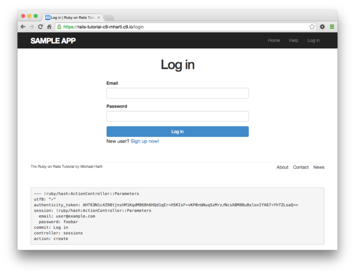
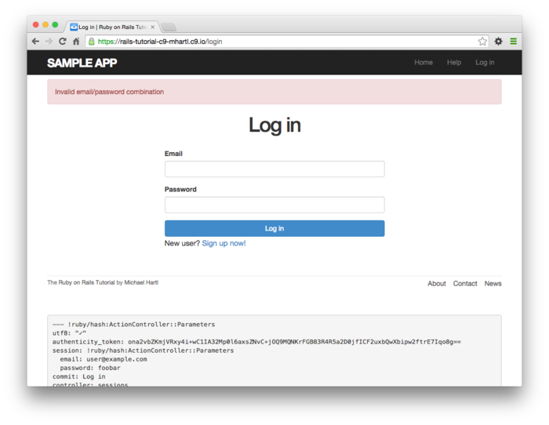
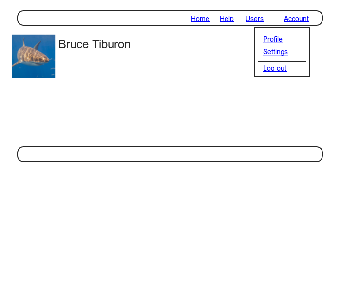
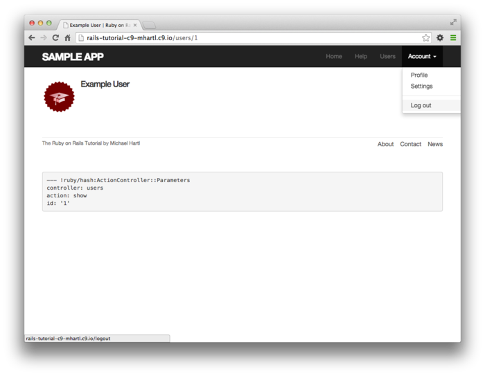

# 	제 8장 기본적인 로그인 기능

[제 7장](Chapter7.md) 에서 Web사이트에서의 신규 유저 등록이 가능하게 되었습니다. 이번에는 유저가 로그인하거나 로그아웃할 수 있게 해봅시다. 이번 챕터에서는 로그인의 기본적인 구조를 구현해보겠습니다. 여기서 말하는 로그인의 기본적인 구조란, 브라우저가 로그인하고 있는 상태를 유지하고, 유저에 의해 브라우저가 닫혀지면 그 상태를 없애버리는 구조 (*인증 시스템(Authentification System*)) 입니다. 이 인증시스템의 기반을 구현한다면, 로그인되어져있는 유저 (current user) 만이 접근할 수 있는 페이지나, 무언가를 조작할 수 있는 기능 등을 제어할 수 있습니다. 또한 이러한 제한이나 제어의 구조를 *인가 모델(Authorization Model)* 이라 부릅니다. 예를 들어 이번 챕터에서 구현하는 로그인상태인지 아닌지를 헤더부분에서 확인할 수 있는 구조도 이것에 해당하빈다.


이 인증시스템과 인가모델은, 나중에 구현할 Sample 어플리케이션의 여러가지 기능의 기반이 될 구조입니다. 예를 들어 제 10장에서는 로그인한 유저만이 유저의 리스트페이지로 이동할 수 있게 한다던지, 문제가 없는 유저만이 자신의 프로필 정보를 편집할 수 있게 한다던지, 관리자만이 다른 유저를 데이터베이스로부터 삭제할 수 있게 됩니다. 제 13장에서는 이번 챕터에서 사용할 수 있게되는 로그인 상태의 유저 (current user) 를 이용하여 유저의 아이디와 마이크로포스트를 연관시키게 하는 구조를 구현합니다. 마지막 제 14장에서는 다른 유저를 팔로우하는 기능이나 자신의 피드 리스트를 구현할 때, "누가 로그인해있는가" 라는 정보가 필요하게 됩니다.


또한 제 9장에서는 이번 챕터에서 구축한 기본적인 로그인 기능을 개선하여 보다 더 발전적인 로그인 기능을 구현할 것입니다. 예를 들어 이번 챕터에서 구축하는 기능으로는 브라우저를 닫으면 로그인한 유저 정보를 강제적으로 삭제하도록 합니다만, 제 9장에서 개선한 인증 기능에서는 유저가 *임의* 의 브라우저에 로그인정보를 기억시키는 (remember me) 기능을 구현할 것입니다. (구체적으로는 [remember me] 라고 하는 체크박스를 로그인 폼에 준비할 것입니다.) 이번  8장과 9장을 통해 

1. 브라우저를 닫으면 로그인 정보를 파기한다 (Session)
2. 유저의 로그인 정보를 자동으로 보존한다 (Cookie)
3. 유저가 체크박스를 On 한 경우에만 로그인 정보를 저장한다 (Remember me)

라고 하는 3개의 일반적인 로그인 구조를 구현할 것입니다.


## 8.1 Session

[HTTP](https://ja.wikipedia.org/wiki/Hypertext_Transfer_Protocol) 는 [*Stateless 한 프로토콜*](https://ja.wikipedia.org/wiki/ステートレス・プロトコル) 입니다. 문자대로 "상태(State)" 가 "없기(less)" 떄문에 HTTP의 리퀘스트 하나하나는 그 이전의 리퀘스트 정보를 전혀 이용할 수 없는, 독립적인 트랜잭션으로써 다루게됩니다. HTTP는 말하자면, 리퀘스트가 끝나면 무엇이든 잃어버리고, 다음부터는 다시 제일 처음부터 다시 시작해야하는 건망증적인 프로토콜이며, 과거를 기억해내지 못하는 여행자와 같은 느낌입니다. (그러나, 그렇기 때문에 이 프로토콜은 매우 좋은 것입니다.) 이 본질적인 특성으로 인하여, 브라우저의 어느 페이지에서 다른 페이지로 이동할 때에 유저의 ID를 저장할 수단이 [HTTP 프로토콜 "내부"](https://ja.wikipedia.org/wiki/Hypertext_Transfer_Protocol#.E5.8B.95.E4.BD.9C) 에는 전혀 없습니다. 유저 로그인이 필요한 Web 어플리케이션에는 [*세션 (Session)*](https://ja.wikipedia.org/wiki/セッション#.E3.82.B3.E3.83.B3.E3.83.94.E3.83.A5.E3.83.BC.E3.82.BF) 이라고 불리는 반영속적인 접속을 컴퓨터 사이에(유저의 개인 컴퓨터의 Web 브라우저와 Rails의 서버 등) 별도로 설정합니다. 

세션은 HTTP 프로토콜의 계층과는 다르기 (좀 더 상위 계층) 때문에, HTTP의 특성과는 별도로 (약간 영향은 있지만) 접속을 확보할 수 있습니다. 


Rails의 세션을 구현하기 위한 방법으로 제일 일반적인 것은, [*cookies*](https://ja.wikipedia.org/wiki/HTTP_cookie) 를 사용하는 방법입니다. cookie는 유저의 브라우저에 저장되는 어떠한 작은 텍스트 데이터입니다. cookie는 어떤 페이지에서 다른 페이지로 이동할 때에도 없어지지 않기 때문에 여기에 유저 ID 등의 정보를 저장할 수 있습니다. 어플리케이션은 cookie내의 데이터를 사용하여, 예를 들어 로그인 중인 유저가 가지고 있는 정보를 데이터베이스에서 조회할 수 있습니다. 이번 섹션 및 8.2에서는, 그 이름을 또한 `session` 이라고 하는 Rails의 메소드를 사용하여 일시적인 세션을 작성해볼 거싱빈다. 이 일시적인 세션은, 브라우저를 닫으면 자동적으로 종료합니다. 이어서 제 9장에서는 Rails의 `cookies` 메소드를 사용하여 좀 더 오래가는 세션의 작성방법에 대해 배워볼 것입니다.


세션을 RESTful한 리소스로서 모델링할 수 있다면, 다른 RESTful 리소스와돠 한 번에 이해할 수 있어서 매우 편리합니다. 로그인 페이지에서는 `new` 로 세로운 세션을 출력하여, 해당 페이지에 로그인하면 `create` 로 세션을 실제로 작성하고 저장한 후, 로그아웃하면  `destroy`  로 이용하여 파기하는 이러한 처리를 해볼 것이빈다. 단, Users 리소스와 다른 점은, Users 리소스에서는 백엔드에 User모델을 거쳐 데이터베이스 상의 영속적인 데이터에 접속할 수 있는 것에 반해, Session 리소스에서는 대신에 cookies를 저장장소로써 사용하는 점입니다. 로그인의 구조의 대부분은, cookies를 사용한 인증메커니즘에 의해 구축됩니다. 이번 섹션과 다음 센셩에서는, 세녕기능을 작성할 준비로써 Session 컨트롤러, 로그인 전용 폼, 양쪽을 이어줄 컨트롤러 상의 액션을 작성해볼 것입니다. 8.2에서는 세션을 조작하기 위해 필요한 코드를 몇 가지 추가해보고, 유저 로그인 기능을 완성시킬 예정입니다.


전 챕터와 마찬가지로 토픽브랜치로 작업을 하고 마지막에 수정사항을 머지할 것입니다.

`$ git checkout -b basic-login`

### 8.1.1 Sessions Controller

로그인과 로그아웃의 요소를, Sessions 컨트롤러의 특정한 REST 액션에 각각 대응하게끔 해봅시다. 로그인 폼은 이번 섹션에서 다루는 `new` 액션에서 처리합니다. `create` 액션에 POST 리퀘스트를 송신하면, 실제로 로그인하게 됩니다.(8.2) `destroy` 액션에 DELETE 리퀘스트를 송신하면, 로그아웃 하게 됩니다. (8.3) (이전 7장에서 HTTP 메소드와 REST 액션에 대해 관련지은 것을 떠올려보세요.)


일단, Sessions 컨트롤러와 `new` 액션을 생성하고나서 시작해봅시다.

`$ rails generate controller Sessions new`

(또한, `rails generate`로 `new` 액션을 생성하면, 그것에 대응하는 뷰도 생성됩니다. `create`나 `destroy` 에는 대응할 뷰가 필요없기 때문에, 필요 없는 뷰를 작성하지 않기 위해 여기서는 `new` 만 지정합니다. ) [7.2](Chapter7.md#72-유저-등록-Form) 의 유저 등록 페이지와 마찬가지로, 아래의 목업을 바탕으로 세션을 시작하기 위한 로그인 폼을 작성해봅시다.


Users 리소스의 떄에는 전용의 `resource` 메소드를 사용하여 RESTful한 라우팅을 자동적으로 처리해주도록 하였습니다만, Session 리소스에는 그러한 처리는 필요없습니다. 따라서 "Named Route" 만 사용합니다. 이 named route 에는 GET 리퀘스트나 POST 리퀘스트를 `login` 라우팅으로, DELETE 리퀘스트를 `logout` 라우팅으로 다룹니다. 이 라우팅을 반영한 것이 아래의 코드입니다. 또한 `rails generate controller` 에서 생성한 불필요한 라우팅은 아래 코드에서 삭제하였습니다.

```ruby
# config/routes.rb
Rails.application.routes.draw do
  root   'static_pages#home'
  get    '/help',    to: 'static_pages#help'
  get    '/about',   to: 'static_pages#about'
  get    '/contact', to: 'static_pages#contact'
  get    '/signup',  to: 'users#new'
  get    '/login',   to: 'sessions#new' #추가
  post   '/login',   to: 'sessions#create' #추가
  delete '/logout',  to: 'sessions#destroy' #추가
  resources :users
end
```

위 라우팅으로 인하여 로그인용 named route를 사용할 수 있게 할 필요가 있습니다. controller를 작성할 때 생성된 테스트파일을 이용하여 테스트를 진행해봅니다.

```ruby
# test/controllers/sessions_controller_test.rb
require 'test_helper'

class SessionsControllerTest < ActionDispatch::IntegrationTest

  test "should get new" do
    get login_path
    assert_response :success
  end
end
```

`routes.rb` 에서 정의한 라우팅의 URL이나 액션은 유저용의 URL이나 액션과 대강 비슷합니다.

| **HTTP 리퀘스트** | **URL** | **Named Routes** | **Action** | **용도**                      |
| ----------------- | ------- | ---------------- | ---------- | ----------------------------- |
| `GET`             | /login  | `login_path`     | `new`      | 새로운 세션의 페이지 (로그인) |
| `POST`            | /login  | `login_path`     | `create`   | 새로운 세션의 생성 (로그인)   |
| `DELETE`          | /logout | `logout_path`    | `destroy`  | 세션의 삭제 (로그아웃)        |


Named route도 꽤나 늘어났습니다. 여기까지 추가한 모든 라우팅을 표시할 수 있으면 편리할 것 같습니다. 이러한 때 `rails routes` 커맨드를 실행해봅시다. 언제든지 현재의 라우팅을 확인할 수 있습니다.

```ruby
$ rails routes
   Prefix Verb   URI Pattern               Controller#Action
     root GET    /                         static_pages#home
     help GET    /help(.:format)           static_pages#help
    about GET    /about(.:format)          static_pages#about
  contact GET    /contact(.:format)        static_pages#contact
   signup GET    /signup(.:format)         users#new
    login GET    /login(.:format)          sessions#new
          POST   /login(.:format)          sessions#create
   logout DELETE /logout(.:format)         sessions#destroy
    users GET    /users(.:format)          users#index
          POST   /users(.:format)          users#create
 new_user GET    /users/new(.:format)      users#new
edit_user GET    /users/:id/edit(.:format) users#edit
     user GET    /users/:id(.:format)      users#show
          PATCH  /users/:id(.:format)      users#update
          PUT    /users/:id(.:format)      users#update
          DELETE /users/:id(.:format)      users#destroy
```

지금은 위 라우팅을 완전히 이해할 필요는 없습니다. 그렇지만 이 리스트를 대강 보고만 있어도 어플리케이션에서 서포트하고 있는 모든 액션이 이 리스트에 있음을 알아챌 수 있을겁니다.

##### 연습

1. `GET login_path` 와 `POST login_path` 와의 차이점을 설명할 수 있겠습니까?
2. 터미널의 파이프기능을 사용하여 `rails routes` 의 실행결과와 `grep` 커맨드를 이어서, Users 리소스에 관한 라우팅만을 표시할 수 있습니다. 마찬가지로 Session 리소스의 관한 결과만을 표시해 봅시다. 현재 몇가지의 Sessions 리소스가 있나요? *Hint* : 파이프나 `grep` 의 사용방법을 잘 모를 때에는 [*Learn Enough Command Line to Be Dangerous*](http://learnenough.com/command-line-tutorial) 의 [Section on Grep](https://www.learnenough.com/command-line-tutorial#sec-grepping) 을 참고해보세요.

### 8.1.2 로그인 Form

컨트롤러와 라우팅을 정의했기 때문에, 이번에는 새로운 세션에서 사용할 뷰, 즉 로그인 폼을 정의해봅시다. 이전 목업들이 기억나신다면 아시겠지만, 로그인폼과 유저 등록 폼은 거의 차이가 없다는 것을 아실 것입니다. 차이라고 한다면, 4개 있던 필드가  "Email" 과 "Password" 2가지로 줄었다는 점입니다.


로그인 폼에서 입력한 정보가 잘못되었을 때에는 로그인 페이지를 한 번 더 표시하여 에러메세지를 출력시킵니다. [7.3.3](Chapter7.md#733-에러-메세지) 에서 에러메세지의 표시를 위해 전용 파셜을 사용하였습니다만, 이 파셜에는 Active Record에 의해 자동생성되는 메세지를 사용하고 있다는 것을 떠올려주세요. 이번에 다루는 세션은 Active Record 오브젝트가 아니기 때문에, 이전처럼 Active Record가 알아서 에러 메세지를 표시해준다고는 기대할 수 없습니다. 그렇기 때문에, 이번에는 플래시 메세지로 에러를 표시해보겠습니다.


이전 7장에서의 유저 등록 폼에서는 다음과 같이 `form_for` 헬퍼를 사용하여 유저의 인스턴스 변수 `@user` 를 파라미터로 사용하였습니다.

```erb
<%= form_for(@user) do |f| %>
  .
  .
  .
<% end %>
```

세션 폼과 유저 등록 폼의 제일 큰 차이는, 세션에는 Session 모델이라고 하는 것이 없으며, 그렇기 때문에 `@user` 와 같은 인스턴스 변수에 상응하는 것이 없다는 것입니다. 따라서 새로운 세션 폼을 작성할 때에는 `form_for` 헬퍼에 추가 정보를 알아서 적당히 입력하지 않으면 안됩니다.

`form_for(@user)`

Rails에서는 위와 같이 작성하는 것 만으로도 "Form의 `action` 은 /user 이라고 하는 URL로의 POST형태이다." 라는 것을 자동적으로 인식합니다만, 세션의 경우에는 리소스의 *이름* 과 그것에 대응하는 URL을 구체적으로 지정해줄 필요가 있습니다.

`form_for (:session, url:login_path)`

적절한 `form_for` 를 사용하는 것으로, 유저 등록용 폼을 참고하여 목업과 비슷한 로그인 폼을 간단히 작성해볼 수 있습니다.

```erb
<!-- app/views/sessions/new.html.erb -->
<% provide(:title, "Log in") %>
<h1>Log in</h1>

<div class="row">
  <div class="col-md-6 col-md-offset-3">
    <%= form_for(:session, url: login_path) do |f| %>

      <%= f.label :email %>
      <%= f.email_field :email, class: 'form-control' %>

      <%= f.label :password %>
      <%= f.password_field :password, class: 'form-control' %>

      <%= f.submit "Log in", class: "btn btn-primary" %>
    <% end %>

    <p>New user? <%= link_to "Sign up now!", signup_path %></p>
  </div>
</div>
```

  유저가 바로 클릭할 수 있게, 유저 등록 페이지의 링크를 추가해놓은 것을 주목해주세요. 위 코드를 사용하면 아래와 같은 로그인 폼이 표시됩니다. ([Log in] 링크가 아직 유효하지 않기 때문에, 자신이 브라우저의 주소창에 "/login" 과 URL을 직접 입력해보세요. 로그인 링크는 8.2.3에서 동작하게 될 것입니다.)


생성된 HTML 폼은 아래와 같습니다.

```html
<form accept-charset="UTF-8" action="/login" method="post">
  <input name="utf8" type="hidden" value="&#x2713;" />
  <input name="authenticity_token" type="hidden"
         value="NNb6+J/j46LcrgYUC60wQ2titMuJQ5lLqyAbnbAUkdo=" />
  <label for="session_email">Email</label>
  <input class="form-control" id="session_email"
         name="session[email]" type="text" />
  <label for="session_password">Password</label>
  <input id="session_password" name="session[password]"
         type="password" />
  <input class="btn btn-primary" name="commit" type="submit"
       value="Log in" />
</form>
```

이전 유저 등록 폼과 비교해보면, 폼의 정보 송신 후에 `params` 해시에 들어갈 값이 메일주소와 패스워드 필드에 각각 대응한 `params[:session][:email]` 과 `params[:session][:password]`  라는 점을 알 수 있습니다.

##### 연습

1. `new.html.erb` 에서 작성한 폼의 정보를 송신하면, Sessions 컨트롤러의   `create` 액션에 보내지게됩니다. Rails는 이것을 어떻게 구현하고 있는 것일까요? 생각해봅시다. *Hint*: 위 HTML의 맨 첫 줄을 주목해주세요.

### 8.1.3 유저의 검증과 인증

유저의 등록에서는 최초로 유저를 작성해보았습니다. 로그인에서 세션을 작성하는 경우, 제일 처음 이루어지는 것은, 입력이 *무효* 한 경우의 처리입니다. 제일 처음으로, 폼 데이터가 송신되어졌을 때의 동작을 생각하고 이해해봅시다. 그 다음으로 로그인이 실패했을 경우에 표시되는 에러메세지를 배치할 것입니다. 그 다음으로 로그인에 성공한 경우 (8.2)에 사용하는 기초부분을 작성해볼 것입니다. 일단 여기서는 로그인 데이터가 송신될 때마다 패스워드와 메일주소의 조합이 유효한지를 판정하는 로직을 구현해볼 것입니다.


제일 처음으로, 최소한의 `create` 액션을 Sessions 컨트롤러에서 정의하고, 아무것도 정의되어있지 않은 `new` 액션과 `destroy` 액션도 겸사겸사 작성해봅시다. 아래의 코드에서 `create` 액션의 안에서는 아무것도 이루저지지 않습니다만, 액션을 실행하면 `new` 뷰가 표시될 것이기 때문에 이걸로 충분합니다. 결과적으로는 /session/new 폼에서 데이터를 보내면 아래 두 번째 예시처럼 될 것입니다.

```ruby
class SessionsController < ApplicationController

  def new
  end

  def create
    render 'new'
  end

  def destroy
  end
end	
```



위 캡쳐에서 표시되어지고 있는 디버그 정보를 확인해주세요. [8.1.2](#812-로그인-Form) 의 마지막에서도 간단히 다루어보았던, `params` 해시에서는 다음과 같이 `session` 키의 아래에 메일주소와 패스워드가 있습니다.

```
---
session:
  email: 'user@example.com'
  password: 'foobar'
commit: Log in
action: create
controller: sessions
```

유저 등록의 경우와 마찬가지로, 이러한 파라미터는 네스트화된 해시로 되어있습니다. 특히 `params` 는 다음과 같은 네스트 해시로 되어있습니다. 해시 안에 해시가 있는 구조입니다.

`{ session: { password: "foobar", email: "user@example.com" } }`

즉, 다음과 같은 해시가 있는 경우

`params[:session]`

이 해시에 다시 해시가 포함되어 있으며

`{ password: "foobar", email:"user@example.com" }`

결과적으로는 다음과 같이 데이터를 접근할 수 있습니다.

`params[:session][:password]`

또한 위처럼 한다면 폼으로부터 송신되어진 패스워드를 확인할 수 있습니다.


요컨대 `create` 액션의 내부에는, 유저의 인증에 필요한 모든 정보를 `params` 해시로부터 간단하게 얻을 수 있는 것입니다. 그리고 인증에 필요한 모든 메소드도 8장까지 오면서 다 배웠습니다. (그렇게 되도록 본 튜토리얼이 구성되어 있습니다.) 여기서는 Active Record가 제공하는 `User.find_By` 메소드와, `has_secure_password` 가 제공하는 `authenticate` 메소드를 사용하고 있습니다. 여기서 `authenticate` 메소드는 인증에 실패했을 때 `false` 를 리턴하는 것을 기억하고 계시나요? 이상의 내용을 정리하여 유저의 로그인 부분을 구현한 것이 아래의 코드입니다.

```ruby
# app/controller/sessions_controller.rb
class SessionsController < ApplicationController

  def new
  end

  def create
    user = User.find_by(email: params[:session][:email].downcase)
    if user && user.authenticate(params[:session][:password])
      # 유저 로그인 후에 유저 정보 페이지로 리다이렉트
    else
      # 에러메세지 작성
      render 'new'
    end
  end

  def destroy
  end
end
```


`create`의 첫 번째 행에서는 전달받은 로그인폼의 메일주소를 사용하여 데이터베이스로부터 유저를 조회하고 있습니다. ([6.2.5](Chapter6.md#625-유니크성을-검증해보자) 에서는 메일주소를 모두 소문자로 변환하여 저장하고 있었던 것을 기억하시나요? 그렇기 때문에 여기서는 `downcase`메소드르 사용하여 유효한 메일주소가 입력되었을 때 확실하게 매칭될 수 있게 하고 있습니다.) 그 다음 행은 살짝 이해하기 어려울 지도 모르겠습니다만, Rails 프로그래밍에서는 정석적인 방법입니다.

`user && user.authenticate(params[:session][:password])`

`&&`(논리곱, and) 는, 조회결과로 얻은 유저가 유효한지를 판단하기 위해 사용됩니다. Ruby에서는 `nil`과 `false` 이외의 모든 오브젝트는, 진리값으로는 `true` 가 되는([4.2.3](Chapter4.md#423-오브젝트-메세지의-송수신)) 성질을 고려한다면, `&&` 의 전후의 값과 조합한 결과는 아래의 표와 같은 결과가 됩니다. 입력된 메일 주소를 가진 유저가 데이터베이스에 존재하며, 또한 입력된 패스워드가 해당 유저의 패스워드와 일치하는 경우에만 `if` 문의 결과가 `true` 가 되는 것을 알 수 있습니다. 조금 더 간략하게 설명하자면, "유저가 데이터베이스에 존재하면서, 인증에 성공했을 경우에만" 이라는 조건이 됩니다.

| **User**        | **Password**                   | **a && b**                 |
| --------------- | ------------------------------ | -------------------------- |
##### 연습

1. Rails 콘솔을 사용하여 위 표의 조건의 식이 올바른지를 확인해봅시다. 일단 `user = nil` 의 경우를, 그 다음으로는 `user = User.first` 의 경우를 확인해봅시다. *Hint* : 반드시 논리값을 가진 오브젝트가 될 수 있도록, [4.2.3](Chapter4.md#423-오브젝트-메세지의-송수신) 에서 소개해드린 `!!` 의 기술을 사용해봅시다. 예시 : `!!(user && user.authenticate('foobar'))`

### 8.1.4 flash message를 사용해보자

[7.3.3](Chapter7.md#733-에러-메세지) 에서는 유저 등록 시의 에러메세지를 표시할 때, User모델의 에러메세지를 이용했던 것을 기억하시나요? 유저 등록의 경우, 에러메세지는 특정한 Active Record 오브젝트에 관련지어져 있었기 때문에, 그 방법을 이용했습니다. 그러나 세션에서는 Active Record의 모델을 사용하고 있지 않기 때문에, 그 때의 그 방법대로는 사용할 수 없습니다. 여기서 로그인에 실패했을 경우에는 대신에 플래시 메세지를 표시하도록 해봅시다. 제일 첫 코드는 아래와 같습니다. (이 코드는 일부러 조금 틀리게 작성했습니다.)

```ruby
class SessionsController < ApplicationController

  def new
  end

  def create
    user = User.find_by(email: params[:session][:email].downcase)
    if user && user.authenticate(params[:session][:password])
      # 유저 로그인 후에 유저 정보 페이지로 리다이렉트
    else
      flash[:danger] = 'Invalid email/password combination' # 본래는 정확하지 않은 표현
      render 'new'
    end
  end

  def destroy
  end
end
```

플래시 메세지는 Web사이트의 레이아웃으로 표시되기 때문에, `flash[:danger]` 으로 설정한 메세지는 자동적으로 표시됩니다. Bootstrap CSS의 덕분으로 적절한 스타일도 표시됩니다.



위에서 설명드렸다시피, 코드가 조금 잘못되어있습니다. 페이지에서는 제대로 에러메세지를 출력하고 있습니다만, 어디가 문제일까요? 실은 위 코드대로라면은 *리퀘스트* 의 플래시 메세지가 한 번 표시되면 사라지지않고 계속 남아있게 됩니다. 7장에서는 리다이렉트를 사용했던 것 과는 다르게, 표시된 템플레이트를 `render` 메소드로 강제적으로 리렌더링하여도 리퀘스트로 판단하지 않기 때문에, 리퀘스트의 메세지가 사라지지 않습니다. 예를들어 일부러 무효한 정보를 입력하여 송신하여 에러메세지를 표시하면, Home 페이지를 쿨릭하여 이동하면 해당 화면에서도 플래시 메세지가 표시된 채로 남아있습니다. 이 문제는 8.1.5에서 수정하도록 해보겠습니다.


### 8.1.5 flash 의 테스트

플래시 메세지가 사라지지 않는 문제는, 우리의 어플리케이션의 작은 버그입니다. [컬럼 3.3](Chapter3.md#컬럼-33-결국-테스트는-언제-하는-것이-좋은가) 에서 해설한 테스트의 가이드라인에 따르면, 이것은 "에러를 캐치하는 테스트를 먼저 작성하고, 그 후에 에러가 해결되게끔 코드를 작성한다" 라는 항목에 해당하는 상황입니다. 그러면 로그인 폼의 송신에 대해 간단한 결합테스트 코드를 작성해보도록 합시다. 이 결합테스트 코드는 해당 버그에 대한 문서로도 활용될 수도 있으며 이후에 회귀버그의 발생을 막아줄 수 있는 효과도 있습니다. 게다가 앞으로 이 결합테스트를 기반으로하여 보다 더 본격적인 결합테스트 코드를 작성할 때도 편리하게 될 것입니다.


어플리케이션의 로그인의 움직임을 테스트하기 위해선, 제일 처음으로 결합테스트 코드를 작성해봅시다.

```
$ rails generate integration_test users_login
      invoke  test_unit
      create    test/integration/users_login_test.rb
```

다음으로 앞서 보았던 버그들을 재현하기 위한 필요가 있습니다. 기본적인 순서는 다음과 같습니다.

1. 로그인용 주소로 접속합니다.
2. 새로운 세션의 폼이 제대로 표시되는지를 확인합니다.
3. 일부러 무효한 `params` ㅎㅐ시를 사용하여 세션용 패스를 POST로 보냅니다.
4. 새로운 세션의 폼이 다시 출력되고, 플래시메세지가 추가되어 있는 것을 확인한다.
5. 다른 페이지 (Home 등)으로 이동한다.
6. 이동한 페이지에서 플래시메세지가 표시*되지 않는 것* 을 확인한다.

위 순서를 코드로 작성한 것이 아래와 같습니다.

```ruby
# test/intergration/users_login_test.rb
require 'test_helper'

class UsersLoginTest < ActionDispatch::IntegrationTest

  test "login with invalid information" do
    get login_path
    assert_template 'sessions/new'
    post login_path, params: { session: { email: "", password: "" } }
    assert_template 'sessions/new'
    assert_not flash.empty?
    get root_path
    assert flash.empty?
  end
end
```

위 테스트 코드를 실행하면, 실패(RED)할 것입니다.

```
$ rails test test/integration/users_login_test.rb
```

또한 위의 예시와 같이, `rails test` 의 파라미터에 테스트파일을 전달하면, 해당 테스트파일만을 실행할 수 있습니다.


위의 실패하는 테스트코드를 성공시키기 위해서는,  컨트롤러에서의 `flash` 를 `flash.now` 로 수정해야합니다. `flash.now` 는 렌더링이 끝난 페이지에서 특별하게 플래시메세지를 표시할 수 있습니다. `flash` 메세지와는 다르게, `flash.now` 의 메세지는 이 이후 리퀘스트가 발생하였을 때 사라지게 됩니다. 수정된 코드는 아래와 같습니다.

```ruby
# app/controllers/sessions_controller.rb
class SessionsController < ApplicationController

  def new
  end

  def create
    user = User.find_by(email: params[:session][:email].downcase)
    if user && user.authenticate(params[:session][:password])
      # ユーザーログイン後にユーザー情報のページにリダイレクトする
    else
      flash.now[:danger] = 'Invalid email/password combination'
      render 'new'
    end
  end

  def destroy
  end
end
```

이어서, 로그인의 결합테스트를 포함한 모든 테스트 스위트를 실행해보면, 전투 통과 (GREEN)하는 것을 확인할 수 있을 것이빈다.

```
$ rails test test/integration/users_login_test.rb
$ rails test
```

##### 연습

1. [8.1.4](#814-flash-message를-사용해보자) 의 처리 플로우가 제대로 동작하고 있는지 브라우저에서 확인해봅시다. 특히 flash가 제대로 기능하는지를 flash 메세지가 표시된 다음에 다른 페이지로 꼭 이동해보세요.


## 8.2 Login

무효한 값을 송신해도, 로그인폼에서 제대로 처리할 수 있게끔 하였습니다. 그 다음으로는 실제로 로그인 도중의 상태에서 유효한 값을 송신했을 때, 로그인 폼이 제대로 핸들링할 수 있도록 해봅시다. 이번 섹션에서는 cookie를 사용한 일시적인 세션을 사용하여 유저를 로그인할 수 있게 해보겠습니다. 이 cookies는 브라우저를 닫으면 자동적으로 무효하게 되는 성질을 가지고 있습니다. 9.1에서는 브라우저를 닫아도 보존되는 세션을 추가해볼 것입니다.


세션을 구현하기 위해서는 많은 컨트롤러나 뷰에서 매우 복잡하고 많은 수의 메소드를 정의할 필요가 있습니다. Ruby의 *모듈* 을 사용한다면, 그러한 많은 메소드르를 한 곳으로 모아 패키지화할 수 있다는 것을 [4.2.5](Chapter4.md#425-다시-한-번-Title-Helper) 에서 배웠습니다. 매우 감사하게도 Sessions 컨트롤러 ([8.1.1](#811-Sessions-Controller)) 를 생성했을 때의 시점에서 이미 세션용의 헬퍼 모듈이 생성되어 있습니다. 게다가 Rails의 세션용 헬퍼는 뷰에서도 자동적으로 인식되어 사용할 수 있습니다. Rails의 모든 컨트롤러의 상위 클래스인 Application 컨트롤러에 이 모듈을 읽어들일 수 있게한다면, 어떠한 컨트롤러에서도 사용할 수 있게 됩니다.

```ruby
# app/controllers/application_controller.rb
class ApplicationController < ActionController::Base
  protect_from_forgery with: :exception
  include SessionsHelper
end
```

설정이 끝났다면, 드디어 유저 로그인 기능의 코드를 작성해볼 차례입니다.

### 8.2.1 log_in 메소드

Rails에서 사전 정의가 되어있는 `session` 메소드를 사용하여, 단순한 로그인이 가능하게끔 해봅시다. (또한 이것은 [8.1.1](#811-Sessions-Controller) 에서 생성한 Sessions 컨트롤러와 아무런 관계가 없습니다.) 이 `session` 메소드는 해시처럼 사용할 수 있습니다. 값은 다음과 같이 입력합니다.

`session[:user_id] = user.id`

위 코드를 실행하면, 유저의 브라우저 내부의 일시적인 cookies에 암호화된 유저 id가 자동으로 생성됩니다. 그 다음의 페이지에서 `session[:user_id]` 를 사용하여 유저 ID의 원래 값으로 꺼내어 사용할 수 있습니다. 한편, `cookies` 메소드는 (9.1) 이 것과 대조적으로 `session` 메소드에서 생성된 일시적인 cookies는 브라우저를 닫은 순간에 무효하게 되어버립니다.


같은 로그인 방법을 여러 장소에서 사용할 수 있게 하기 위해, Session 헬퍼에 `log_in` 이라고 하는 이름의 메소드를 정의해보도록 합시다.

```ruby
# app/helpers/sessions_helper.rb
module SessionsHelper

  def log_in(user)
    session[:user_id] = user.id
  end
end
```

`session` 메소드에서 생성한 일시 cookies는 자동적으로 암호화되기 때문에 위 코드는 보호받게 됩니다. 그리고 여기가 중요한 포인트입니다만, 공격자가 설령 이 정보를 cookies로부터 빼내려한다고 하더라도, 그 것을 사용하여 진짜 유저로서 로그인할 수는 없습니다. 단, 지금 여기서 말씀드린 `session` 메소드를 "일시적인 세션" 에만 해당하는 말입니다. `cookies` 메소드를 사용하여 작성한 "영구적인 세션" 에서는 정보가 빠져나갔어도 그 것을 이용하여 로그인할 수 없다고는 *단언할 수 없습니다.* 영속적인 cookies에는 *세션 하이잭* 이라는 공격을 받을 가능성이 항상 있습니다. 유저의 브라우저 상의 저장되는 정보에 대해서는 제 9장에서 조금 더 주의깊게 다루어보도록 해보겠습니다.


위 코드에서 `log_in` 이라고 하는 헬퍼 메소드를 정의하였기에, 드디어 유저 로그인하여 세션의 `create` 메소드를 완료하고, 유저의 프로필 페이지로 리다이렉트할 준비가 되었습니다. 작성한 코드는 아래와 같습니다.

```ruby
# app/controllers/sessions_controller.rb
class SessionsController < ApplicationController

  def new
  end

  def create
    user = User.find_by(email: params[:session][:email].downcase)
    if user && user.authenticate(params[:session][:password])
      log_in user
      redirect_to user
    else
      flash.now[:danger] = 'Invalid email/password combination'
      render 'new'
    end
  end

  def destroy
  end
end
```

위 코드에서는 리다이렉트를 사용하고 있습니다만,

`redirect_to user`

이 것은 [7.4.1](Chapter7.md#741-등록-Form의-완성) 에서 사용한 메소드와 동일한 구조입니다. Rails에서는 위의 코드를 자동적으로 변환하여 다음과 같은 프로필페이지로 라우팅합니다.

`user_url(user)`

위 `sessions_controller.rb` 코드의 `create` 액션의 정의가 완성되었습니다. 8.4에서 정의할 로그인폼도 제대로 동작할 것입니다. 지금은 로그인해도 화면표시가 변하지 않기 때문에 유저가 로그인중인지 아닌지는 브라우저 세션을 직접 확인하지 않으면 알 수 없습니다. 이 상태로는 곤란하니, 로그인하고 있는 것을 알 수 있게 해봅시다. [8.2.2](#822-현재의-유저) 에서는 세션에 포함되어 있는 ID를 이용하여, 데이터베이스로부터 현재의 유저이름을 조회하여 화면에 표시할 예정입니다. 8.2.3에서는 어플리케이션의 레이아웃 상의 링크를 변경할 예정입니다. 이 링크를 클릭하면 현재 로그인하고 있는 유저의 프로필이 표시됩니다.

##### 연습

1. 유효한 유저로 실제로 로그인하여, 브라우저에서 cookies의 정보를 확인해보세요. 이 때, session값은 어떻게 되어있습니까? *Hint* : 브라우저에서 cookies를 알아보기 위한 방법은 알고 계신가요? 한 번 검색해보세요.
2. 1번을 한 것과 마찬가지로 `Expires` 의 값에 대해 알아보세요.

### 8.2.2 로그인 되어있는 유저

유저 ID를 일시적인 세션의 안에 안전하게 보관할 수 있게 되었습니다. 이번에는 해당 유저 ID를 다른 페이지에서도 사용할 수 있게 해봅시다. 그렇게 하기 위해서는 `current_user` 메소드를 정의하여, 세션ID에 대응하는 유저이름을 데이터베이스로부터 조회할 수 있도록 해봅시다. `current_user` 메소드의 목적은 다음과 같은 코드를 작성하기 위함입니다.

`<%= current_user.name %>`

또한 이러한 코드로 유저의 프로필 페이지에 간단하게 리다이렉트할 수 있게 하려합니다.

`redirect_to current_user`

이 때, 현재 유저를 검색하는 방법으로써 떠오르는 것은, 프로필 페이지와 마찬가지로 다음의 `find` 메소드를 사용하는 것입니다.

`User.find(session[:user_id])` 

그러나 [6.1.4](Chapter6.md#614-User-Object를-검색해보자) 에서 이미 해본 것 처럼, 유저 ID가 존재하지 않는 상태에서 `find` 를 사용하면 Exception이 발생해버리빈다. find의 이러한 동작은, 프로필 페이지에서는 적절한 동작이었습니다. ID가 유효하지 않은 경우에는 Exception을 발생시키지 않으면 안되었기 때문입니다. 그러나 "유저가 로그인 하고 있지 않다." 등의 상황을 생각할 수 있는 이번 케이스 같은 경우에는, `session[:user_id]` 의 값은 `nil` 이 됩니다. 이 상태를 수정하기 위해서는 `create` 메소드 내부에 메일주소를 검색하는 것과 마찬가지인, `find_by` 메소드를 사용해야합니다. 단, 이번에는 `email` 이 아닌 `id` 로 검색합니다.

`User.find_by(id:session[:user_id])`

이번에는 ID가 유효하지 않은 경우 (유저가 존재하지 않는 경우) 에도 메소드는 예외를 발생시키지 않고, `nil` 를 리턴합니다.


이 방법을 이용하여 `current_user` 를 다음과 같이 수정해봅시다.

```ruby
def current_user
  if session[:user_id]
    User.find_by(id: session[:user_id])
  end
end
```

세션에 유저 ID가 존재하지 않ㅇ는 경우, 이 코드는 단순히 종료하고 자동적으로 `nil` 을 리턴하게 됩니다. 이것이 우리가 원하는 동작입니다. `current_user` 메소드가 하나의 리퀘스트내부의 처리에서 몇번이나 호출된다면, 호출된 횟수분 데이터베이스로의 조회가 발생하고, 결과적으로는 처리가 완료하기 까지의 시간이 길어지게 되어버립니다.


또한 Ruby의 관습에 따라, `User.find_by` 의 실행결과를 인스턴스 변수에 저장하는 방법도 생각해야합니다. 이렇게 함으로써 하나의 리퀘스트 내부에서 발생하는 데이터베이스로의 조회는 최초의 단 한 번만 실행하게 되며, 이후 발생하는 호출에 대해서는 인스턴스 변수의 결과를 재이용하게 됩니다. 조금 멋지지 않을수도 있습니다만, 이러한 생각이 Web 서비스를 고속화하게되는 중요한 테크닉 중 하나입니다.

```ruby
if @current_user.nil?
  @current_user = User.find_by(id: session[:user_id])
else
  @current_user
end
```

*OR 연산자* ( || ) ([4.2.3](Chapter4.md#423-오브젝트-메세지의-송수신)) 의 코드를 사용하면, 위 코드를 간단하게 작성할 수도 있습니다.

```ruby
@current_user = @current_user || User.find_by(id: session[:user_id])
```

여기서 중요한 것은, User 오브젝트 그 자체의 논리값은 항상 True라는 것입니다. 그 덕분에 `@current_user` 에 아무것도 대입되어있지 않은 경우만 `find_by` 가 실행되어 쓸모없는 데이터베이스로의 검색이 발생하지 않게됩니다.


위 코드는 일단은 움직입니다만, 실제로는 아직 "Ruby 답지 않은", 올바른 코드가 아닙니다. `@current_user` 로의 대입은, Ruby에서는 다음과 같이 단축형으로 작성하는 것이 올바른 방법이긴 합니다.

`@current_user ||= User.find_by(id:session[:user_id])`

처음 본 분이라면 꽤나 헷갈릴 수 있다고 생각합니다. 그러나 Ruby 커뮤니티에서는 이러한 " ||= " 기법이 널리 보급되어 있습니다.

###### 컬럼 8.1 "||=" 은 무엇인가?

> 이 "||="(or equal) 이라고 하는 대입연산자는, Ruby에서는 널리 쓰이고 있으며, Ruby 개발자가 되고싶다면 이 연산자에 익숙해지는 것이 중요합니다. *or equal* 이라고 하는 개념은, 조금은 신기하게 생각하실 수도 있으나, 다른 것과 비교해본다면 그다지 신기하지 않을 수도 있습니다.
>
>  
>
> 많은 컴퓨터 프로그램은 다음과 같은 기법으로 변수의 값을 하나씩 증가 시킬 수 있습니다.
>
> x = x + 1
>
> 그리고 Ruby (및 C, C++, Perl, Python, Java 등의 많은 프로그래밍 언어) 에서는 위의 연산은 아래와 같은 축약형으로 표현하는 것도 가능합니다.
>
> x += 1
>
> 다른 연산에 대해서도 마찬가지로 축약형을 사용할 수 있습니다.
>
> $ rails console
>
> x = 1
>
> => 1
>
> x += 1
>
> => 2
>
> x *= 3
>
> => 6
>
> x -= 8
>
> => -2
>
> x /= 2
>
> => -1
>
>  
>
> 어떤 경우에도 ● 라고 하는 연산자가 있는 경우, " x = x ● y" 와 " x ●= y " 동작은 똑같이 동작합니다.
>
> 
>
> Ruby에서는 "변수의 값이 nil이라면 변수에 대입하고, nil이 아니라면 대입하지 않는다(변수의 값을 바꾸지 않는다.)" 라고 하는 명령이 매우 많습니다. [4.2.3](Chapter4.md#423-오브젝트-메세지의-송수신) 에서 설명한 OR 연산자 || 를 사용한다면, 다음과 같이 작성할 수 있습니다.
>
> 
>
> @foo
>
> => nil
>
> @foo = @foo || "bar"
>
> => "bar"
>
> @foo = @foo || "baz"
>
> => "bar"
>
>  
>
> nil의 논리값은 false가 되기 때문에, @foo로의 첫 대입 "nil || "bar"" 의 결과값은 "bar" 가됩니다. 마찬가지로 두번쨰 대입 "@foo || "baz" " ("bar" || "baz" 등) 의 결과값은 "bar" 가 됩니다. Ruby에서는 nil과 false 를 제외하고, 모든 오브젝트의 논리값이 true가 되도록 설계되어 있습니다. 게다가 Ruby에서는 || 연산자를 몇번이나 연속해서 식의 안에 사용하는 경우, 항의 왼쪽으로부터 순서대로 평가하여 제일 처음으로 true가 된 시점에서 처리를 끝내도록 설계되어있습니다. 또한 이러한 ||식을 왼쪽에서 오른쪽으로 평가하여 연산자의 왼쪽 값이 제일 처음으로 true가 되는 시점에서 처리를 종료하는 이러한 방법은 *short-circuit evaluation* 이라고 합니다. 논리곱의 && 연산자도 비슷하게 설계되어 있으나 항을 왼쪽에서부터 평가하고 제일 처음에 false가 되는 시점에서 처리를 종료하게 되는 점이 다릅니다.
>
> 
>
> 위 연산자를 콘솔세션 상에서 실제로 실행하여 비교해보면, @foo = @foo || "bar" 는 x = x ● y에 해당하고, ●가 || 로 바뀐 것 뿐이라는 것을 알 수 있습니다.
>
> ```
>   x    =   x   +   1      ->     x     +=   1
>   x    =   x   *   3      ->     x     *=   3
>   x    =   x   -   8      ->     x     -=   8
>   x    =   x   /   2      ->     x     /=   2
>   @foo = @foo || "bar"    ->     @foo ||= "bar"
> ```
>
>  이것으로 " `@foo = @foo || "bar" "` 와 "`@foo ||= "bar" "` 는 같은 처리를 한다는 것을 이해할 수 있으실 것입니다. 이 방법을 `current_user` 의 문맥에서 사용하면 다음과 같이 간결한 코드가 됩니다.
>
>  
>
> @current_user || = User.find_by(id: session[:user_id])
>
>  
>
> 한 번 직접 작성해보세요.

앞서 말씀드린 간결한 기법을 `current_user` 메소드에 적용한 결과가 아래와 같습니다. (덧붙여서, 이러한 기술 방법은 `session[:user_id` 가 조금 불필요하게 반복되어 기술되어 있습니다. 9.1.2에서 이러한 중복을 해결해볼 것입니다.)

```RUBY
# app/helper/sessions_helper.rb
module SessionsHelper

  # 입력받은 유저로 로그인한다
  def log_in(user)
    session[:user_id] = user.id
  end

  # 현재 로그인 중인 유저 정보를 입력한다.
  def current_user
    if session[:user_id]
      @current_user ||= User.find_by(id: session[:user_id])
    end
  end
end
```

위 `current_user` 메소드가 움직이게 되었습니다. 유저가 로그인해있는지 아닌지에 따라 어플리케이션의 동작을 변경할 수 있는 조건이 되었습니다.

##### 연습

1. Rails 콘솔을 사용하여 `User.find_by(id: ...)` 에 대응하는 유저가 검색되지 않았을 때, `nil` 을 리턴하는 지 확인해봅시다.
2. 위와 마찬가지로, 이버넹는 `:user_id` 키를 가지는 `session` 해시를 작성해봅시다. 아래의 코드의 순서로 `||=` 연산자가 제대로 동작하는지를 확인해봅시다.

```ruby
>> session = {}
>> session[:user_id] = nil
>> @current_user ||= User.find_by(id: session[:user_id])
<여기에 무엇이 표시되나요?>
>> session[:user_id]= User.first.id
>> @current_user ||= User.find_by(id: session[:user_id])
<여기에 무엇이 표시되나요?>
>> @current_user ||= User.find_by(id: session[:user_id])
<여기에 무엇이 표시되나요?>
```

### 8.2.3 레이아웃 링크를 변경해보자

로그인 기능의 제일 처음으로, 구체적인 응용 방법으로서 유저가 로그인하고 있을 때와 그렇지 않을 때의 레이아웃을 변경해봅시다. 특히 아래와 같은 목업으로 표시한 것 처럼, "로그아웃" 링크, "유저 설정" 링크, "유저 리스트" 링크, "프로필 표시" 링크도 추가해봅시다. 아래 목업에서는 로그아웃의 링크와 프로필 링크는 "Account" 메뉴의 항목으로써 표시되는 점에 주목해주세요. 이후에 Bootstrap을 사용하여 아래와 같은 메뉴를 구현해볼 것 입니다.



필자라면 이 시점에서 메뉴에 대한 결합 테스트 코드를 작성할 것 같습니다. [컬럼 3.3](Chapter3.md#컬럼-33-결국-테스트는-언제-하는-것이-좋은가) 에서도 설명드렸다 시피, Rails의 테스트 툴을 몸에 익혀감에 따라, 아무것도 제시되어 있지 않은 상황이라도 필자처럼 이 시점에서 테스트를 작성해보고 싶어질 것입니다. 그렇다고는 해도 지금은 무리하지 않아도 됩니다. 이 테스트 또한 몇가지 새로운 개념을 배울 필요가 있기 때문에, 테스트 코드의 작성은 8.2.4 이후에 해보겠습니다.


그럼 레이아웃의 링크를 변경하는 방법으로써 생각해봄직한 것은, ERB코드의 안에서 if-else 를 이용하여 조건에 맞게 표시하는 링크를 구분하는 것입니다.

``` erb
<% if logged_in? %>
  // 로그인해있는 유저용의 링크
<% else %>
  // 로그인해있지 않았을 때의 링크
<% end %>
```

이 코드를 작성하기 위해서는, 논리값을 리턴하는 `logged_in?` 메소드가 필요하기에, 일단 해당 메소드를 정의해봅시다.


유저가 로그인 중의 상태라는 것은, "session에 유저 ID가 존재한다" 라는 것입니다. 즉, `current_user` 가 `nil` 이 아니라는 상태를 의미합니다. 이것을 체크하기 위해서는 부정연산자 ([4.2.3](Chapter4.md#423-오브젝트-메세지의-송수신)) 가 필요하기 때문에, `!` 를 사용해봅시다. 사용한 `logged_in?` 메소드는 아래와 같습니다.

```ruby
# app/helpers/sessions_helper.rb

module SessionsHelper

  # 전달받은 유저로 로그인한다
  def log_in(user)
    session[:user_id] = user.id
  end

  # 현재 로그인 중인 유저를 리턴한다
  def current_user
    if session[:user_id]
      @current_user ||= User.find_by(id: session[:user_id])
    end
  end

  # 유저가 로그인 해 있으면 true, 아니라면 false를 리턴한다.
  def logged_in?
    !current_user.nil?
  end
end
```

위 코드를 추가했으니, 이것으로 유저가 로그인했을 떄의 레이아웃을 변경할 준비가 되었습니다. 또한 새롭게 만들 링크는 4개입니다만, 이 중 다음 2개의 링크에 대해서는 일단은 작성하지는 않을 것입니다. (제 10장에서 작성합니다.)

```
<%= link_to "Users",    '#' %>
<%= link_to "Settings", '#' %>
```

로그아웃 용의 링크는, 이전에 정의한 로그아웃 용 패스를 사용합니다.

```
<%= link_to "Log out", logout_path, method: :delete %>
```

위 코드에서는 로그아웃 용 링크의 파라미터로써 해시값을 넘기고 있는 점을 확인해주세요. 이 해시는 HTTP의 DELETE 리퀘스트를 사용하도록 지시하고 있습니다. 프로필용 링크에 대해서도 마찬가지로 다음과 같이 변경해줍니다.

```
<%= link_to "Profile", current_user %>
```

위 코드는 생략형으로, 아래와 같이 작성하는 것도 가능합니다.

```
<%= link_to "Profile", user_path(current_user) %>
```

하지만 이번 경우에서는 `current_user` 를 사용하는 것이, Rails에 의해 `user_path(current_user)` 로 변환되어, 프로필 링크가 자동적으로 생성되도록 하는 것이 편리할 것입니다. 다음으로, 유저가 로그인*하고 있지 않은 경우* , 로그인용 패스를 사용하여 다음과 같이 로그인 폼으로의 링크를 작성합니다.

```
<%= link_to "Log in", login_path %>
```

여기까지의 수정결과를 헤더의 파셜부분에 적용하면, 아래와 같이 될 것 입니다.

```ERB
<!-- app/views/layouts/_header.html.erb -->

<header class="navbar navbar-fixed-top navbar-inverse">
  <div class="container">
    <%= link_to "sample app", root_path, id: "logo" %>
    <nav>
      <ul class="nav navbar-nav navbar-right">
        <li><%= link_to "Home", root_path %></li>
        <li><%= link_to "Help", help_path %></li>
        <% if logged_in? %> <!-- 추가 -->
          <li><%= link_to "Users", '#' %></li> <!-- 추가 -->
          <li class="dropdown">
            <a href="#" class="dropdown-toggle" data-toggle="dropdown">
              Account <b class="caret"></b>
            </a>
            <ul class="dropdown-menu">
              <li><%= link_to "Profile", current_user %></li> <!-- 추가 -->
              <li><%= link_to "Settings", '#' %></li> <!-- 추가 -->
              <li class="divider"></li>
              <li>
                <%= link_to "Log out", logout_path, method: :delete %> <!-- 추가 -->
              </li>
            </ul>
          </li>
        <% else %> <!-- 추가 -->
          <li><%= link_to "Log in", login_path %></li> <!-- 추가 -->
        <% end %> <!-- 추가 -->
      </ul>
    </nav>
  </div>
</header>
```

레이아웃에 새롭게 링크를 추가했습니다. 위 코드에는 Bootstrap의 드롭다운 메뉴 기능을 적용할 수 있는 상태가 되었습니다. 구체적으로는 Bootstrap에 포함되어 있는 CSS의 `dropdown` 클래스와 `dropdown-menu` 등을 사용합니다. 이러한 드롭다운기능을 유효하게 하기 위해서, Rails의 `application.js` 파일을 통해, Bootstrap의 적용되어 있는 Javascript 라이브러리와 jQuery를 읽어들일 수 있도록, 에셋 파이프라인에 작성합니다.

```javascript
// app/assets/javascripts/appllication.js

//= require rails-ujs
//= require jquery
//= require bootstrap
//= require turbolinks
//= require_tree .
```

이 시점에서, 로그인 패스에 접속하여 유효한 유저 (유저 이름이 `example@railstutorial.org`, 패스워드는 `foobar`) 로서 로그인할 수 있게 되었습니다. 지금까지의 3개의 섹션에서의 코드를 효율좋게 테스트할 수 있게 되었습니다. 위 2개의 코드에 의하여 아래와 같이 드롭다운 메뉴와 로그인 중의 유저용의 링크가 표시되는 것을 확인해봅시다.


또한 브라우저를 완전히 닫으면, 예상대로 어플리케이션의 로그인 정보가 삭제되고, 다시 로그인해야하는 것을 확인해봅시다.



##### 연습

1. 브라우저의 cookie 인스펙터 기능을 사용하여, 세션용의 cookie를 삭제해보세요. 헤더부분에 있는 링크는 로그인하지 않은 상태의 링크로 돌아가나요? 확인해봅시다.
2. 한 번 더 로그인해서, 헤더의 레이아웃이 변한 것을 확인해봅시다. 그 다음, 브라우저를 새로 열고, 다시 로그인하지 않은 상태로 되어있는지 확인해보세요. *주의* : 만약, 브라우저의 "닫기 전 상태로 되돌아가기" 기능을 사용하고 있다면, 세션정보도 복원될 가능성이 있습니다. 만약 이 기능을 사용하고 있는 경우에는, 잊지말고 Off로 해주시길 바랍니다.

### 8.2.4 레이아웃의 변경을 테스트해봅시다.

어플리케이션에서의 로그인 성공을 수동으로 확인해보았습니다. 일단 좀 더 진행하기 전에, 결합테스트 코드를 작성하여 해당 동작을 테스트로 표현하고, 이후의 회귀버그의 발생을 캐치할 수 있도록 해봅시다. 아래의 조작순서를 테스트 코드로 작성하여 확인해봅시다.

1. 로그인용의 패스로 접속한다.
2. 세션용의 패스에 유효한 정보를 POST로 보낸다.
3. 로그인 용 링크가 표지되지 않는 것을 확인한다.
4. 로그아웃용 링크가 표시되는 것을 확인한다.
5. 프로필용 링크가 표시되는 것을 확인한다.

위 변경을 확인하기 위해서는, 테스트 시에 등록이 끝난 유저로 로그인해놓을 필요가 있습니다. 당연하지만, 데이터베이스에 해당 유저가 등록되어있지 않으면 안될 것입니다. Rails에서는, 이러한 테스트요으이 데이터를 *fixture* 로 작성할 수 있습니다. 이 fixture를 사용하여, 테스트에 필요한 데이터를 test데이터베이스에 저장해놓을 수도 있습니다. [6.2.5](Chapter6.md#625-유니크성을-검증해보자) 에서는 메일의 유니크성 테스트가 통과할 수 있기 위한 디폴트값의 fixture를 삭제할 필요가 있었습니다. 이번에는 자신이 직접 빈 fixture 파일을 작성하여 데이터에 추가해봅시다.


현 시점에서의 테스트에서는, 유저는 한 명이면 충분합니다. 해당 유저에게는 유효한 이름과 유효한 메일주소를 설정합니다. 테스트중에 해당 유저로써 자동로그인하기 위해서, 해당 유저의 유효한 패스워드도 준비하여 Session 컨트롤러의 `create` 액션에 송신된 패스워드와 비교할 수 있도록 할 필요가 있습니다. 이전 6장에서의 데이터 모델을 한 번 더 확인해보면, `password_diegest` 속성을 유저의 fixture 에 추가하면 된다는 것을 알 수 있을 것이빈다. 그 때문에, `digest` 메소드를 독자적으로 정의해보도록 합시다.


[6.3.1](Chapter6.md#631-해시화된-비밀번호) 에서 설명드린 것 처럼, `has_secure_password` 에서 bcrypt 패스워드가 생성되기 때문에, 같은 방법으로 fixture용의 패스워드를 생성해봅시다. Rails의 [secure_password의 소스코드](https://github.com/rails/rails/blob/master/activemodel/lib/active_model/secure_password.rb) 를 확인해보면, 다음의 부분에서 패스워드가 생성되는 것을 알 수 있을 것입니다.

```
BCrypt::Password.create(string, cost: cost)
```

위 `string` 은 해시화하는 문자열, `cost` 는 *코스트 파라미터* 로 불리는 값입니다. 코스트 파라미터에서는, 해시를 산출하기 위한 계산 코스트를 지정합니다. 코스트 파라미터의 값을 높게 설정하면, 해시로부터 오리지널의 패스워드를 계산하여 추축하는 것은 매우 어렵게 되기에, 실제 배포환경에서는 보안상 매우 중요합니다. 하지만 테스트 중에서는 코스트를 높게할 의미는 없기 때문에, `digest` 메소드의 계산은 되도록 가볍게 해놓고 싶습니다. 이 점에 대해서도,  `secure_password` 의 소스코드에는 다음과 같은 행을 참고할 수 있습니다.

```
cost = ActiveModel::SecurePassword.min_cost ? BCrypt::Engine::MIN_COST :
                                              BCrypt::Engine.cost
```

조금 읽기 어려울 수 있습니다만, 코스트 파라미터를 테스트 중에는 최소화하고, 실제 배포환경에서는 제대로된 계산을 할 수 있도록하면 충분합니다. 또한 `?` ~ `:` 라고 하는 문법에서는, 9.2 에서 설명합니다.


이 `digest` 메소드는, 이후 여러가지 장면에서 활용할 것입니다. 예를 들어 9.1.1 에서는 `digest` 를 다시 사용하기 때문에, 이 `digest` 메소드는, User 모델 (`user.rb`) 에 작성해도록 합시다. 이 계산은 유저마다 적용할 필요는 없기 때문에, fixture 파일 등에서 일부러 유저 오브젝트에 액세스할 필요는 없습니다. (즉, 인스턴스 메소드에서 정의할 필요는 없습니다.) 그렇기 때문에,  `digest` 메소드를 User 클래스 자신 내부에 작성하고 클래스 메소드로 사용하도록 합시다. (*클래스 메소드* 의 작성방법에 대해서는 [4.4.1](Chapter4.md#441-Constructor) 에서 간단히 설명했습니다.) 작성한 코드는 아래와 같습니다.

```ruby
# app/models/user.rb

class User < ApplicationRecord
  before_save { self.email = email.downcase }
  validates :name,  presence: true, length: { maximum: 50 }
  VALID_EMAIL_REGEX = /\A[\w+\-.]+@[a-z\d\-.]+\.[a-z]+\z/i
  validates :email, presence: true, length: { maximum: 255 },
                    format: { with: VALID_EMAIL_REGEX },
                    uniqueness: { case_sensitive: false }
  has_secure_password
  validates :password, presence: true, length: { minimum: 6 }

  # 추가 #
  # 입력받은 문자열의 해시값을 리턴
  def User.digest(string)
    cost = ActiveModel::SecurePassword.min_cost ? BCrypt::Engine::MIN_COST :
                                                  BCrypt::Engine.cost
    BCrypt::Password.create(string, cost: cost)
  end
  # 추가 #
end
```

위 코드에서 `digest` 메소드를 작성했습니다. 유효한 유저를 나타낼 fixture 를 작성할 수 있게 되었습니다.

```ruby
michael:
  name: Michael Example
  email: michael@example.com
  password_digest: <%= User.digest('password') %>
```

위 코드에 있는 것 처럼, fixture 에서는 ERB코드를 작성할 수 있는 것을 확인해주세요.

`<%= User.digest('password') %>`

위 ERB 코드에서 테스트 유저용의 유효한 패스워드를 작성할 수 있습니다.


 `has_secure_password` 에서 필요한 `password_digest` 속성은 이것으로 준비가 끝났습니다만, 해시화되지 않은 패스워드도 참조할 수 있으면 편리할 것입니다. 그러나 안타깝게도, fixture 에서는 이렇게 하는 것은 불가능합니다. 게다가 위 코드에서 `password` 속성을 추가하면, 그러한 컬럼은 데이터베이스에 존재하지 않는다고하는 에러가 발생합니다. 실제로, 데이터베이스에는 그러한 컬럼은 존재하지 않습니다. 이런 상황을 돌파하기 위해, 테스트용의 fixture 에서는 모두 같은 패스워드 `password` 라는 단어를 사용하도록 합시다. (이 것은 fixture에서 자주 사용되는 방법입니다.)


유효한 유저용의 fixture도 작성했습니다. 테스트에서는 다음과 같이 fixture 의 데이터를 참조할 수 있게 되었습니다.

```
user = users(:michael)
```

위 `users` 는 fixture의 파일이름 `users.yml` 을 나타내며, `:michael` 이라고 하는 심볼은, fixture의 유저를 참조하기 위한 키값입니다.


fixture의 유저를 참조할 수 있게 되었습니다. 레이아웃의 링크를 테스트할 준비가 되었습니다. 레이아웃의 링크를 테스트하기 위해서는 앞서 말씀드린 조작순서대로 테스트 코드를 작성해야합니다.

```ruby
# test/integration/users_login_test.rb

require 'test_helper'

class UsersLoginTest < ActionDispatch::IntegrationTest

  def setup
    @user = users(:michael)
  end
  .
  .
  .
  test "login with valid information" do
    get login_path
    post login_path, params: { session: { email:    @user.email,
                                          password: 'password' } }
    assert_redirected_to @user
    follow_redirect!
    assert_template 'users/show'
    assert_select "a[href=?]", login_path, count: 0
    assert_select "a[href=?]", logout_path
    assert_select "a[href=?]", user_path(@user)
  end
end
```

위 코드에서 다음 코드는

`assert_redirectd_to @user`

리다이렉트를 하는 곳이 올바른지를 체크하는 코드입니다.

`follow_redirect!`

또한, 위 코드는 해당 페이지에 실제로 이동합니다. 위 `user_login_test.rb` 에서는 로그인 용 링크가 표시되지 않는 것도 확인하고 있습니다. 이 체크는 로그인 패스의 링크가 페이지에 없는지를 판정합니다.

```
assert_select "a[href=?]", login_path, count: 0
```

`count: 0` 이라는 옵션을 `assert_select` 에 추가하면, 넘겨진 패턴에 일치하는 링크가 0인지를 확인하게 됩니다.


어플리케이션의 코드는 이미 동작할 수 있게 되어있습니다. 여기서 테스트를 실행하면 GREEN이 될 것입니다.

`$ rails test test/integration/users_login_test.rb`

##### 연습

1. 시험삼아, Session 헬퍼의 `logged_in?` 메소드에서 `!` 를 삭제하여 위 테스트가 RED가 되는 것을 확인해봅시다.
2. 위에서 삭제한 부분을 다시 되돌리고, 테스트가 GREEN이 되는 것을 확인해봅시다.

### 8.2.5 유저 등록 시의 로그인 처리

이상으로, 인증시스템이 동작하게 되었습니다만, 이대로는 등록이 끝난 유저가 디폴트로는 로그인하고 있지 않은 상태이기 때문에, 유저가 당황할 가능성이 있습니다. 유저 등록이 끝나고 유저에게 수동으로 로그인하게 하면, 유저에게 불필요한 조작을 강제하는 꼴이 됩니다. 유저 등록을 하면서 로그인되게끔 해봅시다. 유저 등록을 하면서 로그인하게 하려면, Users 컨트롤러의 `create` 액션에 `log_in` 을 추가하는 것으로 끝납니다.

```ruby
# ap/controllers/users_controller.rb
class UsersController < ApplicationController

  def show
    @user = User.find(params[:id])
  end

  def new
    @user = User.new
  end

  def create
    @user = User.new(user_params)
    if @user.save
      log_in @user #추가
      flash[:success] = "Welcome to the Sample App!"
      redirect_to @user
    else
      render 'new'
    end
  end

  private

    def user_params
      params.require(:user).permit(:name, :email, :password,
                                   :password_confirmation)
    end
end
```

위 코드를 테스트하기 위해서는, 이전에 작성해놓은 테스트 코드에 한 줄을 추가하여, 유저가 로그인 중인지를 체크해봅니다. 그렇게 하기 위해서는, 위에서 정의한 `logged_in?` 헬퍼 메소드와는 별도로, `is_logged_in?` 헬퍼 메소드를 정의해놓는다면 편리할 것입니다. 이 헬퍼 메소드는, 테스트의 세션에 유저가 있다면 `true`, 그렇지 않으면 `false` 를 리턴합니다. 아쉽게도, 헬퍼 메소드는 테스트에서부터 호출할 수 없습니다. `session` 메소드는 테스트에서도 이용할 수 있기 때문에, 이것을 대신 사용해봅시다. 여기에서는 실수를 막기 위해, `logged_in?` 대신에 `is_logged_in?` 을 사용하여, 헬퍼 메소드 이름이 테스트 헬퍼와 Session 헬퍼에서 호출되는 것을 막기 위함입니다.

```ruby
# test/test_helper.rb
# 테스트 중의 로그인 상태의 논리값을 리턴하는 메소드

ENV['RAILS_ENV'] ||= 'test'
.
.
.
class ActiveSupport::TestCase
  fixtures :all

  # 테스트 유저가 로그인 중인지 상태를 리턴하는 메소드
  def is_logged_in?
    !session[:user_id].nil?
  end
end
```

위 코드를 작성하면, 유저 등록이 끝난 유저가 로그인한 상태인지를 알 수 있게 됩니다.

```ruby
# test/integration/users_signup_test.rb
require 'test_helper'

class UsersSignupTest < ActionDispatch::IntegrationTest
  .
  .
  .
  test "valid signup information" do
    get signup_path
    assert_difference 'User.count', 1 do
      post users_path, params: { user: { name:  "Example User",
                                         email: "user@example.com",
                                         password:              "password",
                                         password_confirmation: "password" } }
    end
    follow_redirect!
    assert_template 'users/show'
    assert is_logged_in? #추가
  end
end
```

이 것으로 테스트를 실행하면 GREEN이 될 것입니다.

`$ rails test`

##### 연습

1. Users 컨트롤러의  `create` 액션에서 `log_in` 라인을 코멘트아웃하면, 테스트 코드의 실행결과가 RED가 되나요? 아니면 GREEN이 되나요? 확인해봅시다.
2. 현재 사용하고 있는 테스트 에디터의 기능을 사용하여, Users 컨트롤러의 코드를 한 번에 코멘트할 수 있는지 알아봅시다. 또한 코멘트처리 전후로 테스트 코드를 실행하여, 코멘트하면 RED로, 코멘트를 풀면 GREEN이 되는 것을 확인해봅시다.


## 8.3 로그아웃

[8.1](#81-Session) 에서 말씀드린 것 처럼, 이 어플리케이션에서 다루는 인증 모델에서는, 유저가 명시적으로 로그아웃할 떄까지는 로그인 상태를 유지해야만 합니다. 이번 섹션에서는 이러한 처리를 위해 필요한 로그아웃 기능을 추가해보도록 하겠습니다. 로그아웃용 링크는 이전에 작성해놓았기 때문에, 유저 세션을 없애기 위한 유효한 액션을 컨트롤러에서 작성하기만 하면 끝날 것입니다.


지금까지, Sessions 컨트롤러의 액션은 RESTful 룰에 따라 작성해왔습니다. `new` 로그인 페이지를 표시하고, `create` 에서 로그인을 완료하는 이러한 처리들이 RESTful한 처리입니다. 세션을 없애기 위한 `destroy` 액션도, 마찬가지 방법으로 작성해볼 것입니다. 단, 로그인의 경우와는 다르게, 로그아웃의 ㅊㅓ리는 한 곳에서만 처리하기 때문에, `destroy` 액션에 직접 로그아웃 처리를 작성해볼 것입니다. 9.3에서도 설명할 예정입니다만, 이러한 설계(및 약간의 리팩토링) 덕분에 인증 메커니즘의 테스트를 실행하기 쉬워집니다.


로그아웃의 처리에서는 이전에 `log_in` 메소드의 실행결과를 취소합니다. 즉, 세션에서 유저 ID를 삭제합니다. 다음과 같이 `delete` 메소드를 실행합니다.

`session.delete(:user_id)`

위 코드에서, 현재의 유저를 `nil` 로 설정합니다. 이번에는 로그인하지 않은 경우, 바로 루트 URL로 리다이렉트할 수 있게 하고 있기 때문에, 이 코드에서 특별히 문제가 될만한 것은 없습니다. 다음으로 `log_in` 및 관련 메소드와 마찬가지로,  Session헬퍼 모듈에 놓을  `log_out` 메소드를 아래와 같이 정의해봅시다.

```ruby
# app/helpers/sessions_helper.rb
module SessionsHelper

  # 입력받은 유저로 로그인합니다.
  def log_in(user)
    session[:user_id] = user.id
  end
  .
  .
  .
  # 현재의 유저를 로그아웃 합니다.
  def log_out
    session.delete(:user_id)
    @current_user = nil
  end
end
```


여기서 정의한 `log_out` 메소드는, Sessions 컨트롤러의 `destroy` 액션에서도 마찬가지로 사용할 수 있습니다.

```ruby
# app/controllers/sessions_controller.rb
class SessionsController < ApplicationController

  def new
  end

  def create
    user = User.find_by(email: params[:session][:email].downcase)
    if user && user.authenticate(params[:session][:password])
      log_in user
      redirect_to user
    else
      flash.now[:danger] = 'Invalid email/password combination'
      render 'new'
    end
  end

  def destroy # 추가
    log_out
    redirect_to root_url
  end
end
```

로그아웃 기능을 테스트하기 위해, 유저 로그인의 테스트에 순서를 약간 추가해놓읍시다. 로그인 후, `delete` 메소드 에서 DELETE 리퀘스트를 로그아웃용 패스에 보내어, 유저가 로그아웃하여 루트 URL로 리다이렉트하게 되는 것을 확인합니다. 로그인용 링크가 다시 표시되는 것과 로그아웃용 링크와 프로필용 링크가 표시되지 않는 것을 확인해봅시다. 순서대로 추가한 테스트는 아래와 같습니다.

```ruby
# test/integration/users_login_test.rb
require 'test_helper'

class UsersLoginTest < ActionDispatch::IntegrationTest
  .
  .
  .
  test "login with valid information followed by logout" do
    get login_path
    post login_path, params: { session: { email:    @user.email,
                                          password: 'password' } }
    assert is_logged_in? # 추가
    assert_redirected_to @user
    follow_redirect!
    assert_template 'users/show'
    assert_select "a[href=?]", login_path, count: 0
    assert_select "a[href=?]", logout_path
    assert_select "a[href=?]", user_path(@user)
# 추가
		delete logout_path
    assert_not is_logged_in?
    assert_redirected_to root_url
    follow_redirect!
    assert_select "a[href=?]", login_path
    assert_select "a[href=?]", logout_path,      count: 0
    assert_select "a[href=?]", user_path(@user), count: 0
# 추가    
  end
end
```

 테스트에서 `is_logged_in?` 헬퍼메소드를 사용할 수 있게 된 덕분에, 유효한 정보를 세션용 패스에 POST 로 송신한 직후에 `assert is_logged_in?` 에서 간단하게 테스트할 수 있습니다.


세션용의 `destroy` 액션의 정의와 테스트도 완성했습니다. 드디어 sample 어플리케이션의 기본이 되는 유저 등록, 로그인, 로그아웃 기능을 모두 오나성했습니다. 지금 이 시점에서도 테스트 코드는 GREEN이 될 것 입니다.

`$ rails test`

##### 연습

1. 브라우에서 [Log out] 링크를 클릭하여, 어떠한 변화가 일어나는지 확인해봅시다. 또한, 직전에 수정한 테스트코드에서 3개의 스텝을 실행해보고, 제대로 움직이는지 확인해봅시다.
2. cookies의 내용을 알아보고, 로그아웃 후에 session이 정상적으로 삭제되었는지를 확인해봅시다.


## 8.4 마지막으로

이번 챕터에서는 sample 어플리케이션의 기본적인 로그인 기능 (인증 시스템)을 구현해보았습니다. 다음 챕터에서는 이 로그인 기능을 좀 더 개선하여, 세션보다 오래 로그인 정보를 가지고 있는 방법에 대해 배워볼 것이빈다.


그러면 다음 장으로 가기 전에, 이번 장에서의 변경사항을 master 브런치에 머지해봅시다.

```
$ rails test
$ git add -A
$ git commit -m "Implement basic login"
$ git checkout master
$ git merge basic-login
```

머지 후, 리모트 레포지토리에 Push 해봅시다.

```
$ rails test
$ git push
```

마지막으로 Heroku에 배포해봅시다.

`$ git push heroku`

### 8.4.1 8장의 정리

- Rails의 `session` 메소드를 사용하면, 어떤 페이지에서 다른 페이지로 이동할 때의 상태를 유지할 수 있다. 일시적인 상태의 보존에는 cookies를 사용할 수 있다.
- 로그인폼에는 유저가 로그인하기 위해 새로운 세션을 생성한다.
- `flash.now` 메소드를 사용하면, 이미 표시된 페이지에도 플래시메세지를 표시할 수 있다.
- 테스트 주도 개발은, 회귀 버그를 막기에 편리하다.
- `session` 메소드를 사용하면, 유저 ID 를 브라우저에 일시적으로 저장할 수 있다.
- 로그인 상태에 따라 페이지 내부에 표시하는 링크를 바꿀 수 있다.
- 결합 테스트에서는 라우팅, 데이터베이스의 갱신, 레이아웃의 변경이 제대로 되는지를 확인할 수 있다.

