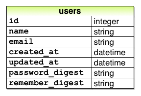
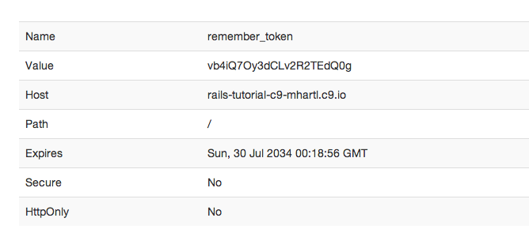
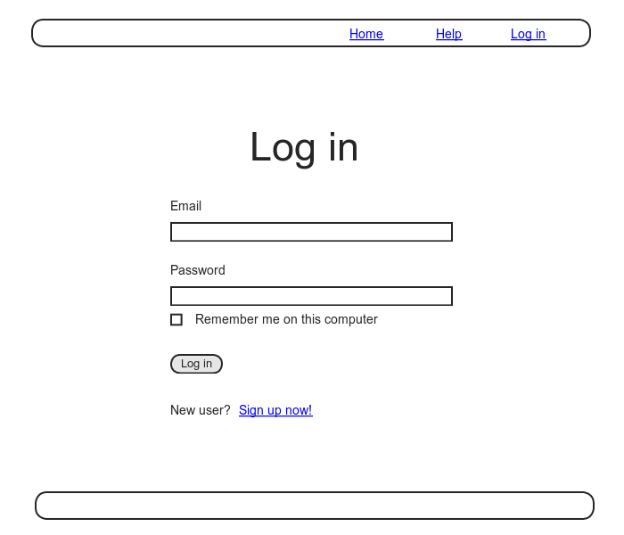
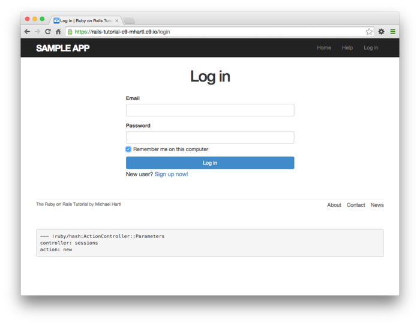

# 제 9장 진보한 로그인 기능

[제 8장](Chapter8.md) 에서는 기본적인 로그인 기능을 구현해보았습니다. 그러나 최근의 웹서비스에서는 (임의로) 유저의 로그인 정보를 기록해놓고, 브라우저가 재기동한 후에도 바로 로그인할 수 있는 기능 (remember me) 를 구현하는 것이 일반화되었습니다. 이번 챕터에서는 영속적 쿠키 (*permanent cookies*) 를 사용하여 이 기능을 구현해볼 것입니다. 구체적으로, 우선 유저의 로그인 정보를 오랫동안 유지하고 기록하는 (예를 들어, Bitbucket, Github에서 사용하는 방법) 에 대해 학습해보겠습니다. 그 후, [remember me] 체크박스를 사용하여 유저가 임의로 로그인 정보를 기억하는 방법에 대해 배워보겠습니다. (예를 들면 Twitter나 Facebook에서도 사용하고 있는 기능입니다.)


또한 sample 어플리케이션의 기본적인 로그인 기능은 [제 8장](Chapter8.md) 에서 구현해놓았기 때문에, 이번 챕터를 무시하고 제 10장으로 바로 진행하여도 괜찮습니다. (마찬가지로, Account의 유효성과 패스워드의 재설정도 스킵하고 제 13장으로 바로 진행할 수도 있습니다.) 그렇다고는 해도, [remember me] 기능의 구현방법을 배우는 것은, 앞으로 개발을 할 때 매우 도움이 될 것이며, 실제로 이후 이어지는 Account의 유효성(제11장) 이나 패스워드의 재설정(제12장) 등의 고도의 기능을 구현하기 위해서라도 이번 챕터는 빼뜨릴 수 없기도 합니다. 또한 웹 상에서 [remember me] 를 구비한 로그인 폼도 있습니다만, 이번 챕터에서는 이 기능의 내부 구조 ([Computer Magic](https://www.learnenough.com/command-line-tutorial#aside-computer_magic)) 를 알게될 절호의 기회라고도 말씀드릴 수 있습니다.


## 9.1 Remember me 기능

이번 섹션에서는 유저의 로그인 기능을 브라우저를 닫은 후에서도 유효한 [remember me] 기능을 구현해볼 것입니다. 이 기능을 사용하면, 유저가 명시적으로 로그아웃을 실행하지 않는 한, 로그인 상태를 유지할 수 있게 됩니다. 또한 이번 섹션에서의 후반에서는, 이 기능을 사용할지 말지를 유저가 정하는, [remember me] 의 체크박스를 로그인 폼에 추가해볼 것 입니다.


언제나처럼 일단 토픽 브랜치를 생성하고, 작업을 진행해보도록 합시다.

`$ git checkout -b advanced-login`

### 9.1.1 Remember Token과 암호화

[8.2](Chapter8.md#82-Login) 에서는 Rails의 `session`메소드를 사용하여 유저 ID를 저장해보았습니다. 이 정보는 브라우저를 닫으면 삭제되어버리고 맙니다. 이번 섹션에서는 세션의 영속화의 첫 번째 단계로, 기억 토큰 (*Remember token*) 을 생성하고, `cookies` 메소드를 사용하여 영속적인 cookies의 생성이나 안전성이 높은 *Remember Digest* 에 의한 토큰인증에 이 기억 토큰(Remember token) 을 활용해보겠습니다. (토큰이란, 기밀정보입니다. 패스워드와 토큰과의 차이는, 패스워드는 유저가 생성, 관리하는 정보인 것에 반해 토큰은 컴퓨터가 생성하고 관리하는 정보입니다.)


[8.2.1](Chapter8.md#821-Log_in-Method) 에서 말씀드렸다시피, `session` 메소드에서 저장한 정보는 자동적으로 안전하게 저장됩니다만, `cookies` 메소드에 보존되는 정보는 아쉽게도 이러한 처리가 되어지지 않습니다. 특히 cookies를 영속화시키면 [세션 하이잭킹](http://ja.wikipedia.org/wiki/セッションハイジャック) 이라고 하는 공격을 받을 가능성이 있습니다. 이 공격은 Rememeber token을 가로채어 특정한 유저로 대행 로그인하는 것입니다. cookies를 훔쳐내는 방법은 다음과 같습니다.

1. 관리가 제대로 되지 않는 네트워크를 통과하는 네트워크 패킷으로부터 [패킷 스니퍼](https://ja.wikipedia.org/wiki/LANアナライザ) 라고 하는 특수한 소프트웨어로 직접 cookies를 빼낸다.
2. 데이터베이스로부터 기억 토큰을 빼낸다.
3. [크로스 사이트 스크립팅 (XSS)](http://ja.wikipedia.org/wiki/クロスサイトスクリプティング) 을 사용한다.
4. 유저가 로그인할 때 컴퓨터나 스마트폰을 직접 조작하여 해당 액세스를 해킹한다.


[7.5](Chapter7.md#75-프로의-배포) 에서는 제일 첫 번째 문제를 방지하기 위해 [Secure Sockets Layer (SSL)](https://ja.wikipedia.org/wiki/Transport_Layer_Security) 를 사이트 전체에 적용하여 네트워크 데이터를 암호화하여 보호하고, 패킷 스니퍼로부터 해킹당하지 않도록 하였습니다. 2번째 문제의 대책으로는, 기억토큰을 그대로 데이터베이스에 저장하지 않고, 기억 토큰의 해시값을 저장하도록 하였습니다. 이것은 [6.3](Chapter6.md#63-안전한-비밀번호를-추가해보자) 에서 패스워드 그 자체를 데이터베이스에 보존하는 것 보다, 패스워드의 다이제스트를 보존한 것과 같은 개념입니다. 3번째 문제는 Rails에 의해 자동적으로 처리가 됩니다. 구체적으로는 뷰의 템플릿에서 입력한 내용을 모두 자동적으로 Escape처리 해줍니다. 4번째의 로그인 중의 컴퓨터를 물리적으로 해킹을 하는 방법에 대해서는, 시스템 측에서의 근본적인 방지수단을 마련하는 것은 어렵습니다만, 2차피해를 최소화하기 위한 대응은 가능합니다. 유저가 로그아웃해있을 때 토큰을 반드시 변경하도록하여 안전상 중요시될 정보를 표시할 때는 [*디지털 서명 (digital signature)*](https://ja.wikipedia.org/wiki/デジタル署名) 처리를 하도록 합니다.


위에서 설명한 설계나 보안상의 고려사항을 기반으로하여 다음의 방침으로 영속적인 세션을 작성해보도록 합시다.

1. 기억토큰에는 랜덤한 문자열을 생성하도록 한다.
2. 브라우저의 cookies에 토큰을 보존할 때에는 유효기간을 설정한다.
3. 토큰은 해시값으로 변경하고 나서 데이터베이스에 저장한다.
4. 브라우저의 cookies에 저장하는 유저 ID는 암호화한다.
5. 영속적인 유저 ID를 포함하는 cookies를 받는다면, 해당 ID로 데이터베이스를 검색하여 기억 토큰의 cookies가 데이터베이스 내의 해시값과 일치하는 것으로 확인한다.

위의 마지막 순서가 유저가 로그인했을 때의 순서와 비슷하다는 것에 유의해주세요. 유저 로그인에서는 메일주소를 키로하여 유저를 검색하고, 송신되어진 패스워드가 패스워드 다이제스트와 일치하는 것을 (`authenticate` 메소드를 이용하여) 확인했었습니다. 즉, 여기서의 구현은 `has_secure_password` 와 비슷한 면이 많습니다.


그러면 제일 처음으로, 필요한 `remember_digest` 속성을 유저 모델에 추가해봅시다.



위 그림의 데이터모델을 어플리케이션에 추가하기 위해선, 다음의 마이그레이션을 생성해야합니다.

`$ rails generate migration add_remember_digest_to_users remember_digest:string`

([6.3.1](Chapter6.md#631-해시화된-비밀번호) 에서의 password_digest를 추가할 때의 마이그레이션과 비교해봅시다.) 전번 마이그레이션과 마찬가지로, 이번 마이그레이션 이름도 `_to_users` 로 끝나고 있습니다. 이것은 마이그레이션의 대상이 데이터베이스의 `users` 테이블이라는 것을 Rails에게 알려주기 위함입니다. 이번에는  `string` 형의 `remeber_digest` 속성을 추가하고 있습니다. 언제나처럼 Rails에 의해 디폴트의 마이그레이션이 생성됩니다.

```ruby
# db/migrate/[timestamp]_add_remember_digest_to_users.rb
class AddRememberDigestToUsers < ActiveRecord::Migration[5.0]
  def change
    add_column :users, :remember_digest, :string
  end
end
```

remember digest는 유저가 직접 읽어들일 일은 없기 때문에 (그렇게 해서도 안됩니다.) `remember_digest` 컬럼에 인덱스를 추가할 필요는 없습니다. 따라서 위 마이그레이션은 변경하지 않고 이대로 사용합니다.

`$ rails db:migrate`

여기서 기억 토큰으로서 무엇을 사용할지를 결정할 필요가 있습니다. 유력한 후보로는 여러가지를 생각할 수 있겠습니다만, 기본적으로는 길고 랜덤한 문자열이면 어떠한 것이라도 상관없습니다. 예를들어, Ruby 표준 라이브러리의 `SecureRandom` 모듈에 있는 `urlsafe_base64` 메소드라면, 이 용도에 적합할 것 같습니다. 이 메소드는 A-Z, a-z, 0-9, "-", "_" 로 이루어지는 길이 22의 랜덤한 문자열을 생성합니다. (64종류 이기때문에 `base64` 라고도 불립니다.) 전형적인 base64의 문자열은 다음과 같습니다.

```ruby
$ rails console
>> SecureRandom.urlsafe_base64
=> "q5lt38hQDc_959PVoo6b7A"
```

동일한 패스워드를 가진 유저가 여러명이 있어도 문제없는 것과 마찬가지로, 동일한 기억 토큰을 가진 유저가 여러명 있어도 문제없습니다. 세션하이잭의 리스크 등을 고려한다면, 토큰이 유니크한 성격을 가지는 것이 오히려 문제가 될 수 있습니다. 또한 방금전의 base64의 문자열에서는 64종류의 문자로부터 길이 22의 문자열이 생성되기 때문에, 2개의 기억 토큰이 가끔 완전 일치(충돌하는) 할 확률은 약 2의 -132승 정도되기 때문에, 토큰이 충돌할 일은 거의 없다고 보면 될 것입니다. 게다가 매우 고맙게도  base64는 URL을 안전하게 Escape하기 위해 사용 (`urlsafe_base64` 과 같은 이름의 메소드가 있는 것부터로도 알 수 있습니다.) 되기 때문에, base64를 채용한다면, [제 10장](Chapter10.md) 에서 Account의 유효성의 링크나 패스워드 리셋의 링크에서도 같은 토큰 생성기를 사용할 수 있게 됩니다.


유저를 기억하기 위해서는, Remember token을 생성하고, 해당 토큰을 Digest로 변환한 것을 데이터베이스에 저장합니다. fixture를 테스트할 때에는 `digest` 메소드를 이미 작성해놓았기 때문에, 위 결론에 따라 새로운 토큰을 생성하기 위한 `new_token` 메소드를 생성할 수 있습니다. 이 새로운 `digest` 메소드에서는 유저 오브젝트가 불필요하기 때문에, 이 메소드도 User모델의 클래스메소드로써 생성하도록 합니다. 위 내용을 코드로 작성한 것은 아래와 같습니다.

```Ruby
# app/models/user.rb
class User < ApplicationRecord
  before_save { self.email = email.downcase }
  validates :name,  presence: true, length: { maximum: 50 }
  VALID_EMAIL_REGEX = /\A[\w+\-.]+@[a-z\d\-.]+\.[a-z]+\z/i
  validates :email, presence: true, length: { maximum: 255 },
                    format: { with: VALID_EMAIL_REGEX },
                    uniqueness: { case_sensitive: false }
  has_secure_password
  validates :password, presence: true, length: { minimum: 6 }

  # 넘겨진 문자열을 해시값으로 리턴합니다.
  def User.digest(string)
    cost = ActiveModel::SecurePassword.min_cost ? BCrypt::Engine::MIN_COST :
                                                  BCrypt::Engine.cost
    BCrypt::Password.create(string, cost: cost)
  end

  # 랜덤한 토큰을 생성한다.
  def User.new_token
    SecureRandom.urlsafe_base64
  end
end
```

일단 기능의 구현계획으로는, `user.remember` 메소드를 생성해보도록 합시다. 이 메소드는 Remember token을 유저와 매칭시키고, 토큰에 대응하는 Remember digest를 데이터베이스에 저장합니다. 마이그레이션은 실행해놓았으니, User모델에는 이미 `remember_digest` 속성이 추가되어 있습니다만, `remember_token` 속성은 아직 추가되어 있지 않습니다. 때문에 `user.remember_token` 메소드를 사용하여 토큰에 액세스할 수 있도록 하고, 토큰을 데이터베이스에 저장하지 않고 구현할 필요가 있습니다. [6.3](Chapter6.md#63-안전한-비밀번호를-추가해보자) 에서 구현한 패스워드 기능과 같은 방법으로 해결해볼 것입니다. 그 때에는 가상의 `password` 속성과 데이터베이스 상에 있는 안전한 `password_digest` 속성, 2개를 사용하였습니다. 가상의 `password` 속성은 `has_secure_password` 메소드로 자동적으로 저장되었습니다만, 이번에는 `remember_token` 의 코드를 자신이 직접 작성할 필요가 있습니다. 이것을 작성하기 위해, [4.4.5](Chapter4.md#445-User-Class) 에서 다루어본 `attr_accessor` 를 사용하여 "가상의" 속성을 생성해보겠습니다.

```ruby
class User < ApplicationRecord
  attr_accessor :remember_token
  .
  .
  .
  def remember
    self.remember_token = ...
    update_attribute(:remember_digest, ...)
  end
end
```

`remember` 메소드의 첫 번째 행의 대입에 주목해주세요. `self` 키워드를 사용하지 않으면, Ruby에 의해 `remember_token` 이라는 이름의 *로컬 변수* 가 생성되어 버립니다. 이 동작은 Ruby에서의 오브젝트 내부에 요소대입의 스펙에 의한 것입니다. 지금은 로컬 변수가 필요한 것이 아닙니다. `self` 키워드를 사용하면, 이 대입에 의해 유저의 `remember_token` 속성이 예상한 대로 설정될 것입니다. (6장에서 `before_save` 콜백에서 `email`이 아닌 `self.email` 이라고 기술한 것도, 이것으로 알게 되었으리라 생각합니다.) `remember` 메소드의 2번째 행에서는 `update_attribute` 메소드를 사용하여 Remember digest를 업데이트하고 있습니다. [6.1.5](Chapter6.md#615-User-Object를-수정해보자) 에서 설명드렸다시피, 이 메소드에는 validation을 적용하지 않습니다.. 이번에는 유저의 패스워드나 패스워드 인증에 액세스하지 않기 때문에, validation을 통과시켜야만합니다.


위 고려사항들을 포함하여 유효한 토큰과, 그것에 매칭되는 Digest를 생성하도록 합니다. 구체적으로는 제일 처음에 `User.new_token` 에서 기억 토큰을 생성하고, 다음으로 `User.digest` 를 적용한 결과를 Remember Digest에 적용합니다. `remember` 메소드의 업데이트 결과는 아래와 같습니다.

```ruby
# app/models/user.rb
class User < ApplicationRecord
  attr_accessor :remember_token
  before_save { self.email = email.downcase }
  validates :name,  presence: true, length: { maximum: 50 }
  VALID_EMAIL_REGEX = /\A[\w+\-.]+@[a-z\d\-.]+\.[a-z]+\z/i
  validates :email, presence: true, length: { maximum: 255 },
                    format: { with: VALID_EMAIL_REGEX },
                    uniqueness: { case_sensitive: false }
  has_secure_password
  validates :password, presence: true, length: { minimum: 6 }

  # 입력받은 문자열의 해시값을 리턴한다.
  def User.digest(string)
    cost = ActiveModel::SecurePassword.min_cost ? BCrypt::Engine::MIN_COST :
                                                  BCrypt::Engine.cost
    BCrypt::Password.create(string, cost: cost)
  end

  # 랜덤한 토큰을 생성하여 리턴
  def User.new_token
    SecureRandom.urlsafe_base64
  end

  # 영속적인 세션을 위해 유저를 데이터베이스에 기록한다. 
  def remember
    self.remember_token = User.new_token
    update_attribute(:remember_digest, User.digest(remember_token))
  end
end
```

##### 연습

1. 콘솔을 열고, 데이터베이스에 존재하는 제일 첫 번째 유저를 변수 `user`에 대입하여 봅시다. 그 다음, 해당 `user` 오브젝트에서 `remember` 메소드가 제대로 움직인지를 확인해봅시다. 또한,  `remember_token`과  `remember_digest` 과의 차이도 확인해봅시다.
2. 위 코드에서는 명시적으로 `User` 클래스를 호출하여 새로운 토큰이나 Digest용의 클래스메소드를 정의하였습니다. 실제로 *User.new_token* 이나 *User.digest* 를 사용하여 호출할 수 있도록 했기 때문에, 아마도 제일 명확한 클래스메소드의 정의방법이라고도 할 수 있을 것입니다. 그러나 사실은 보다 더 "Ruby적으로 올바른" 클래스 메소드의 정의방법은 2가지가 있습니다. 첫 번째는 조금 알기 복잡하며, 다른 하나는 매우 혼란스러울 것입니다. 테스트 코드를 실행하여 조금 알기 어려운 아래 첫 번째 코드의 구현이나, 매우 이해하기 혼란스러운 아래 두 번째 코드의 구현도 다 실행되는 것을 확인해보세요. *Hint* :  `self` 는 평상시의 문맥에서는 User "모델", 즉 유저 오브젝트의 *Instance* 를 지칭하고 있습니다만, 아래 코드들에서는  `self` 는 `User` "클래스" 를 지칭하고 있는 것을 알아주세요. 

```ruby
class User < ApplicationRecord
  .
  .
  .
  # 입력받은 문자열의 해시값을 리턴한다.
  def self.digest(string)
    cost = ActiveModel::SecurePassword.min_cost ? BCrypt::Engine::MIN_COST :
                                                  BCrypt::Engine.cost
    BCrypt::Password.create(string, cost: cost)
  end

  # 랜덤한 토큰을 생성하여 리턴한다.
  def self.new_token
    SecureRandom.urlsafe_base64
  end
  .
  .
  .
end
```

```ruby
class User < ApplicationRecord
  .
  .
  .
  class << self
    # 입력받은 문자열의 해시값을 리턴한다.
    def digest(string)
      cost = ActiveModel::SecurePassword.min_cost ? BCrypt::Engine::MIN_COST :
                                                    BCrypt::Engine.cost
      BCrypt::Password.create(string, cost: cost)
    end

    # 랜덤한 토큰을 생성하여 리턴한다.
    def new_token
      SecureRandom.urlsafe_base64
    end
  end
  .
  .
```

### 9.1.2 로그인 상태의 저장

`user.remember` 메소드가 동작할 수 있게 되었습니다. 유저의 암호화가 끝난 ID와 Remember token을 브라우저의 영속적 cookies에 저장하여 영속적인 세션을 생성할 준비가 되었습니다. 이 것을 실제로 실행하기 위해 `cookies` 메소드를 사용합니다. 이 메소드는 `session` 과 비슷하게 해시로 다루어집니다. 개별적인 cookies는 하나의 `value` 와 옵션의 `expires`(유효기간) 으로 구성되어 있습니다. 유효기한은 생략가능 합니다. 예를 들어, 다음과 같이 20년 후에 기한이 끝나는 기억 토큰과 같은 값을 cookies에 저장하여, 영속적인 세션을 생성할 수 있습니다.

`cookies[:remember_token] = {value: remember_token, expires: 20.years.from_now.utc}`

(위 코드에서는 Rails의 편리한 time헬퍼도 사용하고 있습니다. 상세한 내용은 [컬럼 9.1](#컬럼91-cookies는-지금부터-20년후에-만료된다-20.years.from_now) 을 확인해주세요.) 이렇게 20년 후에 끝나는 cookies설정은 자주 쓰이기에, 지금은 Rails에서도 `permanent` 라 하는 전용 메소드가 추가되었을 정도입니다. 이 메소드를 사용하면 코드는 다음과 같이 매우 심플하게 바뀝니다.

`cookies.permanent[:remember_token] = remember_token`

위 메소드에 의해서 Rails는 기한을 `20.years.from_now` 로 설정합니다.

###### 컬럼 9.1 cookies는 지금으로부터 20년후에 만료된다(20.years.from_now)

> Ruby의 기본 클래스들을 포함한 모든 클래스에 메소드를 추가할 수 있다는 것을 [4.4.2](Chapter4.md#442-Class의-상속) 에서 학습했습니다. 그 때는 `palindrome?` 이라는 메소드를 String 클래스에 추가했습니다. (겸사겸사 "deified" 도 거꾸로 표현할 수 있는 문자라는 것을 알게 되었습니다.) 또한, Rails가 사실은 `blank?` 메소드를 Object 클래스에 추가하고 있는 것도 알게 되었습니다. (이것으로, `"".blank?`, `" ".blank?`, `nil.blank?` 는 어떤 것도 `true`를 리턴합니다. 이 `cookies.permanent` 메소드에서는, cookies가 20년후에 만료된다는 (`20.years.from_now`) 지정을 할 수 있습니다만, 이것은 Rails의 *time* 헬퍼를 사용한 예제입니다. time헬퍼는 Rails에 의해 수치관련된 기저클래스인 `Fixnum` 클래스에 추가되어 있습니다.
>
> ``` ruby
>  $ rails console
>   >> 1.year.from_now
>   => Wed, 21 Jun 2017 19:36:29 UTC +00:00
>   >> 10.weeks.ago
>   => Tue, 12 Apr 2016 19:36:44 UTC +00:00
> ```
>
> Rails는 다음과 같은 헬퍼도 가지고 있습니다.
>
>  ```ruby
>   >> 1.kilobyte
>   => 1024
>   >> 5.megabytes
>   => 5242880
>  ```
>
> 위 헬퍼는 파일의 업로드에 `5.megabytes` 등의 제한을 부여할 때 편리합니다.
>
>  
>
>  메소드를 기본 클래스에 추가할 수 있는 높은 유연성덕분에, 순수한 Ruby를 자연스럽게 확장시키는 것도 가능합니다. (물론 주의할 필요는 있습니다.) 실제로 Rails의 멋지고 우아한 스펙의 많은 부분은, Ruby의 높은 확장성에 의해 실현된 것들입니다.

유저 ID를 cookies에 저장하기 위해서는, `session`  메소드를 사용한 것과 같은 패턴을 사용합니다. 구체적으로는 아래와 같습니다.

`cookies[:user_id] = user.id`

그러 이대로는 ID가 ID 그 자체로의 텍스트로써 cookies에 저장되기 때문에, 어플리케이션의 cookies의 형식이 외부로 노출되기 쉬워져, 공격자에 의한 ID 유출이 매우 쉬워집니다. 이것을 피하기 위해 *서명이 달려있는* cookies를 사용합니다. 이 것은 cookies를 브라우저에 저장하기 전에 안전하게 암호화하는 절차입니다.

`cookies.signed[:user_id] = user.id`

cookies를 설정하면, 이 이후 페이지의 뷰에서 아래와 같이 cookies로부터 유저 정보를 습득할 수 있습니다.

`User.find_by(id: cookies.signed[:user_id])`

`cookies.signed[:user_id]` 에서는 자동적으로 유저 ID의 cookies를 복호화시켜 원래대로 되돌립니다. 이어서 bcrypt를 사용하여 `cookies[:remember_token]` 이 `remember_digest` 와 일치하는 것을 확인해봅시다. 한편, 서명된 유저 ID가 있다면, Remember token 불필요한것이 아니냐는 의문을 가질 수도 있습니다. 그러나 Remember token이 없다면, 암호화된 ID를 습득한 공격자는, 암호화 ID를 그냥 그대로 사용하여 로그인해버릴 수도 있습니다. 현재의 설계상으로는 공격자가 설사 양쪽의 cookies를 습득한다고 해도, 진짜 유저가 로그아웃해버리면 로그인할 수 없도록 되어져 있습니다.


드디어 마지막입니다. 넘겨진 토큰이 유저의 remember Digest와 일치하는 것을 확인합니다. 이 일치 작업을 bcrypt에서 확인하기 위한 여러가지 방법이 있습니다. [secure_password의 소스코드](https://github.com/rails/rails/blob/master/activemodel/lib/active_model/secure_password.rb) 를 확인해보면 다음과 같은 비교를 행하는 코드가 있습니다.

```ruby
BCrypt::Password.new(password_digest) == unencrypted_password
```

우리의 경우, 위 코드를 참고하여 아래와 같은 코드를 사용해봅시다.

```ruby
BCrypt::Password.new(remember_digest) == remember_token
```

이 코드에 대해 조사해보면, 신기하게 구현되어 있습니다. bcrypt로 암호화된 패스워드를, 토큰과 직접 비교합니다. 즉, ==으로 비교할 때, Digest를 *암호화* 하고 있는 것일까요? 그렇지만 bcrypt의 해시는 복호화할 수 없을 것이기에, 복호화하고 있는 것은 아닙니다. [bcrypt gem의 소스코드](https://github.com/codahale/bcrypt-ruby/blob/master/lib/bcrypt/password.rb)  를 자세히 확인해보면, 비교를 하고 있는 `==` 연산자가 재정의되어있습니다. 실제로 비교를 코드로 나타낸다면 다음과 같이 되어 있습니다.

```ruby
BCrypt::Password.new(remember_digest).is_password?(remember_token)
```

실제 비교 동작은 `==` 대신 `is_password?` 라고 하는 논리값을 다루는 메소드가 행하고 있습니다. 이것으로 조금은 알게 되셨나요? 지금부터 작성할 코드에서도 이것과 비슷한 방법으로 해보겠습니다.


위 설명을 바탕으로, Remember token과 Remember Digest를 비교하는 `authenticated?` 메소드를 User모델 안에 정의하면 되지않을까 하고 추측해볼 수 있을 것입니다. 이 메소드는  `has_secure_password` 가 제공하는 유저 인증용의 `authenticate` 메소드와 매우 닮아 있습니다. 이 메소드의 구현결과는 아래와 같습니다. 이 `authenticated?` 메소드는 Remember Digest와 매우 끈끈하게 묶여있습니다만, 사실 다른 여러가지 용도로도 응용해볼 수 있습니다. [제 10장](Chapter10.md) 에서 이 메소드를 일반화해볼 것입니다.

```ruby
# app/models/user.rb
class User < ApplicationRecord
  attr_accessor :remember_token
  before_save { self.email = email.downcase }
  validates :name,  presence: true, length: { maximum: 50 }
  VALID_EMAIL_REGEX = /\A[\w+\-.]+@[a-z\d\-.]+\.[a-z]+\z/i
  validates :email, presence: true, length: { maximum: 255 },
                    format: { with: VALID_EMAIL_REGEX },
                    uniqueness: { case_sensitive: false }
  has_secure_password
  validates :password, presence: true, length: { minimum: 6 }

  # 입력받은 문자열의 해시값을 리턴한다.
  def User.digest(string)
    cost = ActiveModel::SecurePassword.min_cost ? BCrypt::Engine::MIN_COST :
                                                  BCrypt::Engine.cost
    BCrypt::Password.create(string, cost: cost)
  end

  # 랜덤한 토큰을 리턴한다.
  def User.new_token
    SecureRandom.urlsafe_base64
  end

  # 영속적인 세션을 위해 유저를 데이터베이스로부터 검색한다. 
  def remember
    self.remember_token = User.new_token
    update_attribute(:remember_digest, User.digest(remember_token))
  end

  # 입력받은 토큰이 Digest와 일치하면 true를 리턴한다. 
  def authenticated?(remember_token)
    BCrypt::Password.new(remember_digest).is_password?(remember_token)
  end
end
```

`authenticated?` 메소드의 로컬변수로서 정의한 `remember_token` 은, 위 모델 코드의 `attr_accessor :remember_token` 에서 정의한 접근자와는 다르다는 것을 주의해주세요. 이번 경우에는 `is_password?`의 파라미터는 메소드 내부의 로컬변수를 참조하고 있습니다. 또한 `remember_digest` 의 속성의 쓰임새에 대해서도 주목해주세요. 이것은  `self.remember_digest` 와 마찬가지이며, 즉 [제 6장](Chapter6.md) 의 `name` 이나 `email` 을 사용하던 방법과 같은 것입니다. 실제로 `remember_digest` 의 속성은 데이터베이스의 컬럼에 대응하고 있기 때문에, Active Record에 의해 간단하게 검색하거나 저장할 수도 있습니다.


이 것으로 로그인한 유저를 기억하는 처리의 준비를 끝냈습니다.  Controller에 `remember` 헬퍼 메소드를 추가하여 `log_in` 과 연계시켜봅시다.

```ruby
# app/controllers/sessions_controller.rb
class SessionsController < ApplicationController

  def new
  end

  def create
    user = User.find_by(email: params[:session][:email].downcase)
    if user && user.authenticate(params[:session][:password])
      log_in user
      remember user #추가한 부분
      redirect_to user
    else
      flash.now[:danger] = 'Invalid email/password combination'
      render 'new'
    end
  end

  def destroy
    log_out
    redirect_to root_url
  end
end
```

`log_in` 과 마찬가지로, 위 코드에서는 실제로 Sessions 헬퍼의 동작은 `remember` 메소드의 속성인 `user.remember` 를 호출할 때까지 연기되며, 여기서 Remember token을 사용하여 생성한 토큰의 Digest를 데이터베이스에 저장합니다. 이어서 위와 마찬가지로, `cookies` 메소드로 유저 ID와 Remember token의 영속적인 `cookies`를 작성해봅시다. 작성한 코드는 아래와 같습니다.

```ruby
# app/helpers/sessions_helper.rb
module SessionsHelper

  # 입력받은 유저로 로그인합니다.
  def log_in(user)
    session[:user_id] = user.id
  end

  # 유저의 세션을 영속화합니다. 
  def remember(user)
    user.remember
    cookies.permanent.signed[:user_id] = user.id
    cookies.permanent[:remember_token] = user.remember_token
  end

  # 현재 로그인해있는 유저를 리턴합니다. 
  def current_user
    if session[:user_id]
      @current_user ||= User.find_by(id: session[:user_id])
    end
  end

  # 유저가 로그인해있으면 true, 그렇지 않다면 false를 리턴합니다. 
  def logged_in?
    !current_user.nil?
  end

  # 현재 유저를 로그아웃합니다.
  def log_out
    session.delete(:user_id)
    @current_user = nil
  end
end
```

위 코드에서는 로그인하는 유저는 브라우저에서 유효한 Remember token을 얻을 수 있게금 저장됩니다만, `current_user` 메소드에서는 일시적인 세션만 다루고 있기 때문에, 이대로라면 제대로 움직이진 않을 것입니다.

```
@current_user ||= User.find_by(id: session[:user_id])
```

영속적인 세션의 경우, `session[:user_id]` 가 존재한다면, 일시적인 세션으로부터 유저를 검색해내고, 그 이외의 경우에는 `cookies[:user_id]` 로부터 유저를 검색해내어 대응하는 영속적 세션에 로그인할 필요가 있습니다. 이것을 구현하기 위해서는 아래와 같이 코드를 작성합니다.

```ruby
if session[:user_id]
  @current_user ||= User.find_by(id: session[:user_id])
elsif cookies.signed[:user_id]
  user = User.find_by(id: cookies.signed[:user_id])
  if user && user.authenticated?(cookies[:remember_token])
    log_in user
    @current_user = user
  end
end
```

위 코드에서도  `user && user.authenticated?` 를 사용하는 점에 주목해주세요. 이 코드도 동작은 합니다만, 지금 이대로라면 `session` 메소드도 `cookies` 메소드도 각각 2번씩 사용되기 때문에 불필요한 호출을 하고 있습니다. 이 것을 해결하기 위해 아래와 같이 로컬변수를 사용합니다.

```ruby
if (user_id = session[:user_id])
  @current_user ||= User.find_by(id: user_id)
elsif (user_id = cookies.signed[:user_id])
  user = User.find_by(id: user_id)
  if user && user.authenticated?(cookies[:remember_token])
    log_in user
    @current_user = user
  end
end
```

위 코드에서는 다음과 같은 구조가 사용되고 있습니다만, 조금은 이해하기 어려울 수도 있습니다.

`if (user_id = session[:user_id])`

위 코드는 비교를 하고 있는 것 처럼 보입니다만, 이것은 비교를 하고 있지 않습니다. 비교라고 한다면 `==` 를 써야합니다만, 여기에서는 *대입* 을 하고 있습니다. 이 코드를 말로 설명하자면, "유저ID가 유저 ID의 세션과 같다면.." 이 아닌, "**유저 ID에 유저 ID의 세션을 대입한 결과**, 유저 ID의 세션이 존재한다면" 이 됩니다.


앞서 설명했듯이 `current_user` 헬퍼를 정의하면, 아래와 같이 됩니다.

```ruby
# app/helpers/sessions_helper.rb
module SessionsHelper

  # 입력받은 유저로 로그인합니다.
  def log_in(user)
    session[:user_id] = user.id
  end

  # 유저의 세션을 영속화합니다. 
  def remember(user)
    user.remember
    cookies.permanent.signed[:user_id] = user.id
    cookies.permanent[:remember_token] = user.remember_token
  end

  # Remember token cookie에 대응하는 유저를 리턴합니다.
  def current_user
    if (user_id = session[:user_id])
      @current_user ||= User.find_by(id: user_id)
    elsif (user_id = cookies.signed[:user_id])
      user = User.find_by(id: user_id)
      if user && user.authenticated?(cookies[:remember_token])
        log_in user
        @current_user = user
      end
    end
  end

  # 유저가 로그인해있으면 true, 그렇지 않다면 false를 리턴합니다. 
  def logged_in?
    !current_user.nil?
  end

  # 현재 유저를 로그아웃합니다.
  def log_out
    session.delete(:user_id)
    @current_user = nil
  end
end
```

위 코드에서는 새롭게 로그인한 유저는 제대로 기록됩니다. 실제로 로그인하고나서 브라우저를 닫고, 어플리케이션을 재실행하고나서 다시 브라우저로 어플리케이션에 접속해보면, 기대했던 것 처럼 동작하는 것을 확인할 수 있습니다. 브라우저의  cookies를 브라우저에서 직접 확인해볼 수도 있습니다.



어플리케이션에 현재 남겨진 문제는 이제 하나 남았습니다. 브라우저의 cookies를 삭제하는 방법이 아직 없습니다. (20년 후에는 삭제됩니다만) 유저가 로그아웃할 수 없습니다. 이것은 당연하게도 테스트 코드를 실행하면 확인할 수 있는 문제이며, 테스트 실행 결과는 실패할 것입니다.

##### 연습

1. 브라우저의 cookies를 알아보고, 로그인 후의 브라우저에서는 `remember_token` 과 암호화되어진 `user_id` 가 있는 것을 확인해봅시다.
2. 콘솔을 열고 `authenticated?` 메소드가 제대로 동작하는지 확인해봅시다.

### 9.1.3 유저 정보 파기

영속적인 세션이 남아있기 때문에, 현재는 로그아웃할 수가 없습니다. 유저가 로그아웃할 수 있도록 하기 위해, 유저를 기억하기 위한 메소드와 마찬가지로 유저의 정보를 파기하기 위한 메소드를 정의합니다. 이  `user.forget` 메소드를 이용하여 `user.remember` 를 파기해봅시다. 구체적으로는 Remeber Digest를 `nil` 로 업데이트 합니다.

```ruby
# app/models/user.rb
class User < ApplicationRecord
  attr_accessor :remember_token
  before_save { self.email = email.downcase }
  validates :name,  presence: true, length: { maximum: 50 }
  VALID_EMAIL_REGEX = /\A[\w+\-.]+@[a-z\d\-.]+\.[a-z]+\z/i
  validates :email, presence: true, length: { maximum: 255 },
                    format: { with: VALID_EMAIL_REGEX },
                    uniqueness: { case_sensitive: false }
  has_secure_password
  validates :password, presence: true, length: { minimum: 6 }

  # 입력받은 문자열의 해시값을 리턴한다.
  def User.digest(string)
    cost = ActiveModel::SecurePassword.min_cost ? BCrypt::Engine::MIN_COST :
                                                  BCrypt::Engine.cost
    BCrypt::Password.create(string, cost: cost)
  end

  # 랜덤한 토큰을 리턴한다.
  def User.new_token
    SecureRandom.urlsafe_base64
  end

  # 영속적인 세션을 위해 유저를 데이터베이스로부터 검색한다. 
  def remember
    self.remember_token = User.new_token
    update_attribute(:remember_digest, User.digest(remember_token))
  end

  # 입력받은 토큰이 Digest와 일치하면 true를 리턴한다. 
  def authenticated?(remember_token)
    BCrypt::Password.new(remember_digest).is_password?(remember_token)
  end
  
  # 유저의 로그인 정보를 파기한다.
  def forget
  	update_attribute(:remember_digest, nil)
  end
end
```

위 코드를 사용하면, 영속적인 세션을 종료시킬 수 있는 준비가 되었습니다. 종료하기 위해선 `forget` 헬퍼 메소드를 추가하여 `log_out` 헬퍼 메소드로부터 호출합니다. 아래의 코드를 잘 보시면, `forget` 헬퍼 메소드에서는 `user.forget` 을 호출하고 나서  `user_id`와 `remember_token` 의 쿠키를 삭제하는 것을 알 수 있습니다.

```ruby
# app/helpers/sessions_helper.rb
module SessionsHelper

  # 입력받은 유저로 로그인합니다.
  def log_in(user)
    session[:user_id] = user.id
  end
  .
  .
  .
  # 영속적인 세션을 파기합니다.
  def forget(user)
    user.forget
    cookies.delete(:user_id)
    cookies.delete(:remember_token)
  end

  # 현재 유저를 로그아웃 시킵니다.
  def log_out
    forget(current_user)
    session.delete(:user_id)
    @current_user = nil
  end
end
```

이 시점에서 모든 테스트 케이스는 GREEN이 될 것입니다.

`$ rails test`

##### 연습

1. 로그아웃 한 다음에, 브라우저에 대응하는 cookies가 삭제되어있는 것을 확인해봅시다.

### 9.1.4 2개의 눈에 띄지 않는 버그

사실은 작은 버그가 2개 남아 있으며, 이 2개의 버그는 서로 관련된 버그입니다. 하나는, 유저에 따라서는 같은 사이트를 여러개의 탭 (혹은 윈도우) 로 로그인할 수 있습니다. 로그아웃 용 링크는 로그인 중일때만 표시됩니다만, 현재의  `current_user` 는 유저가 1개의 탭으로 로그아웃하고 다른 하나의 탭으로 로그인하려고하면 에러를 일으킵니다. 이것은 다른 하나의 탭에서 "Log out" 링크를 클릭하면,  `current_user` 가 `nil` 이 되어버리기 때문에,   `log_out` 메소드 내부의 `forget(currrent_user)`  가 실패해버리기 때문입니다. 이 문제를 피하기 위해서는 유저가 로그인 중인 경우에만 로그아웃 시킬 필요가 있습니다.


두 번째의 버그는, 유저가 여러개의 브라우저에서 로그인해있을 때 발생합니다. 예를 들어, Firefox에서 로그아웃하고,  Chrome에서는 로그아웃하지 않고 브라우저를 종료시키고,  다시 Chrome으로 같은 페이지를 열면, 이 문제가 발생합니다. Firefox와 Chrome을 사용한 구체적인 예를 생각해봅시다. 유저가  Firefox에서 로그아웃하면,  `user.forget` 메소드에 의해  `remember_digest` 가 `nil` 이 됩니다. 이 시점에서 Firefox는 아직 어플리케이션이 제대로 동작하고 있을 것입니다. 이 때 `log_out` 메소드에 의해 유저ID가 삭제되기 때문에, 아래 2개의 조건은  `false` 가 됩니다.

```ruby
# Remember token cookies에 대응하는 유저를 리턴한다.
def current_user
  if (user_id = session[:user_id]) #조건 1
    @current_user ||= User.find_by(id: user_id)
  elsif (user_id = cookies.signed[:user_id]) #조건 2
    user = User.find_by(id: user_id)
    if user && user.authenticated?(cookies[:remember_token])
      log_in user
      @current_user = user
    end
  end
end
```

결과적으로는 `current_user` 메소드의 최종적인 처리결과는 기대했던 대로  `nil` 이 됩니다.


한 편, Chrome을 닫은 뒤에, `session[:user_id]` 는 `nil` 이 됩니다. (이것은 브라우저가 닫힐 때, 모든 세션변수의 기간이 종료되기 때문입니다.) 그러나 `cookies` 는 브라우저의 안에서 남아서 계속 살아남기때문에, Chrome을 재기동하여 sample 어플리케이션에 접속하면, 데이터베이스로부터 해당 유저를 찾아낼 수 있습니다.

```ruby
# Remember token cookies에 대응하는 유저를 리턴한다.
def current_user
  if (user_id = session[:user_id]) 
    @current_user ||= User.find_by(id: user_id)
  elsif (user_id = cookies.signed[:user_id]) #여기서부터
    user = User.find_by(id: user_id)
    if user && user.authenticated?(cookies[:remember_token]) #여기까지
      log_in user
      @current_user = user
    end
  end
end
```

결과적으로 다음 `if` 문의 조건식이 처리됩니다.

`user && user.authenticated?(cookies[:remember_token])`

이 때, `user` 가 `nil` 이라면 첫 번째의 조건식에서 처리가 종료됩니다만 실제로는 `nil`이 아니기 때문에 2번째 조건식까지 실행되어, 이 때 에러가 발생합니다. 원인은 Firefox에서 로그아웃했을 때 유저의  `remember_digest` 가 삭제됨에도 불구하고, Chrome에서 어플리케이션에 접속할 때 다음의 코드가 실행되어 버립니다.

```
BCrypt::Password.new(remember_digest).is_password?(remember_token)
```

즉 ,위 `remember_digest` 가 `nil`  이 되기 때문에, bcrypt 라이브러리 내부의 예외가 발생하게 됩니다. 이 문제를 해결하기 위해서는 `remember_digest` 가 존재하지 않을 때에는 `false` 를 리턴하는 처리를 `authenticated?` 에 추가할 필요가 있습니다.


테스트 주도 개발은, 이러한 자잘한 버그를 처리하는 데에 매우 적합합니다. 여기서 2개의 에러를 캐치하는 테스트 코드를 작성해봅시다. 일단 8장에서 작성한 결합테스트를 기반으로 테스트가 실패하는 테스트코드를 작성해봅시다.

```ruby
# test/integration/users_login_test.rb
require 'test_helper'

class UsersLoginTest < ActionDispatch::IntegrationTest
  .
  .
  .
  test "login with valid information followed by logout" do
    get login_path
    post login_path, params: { session: { email:    @user.email,
                                          password: 'password' } }
    assert is_logged_in?
    assert_redirected_to @user
    follow_redirect!
    assert_template 'users/show'
    assert_select "a[href=?]", login_path, count: 0
    assert_select "a[href=?]", logout_path
    assert_select "a[href=?]", user_path(@user)
    delete logout_path
    assert_not is_logged_in?
    assert_redirected_to root_url
    # 2번째 윈도우에서 로그아웃을 클릭하는 유저를 시뮬레이션한다.
    delete logout_path
    follow_redirect!
    assert_select "a[href=?]", login_path
    assert_select "a[href=?]", logout_path,      count: 0
    assert_select "a[href=?]", user_path(@user), count: 0
  end
end
```

위 코드에서는 `current_user` 가 없기 때문에, 2번째 `delete logout_path` 을 호출하는 부분에서 에러가 발생하고, 테스트케이스 실행 결과는 RED가 될 것입니다.

`$ rails test`

다음으로는 이 테스트를 성공시켜보겠습니다. 구체적으로는 아래의 코드에서, `logged_in?` 이 true의 경우에만 한하여 `log_out` 메소드를 호출해보도록 합시다.

```ruby
# app/controllers/sessions_controller.rb
class SessionsController < ApplicationController
  .
  .
  .
  def destroy
    log_out if logged_in?
    redirect_to root_url
  end
end
```

2번째 버그는, 결합테스트에서 2종류의 브라우저를 시뮬레이션하는 것은 꽤나 어려운 일입니다. 그 대신에, 같은 문제를 User모델에서 직접 테스트하는 정도라면 간단하게 해볼 수 있습니다. Remember Digest를 가지고 있지 않은 유저를 준비하고, (`setup` 메소드에서 정의한 `@user` 인스턴스변수에서는 true가 됩니다.) 이어서 `authenticated?` 를 호출해봅니다. 여기서 Remember_token을 비어있는 상태로 하는 것을 주목해주세요. Remember_token이 사용되기 전에 에러가 발생하기 때문에, Remember token의 값은 아무거나 상관없습니다.

```ruby
# test/models/user_test.rb
require 'test_helper'

class UserTest < ActiveSupport::TestCase

  def setup
    @user = User.new(name: "Example User", email: "user@example.com",
                     password: "foobar", password_confirmation: "foobar")
  end
  .
  .
  .
  test "authenticated? should return false for a user with nil digest" do
    assert_not @user.authenticated?('')
  end
end
```

위 코드에서는 `BCrypt::Password.new(nil)` 에서 에러가 발생하기 때문에, 테스트는 실패할 것입니다.

`$ rails test `

이 테스트를 성공시키기 위해서는, Remember Digest가 `nil` 의 경우,  `false` 를 리턴하게끔 하는 것이 좋을 것 같습니다.

```ruby
class User < ApplicationRecord
  .
  .
  .
  # 입력받은 토큰이 Digest와 일치하면 true를 리턴합니다. 
  def authenticated?(remember_token)
    return false if remember_digest.nil? #추가
    BCrypt::Password.new(remember_digest).is_password?(remember_token)
  end

  # 유저의 로그인 정보를 파기합니다.
  def forget
    update_attribute(:remember_digest, nil)
  end
end
```

여기서 Remember Digest가 `nil` 의 경우에는 `return ` 키워드에서 그 즉시 메소드가 종료할 것입니다. 처리를 도중에 종료하는 경우에 자주 쓰이는 테크닉입니다. 다음 코드도 상관 없습니다만

```ruby
if remember_digest.nil?
  false
else
  BCrypt::Password.new(remember_digest).is_password?(remember_token)
end
```

필자는 명시적으로 return하는 코드를, 한 줄이라도 더 짧아지는 것도 있기도해서 좋아합니다.


위 코드를 사용하면 테스트 코드 전체가 통과할 것이빈다. 서브 타이틀은 양쪽 모두 수정될 것입니다.

`$ rails test`

##### 연습

1. `app/controllers/sessions_controller.rb` 에서의  `destroy` 메소드를 코멘트아웃하고, 2개의 로그인이 되어있는 탭에 의한 버그를 실제로 확인해봅시다. 일단 한 쪽 탭에서 로그아웃하고, 그 후 다른 한 쪽의 탭에서 다시 로그아웃해보세요.
2. `app/models/user.rb` 에서의 `authenticated?` 의 수정된 부분을 코멘트아웃하고 2개의 로그인 되어 있는 브라우저에 의한 버그를 확인해봅시다. 일단 한 쪽의 브라우저에서 로그아웃하고, 다른 한 쪽의 브라우저를 종료 후 다시 실행하고, sample 어플리케이션에 접속해보세요.
3. 위 코드에서 코멘트아웃한 부분을 원래대로 돌리고, 테스트를 실행해봅시다.


## 9.2 [Remember me] 체크 박스

[9.1.3](#913-유저-정보-파기) 의 코드에서, 어플리케이션에 프로 레벨의 완전한 인증 시스템을 도입했습니다. 이번 챕터의 마지막에, [remember me] 체크박스로 로그인 상태를 유지하는 방법에 대해 해설하겠습니다. 체크박스를 추가한 목업은 아래와 같습니다.



이번 구현은, 8장에서 작성한 로그인 폼에 체크박스를 추가하는 것 부터 시작합니다. 체크박스는 다른 라벨, 텍스트 필드, 패스워드 필드, 송신버튼과 같이, 헬퍼 메소드로 생성합니다. 단, 체크박스가 정상적으로 동작하기 위해서는 다음과 같이 라벨의 안쪽에 놓을 필요가 있습니다.

``` erb
<%= f.label :remember_me, class: "checkbox inline" do %>
  <%= f.check_box :remember_me %>
  <span>Remember me on this computer</span>
<% end %>
```

위 코드를 로그인 폼에 반영한 코드는 아래와 같습니다.

```erb
<!-- app/views/sessions/new.html.erb -->
<% provide(:title, "Log in") %>
<h1>Log in</h1>

<div class="row">
  <div class="col-md-6 col-md-offset-3">
    <%= form_for(:session, url: login_path) do |f| %>

      <%= f.label :email %>
      <%= f.email_field :email, class: 'form-control' %>

      <%= f.label :password %>
      <%= f.password_field :password, class: 'form-control' %>

<!-- 추가 -->
      <%= f.label :remember_me, class: "checkbox inline" do %>
        <%= f.check_box :remember_me %>
        <span>Remember me on this computer</span>
      <% end %>
<!-- 추가 -->
      <%= f.submit "Log in", class: "btn btn-primary" %>
    <% end %>

    <p>New user? <%= link_to "Sign up now!", signup_path %></p>
  </div>
</div>
```

위 코드에서는 2개의 CSS 클래스 `checkbox`와 `inline` 을 사용하고 있습니다. Bootstrap에서는 이러한 체크박스와 텍스트 "Remember me on this computer" 를 같은 행에 배치합니다. 스타일을 정리하기 위해, CSS를 추가해봅시다. 표시되는 로그인 폼은 아래와 같을 것입니다.

```scss
/* app/assets/stylesheets/custom.scss */
.
.
.
/* forms */
.
.
.
.checkbox {
  margin-top: -10px;
  margin-bottom: 10px;
  span {
    margin-left: 20px;
    font-weight: normal;
  }
}

#session_remember_me {
  width: auto;
  margin-left: 0;
}
```



로그인 폼의 편집이 끝났습니다. 체크박스가 on 되어있을 때 유저를 기억하고, off되어 있다면 기억하지 않도록 합니다. 믿겨지지 않을 수도 있습니다만, 필요한 준비는 모두 끝나있습니다. 구현은 단 한 줄만 작성하면 됩니다. 로그인 폼으로부터 보내진 `params` 해시는 이미 체크박스의 값이 포함되어 있습니다. 이미 위에서 수정한 로그인 폼에서 무효한 값을 입력하여 로그인해보면, 페이지의 디버그 정보에서 값을 확인해볼 수 있습니다. 특히 다음 값은,

`params[:session][:remember_me]`

체크박스가 on 일때 `'1'` 이며, off일 때 `'0'` 가 됩니다.


`params` 해시값의 이 값을 조사해보면, 로그인폼으로부터 보내진 값에 기반하여 유저 정보를 기억하거나, 파기하거나 하게 됩니다.

```ruby
if params[:session][:remember_me] == '1'
  remember(user)
else
  forget(user)
end
```

자세한 내용은 컬럼 9.2에서 설명하겠습니다만, 다음과 같은 3항 연산자(*ternary operator*) 를 사용하면, 위와 같은 `if-then` 분기구조를 한 줄로 표현할 수도 있습니다.

` params[:session][:remember_me] == '1' ? remember(user) : forget(user)`

위 코드를 사용하는 것으로, Sessions 컨트롤러의 `create` 액션 내부에 있는 `remember user` 가 매우 놀랄만큼 컴팩트하게 되었습니다. 독자 여러분은 8장에서 `cost` 변수의 정의로 사용한 3항연산자 코드도 이제는 이해했을 것이라 생각합니다. 

```ruby
# app/controllers/sessions_controller.rb

class SessionsController < ApplicationController

  def new
  end

  def create
    user = User.find_by(email: params[:session][:email].downcase)
    if user && user.authenticate(params[:session][:password])
      log_in user
      params[:session][:remember_me] == '1' ? remember(user) : forget(user) #추가
      redirect_to user
    else
      flash.now[:danger] = 'Invalid email/password combination'
      render 'new'
    end
  end

  def destroy
    log_out if logged_in?
    redirect_to root_url
  end
end
```

위 코드로 인하여 로그인 시스템의 구현이 완료되었습니다. 브라우저에서 이 체크박스를 실제로 on으로 해보거나, off로 해보거나 해서 동작을 확인해봅시다.

######  컬럼 9.2 10종류의 사람들

> "이 세상에는 10종류의 사람이 있다. 2진법을 이해할 수 있는 사람과, 2진법을 이해하지 못하는 사람이다." 는 이 업계에서 오래전부터 전해져오는 조크이빈다. 여기서 말하는 "10종류" 라는 것은 물론 10진법이 아니라 2진법을 의미합니다. 즉, 2진법으로 "10" 을 해석할 수 있으면, "2종류" 라고 하는 의미라는 것을 알 수 있을 것입니다. 이 조크를 이해한다면, 다음과 같은 조크도 알 수 있을 것 입니다. "이 세상에는 10종류의 사람이 있다. 3항 연산자를 좋아하는 사람, 싫어하는 사람, 3항 연산자를 모르는 사람." 덧붙여 말하자면 만약 3번째에 해당한다고 하더라도, 이 컬럼을 읽으면 해당 카테고리의 사람에서는 벗어날 수 있습니다.
>
>  
>
> 프로그래밍 경험이 더해져가면 논리값에 의하여 분기하는 다음과 같은 제어 플로우가 빈번하게 출몰하는 것을 알 수 있을 것입니다.
>
>  
>
> if boolean?
>
>  do something
>
> else
>
>  do somthing
>
> end
>
>  
>
> Ruby나 다른 언어 (C, C++, Perl, PHP, Java등) 에서는 위와 같은 플로우를 좀 더 단순화시킨 3항 연산자 (*ternanry operator*) 라고 불리는 문법으로 바꿀 수 있습니다.
>
>  
>
> 논리값 ?? do something : else do somthing
>
>  
>
> 예를 들어, 다음과 같이 대입문을 3항연산자로 바꾸어 표현할 수 있습니다.
>
>  
>
> if boolean?
>
>  var = foo
>
> else
>
>  var = bar
>
> end
>
>  
>
> 삼항연산자를 사용하면, 위 코드는 아래와 같이 됩니다.
>
>  
>
> var = boolean ? foo : bar
>
>  
>
> 마지막으로, 3항연산자를 메소드의 리턴값으로 사용할 때도 자주 쓰입니다.
>
>  
>
> def foo
>
>  do_stuff
>
>  boolean? ? "bar" : "baz"
>
> end
>
>  
>
> Ruby에서는 암묵적으로 메소드의 마지막에 서술한 값이 리턴되기 때문에, 위의 foo 메소드는 boolean? 이 true인지 false인지에 따라 "boo", "baz" 로 나뉘게 됩니다.

##### 연습

1. 브라우저의 cookies정보를 알아보고, [remember] 를 체크했을 때의 의도한 결과로 되는지 확인해봅시다.
2. 콘솔을 열고 3항 연산자를 사용한 실제 예를 생각해봅시다.


## 9.3 [Remember me] 의 테스트

[rememeber me] 기능은 이미 제대로 동작하는 상태입니다만, 여기서 끝내지말고 테스트 코드를 제대로 작성하고, 동작을 테스트를 하여 확인할 수 있는 것이 중요합니다. 테스트 코드를 작성하는 이유 중 하나는, 지금 작성한 rememeber me의 코드의 에러를 캐치할 수 있게 하는 것입니다. 그러나 좀 더 중요한 이유로는, 유저를 영속화하는 코드의 중심부분이 사실 아직 제대로 테스트되어있지 않기 때문입니다. 이러한 과제들을 달성하기 위해서는 조금 더 새로운 테스트의 테크닉을 알아야할 필요가 있습니다만, 그것보다 테스트 스위트를 작성하는 것이 좀 더 좋은 방법일 것 같습니다.

### 9.3.1 [Remember me] 박스를 테스트해보자

조금 부끄럽긴 하지만 고백해보자면, 필자가 처음 작성한 체크박스의 값을 처리하는 코드는 

```ruby
params[:session][:remember_me] == '1' ? remember(user) : forget(user)
```

맨 처음에는 위 코드가 아니라 아래의 코드를 사용했습니다.

```ruby
params[:session][:remember_me] ? remember(user) : forget(user)
```

위 코드는 `params[:session][:remember_me]` 의 값은 `'0'` 또는 `'1'` 둘 중 하나의 값이 됩니다만, 거기에는 함정이 있었습니다. 0이나 1도 Ruby의 논리값으로는 전부 `true` 라는 것을 떠올려주세요. 따라서 값은 *항상 true* 가 되어버려, 체크박스는 항상 on인 상태였던 것입니다. 이러한 종류의 미스는 테스트단계에서 확인해야할 에러인 것입니다.


유저의 정보를 기억하게 하기 위해서는 로그인이 필요합니다. 여기서 테스트 코드 내부에서 유저가 로그인할 수 있게하기 위해, 헬퍼 메소드를 정의하는 것 부터 시작해보겠습니다. 이전에는 `post` 메소드와 유효한 `session` 해시를 사용하여 로그인하였습니다만, 매번 이러한 것을 테스트 코드를 작성하는 것은 번거로운 일입니다. 여기서 `log_in_as` 라는 헬퍼 메소드를 작성하여 테스트용으로 특별한 로그인을 할 수 있도록, 불필요한 반복작업을 없애봅시다.


로그인이 되어있는 유저를 테스트하는 방법은 여러가지가 있습니다만, 이번에는 컨트롤러의 유닛 테스트를 사용해봅시다. 구체적으로는 `session` 메소드를 직접 조작하여 `:user_id` 키에 `user.id` 의 값을 대입해봅시다.

```ruby
def log_in_as(user)
  session[:user_id] = user.id
end
```

이번에는 기존의 `log_in` 메소드와의 헷갈리는 것을 막기위해, 일부러 메소드의 이름을 `log_in_as` 로 하였습니다.  이 테스트용의 메소드를 `test_helper` 파일의 `ActiveSupport::TestCase` 클래스 내에 정의해봅시다.

```ruby
class ActiveSupport::TestCase
  fixtures :all

  #  테스트 유저가 로그인 중일 경우에는 true를 리턴합니다.
  def is_logged_in?
    !session[:user_id].nil?
  end

  # 테스트 유저로써 로그인합니다. 
  def log_in_as(user)
    session[:user_id] = user.id
  end
end
```

(사실은 본 챕터에서는 이 헬퍼가 없어도 어떻게든 됩니다만, 설명을 할 타이밍으로는 지금이 적절합니다. 또한 [제 10장](Chapter10.md) 에서 실제로 필요하기도 때문에 지금 타이밍에 추가해보겠습니다.)


다음으는 결합테스트에서도 같은 헬퍼를 정의해봅시다. 단, 결합 테스트에서는 `session` 에서 직접 핸들링할 수 없기에, 대신에 Sessions 리소스에 대하여 `post` 를 송신하는 것으로 대신합니다. 메소드 이름은 유닛테스트와 마찬가지로 `log_in_as` 메소드를 작성합니다. 

```ruby
class ActionDispatch::IntegrationTest

  # 테스트 유저로써 로그인합니다.
  def log_in_as(user, password: 'password', remember_me: '1')
    post login_path, params: { session: { email: user.email,
                                          password: password,
                                          remember_me: remember_me } }
  end
end
```

메소드 이름은 같은 `log_in_as` 입니다만, 이번에는 결합 테스트에서 다루는 헬퍼이기 때문에, `ActionDispatch::IntegrationTest` 클래스 내부에서 정의합니다. 이것으로 우리 개발자들은 유닛테스트인지 결합 테스트인지를 신경쓰지않고 로그인 되어있는 상태를 테스트하고 싶을 때에는 `log_in_as` 메소드를 호출하기만 하면되는 것입니다.


마지막으로 무엇인가 발생했을 때 바로 찾아낼 수 있도록, 이 2개 `log_in_as` 헬퍼를 같은 장소에 정리해봅시다.

```ruby
# test/test_helper.rb
ENV['RAILS_ENV'] ||= 'test'
.
.
.
class ActiveSupport::TestCase
  fixtures :all

  # 테스트 유저가 로그인 중인 경우 true를 리턴한다.
  def is_logged_in?
    !session[:user_id].nil?
  end

  # 테스트 유저로 로그인한다. 
  def log_in_as(user)
    session[:user_id] = user.id
  end
end

class ActionDispatch::IntegrationTest

  # 테스트 유저로 로그인 한다. 
  def log_in_as(user, password: 'password', remember_me: '1')
    post login_path, params: { session: { email: user.email,
                                          password: password,
                                          remember_me: remember_me } }
  end
end
```

(테스트 코드를 보다 더 편리하게 사용하기 위해, `log_in_as` 메소드에서는 키워드 파라미터의 패스워드와 [remember me] 체크박스의 디폴트 값을 각각 `'password'` 와 `'1'` 를 설정하고 있습니다.)


마지막으로 [remember me] 체크박스의 동작을 확인하기 위해, 2개의 테스트를 작성해봅니다. 체크박스가 on이 되어있을 경우와, off가 되어있을 경우의 테스트입니다. 로그인 헬퍼 메소드를 정의해놓았기 때문에, 이 테스트에서는 간단하게 작성하는 것이 가능합니다. 예를 들어, on에 대해서 테스트할 때는 다음과 같이 

`log_in_as(@user, remember_me: '1')`

off의 경우에는 아래와 같이 됩니다.

`log_in_as(@user, rememeber_me: '0')`

(위 코드에서의 `'1'` 은 `remember_me` 의 디폴트값이기 때문에, 첫 번째 테스트 코드에서는 생략해도 됩니다만, 2번째 테스트 코드와 비교하기 쉽게 하기 위해 일부러 작성하였습니다.)


로그인에 성공하면,  `cookies` 내부의 `remember_token` 키를 알아보는 것으로, 유저의 정보가 저장되어 있는지를 체크할 수 있게 됩니다. cookies의 값이 유저의 remember token과 일치하는 것을 확인한다면 매우 이상적입니다만, 현재의 설계에서는 테스트에서 이러한 확인은 할 수 없습니다. 컨트롤러 내부의 `user` 변수에는 remember token의 속성이 포함되어 있습니다만, `remember_token` 은 실존하지 않는, "가상" 의 개념이기 때문에, `@user`  인스턴스 변수에는 포함되어 있지 않습니다. 이 과제는 결코 어려운 과제가 아니기 때문에, 추후 연습문제에서 확인하도록 합니다. 지금은 cookies가 `nil` 인지 아닌지를 체크하기만 하면 됩니다.


사실은 다른 또 하나의 문제가 있습니다. 테스트 내부에는 `cookies` 메소드에 심볼을 사용하지 않는 문제입니다. 때문에

`cookies[:remember_token]` 

위 코드는 항상 `nil` 이 됩니다. 매우 감사하게도 문자열을 키로 한다면 `cookies` 에서도 사용할 수 있게 되기에,

`cookies['remember_token']` 

위와 같이 작성한다면 기대했던 대로 값이 리턴됩니다. 이상의 결과를 반영한 테스트코드는 아래와 같습니다.( 8장에서 `users(:michael)` 이라고 작성하면, fixture의 유저를 참조했던 것을 떠올려주세요.)

```ruby
# test/integration/users_login_test.rb
require 'test_helper'

class UsersLoginTest < ActionDispatch::IntegrationTest

  def setup
    @user = users(:michael)
  end
  .
  .
  .
  test "login with remembering" do
    log_in_as(@user, remember_me: '1')
    assert_not_empty cookies['remember_token']
  end

  test "login without remembering" do
    # 쿠키를 보존하고 로그인 
    log_in_as(@user, remember_me: '1')
    delete logout_path
    # 쿠키를 파기하고 로그인 
    log_in_as(@user, remember_me: '0')
    assert_empty cookies['remember_token']
  end
end
```

필자와 같은 실수를 하고 있지 않았다면, 이 테스트는 통과할 것입니다.

`$ rails test` 

##### 연습

1. 결합 테스트에서는 가상의 `remember_token` 속성에 액세스할 수 없다고 설명했습니다만, 실은 `assigns` 라고 하는 특수한 테스트 메소드를 사용하면, 액세스할 수 있게 됩니다. 컨트롤러로 정의한 인스턴스 변수에, 테스트 내부에서 액세스하기 위해서는 테스트 내부에서 `assigns` 메소드를 사용합니다. 이 메소드는 인스턴스 변수에 대응하는 심볼을 제공합니다. 예를들어 `create` 액션에서 `@user` 라고 하는 인스턴스 변수가 정의되어 있다면, 태스트 내부에서는 `assigns(:user)` 라고 작성하는 것으로 인스턴스 변수에 액세스할 수 있습니다. 본 튜토리얼의 어플리케이션의 경우, Sessions 컨트롤러의 `create` 액션에서는 `user` 를 (인스턴스 변수가 아닙니다.) 통상의 로컬 변수로써 정의하였습니다만, 이것을 인스턴스 변수로 바꾼다면 `cookies` 에 유저의 remember token이 제대로 들어 있는지 아닌지를 테스트할 수 있게 됩니다. 이러한 아이디어에 의거하여 아래 두 코드의 부족한 부분을 메꾸어 [remember me] 체크박스의 테스트를 개선해봅시다. (`?` 이나 `FILL_IN`)

   ```ruby
   class SessionsController < ApplicationController
   
     def new
     end
   
     def create
       ?user = User.find_by(email: params[:session][:email].downcase)
       if ?user && ?user.authenticate(params[:session][:password])
         log_in ?user
         params[:session][:remember_me] == '1' ? remember(?user) : forget(?user)
         redirect_to ?user
       else
         flash.now[:danger] = 'Invalid email/password combination'
         render 'new'
       end
     end
   
     def destroy
       log_out if logged_in?
       redirect_to root_url
     end
   end
   ```

```ruby
# test/integration/users_login_test.rb
require 'test_helper'

class UsersLoginTest < ActionDispatch::IntegrationTest

  def setup
    @user = users(:michael)
  end
  .
  .
  .
  test "login with remembering" do
    log_in_as(@user, remember_me: '1')
    assert_equal FILL_IN, assigns(:user).FILL_IN
  end

  test "login without remembering" do
    # 쿠키를 저장하고 로그인
    log_in_as(@user, remember_me: '1')
    delete logout_path
    # 쿠키를 삭제하고 로그인
    log_in_as(@user, remember_me: '0')
    assert_empty cookies['remember_token']
  end
  .
  .
  .
end
```

### 9.3.2 [Remember me] 를 테스트해보자

[9.1.2](#912-로그인-상태의-저장) 에서는 영속적인 세션이 동작하는지를 수동으로 확인해보았습니다. 사실, `current_user` 내에 있는 복잡한 분기 처리에 대해서는 지금까지 한 번도 테스트 해본 적이 없습니다. 필자는 이러한 때, 테스트 하는 것을 잊어버린 코드 블록 안에 일부러 Exception을 발생시키는 코드를 작성하는 테크닉을 사용합니다. 즉 이러한 코드블록이 테스트되지 않았다면, 테스트는 통과되어버리고 말 것입니다. 코드블럭이 테스트에 포함되어 있다면, Exception이 ㅂkㄴ드시 발생할 것이고 테스트는 중단될 것입니다. 현재 코드에서 이러한 처리를 하는 것은 아래와 같습니다.

```ruby
# app/helpers/sessions_helper.rb
module SessionsHelper
  .
  .
  .
  # remember token cookies에 대응하는 유저를 리턴한다. 
  def current_user
    if (user_id = session[:user_id])
      @current_user ||= User.find_by(id: user_id)
    elsif (user_id = cookies.signed[:user_id])
      raise       # 테스트가 통과한다면, 이 부분이 테스트되지 않았다는 것을 알 수 있다. 
      user = User.find_by(id: user_id)
      if user && user.authenticated?(cookies[:remember_token])
        log_in user
        @current_user = user
      end
    end
  end
  .
  .
  .
end
```

지금 이 시점에서 테스트를 하면, 테스트가 통과할 것입니다.

`$ rails test`

위 코드가 정상적이지 않은 것을 안 이상, 문제입니다. 게다가 이러한 종류의 영속적 세션을 수동으로 확인하는 것은 매우 번거로운 일이기 때문에, `current_user` 를 리팩토링하는 것이라면 동시에 테스트 코드도 작성해놓는 것이 좋을 것 같습니다. (이것은 [제 11장](Chapter11.md) 에서 해볼 것입니다.)


또한 이전에 정의한 `log_in_as` 헬퍼 메소드에서는 `session[:user_id]` 라고 정의해놓았습니다. 이대로라면 `current_user` 메소드가 가진 복잡한 분기처리를 결합테스트에서 확인하는 것은 매우 어려운 일입니다. 감사하게도 이전에 작성한 Sessions 헬퍼의 테스트에서 `current_user` 를 직접 테스트한다면, 이 제약을 돌파할 수 있을 것 같습니다.

`$ touch test/helpers/sessions_helpers_test.rb`

테스트의 순서는 다음과 같습니다.

1. fixture에서 `user` 변수를 정의한다.
2. 입력받은 유저를 `remember` 메소드로 기억시킨다.
3. `current_user` 가 입력받은 유저와 같은지를 확인한다.

위 순서로는 `remember` 메소드에서는 `session[:user_id]` 가 설정되지 않기에, 우리가 걱정하던 복잡한 분기처리도 테스트할 수 있게 되었습니다. 작성한 테스트 코드는 아래와 같습니다.

```ruby
# test/helpers/sessions_helper_test.rb
# 영속적인 세션의 테스트
require 'test_helper'

class SessionsHelperTest < ActionView::TestCase

  def setup
    @user = users(:michael)
    remember(@user)
  end

  test "current_user returns right user when session is nil" do
    assert_equal @user, current_user
    assert is_logged_in?
  end

  test "current_user returns nil when remember digest is wrong" do
    @user.update_attribute(:remember_digest, User.digest(User.new_token))
    assert_nil current_user
  end
end
```

이 때 테스트를 하나 더 추가하고 있다는 점을 확인해주세요. 이 테스트에서는 유저의 remember digest가 remember token과 제대로 대응하고 있지 않은 경우에 현재 유저가  `nil` 이 되는지를 체크하고 있습니다. 이것으로 다음의 중첩 if문의 `authenticated?` 식을 테스트할 수 있습니다.

```ruby
if user && user.authenticated?(cookies[:remember_token])
```

위 sessions_helper_test.rb 테스트 코드에서는 다음과 같이 작성해도 될 것 같이 생각할지도 모르겠습니다.

```
assert_equal current_user, @user
```

실제로 위와 같이 작성하여도 동작합니다. 그러나 [5.3.1](Chapter5.md#531-Contact-페이지)의 연습문제에서 간단하게 해본 것 처럼, `assert_equal` 의 파라미터로는 "*기대 값, 실제 값*" 의 순서로 작성해야함을 유의해주세요.

`assert_equal <expected>, <actual>`

이 원칙에 따라, 살짝 수정해본다면 아래와 같이 될 것입니다.

`assert_equal @user, current_user`

결과적으론 테스트 코드는 실패할 것입니다.

`$ rails test test/helpers/sessions_helper_test.rb`

여기까지 왔다면, `current_user` 메소드에 작성한 `raise` 를 삭제하여 원래대로 돌리는 것으로, 아래의 테스트가 통과할 것입니다.

```ruby
module SessionsHelper
  .
  .
  .
  # remember token cookie에 대응하는 유저를 리턴한다. 
  def current_user
    if (user_id = session[:user_id])
      @current_user ||= User.find_by(id: user_id)
    elsif (user_id = cookies.signed[:user_id])
      user = User.find_by(id: user_id)
      if user && user.authenticated?(cookies[:remember_token])
        log_in user
        @current_user = user
      end
    end
  end
  .
  .
  .
end
```

이제 테스트 코드는 통과할 것입니다.

`$ rails test`

`current_user` 의 복잡한 분기처리를 테스트해보았습니다. 이후로는 수동으로 하나씩 확인하지 않아도 자신을 가지고 회귀버그를 캐치할 수 있을 것입니다.

##### 연습

1. 위 테스트 코드에서 `authenticated?` 의 식을 삭제하면, 테스트 코드에서 두 부분에서 테스트 실패하는 것을 확인해보세요. (해당 테스트 코드가 제대로 테스트를 하고 있는지 확인해봅시다.)


## 9.4 마지막으로

7장부터 9장까지, 유저 등록부터 로그인 기능까지 광대한 지식에 대해 배워보았습니다. 기본적인 인증기능에 대해 필요한 남은 작업은, 로그인 상태나 로그인된 유저ID에 기반하여 페이지로의 액세스 권한을 제한하는 코드를 작성하는 것 뿐입니다. 다음 챕터에서는 로그인 되어 있는 유저라면 자신의 프로필 정보를 편집할 수 있도록 해볼 것입니다.


다음 챕터로 넘어가기 전에, 이번 챕터의 변경을 master 브랜치에 merge해봅시다.

```ruby
$ rails test
$ git add -A
$ git commit -m "Implement advanced login"
$ git checkout master
$ git merge advanced-login
$ git push
```

heroku에 배포하여 heroku상에서 마이그레이션을 실행하는 동안에는 접속할 수 없는 상태가 되기 때문에 주의해주세요. 트래픽이 많은 실제 배포환경에서는, 이러한 변경을 하기 전에 [점검모드](https://devcenter.heroku.com/articles/maintenance-mode) 를 on해놓을 필요가 있습니다.

```ruby
$ heroku maintenance:on
$ git push heroku
$ heroku run rails db:migrate
$ heroku maintenance:off
```

이러한 조작으로, 배포와 마이그레이션을 실행하면 일시적으로 액세스할 수 없는 상태 동안 기본의 점검 페이지를 표시할 수 있게됩니다. (본 튜토리얼에서는 필요한 경우는 없습니다만, 한 번은 에러페이지를 확인하는 것도 좋을 것 같습니다.) 자세하게는 Heroku의 [에러에 관한 페이지](https://devcenter.heroku.com/articles/error-pages) 를 참고해주세요.

### 9.4.1 9장의 정리

- Rails에서는 어느 페이지에서 다른 페이지로 이동할 때의 상태를 저장할 수 있다. 페이지의 상태를 장기간 저장하고 싶은 경우에는  `cookies` 메소드를 사용하여 영속적인 세션을 구성한다.
- Remember token과 Remember digest를 유저별로 관련짓게하여 영속적인 세션을 실현한다.
- `cookies` 메소드를 사용하면, 유저의 브라우저에 cookies등을 저장할 수 있다.
- 로그인 상태는, 세션 혹은 쿠키의 상태에 기반하여 결정된다.
- 세션과 쿠키를 각각 삭제하면, 유저의 로그아웃이 실현된다.
- 삼항연산자를 사용하면 단순한  if-then 문을 짧게 줄일 수 있다.